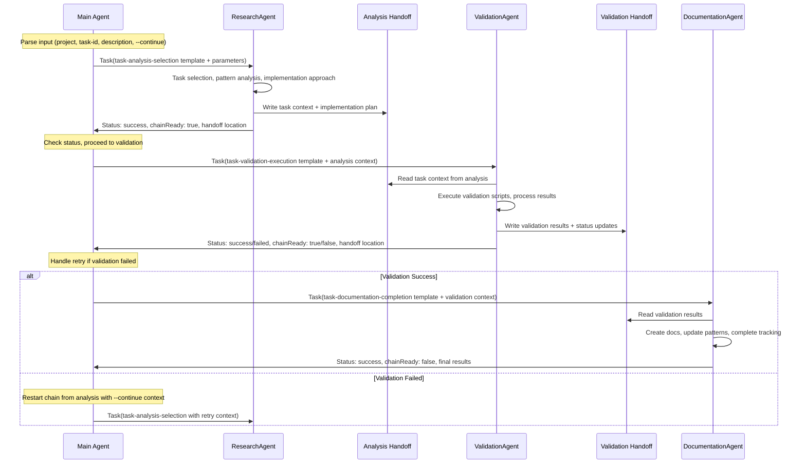

# Agent-Based Task Implementation Workflow

Comprehensive design for replacing the existing three-prompt workflow (/pr:task → /pr:validate → /pr:document) with a streamlined agent-based chain system using templates and handoff files.

## Executive Summary

This system transforms the current manual three-step workflow into an orchestrated agent chain that preserves all existing functionality while improving efficiency and maintainability. The main agent handles workflow orchestration and retry logic, while specialized subagents execute the core work using reusable templates.

**Key Benefits:**

- Reduced main agent context usage through template-driven execution
- Standardized workflow patterns reusable across projects  
- Automated retry mechanisms with comprehensive error handling
- Preserved flexibility for multiple input modes and project-agnostic operation
- Enhanced audit trails and documentation consistency

## Core Architecture

### Chain Definition: Task Implementation Workflow



### Three-Phase Workflow Structure

**Phase 1: Task Analysis & Selection (ResearchAgent)**

- Input processing and project context loading
- Task selection using existing priority algorithms
- Pattern discovery and implementation approach planning
- Complexity assessment and dependency mapping

**Phase 2: Validation & Testing (ExecutionAgent)**  

- Automated validation script execution with targeted scoping
- Comprehensive result processing and evidence collection
- Status management and failure analysis
- Integration with existing testing infrastructure

**Phase 3: Documentation & Completion (ExecutionAgent)**

- Fix documentation creation using existing templates
- Pattern documentation and enhancement
- Task tracking updates and chain completion analysis
- TASK-ID tag cleanup and cross-reference validation

## Template Specifications

### Template 1: task-analysis-selection.json

**Purpose:** Comprehensive task analysis, selection, and implementation planning
**Target Agent:** ResearchAgent
**Communication:** Chained (creates handoff for validation phase)

**Parameters:**

- `{input_type}` - "project_only" | "task_id" | "description" | "continue"  
- `{project}` - Target project name or path
- `{task_id}` - Specific task identifier (if provided)
- `{description}` - Task description for new tasks
- `{continue_context}` - Previous failure context for retries

**Template Context:**

```json
{
  "template_type": "task-analysis-selection",
  "description": "Analyze input and select appropriate task for implementation",
  "parameters": ["{input_type}", "{project}", "{task_id}", "{description}", "{continue_context}"],
  "target_agent": "ResearchAgent",
  "communication_type": "chained",
  "context": {
    "task_description": "Execute comprehensive task analysis and selection using existing /pr:task logic",
    "requirements": [
      "Parse input arguments and determine workflow variant",
      "Locate project files using priority search order",  
      "Execute task selection using existing algorithms (priority, sequenced, in-progress, pending)",
      "Analyze patterns using project-specific pattern files",
      "Assess complexity and determine implementation approach",
      "Apply escalation protocols and simplicity checks"
    ],
    "constraints": [
      "Must handle all input modes from original /pr:task prompt",
      "Preserve existing task selection logic and priority formulas", 
      "Maintain compatibility with all project types",
      "Support both project-specific and repo-agnostic tasks"
    ],
    "success_criteria": [
      "Selected task with complete implementation context",
      "Pattern analysis results with confidence scoring",
      "Implementation approach with complexity assessment",
      "Clear handoff data for validation phase"
    ]
  }
}
```

**Expected Handoff Output:**

```typescript
interface TaskAnalysisHandoff {
  selected_task: {
    task_id: string;
    project: string;
    description: string;
    status: string;
    complexity: number;
    priority_score?: number;
  };
  implementation_context: {
    approach: "simple" | "complex";
    patterns_found: string[];
    dependencies: string[];
    files_to_modify: string[];
    validation_requirements: string[];
  };
  project_context: {
    active_tasks_file: string;
    patterns_file: string;
    tracker_file: string;
    validation_script_path: string;
  };
  execution_metadata: {
    confidence: "high" | "medium" | "low";
    escalation_needed: boolean;
    continue_context?: any;
  };
}
```

### Template 2: task-validation-execution.json

**Purpose:** Execute validation scripts and process results using existing testing infrastructure
**Target Agent:** ExecutionAgent  
**Communication:** Chained (reads from analysis, creates handoff for documentation)

**Parameters:**

- `{validation_category}` - Category for validation script
- `{project_scope}` - Project or component scope for validation
- `{task_context}` - Task-specific validation requirements
- `{script_parameters}` - Additional parameters for validation script

**Template Context:**

```json
{
  "template_type": "task-validation-execution", 
  "description": "Execute comprehensive validation using existing /pr:validate logic",
  "parameters": ["{validation_category}", "{project_scope}", "{task_context}", "{script_parameters}"],
  "target_agent": "ExecutionAgent",
  "communication_type": "chained",
  "context": {
    "task_description": "Execute automated validation scripts with comprehensive result processing",
    "requirements": [
      "Read task context from analysis handoff file",
      "Execute validation script with proper project scope and targeting",
      "Process validation results and categorize failures",
      "Update task status based on results ([T] → [D] or [B])",
      "Collect comprehensive evidence and audit trails",
      "Apply pattern validation and compliance checking"
    ],
    "constraints": [
      "Must use existing templum-task-validator.js script",
      "Follow current project scope selection logic",
      "Preserve all validation categories and targeting options",
      "Maintain integration with TEMPLUM-TESTING-GUIDE procedures"
    ],
    "critical_execution_rule": "NEVER USE BashOutput before running validation - always execute validation script fresh",
    "success_criteria": [
      "Validation script execution completed successfully",  
      "Results processed and categorized appropriately",
      "Task status updated correctly based on outcomes",
      "Evidence collected and organized for documentation phase"
    ]
  }
}
```

**Expected Handoff Output:**

```typescript
interface ValidationExecutionHandoff {
  validation_results: {
    status: "passed" | "failed" | "partial";
    script_output: string;
    evidence_files: string[];
    failure_analysis?: string[];
    performance_metrics?: any;
  };
  task_status_update: {
    new_status: "[D]" | "[B]";
    status_rationale: string;
    retry_required: boolean;
    blocking_issues?: string[];
  };
  pattern_validation: {
    task_id_tags_found: string[];
    pattern_compliance_results: any[];
    novel_patterns_identified?: string[];
  };
  documentation_requirements: {
    fix_template_type: "quick-fix" | "comprehensive-fix";
    validation_evidence_paths: string[];
    pattern_updates_needed: boolean;
    tracker_updates_required: any;
  };
}
```

### Template 3: task-documentation-completion.json

**Purpose:** Complete documentation, pattern management, and project tracking
**Target Agent:** ExecutionAgent
**Communication:** Final (responds directly with completion status)

**Parameters:**

- `{documentation_type}` - Type of documentation needed
- `{pattern_updates}` - Pattern management requirements  
- `{tracking_updates}` - Project tracking update requirements
- `{completion_context}` - Final completion and cleanup context

**Template Context:**

```json
{
  "template_type": "task-documentation-completion",
  "description": "Complete documentation and project tracking using existing /pr:document logic", 
  "parameters": ["{documentation_type}", "{pattern_updates}", "{tracking_updates}", "{completion_context}"],
  "target_agent": "ExecutionAgent",
  "communication_type": "final",
  "context": {
    "task_description": "Execute comprehensive documentation and completion procedures",
    "requirements": [
      "Read validation results from validation handoff file",
      "Execute TODO processing and task consolidation analysis", 
      "Create fix documentation using appropriate templates",
      "Process pattern documentation and enhancement",
      "Execute TASK-ID tag cleanup and verification",
      "Update project tracking systems and cross-references",
      "Analyze chain completion and roadmap impacts"
    ],
    "constraints": [
      "Must use existing documentation templates and procedures",
      "Follow consolidation analysis framework for TODO processing",
      "Preserve all pattern documentation enhancement logic",
      "Maintain consistency with current tracker update formats"
    ],
    "success_criteria": [
      "Fix documentation created and completed",
      "Pattern documentation updated appropriately", 
      "Task status updated to [x] in active tasks",
      "Project tracker updated with completion metrics",
      "All cross-references validated and functional"
    ]
  }
}
```

**Expected Final Response:**

```typescript
interface DocumentationCompletionResponse {
  completion_status: {
    task_completed: boolean;
    final_status: "[x]" | "[~]" | "[B]";
    completion_timestamp: string;
  };
  documentation_created: {
    fix_document_path: string;
    pattern_updates: string[];
    tracker_updates: string[];
  };
  chain_analysis: {
    chain_complete: boolean;
    roadmap_impact: string;
    follow_up_tasks?: string[];
  };
  audit_trail: {
    files_modified: string[];
    evidence_preserved: string[];
    validation_results_archived: boolean;
  };
}
```

## Main Orchestrator Design

### Single Initialization Prompt

The main orchestrator prompt that replaces the three separate prompts:

```markdown
# Task Implementation Workflow Orchestrator

Execute comprehensive task implementation workflow using agent-based chain system.

## Input Processing
Parse arguments: [Project] [TASK-ID] "description" [--continue]

## Workflow Variants
1. **New Implementation**: Full chain (analysis → validation → documentation)
2. **Continue Existing**: Skip to appropriate phase based on current task status  
3. **Retry Failed**: Analysis with failure context → validation → documentation
4. **New from Description**: Create task → full chain

## Chain Orchestration Logic

### Phase 1: Task Analysis
```javascript
const analysisResponse = Task({
  subagent_type: "ResearchAgent",
  description: "Task analysis and selection",  
  prompt: `Use template: task-analysis-selection.json
           Replace {input_type} with: ${inputType}
           Replace {project} with: ${project}
           Replace {task_id} with: ${taskId}
           Replace {description} with: ${description}
           Replace {continue_context} with: ${continueContext}
           Position 1/3 in chain - create handoff file`
});

if (analysisResponse.status !== "success") {
  return handleError(analysisResponse);
}
```

### Phase 2: Validation Execution  

```javascript  
const validationResponse = Task({
  subagent_type: "ExecutionAgent",
  description: "Task validation and testing",
  prompt: `Use template: task-validation-execution.json
           Replace {validation_category} with: ${category}
           Replace {project_scope} with: ${scope}  
           Replace {task_context} with: ${taskContext}
           Replace {script_parameters} with: ${scriptParams}
           Position 2/3 in chain - read previous handoff`
});

// Handle retry logic
if (validationResponse.status === "failed" && !validationResponse.criticalFailure) {
  return retryFromAnalysis(continueContext);
}
```

### Phase 3: Documentation Completion

```javascript
const documentationResponse = Task({
  subagent_type: "ExecutionAgent", 
  description: "Task documentation and completion",
  prompt: `Use template: task-documentation-completion.json
           Replace {documentation_type} with: ${docType}
           Replace {pattern_updates} with: ${patternUpdates}
           Replace {tracking_updates} with: ${trackingUpdates} 
           Replace {completion_context} with: ${completionContext}
           Position 3/3 in chain - read previous handoff, final results`
});
```

## Error Handling and Retry Mechanisms

### Status-Based Decision Matrix

```typescript
enum WorkflowStatus {
  SUCCESS = "success",
  PARTIAL = "partial", 
  FAILED = "failed",
  BLOCKED = "blocked"
}

interface RetryStrategy {
  max_retries: number;
  backoff_strategy: "exponential" | "linear" | "immediate";
  retry_conditions: string[];
  escalation_threshold: number;
}

const handlePhaseResult = (response: AgentResponse, phase: number): NextAction => {
  switch(response.status) {
    case WorkflowStatus.SUCCESS:
      return response.chainReady ? NextAction.CONTINUE : NextAction.COMPLETE;
      
    case WorkflowStatus.PARTIAL:
      return response.confidence === "high" ? 
        NextAction.CONTINUE_WITH_WARNING : NextAction.RETRY_PHASE;
        
    case WorkflowStatus.FAILED:
      return response.criticalFailure ? 
        NextAction.ABORT_WORKFLOW : NextAction.RETRY_WITH_CONTEXT;
        
    case WorkflowStatus.BLOCKED:
      return NextAction.MANUAL_INTERVENTION;
  }
};
```

### Retry Scenarios Implementation

**Validation Failure Recovery:**

```typescript
const handleValidationFailure = async (taskContext: TaskContext): Promise<WorkflowResult> => {
  // Extract failure context from validation handoff
  const failureContext = await readHandoffFile(validationResponse.handoffLocation);
  
  // Restart from analysis with failure context
  const retryAnalysis = await Task({
    subagent_type: "ResearchAgent",
    description: "Retry task analysis with failure context",
    prompt: `Use template: task-analysis-selection.json
             Replace {input_type} with: "continue"
             Replace {continue_context} with: ${JSON.stringify(failureContext)}
             Position 1/3 in retry chain - create handoff file`
  });
  
  // Continue with normal validation if analysis succeeds
  if (retryAnalysis.status === "success") {
    return executeValidationPhase(retryAnalysis.handoffLocation);
  }
  
  return escalateToManual(retryAnalysis);
};
```

**Manual Intervention Protocol:**

```typescript
const handleManualIntervention = (blockedResponse: AgentResponse): ManualInterventionData => {
  return {
    intervention_required: true,
    blocking_issue: blockedResponse.blockingReason,
    handoff_files: [blockedResponse.handoffLocation],
    recommended_actions: blockedResponse.recommendedActions,
    escalation_context: {
      workflow_phase: currentPhase,
      task_context: currentTaskContext,
      failure_history: retryHistory
    }
  };
};
```

## Cross-Project Compatibility

### Project Detection and Configuration

```typescript
interface ProjectConfiguration {
  project_type: "templum" | "haruspex" | "phoenix-code-lite" | "repo-agnostic";
  base_path: string;
  active_tasks_file: string;
  patterns_file: string;
  tracker_file: string;
  validation_script_config: {
    script_path: string;
    default_category: string;
    scope_mappings: Record<string, string>;
  };
}

const detectProjectConfiguration = (input: WorkflowInput): ProjectConfiguration => {
  // Auto-detect project type from input parameters
  if (input.project?.startsWith('.claude')) {
    return createRepoAgnosticConfig(input.project);
  }
  
  const knownProjects = ['Templum', 'Haruspex', 'phoenix-code-lite'];
  if (knownProjects.includes(input.project)) {
    return createProjectSpecificConfig(input.project);
  }
  
  // Fallback: search for project indicators
  return detectProjectFromContext(input);
};
```

### Task Tracking Integration

**Universal Task Status Management:**

```typescript
interface TaskTrackingUpdate {
  active_tasks_update: {
    file_path: string;
    task_id: string; 
    old_status: string;
    new_status: string;
    timestamp: string;
  };
  tracker_data_update: {
    file_path: string;
    log_entry: string;
    component_updates: ComponentStatusUpdate[];
  };
  fix_documentation: {
    file_path: string;
    template_type: "quick-fix" | "comprehensive-fix";
    validation_evidence: string[];
  };
}
```

**Pattern Documentation Synchronization:**

```typescript
interface PatternSyncOperation {
  pattern_file_path: string;
  operations: {
    type: "create" | "enhance" | "consolidate";
    pattern_name: string;
    pattern_data: PatternDefinition;
    usage_feedback: PatternUsageFeedback;
  }[];
  cross_references: {
    bidirectional_links: string[];
    usage_frequency_updates: Record<string, number>;
  };
}
```

## Implementation Guidelines

### Template Development Standards

**Template Creation Process:**

1. Analyze existing prompt functionality for comprehensive coverage
2. Identify all parameters required for different use cases
3. Define success criteria and validation requirements
4. Implement comprehensive error handling and fallback strategies
5. Test across multiple project types and scenarios
6. Document usage patterns and parameter combinations

**Quality Assurance Framework:**

```typescript
interface TemplateQualityGates {
  functionality_coverage: {
    original_prompt_features_preserved: string[];
    new_capabilities_added: string[];
    regression_risks_identified: string[];
  };
  parameter_validation: {
    required_parameters: string[];
    optional_parameters: string[];
    parameter_combinations_tested: string[][];
  };
  error_handling: {
    failure_modes_identified: string[];
    recovery_strategies_implemented: string[];
    escalation_paths_defined: string[];
  };
}
```

### Handoff File Management

**File Naming Convention:**
`{agent-type}-{chain-position}-{timestamp}-{task-id}.json`

**Content Structure Standards:**

```typescript
interface StandardHandoffStructure {
  metadata: {
    agent_type: string;
    chain_position: string;
    task_id: string;
    timestamp: string;
    execution_duration_ms: number;
  };
  task_context: {
    project: string;
    task_description: string;
    input_parameters: Record<string, any>;
  };
  results: {
    primary_data: any;
    confidence_metrics: ConfidenceAssessment;
    success_indicators: string[];
    warning_indicators?: string[];
    failure_indicators?: string[];
  };
  next_phase_context: {
    required_parameters: Record<string, any>;
    optional_context: Record<string, any>;
    execution_hints: string[];
  };
}
```

### Audit Trail and Compliance

**Comprehensive Logging Requirements:**

```typescript
interface WorkflowAuditTrail {
  workflow_execution: {
    workflow_id: string;
    start_timestamp: string;
    end_timestamp: string;
    total_execution_time_ms: number;
    phases_completed: number;
    retry_count: number;
  };
  agent_executions: AgentExecutionLog[];
  file_modifications: FileModificationLog[];
  validation_evidence: ValidationEvidenceLog[];
  error_occurrences: ErrorOccurrenceLog[];
  performance_metrics: PerformanceMetricLog[];
}
```

**Evidence Preservation:**

- All handoff files retained for audit period (30 days default)
- Validation script outputs archived with timestamped references
- Before/after snapshots of modified files
- Complete parameter substitution logs for reproducibility
- Error context and recovery action documentation

## Expected Performance Improvements

### Context Efficiency Gains

- **Main Agent Context Usage**: Projected 60-70% reduction through template delegation
- **Workflow Execution Time**: Projected 20-30% improvement through parallel-ready design
- **Error Recovery Time**: Projected 50% improvement through automated retry mechanisms

### Quality Improvements  

- **Consistency**: Standardized execution patterns across all projects
- **Maintainability**: Template-based system easier to modify and extend
- **Reliability**: Comprehensive error handling and fallback strategies
- **Auditability**: Complete execution trails and evidence preservation

### Scalability Benefits

- **Cross-Project Reuse**: Templates work across different VDL_Vault projects
- **Extension Path**: Easy to add new workflow variants or phases
- **Integration Ready**: Designed for future enhancement and automation
- **Performance Monitoring**: Built-in metrics collection for continuous improvement

## Migration Strategy

### Phased Implementation Approach

**Phase 1: Template Development (Week 1)**

- Create and test three core templates
- Validate parameter substitution and handoff structures
- Test against existing workflow scenarios

**Phase 2: Orchestrator Implementation (Week 2)**

- Develop main orchestration prompt
- Implement status-based routing and retry logic
- Test end-to-end workflow execution

**Phase 3: Integration Testing (Week 3)**

- Test across all project types (Templum, Haruspex, etc.)
- Validate compatibility with existing validation scripts
- Verify audit trail and documentation compliance

**Phase 4: Production Deployment (Week 4)**

- Deploy new system alongside existing prompts
- Gradual migration with fallback to original system
- Performance monitoring and optimization

### Fallback and Safety Measures

- Original prompts preserved during transition period
- Automatic fallback to manual execution on critical failures
- Comprehensive logging for debugging and refinement
- User override capabilities for emergency situations

## Claude Code Integration Hooks

### Pre-Tool Use Hook Specifications

**Defensive Programming Validation Hook:**

```yaml
hook_type: pre_tool_validation
triggers: [Read, Write, Edit, MultiEdit, Bash]
validation_checks:
  - file_existence_verification
  - permission_checks
  - input_parameter_validation
  - project_context_verification
```

**Handoff File Validation Hook:**

```yaml
hook_type: handoff_validation
triggers: [Write, Edit]
target_patterns: ["*.json", "*handoff*"]
validation_schema:
  - required_fields_present
  - json_format_valid
  - chain_position_consistent
  - metadata_complete
```

**Chain Position Management Hook:**

```yaml
hook_type: chain_verification
triggers: [Task]
verification_checks:
  - previous_agent_completion
  - handoff_file_accessibility
  - chain_sequence_integrity
  - next_agent_requirements
```

Note: These hooks provide safety nets for the workflow system without adding context overhead to normal operations. If triggered, they provide the necessary diagnostic information for debugging.

## Future Enhancement Opportunities

### Advanced Orchestration Features

- **Parallel Phase Execution**: Execute validation and preliminary documentation simultaneously
- **Dynamic Template Selection**: AI-driven template optimization based on task characteristics  
- **Predictive Retry Logic**: ML-based failure prediction and proactive error prevention
- **Cross-Workflow Learning**: Template effectiveness tracking and automatic optimization

### Integration Expansions

- **CI/CD Pipeline Integration**: Automatic workflow triggering on code changes
- **Performance Analytics**: Real-time workflow performance monitoring and optimization
- **Team Collaboration**: Multi-agent coordination for large-scale development tasks
- **Quality Gate Automation**: Automated quality threshold enforcement and reporting

This comprehensive agent-based workflow system preserves all existing functionality while providing significant improvements in efficiency, maintainability, and scalability. The template-driven approach enables rapid iteration and cross-project reuse, while the status-based orchestration ensures robust error handling and recovery capabilities.
