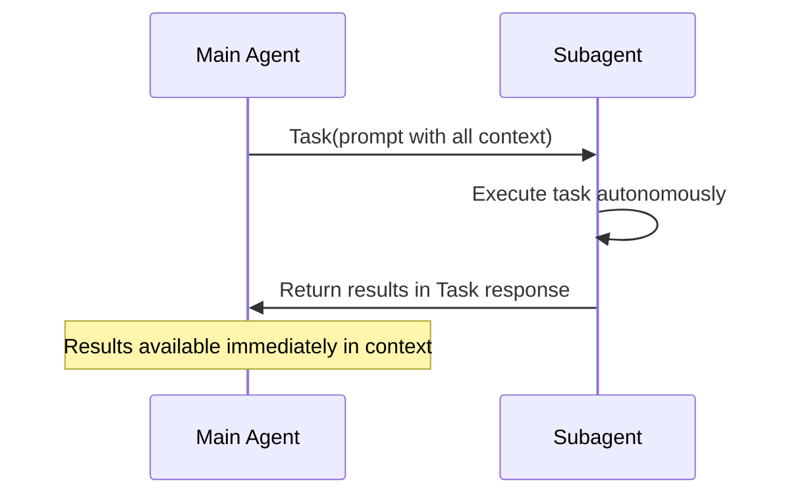
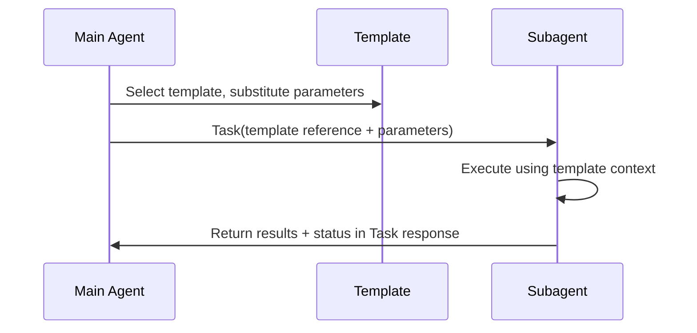
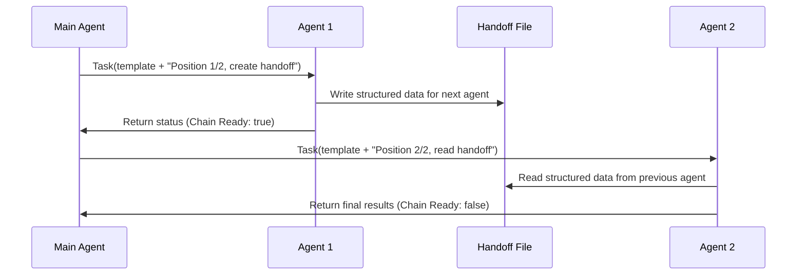

# Subagent Orchestration Guide

Operational guide for main agents to use the VDL_Vault subagent system effectively.

## Quick Decision Matrix

**Choose your approach:**

- **Standalone Task**: Single agent, immediate results → Direct Task communication
- **Chained Workflow**: Multiple agents, structured data transfer → Template + Handoff files
- **Template Available**: Common task pattern → Use parameterized template
- **Custom Task**: Unique requirements → Custom Task prompt

## Core Communication Patterns

### Pattern 1: Direct Task Communication (Standalone)



**Use when**: Single agent can complete entire task, results needed in main agent context

### Pattern 2: Template + Direct Communication



**Use when**: Common task pattern exists, results needed directly

### Pattern 3: Chained Workflow with Templates



**Use when**: Multi-step workflow with structured data transfer between agents

## Template System

### Template Usage

**Template Location**: `.claude/agents/prompts/index.md` - Browse available templates

**Basic Template Usage**:

```markdown
Task(
  subagent_type="Execution Agent",
  description="Update pattern frontmatter", 
  prompt="Use template: frontmatter-update.json
         Replace {filepath} with: /path/to/target/file
         This is standalone - respond directly"
)
```

### Status Response Format

Every subagent returns this status block for orchestration:

```markdown
## Execution Status
- **Status**: success | partial | failed | blocked
- **Chain Position**: 1/3 | 2/3 | standalone 
- **Chain Ready**: true | false
- **Critical Failure**: true | false
- **Handoff Location**: /path/to/handoff.json | "direct_response"
- **Next Action**: continue | retry | skip | abort | manual_intervention
- **Confidence**: high | medium | low
```

## Handoff File Management

**Key Principle**: Main agents orchestrate using status responses only. Handoff files are for subagent-to-subagent communication.

**Main Agent Responsibilities**:

- Monitor chain progress via Task response status blocks
- Launch next agents based on status (success/failed/blocked)
- Read handoff files ONLY for error diagnosis and recovery
- Never read handoff files for normal chain orchestration

**Subagent Responsibilities**:

- Write handoff files with predictable naming: `{agent-type}-{position}-{timestamp}.json`
- Next agent automatically locates and reads previous handoff file
- Include handoff file location in Task response for error recovery

## Usage Examples

### Standalone Task Example

```javascript
// Main agent selects template and executes directly
Task(
  subagent_type="Execution Agent",
  description="Update pattern frontmatter",
  prompt=`Use template: frontmatter-update.json
          Replace {filepath} with: ${targetFile}
          This is standalone - respond directly`
)
// Results available immediately in Task response
```

### Chain Workflow Example  

```javascript
// Step 1: Launch first agent in chain
const step1Response = Task(
  subagent_type="Analysis Agent", 
  description="Analyze validation requirements",
  prompt=`Use template: validation-analysis.json
          Replace {project} with: ${projectName}
          Position 1/3 in chain - create handoff file`
)

// Check status, proceed only if successful
if (step1Response.status === "success" && step1Response.chainReady === true) {
  
  // Step 2: Launch next agent (finds handoff automatically)
  const step2Response = Task(
    subagent_type="Execution Agent",
    description="Execute validation tests", 
    prompt=`Use template: test-execution.json
            Position 2/3 in chain - read previous handoff
            Create handoff for validation agent`
  )
  
  // Check status before final step
  if (step2Response.status === "success" && step2Response.chainReady === true) {
    
    // Step 3: Final validation and reporting
    Task(
      subagent_type="Validation Agent",
      description="Generate validation report",
      prompt=`Position 3/3 in chain - read previous handoff
              This is final step - respond with complete results`
    )
  }
}

// Main agent only reads handoff files for error diagnosis
if (step1Response.status === "failed") {
  const errorDetails = readHandoffFile(step1Response.handoffLocation);
  // Analyze error and decide recovery strategy
}
```

## Template Selection Guide

1. **Check Template Catalog**: Review `.claude/agents/prompts/index.md`
2. **Match Task Pattern**: Find template that matches your task requirements
3. **Parameter Substitution**: Identify required parameters from template
4. **Communication Method**: Decide standalone vs chained based on workflow complexity
5. **Status Monitoring**: Use returned status to manage chains and error handling

## Error Handling

### Status-Based Error Management

```javascript
const response = Task(/* ... */);

switch(response.status) {
  case "success":
    // Continue with next step or complete
    break;
    
  case "partial":
    // Decide if acceptable or needs retry
    if (response.confidence === "high") {
      // Continue with warning
    } else {
      // Retry or manual intervention
    }
    break;
    
  case "failed":
    if (response.criticalFailure === true) {
      // Abort chain, analyze handoff file
      const errorDetails = readHandoffFile(response.handoffLocation);
    } else {
      // Attempt recovery or alternative approach
    }
    break;
    
  case "blocked":
    // Manual intervention required
    // Check handoff file for blocking details
    break;
}
```

### Chain Management

- **Status Monitoring**: Check each agent's status response before proceeding to next step
- **Error Handling**: Use `Critical Failure: true` to abort chains, `partial` status to continue with warnings  
- **Handoff Files**: Subagent-to-subagent communication only - main agent reads only for error diagnosis
- **Parameter Flow**: Handoff files for structured data, Task prompts for execution context and chain position
- **Automatic Handoff Discovery**: Next agent finds previous handoff via predictable naming pattern

---

**For technical implementation details, see [TECHNICAL-SPEC.md](TECHNICAL-SPEC.md)**
