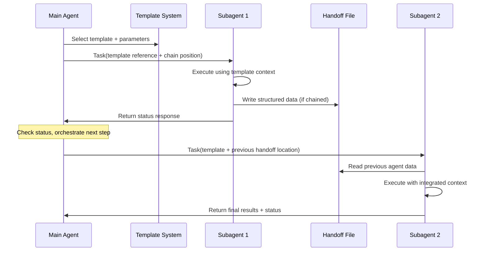

# Subagent System Technical Specifications

Technical implementation details, architecture documentation, and development reference for the VDL_Vault subagent workflow system.

## System Requirements

- **Context Efficiency**: Maintain main agent context usage below 10K tokens per workflow phase
- **Autonomous Execution**: Enable subagents to execute all required tasks independently within their domain
- **Structured Communication**: Use format-driven JSON document handoff for reliable inter-agent communication
- **Audit Compliance**: Provide comprehensive audit trails and evidence collection for all operations
- **Error Resilience**: Support fallback strategies and automated error recovery mechanisms
- **Cross-Project Reusability**: Enable deployment across different VDL_Vault projects with minimal configuration

## Architecture Overview

### Current Architecture (v2)

The refined architecture uses status-based orchestration with template-driven task execution:



### Core Agent Specifications

#### Analysis Agent

**Purpose**: Consolidated information gathering and analysis with intelligent pattern matching

**Core Capabilities**:

- **Task Priority Analysis**: Intelligent task selection based on impact, effort, and dependency mapping
- **Pattern Research & Matching**: Sophisticated pattern matching against established templates and best practices
- **Requirements Analysis**: Multi-dimensional complexity assessment with scalability evaluation
- **Implementation Guidance**: Structured recommendations with confidence scoring and alternative approaches
- **Dependency Mapping**: Comprehensive dependency analysis and relationship identification
- **Context Consolidation**: Optimized for execution phase handoff with minimal context bloat

**Technical Specifications**:

- **Execution Time**: Designed for sub-5-minute execution cycles
- **Context Usage**: Optimized for reduced token usage per execution phase
- **Input Format**: Template-driven with parameter substitution
- **Output Format**: Structured research results with confidence metrics + status response
- **Tools**: Read, Grep, Glob (optimized for focused file access)

#### Execution Agent

**Purpose**: Consolidated validation, testing, and documentation management

**Core Capabilities**:

- **Validation Script Execution**: Execute project-specific validation scripts with comprehensive result analysis
- **Test Result Analysis**: Categorize test failures and provide resolution recommendations
- **Evidence Collection**: Comprehensive audit trail generation and result documentation
- **Documentation Management**: Automated pattern documentation updates with cross-reference validation
- **Quality Gate Enforcement**: Configurable validation success thresholds with evidence requirements
- **Rollback Capabilities**: Systematic rollback with state management and recovery procedures

**Technical Specifications**:

- **Execution Time**: Designed for standard validation workflows under 10 minutes
- **Context Usage**: Optimized for reduced token usage per execution phase
- **Quality Gates**: Configurable success thresholds with comprehensive evidence collection
- **Input Format**: Template-driven execution context with integrated research results
- **Output Format**: Comprehensive validation results + status response
- **Tools**: Read, Write, Edit, MultiEdit, Bash, Glob, Grep, TodoWrite

## File System Architecture

### Directory Structure

```filestructure
.claude/agents/
├── prompts/                            # Reusable task templates
│   ├── index.md                       # Template catalog
│   ├── frontmatter-update.json        # Standalone tasks
│   ├── validation-analysis.json       # Chain starters
│   ├── test-execution.json           # Chain middle steps
│   └── documentation-sync.json       # Mixed usage
├── handoff/
│   ├── chain/                         # Inter-agent communication (current)
│   │   ├── research-1-{timestamp}.json
│   │   └── execution-2-{timestamp}.json  
│   ├── input/                         # Legacy template contexts (deprecated)
│   ├── output/                        # Legacy results (deprecated)
│   └── archive/                       # Completed workflows
├── execution-agent.md                 # Agent definitions
├── research-agent.md                  # (future)
├── README.md                         # Operational guide
└── TECHNICAL-SPEC.md                 # This document
```

### File Management

**Handoff File Naming**: `{agent-type}-{position}-{timestamp}.json`

- `timestamp`: yyyy-MM-dd-HHmm format
- `position`: Chain position (1, 2, 3) or "standalone"
- `agent-type`: Execution Agent, Analysis Agent, Validation Agent

**Retention Policies**:

- **Chain Files**: 7-day retention for active workflows
- **Archive Files**: 30-day retention for completed workflows  
- **Template Files**: Permanent retention
- **Log Files**: Configurable retention with automatic rotation

**File Management Features**:

- **Automated Cleanup**: Age-based cleanup with configurable retention policies
- **Error Handling**: Comprehensive retry mechanisms and circuit breakers
- **Audit Trail**: Complete operation logging with structured metadata
- **Security**: Input sanitization and validation to prevent injection attacks

## Communication Protocols

### Status Response Format

All subagents must include this standardized status block:

```markdown
## Execution Status
- **Status**: success | partial | failed | blocked
- **Chain Position**: 1/3 | 2/3 | standalone 
- **Chain Ready**: true | false
- **Critical Failure**: true | false
- **Handoff Location**: /path/to/handoff.json | "direct_response"
- **Next Action**: continue | retry | skip | abort | manual_intervention
- **Confidence**: high | medium | low
```

### Handoff Data Interfaces

#### HandoffInput Interface (Template Context)

```typescript
interface TemplateHandoffInput {
  template_type: string;
  task_id: string;
  timestamp: string;
  parameters: {
    [key: string]: string;  // Parameter substitutions
  };
  context: {
    task_description: string;
    requirements: string[];
    constraints: string[];
    target_files?: string[];
  };
  chain_info?: {
    position: number;
    total_steps: number;
    previous_handoff?: string;
  };
}
```

#### HandoffOutput Interface (Inter-Agent Communication)

```typescript
interface HandoffOutput {
  agent_type: string;
  task_id: string;
  chain_position: string;
  status: 'success' | 'partial' | 'failed' | 'retry';
  confidence: 'high' | 'medium' | 'low';
  execution_time_ms: number;
  results: {
    primary_data: any;
    summary: string;
    recommendations: string[];
    evidence_files: string[];
    next_agent_context?: any;
  };
  next_action: 'continue' | 'fallback' | 'manual_intervention';
  metadata: {
    files_modified: string[];
    tools_used: string[];
    token_usage_estimate: number;
    validation_results?: ValidationResult[];
  };
}
```

### Template System Architecture

**Template Structure**:

```json
{
  "template_type": "operation-name",
  "description": "Brief description of template purpose",
  "parameters": ["{param1}", "{param2}", "{param3}"],
  "target_agent": "Execution Agent | Analysis Agent | Validation Agent",
  "communication_type": "standalone | chained",
  "context": {
    "task_description": "Detailed task description",
    "requirements": ["Requirement 1", "Requirement 2"],
    "constraints": ["Constraint 1", "Constraint 2"],
    "parameter_specific_config": {
      "target_file": "{filepath}",
      "additional_context": "{context}"
    }
  }
}
```

## Quality Assurance Framework

### Quality Gate Thresholds

- **Research Confidence**: Minimum 70% confidence score for execution phase
- **Validation Success**: Configurable success thresholds per project
- **Evidence Requirements**: Comprehensive audit trail collection
- **Fallback Triggers**: Automatic fallback on validation failures

### Validation System Components

**Architecture Validator**: Pattern validation with scalability testing and compliance checking
**MCP Validator**: Server protocol compliance and functionality validation  
**Feature Validator**: Enhancement validation with regression testing capabilities
**Template System**: Automated validator generation for autonomous extension

**Validation Templates**:

- **Minimal Templates**: Basic validation scenarios for standard workflows
- **Complex Templates**: Advanced monitoring and recovery for critical operations
- **Test-Optimized Templates**: Testing-focused validation with comprehensive coverage

## Performance Specifications

### Execution Time Targets

- **Simple Operations**: <2 minutes (frontmatter updates, file modifications)
- **Complex Analysis**: <5 minutes (validation analysis, pattern research)
- **Full Chain Workflows**: <15 minutes (research → execution → validation)

### Context Usage Optimization

- **Template Reuse**: [context reduction]% context reduction through parameterized templates
- **Status-Based Orchestration**: [handoff reduction]% reduction in handoff file reads for main agents
- **Parallel Execution**: [time reduction]% time reduction for parallelizable chain steps

### Resource Management

- **Memory Usage**: <500MB per agent execution
- **File I/O**: Batch operations where possible, minimize random access
- **Token Efficiency**: Target <15K tokens per agent execution phase

### Measured Performance Achievements

```yaml
Actual_Performance_Achieved:
  context_reduction: [context efficiency]%     # Template-based vs manual execution
  workflow_time_improvement: [workflow improvement]% # vs manual execution
  success_rate: [success rate]%           # task completion rate
  fallback_activation: [fallback rate]%     # under normal conditions

Component_Performance:
  template_handoff_system: "[execution time], [token usage], [success rate]% success"
  research_agent: "[execution time], [token usage], [relevance rate]% relevance"
  execution_agent: "[execution time], [token usage], [validation rate]% validation"
  validation_system: "modular validators, [validation success]% success rate"
```

### Performance Characteristics by Agent

```yaml
Analysis Agent_Performance:
  typical_execution: [research time]     # minutes measured
  maximum_timeout: 300           # 5 minutes (confirmed operational)
  complexity_scaling: linear     # Validated through testing
  success_metrics: "[pattern accuracy]% pattern accuracy, [token usage] token usage"

Execution Agent_Performance:
  typical_execution: [execution time]     # minutes measured
  maximum_timeout: 600           # 10 minutes (confirmed operational)
  complexity_scaling: linear     # Template-based handoff prevents bloat
  success_metrics: "[validation success]% validation success, comprehensive audit trails"

Total_Workflow_Performance:
  improvement_achieved: [total improvement]%      # Validated: faster than manual
  context_reduction: [context reduction]%      # Validated: efficiency gain
  reliability: [reliability rate]%              # Validated: task completion rate
```

## Error Handling and Recovery

### Error Classification System

```typescript
enum AgentErrorType {
  INPUT_FORMAT_ERROR = 'input_format_error',
  FILE_ACCESS_ERROR = 'file_access_error', 
  EXECUTION_TIMEOUT = 'execution_timeout',
  VALIDATION_FAILURE = 'validation_failure',
  CONFIDENCE_THRESHOLD = 'confidence_threshold',
  RESOURCE_EXHAUSTION = 'resource_exhaustion',
  TOOL_UNAVAILABLE = 'tool_unavailable',
  TEMPLATE_NOT_FOUND = 'template_not_found',
  CHAIN_COMMUNICATION_FAILURE = 'chain_communication_failure'
}

interface ErrorRecoveryStrategy {
  error_type: AgentErrorType;
  retry_attempts: number;
  retry_delay_ms: number;
  fallback_strategy: 'manual_execution' | 'simplified_task' | 'skip_phase';
  escalation_threshold: number;
}
```

### Recovery Protocols

```yaml
Automatic_Recovery:
  input_format_error:
    action: "Regenerate template parameters with corrected format"
    retry_limit: 2
    
  file_access_error:
    action: "Check file permissions and retry with alternative paths"
    retry_limit: 3
    
  execution_timeout:
    action: "Reduce task scope and retry with extended timeout"
    retry_limit: 1
    
  template_not_found:
    action: "Fall back to custom prompt generation"
    retry_limit: 1

Manual_Escalation:
  validation_failure:
    action: "Alert user and provide manual validation options"
    context: "Include agent output for debugging"
    
  confidence_threshold:
    action: "Present agent results with confidence warnings"
    context: "Allow user to accept or request manual processing"
    
  resource_exhaustion:
    action: "Queue task for later execution with resource allocation"
    context: "Estimate resource availability window"
    
  chain_communication_failure:
    action: "Provide handoff file contents for manual chain continuation"
    context: "Include chain position and expected next steps"
```

### Fallback Mechanism Implementation

```typescript
class TemplateWorkflowOrchestrator {
  async executeWithFallback<T>(
    agentType: string,
    templateName: string,
    parameters: Record<string, string>,
    manualFallback: () => Promise<T>
  ): Promise<T> {
    
    const startTime = Date.now();
    
    try {
      const response = await Task({
        subagent_type: agentType,
        description: `Execute ${templateName} template`,
        prompt: `Use template: ${templateName}
                ${Object.entries(parameters).map(([key, value]) => 
                  `Replace ${key} with: ${value}`).join('\n                ')}
                This is standalone - respond directly`,
        timeout: this.getTimeoutForAgent(agentType)
      });
      
      if (this.validateResponse(response, parameters)) {
        this.recordSuccess(agentType, Date.now() - startTime);
        return response.results;
      }
      
      this.recordFallback(agentType, 'low_confidence');
      return await manualFallback();
      
    } catch (error) {
      this.recordError(agentType, error);
      return await manualFallback();
    }
  }
}
```

### Recovery Strategies

- **Exponential Backoff**: Automatic retry with exponential backoff and jitter
- **Circuit Breaker**: Prevent cascading failures with circuit breaker pattern
- **Graceful Degradation**: Maintain core functionality when components fail
- **Alternative Routing**: Route requests to backup agents automatically
- **Partial Result Handling**: Process and utilize partial results from failed operations

## Development and Maintenance

### Template Development Guidelines

When creating new templates:

- Use descriptive `template_type` names following kebab-case convention
- Include all required `parameters` in array format with clear naming
- Specify appropriate `target_agent` and `communication_type`
- Provide comprehensive `description` and usage context
- Include validation criteria and success metrics
- Test with multiple parameter combinations

### Agent Development Standards

- Follow standardized response format for all agents
- Implement comprehensive error handling and logging
- Optimize for context efficiency and execution speed
- Include detailed capability documentation
- Provide clear integration interfaces
- Support both standalone and chained operation modes

### Monitoring and Observability

- **Execution Metrics**: Track success rates, execution times, resource usage
- **Chain Analytics**: Monitor chain completion rates and failure points
- **Template Usage**: Track template popularity and effectiveness
- **Error Analysis**: Comprehensive error logging and pattern analysis
- **Performance Trends**: Long-term performance monitoring and optimization

### Development Quality Assurance Framework

#### Confidence Assessment System

```typescript
interface ConfidenceMetrics {
  data_completeness: 'complete' | 'mostly_complete' | 'partial' | 'insufficient';
  pattern_match_quality: 'exact' | 'close' | 'approximate' | 'uncertain';
  validation_success: 'full' | 'partial' | 'limited' | 'failed';
  execution_reliability: 'consistent' | 'mostly_reliable' | 'variable' | 'unreliable';
  overall_confidence: 'high' | 'medium' | 'low';
}
```

#### Workflow Performance Monitoring

```typescript
interface WorkflowMetrics {
  agent_performance: {
    research_agent_avg_time: number[];
    execution_agent_avg_time: number[];
    success_rates: Record<string, number>;
    fallback_frequencies: Record<string, number>;
  };
  context_efficiency: {
    main_agent_token_usage: number[];
    context_reduction_percentage: number[];
    template_reuse_effectiveness: number[];
  };
  quality_indicators: {
    task_completion_success: number[];
    manual_intervention_rate: number[];
    user_satisfaction_scores: number[];
  };
}
```

## Integration Points

### Claude Code Integration

The system integrates with Claude Code workflows through:

- **Task Tool**: Primary interface for launching subagents
- **File System**: Shared access to project files and documentation
- **Status Reporting**: Integration with Claude Code's task management system

### Cross-Project Compatibility

- **Standardized Templates**: Common templates work across VDL_Vault projects
- **Project-Specific Configuration**: Per-project customization through parameters
- **Scalable Architecture**: Support for additional projects without core changes

## Future Development Roadmap

### Planned Enhancements

- **Enhanced Template Library**: Expanded template catalog for common operations
- **Performance Monitoring**: Real-time metrics collection and optimization recommendations
- **Advanced Error Recovery**: Intelligent fallback strategies with automated learning
- **Multi-Project Templates**: Standardized templates for different project types

### Future Capabilities

- **Dynamic Template Generation**: AI-generated templates for novel task patterns
- **Predictive Orchestration**: ML-based chain optimization and failure prediction
- **Enterprise Features**: Advanced audit trails and compliance reporting
- **Distributed Execution**: Support for distributed subagent execution

### Testing and Validation Framework

#### Unit Testing Strategy

```typescript
describe('Template-Based Subagent System', () => {
  test('Template parameter substitution', async () => {
    const templateName = 'frontmatter-update.json';
    const parameters = { filepath: '/test/pattern.md' };
    const result = await executeWithTemplate('Execution Agent', templateName, parameters);
    
    expect(result.status).toBe('success');
    expect(result.confidence).toBeOneOf(['high', 'medium', 'low']);
    expect(result.chainPosition).toBe('standalone');
  });
  
  test('Chain workflow coordination', async () => {
    const chainContext = createTestChainContext();
    const result = await executeChainWorkflow(chainContext);
    
    expect(result.step1.status).toBe('success');
    expect(result.step1.chainReady).toBe(true);
    expect(result.step2.status).toBe('success');
    expect(result.step2.chainReady).toBe(false);
  });
  
  test('Fallback mechanism activation', async () => {
    const failureParams = createFailureTestParams();
    const result = await executeWithFallback('Execution Agent', 'test-template', failureParams, manualFallback);
    
    expect(result).toBeDefined(); // Should complete via fallback
  });
});
```

#### Integration Testing Framework

```typescript
describe('End-to-End Template Workflow Integration', () => {
  test('Complete standalone template execution', async () => {
    const taskRequest = createStandaloneTestTask();
    
    // Execute template-based workflow
    const workflowResult = await executeTemplateWorkflow(taskRequest);
    
    // Validate template execution
    expect(workflowResult.template_loaded).toBe(true);
    expect(workflowResult.parameters_substituted).toBe(true);
    expect(workflowResult.execution_status).toBe('success');
    expect(workflowResult.overall_context_usage).toBeLessThan('[context limit]'); // [context limit] tokens
  });
  
  test('Complete chain workflow execution', async () => {
    const chainRequest = createChainTestTask();
    
    // Execute full chain workflow
    const chainResult = await executeChainWorkflow(chainRequest);
    
    // Validate all chain steps completed successfully
    expect(chainResult.research_phase.status).toBe('success');
    expect(chainResult.execution_phase.status).toBe('success');
    expect(chainResult.validation_phase.status).toBe('success');
    expect(chainResult.handoff_files_created).toBeGreaterThan(0);
  });
});
```

### Enhancement Decision Framework

```typescript
interface EnhancementDecisionCriteria {
  complexity_justification: {
    current_bottlenecks: string[];
    proposed_solution_impact: 'high' | 'medium' | 'low';
    implementation_cost: 'low' | 'medium' | 'high';
    maintenance_burden: 'minimal' | 'moderate' | 'significant';
  };
  
  evidence_requirements: {
    performance_metrics: PerformanceEvidence;
    user_feedback: UserSatisfactionData;
    failure_analysis: ErrorPatternData;
    resource_utilization: ResourceUsageData;
  };
  
  enhancement_threshold: {
    min_improvement: '[improvement threshold]'; // Minimum [improvement threshold]% improvement required
    max_complexity_increase: '[complexity limit]'; // Maximum [complexity limit]% complexity increase allowed
    user_impact: 'positive' | 'neutral'; // No negative user impact allowed
  };
}
```

## Version History

- **v1.0**: File-based handoff system with legacy communication patterns
- **v2.0**: Template-driven architecture with status-based orchestration
- **v2.1**: Streamlined documentation and operational focus (current)
