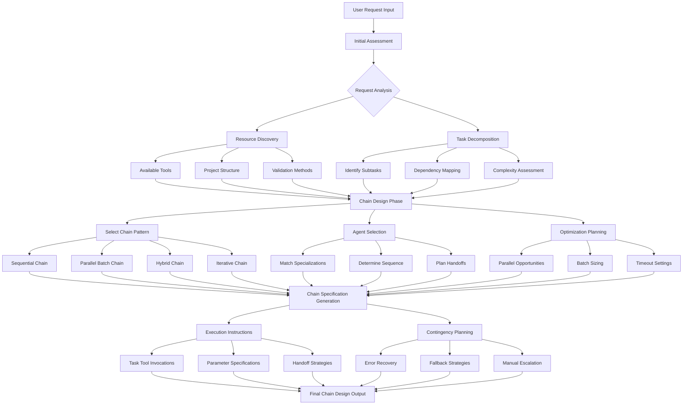
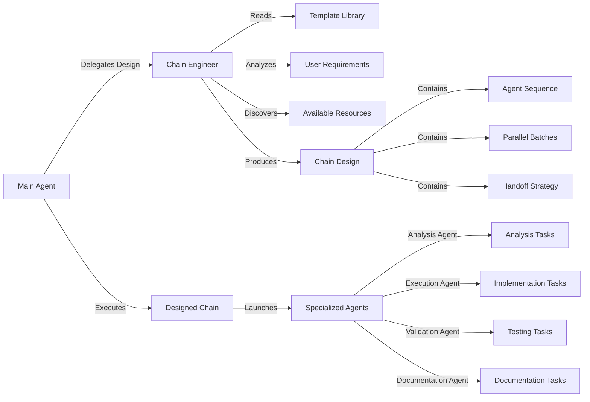
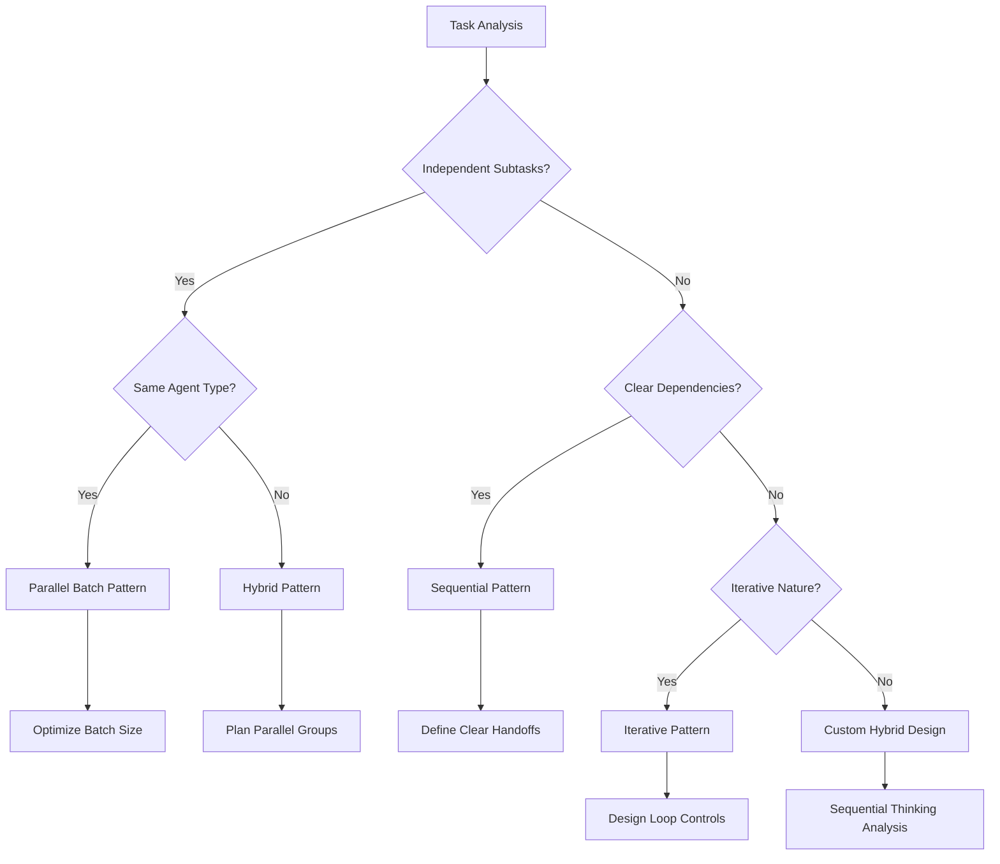

# Chain Engineer Agent Specification

## Executive Summary

The Chain Engineer is a specialized orchestration agent designed to transform complex user requirements into optimized multi-agent workflow chains. Operating with Opus 4's enhanced reasoning capabilities, it analyzes task requirements, designs efficient agent coordination strategies, and produces execution-ready chain specifications that maximize parallel processing while maintaining quality outcomes.

## 1. Requirements (Non-Technical)

### 1.1 Purpose and Objectives

**Primary Purpose**: Automate the design of complex multi-agent workflows by analyzing user requirements and producing optimal orchestration chains that leverage specialized agent capabilities.

**Key Objectives**:

- Reduce main agent cognitive load by offloading chain design complexity
- Maximize workflow efficiency through intelligent parallelization
- Ensure consistent application of proven chain patterns
- Adapt chain designs to available resources and constraints
- Provide clear, execution-ready orchestration instructions

### 1.2 User Benefits

**For Main Agents**:

- Eliminates need for manual chain design and optimization
- Provides confidence through proven pattern application
- Reduces context usage through efficient delegation
- Enables focus on high-level coordination rather than detailed planning

**For End Users**:

- Faster task completion through optimized workflows
- Higher quality outcomes through specialized agent coordination
- Predictable results through standardized chain patterns
- Transparent progress tracking through structured workflows

### 1.3 Use Cases

**Complex System Testing**:

- Design chains for comprehensive validation workflows
- Coordinate parallel testing across multiple components
- Structure fix-test-refix cycles with proper handoffs

**Large-Scale Standardization**:

- Orchestrate parallel document processing workflows
- Design efficient batch processing strategies
- Coordinate cross-referencing and validation steps

**Multi-Phase Development**:

- Structure analysis → implementation → validation → documentation flows
- Design chains with proper dependency management
- Optimize for resource availability and constraints

### 1.4 Success Criteria

**Performance Metrics**:

- Chain execution time: <15 minutes for complex workflows
- Context efficiency: <10K tokens per workflow phase
- Success rate: >90% successful chain completions
- Parallel efficiency: >60% reduction vs sequential execution

**Quality Indicators**:

- Appropriate agent specialization selection
- Optimal parallel batch sizing
- Effective error recovery strategies
- Clear execution instructions

## 2. Architecture

### 2.1 Chain Engineer Workflow Process



### 2.2 Integration Architecture



### 2.3 Chain Pattern Library

**Sequential Chain Pattern**:

```diagram
Research → Implementation → Validation → Documentation
Use when: Tasks have strict dependencies
Example: Bug fix workflows
```

**Parallel Batch Pattern**:

```diagram
┌─ Agent 1 ─┐
├─ Agent 2 ─┤ → Consolidation → Next Phase
└─ Agent 3 ─┘
Use when: Multiple independent tasks
Example: Multi-file standardization
```

**Hybrid Pattern**:

```diagram
Analysis → ┌─ Implementation A ─┐ → Validation → Documentation
           └─ Implementation B ─┘
Use when: Mixed dependencies exist
Example: Multi-component fixes
```

**Iterative Pattern**:

```diagram
Analysis → Implementation → Testing ←┐
                ↓                    │
                └→ Fix Required? ────┘
Use when: Quality gates needed
Example: Complex debugging workflows
```

### 2.4 Decision Tree for Chain Selection



## 3. Technical Specification

### 3.1 Agent Configuration

```yaml
agent_type: chain-engineer
model: opus-4  # Enhanced reasoning capabilities
specialization: orchestration-design
execution_mode: analysis-only  # Does not execute chains
timeout: 300  # 5 minutes for complex analysis
```

### 3.2 Tool Requirements

**Required Tools**:

- `Read`: Access chain design documents and templates
- `Grep`: Search for patterns and examples
- `Glob`: Discover project structure and resources
- `LS`: List available files and directories
- `sequential-thinking`: Complex chain design reasoning

**Prohibited Tools**:

- No write/edit tools (analysis only)
- No execution tools (design only)
- No external communication tools

### 3.3 Input Interface

```typescript
interface ChainEngineerInput {
  user_request: string;           // Original user requirement
  project_context?: {
    name: string;                 // Project identifier
    type: string;                 // Project category
    structure_hints: string[];    // Known structure elements
  };
  constraints?: {
    max_execution_time?: number;  // Time limit in minutes
    max_parallel_agents?: number; // Parallelization limit
    required_quality?: string;    // success | high-confidence
  };
  available_resources?: {
    validation_methods: string[]; // Available validation tools
    test_frameworks: string[];    // Testing capabilities
    documentation_templates: string[]; // Doc resources
  };
}
```

### 3.4 Output Interface

```typescript
interface ChainDesignOutput {
  metadata: {
    complexity_score: number;     // 1-100 complexity assessment
    estimated_duration: number;   // Minutes
    confidence_level: string;     // high | medium | low
    optimization_applied: string[];// Applied optimizations
  };
  
  chain_specification: {
    pattern_type: string;         // sequential | parallel | hybrid | iterative
    total_agents: number;         // Agent count
    phases: ChainPhase[];         // Execution phases
  };
  
  execution_instructions: {
    overview: string;             // Human-readable summary
    task_invocations: TaskInvocation[]; // Exact Task tool calls
    handoff_strategy: HandoffStrategy;   // Communication approach
    parallel_batches: ParallelBatch[];   // Parallel groups
  };
  
  contingency_plan: {
    error_recovery: ErrorStrategy[];     // Recovery approaches
    fallback_options: FallbackOption[];  // Alternative paths
    escalation_triggers: string[];       // When to escalate
  };
  
  rationale: {
    pattern_selection: string;    // Why this pattern
    agent_selection: string;      // Why these agents
    optimization_decisions: string; // Optimization rationale
  };
}

interface ChainPhase {
  phase_number: number;
  description: string;
  agents: AgentSpecification[];
  dependencies: number[];        // Previous phase dependencies
  can_parallelize: boolean;
  expected_duration: number;
}

interface TaskInvocation {
  phase: number;
  parallel_group?: number;
  exact_command: string;         // Complete Task tool invocation
  expected_response_type: string; // What to expect back
}
```

### 3.5 Chain Optimization Strategies

**Parallel Batch Optimization**:

```typescript
function optimizeBatchSize(tasks: Task[], constraints: Constraints): BatchPlan {
  const optimalBatchSize = Math.min(
    8,  // Platform limit for parallel agents
    constraints.max_parallel_agents || 8,
    Math.ceil(tasks.length / 3)  // Avoid too many sequential batches
  );
  
  // Group by estimated execution time for balanced batches
  const batches = balanceByExecutionTime(tasks, optimalBatchSize);
  
  return {
    batch_size: optimalBatchSize,
    total_batches: batches.length,
    execution_order: batches
  };
}
```

**Smart Resource Allocation**:

```typescript
function allocateAgents(phases: Phase[]): AllocationPlan {
  // Identify phases that can overlap
  const overlappable = findOverlappablePhases(phases);
  
  // Allocate validation agents while execution agents work
  // Allocate documentation prep while validation runs
  return createOverlappedSchedule(phases, overlappable);
}
```

### 3.6 Template Integration

**Template Selection Logic**:

```typescript
function selectTemplate(task_type: string, available_templates: Template[]): Template | null {
  // Match task patterns to template capabilities
  const candidates = available_templates.filter(t => 
    t.task_categories.includes(task_type) &&
    t.complexity_range.includes(task_complexity)
  );
  
  // Prefer templates with proven success
  return candidates.sort((a, b) => 
    b.success_rate - a.success_rate
  )[0] || null;
}
```

### 3.7 Error Handling Patterns

**Cascading Fallback Strategy**:

```yaml
error_handling:
  validation_failure:
    - retry_with_extended_timeout
    - try_alternative_validation_method
    - fallback_to_manual_validation
    - escalate_with_context
  
  agent_timeout:
    - check_partial_results
    - reduce_scope_and_retry
    - split_into_smaller_tasks
    - escalate_with_progress
  
  resource_unavailable:
    - find_alternative_resource
    - adapt_chain_to_available_tools
    - provide_manual_workaround
    - suggest_resource_installation
```

### 3.8 Sequential Thinking Integration

The Chain Engineer uses sequential thinking at key decision points:

1. **Initial Requirements Analysis**: 3-5 thoughts to understand scope
2. **Chain Pattern Selection**: 2-3 thoughts to evaluate options
3. **Optimization Planning**: 3-4 thoughts for complex optimizations
4. **Contingency Design**: 2-3 thoughts for error scenarios

### 3.9 Performance Characteristics

**Execution Targets**:

- Simple chain design: <2 minutes
- Complex chain design: <5 minutes
- Sequential thinking phases: 30-60 seconds each
- Output generation: <30 seconds

**Resource Usage**:

- Context consumption: ~2-3K tokens for analysis
- Output size: ~1-2K tokens for complete design
- Memory footprint: Minimal (read-only operations)

### 3.10 Example Chain Designs

**Example 1**: Validation System Testing

```javascript
// Chain Engineer Output for comprehensive validation testing
{
  pattern: "hybrid",
  phases: [
    {
      phase: 1,
      type: "research",
      agents: [{ type: "Analysis Agent", task: "discover_validation_system" }]
    },
    {
      phase: 2,
      type: "parallel_validation",
      agents: [
        { type: "Validation Agent", task: "test_backend_validator" },
        { type: "Validation Agent", task: "test_ui_validator" },
        { type: "Validation Agent", task: "test_core_validator" },
        { type: "Validation Agent", task: "test_build_validator" }
      ]
    },
    {
      phase: 3,
      type: "parallel_fixes",
      agents: [
        { type: "Execution Agent", task: "fix_backend_issues" },
        { type: "Execution Agent", task: "fix_ui_issues" }
      ]
    },
    {
      phase: 4,
      type: "documentation",
      agents: [{ type: "Documentation Agent", task: "compile_results" }]
    }
  ]
}
```

**Example 2**: Pattern Library Standardization

```javascript
// Chain Engineer Output for 46-file pattern standardization
{
  pattern: "parallel_batch",
  optimization: "maximum_parallelization",
  phases: [
    {
      phase: 1,
      type: "sample_validation",
      agents: [
        { type: "Execution Agent", task: "validate_approach_file_1" },
        { type: "Execution Agent", task: "validate_approach_file_2" }
      ]
    },
    {
      phase: 2,
      type: "batch_execution",
      parallel_batches: [
        { batch: 1, agents: 8, files: "files_1_8" },
        { batch: 2, agents: 8, files: "files_9_16" },
        { batch: 3, agents: 8, files: "files_17_24" },
        { batch: 4, agents: 8, files: "files_25_32" },
        { batch: 5, agents: 8, files: "files_33_40" },
        { batch: 6, agents: 6, files: "files_41_46" }
      ]
    }
  ]
}
```

## 4. Implementation Guidelines

### 4.1 Chain Engineer Invocation

```typescript
// Main agent invokes Chain Engineer
const chainDesign = await Task({
  subagent_type: "chain-engineer",
  description: "Design optimal workflow chain",
  prompt: `Analyze the following requirement and design an optimal multi-agent workflow:
          
          User Request: ${userRequest}
          Project: ${projectName}
          Available Resources: ${JSON.stringify(resources)}
          Constraints: ${JSON.stringify(constraints)}
          
          Use sequential thinking to analyze the requirements thoroughly.
          Consider successful patterns from the workflow feedback examples.
          Design for optimal parallel execution where possible.
          Provide complete execution instructions with exact Task invocations.`
});
```

### 4.2 Design Quality Validation

The Chain Engineer self-validates designs against quality criteria:

- Complexity appropriate for task requirements
- Agent specializations properly matched
- Parallel opportunities maximized
- Error recovery paths defined
- Execution time within constraints

### 4.3 Continuous Improvement

The Chain Engineer learns from:

- Workflow feedback documents
- Successful chain patterns
- Failed chain post-mortems
- Performance metrics analysis
- New template additions

## 5. Success Metrics

### 5.1 Quantitative Metrics

- **Design Accuracy**: >95% of chains execute successfully without modification
- **Optimization Impact**: >60% reduction in execution time vs sequential
- **Context Efficiency**: <3K tokens average per chain design
- **Design Time**: <5 minutes for complex chains
- **Reusability**: >70% of designs use proven patterns

### 5.2 Qualitative Metrics

- **Clarity**: Main agents can execute chains without clarification
- **Completeness**: All edge cases and errors addressed
- **Flexibility**: Chains adapt to resource availability
- **Rationale**: Clear reasoning for all design decisions
- **Innovation**: Novel solutions for unique requirements

## 6. Future Enhancements

### 6.1 Planned Capabilities

- **Machine Learning Integration**: Learn optimal patterns from execution history
- **Dynamic Adaptation**: Modify chains during execution based on results
- **Cost Optimization**: Balance performance vs resource consumption
- **Cross-Project Patterns**: Share successful patterns across projects

### 6.2 Version Roadmap

- **v1.1**: Enhanced pattern library with 20+ proven templates
- **v1.2**: Real-time chain adaptation capabilities
- **v2.0**: ML-powered pattern selection and optimization
- **v2.5**: Distributed chain execution planning

## Appendix A: Chain Pattern Examples

[Detailed examples of successful chain patterns from workflow feedback]

## Appendix B: Common Anti-Patterns

[Patterns to avoid based on failed chain analysis]

## Appendix C: Template Library Reference

[Complete template specifications for chain design]
