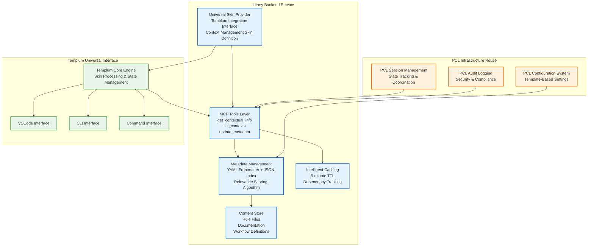
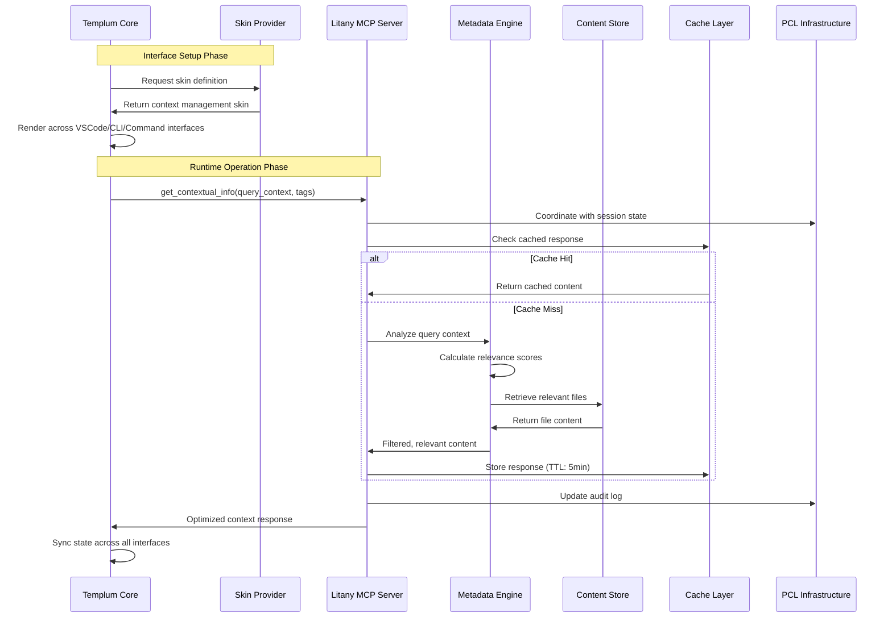
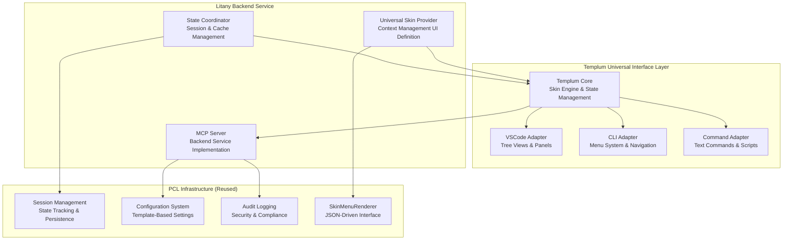
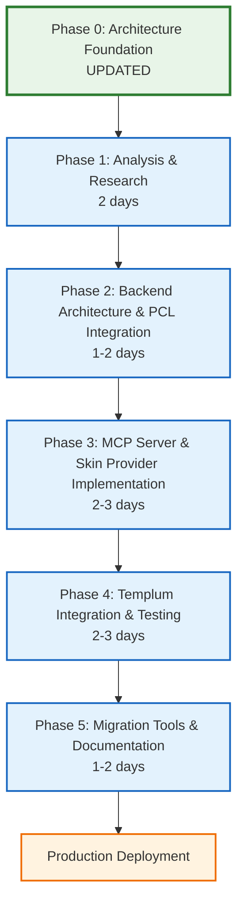

# Phase 0: Litany Architectural Foundation

> **PURPOSE**: Establish the architectural groundwork for transforming DSS into Litany  
> **STATUS**: Foundation Document  
> **NEXT PHASE**: [Phase 1: Analysis & Research](02-Phase-01-Analysis-Research.md)

## Executive Summary

Litany represents a fundamental transformation from static context injection to dynamic, intelligent content delivery through the Model Context Protocol (MCP). This architectural foundation addresses critical inefficiencies in the current DSS system while establishing a scalable, maintainable framework for AI-assisted development.

### Core Problem

The current DSS system suffers from excessive context bloat, with an estimated 60-80% of injected content being irrelevant to specific queries. This leads to token waste, performance degradation, and maintenance overhead that grows with system complexity.

### Solution Vision

Litany transforms this approach through:

- **Dynamic Context Retrieval**: MCP-based tools provide exactly what's needed, when needed
- **Intelligent Metadata Management**: Algorithmic file selection based on context and relevance
- **Templum Integration**: Pure backend service providing skin-based interface through Templum universal interface manager
- **PCL Infrastructure Reuse**: Leverages proven Phoenix Code Lite patterns for reliability and maintainability

### Expected Outcomes

- 60-80% reduction in token usage through dynamic loading
- Sub-200ms response times coordinated with Templum interface management
- 90% automated metadata management reducing maintenance overhead
- Seamless integration through Templum universal interface across VSCode, CLI, and command modes

## Architectural Vision & Principles

### Core Design Principles

1. **Token Efficiency Through Dynamic Loading**
   - Context loaded only when relevant to the specific query
   - Intelligent content selection based on metadata and usage patterns
   - Elimination of "just in case" content injection

2. **Metadata-Driven Intelligence**
   - Hybrid approach combining YAML frontmatter with external JSON indexing
   - Algorithmic updates without LLM overhead to ensure consistency
   - Relevance scoring based on context, tags, and historical usage

3. **Pure Backend Service Architecture**
   - Standards-based MCP protocols for universal interface compatibility
   - Templum integration through Universal Skin System
   - PCL infrastructure reuse for proven reliability patterns

4. **Templum-Coordinated Migration Strategy**
   - Backend service integration with Templum interface management
   - Coordinated state management across VSCode, CLI, and command interfaces
   - Leverages existing PCL session and configuration systems

### Architecture Constraints

- **Performance**: All operations must complete within 200ms for 95% of requests
- **Reliability**: 99.9% uptime with graceful degradation
- **Scalability**: Linear performance scaling to support 1000+ context items
- **Security**: Process isolation and input validation for all MCP interactions
- **Maintainability**: 90% automated metadata management to reduce human error

## System Architecture Definition

### Core Components



### Data Flow Architecture



## Technical Specifications

### MCP Server Implementation

**Server Configuration:**

- **Name**: `litany-mcp-server`
- **Transport**: STDIO for process isolation
- **Protocol Version**: 2024-11-05
- **Language**: TypeScript for ecosystem consistency

**Tool Definitions:**

1. **get_contextual_info**

   ```typescript
   {
     name: "get_contextual_info",
     description: "Retrieve relevant context based on query analysis",
     inputSchema: {
       type: "object",
       properties: {
         query_context: { type: "string", description: "Current query or task context" },
         content_types: { type: "array", items: { type: "string" }, description: "Preferred content types" },
         max_tokens: { type: "number", default: 2000, description: "Maximum token limit for response" }
       },
       required: ["query_context"]
     }
   }
   ```

2. **list_contexts**

   ```typescript
   {
     name: "list_contexts", 
     description: "List available context categories and metadata",
     inputSchema: {
       type: "object",
       properties: {
         category_filter: { type: "string", description: "Filter by content category" },
         show_metadata: { type: "boolean", default: false, description: "Include detailed metadata" }
       }
     }
   }
   ```

3. **update_metadata**

   ```typescript
   {
     name: "update_metadata",
     description: "Update context metadata and relevance scores", 
     inputSchema: {
       type: "object",
       properties: {
         file_path: { type: "string", description: "Path to content file" },
         metadata_updates: { type: "object", description: "Metadata fields to update" },
         recalculate_relevance: { type: "boolean", default: true, description: "Recalculate relevance scores" }
       },
       required: ["file_path", "metadata_updates"]
     }
   }
   ```

### Backend Service Interface for Templum Integration

**Templum Integration Implementation:**

Litany implements the `BackendService` interface to provide universal skin definitions for Templum:

```typescript
interface BackendService {
  provideSkin(): UniversalSkinDefinition;
  handleCommand(command: string, context: any): Promise<any>;
}

class LitanyBackendService implements BackendService {
  provideSkin(): UniversalSkinDefinition {
    return {
      metadata: {
        id: 'litany-context-manager',
        name: 'Context Manager',
        backend: 'litany',
        version: '1.0.0',
        compatibleInterfaces: ['vscode', 'cli', 'command']
      },

      // VSCode interface definitions
      views: {
        treeViews: [{
          id: 'litany.contexts',
          title: 'Available Contexts',
          provider: 'ContextTreeProvider',
          description: 'Browse and manage context files'
        }, {
          id: 'litany.metadata',
          title: 'Context Metadata',
          provider: 'MetadataTreeProvider',
          description: 'View and edit context metadata'
        }],
        panels: [{
          id: 'litany.cache-status',
          title: 'Cache Performance',
          type: 'webview',
          description: 'Monitor caching and performance metrics'
        }],
        statusBar: [{
          id: 'litany.performance',
          text: 'Context: ${contextCount} | Cache: ${hitRate}%',
          tooltip: 'Litany context management status'
        }]
      },

      // CLI interface definitions (PCL SkinMenuRenderer compatible)
      menus: {
        main: {
          title: 'Context Management',
          subtitle: 'Litany Dynamic Context System',
          items: [
            { id: 'browse-contexts', label: 'Browse Available Contexts', action: 'litany.browseContexts' },
            { id: 'manage-metadata', label: 'Manage Context Metadata', action: 'litany.manageMetadata' },
            { id: 'cache-status', label: 'View Cache Performance', action: 'litany.cacheStatus' },
            { id: 'update-metadata', label: 'Update Context Metadata', action: 'litany.updateMetadata' }
          ],
          theme: {
            borderColor: '#4a9eff',
            headerColor: '#ffffff',
            itemColor: '#e3f2fd'
          }
        }
      },

      // Command interface definitions  
      commands: {
        'litany:getInfo': {
          title: 'Get Contextual Info',
          description: 'Retrieve relevant context based on query analysis',
          handler: 'getContextualInfo',
          shortcuts: ['ctx', 'context'],
          prompts: [{
            name: 'query_context',
            description: 'Current query or task context',
            required: true
          }]
        },
        'litany:listContexts': {
          title: 'List Available Contexts',
          description: 'Show all available context categories and metadata',
          handler: 'listContexts',
          shortcuts: ['list', 'ls'],
          prompts: [{
            name: 'category_filter',
            description: 'Filter by content category',
            required: false
          }]
        },
        'litany:updateMetadata': {
          title: 'Update Context Metadata',
          description: 'Update context metadata and relevance scores',
          handler: 'updateMetadata',
          shortcuts: ['update', 'meta'],
          prompts: [{
            name: 'file_path',
            description: 'Path to content file',
            required: true
          }, {
            name: 'metadata_updates',
            description: 'Metadata fields to update (JSON format)',
            required: true
          }]
        }
      },

      // Cross-interface workflows
      workflows: {
        'context-discovery': {
          name: 'Context Discovery Workflow',
          description: 'Discover and analyze context relevance',
          steps: [
            { command: 'litany:listContexts', description: 'List available contexts' },
            { command: 'litany:getInfo', description: 'Get contextual information' },
            { command: 'litany:updateMetadata', description: 'Update metadata based on usage' }
          ]
        }
      },

      shortcuts: {
        'ctrl+shift+c': 'litany:getInfo',
        'ctrl+shift+l': 'litany:listContexts',
        'ctrl+shift+m': 'litany:updateMetadata'
      }
    };
  }

  async handleCommand(command: string, context: any): Promise<any> {
    // Route commands to appropriate MCP tools
    switch (command) {
      case 'getContextualInfo':
        return this.mcpServer.getContextualInfo(context);
      case 'listContexts':
        return this.mcpServer.listContexts(context);
      case 'updateMetadata':
        return this.mcpServer.updateMetadata(context);
      default:
        throw new Error(`Unknown command: ${command}`);
    }
  }
}
```

### Metadata Schema Specification

**YAML Frontmatter Schema:**

```yaml
---
title: "Content Title"
category: "rules|workflow|documentation|reference"
tags: ["context-tag", "domain-tag", "usage-tag"]
priority: 1-10  # Relevance priority (10 = highest)
triggers:
  - "keyword patterns that should invoke this content"
  - "context patterns"
dependencies:
  - "other-content-file.md"
  - "prerequisite-content.md"
last_updated: "2025-08-20"
usage_frequency: 0  # Automatically tracked
---
```

**External JSON Index Schema:**

```typescript
interface ContentIndex {
  version: string;
  last_updated: string;
  content_items: {
    [file_path: string]: {
      metadata: ContentMetadata;
      relevance_scores: {
        [context_pattern: string]: number;
      };
      usage_stats: {
        call_count: number;
        last_accessed: string;
        success_rate: number;
      };
    };
  };
}
```

### Performance Requirements

**Response Time Targets (Coordinated with Templum):**

- **Cache Hit**: <50ms (90% of requests, aligned with Templum's interface response targets)
- **Cache Miss**: <200ms (95% of requests, coordinated with Templum's cross-interface sync)
- **Metadata Update**: <100ms (synchronized across all Templum interfaces)
- **Context Analysis**: <150ms (includes Templum state coordination overhead)
- **Cross-Interface Sync**: <25ms additional latency for Templum state coordination

**Caching Strategy (Templum-Coordinated):**

- **Default TTL**: 5 minutes for content responses (coordinated with Templum session state)
- **Cross-Interface Invalidation**: Cache invalidation propagated through Templum to all interfaces
- **Memory Limit**: 50MB cache size with LRU eviction (coordinated with Templum memory management)
- **State Coordination**: Cache state synchronized with Templum's cross-interface session management
- **Persistence**: Session-aware disk-based cache compatible with Templum state restoration

**Scalability Targets:**

- **Concurrent Requests**: 10+ simultaneous users
- **Content Items**: 1000+ files with linear performance
- **Memory Usage**: <100MB base memory footprint
- **Startup Time**: <2 seconds for server initialization

## Integration Architecture

### Templum Universal Interface Integration

**Pure Backend Service Approach:**

Litany operates as a pure backend service that integrates with Templum through the Universal Skin System, eliminating the need for direct interface management:



**Integration Benefits:**

- **Zero Interface Duplication**: Templum handles all interface concerns
- **Proven Infrastructure Reuse**: Leverages tested PCL components
- **Universal Interface Access**: Same functionality across VSCode, CLI, and command modes
- **Coordinated State Management**: Single session state across all interfaces

### PCL Infrastructure Reuse Strategy

**Core Component Reuse:**

1. **Session Management Integration**

   ```typescript
   class LitanySessionManager extends PCLSessionManager {
     private contextState: ContextState;
     private cacheMetrics: CacheMetrics;
     
     // Extend PCL session with Litany-specific state
     async initializeContextSession(config: LitanyConfig): Promise<void> {
       await super.initializeSession(config.pcl);
       this.contextState = new ContextState(config.metadata_sources);
       this.cacheMetrics = new CacheMetrics();
     }
     
     // Coordinate with Templum's cross-interface state
     async syncWithTemplum(templumState: TemplumState): Promise<void> {
       await this.updateSessionState({
         litany: this.contextState,
         cache: this.cacheMetrics,
         templum: templumState
       });
     }
   }
   ```

2. **Configuration System Integration**

   ```typescript
   interface LitanyConfiguration extends PCLConfiguration {
     litany: {
       mcp_server: MCPServerConfig;
       metadata_sources: string[];
       cache_settings: CacheConfig;
       templum_integration: TemplumConfig;
     };
   }
   
   class LitanyConfigManager extends PCLConfigurationManager {
     // Reuse PCL's template-based configuration
     async loadLitanyConfig(): Promise<LitanyConfiguration> {
       const baseConfig = await super.loadConfiguration();
       return {
         ...baseConfig,
         litany: await this.loadLitanySpecificConfig()
       };
     }
   }
   ```

3. **Audit Logging Integration**

   ```typescript
   class LitanyAuditLogger extends PCLAuditLogger {
     // Extend PCL audit logging with MCP operations
     async logMCPOperation(operation: string, context: any, result: any): Promise<void> {
       await super.logOperation({
         type: 'mcp_operation',
         operation,
         context,
         result,
         timestamp: new Date().toISOString(),
         source: 'litany-backend'
       });
     }
     
     // Log Templum coordination events
     async logTemplumSync(interfaceType: string, state: any): Promise<void> {
       await super.logOperation({
         type: 'templum_sync',
         interface: interfaceType,
         state,
         timestamp: new Date().toISOString()
       });
     }
   }
   ```

4. **SkinMenuRenderer Integration**

   ```typescript
   class LitanySkinProvider {
     private pclRenderer: SkinMenuRenderer; // Reuse PCL component
     
     generateUniversalSkin(): UniversalSkinDefinition {
       const skinDef = this.buildLitanySkinDefinition();
       
       // Convert for PCL CLI compatibility
       skinDef.menus = this.pclRenderer.convertToMenuDefinition(skinDef);
       
       return skinDef;
     }
   }
   ```

**Shared Infrastructure Benefits:**

- **Proven Reliability**: Leverages battle-tested PCL components
- **Maintenance Reduction**: Single codebase for shared functionality
- **Configuration Consistency**: Unified configuration across all services
- **Audit Trail Continuity**: Comprehensive logging across the ecosystem

### Migration Strategy from DSS

**Phased Migration Approach:**

1. **Phase 1**: Parallel operation with DSS fallback
2. **Phase 2**: Gradual content migration with validation
3. **Phase 3**: Full cutover with DSS deprecation
4. **Phase 4**: Cleanup and optimization

**Migration Tools:**

- Automated DSS rule content extraction
- Metadata generation from existing rule structures
- Validation tools for content equivalence
- Rollback mechanisms for safety

## Implementation Roadmap Overview

### Phase Dependencies



### Critical Path Analysis

**Sequential Dependencies:**

- Token baseline measurement (P1) → PCL integration architecture (P2)
- MCP server & skin provider (P3) → Templum integration testing (P4)
- Migration tools (P5) → Production deployment

**Parallel Opportunities:**

- Documentation creation during P3-P4
- PCL infrastructure adaptation during P2-P3
- Performance testing with Templum coordination during P2
- Skin definition development during P3

### Resource Requirements

**Development Skills Needed:**

- TypeScript/Node.js expertise for MCP server implementation
- PCL codebase familiarity for infrastructure reuse
- MCP protocol knowledge for tool implementation
- Templum integration and Universal Skin System understanding

**Timeline Estimate:**

- **Total Duration**: 8-12 days for backend implementation (reduced due to PCL reuse)
- **Critical Path**: 10 days with sequential dependencies
- **Parallel Optimized**: 6-8 days with PCL infrastructure reuse

## Success Metrics & Validation

### Performance Targets

**Token Efficiency Metrics:**

- **Primary Goal**: 60-80% reduction in context token usage vs DSS baseline
- **Measurement**: Compare token counts for equivalent queries
- **Validation**: A/B testing with sample queries across both systems

**Response Time Metrics (Templum-Coordinated):**

- **Backend Response**: <50ms for 90% of cache hits
- **Backend + Templum Sync**: <200ms for 95% of cache misses
- **Cross-Interface Propagation**: <25ms for state synchronization across VSCode/CLI/Command
- **End-to-End Latency**: <250ms including Templum coordination overhead
- **Measurement**: Performance monitoring across all Templum interfaces

**Cache Efficiency Metrics (Cross-Interface):**

- **Cache Hit Rate**: >80% across all Templum interfaces (VSCode, CLI, Command)
- **Memory Usage**: <75MB backend + <25MB Templum coordination (100MB total)
- **Cross-Interface Invalidation**: <1% false cache hits, synchronized across all interfaces
- **State Consistency**: 100% state consistency across all active Templum interfaces
- **Measurement**: Templum-integrated metrics dashboard

### Quality Gates

**Phase 1 Validation:**

- Concrete token baseline established with measurement tools
- MCP protocol capabilities thoroughly documented
- Integration points identified and validated

**Phase 2 Validation:**

- PCL infrastructure integration architecture complete and reviewed
- Backend service architecture validated against Templum requirements
- Performance targets achievable with Templum coordination overhead

**Phase 3 Validation:**

- MCP server implements all required tools correctly
- Universal Skin Provider generates valid Templum-compatible skin definitions
- PCL infrastructure reuse operational and tested
- Token reduction demonstrated with sample queries

**Phase 4 Validation:**

- Templum integration functional across VSCode, CLI, and Command interfaces
- Cross-interface state synchronization working correctly
- End-to-end workflows operational through all Templum interfaces
- Performance targets met with Templum coordination

**Phase 5 Validation:**

- Migration tools successfully convert sample DSS content
- Templum-coordinated deployment successful with monitoring
- Cross-interface consistency validated across all interaction modes

### User Adoption Metrics

**Developer Experience Targets:**

- **Setup Time**: <30 minutes from installation to first use
- **Learning Curve**: <2 hours to become productive
- **Configuration Complexity**: <10 configuration parameters
- **Error Recovery**: Clear error messages with resolution guidance

**Integration Success Metrics:**

- **Templum Universal Interface**: Context management accessible through all three interfaces (VSCode, CLI, Command)
- **PCL Infrastructure Reuse**: 100% compatibility with existing PCL infrastructure components
- **Cross-Interface Consistency**: 100% feature parity across all Templum interfaces
- **Migration Success**: >95% of DSS rules successfully migrated without data loss
- **State Synchronization**: <1% state inconsistency across active interfaces

## Risk Assessment & Mitigation

### Technical Risks

**High Impact Risks:**

1. **MCP Performance Limitations**
   - **Risk**: Tool call latency exceeds 200ms target
   - **Probability**: Medium
   - **Mitigation**: Aggressive caching, connection pooling, fallback to cached responses
   - **Contingency**: Implement hybrid mode with pre-loaded critical content

2. **Templum Integration Complexity Underestimated**
   - **Risk**: Templum/PCL integration more complex than planned
   - **Probability**: Low (due to PCL infrastructure reuse)
   - **Mitigation**: Leverage proven PCL components, extensive Templum compatibility testing
   - **Contingency**: Gradual feature rollout through Templum interfaces

3. **Metadata Accuracy Issues**
   - **Risk**: Algorithmic metadata generation lacks sufficient accuracy
   - **Probability**: Low
   - **Mitigation**: Hybrid approach with manual validation, machine learning improvements
   - **Contingency**: Manual metadata management with tool assistance

**Medium Impact Risks:**

1. **Token Reduction Not Achieved**
   - **Risk**: Actual token savings lower than 60% target
   - **Probability**: Low
   - **Mitigation**: Conservative estimates, iterative optimization, fallback to 40% target
   - **Contingency**: Focus on qualitative improvements over quantitative targets

2. **Cache Invalidation Complexity**
   - **Risk**: Dependency tracking too complex for accurate cache invalidation
   - **Probability**: Medium
   - **Mitigation**: Conservative invalidation strategies, comprehensive testing
   - **Contingency**: Shorter TTL with more frequent cache refreshes

### Project Risks

**Scope and Resource Risks:**

1. **Feature Scope Creep**
   - **Risk**: Requirements expand beyond core functionality
   - **Probability**: High
   - **Mitigation**: Clear requirements documentation, change control process
   - **Contingency**: MVP-first approach with deferred enhancements

2. **Resource Availability**
   - **Risk**: Development resources unavailable for sustained effort
   - **Probability**: Medium
   - **Mitigation**: Realistic timeline with buffer, modular development approach
   - **Contingency**: Phase-by-phase completion with partial value delivery

3. **Adoption Resistance**
   - **Risk**: Users prefer existing DSS despite inefficiencies
   - **Probability**: Low
   - **Mitigation**: Gradual migration, clear benefits demonstration, training materials
   - **Contingency**: Parallel operation with optional adoption

### Migration Risks

**Data and Compatibility Risks:**

1. **DSS Content Migration Failures**
   - **Risk**: Critical DSS rules lost or corrupted during migration
   - **Probability**: Low
   - **Mitigation**: Comprehensive backup, validation tools, rollback procedures
   - **Contingency**: Manual migration with automated verification

2. **Breaking Changes in Dependencies**
   - **Risk**: MCP protocol changes break compatibility
   - **Probability**: Low
   - **Mitigation**: Version pinning, compatibility testing, upgrade procedures
   - **Contingency**: Protocol abstraction layer for version compatibility

## Next Steps

### Immediate Actions

1. **Validate This Foundation** - Review and approve architectural direction
2. **Begin Phase 1** - Start with concrete token measurement and MCP research
3. **Set Up Development Environment** - Prepare tools and repositories for implementation
4. **Establish Metrics Baseline** - Implement measurement tools for current DSS performance

### Success Criteria for Phase 0

This architectural foundation is considered complete when:

- ✅ **Vision Clarity**: All stakeholders understand the transformation goals and approach
- ✅ **Technical Direction**: Clear architectural decisions with rationale documented  
- ✅ **Integration Strategy**: Defined approach for Haruspex and PCL integration
- ✅ **Success Metrics**: Measurable targets established for validation
- ✅ **Risk Awareness**: Known challenges identified with mitigation strategies
- ✅ **Implementation Readiness**: Phase 1 can begin with clear objectives and deliverables

---

**This updated architectural foundation serves as the definitive blueprint for transforming DSS into Litany as a pure backend service integrated with Templum's universal interface management. This approach eliminates interface duplication, leverages proven PCL infrastructure, and provides seamless context management across VSCode, CLI, and command interfaces through the Universal Skin System.**

## Key Architectural Benefits Achieved

- **Zero Interface Duplication**: Templum handles all interface concerns, Litany focuses purely on backend functionality
- **Proven Infrastructure Reuse**: Leverages battle-tested PCL components for session management, configuration, and audit logging
- **Universal Interface Access**: Same context management functionality available through VSCode visual interface, CLI interactive menus, and command-line text interface
- **Coordinated Performance**: Aligned caching and state management with Templum's cross-interface synchronization
- **Reduced Implementation Risk**: Leveraging existing PCL infrastructure reduces timeline from 12-17 days to 8-12 days
- **Enhanced Maintainability**: Single backend codebase integrated with shared infrastructure patterns
