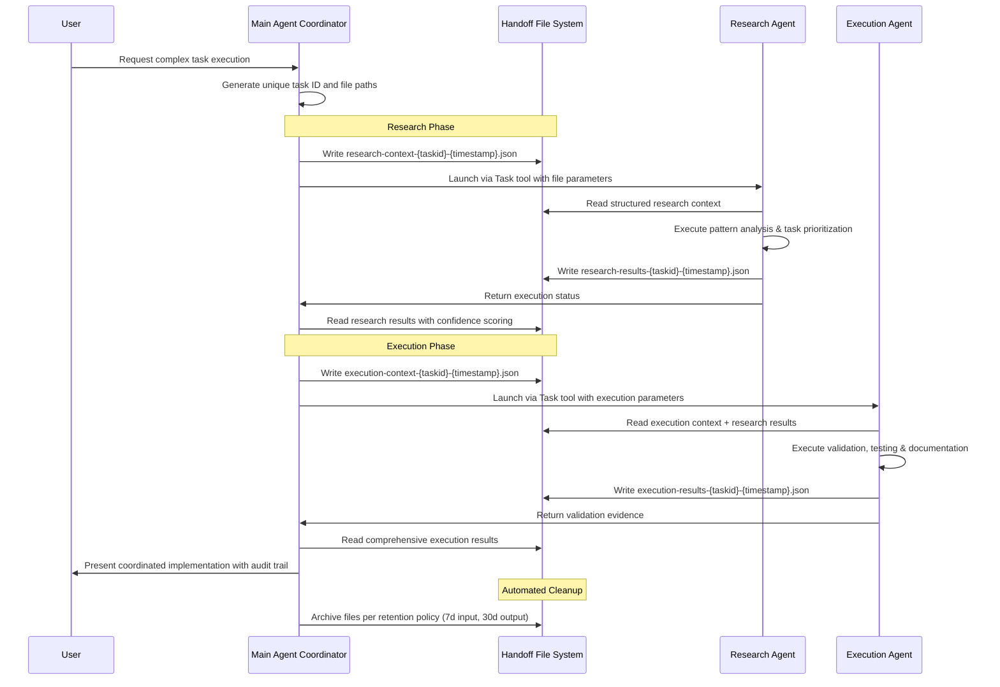
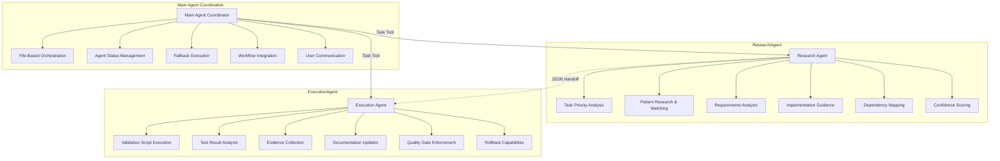

# Streamlined Subagent Workflow System

## Requirements

- **Context Efficiency**: Maintain main agent context usage below 10K tokens per workflow phase
- **Autonomous Execution**: Enable subagents to execute all required tasks independently within their domain
- **Structured Communication**: Use format-driven JSON document handoff for reliable inter-agent communication
- **Audit Compliance**: Provide comprehensive audit trails and evidence collection for all operations
- **Error Resilience**: Support fallback strategies and automated error recovery mechanisms
- **Cross-Project Reusability**: Enable deployment across different VDL_Vault projects with minimal configuration

## System Architecture

### File-Based Communication Flow



### Agent Responsibility Matrix



## Core Components

### ResearchAgent

**Purpose**: Consolidated information gathering and analysis with intelligent pattern matching

The ResearchAgent handles the research phase of complex workflows, providing comprehensive analysis through file-based handoff communication. It specializes in pattern analysis, task prioritization, and implementation guidance generation.

**Core Capabilities**:

- **Task Priority Analysis**: Intelligent task selection based on impact, effort, and dependency mapping
- **Pattern Research & Matching**: Sophisticated pattern matching against established templates and best practices
- **Requirements Analysis**: Multi-dimensional complexity assessment with scalability evaluation
- **Implementation Guidance**: Structured recommendations with confidence scoring and alternative approaches
- **Dependency Mapping**: Comprehensive dependency analysis and relationship identification
- **Context Consolidation**: Optimized for execution phase handoff with minimal context bloat

**Technical Specifications**:

- **Execution Time**: Designed for sub-5-minute execution cycles
- **Context Usage**: Optimized for reduced token usage per execution phase
- **Input Format**: Structured HandoffInput JSON with task context
- **Output Format**: Structured research results with confidence metrics
- **Tools**: Read, Grep, Glob (optimized for focused file access)

**Integration**: Seamlessly integrates with ExecutionAgent through structured JSON handoff. Provides comprehensive research results that enable autonomous execution phase completion.

### ExecutionAgent

**Purpose**: Consolidated validation, testing, and documentation management

The ExecutionAgent handles the execution phase of complex workflows, providing comprehensive validation and documentation through file-based handoff communication. It specializes in validation execution, quality gates, and evidence collection.

**Core Capabilities**:

- **Validation Script Execution**: Execute project-specific validation scripts with comprehensive result analysis
- **Test Result Analysis**: Categorize test failures and provide resolution recommendations
- **Evidence Collection**: Comprehensive audit trail generation and result documentation
- **Documentation Management**: Automated pattern documentation updates with cross-reference validation
- **Quality Gate Enforcement**: Configurable validation success thresholds with evidence requirements
- **Rollback Capabilities**: Systematic rollback with state management and recovery procedures

**Technical Specifications**:

- **Execution Time**: Designed for standard validation workflows under 10 minutes
- **Context Usage**: Optimized for reduced token usage per execution phase
- **Quality Gates**: Configurable success thresholds with comprehensive evidence collection
- **Input Format**: Execution context with integrated research results
- **Output Format**: Comprehensive validation results with evidence files
- **Tools**: Read, Write, Edit, Bash (execution and documentation tools)

**Integration**: Receives structured research results from ResearchAgent and produces comprehensive execution reports. Integrates with Claude Code workflows including pr/task, pr/validate, and pr/document.

### Enhanced Validation System

**Purpose**: Modular validator implementation with template generation and autonomous extensibility

The Enhanced Validation System provides comprehensive validation capabilities through modular validators that can be dynamically configured and extended based on project requirements.

**Core Components**:

- **Architecture Validator**: Pattern validation with scalability testing and compliance checking
- **MCP Validator**: Server protocol compliance and functionality validation
- **Feature Validator**: Enhancement validation with regression testing capabilities
- **Template System**: Automated validator generation for autonomous extension

**Validation Framework**:

- **Minimal Templates**: Basic validation scenarios for standard workflows
- **Complex Templates**: Advanced monitoring and recovery for critical operations
- **Test-Optimized Templates**: Testing-focused validation with comprehensive coverage

## Communication Protocol

### File-Based Handoff System

The file-based handoff system provides context isolation through structured JSON communication, designed to reduce context pollution in traditional single-agent workflows.

**Handoff Directory Structure**:

```
.claude/handoff/
├── input/                    # Agent input contexts (7-day retention)
│   ├── research-context-{taskid}-{timestamp}.json
│   └── execution-context-{taskid}-{timestamp}.json
├── output/                   # Agent execution results (30-day retention) 
│   ├── research-results-{taskid}-{timestamp}.json
│   └── execution-results-{taskid}-{timestamp}.json
└── archive/                  # Completed handoff files
    └── {completed-workflows}/
```

**File Management Features**:

- **Automated Cleanup**: Age-based cleanup with configurable retention policies
- **Error Handling**: Comprehensive retry mechanisms and circuit breakers
- **Audit Trail**: Complete operation logging with structured metadata
- **Security**: Input sanitization and validation to prevent injection attacks

## Quick Start Guide

### Basic Usage

1. **Initialize Handoff System**: The system automatically creates necessary directories on first use
2. **Launch Research Phase**: Use Task tool to spawn ResearchAgent with structured context
3. **Review Research Results**: Examine confidence scores and implementation recommendations
4. **Execute Validation**: Launch ExecutionAgent with research results for comprehensive validation
5. **Review Evidence**: Examine validation results and collected evidence

### Example Workflow

```javascript
// Main agent coordinates the workflow
const taskId = generateTaskId();
const researchContext = {
  project: "phoenix-code-lite",
  task_id: taskId,
  workflow_phase: "research",
  context: {
    task_description: "Implement new TDD workflow integration",
    requirements: ["Maintain existing API", "Add comprehensive tests"],
    constraints: ["Must complete within 2 hours"]
  }
};

// Research phase
await writeHandoffFile('research-context', taskId, researchContext);
const researchAgent = await spawnAgent('research-agent', taskId);
const researchResults = await readHandoffFile('research-results', taskId);

// Execution phase
const executionContext = {
  ...researchResults,
  execution_parameters: { confidence_threshold: 'high' }
};
await writeHandoffFile('execution-context', taskId, executionContext);
const executionAgent = await spawnAgent('execution-agent', taskId);
const finalResults = await readHandoffFile('execution-results', taskId);
```

## Integration with Claude Code

### Available Workflows

- **pr/task**: Enhanced task workflow with ResearchAgent integration for comprehensive planning
- **pr/validate**: Validation workflow using ExecutionAgent for thorough testing and evidence collection
- **pr/document**: Documentation workflow with automated pattern updates and cross-reference validation

### Workflow Integration

The system integrates with existing Claude Code workflows through the Task tool mechanism:

```markdown
# Example pr/task integration
/spawn research-agent --input research-context-{taskid}.json --output research-results-{taskid}.json
/spawn execution-agent --input execution-context-{taskid}.json --output execution-results-{taskid}.json
```

**Note**: Full integration with pr/validate and pr/document workflows is planned for future releases.

## Configuration

### File Structure

```
.claude/agents/
├── utils/                              # Core utilities
│   ├── research-capabilities.js        # ResearchAgent functions
│   ├── research-agent-implementation.js # ResearchAgent logic
│   ├── execution-capabilities.js/.ts   # ExecutionAgent functions  
│   ├── execution-agent-implementation.js/.ts # ExecutionAgent logic
│   └── quality-gates.js/.ts           # Quality validation framework
├── interfaces/                         # TypeScript interfaces
│   └── handoff-interfaces.ts          # Communication interfaces
├── execution-agent.md                  # ExecutionAgent template
└── index.ts                           # Main entry point
```

### Retention Policies

- **Input Files**: 7-day retention for research and execution contexts
- **Output Files**: 30-day retention for results and evidence
- **Archive Files**: Permanent retention for completed workflows
- **Log Files**: Configurable retention with automatic rotation

### Quality Gate Thresholds

- **Research Confidence**: Minimum 70% confidence score for execution phase
- **Validation Success**: Configurable success thresholds per project
- **Evidence Requirements**: Comprehensive audit trail collection
- **Fallback Triggers**: Automatic fallback on validation failures

## API Reference

### HandoffInput Interface

```typescript
interface HandoffInput {
  project: string;
  task_id: string;
  workflow_phase: 'research' | 'execution' | 'validation';
  context: {
    task_description: string;
    requirements: string[];
    constraints: string[];
    relevant_files?: string[];
    previous_results?: any;
  };
  execution_parameters: {
    max_execution_time: number;
    confidence_threshold: 'high' | 'medium' | 'low';
    fallback_strategy: string;
  };
}
```

### HandoffOutput Interface

```typescript
interface HandoffOutput {
  task_id: string;
  status: 'success' | 'partial' | 'failed' | 'retry';
  confidence: 'high' | 'medium' | 'low';
  execution_time_ms: number;
  results: {
    primary_data: any;
    summary: string;
    recommendations: string[];
    evidence_files: string[];
  };
  next_action: 'continue' | 'fallback' | 'manual_intervention';
  metadata: {
    files_accessed: string[];
    tools_used: string[];
    token_usage_estimate: number;
  };
}
```

## Roadmap

### Planned Enhancements

- **Workflow Orchestration**: Enhanced coordination between research and execution phases
- **Performance Monitoring**: Real-time metrics collection and optimization recommendations
- **Extended Integration**: Full integration with all Claude Code pr/ workflows
- **Advanced Fallback Systems**: Intelligent fallback strategies with automated recovery
- **Cross-Project Templates**: Standardized templates for different project types

### Future Capabilities

- **Multi-Agent Orchestration**: Support for additional specialized agents
- **Dynamic Scaling**: Automatic resource allocation based on task complexity
- **Machine Learning Integration**: Pattern learning and optimization recommendations
- **Enterprise Features**: Advanced audit trails and compliance reporting
