# VDL_Vault Repository - Multi-Project Architecture

> **Generated**: 2025-08-12  
> **Purpose**: Comprehensive architecture overview of the VDL_Vault repository ecosystem  
> **Scope**: All projects, documentation, and infrastructure within VDL_Vault  
> **Approach**: Multi-project system architecture with clear separation of concerns

## Overview

The VDL_Vault repository is a comprehensive ecosystem for medical device software development, QMS infrastructure, and related tooling. It consists of multiple interconnected projects that work together to provide a complete development and compliance framework.

## Repository Architecture Diagram

```mermaid
graph TB
    subgraph "VDL_Vault Repository Ecosystem"
        direction TB
        
        subgraph "Active Development Projects"
            direction LR
            PCL[* Phoenix Code Lite<br/>TDD Workflow Orchestrator<br/>TypeScript CLI Tool]
            QMS[🏥 QMS Infrastructure<br/>Medical Device Compliance<br/>Regulatory Framework]
            Haruspex[🔮 Haruspex<br/>Analysis & Prediction<br/>Enhanced Architecture]
        end
        
        subgraph "Documentation Systems"
            direction TB
            DocsPhoenix[📚 docs/Phoenix-Core<br/>Framework Documentation<br/>Architecture & Guides]
            PCLDocs[⋇ PCL Documentation<br/>Technical Documentation<br/>API Reference & Indices]
            ObsidianQMS[▫ Obsidian/QMS<br/>QMS Documentation<br/>Regulatory Standards]
            PCLInfo[◊ PCL-Info<br/>Analysis & Comparisons<br/>Strategic Planning]
        end
        
        subgraph "Infrastructure & Tooling"
            direction LR
            Scripts[⚚ scripts/<br/>Automation Tools<br/>Terminal Management]
            NodeDeps[⌺ Node Dependencies<br/>Shared NPM Packages<br/>Development Tools]
            NoDeRR[⌕ noderr/<br/>Error Analysis<br/>Architecture Verification]
        end
        
        subgraph "Integration Layer"
            direction TB
            ClaudeIntegration[🤖 Claude Code Integration<br/>.claude/ Configuration<br/>AI Development Workflows]
            CrossProjectDeps[∞ Cross-Project Dependencies<br/>Shared Libraries<br/>Common Patterns]
            CommonConfigs[⌘ Common Configurations<br/>Shared Settings<br/>Repository Standards]
        end
    end
    
    %% External Systems
    ClaudeSDK[🌐 Claude Code SDK<br/>Anthropic AI Platform]
    RegulatoryStandards[⋇ Regulatory Standards<br/>EN 62304, AAMI TIR45<br/>ISO Standards]
    DevEnvironment[💻 Development Environment<br/>VS Code, Node.js<br/>TypeScript Toolchain]
    
    %% Primary Relationships
    PCL --> ClaudeSDK
    PCL --> PCLDocs
    PCL --> DocsPhoenix
    PCL --> Scripts
    
    QMS --> ObsidianQMS
    QMS --> RegulatoryStandards
    QMS --> PCL
    
    Haruspex --> NoDeRR
    Haruspex --> DocsPhoenix
    
    %% Documentation Relationships
    DocsPhoenix --> PCLDocs
    PCLInfo --> PCL
    PCLInfo --> QMS
    
    %% Infrastructure Relationships
    ClaudeIntegration --> PCL
    ClaudeIntegration --> QMS
    ClaudeIntegration --> Haruspex
    ClaudeIntegration --> ClaudeSDK
    
    Scripts --> PCL
    Scripts --> DevEnvironment
    
    CrossProjectDeps --> PCL
    CrossProjectDeps --> QMS
    CrossProjectDeps --> Haruspex
    
    %% Configuration Relationships
    CommonConfigs --> PCL
    CommonConfigs --> QMS
    CommonConfigs --> ClaudeIntegration
    
    %% Styling
    classDef activeProject fill:#e8f5e8,stroke:#2e7d32,stroke-width:3px
    classDef documentation fill:#e3f2fd,stroke:#1565c0,stroke-width:2px
    classDef infrastructure fill:#fff3e0,stroke:#ef6c00,stroke-width:2px
    classDef integration fill:#f3e5f5,stroke:#7b1fa2,stroke-width:2px
    classDef external fill:#f5f5f5,stroke:#424242,stroke-width:2px
    
    class PCL,QMS,Haruspex activeProject
    class DocsPhoenix,PCLDocs,ObsidianQMS,PCLInfo documentation
    class Scripts,NodeDeps,NoDeRR infrastructure
    class ClaudeIntegration,CrossProjectDeps,CommonConfigs integration
    class ClaudeSDK,RegulatoryStandards,DevEnvironment external
```

## Project Breakdown

### Active Development Projects

#### Phoenix Code Lite (PCL)
- **Purpose**: TDD Workflow Orchestrator for Claude Code SDK
- **Technology**: TypeScript, Node.js, Jest, Claude Code SDK
- **Status**: Mature, actively maintained
- **Location**: `phoenix-code-lite/`
- **Key Features**:
  - Interactive CLI with dual-mode architecture
  - Session management with state tracking
  - TDD workflow orchestration
  - Configuration template system
  - Quality gates and audit logging

#### QMS Infrastructure
- **Purpose**: Medical device software development compliance
- **Technology**: TypeScript, regulatory frameworks
- **Status**: Active development, compliance-focused
- **Location**: Integrated with PCL, documented in `Obsidian/QMS/`
- **Key Features**:
  - EN 62304 compliance validation
  - AAMI TIR45 AGILE practice integration
  - Regulatory document processing
  - Compliance audit trails
  - Performance baseline validation

#### Haruspex
- **Purpose**: Enhanced analysis and prediction capabilities
- **Technology**: To be determined based on requirements
- **Status**: Early planning/architecture phase
- **Location**: `Haruspex/`
- **Key Features**:
  - Advanced analysis capabilities
  - Integration with noderr architecture
  - Enhanced prediction systems

### Documentation Systems

#### Phoenix Core Documentation (`docs/Phoenix-Core/`)
- Comprehensive framework documentation
- Architecture guides and technical references
- Development roadmaps and phase guides
- Implementation examples and templates
- Maintenance and change documentation

#### PCL Technical Documentation (`phoenix-code-lite/docs/`)
- API reference and codebase indices
- Architecture diagrams and system flows
- Implementation guides and standards
- CLI usage documentation

#### QMS Documentation (`Obsidian/QMS/`)
- Regulatory standards and requirements
- QMS process documentation
- Medical device development guidelines
- Compliance validation procedures

### Infrastructure & Tooling

#### Scripts (`scripts/`)
- Terminal management and safety tools
- Automation scripts for development workflows
- Update and maintenance utilities
- Cross-platform compatibility tools

#### NoDeRR (`noderr/`)
- Error analysis and architecture verification
- Project auditing and validation tools
- Gap analysis and compliance checking
- Architecture health monitoring

## Cross-Project Dependencies

### Shared Dependencies

### Integration Patterns

#### Data Flow Integration

```mermaid
flowchart TD
    UserInput[👤 User Input<br/>CLI or Configuration] --> PCLProcessor[* PCL Processing<br/>TDD Workflow]
    PCLProcessor --> QMSValidation[🏥 QMS Validation<br/>Compliance Check]
    QMSValidation --> HaruspexAnalysis[🔮 Haruspex Analysis<br/>Enhanced Processing]
    HaruspexAnalysis --> ResultOutput[◊ Result Output<br/>Code + Documentation]
    
    %% Configuration Flow
    ConfigTemplate[⌘ Configuration<br/>Template System] --> PCLProcessor
    ConfigTemplate --> QMSValidation
    
    %% Audit Flow
    PCLProcessor -.-> AuditLog[⋇ Audit Trail<br/>Security & Compliance]
    QMSValidation -.-> AuditLog
    HaruspexAnalysis -.-> AuditLog
    
    %% Error Handling
    PCLProcessor -.-> ErrorHandler[⚡ Error Recovery<br/>Graceful Degradation]
    QMSValidation -.-> ErrorHandler
    HaruspexAnalysis -.-> ErrorHandler
    
    %% Documentation Updates
    ResultOutput --> DocsUpdate[📚 Documentation<br/>Auto-Generated Updates]
    DocsUpdate --> PCLDocs[⋇ PCL Documentation]
    DocsUpdate --> QMSDocs[🏥 QMS Documentation]
    
    %% Styling
    classDef userInterface fill:#e8f5e8,stroke:#2e7d32,stroke-width:2px
    classDef processing fill:#e3f2fd,stroke:#1565c0,stroke-width:2px
    classDef validation fill:#fff3e0,stroke:#ef6c00,stroke-width:2px
    classDef output fill:#f3e5f5,stroke:#7b1fa2,stroke-width:2px
    classDef infrastructure fill:#f5f5f5,stroke:#424242,stroke-width:2px
    
    class UserInput,ConfigTemplate userInterface
    class PCLProcessor,HaruspexAnalysis processing
    class QMSValidation,ErrorHandler validation
    class ResultOutput,DocsUpdate,PCLDocs,QMSDocs output
    class AuditLog infrastructure
```

## Development Workflows by Project

### Phoenix Code Lite Development
1. **TDD Methodology**: Red-Green-Refactor cycle
2. **Quality Gates**: 90% test coverage, TypeScript strict mode
3. **Integration**: Claude Code SDK, interactive CLI
4. **Documentation**: Automated API reference updates

### QMS Infrastructure Development
1. **Compliance-First**: Regulatory standards validation
2. **Quality Gates**: 95% test coverage, compliance validation
3. **Integration**: EN 62304, AAMI TIR45 standards
4. **Documentation**: Regulatory compliance documentation

### Cross-Project Development
1. **Impact Assessment**: Analyze cross-project dependencies
2. **Coordinated Changes**: Sequence changes to minimize disruption
3. **Integration Testing**: Verify inter-project compatibility
4. **Documentation**: Update all affected project documentation

## Repository Structure Navigation

### Quick Reference by Purpose

#### For TDD Development
- **Primary**: `phoenix-code-lite/src/tdd/`
- **Tests**: `phoenix-code-lite/tests/integration/tdd-workflow.test.ts`
- **Documentation**: `docs/Phoenix-Core/04-Technical-Reference/`
- **Examples**: `docs/Phoenix-Core/05-Examples-and-Templates/`

#### For QMS Compliance
- **Primary**: `phoenix-code-lite/src/preparation/`
- **Standards**: `Obsidian/QMS/Docs/`
- **Validation**: `phoenix-code-lite/src/preparation/*-validator.ts`
- **Documentation**: `docs/PCL-QMS/`

#### For CLI Development
- **Primary**: `phoenix-code-lite/src/cli/`
- **Interactive**: `phoenix-code-lite/src/cli/interactive/`
- **Commands**: `phoenix-code-lite/src/cli/commands/`
- **Testing**: `phoenix-code-lite/tests/integration/cli-interface.test.ts`

#### For Cross-Project Changes
- **Dependencies**: Check `package.json` files across projects
- **Configurations**: Review `.claude/` folder structure
- **Standards**: Follow `.claude/standards/` guidelines
- **Documentation**: Update relevant indices and references

## Integration with Claude Code

### Claude Code Configuration
- **Location**: `.claude/` folder at repository root
- **Workflows**: Generalized development workflows
- **Standards**: Repository-wide coding standards
- **Architecture**: Multi-project architecture documentation
- **References**: Project-specific quick references

### AI Development Patterns
- **Phoenix Code Lite**: TDD workflow orchestration
- **QMS Infrastructure**: Compliance validation automation
- **Documentation**: Automated documentation generation
- **Cross-Project**: Coordinated multi-project development

---

**This architecture enables**:
- **Coherent Development**: Consistent patterns across all projects
- **Regulatory Compliance**: Built-in QMS infrastructure
- **Quality Assurance**: Comprehensive testing and validation
- **Documentation**: Automated and comprehensive documentation
- **AI Integration**: Seamless Claude Code integration across all projects