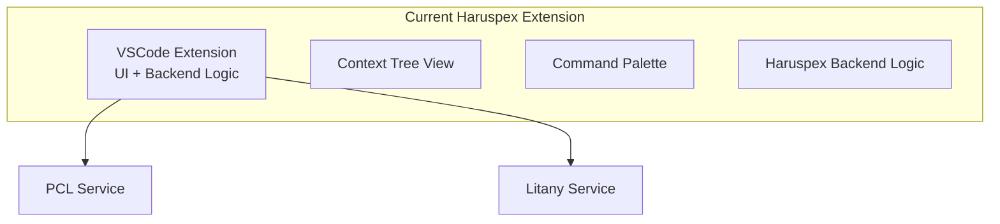
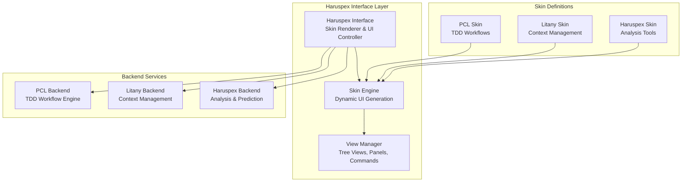
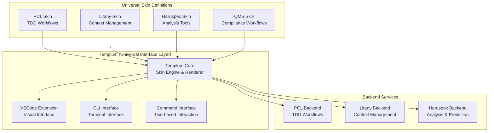
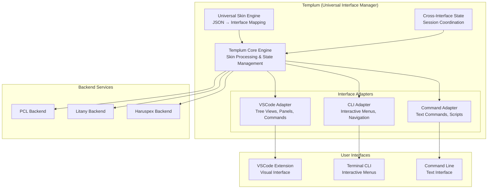

# Haruspex Separation: Interface and Backend Architecture

This document outlines the proposed architectural separation of Haruspex into distinct Interface and Backend entities, enabling unified Skin-based presentation of multiple backend services including PCL, Litany, and Haruspex-backend.

## Current vs. Proposed Architecture

> Current Architecture (Monolithic Haruspex)

The current Haruspex extension combines UI presentation and backend logic in a single monolithic structure:



> Proposed Architecture (Separated Interface + Backend)

The proposed separation creates a clean presentation layer that can dynamically render different service interfaces through the unified Skin system:



## Architectural Benefits

> Separation of Concerns

- **Haruspex Interface**: Pure presentation layer, UI rendering, interaction handling
- **Haruspex Backend**: Business logic, analysis algorithms, data processing
- **Service Backends**: Domain-specific functionality (PCL, Litany, Haruspex)

> Unified Skin System

The Haruspex Interface becomes a universal skin consumer:

```typescript
// Haruspex Interface as Skin Consumer
interface HaruspexInterface {
  loadSkin(skinDefinition: SkinDefinition): Promise<void>;
  renderView(viewId: string): Promise<VSCodePanel>;
  handleCommand(command: string, args: any[]): Promise<any>;
}

// All backends provide skins
interface BackendService {
  provideSkin(): SkinDefinition;
  handleCommand(command: string, context: any): Promise<any>;
}
```

> Dynamic View Management

The Haruspex Interface would become a universal skin renderer:

```typescript
class HaruspexInterface {
  private activeSkins: Map<string, SkinDefinition> = new Map();
  private viewManager: ViewManager;

  async loadBackendSkin(backend: 'pcl' | 'litany' | 'haruspex') {
    const skinDefinition = await this.getBackendSkin(backend);
    this.activeSkins.set(backend, skinDefinition);
    await this.renderSkinViews(skinDefinition);
  }

  private async renderSkinViews(skin: SkinDefinition) {
    // Dynamically create tree views, commands, panels
    for (const view of skin.views) {
      this.viewManager.createView(view);
    }
  }
}
```

## Implementation Architecture

> Haruspex Interface Layer

Core interface components for skin management and view orchestration:

```typescript
// Core interface components
export class HaruspexInterface {
  private skinEngine: SkinEngine;
  private viewManager: ViewManager;
  private backendConnector: BackendConnector;

  // Skin management
  async loadSkin(skinId: string): Promise<void> {
    const skin = await this.backendConnector.getSkin(skinId);
    await this.skinEngine.applySkin(skin);
  }

  // View orchestration
  async createViews(skinDefinition: SkinDefinition): Promise<void> {
    for (const viewDef of skinDefinition.views) {
      await this.viewManager.createView(viewDef);
    }
  }

  // Command routing
  async executeCommand(command: string, args: any[]): Promise<any> {
    const backend = this.determineBackend(command);
    return this.backendConnector.executeCommand(backend, command, args);
  }
}
```

> Unified Skin Format

Standardized skin definition structure for all backend services:

```typescript
interface UnifiedSkinDefinition {
  metadata: {
    id: string;
    name: string;
    backend: 'pcl' | 'litany' | 'haruspex';
    version: string;
  };

  views: {
    treeViews: TreeViewDefinition[];
    panels: PanelDefinition[];
    statusBar: StatusBarDefinition[];
  };

  commands: {
    [commandId: string]: CommandDefinition;
  };

  menus: {
    [menuId: string]: MenuDefinition;
  };

  shortcuts: {
    [keybinding: string]: string; // maps to command
  };

  workflows: {
    [workflowId: string]: WorkflowDefinition;
  };
}
```

## Backend Service Architecture

> PCL Backend Skin

PCL provides TDD workflow-focused skin configuration:

```typescript
class PCLBackendService implements BackendService {
  provideSkin(): SkinDefinition {
    return {
      metadata: {
        id: 'pcl-tdd-workflow',
        name: 'TDD Workflow',
        backend: 'pcl'
      },
      views: {
        treeViews: [{
          id: 'pcl.phases',
          title: 'TDD Phases',
          provider: 'TDDPhaseProvider'
        }],
        panels: [{
          id: 'pcl.session',
          title: 'Session Manager',
          type: 'webview'
        }]
      },
      commands: {
        'pcl.runPhase': {
          title: 'Run TDD Phase',
          handler: 'runTDDPhase'
        }
      },
      shortcuts: {
        'ctrl+shift+t': 'pcl.runTests'
      }
    };
  }
}
```

> Litany Backend Skin

Litany provides context management-focused skin configuration:

```typescript
class LitanyBackendService implements BackendService {
  provideSkin(): SkinDefinition {
    return {
      metadata: {
        id: 'litany-context-manager',
        name: 'Context Manager',
        backend: 'litany'
      },
      views: {
        treeViews: [{
          id: 'litany.contexts',
          title: 'Available Contexts',
          provider: 'ContextProvider'
        }]
      },
      commands: {
        'litany.getInfo': {
          title: 'Get Contextual Info',
          handler: 'getContextualInfo'
        }
      }
    };
  }
}
```

> Haruspex Backend Skin

Haruspex provides analysis and prediction-focused skin configuration:

```typescript
class HaruspexBackendService implements BackendService {
  provideSkin(): SkinDefinition {
    return {
      metadata: {
        id: 'haruspex-analysis',
        name: 'Code Analysis',
        backend: 'haruspex'
      },
      views: {
        panels: [{
          id: 'haruspex.predictions',
          title: 'Code Predictions',
          type: 'webview'
        }]
      },
      commands: {
        'haruspex.analyze': {
          title: 'Analyze Code',
          handler: 'runAnalysis'
        }
      }
    };
  }
}
```

## Key Architectural Advantages

> Unified User Experience

- Single VSCode extension provides access to all three backends
- Consistent UI patterns across all services
- Shared shortcuts, workflows, and automation

> Clean Backend Separation

- Each backend focuses purely on business logic
- No UI concerns in backend services
- Clear service boundaries and responsibilities

> Dynamic Interface Composition

The interface can compose views from multiple backends:

```typescript
// Example: Mixed view composition
await haruspexInterface.loadSkin('pcl-tdd-workflow');
await haruspexInterface.loadSkin('litany-context-manager');
await haruspexInterface.loadSkin('haruspex-analysis');

// Result: Unified interface with all three backend capabilities
```

> Improved Development Workflow

Based on the integration document, this supports:

- **Integrated workflows**: Saving files triggers tests/compliance checks
- **Skin Builder**: GUI tool for managing skins, shortcuts, workflows
- **VSCode as PCL workspace**: Full GUI instead of CLI-only interaction

## Implementation Strategy

> Phase 1: Extract Haruspex Interface

Extract the presentation layer from the current Haruspex extension:

- Separate UI components from business logic
- Create Skin Engine foundation
- Implement basic View Manager

> Phase 2: Implement Skin Engine and View Manager

Build the core skin rendering infrastructure:

- Skin definition parser and validator
- Dynamic view creation and management
- Command routing and execution

> Phase 3: Create Backend Skin Definitions

Develop skin definitions for all three backend services:

- PCL TDD workflow skin
- Litany context management skin
- Haruspex analysis skin

> Phase 4: Implement Dynamic View Composition

Enable multiple skin loading and view composition:

- Multi-backend skin management
- View conflict resolution
- Unified command palette

> Phase 5: Add Skin Builder GUI

Create management tools for interface configuration:

- Visual skin editor
- Shortcut and workflow management
- Skin validation and testing

## Integration Benefits

> Component Reuse Philosophy

- Leverages proven PCL patterns instead of rebuilding
- Shared infrastructure: Session management, configuration, audit logging
- Consistent error handling and validation across services

> Native IDE Experience

- Zero context switching between development tools
- Unified keyboard shortcuts and workflows
- Consistent UI patterns and navigation

> Performance Optimization

- Intelligent caching and lazy loading
- Reduced memory footprint through component sharing
- Optimized view rendering and updates

## Refined Architecture: Templum + Haruspex + Universal Skin System

> **Proposed Naming Convention**

- **Templum**: Frontend interface layer (formerly "Haruspex Interface")
- **Haruspex**: Backend service (analysis and prediction capabilities)
- **Universal Skin System**: Shared UI definition system across all interfaces

> **Current PCL Infrastructure Assessment**

Analysis of the Phoenix Code Lite codebase reveals that most of the skin system infrastructure **already exists**:

**Existing Components**:

- `SkinMenuRenderer`: JSON-driven menu system with theme support
- `UnifiedLayoutEngine`: Consistent rendering across interface modes
- `InteractionManager`: Dual-mode support (menu navigation + command input)
- Built-in skin definitions for QMS and PCL workflows

**Interface Compatibility**: PCL's `InteractionManager` already demonstrates that the same menu definitions work across:

- **Menu Mode**: Arrow navigation with numbered options
- **Command Mode**: Text-based command interface

> **Proposed Architecture with Templum**



> **Universal Skin Format** (Extended from PCL)

Building on PCL's existing SkinMenuDefinition structure:

```typescript
interface UniversalSkinDefinition {
  metadata: {
    id: string;
    name: string;
    backend: 'pcl' | 'litany' | 'haruspex';
    version: string;
    compatibleInterfaces: ['vscode', 'cli', 'command'][];
  };

  // Visual interface definitions (VSCode)
  views: {
    treeViews: TreeViewDefinition[];
    panels: PanelDefinition[];
    statusBar: StatusBarDefinition[];
  };

  // CLI interface definitions (from PCL SkinMenuRenderer)
  menus: {
    [menuId: string]: {
      title: string;
      subtitle?: string;
      items: MenuItemDefinition[];
      theme?: SkinTheme;
    };
  };

  // Command interface definitions
  commands: {
    [commandId: string]: {
      title: string;
      description: string;
      handler: string;
      shortcuts?: string[];
      prompts?: PromptDefinition[];
    };
  };

  // Cross-interface features
  workflows: {
    [workflowId: string]: WorkflowDefinition;
  };

  shortcuts: {
    [keybinding: string]: string;
  };
}
```

> **PCL Infrastructure Transfer Strategy**

**Phase 1: Extract and Adapt PCL Components**:

```typescript
// Transfer PCL's SkinMenuRenderer to Templum
class TemplumSkinEngine {
  private pclRenderer: SkinMenuRenderer;  // Reuse existing PCL component
  private vscodeRenderer: VSCodeSkinRenderer;  // New VSCode adapter
  private commandRenderer: CommandSkinRenderer;  // New command adapter

  // Universal skin loading
  async loadSkin(skinDef: UniversalSkinDefinition): Promise<void> {
    // Load skin across all interface modes
    await this.pclRenderer.renderMenu(skinDef.metadata.id, 'main');
    await this.vscodeRenderer.createViews(skinDef.views);
    await this.commandRenderer.registerCommands(skinDef.commands);
  }

  // Interface-agnostic command execution
  async executeCommand(command: string, interface: 'vscode' | 'cli' | 'command'): Promise<any> {
    // Route to appropriate backend regardless of interface
    return this.routeToBackend(command, interface);
  }
}
```

**Phase 2: Implement Interface Adapters**:

```typescript
// VSCode interface adapter
class VSCodeSkinRenderer {
  async createViews(views: ViewDefinitions): Promise<void> {
    // Create VSCode tree views, panels, status bars
    for (const treeView of views.treeViews) {
      vscode.window.createTreeView(treeView.id, {
        treeDataProvider: new DynamicTreeProvider(treeView)
      });
    }
  }
}

// Command interface adapter (extends PCL's existing command system)
class CommandSkinRenderer {
  async registerCommands(commands: CommandDefinitions): Promise<void> {
    // Register commands for text-based interface
    for (const [id, command] of Object.entries(commands)) {
      this.commandRegistry.set(id, command);
    }
  }
}
```

> **Interface Compatibility Benefits**

**For Skin Developers**: Zero additional work required

- Write skin once, works across VSCode, CLI menu mode, and command mode
- Same JSON definitions work seamlessly across all interfaces
- Existing PCL skins (QMS, TDD workflows) work immediately

**For Users**: Consistent experience across interfaces

- Same commands available whether in VSCode or terminal
- Consistent keyboard shortcuts and workflows
- Seamless switching between visual and text interfaces

**For Developers**: Clean architecture and code reuse

- Leverages proven PCL infrastructure instead of rebuilding
- Single skin system to maintain across all interfaces
- Backend services focus purely on business logic

> **Implementation Feasibility Assessment**

**✅ Highly Feasible Components**:

- PCL's SkinMenuRenderer already provides JSON-driven menu system
- Unified layout engine already handles consistent rendering
- Dual-mode interaction already proven in PCL
- Built-in skin definitions already exist and can be extended

**✅ Straightforward Adaptations**:

- VSCode tree view creation from skin definitions
- Command registration for text-based interface
- Backend routing already partially implemented

**✅ Zero Breaking Changes**:

- Existing PCL CLI interface continues to work
- Current skins remain compatible
- New Templum layer adds capabilities without removing existing ones

## Conclusion

This refined architecture with Templum as the universal interface layer is not only feasible but leverages existing, proven PCL infrastructure. The naming convention (Templum/Haruspex) provides clear separation of concerns while the universal skin system enables unprecedented interface flexibility.

The result creates genuine "interface-agnostic development" where users can interact with the same backend services through VSCode extensions, CLI menus, or command interfaces using identical skin definitions. This eliminates interface-specific development overhead while providing users with their preferred interaction method.

Most importantly, PCL already has 80% of the required infrastructure implemented, making this a high-value, low-risk architectural evolution rather than a complete rebuild.

## Templum as Universal Interface Manager

> Core Architecture

Templum acts as the "interface conductor" - a single system that can present the same backend functionality through multiple interface modalities. Think of it as having one brain (Templum) that can speak through different mouths (VSCode, CLI, Command) but delivers the same capabilities regardless of which interface the user chooses.



## How Templum Manages Each Interface

> VSCode Interface Management

```typescript
class VSCodeAdapter {
  private templumCore: TemplumCore;

  async createInterface(skinDef: UniversalSkinDefinition): Promise<void> {
    // Create VSCode tree views from skin definition
    for (const treeView of skinDef.views.treeViews) {
      vscode.window.createTreeView(treeView.id, {
        treeDataProvider: new TemplumTreeProvider(treeView, this.templumCore)
      });
    }

    // Register VSCode commands that route through Templum
    for (const [id, command] of Object.entries(skinDef.commands)) {
      vscode.commands.registerCommand(id, (...args) =>
        this.templumCore.executeCommand(id, 'vscode', args)
      );
    }
  }
}
```

> CLI Interface Management

```typescript
class CLIAdapter {
  private templumCore: TemplumCore;
  private pclRenderer: SkinMenuRenderer; // Reuse existing PCL component

  async createInterface(skinDef: UniversalSkinDefinition): Promise<void> {
    // Convert skin to PCL menu format and render
    const menuDef = this.convertSkinToMenu(skinDef);
    await this.pclRenderer.renderMenu(skinDef.metadata.id, 'main');

    // Handle menu navigation that routes through Templum
    this.setupMenuNavigation((command) =>
      this.templumCore.executeCommand(command, 'cli', [])
    );
  }
}
```

> Command Interface Management

```typescript
class CommandAdapter {
  private templumCore: TemplumCore;
  private commandRegistry: Map<string, CommandDefinition> = new Map();

  async createInterface(skinDef: UniversalSkinDefinition): Promise<void> {
    // Register all commands for text-based access
    for (const [id, command] of Object.entries(skinDef.commands)) {
      this.commandRegistry.set(id, command);
      this.commandRegistry.set(command.title.toLowerCase(), command); // Alias
    }
  }

  async executeCommand(input: string): Promise<any> {
    const command = this.commandRegistry.get(input);
    if (command) {
      return this.templumCore.executeCommand(command.handler, 'command', []);
    }
  }
}
```

## State Coordination Across Interfaces

> Templum maintains unified state regardless of interface:

```typescript
class TemplumCore {
  private sessionState: TemplumSession;
  private activeInterfaces: Set<'vscode' | 'cli' | 'command'> = new Set();

  async executeCommand(
    command: string,
    sourceInterface: 'vscode' | 'cli' | 'command',
    args: any[]
  ): Promise<any> {
    // Update state regardless of source interface
    this.sessionState.lastCommand = command;
    this.sessionState.lastInterface = sourceInterface;

    // Route to appropriate backend
    const result = await this.routeToBackend(command, args);

    // Notify all active interfaces of state change
    await this.syncStateAcrossInterfaces(result);

    return result;
  }

  private async syncStateAcrossInterfaces(result: any): Promise<void> {
    // Update VSCode tree views
    if (this.activeInterfaces.has('vscode')) {
      await this.vscodeAdapter.refreshViews(result);
    }

    // Update CLI status
    if (this.activeInterfaces.has('cli')) {
      await this.cliAdapter.updateStatus(result);
    }
  }
}
```

## User Experience Examples

> Scenario 1: User switches between interfaces

**User starts in VSCode:**

- VSCode: User clicks "Run TDD Phase" in tree view
- Templum: Executes command via PCL backend
- Result: Updates state, shows progress in VSCode

**User switches to CLI:**

- CLI: Shows same TDD session state
- User: Selects "2. Continue TDD Phase"
- Templum: Continues same session, updates VSCode tree view

**User switches to command mode:**

- Command: `$ pcl status`
- Templum: Shows current TDD phase from shared state

> Scenario 2: Same skin, different interface preferences

QMS Skin works identically across all interfaces:

```typescript
// QMS Skin works identically across all interfaces
const qmsSkin = {
  metadata: { id: 'qms-compliance' },

  // VSCode gets tree views and panels
  views: {
    treeViews: [{ id: 'qms.documents', title: 'QMS Documents' }]
  },

  // CLI gets interactive menus
  menus: {
    main: {
      title: 'QMS Compliance',
      items: [{ id: 'doc-process', label: 'Process Documents' }]
    }
  },

  // Command gets text commands
  commands: {
    'qms:process': { title: 'Process QMS Document', handler: 'processDocument' }
  }
};

// Templum presents this skin through all three interfaces simultaneously
```

## Key Benefits of Templum Managing All Interfaces

> Unified Interface Orchestration

- **Unified State**: Session persists across interface switches
- **Consistent Commands**: Same functionality regardless of interface
- **Synchronized Updates**: Changes in one interface reflect in others
- **Single Configuration**: One skin definition drives all interfaces
- **Seamless Switching**: Users can change interfaces mid-workflow

> Interface Agnostic Development Environment

This creates a truly interface-agnostic development environment. Users aren't locked into VSCode or CLI - they can use their preferred interface for different tasks:

- **VSCode**: For exploration and visual development
- **CLI**: For automation and batch operations
- **Commands**: For scripting and programmatic access

All while maintaining complete workflow continuity.

## Templum - Conclusion

Templum is the universal interface orchestrator that makes the same backend functionality available through:

- **VSCode visual interfaces**: Tree views, panels, and interactive elements
- **CLI interactive menus**: Command-line navigation and selection
- **Text-based commands**: Programmatic access and automation

All driven by the same skin definitions with perfect state synchronization across all three modes, creating a seamless development experience regardless of the user's preferred interface.
