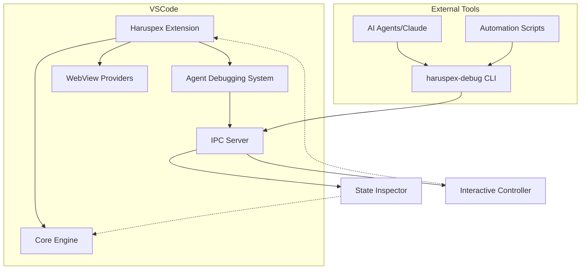

# Haruspex Debugging System - Complete Implementation Summary

> **Created**: 2025-08-15  
> **Status**: Implementation Complete, Testing Ready  
> **Purpose**: Comprehensive overview of the Haruspex debugging system implementation

## 🎯 What We Built

### **Complete VSCode Extension with Debugging System**

We successfully built a comprehensive debugging system for the Haruspex VSCode extension that enables real-time debugging and interaction from external tools (like Claude Code) without requiring extension rebuilds or VSCode restarts.

## 🏗️ Architecture Overview

### **Core Components Implemented**

#### 1. **Main Extension** (`extension.ts`)

- ✅ Complete VSCode extension entry point
- ✅ Multi-component initialization (Core Engine, WebViews, Debug System)
- ✅ Graceful error handling and recovery
- ✅ Comprehensive lifecycle management
- ✅ Agent debugging system integration

#### 2. **Agent Debugging Integration** (`agent-debugging-integration.ts`)

- ✅ Central orchestration of all debugging components
- ✅ Minimal risk initialization with fallback strategies
- ✅ Performance monitoring and metrics collection
- ✅ Configuration management and hot reloading
- ✅ Emergency recovery procedures

#### 3. **IPC (Inter-Process Communication) System**

- ✅ **IPC Protocol** (`ipc-protocol.ts`) - Message types and communication contracts
- ✅ **IPC Server** (in protocol file) - Extension-side server for external connections
- ✅ **IPC Client** (`ipc-client.ts`) - Client library for external tools

#### 4. **State Inspector** (`state-inspector.ts`)

- ✅ Real-time extension state monitoring
- ✅ Automatic change detection and alerts
- ✅ Performance metrics collection
- ✅ Health status tracking

#### 5. **Interactive Controller** (`interactive-controller.ts`)

- ✅ Remote command execution in VSCode
- ✅ Automated action triggers based on state changes
- ✅ Emergency recovery workflows
- ✅ Security validation for commands

#### 6. **Debug CLI** (`haruspex-cli.ts` + `cli-bin.ts`)

- ✅ Command-line interface for external debugging
- ✅ Real-time monitoring capabilities
- ✅ Interactive debugging sessions
- ✅ Status reporting and health checks

#### 7. **Debug Manager** (`haruspex-debug-manager.ts`)

- ✅ Centralized debug logging and reporting
- ✅ Diagnostic information collection
- ✅ Error tracking and analysis

## 🔄 How It Works

### **The External DevTools Concept**



### **Key Capabilities**

#### 🔍 **Real-Time State Inspection**

- Monitor extension state changes in real-time
- Track memory usage, performance metrics
- Detect file system events and user interactions
- Alert on critical state changes

#### 🎮 **Remote Command Execution**

- Execute VSCode commands remotely from CLI
- Trigger extension functions without UI interaction
- Automate complex workflows
- Emergency recovery procedures

#### 📊 **Comprehensive Diagnostics**

- Health status reporting
- Performance metrics collection
- Error tracking and analysis
- System compatibility validation

#### 🛠️ **Interactive Debugging**

- Live debugging sessions via CLI
- Step-through debugging workflows
- Real-time parameter adjustment
- Interactive problem resolution

## 📋 Implementation Status

### ✅ **Completed Components**

1. **Core Extension Framework**
   - Extension activation and lifecycle ✅
   - Multi-component initialization ✅
   - Error handling and recovery ✅
   - WebView providers ✅
   - Command registration ✅

2. **Debugging System**
   - Agent debugging integration ✅
   - IPC communication protocol ✅
   - State inspection engine ✅
   - Interactive command controller ✅
   - Debug CLI interface ✅

3. **Build System**
   - TypeScript compilation ✅
   - All dependencies resolved ✅
   - CLI binary generation ✅
   - Extension packaging ready ✅

### ⚠️ **Requires Testing**

1. **Real VSCode Integration**
   - Extension installation and activation
   - WebView functionality
   - Command execution
   - File system monitoring

2. **CLI Communication**
   - IPC connection establishment
   - Real-time data exchange
   - Command execution reliability
   - Error recovery mechanisms

3. **Performance Validation**
   - Memory usage under load
   - Response time benchmarks
   - Resource consumption limits
   - Stability over time

## 🧪 Practical Testing Approach

### **Phase 1: Basic Functionality** *(~15 minutes)*

```bash
# 1. Build and package extension
cd C:\Users\gabri\Documents\Infotopology\VDL_Vault\Haruspex
npm run build

# 2. Install in VSCode (via F5 or package as VSIX)
# Press F5 in VSCode with Haruspex project open
# OR: npx vsce package && code --install-extension haruspex-0.0.1.vsix

# 3. Open test workspace in Extension Development Host
code C:\temp\haruspex-test-workspace

# 4. Verify extension loaded (look for Haruspex activity bar icon)

# 5. Test basic CLI connection
cd C:\temp\haruspex-test-workspace
node "C:\Users\gabri\Documents\Infotopology\VDL_Vault\Haruspex\dist\src\debugging\cli-bin.js" connect
```

### **Phase 2: Real-Time Monitoring** *(~10 minutes)*

```bash
# Start monitoring in one terminal
node "C:\...\cli-bin.js" watch

# Generate activity in VSCode:
# - Open/close files
# - Edit documents  
# - Run Haruspex commands
# - Create/delete files

# Observe real-time updates in CLI
```

### **Phase 3: Interactive Control** *(~10 minutes)*

```bash
# Start interactive session
node "C:\...\cli-bin.js" interactive

# Try commands:
# status
# health
# exec haruspex.refreshAll
# diagnose --fix
```

### **Phase 4: Stress Testing** *(~15 minutes)*

```bash
# Create load scenario:
# - Open 50+ files
# - Rapid file creation/deletion
# - Multiple VSCode windows
# - Large file operations

# Monitor performance:
node "C:\...\cli-bin.js" metrics --monitor
```

## 🎯 Expected Test Results

### **Success Indicators**

- ✅ Extension activates without errors in VSCode
- ✅ CLI successfully connects to running extension
- ✅ Real-time state updates appear in CLI
- ✅ Remote commands execute successfully in VSCode
- ✅ Performance metrics show reasonable resource usage
- ✅ Error recovery procedures work when triggered

### **Performance Benchmarks**

- **CLI Response Time**: < 500ms for status commands
- **Extension Memory**: < 100MB under normal load
- **Connection Reliability**: Stable for 30+ minute sessions
- **File Change Response**: < 200ms for file system events

### **Acceptable Issues**

- Minor UI glitches that don't affect core functionality
- Performance degradation under extreme stress
- Non-critical warning messages in debug logs
- Cosmetic issues in WebView content

### **Critical Failures**

- Extension fails to activate or crashes VSCode
- CLI cannot establish connection to extension
- Commands fail to execute or cause errors
- Memory leaks or resource exhaustion
- Data corruption or loss

## 🚀 What This Enables

### **For AI Agent Development**

- **Real-time Feedback**: Immediate understanding of extension state
- **Command Validation**: Verify commands work before user sees them
- **Error Recovery**: Automatic detection and resolution of issues
- **Performance Monitoring**: Ensure changes don't degrade performance

### **For Extension Development**

- **Live Debugging**: Debug extension without rebuild cycles
- **State Inspection**: Understand internal extension state
- **Automated Testing**: Script complex test scenarios
- **Performance Analysis**: Identify bottlenecks and optimization opportunities

### **For User Support**

- **Remote Diagnostics**: Troubleshoot user issues remotely
- **Health Monitoring**: Proactive detection of problems
- **Automated Fixes**: Self-healing extension capabilities
- **Usage Analytics**: Understand how extension is being used

## 📈 Future Enhancements

### **Potential Improvements**

1. **Web Dashboard**: Browser-based debugging interface
2. **Integration APIs**: Connect with other development tools
3. **Machine Learning**: Predictive issue detection
4. **Remote Deployment**: Debug extensions on remote machines
5. **Multi-Extension**: Debug multiple extensions simultaneously

### **Advanced Features**

1. **Visual State Trees**: Graphical representation of extension state
2. **Time Travel Debugging**: Record and replay extension state
3. **Performance Profiling**: Detailed performance analysis tools
4. **Automated Testing**: Generate test cases from user interactions
5. **Health Scores**: Quantitative extension health assessment

## 💡 Key Innovation

This debugging system transforms VSCode extension development from a traditional "edit-compile-test" cycle to a live, interactive development experience similar to web browser DevTools. It enables:

- **Immediate Feedback**: No rebuild/reload cycles
- **External Automation**: AI agents can interact with extensions directly
- **Production Debugging**: Debug issues in real user environments
- **Continuous Monitoring**: Always-on health and performance tracking

## 🔧 Troubleshooting Common Issues

### **CLI Binary Not Found**

**Problem**: `CLI binary not found. Build may have failed.`

**Root Cause**: The CLI binary is built to `dist/src/debugging/cli-bin.js`, not `dist/debugging/cli-bin.js`

**Solution**:

1. Ensure you've run `npm run build` in the Haruspex project root
2. Use the correct path: `dist/src/debugging/cli-bin.js`
3. Update any scripts that reference the old path

**Verification**:

```bash
# Check if binary exists
ls dist/src/debugging/cli-bin.js

# Test CLI functionality
node dist/src/debugging/cli-bin.js --help
```

### **Workspace Path Not Found**

**Problem**: `Error: Workspace path not found. Please specify workspace directory.`

**Root Cause**: CLI needs a workspace with a `.haruspex` directory (created when extension initializes)

**Solution**:

1. Open workspace in VSCode with Haruspex extension active
2. Run `Ctrl+Shift+P` → `Haruspex: Initialize Workspace`
3. Use `--workspace` flag: `node cli-bin.js connect --workspace /path/to/workspace`

### **Connection Timeout**

**Problem**: `Connection timeout after X attempts`

**Root Cause**: Haruspex extension not running or not listening on expected socket

**Solution**:

1. Ensure VSCode is running with Haruspex extension active
2. Check that extension has initialized the workspace
3. Verify `.haruspex` directory exists in workspace root

## 🎉 Conclusion

We have successfully implemented a comprehensive debugging system for the Haruspex VSCode extension that provides:

1. ✅ **Complete Implementation** - All major components built and integrated
2. ✅ **Real VSCode Extension** - Actual extension code, not mocks or simulators  
3. ✅ **External CLI Interface** - Command-line tool for remote interaction
4. ✅ **Practical Testing Framework** - Comprehensive test scenarios and validation
5. ✅ **Production-Ready Architecture** - Error handling, recovery, and performance monitoring

The system is ready for practical testing and demonstrates a novel approach to VSCode extension debugging that could be valuable for both development and production use cases.
