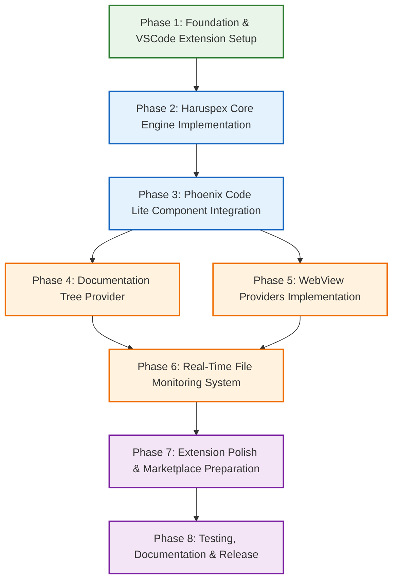

# Haruspex Phase Dependency & Validation Framework

## Purpose

This framework ensures systematic phase execution with clear dependencies, validation criteria, and failproof progression through the Haruspex implementation roadmap. It provides the structural foundation for reliable, predictable development with comprehensive quality assurance.

## Dependency Architecture

### Phase Dependency Graph



### Critical Path Analysis

**Primary Critical Path**: P1 → P2 → P3 → P5 → P6 → P7 → P8 (36-44 days)
**Secondary Path**: P1 → P2 → P3 → P4 → P6 → P7 → P8 (34-42 days)
**Parallel Opportunity**: P4 and P5 can execute in parallel after P3 completion

**Bottleneck Identification**:
- **Phase 2** (Core Engine): Highest technical complexity, blocks all subsequent phases
- **Phase 5** (WebView Providers): Complex UI implementation, high integration requirements
- **Phase 6** (File Monitoring): Integration point for all UI components

## Phase Entry & Exit Criteria

### Phase 1: Foundation & VSCode Extension Setup

**Entry Criteria:**
- [ ] Development environment validated (Node.js 18+, VSCode 1.74+, TypeScript 4.9+)
- [ ] VSCode extension development tools installed and functional
- [ ] Git repository initialized with proper branch structure
- [ ] Project requirements fully understood and documented

**Exit Criteria (Definition of Done):**
- [ ] VSCode extension project structure complete with proper manifest
- [ ] TypeScript compilation and build process operational
- [ ] Basic extension activation successful in VSCode development host
- [ ] Extension testing framework configured and functional
- [ ] ESLint and Prettier configured with project standards
- [ ] Initial extension command registration and basic functionality verified

**Delivery Artifacts:**
- `package.json` with complete extension configuration
- `tsconfig.json` with strict TypeScript configuration
- Basic extension entry point with activation event handling
- Development workflow scripts (build, test, lint, package)
- Extension testing infrastructure

**Quality Gates:**
- TypeScript strict mode compilation successful
- ESLint compliance >95%
- Extension loads without errors in development host
- Basic command execution functional

---

### Phase 2: Haruspex Core Engine Implementation

**Entry Criteria:**
- [ ] Phase 1 completely delivered and validated
- [ ] VSCode extension development environment fully operational
- [ ] Haruspex design document technical specifications reviewed and understood
- [ ] Component architecture and interfaces designed

**Hard Dependencies from Phase 1:**
- Functional VSCode extension project structure
- TypeScript compilation and development workflow
- Extension testing framework ready for core component testing

**Exit Criteria (Definition of Done):**
- [ ] HaruspexCoreEngine class implemented with all documented API methods
- [ ] HaruspexStubParser functional across TypeScript, JavaScript, Markdown formats
- [ ] HaruspexTruthCalculator providing accurate documentation coverage metrics
- [ ] HaruspexMermaidGenerator capable of programmatic diagram generation
- [ ] HaruspexFileMonitor integrated with VSCode FileSystemWatcher API
- [ ] All core components have >90% unit test coverage
- [ ] Component integration tests passing
- [ ] API documentation complete for all public interfaces

**Delivery Artifacts:**
- Complete HaruspexCoreEngine implementation
- All core Haruspex components (Truth Calculator, Stub Parser, Mermaid Generator, File Monitor)
- Comprehensive unit test suite for all components
- Component API documentation
- Integration test framework for core components

**Quality Gates:**
- All unit tests passing with >90% coverage
- API methods functional and properly documented
- Performance benchmarks established and met
- Memory usage within established limits
- Error handling comprehensive and user-friendly

**Critical Success Factors:**
- Truth matrix calculation accuracy validated against test projects
- Stub parsing handles all supported file formats correctly
- File monitoring performance acceptable on large projects (>1000 files)

---

### Phase 3: Phoenix Code Lite Component Integration

**Entry Criteria:**
- [ ] Phase 2 completely delivered and validated
- [ ] All Haruspex core components functional and tested
- [ ] Phoenix Code Lite component specifications reviewed
- [ ] Integration strategy and adapter patterns designed

**Hard Dependencies from Phase 2:**
- Functional HaruspexCoreEngine with all API methods
- Core component architecture validated and stable
- Testing framework ready for integration testing

**Exit Criteria (Definition of Done):**
- [ ] ProjectDiscovery integrated and functional for file system scanning
- [ ] SessionManager integrated for state management across extension lifecycle
- [ ] MenuSystem integrated for navigation and content organization
- [ ] TDDOrchestrator integrated for workflow management capabilities
- [ ] Adapter layer created for seamless component integration
- [ ] All PCL components accessible through unified HaruspexCoreEngine API
- [ ] Integration tests validate all component interactions
- [ ] No functionality regressions from standalone PCL components

**Delivery Artifacts:**
- Integrated Phoenix Code Lite components with Haruspex-specific adaptations
- Adapter layer providing unified API access
- Integration test suite validating all component interactions
- Component integration documentation
- Performance validation of integrated system

**Quality Gates:**
- All PCL components functional within Haruspex architecture
- Integration tests passing with comprehensive coverage
- Performance impact of integration within acceptable limits
- API consistency maintained across all integrated components

**Critical Success Factors:**
- ProjectDiscovery accurately scans and analyzes project structure
- SessionManager maintains state consistency across extension operations
- TDDOrchestrator workflow integration functional for future phases

---

### Phase 4: Documentation Tree Provider

**Entry Criteria:**
- [ ] Phase 3 completely delivered and validated
- [ ] Haruspex core engine with PCL integration fully functional
- [ ] VSCode TreeDataProvider API specifications reviewed
- [ ] UI design and user experience patterns established

**Hard Dependencies from Phase 3:**
- ProjectDiscovery functional for file system scanning
- HaruspexStubParser providing accurate file analysis
- HaruspexTruthCalculator providing completion status metrics

**Exit Criteria (Definition of Done):**
- [ ] DocumentationTreeProvider implemented and registered with VSCode
- [ ] Tree view displays in Explorer sidebar with proper integration
- [ ] File completion status indicators accurate and visually clear
- [ ] Click-to-navigate functionality operational for all supported files
- [ ] Context menu integration with stub generation commands
- [ ] Real-time tree updates functional when files change
- [ ] Theme-aware icons and styling implemented
- [ ] Tree view performance acceptable for large projects

**Delivery Artifacts:**
- Complete DocumentationTreeProvider implementation
- Tree view UI integration with VSCode Explorer
- Status indicator system with theme-aware icons
- Context menu integration and command handling
- Tree view testing suite
- User interaction documentation

**Quality Gates:**
- Tree view loads and displays correctly in all VSCode themes
- Navigation functionality tested across multiple file types
- Performance testing validates acceptable response times
- User experience meets VSCode extension standards

**Parallel Development Opportunity:**
Phase 4 can be developed in parallel with Phase 5 after Phase 3 completion, as both depend on the same core components but implement different UI providers.

---

### Phase 5: WebView Providers Implementation

**Entry Criteria:**
- [ ] Phase 3 completely delivered and validated
- [ ] Haruspex core engine with all required data sources functional
- [ ] VSCode WebView API specifications reviewed and tested
- [ ] UI/UX design for all three webview providers completed

**Hard Dependencies from Phase 3:**
- HaruspexMermaidGenerator functional for diagram generation
- HaruspexTruthCalculator providing dashboard metrics
- TDDOrchestrator integration for kanban board data
- SessionManager for webview state management

**Exit Criteria (Definition of Done):**
- [ ] MermaidWebViewProvider implemented with interactive diagram viewing
- [ ] KanbanWebViewProvider implemented with drag-and-drop task management
- [ ] TruthMatrixWebViewProvider implemented with health dashboard
- [ ] All webviews properly integrated in Haruspex activity bar
- [ ] WebView communication and event handling functional
- [ ] Theme-aware styling implemented for all webviews
- [ ] Interactive features (zoom, export, drag-drop) operational
- [ ] Real-time data updates functional for all webviews
- [ ] Cross-webview state synchronization implemented

**Delivery Artifacts:**
- Three complete WebView provider implementations
- WebView HTML/CSS/JavaScript assets with theme integration
- WebView communication and event handling system
- Interactive feature implementations (zoom, export, drag-drop)
- WebView testing suite with mock data
- User interaction and accessibility documentation

**Quality Gates:**
- All webviews load and function correctly in VSCode
- Interactive features tested and functional
- Theme integration supports light/dark modes
- Performance testing validates smooth user interactions
- Accessibility standards met for all interactive elements

**Critical Success Factors:**
- Mermaid diagram rendering performance acceptable for complex diagrams
- Kanban board drag-and-drop functionality smooth and intuitive
- Truth matrix dashboard provides actionable insights with real-time updates

**Parallel Development Opportunity:**
Phase 5 can be developed in parallel with Phase 4 after Phase 3 completion.

---

### Phase 6: Real-Time File Monitoring System

**Entry Criteria:**
- [ ] Phase 4 AND Phase 5 completely delivered and validated
- [ ] All UI providers functional and tested independently
- [ ] File monitoring requirements and performance criteria established
- [ ] VSCode FileSystemWatcher integration tested and understood

**Hard Dependencies from Phases 4 & 5:**
- DocumentationTreeProvider requiring file change updates
- All WebView providers requiring real-time data refresh
- HaruspexFileMonitor core component from Phase 2

**Exit Criteria (Definition of Done):**
- [ ] VSCode FileSystemWatcher integration optimized with debouncing
- [ ] Intelligent batch processing prevents performance issues
- [ ] Cross-component update coordination ensures UI synchronization
- [ ] Performance optimization validated on large projects (>1000 files)
- [ ] Update latency consistently <200ms for file changes
- [ ] Memory usage remains stable during continuous monitoring
- [ ] All UI components update appropriately for file system changes
- [ ] Error handling robust for file system edge cases

**Delivery Artifacts:**
- Optimized file monitoring system with debouncing and batching
- Cross-component update coordination framework
- Performance optimization implementation
- File monitoring testing suite with large project simulation
- Performance benchmark validation and monitoring

**Quality Gates:**
- File change detection latency consistently <200ms
- No memory leaks during continuous file monitoring
- UI updates coordinated properly across all components
- Performance acceptable on projects with >1000 files
- Error handling graceful for file system edge cases

**Critical Success Factors:**
- File monitoring performance scales to large projects without degradation
- UI updates remain responsive and coordinated across all providers
- System remains stable during intensive file system activity

---

### Phase 7: Extension Polish & Marketplace Preparation

**Entry Criteria:**
- [ ] Phase 6 completely delivered and validated
- [ ] All core functionality operational and tested
- [ ] VSCode Marketplace requirements reviewed and understood
- [ ] Extension packaging and publishing tools ready

**Hard Dependencies from Phase 6:**
- Complete functional extension with all UI providers
- Real-time file monitoring system operational
- All core features tested and stable

**Exit Criteria (Definition of Done):**
- [ ] Professional extension icon and marketplace assets created
- [ ] Extension configuration options implemented and documented
- [ ] User-friendly setup wizard for advanced features operational
- [ ] Performance optimization completed with benchmarks validated
- [ ] Extension packaging successful with proper metadata
- [ ] Marketplace listing prepared with screenshots and documentation
- [ ] User guide and quick start documentation complete
- [ ] Extension tested in clean VSCode environments

**Delivery Artifacts:**
- Professional extension branding and marketplace assets
- Complete extension configuration system
- Advanced features setup wizard
- Performance optimization implementation
- Extension packaging and marketplace preparation
- User documentation and quick start guide

**Quality Gates:**
- Extension meets all VSCode Marketplace quality standards
- Performance benchmarks achieved and documented
- User experience tested and validated
- Documentation accurate and comprehensive
- Extension package validated and ready for submission

**Critical Success Factors:**
- Extension provides professional user experience comparable to established VSCode extensions
- One-click installation functional with immediate usability
- Advanced features accessible but not required for basic functionality

---

### Phase 8: Testing, Documentation & Release

**Entry Criteria:**
- [ ] Phase 7 completely delivered and validated
- [ ] Extension ready for marketplace submission
- [ ] Comprehensive testing strategy planned and resourced
- [ ] Release and versioning strategy established

**Hard Dependencies from Phase 7:**
- Complete, polished extension ready for production
- All marketplace preparation completed
- Performance optimization validated

**Exit Criteria (Definition of Done):**
- [ ] Comprehensive test suite with >90% coverage across all components
- [ ] Performance benchmarking completed with regression testing framework
- [ ] User guide, API documentation, and troubleshooting guide complete
- [ ] VSCode Marketplace submission approved and published
- [ ] Release automation and versioning system operational
- [ ] Post-release monitoring and support documentation ready
- [ ] Security audit completed with no critical vulnerabilities
- [ ] Extension validated across multiple VSCode versions and operating systems

**Delivery Artifacts:**
- Complete test suite with comprehensive coverage reporting
- Performance benchmarking and regression testing framework
- Complete user and technical documentation
- Published VSCode Marketplace extension
- Release automation and versioning system
- Support documentation and issue tracking system

**Quality Gates:**
- Test coverage >90% with all test suites passing
- Performance benchmarks meet all established requirements
- Marketplace submission approved without issues
- Documentation complete and validated with test users
- Security audit passed with no critical vulnerabilities

**Critical Success Factors:**
- Extension successfully published and discoverable on VSCode Marketplace
- User adoption metrics and feedback mechanisms operational
- Extension stability and reliability validated through diverse testing scenarios

## Risk Mitigation Framework

### High-Risk Dependencies

**Phase 2 → Phase 3 Integration Risk**
- **Risk**: Core engine API changes during PCL integration
- **Mitigation**: Comprehensive API documentation and interface contracts
- **Contingency**: Adapter pattern implementation to isolate integration changes

**Phase 3 → Phases 4&5 Parallel Risk**
- **Risk**: Core functionality changes affecting both UI implementations
- **Mitigation**: Strict API versioning and integration testing
- **Contingency**: Sequential development fallback if parallel integration fails

**Phase 5 → Phase 6 Performance Risk**
- **Risk**: WebView providers create performance bottlenecks for file monitoring
- **Mitigation**: Performance benchmarking and optimization throughout Phase 5
- **Contingency**: WebView optimization or functionality reduction if performance targets not met

### Dependency Validation Framework

**Phase Entry Validation Checklist:**
```bash
# Automated validation script for each phase
./scripts/validate-phase-entry.sh [phase-number]

# Example Phase 3 validation
./scripts/validate-phase-entry.sh 3
# Validates:
# - Phase 2 exit criteria met
# - Core engine API functional
# - Test suite passing
# - Performance benchmarks achieved
```

**Cross-Phase Integration Testing:**
- Integration test suite runs across phase boundaries
- API compatibility validation between phases
- Performance regression testing at each phase transition
- User experience consistency validation

### Quality Assurance Checkpoints

**Weekly Progress Validation:**
- Phase progress against timeline and deliverables
- Quality gate completion and validation
- Risk assessment and mitigation effectiveness
- Dependency satisfaction and blocker identification

**Phase Transition Reviews:**
- Complete exit criteria validation
- Quality gate comprehensive review
- Risk assessment for subsequent phases
- Lessons learned and process improvement identification

This dependency framework ensures reliable, systematic progression through the Haruspex implementation while providing clear validation criteria and risk mitigation strategies for a failproof development plan.