# Haruspex 2.0 — Pure Backend Analysis and Prediction Service

**Date:** 2025-08-21  
**Version:** 2.0  
**Architecture Type:** Pure Backend Analysis and Prediction Service  
**Context:** Separated from Interface Layer, API-First Architecture  
**Implementation Status:** **READY FOR IMPLEMENTATION** ✅

---

## Overview

Haruspex 2.0 is a pure backend analysis and prediction service that provides comprehensive code analysis, pattern detection, and predictive insights through a clean API-first architecture. Separated from all UI concerns, Haruspex 2.0 focuses exclusively on advanced analysis capabilities, machine learning-driven predictions, and intelligent diagnostic systems for development environments.

## ⚡ **Core Architecture: Pure Backend Service**

### **API-First Backend Architecture**

```typescript
┌─────────────────────────────────────────────────────────────────┐
│                    Haruspex 2.0 Backend Service                 │
│  ┌──────────────────────────────────────────────────────────┐   │
│  │                    Haruspex Core Engine                  │   │
│  │  ┌─────────────────┬─────────────────┬────────────────┐  │   │
│  │  │  Analysis       │   Prediction    │   Diagnostic   │  │   │
│  │  │  Engine         │   Engine        │   System       │  │   │
│  │  │  Pattern Rec.   │   ML Models     │   Health Mon.  │  │   │
│  │  └─────────────────┴─────────────────┴────────────────┘  │   │
│  └──────────────────────────────────────────────────────────┘   │
│  ┌──────────────────────────────────────────────────────────┐   │
│  │                    API Gateway Layer                     │   │
│  │  ┌─────────────────┬─────────────────┬────────────────┐  │   │
│  │  │   IPC Server    │   HTTP API      │  WebSocket     │  │   │
│  │  │   Real-time     │   REST          │  Streaming     │  │   │
│  │  │   Commands      │   Integration   │  Analysis      │  │   │
│  │  └─────────────────┴─────────────────┴────────────────┘  │   │
│  └──────────────────────────────────────────────────────────┘   │
│  ┌──────────────────────────────────────────────────────────┐   │
│  │                  Backend Data Layer                      │   │
│  │  ┌─────────────────┬─────────────────┬────────────────┐  │   │
│  │  │   Analysis      │   Model         │   Cache        │  │   │
│  │  │   Cache         │   Storage       │   Management   │  │   │
│  │  │   Fast Access   │   ML Weights    │   Performance  │  │   │
│  │  └─────────────────┴─────────────────┴────────────────┘  │   │
│  └──────────────────────────────────────────────────────────┘   │
└─────────────────────────────┬───────────────────────────────────┘
                              │ Clean API Surface
                              │ (IPC, HTTP, WebSocket)
┌─────────────────────────────┴───────────────────────────────────┐
│                      Client Applications                        │
│  ┌──────────────────────────────────────────────────────────┐   │
│  │                    Frontend Clients                      │   │
│  │  ┌─────────────────┬─────────────────┬────────────────┐  │   │
│  │  │    Templum      │   Direct API    │   Third-Party  │  │   │
│  │  │   Interface     │   Clients       │   Integrations │  │   │
│  │  │   Layer         │   CLI Tools     │   IDEs         │  │   │
│  │  └─────────────────┴─────────────────┴────────────────┘  │   │
│  └──────────────────────────────────────────────────────────┘   │
└─────────────────────────────────────────────────────────────────┘

✅ Pure Backend Service  ✅ API-First Architecture  ✅ No UI Concerns
✅ Analysis & Prediction  ✅ Multi-Protocol Support
```

### **Service Architecture Diagram**

```mermaid
graph TB
    subgraph "Haruspex 2.0 Backend Service"
        HaruspexCore[Haruspex Core Engine<br/>Analysis & Prediction Orchestrator]
        
        subgraph "Analysis Engine"
            CodeAnalyzer[Code Analyzer<br/>Static Analysis & Pattern Detection]
            PerformanceAnalyzer[Performance Analyzer<br/>Bottleneck Detection & Optimization]
            SecurityAnalyzer[Security Analyzer<br/>Vulnerability Detection & Risk Assessment]
            ArchitectureAnalyzer[Architecture Analyzer<br/>Design Pattern & Structure Analysis]
        end
        
        subgraph "Prediction Engine"
            PatternPredictor[Pattern Predictor<br/>Code Pattern Prediction & Suggestion]
            BugPredictor[Bug Predictor<br/>Potential Issue Detection & Prevention]
            RefactoringPredictor[Refactoring Predictor<br/>Code Improvement Opportunities]
            PerformancePredictor[Performance Predictor<br/>Performance Impact Prediction]
        end
        
        subgraph "API Gateway"
            IPCServer[IPC Server<br/>Real-time Communication]
            HTTPServer[HTTP Server<br/>REST API Endpoints]
            WebSocketServer[WebSocket Server<br/>Streaming Analysis]
            SkinProvider[Skin Provider<br/>Interface Definition Generator]
        end
        
        subgraph "Support Systems"
            DiagnosticSystem[Diagnostic System<br/>Health Monitoring & Performance]
            CacheManager[Cache Manager<br/>Analysis Result Caching]
            ModelManager[Model Manager<br/>ML Model Lifecycle Management]
        end
    end
    
    subgraph "External Clients"
        TemplumClient[Templum Interface Layer<br/>Primary UI Consumer]
        APIClients[Direct API Clients<br/>CLI Tools & Scripts]
        ThirdPartyClients[Third-Party Integrations<br/>IDEs & Development Tools]
    end
    
    subgraph "Data Sources"
        CodeRepository[Code Repository<br/>Source Code Analysis]
        ProjectMetadata[Project Metadata<br/>Configuration & Dependencies]
        HistoricalData[Historical Data<br/>Previous Analysis Results]
    end
    
    %% Core connections
    HaruspexCore --> CodeAnalyzer
    HaruspexCore --> PerformanceAnalyzer
    HaruspexCore --> SecurityAnalyzer
    HaruspexCore --> ArchitectureAnalyzer
    
    HaruspexCore --> PatternPredictor
    HaruspexCore --> BugPredictor
    HaruspexCore --> RefactoringPredictor
    HaruspexCore --> PerformancePredictor
    
    HaruspexCore --> IPCServer
    HaruspexCore --> HTTPServer
    HaruspexCore --> WebSocketServer
    HaruspexCore --> SkinProvider
    
    HaruspexCore --> DiagnosticSystem
    HaruspexCore --> CacheManager
    HaruspexCore --> ModelManager
    
    %% Client connections
    IPCServer --> TemplumClient
    HTTPServer --> APIClients
    WebSocketServer --> ThirdPartyClients
    SkinProvider --> TemplumClient
    
    %% Data source connections
    CodeRepository --> CodeAnalyzer
    ProjectMetadata --> ArchitectureAnalyzer
    HistoricalData --> PatternPredictor
```



## 🏗️ **Core Backend Components**

### **1. Haruspex Core Engine**

```typescript
/**---
 * title: [Haruspex Core Engine - Analysis and Prediction Orchestrator]
 * tags: [Core, Engine, Analysis, Prediction, Orchestration]
 * provides: [Analysis Coordination, Prediction Management, Backend API]
 * requires: [Analysis Engines, Prediction Models, API Gateways]
 * description: [Central orchestration engine for all analysis and prediction capabilities]
 * ---*/

export class HaruspexCore {
  private analysisEngine: AnalysisEngine;
  private predictionEngine: PredictionEngine;
  private apiGateway: APIGateway;
  private diagnosticSystem: DiagnosticSystem;
  private cacheManager: CacheManager;
  private modelManager: ModelManager;
  private activeAnalyses: Map<string, AnalysisSession> = new Map();

  constructor(private config: HaruspexConfig = this.getDefaultConfig()) {
    this.analysisEngine = new AnalysisEngine(config.analysis);
    this.predictionEngine = new PredictionEngine(config.prediction);
    this.apiGateway = new APIGateway(config.api);
    this.diagnosticSystem = new DiagnosticSystem(config.diagnostics);
    this.cacheManager = new CacheManager(config.cache);
    this.modelManager = new ModelManager(config.models);
  }

  async initialize(): Promise<void> {
    console.log('Haruspex Core: Initializing backend service...');

    // Initialize core components
    await this.analysisEngine.initialize();
    await this.predictionEngine.initialize();
    await this.modelManager.loadModels();
    
    // Start API gateway
    await this.apiGateway.start();
    
    // Initialize diagnostic monitoring
    await this.diagnosticSystem.startMonitoring();
    
    // Setup cache management
    await this.cacheManager.initialize();

    console.log('Haruspex Core: Backend service initialization complete');
  }

  async analyzeCode(request: AnalysisRequest): Promise<AnalysisResult> {
    const sessionId = this.generateSessionId();
    const startTime = Date.now();

    try {
      // Create analysis session
      const session = this.createAnalysisSession(sessionId, request);
      this.activeAnalyses.set(sessionId, session);

      // Check cache for previous analysis
      const cachedResult = await this.cacheManager.getAnalysis(request.contentHash);
      if (cachedResult && this.isCacheValid(cachedResult, request)) {
        console.log(`Haruspex Core: Cache hit for analysis ${sessionId}`);
        return this.enhanceWithSession(cachedResult, session);
      }

      // Perform comprehensive analysis
      const analysisResult = await this.analysisEngine.analyzeCode(request, session);
      
      // Generate predictions based on analysis
      const predictions = await this.predictionEngine.generatePredictions(
        analysisResult,
        request,
        session
      );

      // Combine results
      const combinedResult: AnalysisResult = {
        sessionId,
        timestamp: Date.now(),
        analysis: analysisResult,
        predictions,
        metadata: {
          executionTime: Date.now() - startTime,
          cacheHit: false,
          modelVersions: this.modelManager.getActiveVersions()
        }
      };

      // Cache results for future use
      await this.cacheManager.cacheAnalysis(request.contentHash, combinedResult);

      // Update diagnostics
      this.diagnosticSystem.recordAnalysis(sessionId, combinedResult);

      return combinedResult;

    } catch (error) {
      console.error(`Haruspex Core: Analysis failed for session ${sessionId}: ${error.message}`);
      
      // Record error in diagnostics
      this.diagnosticSystem.recordError(sessionId, error);
      
      throw new AnalysisError(`Analysis failed: ${error.message}`, sessionId);
    } finally {
      this.activeAnalyses.delete(sessionId);
    }
  }

  async predictCodeEvolution(request: PredictionRequest): Promise<PredictionResult> {
    const sessionId = this.generateSessionId();
    
    try {
      // Validate prediction request
      this.validatePredictionRequest(request);

      // Generate predictions using ML models
      const predictions = await this.predictionEngine.predictEvolution(request);
      
      // Enhance predictions with contextual analysis
      const contextualAnalysis = await this.analysisEngine.analyzeContext(
        request.codeContext,
        request.historicalData
      );

      const result: PredictionResult = {
        sessionId,
        timestamp: Date.now(),
        predictions,
        contextualInsights: contextualAnalysis,
        confidence: this.calculatePredictionConfidence(predictions),
        recommendations: this.generateRecommendations(predictions, contextualAnalysis)
      };

      this.diagnosticSystem.recordPrediction(sessionId, result);
      return result;

    } catch (error) {
      console.error(`Haruspex Core: Prediction failed for session ${sessionId}: ${error.message}`);
      throw new PredictionError(`Prediction failed: ${error.message}`, sessionId);
    }
  }

  async getSystemDiagnostics(): Promise<SystemDiagnostics> {
    return {
      timestamp: Date.now(),
      coreEngine: {
        status: 'healthy',
        activeAnalyses: this.activeAnalyses.size,
        totalAnalyses: this.diagnosticSystem.getTotalAnalyses(),
        averageResponseTime: this.diagnosticSystem.getAverageResponseTime()
      },
      analysisEngine: await this.analysisEngine.getDiagnostics(),
      predictionEngine: await this.predictionEngine.getDiagnostics(),
      apiGateway: this.apiGateway.getStatus(),
      cacheManager: this.cacheManager.getStatus(),
      modelManager: this.modelManager.getStatus(),
      performance: this.diagnosticSystem.getPerformanceMetrics(),
      health: this.calculateSystemHealth()
    };
  }

  async provideSkinDefinition(): Promise<UniversalSkinDefinition> {
    // Generate skin definition for Templum consumption
    return {
      metadata: {
        id: 'haruspex-analysis',
        name: 'Code Analysis & Prediction',
        backend: 'haruspex',
        version: '2.0.0',
        compatibleInterfaces: ['vscode', 'cli', 'command'],
        description: 'Advanced code analysis and prediction capabilities',
        author: 'Haruspex Backend Service'
      },

      // VSCode interface components
      views: {
        treeViews: [
          {
            id: 'haruspex.analysisResults',
            title: 'Analysis Results',
            description: 'Code analysis findings and insights',
            dataProvider: 'getAnalysisTreeData',
            onSelectionChange: 'haruspex.selectAnalysisItem'
          },
          {
            id: 'haruspex.predictions',
            title: 'Code Predictions',
            description: 'Predictive insights and recommendations',
            dataProvider: 'getPredictionTreeData',
            onSelectionChange: 'haruspex.selectPrediction'
          }
        ],
        panels: [
          {
            id: 'haruspex.analysisPanel',
            title: 'Analysis Dashboard',
            type: 'webview',
            contentUrl: '/analysis-dashboard',
            messageHandler: 'haruspex.handlePanelMessage'
          },
          {
            id: 'haruspex.predictionPanel',
            title: 'Prediction Insights',
            type: 'webview',
            contentUrl: '/prediction-dashboard',
            messageHandler: 'haruspex.handlePredictionMessage'
          }
        ],
        statusBar: [
          {
            id: 'haruspex.status',
            text: 'Haruspex Ready',
            tooltip: 'Haruspex Analysis Service Status',
            priority: 'normal'
          }
        ]
      },

      // CLI interface menus
      menus: {
        main: {
          title: 'Haruspex Analysis Service',
          subtitle: 'Code Analysis & Prediction',
          items: [
            {
              id: 'analyze-code',
              label: '1. Analyze Code',
              description: 'Perform comprehensive code analysis',
              action: 'haruspex.analyzeCode'
            },
            {
              id: 'predict-evolution',
              label: '2. Predict Code Evolution',
              description: 'Generate predictive insights for code changes',
              action: 'haruspex.predictEvolution'
            },
            {
              id: 'view-diagnostics',
              label: '3. System Diagnostics',
              description: 'View system health and performance metrics',
              action: 'haruspex.getDiagnostics'
            }
          ]
        }
      },

      // Command interface definitions
      commands: {
        'haruspex.analyzeCode': {
          title: 'Analyze Code',
          description: 'Perform comprehensive code analysis',
          handler: 'analyzeCode',
          shortcuts: ['analyze', 'scan'],
          examples: [
            'haruspex.analyzeCode --file src/main.ts',
            'analyze --directory src/ --deep'
          ]
        },
        'haruspex.predictEvolution': {
          title: 'Predict Code Evolution',
          description: 'Generate predictive insights for code development',
          handler: 'predictCodeEvolution',
          shortcuts: ['predict', 'forecast'],
          examples: [
            'predict --context current-sprint',
            'haruspex.predictEvolution --historical 30d'
          ]
        },
        'haruspex.getDiagnostics': {
          title: 'Get System Diagnostics',
          description: 'Retrieve system health and performance information',
          handler: 'getSystemDiagnostics',
          shortcuts: ['diagnostics', 'status', 'health']
        }
      },

      // Cross-interface workflows
      workflows: {
        'deepAnalysis': {
          title: 'Deep Code Analysis',
          description: 'Comprehensive multi-phase code analysis',
          steps: [
            { id: 'scan', command: 'haruspex.analyzeCode', description: 'Initial code scan' },
            { id: 'predict', command: 'haruspex.predictEvolution', description: 'Generate predictions' },
            { id: 'report', command: 'haruspex.generateReport', description: 'Create analysis report' }
          ]
        }
      },

      shortcuts: {
        'ctrl+shift+a': 'haruspex.analyzeCode',
        'ctrl+shift+p': 'haruspex.predictEvolution',
        'ctrl+shift+d': 'haruspex.getDiagnostics'
      },

      theme: {
        primary: '#2E86AB',
        secondary: '#A23B72',
        accent: '#F18F01',
        success: '#C73E1D',
        warning: '#F18F01',
        error: '#C73E1D',
        background: '#F3F4F6',
        foreground: '#1F2937'
      },

      backendConfig: {
        endpoint: 'ipc://haruspex-backend',
        protocol: 'ipc',
        timeout: 30000,
        retries: 3
      }
    };
  }

  private createAnalysisSession(sessionId: string, request: AnalysisRequest): AnalysisSession {
    return {
      id: sessionId,
      request,
      startTime: Date.now(),
      status: 'active',
      progress: 0,
      phases: []
    };
  }

  private calculateSystemHealth(): number {
    let healthScore = 100;

    // Deduct for high resource usage
    const memoryUsage = process.memoryUsage().heapUsed / 1024 / 1024;
    if (memoryUsage > 500) healthScore -= 20;
    else if (memoryUsage > 300) healthScore -= 10;

    // Deduct for slow response times
    const avgResponseTime = this.diagnosticSystem.getAverageResponseTime();
    if (avgResponseTime > 2000) healthScore -= 30;
    else if (avgResponseTime > 1000) healthScore -= 15;

    // Deduct for errors
    const errorRate = this.diagnosticSystem.getErrorRate();
    if (errorRate > 0.05) healthScore -= 25;
    else if (errorRate > 0.01) healthScore -= 10;

    return Math.max(0, healthScore);
  }

  async shutdown(): Promise<void> {
    console.log('Haruspex Core: Shutting down backend service...');

    // Stop accepting new requests
    await this.apiGateway.stop();

    // Wait for active analyses to complete
    await this.waitForActiveAnalyses();

    // Shutdown components
    await this.analysisEngine.shutdown();
    await this.predictionEngine.shutdown();
    await this.diagnosticSystem.stop();
    await this.cacheManager.shutdown();

    console.log('Haruspex Core: Backend service shutdown complete');
  }
}
```

### **2. Analysis Engine**

```typescript
/**---
 * title: [Analysis Engine - Comprehensive Code Analysis System]
 * tags: [Analysis, Engine, Code-Analysis, Pattern-Detection, Performance]
 * provides: [Code Analysis, Pattern Recognition, Performance Analysis, Security Scanning]
 * requires: [Static Analysis Tools, AST Parsers, Performance Profilers]
 * description: [Multi-faceted code analysis engine with comprehensive scanning capabilities]
 * ---*/

export class AnalysisEngine {
  private codeAnalyzer: CodeAnalyzer;
  private performanceAnalyzer: PerformanceAnalyzer;
  private securityAnalyzer: SecurityAnalyzer;
  private architectureAnalyzer: ArchitectureAnalyzer;
  private patternDetector: PatternDetector;
  private analysisCache: Map<string, CachedAnalysis> = new Map();

  constructor(private config: AnalysisEngineConfig) {
    this.codeAnalyzer = new CodeAnalyzer(config.codeAnalysis);
    this.performanceAnalyzer = new PerformanceAnalyzer(config.performance);
    this.securityAnalyzer = new SecurityAnalyzer(config.security);
    this.architectureAnalyzer = new ArchitectureAnalyzer(config.architecture);
    this.patternDetector = new PatternDetector(config.patterns);
  }

  async initialize(): Promise<void> {
    console.log('Analysis Engine: Initializing analysis components...');

    // Initialize all analyzers
    await Promise.all([
      this.codeAnalyzer.initialize(),
      this.performanceAnalyzer.initialize(),
      this.securityAnalyzer.initialize(),
      this.architectureAnalyzer.initialize(),
      this.patternDetector.initialize()
    ]);

    console.log('Analysis Engine: All analyzers initialized');
  }

  async analyzeCode(request: AnalysisRequest, session: AnalysisSession): Promise<ComprehensiveAnalysis> {
    const analysisId = `analysis_${session.id}_${Date.now()}`;
    
    try {
      // Update session progress
      session.status = 'analyzing';
      session.progress = 0;

      // Phase 1: Code Structure Analysis
      session.phases.push({ name: 'Code Structure', status: 'active', startTime: Date.now() });
      const codeAnalysis = await this.codeAnalyzer.analyze(request.code, {
        language: request.language,
        framework: request.framework,
        includeMetrics: true,
        includeComplexity: true
      });
      session.progress = 25;
      session.phases[session.phases.length - 1].status = 'completed';

      // Phase 2: Performance Analysis
      session.phases.push({ name: 'Performance Analysis', status: 'active', startTime: Date.now() });
      const performanceAnalysis = await this.performanceAnalyzer.analyze(request.code, {
        detectBottlenecks: true,
        analyzeComplexity: true,
        checkMemoryUsage: true,
        profileExecution: request.includeExecution || false
      });
      session.progress = 50;
      session.phases[session.phases.length - 1].status = 'completed';

      // Phase 3: Security Analysis
      session.phases.push({ name: 'Security Analysis', status: 'active', startTime: Date.now() });
      const securityAnalysis = await this.securityAnalyzer.analyze(request.code, {
        checkVulnerabilities: true,
        analyzeDataFlow: true,
        detectInsecurePatterns: true,
        validateInput: true
      });
      session.progress = 75;
      session.phases[session.phases.length - 1].status = 'completed';

      // Phase 4: Architecture Analysis
      session.phases.push({ name: 'Architecture Analysis', status: 'active', startTime: Date.now() });
      const architectureAnalysis = await this.architectureAnalyzer.analyze(request.code, {
        detectPatterns: true,
        analyzeRelationships: true,
        checkCompliance: true,
        evaluateDesign: true
      });
      session.progress = 90;
      session.phases[session.phases.length - 1].status = 'completed';

      // Phase 5: Pattern Detection
      session.phases.push({ name: 'Pattern Detection', status: 'active', startTime: Date.now() });
      const patterns = await this.patternDetector.detectPatterns(request.code, {
        designPatterns: true,
        antiPatterns: true,
        codeSmells: true,
        bestPractices: true
      });
      session.progress = 100;
      session.phases[session.phases.length - 1].status = 'completed';

      // Combine all analyses
      const comprehensiveAnalysis: ComprehensiveAnalysis = {
        id: analysisId,
        timestamp: Date.now(),
        sessionId: session.id,
        
        // Core analysis results
        codeStructure: codeAnalysis,
        performance: performanceAnalysis,
        security: securityAnalysis,
        architecture: architectureAnalysis,
        patterns: patterns,
        
        // Summary and scoring
        overallScore: this.calculateOverallScore([
          codeAnalysis, performanceAnalysis, securityAnalysis, architectureAnalysis
        ]),
        criticalIssues: this.extractCriticalIssues([
          codeAnalysis, performanceAnalysis, securityAnalysis, architectureAnalysis
        ]),
        recommendations: this.generateRecommendations([
          codeAnalysis, performanceAnalysis, securityAnalysis, architectureAnalysis, patterns
        ]),
        
        // Metadata
        executionTime: Date.now() - session.startTime,
        analysisDepth: request.depth || 'standard',
        coverageMetrics: this.calculateCoverageMetrics(codeAnalysis)
      };

      session.status = 'completed';
      return comprehensiveAnalysis;

    } catch (error) {
      session.status = 'failed';
      console.error(`Analysis Engine: Analysis failed for session ${session.id}: ${error.message}`);
      throw new AnalysisEngineError(`Analysis failed: ${error.message}`, analysisId);
    }
  }

  async analyzeContext(codeContext: CodeContext, historicalData?: HistoricalData): Promise<ContextualAnalysis> {
    const contextAnalysis: ContextualAnalysis = {
      timestamp: Date.now(),
      
      // Project context analysis
      projectStructure: await this.analyzeProjectStructure(codeContext.projectPath),
      dependencies: await this.analyzeDependencies(codeContext.dependencies),
      configuration: await this.analyzeConfiguration(codeContext.configuration),
      
      // Historical trend analysis
      evolutionTrends: historicalData ? 
        await this.analyzeEvolutionTrends(historicalData) : null,
      
      // Contextual insights
      developmentPatterns: await this.identifyDevelopmentPatterns(codeContext),
      teamPractices: await this.analyzeTeamPractices(codeContext),
      
      // Risk assessment
      technicalDebtAssessment: await this.assessTechnicalDebt(codeContext),
      maintenanceRisks: await this.identifyMaintenanceRisks(codeContext),
      
      // Recommendations based on context
      contextualRecommendations: await this.generateContextualRecommendations(codeContext)
    };

    return contextAnalysis;
  }

  private async analyzeProjectStructure(projectPath: string): Promise<ProjectStructureAnalysis> {
    // Analyze project structure, organization, and architectural patterns
    return {
      organizationScore: 0, // To be implemented
      architecturalPatterns: [],
      moduleStructure: {},
      dependencyGraph: {},
      complexityDistribution: {}
    };
  }

  private async analyzeDependencies(dependencies: ProjectDependencies): Promise<DependencyAnalysis> {
    return {
      totalDependencies: dependencies.production.length + dependencies.development.length,
      outdatedPackages: [], // Check for outdated dependencies
      securityVulnerabilities: [], // Security scan results
      licenseCompliance: {}, // License compatibility analysis
      bundleSizeImpact: {}, // Impact on bundle size
      maintenanceRisk: 0 // Risk score based on dependency health
    };
  }

  private calculateOverallScore(analyses: any[]): OverallScore {
    const scores = analyses.map(analysis => analysis.score || 0);
    const average = scores.reduce((sum, score) => sum + score, 0) / scores.length;
    
    return {
      overall: Math.round(average),
      breakdown: {
        codeQuality: analyses[0]?.score || 0,
        performance: analyses[1]?.score || 0,
        security: analyses[2]?.score || 0,
        architecture: analyses[3]?.score || 0
      },
      grade: this.scoreToGrade(average),
      trend: 'stable' // To be calculated based on historical data
    };
  }

  private extractCriticalIssues(analyses: any[]): CriticalIssue[] {
    const issues: CriticalIssue[] = [];
    
    analyses.forEach((analysis, index) => {
      if (analysis.criticalIssues) {
        analysis.criticalIssues.forEach((issue: any) => {
          issues.push({
            id: `${['code', 'performance', 'security', 'architecture'][index]}_${issue.id}`,
            type: ['code', 'performance', 'security', 'architecture'][index],
            severity: issue.severity,
            title: issue.title,
            description: issue.description,
            location: issue.location,
            recommendation: issue.recommendation,
            impact: issue.impact
          });
        });
      }
    });

    // Sort by severity (critical first)
    return issues.sort((a, b) => {
      const severityOrder = { 'critical': 0, 'high': 1, 'medium': 2, 'low': 3 };
      return severityOrder[a.severity] - severityOrder[b.severity];
    });
  }

  async getDiagnostics(): Promise<AnalysisEngineDiagnostics> {
    return {
      status: 'healthy',
      analyzers: {
        codeAnalyzer: await this.codeAnalyzer.getStatus(),
        performanceAnalyzer: await this.performanceAnalyzer.getStatus(),
        securityAnalyzer: await this.securityAnalyzer.getStatus(),
        architectureAnalyzer: await this.architectureAnalyzer.getStatus()
      },
      performance: {
        totalAnalyses: this.getTotalAnalyses(),
        averageAnalysisTime: this.getAverageAnalysisTime(),
        cacheHitRate: this.getCacheHitRate(),
        memoryUsage: process.memoryUsage().heapUsed / 1024 / 1024
      },
      cache: {
        size: this.analysisCache.size,
        hitRate: this.getCacheHitRate(),
        memoryUsage: this.getCacheMemoryUsage()
      }
    };
  }

  async shutdown(): Promise<void> {
    console.log('Analysis Engine: Shutting down...');
    
    // Shutdown all analyzers
    await Promise.all([
      this.codeAnalyzer.shutdown(),
      this.performanceAnalyzer.shutdown(),
      this.securityAnalyzer.shutdown(),
      this.architectureAnalyzer.shutdown(),
      this.patternDetector.shutdown()
    ]);

    // Clear caches
    this.analysisCache.clear();

    console.log('Analysis Engine: Shutdown complete');
  }
}
```

### **3. Prediction Engine**

```typescript
/**---
 * title: [Prediction Engine - Machine Learning-Driven Code Predictions]
 * tags: [Prediction, Engine, Machine-Learning, Pattern-Prediction, Code-Evolution]
 * provides: [Code Predictions, Pattern Recognition, Evolution Forecasting, Risk Assessment]
 * requires: [ML Models, Training Data, Pattern Analysis, Historical Data]
 * description: [Advanced prediction engine using machine learning for code evolution insights]
 * ---*/

export class PredictionEngine {
  private patternPredictor: PatternPredictor;
  private bugPredictor: BugPredictor;
  private refactoringPredictor: RefactoringPredictor;
  private performancePredictor: PerformancePredictor;
  private modelManager: ModelManager;
  private predictionCache: Map<string, CachedPrediction> = new Map();

  constructor(private config: PredictionEngineConfig) {
    this.patternPredictor = new PatternPredictor(config.patterns);
    this.bugPredictor = new BugPredictor(config.bugs);
    this.refactoringPredictor = new RefactoringPredictor(config.refactoring);
    this.performancePredictor = new PerformancePredictor(config.performance);
    this.modelManager = new ModelManager(config.models);
  }

  async initialize(): Promise<void> {
    console.log('Prediction Engine: Initializing prediction models...');

    // Load and initialize ML models
    await this.modelManager.loadModels();
    
    // Initialize predictors
    await Promise.all([
      this.patternPredictor.initialize(),
      this.bugPredictor.initialize(),
      this.refactoringPredictor.initialize(),
      this.performancePredictor.initialize()
    ]);

    console.log('Prediction Engine: Initialization complete');
  }

  async generatePredictions(
    analysisResult: ComprehensiveAnalysis,
    request: AnalysisRequest,
    session: AnalysisSession
  ): Promise<PredictionSuite> {
    const predictionId = `prediction_${session.id}_${Date.now()}`;
    
    try {
      // Generate different types of predictions in parallel
      const [
        patternPredictions,
        bugPredictions,
        refactoringPredictions,
        performancePredictions
      ] = await Promise.all([
        this.patternPredictor.predict(analysisResult, {
          timeHorizon: request.predictionHorizon || '30d',
          includeAlternatives: true,
          confidenceThreshold: 0.7
        }),
        this.bugPredictor.predict(analysisResult, {
          riskAssessment: true,
          preventiveRecommendations: true,
          historicalContext: request.historicalData
        }),
        this.refactoringPredictor.predict(analysisResult, {
          prioritizeByImpact: true,
          includeEffortEstimates: true,
          considerTeamVelocity: request.teamMetrics
        }),
        this.performancePredictor.predict(analysisResult, {
          predictBottlenecks: true,
          estimateImprovements: true,
          resourceProjections: true
        })
      ]);

      // Combine and correlate predictions
      const predictionSuite: PredictionSuite = {
        id: predictionId,
        timestamp: Date.now(),
        analysisId: analysisResult.id,
        
        // Core predictions
        patterns: patternPredictions,
        bugs: bugPredictions,
        refactoring: refactoringPredictions,
        performance: performancePredictions,
        
        // Cross-cutting insights
        correlatedInsights: this.findPredictionCorrelations([
          patternPredictions, bugPredictions, refactoringPredictions, performancePredictions
        ]),
        
        // Risk assessment
        overallRiskAssessment: this.calculateOverallRisk([
          bugPredictions, performancePredictions
        ]),
        
        // Actionable recommendations
        prioritizedActions: this.prioritizeActions([
          patternPredictions, bugPredictions, refactoringPredictions, performancePredictions
        ]),
        
        // Confidence metrics
        confidenceMetrics: this.calculateConfidenceMetrics([
          patternPredictions, bugPredictions, refactoringPredictions, performancePredictions
        ]),
        
        // Timeline projections
        timelineProjections: this.generateTimelines([
          patternPredictions, bugPredictions, refactoringPredictions, performancePredictions
        ])
      };

      return predictionSuite;

    } catch (error) {
      console.error(`Prediction Engine: Prediction generation failed: ${error.message}`);
      throw new PredictionError(`Prediction generation failed: ${error.message}`, predictionId);
    }
  }

  async predictEvolution(request: PredictionRequest): Promise<EvolutionPrediction> {
    const predictionId = `evolution_${Date.now()}`;
    
    try {
      // Analyze current code state
      const codeFeatures = await this.extractCodeFeatures(request.codeContext);
      
      // Use historical data to train/update models
      if (request.historicalData) {
        await this.updateModelsWithHistoricalData(request.historicalData);
      }
      
      // Generate evolution predictions
      const evolutionPrediction: EvolutionPrediction = {
        id: predictionId,
        timestamp: Date.now(),
        timeHorizon: request.timeHorizon || '90d',
        
        // Code evolution predictions
        structuralChanges: await this.predictStructuralChanges(codeFeatures, request),
        complexityEvolution: await this.predictComplexityEvolution(codeFeatures, request),
        dependencyEvolution: await this.predictDependencyChanges(codeFeatures, request),
        
        // Quality evolution
        qualityMetrics: await this.predictQualityMetrics(codeFeatures, request),
        technicalDebtProgression: await this.predictTechnicalDebt(codeFeatures, request),
        
        // Risk predictions
        maintenanceRisks: await this.predictMaintenanceRisks(codeFeatures, request),
        performanceRisks: await this.predictPerformanceRisks(codeFeatures, request),
        securityRisks: await this.predictSecurityRisks(codeFeatures, request),
        
        // Opportunity identification
        improvementOpportunities: await this.identifyImprovementOpportunities(codeFeatures, request),
        modernizationSuggestions: await this.generateModernizationSuggestions(codeFeatures, request),
        
        // Confidence and validation
        predictionConfidence: this.calculateEvolutionConfidence(codeFeatures, request),
        validationMetrics: this.generateValidationMetrics(codeFeatures, request)
      };

      return evolutionPrediction;

    } catch (error) {
      console.error(`Prediction Engine: Evolution prediction failed: ${error.message}`);
      throw new PredictionError(`Evolution prediction failed: ${error.message}`, predictionId);
    }
  }

  private async extractCodeFeatures(codeContext: CodeContext): Promise<CodeFeatures> {
    return {
      structuralFeatures: {
        fileCount: codeContext.files?.length || 0,
        directoryDepth: this.calculateDirectoryDepth(codeContext.projectPath),
        moduleConnectivity: this.analyzeModuleConnectivity(codeContext),
        classHierarchyDepth: this.analyzeClassHierarchy(codeContext)
      },
      
      qualityFeatures: {
        codeComplexity: this.measureCodeComplexity(codeContext),
        testCoverage: this.analyzeTestCoverage(codeContext),
        documentationCoverage: this.analyzeDocumentationCoverage(codeContext),
        codeSmellDensity: this.measureCodeSmellDensity(codeContext)
      },
      
      evolutionFeatures: {
        changeFrequency: this.analyzeChangeFrequency(codeContext),
        authorDiversity: this.analyzeAuthorDiversity(codeContext),
        refactoringHistory: this.analyzeRefactoringHistory(codeContext),
        dependencyChurn: this.analyzeDependencyChurn(codeContext)
      },
      
      contextualFeatures: {
        projectAge: this.calculateProjectAge(codeContext),
        teamSize: this.estimateTeamSize(codeContext),
        domainComplexity: this.assessDomainComplexity(codeContext),
        technicalDebt: this.measureTechnicalDebt(codeContext)
      }
    };
  }

  private findPredictionCorrelations(predictions: any[]): CorrelatedInsight[] {
    const correlations: CorrelatedInsight[] = [];
    
    // Example: Bug predictions correlating with performance issues
    const bugRisks = predictions[1]?.highRiskAreas || [];
    const perfBottlenecks = predictions[3]?.bottlenecks || [];
    
    bugRisks.forEach(bugRisk => {
      perfBottlenecks.forEach(bottleneck => {
        if (this.areasOverlap(bugRisk.location, bottleneck.location)) {
          correlations.push({
            type: 'bug-performance-correlation',
            description: 'High bug risk area also shows performance concerns',
            locations: [bugRisk.location, bottleneck.location],
            impact: 'high',
            recommendation: 'Prioritize refactoring in this area for both reliability and performance'
          });
        }
      });
    });

    return correlations;
  }

  private calculateOverallRisk(riskPredictions: any[]): OverallRiskAssessment {
    const bugRisks = riskPredictions[0]?.riskScore || 0;
    const performanceRisks = riskPredictions[1]?.riskScore || 0;
    
    const overallRisk = (bugRisks + performanceRisks) / 2;
    
    return {
      overallScore: overallRisk,
      riskLevel: this.scoreToRiskLevel(overallRisk),
      primaryConcerns: this.identifyPrimaryConcerns(riskPredictions),
      mitigationStrategies: this.generateMitigationStrategies(riskPredictions),
      timeToAction: this.calculateTimeToAction(overallRisk)
    };
  }

  async getDiagnostics(): Promise<PredictionEngineDiagnostics> {
    return {
      status: 'healthy',
      predictors: {
        patternPredictor: await this.patternPredictor.getStatus(),
        bugPredictor: await this.bugPredictor.getStatus(),
        refactoringPredictor: await this.refactoringPredictor.getStatus(),
        performancePredictor: await this.performancePredictor.getStatus()
      },
      models: {
        totalModels: this.modelManager.getTotalModels(),
        activeModels: this.modelManager.getActiveModels(),
        modelAccuracy: this.modelManager.getAverageAccuracy(),
        lastUpdate: this.modelManager.getLastUpdateTime()
      },
      performance: {
        totalPredictions: this.getTotalPredictions(),
        averagePredictionTime: this.getAveragePredictionTime(),
        cacheHitRate: this.getCacheHitRate(),
        predictionAccuracy: this.calculatePredictionAccuracy()
      },
      cache: {
        size: this.predictionCache.size,
        hitRate: this.getCacheHitRate(),
        memoryUsage: this.getCacheMemoryUsage()
      }
    };
  }

  async shutdown(): Promise<void> {
    console.log('Prediction Engine: Shutting down...');
    
    // Shutdown predictors
    await Promise.all([
      this.patternPredictor.shutdown(),
      this.bugPredictor.shutdown(),
      this.refactoringPredictor.shutdown(),
      this.performancePredictor.shutdown()
    ]);

    // Save models and clear caches
    await this.modelManager.saveModels();
    this.predictionCache.clear();

    console.log('Prediction Engine: Shutdown complete');
  }
}
```

### **4. API Gateway**

```typescript
/**---
 * title: [API Gateway - Multi-Protocol Backend Communication]
 * tags: [API, Gateway, IPC, HTTP, WebSocket, Multi-Protocol]
 * provides: [Client Communication, Protocol Management, Request Routing]
 * requires: [IPC Server, HTTP Server, WebSocket Server, Authentication]
 * description: [Unified API gateway supporting multiple communication protocols]
 * ---*/

export class APIGateway {
  private ipcServer: IPCServer;
  private httpServer: HTTPServer;
  private webSocketServer: WebSocketServer;
  private requestRouter: RequestRouter;
  private authManager: AuthenticationManager;
  private rateLimiter: RateLimiter;
  private activeConnections: Map<string, ClientConnection> = new Map();

  constructor(private config: APIGatewayConfig) {
    this.ipcServer = new IPCServer(config.ipc);
    this.httpServer = new HTTPServer(config.http);
    this.webSocketServer = new WebSocketServer(config.websocket);
    this.requestRouter = new RequestRouter(config.routing);
    this.authManager = new AuthenticationManager(config.auth);
    this.rateLimiter = new RateLimiter(config.rateLimit);
  }

  async start(): Promise<void> {
    console.log('API Gateway: Starting all protocol servers...');

    // Start all protocol servers
    await Promise.all([
      this.startIPCServer(),
      this.startHTTPServer(),
      this.startWebSocketServer()
    ]);

    // Setup request routing
    this.setupRequestRouting();

    // Start monitoring
    this.startConnectionMonitoring();

    console.log('API Gateway: All servers started and ready');
  }

  private async startIPCServer(): Promise<void> {
    // Setup IPC server for real-time communication (primary for Templum)
    this.ipcServer.on('connection', (client: IPCClient) => {
      const connectionId = this.generateConnectionId();
      
      this.activeConnections.set(connectionId, {
        id: connectionId,
        type: 'ipc',
        client,
        connectedAt: Date.now(),
        lastActivity: Date.now()
      });

      // Setup message handlers
      client.on('message', async (message: IPCMessage) => {
        await this.handleIPCMessage(connectionId, message);
      });

      client.on('disconnect', () => {
        this.activeConnections.delete(connectionId);
      });

      console.log(`API Gateway: IPC client connected (${connectionId})`);
    });

    await this.ipcServer.start();
    console.log(`API Gateway: IPC server listening on ${this.config.ipc.port}`);
  }

  private async startHTTPServer(): Promise<void> {
    // Setup HTTP server for REST API access
    this.httpServer.use(this.authManager.middleware());
    this.httpServer.use(this.rateLimiter.middleware());

    // Analysis endpoints
    this.httpServer.post('/api/v1/analyze', async (req, res) => {
      try {
        const result = await this.handleAnalysisRequest(req.body, 'http');
        res.json({ success: true, data: result });
      } catch (error) {
        res.status(500).json({ success: false, error: error.message });
      }
    });

    // Prediction endpoints
    this.httpServer.post('/api/v1/predict', async (req, res) => {
      try {
        const result = await this.handlePredictionRequest(req.body, 'http');
        res.json({ success: true, data: result });
      } catch (error) {
        res.status(500).json({ success: false, error: error.message });
      }
    });

    // Diagnostics endpoints
    this.httpServer.get('/api/v1/diagnostics', async (req, res) => {
      try {
        const diagnostics = await this.haruspexCore.getSystemDiagnostics();
        res.json({ success: true, data: diagnostics });
      } catch (error) {
        res.status(500).json({ success: false, error: error.message });
      }
    });

    // Skin definition endpoint
    this.httpServer.get('/api/v1/skin', async (req, res) => {
      try {
        const skinDefinition = await this.haruspexCore.provideSkinDefinition();
        res.json({ success: true, data: skinDefinition });
      } catch (error) {
        res.status(500).json({ success: false, error: error.message });
      }
    });

    await this.httpServer.start();
    console.log(`API Gateway: HTTP server listening on ${this.config.http.port}`);
  }

  private async startWebSocketServer(): Promise<void> {
    // Setup WebSocket server for streaming analysis
    this.webSocketServer.on('connection', (client: WebSocketClient) => {
      const connectionId = this.generateConnectionId();
      
      this.activeConnections.set(connectionId, {
        id: connectionId,
        type: 'websocket',
        client,
        connectedAt: Date.now(),
        lastActivity: Date.now()
      });

      // Setup streaming handlers
      client.on('message', async (message: string) => {
        try {
          const parsedMessage = JSON.parse(message);
          await this.handleWebSocketMessage(connectionId, parsedMessage);
        } catch (error) {
          client.send(JSON.stringify({
            type: 'error',
            error: 'Invalid message format'
          }));
        }
      });

      client.on('close', () => {
        this.activeConnections.delete(connectionId);
      });

      // Send welcome message
      client.send(JSON.stringify({
        type: 'connected',
        connectionId,
        capabilities: ['streaming-analysis', 'real-time-predictions']
      }));

      console.log(`API Gateway: WebSocket client connected (${connectionId})`);
    });

    await this.webSocketServer.start();
    console.log(`API Gateway: WebSocket server listening on ${this.config.websocket.port}`);
  }

  private async handleIPCMessage(connectionId: string, message: IPCMessage): Promise<void> {
    const connection = this.activeConnections.get(connectionId);
    if (!connection) return;

    connection.lastActivity = Date.now();

    try {
      let response: any;

      switch (message.type) {
        case 'analyze':
          response = await this.handleAnalysisRequest(message.payload, 'ipc');
          break;
        case 'predict':
          response = await this.handlePredictionRequest(message.payload, 'ipc');
          break;
        case 'get_diagnostics':
          response = await this.haruspexCore.getSystemDiagnostics();
          break;
        case 'get_skin':
          response = await this.haruspexCore.provideSkinDefinition();
          break;
        case 'ping':
          response = { type: 'pong', timestamp: Date.now() };
          break;
        default:
          throw new Error(`Unknown message type: ${message.type}`);
      }

      // Send response back to client
      (connection.client as IPCClient).send({
        id: message.id,
        type: 'response',
        payload: response,
        timestamp: Date.now()
      });

    } catch (error) {
      // Send error response
      (connection.client as IPCClient).send({
        id: message.id,
        type: 'error',
        error: error.message,
        timestamp: Date.now()
      });
    }
  }

  private async handleAnalysisRequest(payload: any, protocol: string): Promise<any> {
    // Validate request
    if (!payload.code) {
      throw new Error('Code content is required for analysis');
    }

    // Create analysis request
    const analysisRequest: AnalysisRequest = {
      code: payload.code,
      language: payload.language || 'typescript',
      framework: payload.framework,
      depth: payload.depth || 'standard',
      includeExecution: payload.includeExecution || false,
      predictionHorizon: payload.predictionHorizon || '30d',
      contentHash: this.calculateContentHash(payload.code)
    };

    // Route to Haruspex Core
    return await this.haruspexCore.analyzeCode(analysisRequest);
  }

  private async handlePredictionRequest(payload: any, protocol: string): Promise<any> {
    // Validate request
    if (!payload.codeContext) {
      throw new Error('Code context is required for predictions');
    }

    // Create prediction request
    const predictionRequest: PredictionRequest = {
      codeContext: payload.codeContext,
      timeHorizon: payload.timeHorizon || '90d',
      historicalData: payload.historicalData,
      teamMetrics: payload.teamMetrics
    };

    // Route to Haruspex Core
    return await this.haruspexCore.predictCodeEvolution(predictionRequest);
  }

  private setupRequestRouting(): void {
    // Setup request routing based on content and client type
    this.requestRouter.addRoute('analysis', {
      priority: 1,
      handler: (request) => this.haruspexCore.analyzeCode(request),
      rateLimits: { maxRequests: 10, windowMs: 60000 }
    });

    this.requestRouter.addRoute('prediction', {
      priority: 2,
      handler: (request) => this.haruspexCore.predictCodeEvolution(request),
      rateLimits: { maxRequests: 5, windowMs: 60000 }
    });

    this.requestRouter.addRoute('diagnostics', {
      priority: 3,
      handler: () => this.haruspexCore.getSystemDiagnostics(),
      rateLimits: { maxRequests: 20, windowMs: 60000 }
    });
  }

  private startConnectionMonitoring(): void {
    // Monitor connection health and cleanup stale connections
    setInterval(() => {
      const now = Date.now();
      const staleThreshold = 300000; // 5 minutes

      for (const [connectionId, connection] of this.activeConnections.entries()) {
        if (now - connection.lastActivity > staleThreshold) {
          console.log(`API Gateway: Cleaning up stale connection ${connectionId}`);
          this.activeConnections.delete(connectionId);
        }
      }
    }, 60000); // Check every minute
  }

  getStatus(): APIGatewayStatus {
    return {
      servers: {
        ipc: {
          running: this.ipcServer.isRunning(),
          port: this.config.ipc.port,
          connections: Array.from(this.activeConnections.values())
            .filter(conn => conn.type === 'ipc').length
        },
        http: {
          running: this.httpServer.isRunning(),
          port: this.config.http.port,
          activeRequests: this.httpServer.getActiveRequestCount()
        },
        websocket: {
          running: this.webSocketServer.isRunning(),
          port: this.config.websocket.port,
          connections: Array.from(this.activeConnections.values())
            .filter(conn => conn.type === 'websocket').length
        }
      },
      connections: {
        total: this.activeConnections.size,
        byType: this.getConnectionsByType(),
        averageAge: this.calculateAverageConnectionAge()
      },
      performance: {
        requestsPerMinute: this.rateLimiter.getRequestRate(),
        averageResponseTime: this.calculateAverageResponseTime(),
        errorRate: this.calculateErrorRate()
      }
    };
  }

  async stop(): Promise<void> {
    console.log('API Gateway: Stopping all servers...');

    // Stop accepting new connections
    await Promise.all([
      this.ipcServer.stop(),
      this.httpServer.stop(),
      this.webSocketServer.stop()
    ]);

    // Close all active connections
    for (const connection of this.activeConnections.values()) {
      try {
        if (connection.type === 'ipc') {
          (connection.client as IPCClient).disconnect();
        } else if (connection.type === 'websocket') {
          (connection.client as WebSocketClient).close();
        }
      } catch (error) {
        console.warn(`API Gateway: Error closing connection: ${error.message}`);
      }
    }

    this.activeConnections.clear();
    console.log('API Gateway: All servers stopped');
  }
}
```

## 📊 **System Diagnostics & Monitoring**

### **Diagnostic System**

```typescript
/**---
 * title: [Diagnostic System - Health Monitoring and Performance Tracking]
 * tags: [Diagnostics, Monitoring, Health, Performance, Metrics]
 * provides: [Health Monitoring, Performance Metrics, System Diagnostics]
 * requires: [System Components, Performance Counters, Health Indicators]
 * description: [Comprehensive diagnostic and monitoring system for Haruspex backend]
 * ---*/

export class DiagnosticSystem {
  private healthMonitor: HealthMonitor;
  private performanceTracker: PerformanceTracker;
  private errorTracker: ErrorTracker;
  private metricsCollector: MetricsCollector;
  private alertManager: AlertManager;
  
  private systemMetrics: SystemMetrics = this.initializeMetrics();
  private healthHistory: HealthSnapshot[] = [];
  private monitoringInterval?: NodeJS.Timeout;

  constructor(private config: DiagnosticConfig) {
    this.healthMonitor = new HealthMonitor(config.health);
    this.performanceTracker = new PerformanceTracker(config.performance);
    this.errorTracker = new ErrorTracker(config.errors);
    this.metricsCollector = new MetricsCollector(config.metrics);
    this.alertManager = new AlertManager(config.alerts);
  }

  async startMonitoring(): Promise<void> {
    console.log('Diagnostic System: Starting health monitoring...');

    // Start continuous monitoring
    this.monitoringInterval = setInterval(async () => {
      await this.collectSystemMetrics();
      await this.updateHealthScores();
      await this.checkAlertConditions();
    }, this.config.monitoringInterval || 30000);

    // Start component monitoring
    await Promise.all([
      this.healthMonitor.start(),
      this.performanceTracker.start(),
      this.errorTracker.start(),
      this.metricsCollector.start()
    ]);

    console.log('Diagnostic System: Monitoring started');
  }

  private async collectSystemMetrics(): Promise<void> {
    const timestamp = Date.now();
    
    // System resource metrics
    const memoryUsage = process.memoryUsage();
    const cpuUsage = process.cpuUsage();
    
    this.systemMetrics.resources = {
      memory: {
        heapUsed: memoryUsage.heapUsed / 1024 / 1024, // MB
        heapTotal: memoryUsage.heapTotal / 1024 / 1024, // MB
        rss: memoryUsage.rss / 1024 / 1024, // MB
        external: memoryUsage.external / 1024 / 1024 // MB
      },
      cpu: {
        user: cpuUsage.user / 1000, // ms
        system: cpuUsage.system / 1000 // ms
      },
      uptime: process.uptime()
    };

    // Analysis engine metrics
    this.systemMetrics.analysis = {
      totalAnalyses: this.getTotalAnalyses(),
      activeAnalyses: this.getActiveAnalyses(),
      averageAnalysisTime: this.getAverageAnalysisTime(),
      analysisSuccessRate: this.getAnalysisSuccessRate(),
      cacheHitRate: this.getCacheHitRate()
    };

    // Prediction engine metrics
    this.systemMetrics.prediction = {
      totalPredictions: this.getTotalPredictions(),
      activePredictions: this.getActivePredictions(),
      averagePredictionTime: this.getAveragePredictionTime(),
      predictionAccuracy: this.getPredictionAccuracy(),
      modelPerformance: this.getModelPerformance()
    };

    // API gateway metrics
    this.systemMetrics.api = {
      activeConnections: this.getActiveConnections(),
      requestsPerMinute: this.getRequestsPerMinute(),
      averageResponseTime: this.getAverageResponseTime(),
      errorRate: this.getErrorRate(),
      protocolDistribution: this.getProtocolDistribution()
    };

    this.systemMetrics.timestamp = timestamp;
  }

  private async updateHealthScores(): Promise<void> {
    // Calculate component health scores
    const componentHealthScores = {
      analysisEngine: this.calculateAnalysisEngineHealth(),
      predictionEngine: this.calculatePredictionEngineHealth(),
      apiGateway: this.calculateAPIGatewayHealth(),
      resourceUsage: this.calculateResourceHealth(),
      errorRate: this.calculateErrorHealth()
    };

    // Calculate overall system health
    const weights = {
      analysisEngine: 0.3,
      predictionEngine: 0.25,
      apiGateway: 0.2,
      resourceUsage: 0.15,
      errorRate: 0.1
    };

    const overallHealth = Object.entries(componentHealthScores)
      .reduce((total, [component, score]) => total + (score * weights[component]), 0);

    // Create health snapshot
    const healthSnapshot: HealthSnapshot = {
      timestamp: Date.now(),
      overallHealth: Math.round(overallHealth),
      componentScores: componentHealthScores,
      metrics: { ...this.systemMetrics },
      alerts: this.alertManager.getActiveAlerts(),
      recommendations: this.generateHealthRecommendations(componentHealthScores)
    };

    this.healthHistory.push(healthSnapshot);

    // Limit history size
    if (this.healthHistory.length > this.config.maxHistorySize || 1000) {
      this.healthHistory.shift();
    }
  }

  private calculateAnalysisEngineHealth(): number {
    let health = 100;
    
    // Deduct for slow analysis times
    const avgAnalysisTime = this.getAverageAnalysisTime();
    if (avgAnalysisTime > 10000) health -= 30; // >10s
    else if (avgAnalysisTime > 5000) health -= 15; // >5s
    
    // Deduct for low success rate
    const successRate = this.getAnalysisSuccessRate();
    if (successRate < 0.9) health -= 25;
    else if (successRate < 0.95) health -= 10;
    
    // Deduct for low cache hit rate
    const cacheHitRate = this.getCacheHitRate();
    if (cacheHitRate < 0.5) health -= 15;
    else if (cacheHitRate < 0.7) health -= 8;
    
    return Math.max(0, health);
  }

  private calculatePredictionEngineHealth(): number {
    let health = 100;
    
    // Deduct for slow prediction times
    const avgPredictionTime = this.getAveragePredictionTime();
    if (avgPredictionTime > 15000) health -= 30; // >15s
    else if (avgPredictionTime > 8000) health -= 15; // >8s
    
    // Deduct for low prediction accuracy
    const accuracy = this.getPredictionAccuracy();
    if (accuracy < 0.7) health -= 35;
    else if (accuracy < 0.8) health -= 20;
    
    // Consider model performance
    const modelPerf = this.getModelPerformance();
    if (modelPerf < 0.8) health -= 15;
    
    return Math.max(0, health);
  }

  private calculateAPIGatewayHealth(): number {
    let health = 100;
    
    // Deduct for slow response times
    const avgResponseTime = this.getAverageResponseTime();
    if (avgResponseTime > 2000) health -= 25; // >2s
    else if (avgResponseTime > 1000) health -= 12; // >1s
    
    // Deduct for high error rate
    const errorRate = this.getErrorRate();
    if (errorRate > 0.05) health -= 30; // >5%
    else if (errorRate > 0.02) health -= 15; // >2%
    
    // Consider connection stability
    const connectionStability = this.getConnectionStability();
    if (connectionStability < 0.9) health -= 20;
    
    return Math.max(0, health);
  }

  private calculateResourceHealth(): number {
    let health = 100;
    
    // Memory usage assessment
    const memoryUsage = this.systemMetrics.resources.memory.heapUsed;
    if (memoryUsage > 800) health -= 30; // >800MB
    else if (memoryUsage > 500) health -= 15; // >500MB
    
    // CPU usage assessment (if available)
    // Note: Node.js process.cpuUsage() gives cumulative time, not percentage
    // Additional monitoring would be needed for real CPU percentage
    
    return Math.max(0, health);
  }

  recordAnalysis(sessionId: string, result: AnalysisResult): void {
    this.performanceTracker.recordAnalysis({
      sessionId,
      duration: result.metadata?.executionTime || 0,
      success: true,
      timestamp: Date.now()
    });
  }

  recordPrediction(sessionId: string, result: PredictionResult): void {
    this.performanceTracker.recordPrediction({
      sessionId,
      duration: Date.now() - result.timestamp, // Approximate
      confidence: result.confidence || 0,
      success: true,
      timestamp: Date.now()
    });
  }

  recordError(sessionId: string, error: Error): void {
    this.errorTracker.recordError({
      sessionId,
      type: error.constructor.name,
      message: error.message,
      stack: error.stack,
      timestamp: Date.now()
    });
  }

  getTotalAnalyses(): number {
    return this.performanceTracker.getTotalAnalyses();
  }

  getAverageResponseTime(): number {
    return this.performanceTracker.getAverageResponseTime();
  }

  getErrorRate(): number {
    return this.errorTracker.getErrorRate();
  }

  getSystemHealth(): SystemHealthReport {
    const latestSnapshot = this.healthHistory[this.healthHistory.length - 1];
    
    return {
      timestamp: Date.now(),
      overallHealth: latestSnapshot?.overallHealth || 0,
      status: this.getHealthStatus(latestSnapshot?.overallHealth || 0),
      components: latestSnapshot?.componentScores || {},
      metrics: this.systemMetrics,
      trends: this.calculateHealthTrends(),
      alerts: this.alertManager.getActiveAlerts(),
      recommendations: latestSnapshot?.recommendations || []
    };
  }

  private generateHealthRecommendations(componentScores: any): string[] {
    const recommendations: string[] = [];
    
    if (componentScores.analysisEngine < 70) {
      recommendations.push('Analysis engine performance is degraded - consider optimizing analysis algorithms');
    }
    
    if (componentScores.predictionEngine < 70) {
      recommendations.push('Prediction accuracy is low - retrain models with recent data');
    }
    
    if (componentScores.resourceUsage < 70) {
      recommendations.push('High resource usage detected - consider scaling or optimization');
    }
    
    if (componentScores.errorRate < 80) {
      recommendations.push('Error rate is elevated - investigate recent error patterns');
    }
    
    return recommendations;
  }

  async stop(): Promise<void> {
    if (this.monitoringInterval) {
      clearInterval(this.monitoringInterval);
      this.monitoringInterval = undefined;
    }

    await Promise.all([
      this.healthMonitor.stop(),
      this.performanceTracker.stop(),
      this.errorTracker.stop(),
      this.metricsCollector.stop()
    ]);

    console.log('Diagnostic System: Monitoring stopped');
  }
}
```

## 🔧 **Configuration & Performance**

### **Performance Characteristics**

```yaml
Performance_Targets:
  analysis_response_time: "<5s for standard analysis, <15s for deep analysis"
  prediction_response_time: "<8s for pattern prediction, <20s for evolution prediction"
  api_response_time: "<1s for diagnostics, <2s for complex operations"
  memory_usage: "<500MB under normal load, <1GB under heavy load"
  concurrent_analyses: "10+ simultaneous analyses without degradation"
  throughput: "100+ analyses per hour, 50+ predictions per hour"

Caching_Strategy:
  analysis_cache: "Content-based caching with 24h TTL"
  prediction_cache: "Context-aware caching with configurable TTL"
  model_cache: "In-memory model caching for fast prediction"
  api_cache: "Response caching for frequently requested data"

Scalability_Design:
  horizontal_scaling: "Support for multiple backend instances"
  load_balancing: "Request distribution across instances"
  resource_optimization: "Dynamic resource allocation based on demand"
  cache_distribution: "Distributed caching for multi-instance deployments"
```

### **Enterprise Configuration**

```typescript
/**---
 * title: [Enterprise Configuration - Production Deployment Settings]
 * tags: [Configuration, Enterprise, Production, Deployment, Scalability]
 * provides: [Enterprise Config, Production Settings, Scalability Options]
 * requires: [Infrastructure, Security, Monitoring]
 * description: [Enterprise-grade configuration for production deployments]
 * ---*/

interface EnterpriseConfiguration {
  deployment: {
    mode: 'standalone' | 'clustered' | 'distributed';
    instances: number;
    loadBalancing: {
      strategy: 'round-robin' | 'least-connections' | 'weighted';
      healthChecks: {
        interval: number; // ms
        timeout: number; // ms
        retries: number;
      };
    };
    scaling: {
      autoScaling: boolean;
      minInstances: number;
      maxInstances: number;
      scaleUpThreshold: number; // CPU/Memory percentage
      scaleDownThreshold: number;
    };
  };

  security: {
    authentication: {
      enabled: boolean;
      provider: 'jwt' | 'oauth2' | 'saml' | 'ldap';
      tokenExpiry: number; // seconds
      refreshEnabled: boolean;
    };
    authorization: {
      enabled: boolean;
      roles: string[];
      permissions: Record<string, string[]>;
    };
    encryption: {
      inTransit: boolean;
      atRest: boolean;
      algorithm: 'AES-256' | 'ChaCha20';
    };
    compliance: {
      auditLogging: boolean;
      dataRetention: number; // days
      gdprCompliance: boolean;
      hipaaCompliance: boolean;
    };
  };

  monitoring: {
    enabled: boolean;
    metrics: {
      collection: boolean;
      retention: number; // days
      aggregation: 'minute' | 'hour' | 'day';
    };
    logging: {
      level: 'error' | 'warn' | 'info' | 'debug';
      format: 'json' | 'text';
      rotation: boolean;
      maxSize: string; // e.g., "100MB"
    };
    alerting: {
      enabled: boolean;
      channels: ('email' | 'slack' | 'webhook')[];
      thresholds: {
        errorRate: number;
        responseTime: number;
        memoryUsage: number;
        diskUsage: number;
      };
    };
    tracing: {
      enabled: boolean;
      samplingRate: number; // 0.0 to 1.0
      retention: number; // days
    };
  };

  performance: {
    caching: {
      enabled: boolean;
      provider: 'memory' | 'redis' | 'memcached';
      ttl: {
        analysis: number; // seconds
        prediction: number;
        diagnostics: number;
      };
      maxMemory: string; // e.g., "2GB"
    };
    database: {
      connectionPool: {
        min: number;
        max: number;
        acquireTimeout: number;
        idleTimeout: number;
      };
      queryTimeout: number;
      retries: number;
    };
    api: {
      rateLimiting: {
        enabled: boolean;
        requests: number;
        window: number; // seconds
        burstAllowance: number;
      };
      compression: {
        enabled: boolean;
        algorithm: 'gzip' | 'deflate' | 'br';
        threshold: number; // bytes
      };
      keepAlive: boolean;
      timeout: number; // seconds
    };
  };

  ml: {
    modelManagement: {
      autoUpdate: boolean;
      updateInterval: number; // hours
      rollbackEnabled: boolean;
      validationThreshold: number; // accuracy percentage
    };
    training: {
      scheduledRetraining: boolean;
      retrainingInterval: number; // hours
      dataRetention: number; // days
      minDataPoints: number;
    };
    inference: {
      batchSize: number;
      maxConcurrency: number;
      timeout: number; // seconds
      fallbackEnabled: boolean;
    };
  };
}
```

---

## 🚀 **Production Deployment Architecture**

### **System Requirements & Installation**

```yaml
System_Requirements:
  minimum:
    node_version: ">=16.0.0"
    memory: "2GB available"
    storage: "5GB for models and cache"
    cpu: "2 cores"

  recommended:
    node_version: ">=18.0.0"
    memory: "4GB available"
    storage: "20GB for comprehensive model library"
    cpu: "4 cores"

  enterprise:
    memory: "8GB+ for high-throughput deployments"
    storage: "50GB+ for distributed model storage"
    cpu: "8+ cores for optimal ML performance"
    network: "High-bandwidth for distributed deployments"

Installation_Strategy:
  standalone: "Single-instance deployment for development and small teams"
  clustered: "Multi-instance deployment with load balancing"
  distributed: "Distributed deployment across multiple machines"
  containerized: "Docker/Kubernetes deployment for cloud environments"
```

### **Integration Patterns**

```typescript
/**---
 * title: [Integration Patterns - External System Integration]
 * tags: [Integration, External-Systems, APIs, Third-Party]
 * provides: [System Integration, API Integration, Third-Party Connectors]
 * requires: [External APIs, Authentication, Data Transformation]
 * description: [Patterns for integrating with external development tools and systems]
 * ---*/

interface IntegrationPatterns {
  ide_integration: {
    vscode: "Native extension integration through Templum";
    jetbrains: "Plugin-based integration with IntelliJ Platform";
    vim_neovim: "Language server protocol integration";
    emacs: "Custom integration through language client";
  };

  ci_cd_integration: {
    github_actions: "Workflow integration for automated analysis";
    gitlab_ci: "Pipeline integration for code quality gates";
    jenkins: "Plugin-based integration for enterprise CI/CD";
    azure_devops: "Extension-based integration with Azure Pipelines";
  };

  development_tools: {
    git_hooks: "Pre-commit and pre-push analysis integration";
    sonarqube: "Code quality metric integration and comparison";
    eslint: "Linting rule generation based on analysis results";
    prettier: "Code formatting recommendations";
  };

  monitoring_tools: {
    datadog: "Performance metrics and alerting integration";
    new_relic: "Application performance monitoring integration";
    prometheus: "Metrics collection and monitoring";
    grafana: "Dashboard and visualization integration";
  };

  collaboration_tools: {
    slack: "Analysis results and alert notifications";
    teams: "Integration with Microsoft Teams for team updates";
    jira: "Issue creation based on analysis findings";
    confluence: "Documentation generation and publishing";
  };
}
```

---

## 🎯 **Key Benefits & Capabilities**

### **Pure Backend Focus**

Haruspex 2.0 delivers powerful analysis and prediction capabilities through a clean, API-first architecture that completely separates business logic from presentation concerns, enabling maximum flexibility and reusability.

### **Advanced Analysis Capabilities**

- **Multi-Dimensional Analysis**: Code structure, performance, security, and architecture analysis
- **Machine Learning Predictions**: Pattern recognition, bug prediction, and code evolution forecasting
- **Real-Time Processing**: Sub-second response times for standard analyses
- **Comprehensive Diagnostics**: Complete system health monitoring and performance tracking

### **Enterprise-Grade Backend**

- **Scalable Architecture**: Support for clustering and distributed deployments
- **Multi-Protocol API**: IPC, HTTP, and WebSocket support for diverse client needs
- **Comprehensive Monitoring**: Real-time health monitoring with predictive alerting
- **Security First**: Enterprise authentication, authorization, and audit logging

### **Intelligent Caching & Performance**

- **Content-Aware Caching**: Intelligent caching based on code content and context
- **Model Management**: Automated ML model lifecycle management with performance monitoring
- **Resource Optimization**: Dynamic resource allocation and performance tuning
- **Predictive Scaling**: Automated scaling based on workload predictions

---

**Haruspex 2.0 - Pure Backend Analysis and Prediction Service**  
*API-First • ML-Driven • Enterprise Ready • Interface Independent*
