# Haruspex 2.1 — Templum-Compatible Analysis and Prediction Backend

**Date:** 2025-08-29  
**Version:** 2.1  
**Architecture Type:** Pure Backend Analysis Service with Templum Integration  
**Context:** HTTP-First Architecture for Templum 1.2 Compatibility  
**Implementation Status:** **In migration — implementation incomplete, verification required** ⚠️

---

## Overview

Haruspex 2.1 is a pure backend analysis and prediction service specifically designed for seamless integration with Templum 1.2's universal interface orchestrator. Built on an HTTP-first architecture with comprehensive auto-registration capabilities, Haruspex 2.1 provides advanced code analysis, pattern detection, and predictive insights through Templum's self-describing backend system.

> 🚧 **Strategic Update (2025-09):** Predictive/agentic features are being deprioritized. The immediate goal is a deterministic analysis and documentation assistant that surfaces repository insights via Templum skins. Any references to ML prediction pipelines below should be treated as future work unless tagged otherwise.

## Current State Snapshot *(Needs Validation)*

- **Backend entry point (`src/backend-main.ts`)** compiles and boots, exposing HTTP/WebSocket/IPC listeners with configurable ports. Actual handlers still depend on VSCode-era services and contain placeholder analysis responses. > ⚠️ Needs Verification.
- **Skin generation** is **not implemented**. No runtime currently emits a `UniversalSkinDefinition`; integration plan lives in documentation only. > ⚠️ Needs Implementation.
- **Analysis pipeline** reuses extension-era modules. They focus on documentation tree extraction, not full-program analysis. Applies partial stubs for diagnostics and uses hard-coded samples in several providers. > ⚠️ Needs Audit/Replacement.
- **Frontmatter enrichment** exists as planned capability but lacks a concrete job runner. Identify or implement modules responsible for editing files before relying on this behaviour.
- **VSCode components** remain in the repo; pruning is required to complete the pure-backend transition. Current builds may still require VSCode APIs indirectly. > ⚠️ Needs Verification.
- **Debug CLI** scaffolding (`dev/03-debugging`) is design-complete yet unimplemented; no automated coverage ensures IPC state inspection flows work end-to-end.

### Key Architectural Evolution from 2.0

**Templum Integration Focus**: Complete compatibility with Templum 1.2's zero backend knowledge architecture through:

- **HTTP-First Protocol**: Primary communication via HTTP with auto-registration
- **Universal Skin Definition**: Self-describing interface capabilities via standardized skin definitions
- **Enhanced Service Discovery**: Automatic registration with Templum's multi-strategy discovery system
- **Pure Backend Separation**: Zero UI concerns, all interface definitions provided via skin

> ⚠️ **Prediction Modules:** References to `Prediction Engine` and ML model orchestration remain from the earlier roadmap. These components should be disabled or refactored to focus on deterministic analytics before GA.

## Core Architecture: Templum-Compatible Backend Service

### HTTP-First Backend Architecture

``` diagram
┌─────────────────────────────────────────────────────────────────┐
│                  Haruspex 2.1 Backend Service                   │
│                    (Templum Compatible)                         │
│  ┌──────────────────────────────────────────────────────────┐   │
│  │                  Haruspex Core Engine                    │   │
│  │  ┌─────────────────┬─────────────────┬────────────────┐  │   │
│  │  │  Analysis       │   Prediction    │   Diagnostic   │  │   │
│  │  │  Engine         │   Engine        │   System       │  │   │
│  │  │  Pattern Rec.   │   ML Models     │   Health Mon.  │  │   │
│  │  └─────────────────┴─────────────────┴────────────────┘  │   │
│  └──────────────────────────────────────────────────────────┘   │
│  ┌──────────────────────────────────────────────────────────┐   │
│  │              Templum Integration Layer                   │   │
│  │  ┌─────────────────┬─────────────────┬────────────────┐  │   │
│  │  │   HTTP Server   │ Skin Definition │ Auto-Registry  │  │   │
│  │  │   REST API      │ Provider        │ Enhanced       │  │   │
│  │  │   Primary       │ Universal Skin  │ Discovery      │  │   │
│  │  └─────────────────┴─────────────────┴────────────────┘  │   │
│  └──────────────────────────────────────────────────────────┘   │
│  ┌──────────────────────────────────────────────────────────┐   │
│  │                Backend Data Layer                        │   │
│  │  ┌─────────────────┬─────────────────┬────────────────┐  │   │
│  │  │   Analysis      │   Model         │   Cache        │  │   │
│  │  │   Cache         │   Storage       │   Management   │  │   │
│  │  │   Fast Access   │   ML Weights    │   Performance  │  │   │
│  │  └─────────────────┴─────────────────┴────────────────┘  │   │
│  └──────────────────────────────────────────────────────────┘   │
└─────────────────────────┬───────────────────────────────────────┘
                          │ Templum Integration API
                          │ (HTTP + Auto-Registration)
┌─────────────────────────┴───────────────────────────────────────┐
│                 Templum 1.2 Interface Orchestrator              │
│  ┌──────────────────────────────────────────────────────────┐   │
│  │              Universal Interface Adapters                │   │
│  │  ┌─────────────────┬─────────────────┬────────────────┐  │   │
│  │  │   VSCode        │   CLI           │   Command      │  │   │
│  │  │   Extension     │   Interactive   │   Line         │  │   │
│  │  │   Skin-Driven   │   Skin-Driven   │   Skin-Driven  │  │   │
│  │  └─────────────────┴─────────────────┴────────────────┘  │   │
│  └──────────────────────────────────────────────────────────┘   │
└─────────────────────────────────────────────────────────────────┘

✅ Templum Compatible  ✅ HTTP-First API  ✅ Auto-Registration
✅ Pure Backend Service  ✅ Universal Skin Definition
```

### **Service Architecture Diagram**

```mermaid
graph TB
    subgraph "Haruspex 2.1 Backend Service"
        HaruspexCore[Haruspex Core Engine<br/>Analysis & Prediction Orchestrator]
        
        subgraph "Analysis Engine"
            CodeAnalyzer[Code Analyzer<br/>Static Analysis & Pattern Detection]
            PerformanceAnalyzer[Performance Analyzer<br/>Bottleneck Detection & Optimization]
            SecurityAnalyzer[Security Analyzer<br/>Vulnerability Detection & Risk Assessment]
            ArchitectureAnalyzer[Architecture Analyzer<br/>Design Pattern & Structure Analysis]
        end
        
        subgraph "Prediction Engine"
            PatternPredictor[Pattern Predictor<br/>Code Pattern Prediction & Suggestion]
            BugPredictor[Bug Predictor<br/>Potential Issue Detection & Prevention]
            RefactoringPredictor[Refactoring Predictor<br/>Code Improvement Opportunities]
            PerformancePredictor[Performance Predictor<br/>Performance Impact Prediction]
        end
        
        subgraph "Templum Integration Layer"
            HTTPServer[HTTP Server<br/>Primary Templum Communication]
            SkinProvider[Universal Skin Provider<br/>Interface Definition Generator]
            AutoRegistry[Auto-Registration System<br/>Enhanced Service Discovery]
            BackupProtocols[Backup Protocols<br/>IPC & WebSocket Support]
        end
        
        subgraph "Support Systems"
            DiagnosticSystem[Diagnostic System<br/>Health Monitoring & Performance]
            CacheManager[Cache Manager<br/>Analysis Result Caching]
            ModelManager[Model Manager<br/>ML Model Lifecycle Management]
        end
    end
    
    subgraph "Templum 1.2 Interface Orchestrator"
        TemplumCore[Templum Core<br/>Universal Interface Orchestrator]
        ServiceDiscovery[Enhanced Service Discovery<br/>Multi-Strategy Backend Detection]
        ConnectionFactory[Connection Factory<br/>HTTP Connection Management]
        InterfaceAdapters[Interface Adapters<br/>VSCode + CLI + Command]
    end
    
    subgraph "Data Sources"
        CodeRepository[Code Repository<br/>Source Code Analysis]
        ProjectMetadata[Project Metadata<br/>Configuration & Dependencies]
        HistoricalData[Historical Data<br/>Previous Analysis Results]
    end
    
    %% Core connections
    HaruspexCore --> CodeAnalyzer
    HaruspexCore --> PerformanceAnalyzer
    HaruspexCore --> SecurityAnalyzer
    HaruspexCore --> ArchitectureAnalyzer
    
    HaruspexCore --> PatternPredictor
    HaruspexCore --> BugPredictor
    HaruspexCore --> RefactoringPredictor
    HaruspexCore --> PerformancePredictor
    
    HaruspexCore --> HTTPServer
    HaruspexCore --> SkinProvider
    HaruspexCore --> AutoRegistry
    HaruspexCore --> BackupProtocols
    
    HaruspexCore --> DiagnosticSystem
    HaruspexCore --> CacheManager
    HaruspexCore --> ModelManager
    
    %% Templum integration
    HTTPServer --> ServiceDiscovery
    SkinProvider --> ConnectionFactory
    AutoRegistry --> ServiceDiscovery
    
    ServiceDiscovery --> TemplumCore
    ConnectionFactory --> TemplumCore
    TemplumCore --> InterfaceAdapters
    
    %% Data source connections
    CodeRepository --> CodeAnalyzer
    ProjectMetadata --> ArchitectureAnalyzer
    HistoricalData --> PatternPredictor
```



## Core Backend Components

### 1. Haruspex Core Engine with Templum Integration

```typescript
/**---
 * title: [Haruspex Core Engine - Templum-Compatible Analysis Orchestrator]
 * tags: [Core, Engine, Analysis, Prediction, Templum-Integration]
 * provides: [Analysis Coordination, Templum Integration, Universal Skin Definition]
 * requires: [Analysis Engines, Prediction Models, HTTP Gateway, Templum Protocol]
 * description: [Central orchestration engine with native Templum 1.2 compatibility]
 * ---*/

export class HaruspexCore {
  private analysisEngine: AnalysisEngine;
  private predictionEngine: PredictionEngine;
  private httpGateway: HTTPGateway;
  private skinProvider: UniversalSkinProvider;
  private autoRegistry: AutoRegistrationService;
  private diagnosticSystem: DiagnosticSystem;
  private cacheManager: CacheManager;
  private modelManager: ModelManager;
  private activeAnalyses: Map<string, AnalysisSession> = new Map();

  constructor(private config: HaruspexConfig = this.getDefaultConfig()) {
    this.analysisEngine = new AnalysisEngine(config.analysis);
    this.predictionEngine = new PredictionEngine(config.prediction);
    this.httpGateway = new HTTPGateway(config.http, this);
    this.skinProvider = new UniversalSkinProvider(config.skin);
    this.autoRegistry = new AutoRegistrationService(config.registry);
    this.diagnosticSystem = new DiagnosticSystem(config.diagnostics);
    this.cacheManager = new CacheManager(config.cache);
    this.modelManager = new ModelManager(config.models);
  }

  async initialize(): Promise<void> {
    console.log('Haruspex 2.1: Initializing Templum-compatible backend...');

    // Initialize core analysis components
    await this.analysisEngine.initialize();
    await this.predictionEngine.initialize();
    await this.modelManager.loadModels();
    
    // Initialize Templum integration layer
    await this.skinProvider.initialize();
    await this.httpGateway.start();
    
    // Setup auto-registration with Templum
    await this.autoRegistry.register();
    
    // Initialize monitoring systems
    await this.diagnosticSystem.startMonitoring();
    await this.cacheManager.initialize();

    console.log('Haruspex 2.1: Backend initialization complete - Ready for Templum');
  }

  // Core analysis method remains the same as 2.0
  async analyzeCode(request: AnalysisRequest): Promise<AnalysisResult> {
    const sessionId = this.generateSessionId();
    const startTime = Date.now();

    try {
      // Create analysis session
      const session = this.createAnalysisSession(sessionId, request);
      this.activeAnalyses.set(sessionId, session);

      // Check cache for previous analysis
      const cachedResult = await this.cacheManager.getAnalysis(request.contentHash);
      if (cachedResult && this.isCacheValid(cachedResult, request)) {
        console.log(`Haruspex: Cache hit for analysis ${sessionId}`);
        return this.enhanceWithSession(cachedResult, session);
      }

      // Perform comprehensive analysis
      const analysisResult = await this.analysisEngine.analyzeCode(request, session);
      
      // Generate predictions based on analysis
      const predictions = await this.predictionEngine.generatePredictions(
        analysisResult,
        request,
        session
      );

      // Combine results
      const combinedResult: AnalysisResult = {
        sessionId,
        timestamp: Date.now(),
        analysis: analysisResult,
        predictions,
        metadata: {
          executionTime: Date.now() - startTime,
          cacheHit: false,
          modelVersions: this.modelManager.getActiveVersions(),
          templumCompatible: true
        }
      };

      // Cache results for future use
      await this.cacheManager.cacheAnalysis(request.contentHash, combinedResult);

      // Update diagnostics
      this.diagnosticSystem.recordAnalysis(sessionId, combinedResult);

      return combinedResult;

    } catch (error) {
      console.error(`Haruspex: Analysis failed for session ${sessionId}: ${error.message}`);
      this.diagnosticSystem.recordError(sessionId, error);
      throw new AnalysisError(`Analysis failed: ${error.message}`, sessionId);
    } finally {
      this.activeAnalyses.delete(sessionId);
    }
  }

  // Prediction method remains similar to 2.0
  async predictCodeEvolution(request: PredictionRequest): Promise<PredictionResult> {
    const sessionId = this.generateSessionId();
    
    try {
      // Validate prediction request
      this.validatePredictionRequest(request);

      // Generate predictions using ML models
      const predictions = await this.predictionEngine.predictEvolution(request);
      
      // Enhance predictions with contextual analysis
      const contextualAnalysis = await this.analysisEngine.analyzeContext(
        request.codeContext,
        request.historicalData
      );

      const result: PredictionResult = {
        sessionId,
        timestamp: Date.now(),
        predictions,
        contextualInsights: contextualAnalysis,
        confidence: this.calculatePredictionConfidence(predictions),
        recommendations: this.generateRecommendations(predictions, contextualAnalysis),
        templumMetadata: {
          backendVersion: '2.1',
          compatibilityLevel: 'templum-1.2'
        }
      };

      this.diagnosticSystem.recordPrediction(sessionId, result);
      return result;

    } catch (error) {
      console.error(`Haruspex: Prediction failed for session ${sessionId}: ${error.message}`);
      throw new PredictionError(`Prediction failed: ${error.message}`, sessionId);
    }
  }

  async getSystemDiagnostics(): Promise<SystemDiagnostics> {
    return {
      timestamp: Date.now(),
      coreEngine: {
        status: 'healthy',
        activeAnalyses: this.activeAnalyses.size,
        totalAnalyses: this.diagnosticSystem.getTotalAnalyses(),
        averageResponseTime: this.diagnosticSystem.getAverageResponseTime()
      },
      analysisEngine: await this.analysisEngine.getDiagnostics(),
      predictionEngine: await this.predictionEngine.getDiagnostics(),
      httpGateway: this.httpGateway.getStatus(),
      templumIntegration: {
        registered: this.autoRegistry.isRegistered(),
        skinGenerated: await this.skinProvider.isReady(),
        lastHeartbeat: this.autoRegistry.getLastHeartbeat(),
        connectionStatus: 'ready'
      },
      cacheManager: this.cacheManager.getStatus(),
      modelManager: this.modelManager.getStatus(),
      performance: this.diagnosticSystem.getPerformanceMetrics(),
      health: this.calculateSystemHealth()
    };
  }

  /**
   * NEW: Universal Skin Definition Provider for Templum 1.2
   * This method provides the complete interface definition for Templum consumption
   */
  async provideSkinDefinition(): Promise<UniversalSkinDefinition> {
    return await this.skinProvider.generateSkinDefinition();
  }

  private calculateSystemHealth(): number {
    let healthScore = 100;

    // Deduct for high resource usage
    const memoryUsage = process.memoryUsage().heapUsed / 1024 / 1024;
    if (memoryUsage > 500) healthScore -= 20;
    else if (memoryUsage > 300) healthScore -= 10;

    // Deduct for slow response times
    const avgResponseTime = this.diagnosticSystem.getAverageResponseTime();
    if (avgResponseTime > 2000) healthScore -= 30;
    else if (avgResponseTime > 1000) healthScore -= 15;

    // Deduct for errors
    const errorRate = this.diagnosticSystem.getErrorRate();
    if (errorRate > 0.05) healthScore -= 25;
    else if (errorRate > 0.01) healthScore -= 10;

    // Deduct for Templum integration issues
    if (!this.autoRegistry.isRegistered()) healthScore -= 15;
    if (!this.httpGateway.isHealthy()) healthScore -= 20;

    return Math.max(0, healthScore);
  }

  async shutdown(): Promise<void> {
    console.log('Haruspex 2.1: Shutting down Templum-compatible backend...');

    // Stop accepting new requests
    await this.httpGateway.stop();

    // Unregister from Templum
    await this.autoRegistry.unregister();

    // Wait for active analyses to complete
    await this.waitForActiveAnalyses();

    // Shutdown components
    await this.analysisEngine.shutdown();
    await this.predictionEngine.shutdown();
    await this.diagnosticSystem.stop();
    await this.cacheManager.shutdown();

    console.log('Haruspex 2.1: Backend shutdown complete');
  }
}
```

### 2. HTTP Gateway for Templum Integration

```typescript
/**---
 * title: [HTTP Gateway - Templum 1.2 Compatible Communication Layer]
 * tags: [HTTP, Gateway, Templum-Integration, REST-API, Backend-Communication]
 * provides: [HTTP Server, Templum Endpoints, Command Execution, Health Monitoring]
 * requires: [Express.js, HTTP Protocol, Templum Protocol Standards]
 * description: [HTTP-first communication layer designed for Templum 1.2 integration]
 * ---*/

export class HTTPGateway {
  private server: express.Application;
  private httpServer: http.Server | null = null;
  private port: number;
  private isRunning: boolean = false;

  constructor(
    private config: HTTPGatewayConfig,
    private haruspexCore: HaruspexCore
  ) {
    this.server = express();
    this.port = config.port || 3002;
    this.setupMiddleware();
    this.setupTemplumEndpoints();
    this.setupHealthEndpoints();
  }

  private setupMiddleware(): void {
    // Enable JSON parsing
    this.server.use(express.json({ limit: '10mb' }));
    this.server.use(express.urlencoded({ extended: true }));

    // CORS headers for browser compatibility (if needed)
    this.server.use((req, res, next) => {
      res.header('Access-Control-Allow-Origin', '*');
      res.header('Access-Control-Allow-Methods', 'GET, POST, PUT, DELETE, OPTIONS');
      res.header('Access-Control-Allow-Headers', 'Origin, X-Requested-With, Content-Type, Accept, Authorization');
      
      if (req.method === 'OPTIONS') {
        res.sendStatus(200);
      } else {
        next();
      }
    });

    // Request logging
    this.server.use((req, res, next) => {
      console.log(`[${new Date().toISOString()}] ${req.method} ${req.url}`);
      next();
    });
  }

  private setupTemplumEndpoints(): void {
    /**
     * REQUIRED ENDPOINT: Skin Definition
     * This endpoint provides the Universal Skin Definition to Templum
     * Called by Templum's service discovery system
     */
    this.server.get('/getSkinDefinition', async (req, res) => {
      try {
        const skinDefinition = await this.haruspexCore.provideSkinDefinition();
        
        console.log('Serving Universal Skin Definition to Templum');
        res.json(skinDefinition);
      } catch (error) {
        console.error('Error providing skin definition:', error.message);
        res.status(500).json({
          success: false,
          error: 'Failed to generate skin definition',
          details: error.message
        });
      }
    });

    /**
     * REQUIRED ENDPOINT: Command Execution
     * This endpoint handles all command requests from Templum
     * Commands are defined in the skin definition
     */
    this.server.post('/executeCommand', async (req, res) => {
      const { command, args = {} } = req.body;
      
      console.log(`Executing Templum command: ${command}`, args);
      
      try {
        let result: any;

        switch (command) {
          case 'haruspex.analyzeCode':
            result = await this.handleAnalyzeCodeCommand(args);
            break;

          case 'haruspex.predictEvolution':
            result = await this.handlePredictEvolutionCommand(args);
            break;

          case 'haruspex.getDiagnostics':
            result = await this.haruspexCore.getSystemDiagnostics();
            break;

          case 'haruspex.getHealthStatus':
            result = await this.getHealthStatus();
            break;

          case 'haruspex.clearCache':
            result = await this.handleClearCacheCommand();
            break;

          case 'haruspex.refreshModels':
            result = await this.handleRefreshModelsCommand();
            break;

          default:
            throw new Error(`Unknown command: ${command}`);
        }

        res.json({
          success: true,
          result,
          command,
          timestamp: Date.now(),
          backend: 'haruspex-2.1'
        });

      } catch (error) {
        console.error(`Command execution error for ${command}:`, error.message);
        res.status(500).json({
          success: false,
          error: `Command execution failed: ${error.message}`,
          command,
          availableCommands: [
            'haruspex.analyzeCode',
            'haruspex.predictEvolution',
            'haruspex.getDiagnostics',
            'haruspex.getHealthStatus',
            'haruspex.clearCache',
            'haruspex.refreshModels'
          ]
        });
      }
    });
  }

  private setupHealthEndpoints(): void {
    /**
     * OPTIONAL ENDPOINT: Health Check
     * Used by Templum for service discovery and health monitoring
     */
    this.server.get('/health', async (req, res) => {
      try {
        const diagnostics = await this.haruspexCore.getSystemDiagnostics();
        
        res.json({
          status: diagnostics.health >= 80 ? 'healthy' : diagnostics.health >= 60 ? 'degraded' : 'unhealthy',
          service: 'haruspex-analysis',
          version: '2.1.0',
          timestamp: Date.now(),
          uptime: Math.floor(process.uptime()),
          health: {
            score: diagnostics.health,
            components: {
              analysisEngine: diagnostics.analysisEngine.status,
              predictionEngine: diagnostics.predictionEngine.status,
              templumIntegration: diagnostics.templumIntegration.connectionStatus
            }
          },
          performance: {
            activeAnalyses: diagnostics.coreEngine.activeAnalyses,
            totalAnalyses: diagnostics.coreEngine.totalAnalyses,
            averageResponseTime: diagnostics.coreEngine.averageResponseTime,
            memoryUsage: Math.round(process.memoryUsage().heapUsed / 1024 / 1024)
          }
        });
      } catch (error) {
        res.status(503).json({
          status: 'unhealthy',
          service: 'haruspex-analysis',
          version: '2.1.0',
          error: error.message,
          timestamp: Date.now()
        });
      }
    });

    /**
     * Root endpoint - provides basic service information
     */
    this.server.get('/', (req, res) => {
      res.json({
        service: 'haruspex-analysis',
        version: '2.1.0',
        description: 'Templum-Compatible Code Analysis and Prediction Backend',
        templumCompatible: true,
        endpoints: {
          skinDefinition: '/getSkinDefinition',
          executeCommand: '/executeCommand',
          health: '/health',
          metrics: '/metrics'
        },
        capabilities: [
          'code-analysis',
          'performance-analysis', 
          'security-analysis',
          'architecture-analysis',
          'pattern-prediction',
          'bug-prediction',
          'refactoring-prediction',
          'performance-prediction'
        ],
        templumIntegration: {
          version: '1.2',
          protocol: 'http',
          autoRegistration: true,
          skinDriven: true
        }
      });
    });

    /**
     * Metrics endpoint for monitoring
     */
    this.server.get('/metrics', async (req, res) => {
      try {
        const diagnostics = await this.haruspexCore.getSystemDiagnostics();
        res.json({
          timestamp: Date.now(),
          metrics: diagnostics
        });
      } catch (error) {
        res.status(500).json({
          error: 'Failed to retrieve metrics',
          details: error.message
        });
      }
    });
  }

  private async handleAnalyzeCodeCommand(args: any): Promise<any> {
    if (!args.code) {
      throw new Error('Code content is required for analysis');
    }

    const analysisRequest: AnalysisRequest = {
      code: args.code,
      language: args.language || 'typescript',
      framework: args.framework,
      depth: args.depth || 'standard',
      includeExecution: args.includeExecution || false,
      predictionHorizon: args.predictionHorizon || '30d',
      contentHash: this.calculateContentHash(args.code)
    };

    return await this.haruspexCore.analyzeCode(analysisRequest);
  }

  private async handlePredictEvolutionCommand(args: any): Promise<any> {
    if (!args.codeContext) {
      throw new Error('Code context is required for predictions');
    }

    const predictionRequest: PredictionRequest = {
      codeContext: args.codeContext,
      timeHorizon: args.timeHorizon || '90d',
      historicalData: args.historicalData,
      teamMetrics: args.teamMetrics
    };

    return await this.haruspexCore.predictCodeEvolution(predictionRequest);
  }

  private async handleClearCacheCommand(): Promise<any> {
    // Implementation would clear analysis cache
    return {
      action: 'cache_cleared',
      timestamp: Date.now(),
      message: 'Analysis cache has been cleared successfully'
    };
  }

  private async handleRefreshModelsCommand(): Promise<any> {
    // Implementation would refresh ML models
    return {
      action: 'models_refreshed',
      timestamp: Date.now(),
      message: 'Machine learning models have been refreshed successfully'
    };
  }

  private async getHealthStatus(): Promise<any> {
    const diagnostics = await this.haruspexCore.getSystemDiagnostics();
    return {
      overall: diagnostics.health >= 80 ? 'healthy' : diagnostics.health >= 60 ? 'degraded' : 'unhealthy',
      score: diagnostics.health,
      details: diagnostics
    };
  }

  private calculateContentHash(content: string): string {
    return require('crypto').createHash('md5').update(content).digest('hex');
  }

  async start(): Promise<void> {
    return new Promise<void>((resolve, reject) => {
      try {
        this.httpServer = this.server.listen(this.port, 'localhost', () => {
          this.isRunning = true;
          console.log('='.repeat(70));
          console.log('   Haruspex 2.1 - Templum-Compatible Backend Started');
          console.log('='.repeat(70));
          console.log(`   HTTP Server: http://localhost:${this.port}`);
          console.log(`   Skin Definition: http://localhost:${this.port}/getSkinDefinition`);
          console.log(`   Command Executor: http://localhost:${this.port}/executeCommand`);
          console.log(`   Health Check: http://localhost:${this.port}/health`);
          console.log('   Available Commands:');
          console.log('  - haruspex.analyzeCode (code, language?, framework?, depth?)');
          console.log('  - haruspex.predictEvolution (codeContext, timeHorizon?)');
          console.log('  - haruspex.getDiagnostics');
          console.log('  - haruspex.getHealthStatus');
          console.log('  - haruspex.clearCache');
          console.log('  - haruspex.refreshModels');
          console.log('='.repeat(70));
          console.log('   TEMPLUM INTEGRATION READY');
          console.log('   Auto-Registration: ENABLED');
          console.log('   Universal Skin Definition: ACTIVE');
          console.log('   Service Discovery: ENHANCED');
          console.log('='.repeat(70));
          resolve();
        });

        this.httpServer.on('error', (error: any) => {
          console.error('HTTP Gateway startup error:', error.message);
          reject(error);
        });

      } catch (error) {
        console.error('Failed to start HTTP Gateway:', error);
        reject(error);
      }
    });
  }

  async stop(): Promise<void> {
    if (this.httpServer && this.isRunning) {
      return new Promise<void>((resolve) => {
        this.httpServer!.close(() => {
          this.isRunning = false;
          console.log('HTTP Gateway: Server stopped');
          resolve();
        });
      });
    }
  }

  isHealthy(): boolean {
    return this.isRunning;
  }

  getStatus(): HTTPGatewayStatus {
    return {
      running: this.isRunning,
      port: this.port,
      endpoint: `http://localhost:${this.port}`,
      uptime: this.isRunning ? Math.floor(process.uptime()) : 0,
      templumCompatible: true,
      endpoints: {
        skinDefinition: '/getSkinDefinition',
        executeCommand: '/executeCommand',
        health: '/health',
        metrics: '/metrics'
      }
    };
  }
}
```

### 3. Universal Skin Provider

```typescript
/**---
 * title: [Universal Skin Provider - Templum 1.2 Interface Definition Generator]
 * tags: [Skin-Provider, Interface-Definition, Templum-Integration, Universal-Skin]
 * provides: [Universal Skin Definition, Interface Components, Command Definitions]
 * requires: [Templum 1.2 Standards, Backend Configuration, Interface Specifications]
 * description: [Generates complete Universal Skin Definition for Templum consumption]
 * ---*/

export class UniversalSkinProvider {
  private skinDefinition: UniversalSkinDefinition | null = null;
  private isInitialized: boolean = false;

  constructor(private config: SkinProviderConfig) {}

  async initialize(): Promise<void> {
    console.log('Universal Skin Provider: Generating Templum 1.2 compatible skin...');
    await this.generateSkinDefinition();
    this.isInitialized = true;
    console.log('Universal Skin Provider: Skin definition ready');
  }

  async generateSkinDefinition(): Promise<UniversalSkinDefinition> {
    if (!this.skinDefinition) {
      this.skinDefinition = {
        // Core identification
        id: 'haruspex-analysis',
        name: 'Haruspex Code Analysis & Prediction',
        version: '2.1.0',
        description: 'Advanced code analysis and prediction capabilities with machine learning insights',

        // Backend connection configuration
        backendConfig: {
          service: 'haruspex-analysis',
          version: '2.1',
          protocol: 'http',
          endpoint: `http://localhost:${this.config.port || 3002}`,
          authentication: {
            type: 'none',
            required: false
          },
          timeout: 30000,
          retries: 3,
          keepAlive: true,
          healthEndpoint: '/health',
          capabilitiesEndpoint: '/getSkinDefinition',
          options: {
            maxRequestSize: '10mb',
            compressionEnabled: true
          }
        },

        // Command definitions for all interfaces
        commands: {
          'haruspex.analyzeCode': {
            id: 'haruspex.analyzeCode',
            label: 'Analyze Code',
            description: 'Perform comprehensive code analysis including structure, performance, security, and architecture',
            category: 'Analysis',
            parameters: [
              {
                name: 'code',
                type: 'string',
                description: 'Source code to analyze',
                required: true
              },
              {
                name: 'language',
                type: 'string',
                description: 'Programming language (typescript, javascript, python, etc.)',
                required: false,
                default: 'typescript',
                choices: ['typescript', 'javascript', 'python', 'java', 'csharp', 'go', 'rust']
              },
              {
                name: 'framework',
                type: 'string',
                description: 'Framework context (react, vue, angular, express, etc.)',
                required: false
              },
              {
                name: 'depth',
                type: 'string',
                description: 'Analysis depth level',
                required: false,
                default: 'standard',
                choices: ['quick', 'standard', 'deep', 'comprehensive']
              },
              {
                name: 'includeExecution',
                type: 'boolean',
                description: 'Include execution profiling (slower but more detailed)',
                required: false,
                default: false
              }
            ],
            returns: 'Comprehensive analysis results including scores, issues, and recommendations',
            examples: [
              {
                title: 'Basic TypeScript analysis',
                command: 'haruspex.analyzeCode',
                args: {
                  code: 'function example() { return "hello"; }',
                  language: 'typescript'
                }
              },
              {
                title: 'Deep React component analysis',
                command: 'haruspex.analyzeCode',
                args: {
                  code: 'const Component = () => <div>Hello</div>',
                  language: 'typescript',
                  framework: 'react',
                  depth: 'deep'
                }
              }
            ]
          },

          'haruspex.predictEvolution': {
            id: 'haruspex.predictEvolution',
            label: 'Predict Code Evolution',
            description: 'Generate predictive insights for code development and evolution patterns',
            category: 'Prediction',
            parameters: [
              {
                name: 'codeContext',
                type: 'object',
                description: 'Code context including project structure and metadata',
                required: true
              },
              {
                name: 'timeHorizon',
                type: 'string',
                description: 'Prediction time horizon',
                required: false,
                default: '90d',
                choices: ['30d', '90d', '6m', '1y']
              },
              {
                name: 'historicalData',
                type: 'object',
                description: 'Historical development data for enhanced predictions',
                required: false
              }
            ],
            returns: 'Evolution predictions including structural changes, quality metrics, and recommendations',
            examples: [
              {
                title: 'Project evolution prediction',
                command: 'haruspex.predictEvolution',
                args: {
                  codeContext: { projectPath: '/path/to/project' },
                  timeHorizon: '90d'
                }
              }
            ]
          },

          'haruspex.getDiagnostics': {
            id: 'haruspex.getDiagnostics',
            label: 'Get System Diagnostics',
            description: 'Retrieve comprehensive system health and performance diagnostics',
            category: 'System',
            parameters: [],
            returns: 'System diagnostics including health scores, performance metrics, and component status',
            examples: [
              {
                title: 'Check system health',
                command: 'haruspex.getDiagnostics',
                args: {}
              }
            ]
          },

          'haruspex.getHealthStatus': {
            id: 'haruspex.getHealthStatus',
            label: 'Get Health Status',
            description: 'Get current system health status with summary information',
            category: 'System',
            parameters: [],
            returns: 'Health status summary with overall score and component details'
          },

          'haruspex.clearCache': {
            id: 'haruspex.clearCache',
            label: 'Clear Cache',
            description: 'Clear analysis result cache to force fresh analysis',
            category: 'Maintenance',
            parameters: [],
            returns: 'Cache clearing confirmation with statistics'
          },

          'haruspex.refreshModels': {
            id: 'haruspex.refreshModels',
            label: 'Refresh ML Models',
            description: 'Refresh machine learning models with latest training data',
            category: 'Maintenance',
            parameters: [],
            returns: 'Model refresh confirmation with version information'
          }
        },

        // VSCode interface definitions
        views: {
          treeViews: [
            {
              id: 'haruspex.analysisResults',
              name: 'Analysis Results',
              contextValue: 'haruspex-analysis',
              canSelectMany: false,
              showCollapseAll: true,
              description: 'Code analysis findings and insights'
            },
            {
              id: 'haruspex.predictions',
              name: 'Code Predictions',
              contextValue: 'haruspex-predictions',
              canSelectMany: false,
              showCollapseAll: true,
              description: 'Predictive insights and recommendations'
            },
            {
              id: 'haruspex.healthMonitor',
              name: 'System Health',
              contextValue: 'haruspex-health',
              canSelectMany: false,
              description: 'Backend system health and performance monitoring'
            }
          ],
          panels: [
            {
              id: 'haruspex.analysisPanel',
              title: 'Analysis Dashboard',
              viewColumn: 'active',
              webviewOptions: {
                enableScripts: true,
                enableCommandUris: true
              }
            },
            {
              id: 'haruspex.predictionPanel',
              title: 'Prediction Insights',
              viewColumn: 'two',
              webviewOptions: {
                enableScripts: true,
                enableCommandUris: true
              }
            }
          ],
          statusBar: [
            {
              id: 'haruspex.status',
              alignment: 'left',
              priority: 100,
              command: 'haruspex.getHealthStatus',
              tooltip: 'Haruspex Analysis Service Status - Click for details'
            }
          ]
        },

        // CLI interface definitions
        menus: {
          main: {
            title: 'Haruspex Code Analysis & Prediction',
            description: 'Advanced code analysis with machine learning insights',
            items: [
              {
                label: '1. Analyze Code',
                command: 'haruspex.analyzeCode',
                shortcut: 'a',
                description: 'Perform comprehensive code analysis'
              },
              {
                label: '2. Predict Evolution',
                command: 'haruspex.predictEvolution',
                shortcut: 'p',
                description: 'Generate predictive insights for code development'
              },
              {
                label: '3. System Diagnostics',
                command: 'haruspex.getDiagnostics',
                shortcut: 'd',
                description: 'View system health and performance metrics'
              },
              {
                label: '4. Clear Cache',
                command: 'haruspex.clearCache',
                shortcut: 'c',
                description: 'Clear analysis cache for fresh results'
              },
              {
                label: '5. Refresh Models',
                command: 'haruspex.refreshModels',
                shortcut: 'r',
                description: 'Update machine learning models'
              }
            ]
          },
          analysis: {
            title: 'Analysis Options',
            description: 'Code analysis configuration and options',
            items: [
              {
                label: 'Quick Analysis',
                command: 'haruspex.analyzeCode',
                description: 'Fast analysis with essential insights',
                args: { depth: 'quick' }
              },
              {
                label: 'Standard Analysis',
                command: 'haruspex.analyzeCode',
                description: 'Balanced analysis with comprehensive coverage',
                args: { depth: 'standard' }
              },
              {
                label: 'Deep Analysis',
                command: 'haruspex.analyzeCode',
                description: 'Thorough analysis with detailed insights',
                args: { depth: 'deep' }
              },
              {
                label: 'Comprehensive Analysis',
                command: 'haruspex.analyzeCode',
                description: 'Complete analysis with execution profiling',
                args: { depth: 'comprehensive', includeExecution: true }
              }
            ]
          }
        },

        // Cross-interface theming
        themes: {
          default: {
            name: 'Haruspex Default',
            type: 'light',
            colors: {
              primary: { 500: '#2E86AB' },
              secondary: { 500: '#A23B72' },
              accent: { 500: '#F18F01' },
              success: { 500: '#4ADE80' },
              warning: { 500: '#F59E0B' },
              error: { 500: '#EF4444' },
              background: { 50: '#F8FAFC', 100: '#F1F5F9' },
              foreground: { 900: '#0F172A', 800: '#1E293B' }
            }
          },
          dark: {
            name: 'Haruspex Dark',
            type: 'dark',
            colors: {
              primary: { 500: '#3B82F6' },
              secondary: { 500: '#8B5CF6' },
              accent: { 500: '#F59E0B' },
              success: { 500: '#10B981' },
              warning: { 500: '#F59E0B' },
              error: { 500: '#EF4444' },
              background: { 900: '#0F172A', 800: '#1E293B' },
              foreground: { 50: '#F8FAFC', 100: '#F1F5F9' }
            }
          }
        },

        // Component skins for consistent rendering
        components: {
          analysisCard: {
            type: 'card',
            layout: 'vertical',
            spacing: 'md',
            styling: {
              border: '1px solid {colors.primary.200}',
              borderRadius: '8px',
              padding: '16px',
              backgroundColor: '{colors.background.50}'
            }
          },
          predictionBadge: {
            type: 'badge',
            layout: 'inline',
            styling: {
              backgroundColor: '{colors.accent.500}',
              color: 'white',
              padding: '4px 8px',
              borderRadius: '4px',
              fontSize: '12px'
            }
          },
          healthIndicator: {
            type: 'indicator',
            layout: 'status',
            variants: {
              healthy: { color: '{colors.success.500}', icon: 'check-circle' },
              degraded: { color: '{colors.warning.500}', icon: 'warning' },
              unhealthy: { color: '{colors.error.500}', icon: 'x-circle' }
            }
          }
        },

        // Rendering configuration
        rendering: {
          preferredRenderer: 'adaptive',
          responsive: true,
          accessibility: true,
          caching: {
            enabled: true,
            ttl: 300000, // 5 minutes
            strategies: ['component', 'data', 'theme']
          }
        },

        // Metadata for Templum integration
        metadata: {
          author: 'Haruspex Analysis Backend',
          license: 'MIT',
          repository: 'https://github.com/vdl-vault/haruspex',
          documentation: 'https://docs.haruspex.dev',
          compatibleInterfaces: ['vscode', 'cli', 'command'],
          requiredTemplumVersion: '1.2.0',
          capabilities: [
            'code-analysis',
            'performance-analysis',
            'security-analysis',
            'architecture-analysis',
            'pattern-prediction',
            'bug-prediction',
            'refactoring-prediction',
            'performance-prediction',
            'real-time-monitoring',
            'caching',
            'auto-discovery'
          ],
          tags: ['analysis', 'prediction', 'ml', 'code-quality', 'performance', 'security']
        },

        // Feature matrix for capability detection
        features: {
          analysis: {
            codeStructure: { supported: true, level: 'advanced' },
            performance: { supported: true, level: 'advanced' },
            security: { supported: true, level: 'intermediate' },
            architecture: { supported: true, level: 'advanced' }
          },
          prediction: {
            patterns: { supported: true, level: 'advanced' },
            bugs: { supported: true, level: 'intermediate' },
            refactoring: { supported: true, level: 'advanced' },
            performance: { supported: true, level: 'intermediate' }
          },
          integration: {
            caching: { supported: true, level: 'advanced' },
            streaming: { supported: false, level: 'none' },
            realTime: { supported: true, level: 'basic' },
            batch: { supported: true, level: 'advanced' }
          }
        }
      };
    }

    return this.skinDefinition;
  }

  async isReady(): Promise<boolean> {
    return this.isInitialized && this.skinDefinition !== null;
  }

  async getSkinDefinition(): Promise<UniversalSkinDefinition> {
    if (!this.skinDefinition) {
      await this.generateSkinDefinition();
    }
    return this.skinDefinition!;
  }
}
```

### 4. Auto-Registration Service

```typescript
/**---
 * title: [Auto-Registration Service - Enhanced Templum Service Discovery]
 * tags: [Auto-Registration, Service-Discovery, Templum-Integration, Enhanced-Discovery]
 * provides: [Service Registration, Auto-Discovery, Process Management, Cleanup]
 * requires: [File System, Process Management, Service Directory]
 * description: [Enhanced auto-registration for Templum 1.2 service discovery system]
 * ---*/

export class AutoRegistrationService {
  private serviceFile: string | null = null;
  private isRegistered: boolean = false;
  private heartbeatInterval: NodeJS.Timeout | null = null;
  private lastHeartbeat: number = 0;

  constructor(
    private config: AutoRegistrationConfig,
    private port: number = 3002
  ) {}

  async register(): Promise<void> {
    try {
      console.log('Auto-Registration: Registering with Templum enhanced discovery...');

      // Create services directory if it doesn't exist
      const servicesDir = path.join(os.homedir(), '.templum', 'services');
      if (!fs.existsSync(servicesDir)) {
        fs.mkdirSync(servicesDir, { recursive: true });
        console.log(`Auto-Registration: Created services directory: ${servicesDir}`);
      }

      // Create service registration file
      const serviceFileName = `haruspex-analysis-${process.pid}.json`;
      this.serviceFile = path.join(servicesDir, serviceFileName);

      const serviceInfo = {
        id: 'haruspex-analysis',
        name: 'Haruspex Code Analysis & Prediction',
        version: '2.1.0',
        pid: process.pid,
        endpoint: `http://localhost:${this.port}`,
        protocol: 'http',
        health: `http://localhost:${this.port}/health`,
        getSkinDefinition: `http://localhost:${this.port}/getSkinDefinition`,
        executeCommand: `http://localhost:${this.port}/executeCommand`,
        capabilities: [
          'getSkinDefinition',
          'executeCommand', 
          'health',
          'code-analysis',
          'performance-analysis',
          'security-analysis',
          'architecture-analysis',
          'pattern-prediction',
          'bug-prediction',
          'refactoring-prediction',
          'performance-prediction'
        ],
        started: Date.now(),
        port: this.port,
        templum: {
          compatible: true,
          version: '1.2',
          skinDriven: true,
          autoRegistration: true
        },
        backend: {
          type: 'analysis-prediction',
          language: 'typescript',
          runtime: 'nodejs',
          pure: true
        }
      };

      fs.writeFileSync(this.serviceFile, JSON.stringify(serviceInfo, null, 2));
      console.log(`Auto-Registration: Service registered: ${this.serviceFile}`);
      
      this.isRegistered = true;
      this.setupHeartbeat();
      this.setupCleanup();

    } catch (error) {
      console.warn('Auto-Registration: Registration failed:', error.message);
      console.warn('Templum can still discover this backend via port scanning');
    }
  }

  private setupHeartbeat(): void {
    // Update heartbeat every 30 seconds
    this.heartbeatInterval = setInterval(() => {
      this.updateHeartbeat();
    }, 30000);

    // Initial heartbeat
    this.updateHeartbeat();
  }

  private updateHeartbeat(): void {
    if (!this.serviceFile || !this.isRegistered) return;

    try {
      const serviceInfo = JSON.parse(fs.readFileSync(this.serviceFile, 'utf8'));
      serviceInfo.lastHeartbeat = Date.now();
      serviceInfo.uptime = Math.floor(process.uptime());
      
      fs.writeFileSync(this.serviceFile, JSON.stringify(serviceInfo, null, 2));
      this.lastHeartbeat = Date.now();
    } catch (error) {
      console.warn('Auto-Registration: Failed to update heartbeat:', error.message);
    }
  }

  private setupCleanup(): void {
    const cleanup = () => {
      this.unregister();
    };

    // Cleanup on various exit scenarios
    process.on('exit', cleanup);
    process.on('SIGINT', cleanup);
    process.on('SIGTERM', cleanup);
    process.on('SIGUSR1', cleanup); // nodemon restart
    process.on('SIGUSR2', cleanup); // nodemon restart
    process.on('uncaughtException', (error) => {
      console.error('Uncaught exception:', error);
      cleanup();
      process.exit(1);
    });
    process.on('unhandledRejection', (error) => {
      console.error('Unhandled rejection:', error);
      cleanup();
      process.exit(1);
    });
  }

  async unregister(): Promise<void> {
    if (this.heartbeatInterval) {
      clearInterval(this.heartbeatInterval);
      this.heartbeatInterval = null;
    }

    if (this.serviceFile && fs.existsSync(this.serviceFile)) {
      try {
        fs.unlinkSync(this.serviceFile);
        console.log('Auto-Registration: Service unregistered successfully');
      } catch (error) {
        console.warn('Auto-Registration: Failed to remove service file:', error.message);
      }
    }

    this.isRegistered = false;
    this.serviceFile = null;
  }

  isRegistered(): boolean {
    return this.isRegistered;
  }

  getLastHeartbeat(): number {
    return this.lastHeartbeat;
  }

  getServiceFile(): string | null {
    return this.serviceFile;
  }
}
```

## System Integration & Performance

### Performance Characteristics

```yaml
Templum_Integration_Performance:
  skin_generation: "<100ms for complete skin definition"
  command_routing: "<50ms for command resolution and dispatch" 
  http_response: "<200ms for health checks, <2s for analysis commands"
  auto_registration: "<500ms for service registration and discovery"
  
Backend_Performance_Targets:
  analysis_response: "<5s standard analysis, <15s deep analysis"
  prediction_response: "<8s pattern prediction, <20s evolution prediction"
  http_api_latency: "<1s diagnostics, <2s complex operations"
  memory_footprint: "<500MB normal load, <1GB heavy load"
  concurrent_capacity: "10+ simultaneous analyses without degradation"

Templum_Compatibility_Features:
  zero_templum_changes: "Backend integration requires no Templum modifications"
  universal_skin_definition: "Complete interface definition via standardized skin"
  multi_interface_support: "Single backend supports VSCode, CLI, and command-line"
  enhanced_discovery: "Auto-registration with instant discovery and cleanup"
```

### Integration Architecture

```typescript
/**---
 * title: [Integration Architecture - Complete Templum 1.2 Integration]
 * tags: [Integration, Architecture, Templum-Compatibility, Multi-Interface, Backend-Agnostic]
 * provides: [Complete Integration, Multi-Interface Support, Backend Abstraction]
 * requires: [Templum 1.2, HTTP Protocol, Universal Skin Definition]
 * description: [Complete integration architecture for Templum 1.2 compatibility]
 * ---*/

interface HaruspexTemplumIntegration {
  // Service Discovery Integration
  discovery: {
    primary_strategy: 'enhanced_auto_registration';
    fallback_strategies: ['manual_registry', 'port_scanning'];
    registration_location: '~/.templum/services/haruspex-analysis-{pid}.json';
    instant_discovery: true;
    auto_cleanup: true;
    heartbeat_enabled: true;
  };

  // Protocol Integration
  communication: {
    primary_protocol: 'http';
    backup_protocols: ['ipc', 'websocket'];
    required_endpoints: ['/getSkinDefinition', '/executeCommand', '/health'];
    optional_endpoints: ['/metrics', '/'];
    compression_support: true;
    keep_alive: true;
  };

  // Interface Support Matrix
  interfaces: {
    vscode: {
      supported: true;
      components: ['treeViews', 'panels', 'statusBar', 'commands'];
      rendering: 'skin_driven';
      real_time_updates: true;
    };
    cli: {
      supported: true;
      components: ['interactive_menus', 'navigation', 'progress_indicators'];
      rendering: 'skin_driven';
      keyboard_shortcuts: true;
    };
    command_line: {
      supported: true;
      components: ['commands', 'flags', 'help', 'completion'];
      rendering: 'skin_driven';
      argument_validation: true;
    };
  };

  // Backend Configuration
  backend_integration: {
    zero_ui_concerns: true;
    self_describing: true;
    protocol_agnostic_design: true;
    command_prefix: 'haruspex';
    authentication_support: ['none', 'basic', 'bearer'];
    caching_enabled: true;
    monitoring_enabled: true;
  };
}
```

## Deployment & Configuration

### Installation and Setup

```bash
# Installation
npm install -g haruspex-analysis@2.1

# Basic startup (any port)
haruspex-analysis start --port 3002

# With Templum auto-discovery (recommended)
haruspex-analysis start --templum-mode --auto-register

# Enterprise deployment
haruspex-analysis start --config enterprise.json --cluster --instances 4

# Development mode with live reload
haruspex-analysis dev --watch --debug --templum-compatible
```

### Configuration Schema

```typescript
/**---
 * title: [Configuration Schema - Haruspex 2.1 Configuration]
 * tags: [Configuration, Schema, Deployment, Enterprise, Templum-Integration]
 * provides: [Configuration Schema, Deployment Options, Enterprise Settings]
 * requires: [Runtime Environment, Templum Integration, System Resources]
 * description: [Complete configuration schema for Haruspex 2.1 deployment]
 * ---*/

interface Haruspex21Configuration {
  // Core service configuration
  service: {
    name: 'haruspex-analysis';
    version: '2.1.0';
    mode: 'standalone' | 'clustered' | 'distributed';
    environment: 'development' | 'staging' | 'production';
  };

  // HTTP Gateway configuration
  http: {
    port: number; // Default: 3002
    host: string; // Default: 'localhost'
    cors: {
      enabled: boolean;
      origins: string[];
      credentials: boolean;
    };
    rateLimit: {
      enabled: boolean;
      requests: number;
      window: number; // milliseconds
    };
    compression: {
      enabled: boolean;
      algorithm: 'gzip' | 'deflate' | 'br';
    };
  };

  // Templum integration configuration
  templum: {
    enabled: boolean; // Default: true
    autoRegister: boolean; // Default: true
    servicesDir: string; // Default: '~/.templum/services'
    heartbeatInterval: number; // Default: 30000ms
    skinCaching: {
      enabled: boolean;
      ttl: number; // milliseconds
    };
    compatibility: {
      version: '1.2';
      strictMode: boolean;
      fallbackProtocols: ('ipc' | 'websocket')[];
    };
  };

  // Analysis engine configuration
  analysis: {
    caching: {
      enabled: boolean;
      ttl: number;
      maxSize: string; // e.g., "500MB"
    };
    performance: {
      maxConcurrentAnalyses: number; // Default: 10
      timeouts: {
        quick: number; // Default: 5000ms
        standard: number; // Default: 15000ms
        deep: number; // Default: 45000ms
        comprehensive: number; // Default: 120000ms
      };
    };
    languages: {
      supported: string[];
      defaultAnalyzers: Record<string, string>;
    };
  };

  // Prediction engine configuration
  prediction: {
    models: {
      autoUpdate: boolean;
      updateInterval: number; // hours
      modelPath: string;
      caching: {
        enabled: boolean;
        maxMemory: string;
      };
    };
    performance: {
      maxConcurrentPredictions: number;
      timeouts: {
        pattern: number;
        evolution: number;
        comprehensive: number;
      };
    };
  };

  // Monitoring and diagnostics
  monitoring: {
    enabled: boolean;
    healthChecks: {
      interval: number; // milliseconds
      timeout: number;
      retries: number;
    };
    metrics: {
      collection: boolean;
      retention: number; // days
      exporters: ('prometheus' | 'datadog' | 'newrelic')[];
    };
    logging: {
      level: 'error' | 'warn' | 'info' | 'debug';
      format: 'json' | 'text';
      file: {
        enabled: boolean;
        path: string;
        rotation: boolean;
        maxSize: string;
      };
    };
  };

  // Security configuration
  security: {
    authentication: {
      enabled: boolean;
      type: 'none' | 'basic' | 'bearer' | 'jwt';
      config: Record<string, any>;
    };
    authorization: {
      enabled: boolean;
      roles: string[];
      permissions: Record<string, string[]>;
    };
    encryption: {
      inTransit: boolean;
      atRest: boolean;
    };
  };
}
```

## Key Benefits & Capabilities

### Templum 1.2 Full Compatibility

- **Zero Backend Knowledge**: Haruspex integrates without requiring any changes to Templum code
- **Universal Skin Definition**: Complete self-describing interface capabilities
- **Enhanced Service Discovery**: Automatic registration and instant discovery on any port
- **Multi-Interface Support**: Single backend supports VSCode, CLI, and command-line seamlessly

### HTTP-First Architecture

- **Primary HTTP Protocol**: Optimized for Templum's connection factory and service discovery
- **Auto-Registration**: Enhanced discovery with `~/.templum/services` directory integration
- **Fallback Protocols**: IPC and WebSocket support for specialized use cases
- **RESTful API Design**: Standard HTTP endpoints with comprehensive error handling

### Pure Backend Design

- **Zero UI Concerns**: Complete separation from interface rendering and user interaction
- **Self-Describing**: All interface definitions provided through Universal Skin Definition
- **Protocol Agnostic**: Designed to work with multiple communication protocols
- **Backend Focused**: Dedicated to analysis and prediction capabilities only

### Advanced Analysis & Prediction

- **Multi-Dimensional Analysis**: Code structure, performance, security, and architecture
- **Machine Learning Predictions**: Pattern recognition, bug prediction, code evolution
- **Real-Time Processing**: Sub-second response times for health checks and diagnostics
- **Comprehensive Caching**: Intelligent caching with content-based invalidation

---

**Haruspex 2.1 - Templum-Compatible Analysis and Prediction Backend**  
*HTTP-First • Self-Describing • Pure Backend • Universal Interface Support*

## Implementation Priority

### Phase 1: Core HTTP Integration

1. Update `HaruspexCore` with Templum compatibility methods
2. Implement `HTTPGateway` with required Templum endpoints
3. Create `UniversalSkinProvider` for interface definitions
4. Build `AutoRegistrationService` for enhanced discovery

### Phase 2: Integration Testing

1. Test auto-registration with Templum service discovery
2. Validate skin definition generation and consumption
3. Verify command execution through HTTP endpoints
4. Test multi-interface support (VSCode, CLI, command-line)

### Phase 3: Production Deployment

1. Configure enterprise deployment options
2. Setup monitoring and health check systems  
3. Implement security and authentication layers
4. Optimize performance for production workloads

**Expected Timeline**: 2-3 weeks for complete implementation and testing with Templum 1.2 integration.
