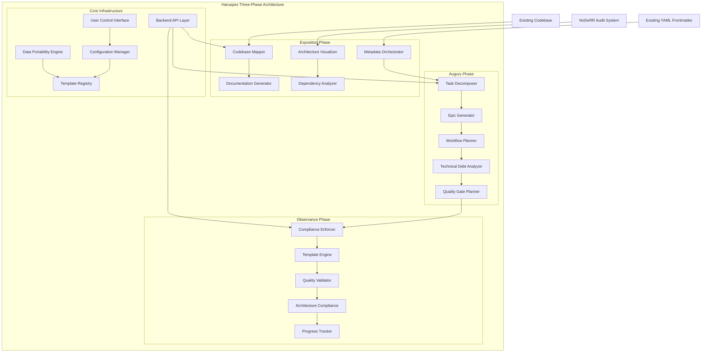

# Haruspex 1.0 — Enhanced Architecture and Integration Strategy

## Executive Summary

This document consolidates the exploratory analysis into a cohesive plan for evolving Haruspex as a **scripted documentation automator and project manager** that creates a comprehensive "map" or "view" of codebases. Building upon existing YAML frontmatter infrastructure and NoDeRR architecture systems, Haruspex will automate DSS-informed documentation patterns while maintaining its core ethos as a documentation and analysis tool rather than a development automator.

## Objective and Scope

- **Objective**: Enhance Haruspex to automate documentation and project management workflows using proven DSS concepts while preserving existing metadata infrastructure and maintaining focus on codebase mapping and analysis.
- **Scope**: Three-phase architecture (Exposition/Augury/Observance), integration with existing systems, user-controlled templates and workflows, transparent automation processes, and comprehensive data portability. This is a design/strategy document defining implementable architecture.
- **Core Principle**: Haruspex remains primarily a documentation automator that creates navigable codebase "maps" rather than becoming a development automation system.

## Assessment of Existing Infrastructure

### Current YAML Frontmatter System

Haruspex already operates within an ecosystem with mature metadata infrastructure:

**Existing NoDeRR Audit System** (`scripts/noderr-audit/index.cjs`):

- Handles `tags`, `provides`, `requires` fields across multiple formats
- Supports JSON stub format, comment-based stubs, and frontmatter extraction
- Provides automated stub injection and validation capabilities
- Maintains field richness with title, description, and relationship mapping

**Integration Approach**: Rather than replacing existing systems, Haruspex will enhance and orchestrate the current metadata infrastructure, adding intelligence and automation while preserving established patterns.

## Rationale for Enhanced DSS Alignment

Building upon existing infrastructure, DSS offers proven patterns for automated documentation excellence:

- **Enhanced Metadata Orchestration**: Leverage existing `tags`, `provides`, `requires` infrastructure with intelligent content generation and relationship mapping
- **Three-Phase Documentation Pipeline**: Exposition → Augury → Observance (replacing generic discovery/classification/planning phases with thematically appropriate documentation-focused phases)
- **User-Controlled Templates**: Template-first creation with comprehensive user control, modification, and portability
- **Transparent Task Orchestration**: Clear visibility into all automated processes with hierarchical task decomposition
- **Automated Maintenance**: Build upon existing validation with enhanced cross-reference management and metadata integrity

These patterns align with Haruspex's enhanced goal: **automated documentation excellence** that creates navigable, intelligent codebase maps.

## Enhanced Documentation Architecture Principles

### 1) Orchestrated Metadata Intelligence

- **Foundation**: Build upon existing `tags`, `provides`, `requires` infrastructure
- **Enhancement**: Add intelligent content generation, relationship analysis, and automated consistency checking
- **Value**: Creates comprehensive knowledge graphs while preserving existing workflows

### 2) Three-Phase Documentation Pipeline

- **Exposition Phase**: Documentation generation, architecture mapping, codebase visualization
- **Augury Phase**: Task planning, epic generation, technical debt analysis, workflow planning
- **Observance Phase**: Implementation workspace with architectural compliance (positioned as extension capability)
- **Value**: Thematically aligned with Haruspex's divination/analysis ethos while maintaining clear separation of concerns

### 3) User-Controlled Template System

- **Core Requirements**: Viewing, modification, export/import, switching, versioning capabilities
- **Flexibility**: Templates adapt to project context with comprehensive user control
- **Portability**: No vendor lock-in, templates work across environments and tools
- **Value**: Empowers users while ensuring consistency and quality

### 4) Transparent Process Orchestration

- **Visibility Requirements**: File impact preview, process documentation, template application tracking, change auditing
- **User Experience**: No surprises, clear reasoning chains for all automated decisions
- **Value**: Builds trust and enables informed decision-making

### 5) Backend-Agnostic API Design

- **Agent Controllable**: Complete functionality via programmatic interfaces
- **UI Independent**: Full feature set without sidepanel dependencies
- **Service Oriented**: Decoupled backend services with clean abstraction layers
- **Value**: Enables diverse interaction patterns and tool integration

## Three-Phase Documentation Architecture

Haruspex operates as a **documentation automator and project manager** through three thematically aligned phases that respect its core ethos while providing comprehensive codebase mapping capabilities.



### Architectural Rationale

- **Phase Alignment**: Exposition (documentation mapping) → Augury (planning and analysis) → Observance (compliance and quality enforcement) maintains clear separation between documentation, planning, and implementation concerns
- **Existing Infrastructure Integration**: Builds upon NoDeRR audit systems and existing YAML frontmatter infrastructure rather than replacing them
- **Documentation-First Ethos**: Maintains Haruspex's core identity as a documentation automator while providing planning and quality capabilities
- **User Control**: Comprehensive template and configuration management with full user visibility and control
- **Backend Abstraction**: Clean API layer enables agent control, command-line operation, and UI independence

## Integration Components

### 1) Enhanced Metadata Orchestration

**Purpose**: Build upon existing YAML frontmatter infrastructure with intelligent automation and relationship mapping.

**Foundation Integration**:

- **Existing Infrastructure**: Leverages NoDeRR audit system's `tags`, `provides`, `requires` handling across JSON stub, comment-based, and frontmatter formats
- **Enhanced Fields**: `analysis_timestamp`, `complexity_score`, `architectural_role`, `quality_metrics`, `relationships`, `auto_generated`, `noderr_status`, `architecture_compliance`
- **Preservation Strategy**: Maintains compatibility with existing stub systems while adding intelligence layers

**Capabilities**:

- Automated metadata consistency and enrichment across all file formats
- Intelligent relationship mapping and dependency analysis
- Quality metric integration with existing architecture validation

**Rationale**: Creates comprehensive knowledge graphs while preserving established workflows and existing metadata investments.

### 2) User-Controlled Template System

**Purpose**: Provide comprehensive template management with full user control and zero vendor lock-in.

**Core Requirements**:

- **Viewing**: Clear, intuitive display of all templates and configurations with detailed information
- **Modification**: In-place editing capabilities with real-time validation and preview
- **Export/Import**: Portable configuration sets for project-specific customization and sharing
- **Switching**: Easy template/standard switching for experimentation and optimization without data loss
- **Versioning**: Template version management, rollback capabilities, and change tracking

**Implementation Features**:

- Template adaptation to project context with intelligent defaults
- Per-project customization support with inheritance patterns
- Cross-environment compatibility ensuring templates work in any development environment
- No proprietary formats - all templates use standard, portable formats (JSON, YAML, TOML)

**Rationale**: Empowers users with full control while ensuring consistency and enabling seamless migration between tools and environments.

### 3) Transparent Process Automation

**Purpose**: Provide complete visibility into all automated processes with clear reasoning and user control.

**Transparency Features**:

- **File Impact Preview**: "This metadata will be added to the top of these specific files" with before/after views
- **Process Documentation**: "This is how the plan development algorithm works" with step-by-step reasoning
- **Template Application**: "This template was/will be applied to this specification document" with change tracking
- **Change Tracking**: Real-time view of what changes are being made, why, and their impact
- **Decision Auditing**: Clear reasoning chain for all automated decisions with confidence scores

**User Experience Goals**:

- Developers are never surprised by automated changes
- All system reasoning is accessible and understandable
- Users can intervene, override, or customize any automated process
- Complete audit trail for all operations and decisions

**Rationale**: Builds user trust and enables informed decision-making by eliminating black-box automation.

### 4) Backend-Agnostic API Architecture

**Purpose**: Implement sufficient abstraction between user interface and backend systems for maximum flexibility.

**API Design Requirements**:

- **Agent Controllable**: Complete functionality accessible via programmatic interface without human interaction
- **UI Independent**: Full feature set available without sidepanel, GUI, or specific editor dependencies
- **Command Compatible**: All operations executable through command-line interface with scriptable automation
- **Service Oriented**: Backend services completely decoupled from presentation layer with clean contracts

**Implementation Strategy**:

- RESTful API layer supporting all core operations
- Command-line interface providing full feature parity with GUI
- Plugin architecture supporting diverse interaction patterns
- Data format abstraction supporting multiple input/output formats

**Rationale**: Enables diverse usage patterns including automated agents, scripts, different editors, and custom integrations while maintaining feature completeness.

### 5) Data Portability and Vendor Independence

**Purpose**: Eliminate all forms of vendor or format lock-in to ensure maximum user freedom and data sovereignty.

**Zero Lock-in Requirements**:

- **File Format Agnostic**: Support multiple data formats (JSON, YAML, TOML, XML) with seamless conversion
- **Extension Independence**: All data and configuration portable without specific extension or tool dependencies
- **Environment Agnostic**: Full functionality transfer to any development environment or operating system
- **Tool Independence**: No proprietary data formats, storage mechanisms, or vendor-specific features
- **Migration Support**: Clear migration paths between tools, environments, and format versions

**Validation Criteria**:

- User must be able to uninstall Haruspex extension and continue work in any other environment without data or functionality loss
- All generated artifacts must be readable and modifiable with standard tools
- Configuration and templates must work across different operating systems and development environments
- No cloud dependencies or external service requirements for core functionality

**Rationale**: Ensures user freedom, data sovereignty, and long-term viability while preventing vendor lock-in scenarios.

## Three-Phase Implementation Strategy

### Exposition Phase — Foundation Documentation and Codebase Mapping

**Etymology**: From Latin *expositio* ("a setting forth") — Initial documentation and codebase mapping

**Core Functions**:

- **Architecture Presentation**: Enhanced integration with existing NoDeRR audit systems for comprehensive codebase visualization
- **Dependency Visualization**: Automated dependency mapping building upon existing `tags`, `provides`, `requires` infrastructure
- **Metrics Display**: Quality metrics integration with architecture compliance tracking
- **Documentation Generation**: Foundational codebase documentation with intelligent template selection

**Implementation Components**:

- Enhanced metadata orchestration system leveraging existing YAML frontmatter infrastructure
- User-controlled template system with viewing, modification, export/import capabilities
- Transparent process automation with file impact preview and change tracking
- Backend API layer for agent controllability and UI independence

**Success Criteria**:

- **Metadata Completeness**: ≥95% metadata coverage across targeted repositories with existing system compatibility
- **Template System**: All template operations (view/modify/export/import/switch/version) functional with zero lock-in validation
- **Process Transparency**: 100% automated process visibility with clear reasoning chains and user override capabilities
- **API Completeness**: Full feature set accessible via command-line and programmatic interfaces

### Augury Phase — Planning and Task Generation Based on Codebase Analysis

**Etymology**: The practice of divination and interpreting omens — Planning and task generation based on codebase analysis

**Core Functions**:

- **Epic Creation**: Large-scale documentation initiative planning with hierarchical task decomposition
- **Task Decomposition**: Breaking complex documentation projects into manageable, trackable units
- **Technical Debt Identification**: Analysis-driven identification of documentation and architectural debt
- **Developer-Driven Planning**: Evidence-based planning with decision-making support based on code "omens"

**Implementation Components**:

- Advanced task orchestration with transparent planning algorithms
- Technical debt analysis building upon NoDeRR architecture validation
- Quality gate planning with measurable criteria and validation requirements
- Cross-project dependency analysis and impact assessment

**Success Criteria**:

- **Task Generation**: Automated task decomposition with ≥90% developer acceptance rate for generated plans
- **Debt Analysis**: Technical debt identification with actionable recommendations and effort estimation
- **Planning Transparency**: Complete visibility into planning algorithms with user customization capabilities
- **Cross-Project Coordination**: Successful dependency analysis and impact assessment across repository ecosystems

### Observance Phase — Implementation Workspace with Architectural Compliance

**Etymology**: Dutiful following of revealed principles and requirements — Implementation workspace with architectural compliance

**Core Functions**:

- **Task Execution**: Coordinated implementation workspace with quality assurance integration
- **Quality Assurance**: Comprehensive quality validation and architectural compliance enforcement
- **Principle Adherence**: Automated compliance checking against established architectural principles
- **Extension Capabilities**: Development-focused features positioned as adoptable extensions while maintaining core documentation ethos

**Implementation Components**:

- Compliance enforcement system with NoDeRR architecture integration
- Quality validation with automated testing and verification
- Progress tracking with comprehensive metrics and reporting
- Extension architecture for development automation capabilities (optional adoption)

**Success Criteria**:

- **Compliance Automation**: ≥95% architectural compliance validation with NoDeRR integration
- **Quality Gate Success**: All quality gates pass with comprehensive validation and reporting
- **Progress Tracking**: Real-time progress visibility with accurate completion estimates
- **Extension Adoption**: Clear separation between core documentation features and optional development extensions

## Expected Outcomes by Phase

### Exposition Phase Outcomes (1–3 months)

- **Documentation Automation**: 60% reduction in manual documentation effort through intelligent template systems
- **Metadata Excellence**: ≥95% metadata completeness with seamless existing system integration
- **User Empowerment**: Complete template control with viewing, editing, versioning, and portability capabilities
- **Process Transparency**: 100% visibility into automated processes with user override capabilities
- **Infrastructure Integration**: Full compatibility with existing NoDeRR audit and YAML frontmatter systems

### Augury Phase Outcomes (3–6 months)

- **Planning Intelligence**: Automated task decomposition with ≥90% developer acceptance rates
- **Technical Debt Analysis**: Comprehensive debt identification with actionable recommendations and effort estimation
- **Cross-Project Coordination**: Successful dependency analysis and impact assessment across repository ecosystems
- **Workflow Orchestration**: Transparent planning algorithms with user customization and override capabilities
- **Quality Gate Integration**: Measurable quality criteria with automated validation and reporting

### Observance Phase Outcomes (6+ months)

- **Compliance Automation**: ≥95% architectural compliance validation with NoDeRR architecture integration
- **Quality Assurance**: Comprehensive quality validation with automated testing and verification systems
- **Extension Architecture**: Clear separation between core documentation features and optional development capabilities
- **Enterprise Scalability**: Scalable, automated documentation excellence across diverse, large-scale codebases
- **Ecosystem Integration**: Full "LLM-native" repositories with robust, navigable knowledge structures

## Implementation Roadmap

### Exposition Phase Priority Actions

1. **Enhanced Metadata Integration**: Prototype enhanced metadata orchestration building upon existing NoDeRR audit system infrastructure
2. **User-Controlled Template System**: Implement template viewing, modification, export/import, switching, and versioning capabilities
3. **Process Transparency Implementation**: Develop file impact preview, process documentation, and decision auditing systems
4. **Backend API Architecture**: Design and implement agent-controllable, UI-independent backend services
5. **Data Portability Validation**: Ensure zero vendor lock-in with cross-environment template and configuration portability

### Augury Phase Priority Actions

1. **Task Orchestration Engine**: Implement transparent hierarchical task decomposition with developer-driven planning
2. **Technical Debt Analysis**: Integrate with NoDeRR architecture validation for comprehensive debt identification
3. **Quality Gate Planning**: Develop measurable quality criteria with automated validation systems
4. **Cross-Project Coordination**: Build dependency analysis and impact assessment for repository ecosystems
5. **Planning Algorithm Transparency**: Provide complete visibility into planning processes with user customization

### Observance Phase Priority Actions

1. **Compliance Enforcement**: Integrate with NoDeRR for ≥95% architectural compliance automation
2. **Quality Validation Systems**: Implement comprehensive quality assurance with automated testing
3. **Extension Architecture**: Design clear separation between core documentation and optional development features
4. **Progress Tracking**: Develop real-time progress visibility with accurate completion estimates
5. **Enterprise Scalability**: Validate system performance across large-scale, diverse codebases

## Validation Criteria and Success Metrics

### Core Architecture Validation

**Documentation Ethos Preservation**:

- ✓ Haruspex maintains primary identity as documentation automator and project manager
- ✓ Development automation features clearly positioned as optional extensions
- ✓ Core value proposition focused on codebase "mapping" and analysis rather than code generation

**Existing Infrastructure Integration**:

- ✓ Full compatibility with existing NoDeRR audit system infrastructure
- ✓ Seamless integration with established YAML frontmatter systems (`tags`, `provides`, `requires`)
- ✓ No disruption to current Phoenix Code Lite or other repository workflows

### User Control and Transparency Validation

**Template System Requirements**:

- ✓ All template operations (view/modify/export/import/switch/version) functional
- ✓ Zero vendor lock-in validated through cross-environment portability testing
- ✓ User modification capabilities with real-time validation and preview

**Process Transparency Requirements**:

- ✓ 100% automated process visibility with clear reasoning chains
- ✓ File impact preview for all metadata and documentation changes
- ✓ User override capabilities for all automated decisions
- ✓ Complete audit trail with decision rationale and confidence scoring

**Backend Abstraction Requirements**:

- ✓ Complete functionality via programmatic interfaces (agent controllable)
- ✓ Full feature parity between command-line and GUI interfaces
- ✓ No sidepanel or editor dependencies for core functionality
- ✓ Clean service abstraction with plugin architecture support

### Data Portability and Independence Validation

**Zero Lock-in Criteria**:

- ✓ User can uninstall Haruspex and continue work without functionality loss
- ✓ All generated artifacts readable with standard tools
- ✓ Configuration and templates work across operating systems and development environments
- ✓ No cloud dependencies or external service requirements for core functionality

**Migration and Compatibility Testing**:

- ✓ Successful migration between different development environments
- ✓ Template and configuration portability across tools and platforms
- ✓ Data format conversion capabilities (JSON ↔ YAML ↔ TOML)
- ✓ Backward compatibility with existing metadata and documentation systems

## Critical Success Factors

### Phase-Specific Success Criteria

**Exposition Phase Critical Success Factors**:

- Metadata completeness ≥95% with existing system compatibility
- Template system user control requirements fully implemented
- Process transparency with 100% automated decision visibility
- Backend API completeness for agent and command-line control

**Augury Phase Critical Success Factors**:

- Task decomposition with ≥90% developer acceptance rates
- Technical debt analysis with actionable recommendations
- Planning algorithm transparency with user customization capabilities
- Cross-project coordination with successful dependency analysis

**Observance Phase Critical Success Factors**:

- Architectural compliance ≥95% with NoDeRR integration
- Quality validation with comprehensive testing and verification
- Clear separation between documentation core and development extensions
- Enterprise scalability validation across diverse, large-scale codebases

## Enhanced Architecture Assumptions and Risk Management

### Core Assumptions

**Infrastructure Assumptions**:

- Existing NoDeRR audit system remains available and compatible for architecture validation integration
- Current YAML frontmatter infrastructure (`tags`, `provides`, `requires`) continues to function and can be enhanced
- Repository access supports read/write operations for metadata orchestration and documentation generation
- Phoenix Code Lite and other repository projects maintain current integration patterns

**User Experience Assumptions**:

- Users require comprehensive control over templates, configurations, and automated processes
- Transparency in automated decision-making is essential for user trust and adoption
- Data portability and vendor independence are critical requirements for enterprise adoption
- Backend abstraction enabling agent control and UI independence is necessary for diverse usage patterns

**Technology Assumptions**:

- Multi-format support (JSON, YAML, TOML) is feasible with reasonable conversion complexity
- Command-line interface can provide full feature parity with GUI components
- Plugin architecture can support diverse interaction patterns without core system complexity

### Risk Assessment and Mitigation Strategies

**User Adoption Risks**:

- **Risk**: Users reject automated processes due to lack of transparency or control
- **Mitigation**: Implement comprehensive process visibility, user override capabilities, and transparent decision auditing from Exposition Phase onwards

**Integration Complexity Risks**:

- **Risk**: Enhanced metadata orchestration disrupts existing NoDeRR or Phoenix Code Lite workflows
- **Mitigation**: Maintain strict compatibility requirements, implement incremental integration with validation gates, provide rollback capabilities

**Data Lock-in Risks**:

- **Risk**: Users become dependent on proprietary formats or vendor-specific features despite design intentions
- **Mitigation**: Implement zero lock-in validation criteria with regular portability testing and cross-environment validation

**Architecture Drift Risks**:

- **Risk**: Development automation features overtake documentation focus, violating core ethos
- **Mitigation**: Clear architectural boundaries between phases, extension positioning for development features, regular ethos validation

**Technical Debt and Maintenance Risks**:

- **Risk**: Complex multi-format support and abstraction layers create maintenance overhead
- **Mitigation**: Progressive implementation with validation at each phase, comprehensive testing strategies, clear architectural boundaries

## Appendix A — Enhanced Haruspex Configuration System

### User-Controlled Configuration Format

```yaml
# haruspex_config.yml - Portable, vendor-independent configuration
metadata_orchestration:
  existing_systems:
    noderr_audit: true                    # Integration with existing NoDeRR audit system
    yaml_frontmatter: true               # Leverage existing tags/provides/requires infrastructure
    phoenix_code_lite: true              # Compatibility with PCL workflows
  
  enhanced_fields:
    analysis_timestamp: true
    complexity_score: true
    architectural_role: true
    quality_metrics: true
    noderr_status: true
    architecture_compliance: true

template_system:
  user_control:
    viewing: enabled                      # Clear template and configuration display
    modification: enabled                 # In-place editing with validation
    export_import: enabled                # Portable configuration sets
    switching: enabled                    # Easy template switching without data loss
    versioning: enabled                   # Version management and rollback
  
  formats:
    primary: yaml                         # User preference
    supported: [json, yaml, toml, xml]    # Zero lock-in format support
    conversion: automatic                 # Seamless format conversion
  
  templates:
    exposition_phase: [architecture_doc, dependency_map, metrics_dashboard]
    augury_phase: [task_plan, epic_structure, debt_analysis]
    observance_phase: [compliance_report, quality_validation, progress_tracker]

transparency:
  process_visibility: 100                 # Complete automated process transparency
  file_impact_preview: enabled           # "This metadata will be added to these files"
  decision_auditing: enabled              # Clear reasoning chains for all decisions
  user_override: enabled                  # User can intervene in any automated process
  change_tracking: real_time              # Live view of changes and their rationale

backend_api:
  agent_controllable: true                # Complete functionality via programmatic interface
  ui_independent: true                    # Full feature set without GUI dependencies
  command_line_parity: true               # CLI interface with full feature equivalence
  service_oriented: true                  # Decoupled backend services

data_portability:
  vendor_independence: enforced           # Zero proprietary formats or dependencies
  cross_environment: validated            # Works across OS and development environments
  migration_support: comprehensive        # Clear paths between tools and versions
  standard_tools_compatible: true         # Generated artifacts readable with standard tools

validation:
  metadata_completeness: 0.95            # Target 95% metadata coverage
  template_portability: validated         # Regular cross-environment testing
  process_transparency: 1.0              # 100% automated decision visibility
  architecture_compliance: 0.95          # 95% compliance with NoDeRR integration
```

### Multi-Format Support Example

```json
// haruspex_config.json - Same configuration in JSON format
{
  "metadata_orchestration": {
    "existing_systems": {
      "noderr_audit": true,
      "yaml_frontmatter": true,
      "phoenix_code_lite": true
    }
  },
  "template_system": {
    "user_control": {
      "viewing": "enabled",
      "modification": "enabled",
      "export_import": "enabled"
    }
  }
}
```

## Appendix B — Enhanced Architecture Rationale

### Core Architectural Decisions

- **Documentation-First Ethos**: Haruspex maintains its identity as a documentation automator and project manager, creating comprehensive codebase "maps" rather than becoming a development automation system
- **Existing Infrastructure Integration**: Building upon NoDeRR audit systems and existing YAML frontmatter infrastructure maximizes value while preserving established workflows and investments
- **Three-Phase Thematic Structure**: Exposition/Augury/Observance phases align with Haruspex's divination ethos while providing clear functional separation and progressive capability development
- **User Control Priority**: Comprehensive user control over templates, configurations, and automated processes ensures adoption and prevents vendor lock-in scenarios

### Technical Architecture Benefits

- **Transparent Automation**: Complete process visibility with user override capabilities builds trust and enables informed decision-making
- **Backend Abstraction**: Agent-controllable, UI-independent architecture enables diverse usage patterns and integration scenarios
- **Data Portability**: Zero vendor lock-in through multi-format support and standard tool compatibility ensures long-term viability
- **Progressive Intelligence**: Tiered processing (rules → content → LLM) balances cost, speed, and accuracy while maintaining quality standards

### Strategic Value Proposition

- **Documentation Excellence**: Automated, consistent, high-quality documentation with minimal manual effort
- **Architecture Compliance**: Integrated quality gates and NoDeRR architecture validation ensure system health and maintainability
- **Enterprise Scalability**: Proven patterns adapted for enterprise-scale documentation automation across diverse codebases
- **Future-Proof Design**: Extensible architecture supports optional development automation while preserving core documentation focus

## Referenced By

- [Haruspex/docs/Haruspex.md](mdc:Haruspex/docs/Haruspex.md) — Target document to apply this strategy and architecture
- [noderr/noderr_architecture.md](mdc:noderr/noderr_architecture.md) — Architecture checks referenced for quality gates
- [.cursor/rules/workflows/00-workflow-selection.mdc](mdc:.cursor/rules/workflows/00-workflow-selection.mdc) — DSS workflow decision tree referenced in planning
