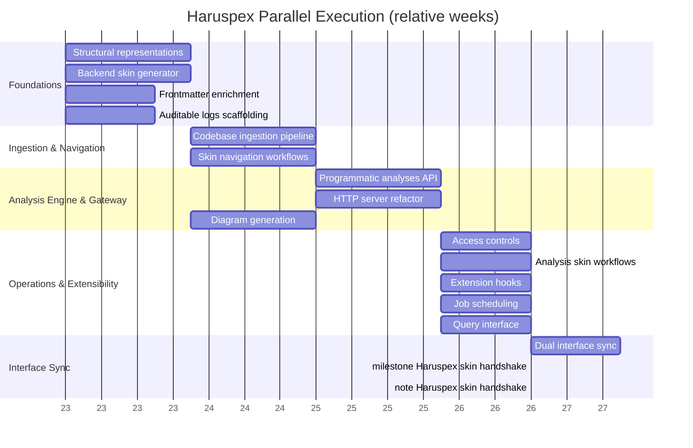

# Haruspex Progress Tracker

Legend: `[x]` done · `[~]` in progress · `[ ]` not started · `[!]` broken · `[?]` verify · `[P]` pending investigation

## Repository Intelligence Core

- [?] [Codebase ingestion pipeline](../../dev/tasks/codebase-ingestion-pipeline.md) (static analysis modules partially migrated from extension; verify pure backend operation)
- [ ] [Structural representations](../../dev/tasks/structural-representations.md) (module graphs, dependency matrices generated without VSCode dependencies)
- [ ] [Frontmatter enrichment workflow](../../dev/tasks/frontmatter-enrichment.md) (deterministic, auditable workflow operational)

## Analysis & Visualization

- [ ] [Programmatic analyses](../../dev/tasks/programmatic-analyses.md) (architecture drift, coupling metrics, risk flags exposed via API)
- [ ] [Diagram generation](../../dev/tasks/diagram-generation.md) (Mermaid/graph data driven by backend results)
- [ ] [Query interface](../../dev/tasks/query-interface.md) (filters vs. free-form chat available)

## Service & API Layer

- [~] [HTTP server boots](../../dev/tasks/http-server-refactor.md) (handlers still tied to legacy components; replace with backend-native logic)
- [ ] [Job scheduling, progress tracking, and cancellation](../../dev/tasks/job-scheduling.md)
- [~] [Skin definition emission for dashboards and code navigation](../../dev/tasks/backend-skin-generator.md) (`provideSkinDefinition()` emits a Templum-conforming skin payload; endpoint/runtime verification still pending)

## Skin-Defined Presentation

- [ ] [Navigation workflows encoded in skin payloads](../../dev/tasks/skin-navigation-workflows.md)
- [ ] [Analysis launch, approval, and export flows mediated by Templum](../../dev/tasks/analysis-skin-workflows.md)
- [ ] [Dual interface sync validated](../../dev/tasks/dual-interface-sync.md)

## Operations & Compliance

- [ ] [Auditable logs for analyses and approvals](../../dev/tasks/auditable-logs.md)
- [ ] [Access controls for write operations](../../dev/tasks/access-controls.md)
- [ ] [Extension hooks for additional static analysis engines](../../dev/tasks/extension-hooks.md)

## Action Items

- Decouple remaining VSCode dependencies (extension.ts, WebView providers).
- Replace placeholder analysis responses with real pipeline output.
- Keep skin output conforming to Templum's public JSON schema; Haruspex does not own a separate canonical skin definition.
- Action playbook: `meta/workflows/milestone-01-templum-haruspex-skin-handshake.md` (Templum ↔ Haruspex skin handshake).

## Step 0 — Playbook Setup

- Create milestone playbooks before executing task streams:
  - Shared playbook: `meta/workflows/milestone-01-templum-haruspex-skin-handshake.md` (existing).
  - Upcoming playbooks: Haruspex analysis pipeline hardening, API/query interface rollout, dual-interface sync validation.
- Use `meta/templates/milestone-playbook.md` and reference `meta/ARCHITECTURE.md` plus generated dependency map `Haruspex/dev/tasks/haruspex_task_dependencies.json`.
- Update the Gantt chart with milestone markers for each playbook as they are created and link them in Action Items.
- Provide agents with `dev/agent-briefing-template.md` during kickoff.
- Ensure smoke scripts mentioned in playbooks (e.g., discovery or service runs) exist; add stubs if necessary before execution.

## Parallel Execution Plan

### Dependency Highlights

- Structural representations underpin the ingestion pipeline, programmatic analyses, and every downstream visualization task—finish the VSCode-free graph work before branching computation streams.
- Backend skin generator is the core feed for navigation workflows, dual-interface sync, and Templum integration; treat it as a shared dependency for interface-facing work.
- Programmatic analyses depend on both ingestion and structural layers; APIs, query interface, and analysis workflows must wait for real data.
- HTTP server refactor and access controls go hand-in-hand—only apply security/policy enforcement once handlers run on backend-native data.
- Dual interface sync sits on top of the skin navigation workflows and analysis workflows, so schedule it after those deliverables are verified.

### Phase Matrix

| Phase | Dependencies cleared | Parallel work packages | Unlocks |
| --- | --- | --- | --- |
| 1 · Foundations | None | Structural representations · Backend skin generator · Frontmatter enrichment · Auditable logs scaffolding | Establishes core data structures and skin feed |
| 2 · Ingestion & Navigation | Structural representations, skin generator | Codebase ingestion pipeline · Skin navigation workflows | Provides backend-native ingestion artefacts and declarative navigation |
| 3 · Analysis Engine & Gateway | Phase 2 complete | Programmatic analyses API · HTTP server refactor · Diagram generation | Exposes deterministic analytics via backend-native handlers |
| 4 · Operations & Extensibility | Phase 3 outputs | Access controls · Analysis skin workflows · Extension hooks · Job scheduling · Query interface | Delivers secured APIs, workflow orchestration, and external engine support |
| 5 · Interface Sync | Phase 4 workflows | Dual interface sync | Confirms CLI/VSCode parity driven from shared skins |

### Workstream Lanes

- **Data Pipeline:** Structural representations → ingestion pipeline → programmatic analyses.
- **Skin & Navigation:** Backend skin generator → skin navigation workflows → analysis skin workflows → dual-interface sync.
- **Service Platform:** HTTP server refactor → access controls → job scheduling → query interface.
- **Operations & Compliance:** Frontmatter enrichment, auditable logs, extension hooks (integrate third-party engines once analytics stabilise).

### Risk and Coordination Notes

- Ingestion work should continuously publish fixture outputs so analysis/API streams can validate against the same data without rework.
- Delay enforcing access controls until the HTTP refactor is complete; mixing legacy handlers with new security middleware risks regressions.
- Capture generated skins and discovery logs in `reports/integration/haruspex/` as described in the milestone playbook to keep Templum alignment visible.
- Extension hooks rely on the finalized analysis API—treat them as late-phase work despite low direct dependencies.

### Gantt Snapshot (relative weeks, adjust durations per sprint)

### Scheduling Worksheet Template

Use the standard worksheet in `meta/templates/milestone-playbook.md` when drafting Haruspex-focused milestones; log per-task evidence in `reports/integration/haruspex/` and mirror status updates back into this tracker after each milestone review.
