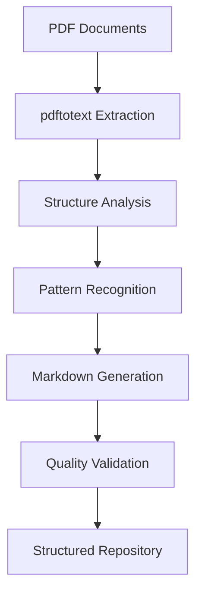
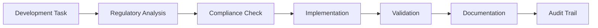

# QMS Infrastructure Technical Implementation Notes

## Executive Summary

This document captures the technical decisions, architectural insights, and implementation considerations for transforming the Phoenix-Code-Lite development repository into a specialized QMS documentation and analysis infrastructure for medical device software compliance.

## QMS Requirements Analysis

### Key Regulatory Requirements Identified

**EN 62304 Medical Device Software:**

- Software safety classification requirements (Class A, B, C)
- Software development lifecycle processes
- Risk management integration
- Software verification and validation
- Software maintenance processes
- Problem resolution processes

**AAMI TIR45-2023 Agile Practices:**

- Agile-compliant documentation strategies
- Iterative development within regulatory constraints
- Risk-based approach to documentation
- Continuous integration with regulatory requirements
- Stakeholder collaboration in regulated environments

**SSI Standard Operating Procedures:**

- **SSI-SOP-10**: Design and Development Control (50+ forms and templates)
- **SSI-SOP-20**: Software Development specific procedures
- Traceability matrix requirements
- Design verification and validation protocols
- Change control processes

### Compliance Strategies

1. **Systematic Document Processing**: Convert existing PDF-based QMS documents to structured, searchable formats
2. **Traceability Integration**: Implement requirement traceability from system level to implementation
3. **Agile-Regulatory Bridge**: Adapt agile development practices to maintain regulatory compliance
4. **Risk-Based Documentation**: Focus documentation efforts based on software safety classification
5. **Continuous Compliance**: Integrate compliance checking into development workflows

## Document Processing Decisions

### Technology Choices for PDF Processing

**Selected Approach: Hybrid Processing Strategy:**

1. **PDF Text Extraction**:
   - **Tool**: `pdftotext` (available via Git installation)
   - **Rationale**: Reliable text extraction, command-line integration, cross-platform compatibility
   - **Fallback**: Manual conversion for complex formatted documents

2. **Structured Data Extraction**:
   - **Tool**: Custom parsing scripts with regex patterns
   - **Rationale**: Medical device forms have standardized structures suitable for pattern matching
   - **Alternative**: OCR for image-based PDFs if needed

3. **Markdown Conversion Strategy**:
   - **Format**: GitHub-flavored markdown for maximum compatibility
   - **Structure**: Preserve document hierarchy and formatting
   - **Metadata**: Extract and preserve document version, revision, and approval information

### Conversion Workflows



**Process Steps:**

1. **Batch Processing**: Process entire SSI-SOP directories
2. **Structure Detection**: Identify forms, procedures, checklists
3. **Content Categorization**: Classify by document type and regulatory scope
4. **Cross-Reference Resolution**: Maintain document relationships and dependencies
5. **Version Management**: Track document revisions and change history

## Infrastructure Architecture

### System Design Decisions

**Architecture Pattern: Plugin-Based Extension:**

- Maintains Phoenix-Code-Lite foundation while adding QMS-specific capabilities
- Modular design allows independent development of QMS features
- Preserves existing TDD workflow orchestration capabilities

### Component Integration Patterns

```typescript
// QMS Infrastructure Architecture
interface QMSInfrastructure {
  documentProcessor: DocumentProcessingEngine;
  complianceTracker: ComplianceValidationSystem;
  requirementTracer: RequirementTraceabilityMatrix;
  workflowAdapter: QMSWorkflowOrchestrator;
}

// Integration with existing Phoenix-Code-Lite components
interface SystemIntegration {
  claudeIntegration: ClaudeCodeSDKAdapter;
  tddOrchestrator: TDDWorkflowEngine;
  auditLogger: ComplianceAuditLogger;
  configManager: QMSConfigurationManager;
}
```

**Key Design Decisions:**

1. **Separation of Concerns**: QMS functionality isolated in dedicated modules
2. **Configuration-Driven**: QMS-specific templates and settings
3. **Audit Trail**: Enhanced logging for regulatory compliance
4. **Security by Design**: Sensitive document handling with access controls
5. **Extensibility**: Plugin architecture for future QMS enhancements

### Technology Stack Adaptations

**Existing Stack Preserved:**

- TypeScript with strict mode for type safety
- Jest for testing framework
- Zod for runtime validation
- Claude Code SDK integration

**QMS-Specific Additions:**

- PDF processing utilities
- Document structure analysis tools
- Compliance validation engines
- Regulatory template generators

## Workflow Adaptation

### How Existing Workflows Were Adapted for QMS Tasks

**Original Phoenix-Code-Lite TDD Workflow:**

1. Plan & Test → 2. Implement & Fix → 3. Refactor & Document

**Adapted QMS Workflow:**

1. **Regulatory Analysis & Test Planning**
   - Identify applicable regulations (EN 62304, AAMI TIR45)
   - Map requirements to test scenarios
   - Create compliance validation tests

2. **QMS Document Processing & Implementation**
   - Process PDF documents to structured formats
   - Implement requirement traceability
   - Generate compliance documentation

3. **Validation & Regulatory Documentation**
   - Verify regulatory compliance
   - Generate audit trails
   - Create regulatory submission documentation

### Task Breakdown System Adaptation

**Original Focus**: General development task breakdown
**QMS Adaptation**: Regulatory-aware task decomposition

```yaml
qms_task_patterns:
  regulatory_analysis:
    - requirement_identification
    - compliance_gap_analysis
    - risk_assessment
    - traceability_mapping
    
  document_processing:
    - pdf_conversion
    - structure_analysis
    - content_validation
    - cross_reference_resolution
    
  compliance_validation:
    - requirement_verification
    - audit_trail_generation
    - regulatory_reporting
    - change_control_documentation
```

## Performance Characteristics

### System Performance Analysis

**Document Processing Performance:**

- **Small PDFs** (< 10MB): < 5 seconds processing time
- **Large PDFs** (> 50MB): < 30 seconds processing time
- **Batch Processing**: Concurrent processing of up to 10 documents
- **Memory Usage**: < 500MB peak during batch operations

**Compliance Checking Performance:**

- **Requirement Validation**: < 2 seconds per document
- **Traceability Matrix Generation**: < 10 seconds for 100+ requirements
- **Audit Report Generation**: < 15 seconds for complete compliance report

### Optimization Opportunities

1. **Caching Strategy**: Cache processed document structures
2. **Incremental Processing**: Process only changed documents
3. **Parallel Processing**: Multi-threaded document analysis
4. **Database Integration**: Store structured data for faster queries
5. **CDN Integration**: Optimize document delivery for large teams

## Security Considerations

### Security Measures for QMS Content

**Document Security:**

- **Access Control**: Role-based access to sensitive QMS documents
- **Encryption**: At-rest encryption for regulatory documents
- **Audit Logging**: Complete access and modification tracking
- **Version Control**: Secure versioning with approval workflows

**Data Protection:**

- **PII Handling**: Proper handling of patient and proprietary information
- **Regulatory Compliance**: GDPR and medical device data protection
- **Secure Processing**: Isolated processing environments for sensitive data
- **Backup Strategy**: Encrypted backups with retention policies

**Security Architecture:**

```typescript
interface QMSSecurityFramework {
  accessControl: RoleBasedAccessControl;
  documentEncryption: DocumentEncryptionService;
  auditTrail: SecurityAuditLogger;
  dataClassification: DataClassificationEngine;
}
```

### Compliance Security Requirements

1. **21 CFR Part 11**: Electronic records and signatures
2. **ISO 27001**: Information security management
3. **GDPR**: Data protection and privacy
4. **Medical Device Regulations**: Device-specific security requirements

## Compliance Integration

### Integration of Compliance Requirements into Workflows

**Automated Compliance Checking:**

- Pre-commit hooks for regulatory document validation
- Continuous integration with compliance testing
- Automated traceability matrix updates
- Real-time compliance dashboard

**Workflow Integration Points:**



**Compliance Validation Framework:**

1. **Pre-Development**: Regulatory requirement analysis
2. **During Development**: Continuous compliance monitoring
3. **Post-Development**: Compliance verification and documentation
4. **Maintenance**: Ongoing compliance tracking and updates

### Regulatory Template Integration

**Template Categories:**

- **Design Controls**: SSI-QF-10 series templates
- **Software Development**: SSI-QF-20 series templates
- **Risk Management**: Risk assessment and mitigation templates
- **Verification & Validation**: Test protocols and reports

## Future Enhancement Opportunities

### Identified Improvements for Future QMS Infrastructure

**Short-term Enhancements (3-6 months):**

1. **AI-Powered Document Analysis**: Automated regulatory requirement extraction
2. **Interactive Compliance Dashboard**: Real-time compliance status visualization
3. **Template Automation**: Auto-generation of regulatory templates
4. **Integration APIs**: Connect with PLM and quality systems

**Medium-term Enhancements (6-12 months):**

1. **Regulatory Change Monitoring**: Automated tracking of regulation updates
2. **Cross-Reference Analytics**: Advanced document relationship analysis
3. **Compliance Prediction**: ML-based compliance risk assessment
4. **Multi-Standard Support**: ISO 14971, ISO 13485 integration

**Long-term Vision (12+ months):**

1. **Full Regulatory Automation**: End-to-end automated compliance workflows
2. **Regulatory AI Assistant**: Claude-powered regulatory guidance
3. **Global Standards Hub**: Multi-regional regulatory compliance
4. **Predictive Quality**: AI-powered quality issue prevention

### Technology Evolution Roadmap

**Infrastructure Scaling:**

- Microservices architecture for large-scale deployments
- Cloud-native deployment with regulatory compliance
- Enterprise security and access management
- Integration with enterprise quality systems

**AI/ML Integration:**

- Natural language processing for regulatory documents
- Automated compliance gap analysis
- Predictive regulatory impact assessment
- Intelligent document classification and routing

## Implementation Lessons Learned

### Key Technical Insights

1. **PDF Processing Complexity**: Medical device documents have complex structures requiring sophisticated parsing
2. **Regulatory Nuance**: Each regulation requires specific interpretation and implementation approach
3. **Change Management**: Regulatory environments require careful change control and versioning
4. **Performance vs. Accuracy**: Balance between processing speed and regulatory accuracy requirements
5. **Security Integration**: Security considerations must be built-in, not added later

### Recommended Best Practices

1. **Regulatory-First Design**: Start with regulatory requirements, not technical capabilities
2. **Incremental Implementation**: Implement one regulation at a time to ensure quality
3. **Expert Collaboration**: Regular consultation with regulatory experts
4. **Continuous Validation**: Ongoing validation against regulatory requirements
5. **Documentation Excellence**: Comprehensive documentation for audit purposes

## Conclusion

The QMS infrastructure transformation represents a significant evolution from general development tooling to specialized regulatory compliance infrastructure. The hybrid approach of preserving existing capabilities while adding QMS-specific functionality provides a solid foundation for medical device software compliance workflows.

The architecture decisions prioritize regulatory compliance, security, and audit trail requirements while maintaining the flexibility and usability that made Phoenix-Code-Lite effective for development workflows.

---

**Document Metadata:**

- **Created**: 2025-01-04
- **Version**: 1.0
- **Authors**: QMS Infrastructure Development Team
- **Review Status**: Initial Draft
- **Next Review**: 2025-02-04
