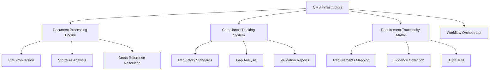
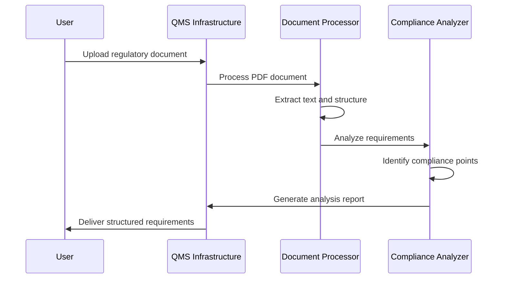

# QMS Infrastructure Usage Guide

## Table of Contents

1. [Introduction](#introduction)
2. [Getting Started](#getting-started)
3. [Core Workflows](#core-workflows)
4. [Document Processing](#document-processing)
5. [Compliance Management](#compliance-management)
6. [Quality Gates](#quality-gates)
7. [Reporting and Analytics](#reporting-and-analytics)
8. [Troubleshooting](#troubleshooting)
9. [Best Practices](#best-practices)
10. [Reference](#reference)

## Introduction

The QMS Infrastructure is a specialized system built on the Phoenix-Code-Lite foundation, designed to support medical device software compliance tasks, document analysis, and regulatory workflow management. This guide provides practical instructions for using the system effectively.

### Who Should Use This Guide

- **Quality Engineers**: Managing compliance documentation and validation
- **Software Developers**: Integrating regulatory requirements into development workflows
- **Regulatory Affairs**: Preparing regulatory submissions and audit materials
- **Project Managers**: Tracking compliance progress and managing regulatory deliverables
- **System Administrators**: Maintaining and configuring the QMS infrastructure

### System Overview



## Getting Started

### System Access and Setup

#### Prerequisites

Before using the QMS Infrastructure, ensure you have:

- [ ] Access to VDL2/QMS document repository
- [ ] Phoenix-Code-Lite environment set up
- [ ] Appropriate permissions for QMS document access
- [ ] Basic understanding of medical device regulations (EN 62304, AAMI TIR45)

#### Initial Configuration

1. **Verify System Access**:

   ```bash
   # Check VDL2 access
   ls VDL2/QMS/Docs/
   
   # Verify PDF processing capabilities
   pdftotext --version
   
   # Test Phoenix-Code-Lite installation
   npm run dev --version
   ```

2. **Configure User Profile**:

   ```typescript
   // Example user configuration
   const userProfile: QMSUserProfile = {
     role: 'quality_engineer' | 'developer' | 'regulatory_affairs',
     accessLevel: 'read' | 'write' | 'admin',
     defaultWorkspace: 'VDL2/QMS',
     notifications: {
       complianceAlerts: true,
       documentUpdates: true,
       auditReminders: true
     }
   };
   ```

3. **Set Up Workspace**:

   ```bash
   # Create your QMS workspace
   mkdir -p ~/qms-workspace/{analysis,reports,evidence}
   
   # Initialize configuration
   npm run dev init --workspace qms
   ```

### First-Time User Tutorial

#### Tutorial 1: Basic Document Analysis

**Objective**: Analyze a regulatory standard document

**Steps**:

1. **Select Document**:

   ```bash
   # Choose a standard to analyze
   cd VDL2/QMS/Docs/
   ls *.pdf
   ```

2. **Process Document**:

   ```bash
   # Process the EN 62304 standard
   npm run dev process-document "EN 62304-2006+A1-2015 Medical device software.pdf"
   ```

3. **Review Results**:
   - Structured markdown output
   - Extracted requirements
   - Cross-references identified
   - Compliance gap analysis

#### Tutorial 2: Compliance Validation

**Objective**: Validate project compliance against regulatory requirements

**Steps**:

1. **Load Project Context**:

   ```bash
   npm run dev load-project --path /path/to/your/project
   ```

2. **Run Compliance Check**:

   ```bash
   npm run dev validate-compliance --standard EN62304 --class B
   ```

3. **Review Compliance Report**:
   - Requirement coverage analysis
   - Identified gaps and risks
   - Recommended actions
   - Evidence requirements

## Core Workflows

### Workflow 1: Regulatory Standard Analysis

**Use Case**: Analyzing new or updated regulatory standards

**Process Overview**:



**Step-by-Step Instructions**:

1. **Document Preparation**:

   ```bash
   # Verify document integrity
   file "regulatory-standard.pdf"
   
   # Check document metadata
   pdfinfo "regulatory-standard.pdf"
   ```

2. **Processing Execution**:

   ```bash
   # Full analysis with structured output
   npm run dev analyze-standard \
     --input "regulatory-standard.pdf" \
     --output "analysis-results/" \
     --format structured \
     --include-cross-refs
   ```

3. **Results Review**:
   - **Requirements Matrix**: Extracted regulatory requirements
   - **Compliance Checklist**: Action items for compliance
   - **Cross-Reference Map**: Document relationships
   - **Gap Analysis**: Current compliance status

4. **Export and Integration**:

   ```bash
   # Export for integration with project tools
   npm run dev export-analysis \
     --format json,csv,markdown \
     --destination project-tools/
   ```

### Workflow 2: QMS Document Processing

**Use Case**: Converting and organizing QMS procedure documents

**Process Steps**:

1. **Batch Document Processing**:

   ```bash
   # Process entire SSI-SOP directory
   npm run dev process-batch \
     --source "VDL2/QMS/Docs/SSI-SOP-10*" \
     --output "structured-procedures/" \
     --preserve-metadata \
     --generate-index
   ```

2. **Structure Validation**:

   ```bash
   # Validate processed documents
   npm run dev validate-structure \
     --input "structured-procedures/" \
     --schema qms-procedure-schema.json
   ```

3. **Cross-Reference Resolution**:

   ```bash
   # Resolve all document cross-references
   npm run dev resolve-references \
     --documents "structured-procedures/" \
     --update-links \
     --flag-broken-refs
   ```

### Workflow 3: Compliance Tracking and Validation

**Use Case**: Ongoing compliance monitoring and validation

**Implementation Approach**:

1. **Compliance Dashboard Setup**:

   ```bash
   # Initialize compliance tracking
   npm run dev setup-compliance \
     --project-path "/path/to/project" \
     --standards "EN62304,AAMI-TIR45" \
     --safety-class "B"
   ```

2. **Continuous Monitoring**:

   ```typescript
   // Example compliance monitoring configuration
   const complianceConfig = {
     monitoringInterval: '24h',
     alerts: {
       newRequirements: true,
       complianceGaps: true,
       auditDeadlines: true
     },
     reporting: {
       frequency: 'weekly',
       recipients: ['qa-team@company.com'],
       format: 'summary'
     }
   };
   ```

3. **Validation Reporting**:

   ```bash
   # Generate compliance report
   npm run dev generate-report \
     --type compliance-summary \
     --period "last-30-days" \
     --format pdf,html
   ```

## Document Processing

### PDF Document Processing

#### Processing Single Documents

**Basic Processing**:

```bash
# Simple PDF to markdown conversion
npm run dev convert-pdf \
  --input "document.pdf" \
  --output "document.md" \
  --preserve-formatting
```

**Advanced Processing**:

```bash
# Full processing with structure analysis
npm run dev process-document \
  --input "complex-document.pdf" \
  --output-dir "processed/" \
  --extract-tables \
  --identify-forms \
  --resolve-references \
  --generate-metadata
```

#### Batch Processing Operations

**Processing Document Sets**:

```bash
# Process all PDFs in a directory
npm run dev batch-process \
  --source-dir "VDL2/QMS/Docs/" \
  --output-dir "processed-docs/" \
  --config batch-config.json \
  --parallel 4
```

**Batch Configuration Example**:

```json
{
  "processing": {
    "preserveFormatting": true,
    "extractTables": true,
    "identifyForms": true,
    "generateMetadata": true
  },
  "output": {
    "format": "markdown",
    "includeOriginal": true,
    "createIndex": true
  },
  "validation": {
    "validateStructure": true,
    "checkCompleteness": true,
    "flagErrors": true
  }
}
```

### Document Structure Analysis

#### Form Recognition

The system automatically identifies and processes different document types:

**Recognized Document Types**:

- **Procedures**: Step-by-step process documents
- **Forms**: Structured templates with fields
- **Checklists**: Verification and validation lists
- **Reports**: Data collection and analysis documents
- **Standards**: Regulatory requirement documents

**Structure Analysis Output**:

```yaml
document_analysis:
  type: "procedure"
  sections:
    - title: "Purpose and Scope"
      content_type: "descriptive"
      requirements: []
    - title: "Procedure Steps"
      content_type: "sequential"
      steps: 12
      decision_points: 3
    - title: "Quality Checkpoints"
      content_type: "validation"
      checkpoints: 8
```

### Cross-Reference Management

#### Reference Types

The system handles multiple types of cross-references:

1. **Internal References**: Within the same document
2. **External References**: To other QMS documents  
3. **Regulatory References**: To standards and regulations
4. **Form References**: To templates and forms

#### Reference Resolution Process

```bash
# Comprehensive reference resolution
npm run dev resolve-all-references \
  --document-set "processed-docs/" \
  --reference-database "qms-references.db" \
  --update-broken-links \
  --generate-reference-map
```

## Compliance Management

### Regulatory Standards Integration

#### Supported Standards

The QMS Infrastructure supports multiple regulatory standards:

**Primary Standards**:

- **EN 62304**: Medical device software lifecycle processes
- **AAMI TIR45**: Agile practices in medical device software development
- **ISO 14971**: Risk management for medical devices
- **ISO 13485**: Quality management systems for medical devices

**Integration Commands**:

```bash
# Load regulatory standard
npm run dev load-standard \
  --standard EN62304 \
  --version "2006+A1-2015" \
  --safety-class B

# Map requirements to project
npm run dev map-requirements \
  --standard EN62304 \
  --project-path "/path/to/project" \
  --generate-traceability
```

### Requirement Traceability

#### Traceability Matrix Generation

**Create Traceability Matrix**:

```bash
# Generate comprehensive traceability matrix
npm run dev generate-traceability \
  --standards "EN62304,AAMI-TIR45" \
  --project-path "/path/to/project" \
  --output "traceability-matrix.xlsx" \
  --include-evidence
```

**Traceability Validation**:

```bash
# Validate traceability completeness
npm run dev validate-traceability \
  --matrix "traceability-matrix.xlsx" \
  --check-completeness \
  --flag-gaps \
  --suggest-actions
```

#### Evidence Management

**Evidence Collection**:

```typescript
interface EvidencePackage {
  requirementId: string;
  evidenceType: 'design' | 'implementation' | 'test' | 'review';
  artifacts: string[];
  validationStatus: 'complete' | 'partial' | 'missing';
  approvalStatus: 'approved' | 'pending' | 'rejected';
}

// Example evidence collection
const collectEvidence = (requirementId: string) => {
  return {
    designEvidence: findDesignDocuments(requirementId),
    implementationEvidence: findSourceCode(requirementId),
    testEvidence: findTestCases(requirementId),
    reviewEvidence: findReviewRecords(requirementId)
  };
};
```

### Gap Analysis and Risk Assessment

#### Compliance Gap Analysis

**Automated Gap Detection**:

```bash
# Comprehensive gap analysis
npm run dev analyze-gaps \
  --standards "EN62304" \
  --project-path "/path/to/project" \
  --output "gap-analysis-report.html" \
  --include-recommendations
```

**Gap Analysis Report Structure**:

```yaml
gap_analysis:
  summary:
    total_requirements: 156
    implemented: 142
    partial: 8
    missing: 6
    
  critical_gaps:
    - requirement: "5.1.1 Software development planning"
      status: "missing"
      risk_level: "high"
      recommendation: "Create software development plan"
      
  risk_assessment:
    high_risk_gaps: 2
    medium_risk_gaps: 4
    low_risk_gaps: 8
```

## Quality Gates

### Validation Framework

#### Multi-Tier Quality Gates

The system implements a comprehensive validation framework:

**Tier 1: Document Quality**:

- Structure validation
- Content completeness
- Cross-reference integrity
- Metadata accuracy

**Tier 2: Compliance Quality**:  

- Requirement coverage
- Traceability completeness
- Evidence adequacy
- Standard conformance

**Tier 3: Process Quality**:

- Workflow compliance
- Review completeness
- Approval status
- Audit trail integrity

**Tier 4: System Quality**:w

- Performance metrics
- Security compliance
- Data integrity
- Backup verification

#### Quality Gate Execution

**Automated Quality Checks**:

```bash
# Run comprehensive quality gates
npm run dev quality-gates \
  --level comprehensive \
  --project-path "/path/to/project" \
  --standards "EN62304" \
  --generate-report
```

**Quality Gate Configuration**:

```json
{
  "qualityGates": {
    "documentQuality": {
      "structureValidation": true,
      "completenessCheck": true,
      "crossReferenceValidation": true,
      "metadataValidation": true
    },
    "complianceQuality": {
      "requirementCoverage": {
        "minimum": 95,
        "target": 100
      },
      "traceabilityCompleteness": {
        "minimum": 90,
        "target": 100
      }
    }
  }
}
```

### Continuous Validation

#### Automated Monitoring

**Setup Continuous Validation**:

```bash
# Enable continuous compliance monitoring
npm run dev setup-monitoring \
  --project-path "/path/to/project" \
  --check-interval "4h" \
  --alert-email "qa-team@company.com"
```

**Monitoring Dashboard**:

```typescript
interface ComplianceMonitoring {
  realTimeStatus: ComplianceStatus;
  trendAnalysis: ComplianceTrends;
  alertSystem: AlertConfiguration;
  reportGeneration: ReportSchedule;
}
```

## Reporting and Analytics

### Compliance Reporting

#### Standard Reports

**Available Report Types**:

1. **Compliance Summary Report**:

   ```bash
   npm run dev generate-report \
     --type compliance-summary \
     --period "quarterly" \
     --format pdf
   ```

2. **Traceability Matrix Report**:

   ```bash
   npm run dev generate-report \
     --type traceability-matrix \
     --standards "EN62304" \
     --format excel
   ```

3. **Gap Analysis Report**:

   ```bash
   npm run dev generate-report \
     --type gap-analysis \
     --include-recommendations \
     --format html
   ```

4. **Audit Preparation Package**:

   ```bash
   npm run dev generate-audit-package \
     --standards "EN62304,AAMI-TIR45" \
     --output "audit-package-2025/" \
     --include-evidence
   ```

#### Custom Analytics

**Performance Analytics**:

```bash
# Analyze compliance performance trends
npm run dev analyze-performance \
  --metric compliance-coverage \
  --period "last-12-months" \
  --generate-trends
```

**Risk Analytics**:

```bash
# Risk assessment and trending
npm run dev analyze-risk \
  --focus-area software-development \
  --include-predictions \
  --format dashboard
```

### Dashboard and Visualization

#### Compliance Dashboard

**Setup Dashboard**:

```bash
# Launch compliance dashboard
npm run dev dashboard \
  --port 3000 \
  --config dashboard-config.json
```

**Dashboard Features**:

- Real-time compliance status
- Requirement coverage metrics
- Gap analysis visualization
- Trend analysis charts
- Alert and notification center

## Troubleshooting

### Common Issues and Solutions

#### Issue 1: PDF Processing Failures

**Problem**: PDF documents fail to process or produce garbled output

**Diagnosis**:

```bash
# Check PDF file integrity
file document.pdf
pdfinfo document.pdf

# Test basic text extraction
pdftotext document.pdf test-output.txt
```

**Solutions**:

1. **Try alternative processing**:

   ```bash
   npm run dev convert-pdf --fallback-mode document.pdf
   ```

2. **Manual preprocessing**:

   ```bash
   # Convert to intermediate format first
   pdf2ps document.pdf document.ps
   ps2pdf document.ps document-clean.pdf
   ```

3. **Use OCR for image-based PDFs**:

   ```bash
   npm run dev ocr-process document.pdf --language eng
   ```

#### Issue 2: Cross-Reference Resolution Failures

**Problem**: Document cross-references cannot be resolved

**Diagnosis**:

```bash
# Check reference database
npm run dev check-references \
  --document "problematic-doc.md" \
  --verbose
```

**Solutions**:

1. **Update reference database**:

   ```bash
   npm run dev rebuild-reference-db \
     --source "VDL2/QMS/Docs/" \
     --include-metadata
   ```

2. **Manual reference mapping**:

   ```bash
   npm run dev map-references \
     --source "problematic-doc.md" \
     --interactive
   ```

#### Issue 3: Compliance Validation Errors

**Problem**: Compliance checks fail or produce incorrect results

**Diagnosis**:

```bash
# Detailed compliance check with debugging
npm run dev validate-compliance \
  --standard EN62304 \
  --debug \
  --verbose-output
```

**Solutions**:

1. **Update regulatory standards database**:

   ```bash
   npm run dev update-standards \
     --standard EN62304 \
     --version latest
   ```

2. **Recalibrate validation rules**:

   ```bash
   npm run dev recalibrate-validation \
     --standard EN62304 \
     --reference-project "validated-project/"
   ```

### Diagnostic Tools

#### System Health Check

**Comprehensive Health Check**:

```bash
# Full system diagnostic
npm run dev health-check \
  --comprehensive \
  --generate-report \
  --fix-issues
```

**Health Check Components**:

- Document repository integrity
- Processing engine status
- Compliance database validation
- Cross-reference completeness
- Performance metrics
- Security configuration

#### Log Analysis

**Access System Logs**:

```bash
# View recent system logs
npm run dev logs --tail 100 --level error,warn

# Search for specific issues
npm run dev logs --search "compliance validation" --since "24h"
```

## Best Practices

### Document Management Best Practices

#### Version Control

1. **Maintain Original Documents**: Always preserve original PDF documents
2. **Version Tracking**: Use semantic versioning for processed documents
3. **Change Documentation**: Document all changes and reasons
4. **Approval Workflows**: Implement approval processes for critical documents

#### Organization Structure

**Recommended Directory Structure**:

``` file-tree
qms-workspace/
├── originals/          # Original PDF documents
├── processed/          # Converted and structured documents
├── analysis/           # Analysis results and reports
├── compliance/         # Compliance tracking and validation
├── evidence/           # Evidence packages and audit materials
├── templates/          # Document templates and forms
└── reports/           # Generated reports and dashboards
```

### Compliance Management Best Practices

#### Requirement Management

1. **Systematic Approach**: Process requirements systematically
2. **Regular Updates**: Keep regulatory standards current
3. **Expert Review**: Include regulatory experts in validation
4. **Documentation Excellence**: Maintain comprehensive documentation

#### Risk Management

1. **Risk-Based Approach**: Focus on high-risk areas first
2. **Continuous Assessment**: Regular risk reassessment
3. **Mitigation Planning**: Develop mitigation strategies
4. **Monitoring**: Continuous risk monitoring

### Quality Assurance Best Practices

#### Testing and Validation

1. **Comprehensive Testing**: Test all critical workflows
2. **Regular Validation**: Periodic validation of compliance
3. **Performance Monitoring**: Monitor system performance
4. **User Feedback**: Collect and act on user feedback

#### Audit Preparation

1. **Continuous Readiness**: Maintain audit-ready state
2. **Evidence Organization**: Systematic evidence management
3. **Practice Runs**: Regular audit simulation exercises
4. **Expert Preparation**: Train team members for audits

## Reference

### Command Reference

#### Core Commands

**Document Processing**:

```bash
# Convert PDF to markdown
npm run dev convert-pdf --input <file> --output <file>

# Process document with full analysis
npm run dev process-document --input <file> --output-dir <dir>

# Batch process multiple documents
npm run dev batch-process --source-dir <dir> --output-dir <dir>
```

**Compliance Management**:

```bash
# Load regulatory standard
npm run dev load-standard --standard <name> --version <version>

# Validate compliance
npm run dev validate-compliance --standard <name> --project-path <path>

# Generate traceability matrix
npm run dev generate-traceability --standards <list> --project-path <path>
```

**Reporting**:

```bash
# Generate compliance report
npm run dev generate-report --type <type> --format <format>

# Create audit package
npm run dev generate-audit-package --standards <list> --output <dir>

# Launch dashboard
npm run dev dashboard --port <port>
```

### Configuration Reference

#### System Configuration

**Basic Configuration** (`qms-config.json`):

```json
{
  "system": {
    "documentRepository": "VDL2/QMS/Docs/",
    "workspaceDirectory": "~/qms-workspace/",
    "tempDirectory": "/tmp/qms-processing/"
  },
  "processing": {
    "pdfProcessor": "pdftotext",
    "parallelJobs": 4,
    "maxFileSize": "100MB"
  },
  "compliance": {
    "defaultStandards": ["EN62304", "AAMI-TIR45"],
    "validationLevel": "comprehensive",
    "reportingFrequency": "weekly"
  }
}
```

#### User Configuration

**User Profile** (`user-profile.json`):

```json
{
  "user": {
    "role": "quality_engineer",
    "accessLevel": "write",
    "defaultWorkspace": "VDL2/QMS"
  },
  "preferences": {
    "reportFormat": "pdf",
    "dashboardLayout": "compliance-focused",
    "notificationLevel": "important"
  },
  "notifications": {
    "complianceAlerts": true,
    "documentUpdates": true,
    "auditReminders": true
  }
}
```

### API Reference

#### Core APIs

**Document Processing API**:

```typescript
interface DocumentProcessor {
  convertPDF(input: string, options: ProcessingOptions): Promise<ConversionResult>;
  analyzStructure(document: string): Promise<StructureAnalysis>;
  resolveReferences(document: string): Promise<ReferenceMap>;
}
```

**Compliance API**:

```typescript
interface ComplianceManager {
  loadStandard(standard: RegulatoryStandard): Promise<void>;
  validateCompliance(project: Project, standard: string): Promise<ComplianceResult>;
  generateTraceability(project: Project, standards: string[]): Promise<TraceabilityMatrix>;
}
```

### Support and Resources

#### Getting Help

- **Documentation**: Complete documentation in `/docs` directory
- **Examples**: Sample configurations and workflows in `/examples`
- **Community**: QMS Infrastructure user community forum
- **Support**: Technical support through ticketing system

#### Additional Resources

- **Regulatory Standards**: Links to official regulatory documents
- **Training Materials**: Comprehensive training resources
- **Best Practices**: Industry best practices and guidelines
- **Updates**: Regular system updates and new feature announcements

---

**Document Information:**

- **Version**: 1.0
- **Last Updated**: 2025-01-04
- **Next Review**: 2025-04-04
- **Authors**: QMS Infrastructure Team
- **Status**: Active
