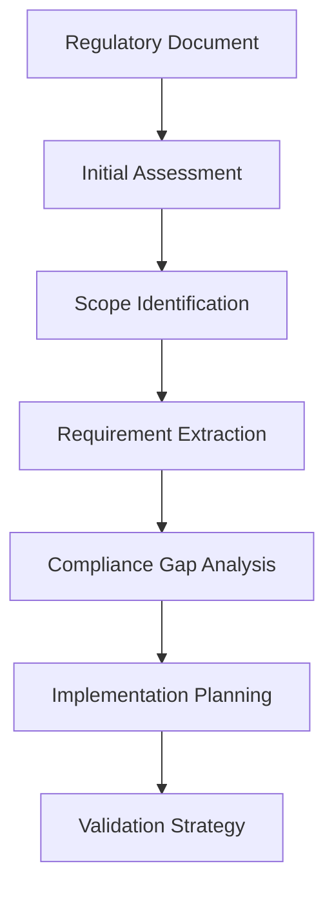

# QMS Infrastructure Knowledge Transfer Guide

## Overview

This guide captures essential knowledge, best practices, and lessons learned from implementing the QMS documentation infrastructure. It serves as a knowledge transfer resource for team members working on medical device software compliance and QMS workflow management.

## QMS Workflow Patterns

### Common QMS Task Patterns and Best Practices

#### Pattern 1: Regulatory Document Analysis

**Context**: Processing and analyzing regulatory standards and company procedures

**Workflow Pattern:**


**Best Practices:**
- **Start with Document Metadata**: Always capture version, revision date, and approval status
- **Hierarchical Analysis**: Process documents in order of regulatory hierarchy (standards → procedures → forms)
- **Cross-Reference Tracking**: Maintain relationships between referenced documents
- **Version Control**: Track all document versions and changes for audit purposes

**Example Implementation:**
```typescript
interface RegulatoryAnalysisWorkflow {
  documentMetadata: DocumentMetadata;
  scopeAnalysis: ScopeDefinition;
  requirementExtraction: RequirementList;
  complianceGapAnalysis: GapAnalysis;
  implementationPlan: ActionPlan;
}
```

#### Pattern 2: Compliance Validation Workflow

**Context**: Verifying compliance against regulatory requirements

**Workflow Pattern:**
```yaml
validation_steps:
  1. requirement_mapping:
     - map_implementation_to_requirements
     - verify_traceability_completeness
     
  2. evidence_collection:
     - gather_supporting_documentation
     - collect_test_results
     - document_design_decisions
     
  3. compliance_verification:
     - execute_compliance_tests
     - validate_against_standards
     - generate_compliance_reports
     
  4. audit_preparation:
     - organize_evidence_packages
     - prepare_traceability_matrices
     - create_compliance_summaries
```

**Best Practices:**
- **Evidence-Based Validation**: Every compliance claim must have supporting evidence
- **Systematic Approach**: Follow consistent validation methodology
- **Documentation Excellence**: Maintain comprehensive records for audit purposes
- **Continuous Monitoring**: Implement ongoing compliance checking, not just point-in-time validation

#### Pattern 3: QMS Document Processing Pipeline

**Context**: Converting PDF-based QMS documents to structured, searchable formats

**Processing Pipeline:**
```bash
# Standard QMS document processing sequence
pdf_extract → structure_analysis → content_categorization → 
cross_reference_resolution → markdown_generation → quality_validation
```

**Pattern Implementation:**
1. **Batch Processing Setup**:
   ```bash
   # Process entire SSI-SOP directories
   find VDL2/QMS/Docs -name "*.pdf" | while read pdf; do
     process_qms_document "$pdf"
   done
   ```

2. **Structure Recognition**:
   - Forms: Standardized templates with fields
   - Procedures: Sequential steps with decision points
   - Checklists: Verification items with checkboxes
   - Reports: Data collection and analysis formats

3. **Content Validation**:
   - Verify all sections are captured
   - Validate cross-references are resolved
   - Confirm formatting is preserved
   - Check metadata extraction accuracy

#### Pattern 4: Agile-Regulatory Integration

**Context**: Balancing agile development practices with regulatory compliance requirements

**Integration Strategy:**
```yaml
agile_regulatory_pattern:
  sprint_planning:
    - include_regulatory_requirements
    - allocate_compliance_tasks
    - plan_validation_activities
    
  development_process:
    - maintain_traceability_during_development
    - document_design_decisions_continuously
    - integrate_compliance_testing
    
  sprint_review:
    - demonstrate_compliance_progress
    - review_regulatory_deliverables
    - update_compliance_status
    
  retrospective:
    - evaluate_compliance_effectiveness
    - identify_regulatory_impediments
    - improve_compliance_processes
```

**Best Practices:**
- **Regulatory Story Mapping**: Include compliance requirements in user story mapping
- **Definition of Done**: Extend DoD to include regulatory compliance criteria
- **Continuous Documentation**: Maintain documentation throughout development, not just at the end
- **Stakeholder Involvement**: Include regulatory experts in sprint planning and reviews

## Document Processing Gotchas

### Common Issues with Document Conversion and Analysis

#### Issue 1: Complex PDF Structures

**Problem**: Medical device documents often have complex layouts with tables, forms, and embedded graphics

**Symptoms:**
- Text extraction produces garbled output
- Table structures are lost or misaligned
- Form fields are not properly identified
- Cross-references become broken links

**Solutions:**
```typescript
// Advanced PDF processing with structure preservation
interface PDFProcessingStrategy {
  layoutAnalysis: boolean;
  tableDetection: boolean;
  formFieldExtraction: boolean;
  graphicsHandling: 'preserve' | 'describe' | 'ignore';
}

const robustPDFConfig: PDFProcessingStrategy = {
  layoutAnalysis: true,
  tableDetection: true,
  formFieldExtraction: true,
  graphicsHandling: 'describe'
};
```

**Prevention Strategies:**
- Test processing with sample documents before batch operations
- Implement fallback processing methods for complex layouts
- Manual verification for critical regulatory documents
- Maintain original PDFs as authoritative source

#### Issue 2: Inconsistent Document Versioning

**Problem**: QMS documents may have inconsistent version numbering and naming conventions

**Common Patterns:**
- `SSI-QF-10A Design and Development Plan iss10.docx`
- `SSI-QF-10B WITHDRAWN. Calculation of FDA Level of Concern.doc`
- `SSI-QF-10Q Design Verification or Validation Report iss3 VER250627a.docx`

**Solution Pattern:**
```typescript
interface DocumentVersionParser {
  parseVersionInfo(filename: string): {
    documentId: string;
    title: string;
    version: string;
    status: 'active' | 'withdrawn' | 'draft';
    revisionDate?: string;
  };
}

// Example implementation
const parseSSIDocument = (filename: string) => {
  const withdrawn = filename.includes('WITHDRAWN');
  const versionMatch = filename.match(/iss(\d+)/i);
  const dateMatch = filename.match(/VER(\d+)/);
  
  return {
    documentId: extractDocumentId(filename),
    title: extractTitle(filename),
    version: versionMatch?.[1] || '1',
    status: withdrawn ? 'withdrawn' : 'active',
    revisionDate: dateMatch?.[1]
  };
};
```

#### Issue 3: Cross-Reference Resolution

**Problem**: QMS documents heavily cross-reference each other, creating complex dependency networks

**Challenges:**
- References to withdrawn documents
- Circular dependencies between documents
- Outdated references to superseded versions
- Ambiguous reference formats

**Resolution Strategy:**
```typescript
interface CrossReferenceResolver {
  documentRegistry: Map<string, DocumentMetadata>;
  referencePatterns: RegExp[];
  
  resolveReferences(content: string): {
    resolvedReferences: Reference[];
    brokenReferences: BrokenReference[];
    ambiguousReferences: AmbiguousReference[];
  };
}

// Reference resolution workflow
const resolutionWorkflow = [
  'extract_all_references',
  'normalize_reference_format',
  'match_to_document_registry',
  'handle_version_conflicts',
  'flag_broken_references',
  'suggest_alternatives'
];
```

#### Issue 4: Regulatory Language Interpretation

**Problem**: Regulatory documents use specific terminology that requires domain expertise

**Common Misinterpretations:**
- "Shall" vs "Should" vs "May" (different compliance levels)
- Technical terms with specific regulatory meanings
- Context-dependent requirements
- Implicit assumptions based on regulatory history

**Mitigation Approaches:**
```typescript
interface RegulatoryLanguageProcessor {
  terminologyDictionary: RegulatoryTerminology;
  contextAnalyzer: ContextAnalyzer;
  expertValidation: ExpertReviewSystem;
  
  processRegulatoryText(text: string): {
    interpretedRequirements: Requirement[];
    uncertainties: Uncertainty[];
    expertReviewNeeded: boolean;
  };
}
```

**Best Practices:**
- Maintain regulatory terminology glossary
- Flag uncertain interpretations for expert review
- Document interpretation decisions and rationale
- Regular validation with regulatory experts

## Compliance Tracking Best Practices

### Best Practices for Compliance Validation

#### Practice 1: Systematic Requirement Traceability

**Implementation Framework:**
```typescript
interface RequirementTraceability {
  regulatorySource: RegulatoryStandard;
  systemRequirement: SystemRequirement;
  designElement: DesignElement;
  implementationCode: CodeReference;
  testCase: TestCase;
  verificationEvidence: Evidence;
}

// Traceability validation workflow
const validateTraceability = (requirement: RequirementTraceability) => {
  return {
    sourceValid: validateRegulatorySource(requirement.regulatorySource),
    mappingComplete: validateRequirementMapping(requirement),
    implementationTraceable: validateImplementation(requirement),
    testingAdequate: validateTestCoverage(requirement),
    evidenceComplete: validateEvidence(requirement)
  };
};
```

**Key Practices:**
- **Bidirectional Traceability**: Trace both forward (requirement to implementation) and backward (implementation to requirement)
- **Regular Validation**: Automated checks for traceability completeness
- **Change Impact Analysis**: Assess impact of changes on traceability
- **Gap Analysis**: Systematic identification of traceability gaps

#### Practice 2: Risk-Based Compliance Approach

**Risk Assessment Framework:**
```yaml
compliance_risk_matrix:
  safety_impact:
    high: "Direct patient safety impact"
    medium: "Indirect safety implications"
    low: "Administrative or process compliance"
    
  regulatory_scrutiny:
    high: "FDA/Notified Body key focus area"
    medium: "Standard regulatory review area"
    low: "Routine compliance requirement"
    
  change_frequency:
    high: "Frequently modified requirements"
    medium: "Occasionally updated requirements"
    low: "Stable, established requirements"
```

**Implementation Strategy:**
- **High Risk**: Maximum documentation, continuous monitoring, expert review
- **Medium Risk**: Standard documentation, periodic review, automated validation
- **Low Risk**: Minimal documentation, exception-based review, automated compliance

#### Practice 3: Continuous Compliance Monitoring

**Monitoring Architecture:**
```typescript
interface ComplianceMonitoringSystem {
  realTimeValidation: RealTimeValidator;
  periodicAssessment: PeriodicAssessor;
  changeImpactAnalysis: ChangeAnalyzer;
  complianceDashboard: ComplianceDashboard;
  alertSystem: ComplianceAlertSystem;
}

// Monitoring workflow
const monitoringWorkflow = {
  continuous: ['requirement_changes', 'implementation_changes', 'test_results'],
  daily: ['compliance_status_update', 'gap_analysis'],
  weekly: ['trend_analysis', 'risk_assessment'],
  monthly: ['comprehensive_review', 'improvement_planning']
};
```

**Monitoring Best Practices:**
- **Early Warning Systems**: Detect compliance issues before they become problems
- **Trend Analysis**: Identify patterns in compliance performance
- **Automated Alerts**: Notify stakeholders of compliance risks
- **Performance Metrics**: Track compliance KPIs and improvement

#### Practice 4: Audit Preparation Excellence

**Audit Readiness Framework:**
```typescript
interface AuditReadinessSystem {
  evidencePackaging: EvidencePackager;
  traceabilityMatrices: TraceabilityGenerator;
  complianceSummaries: ComplianceReporter;
  auditTrails: AuditTrailManager;
  expertPreparation: ExpertBriefingSystem;
}

// Audit preparation checklist
const auditPreparation = {
  documentation: [
    'complete_requirement_traceability',
    'evidence_packages_organized',
    'compliance_gaps_documented',
    'mitigation_strategies_prepared'
  ],
  
  personnel: [
    'expert_briefings_completed',
    'roles_responsibilities_clarified',
    'backup_personnel_identified',
    'communication_protocols_established'
  ],
  
  systems: [
    'audit_trail_integrity_verified',
    'document_version_control_confirmed',
    'access_controls_documented',
    'backup_systems_tested'
  ]
};
```

## Infrastructure Maintenance

### Ongoing Maintenance Requirements and Procedures

#### Maintenance Category 1: Document Management

**Regular Maintenance Tasks:**

1. **Document Synchronization** (Monthly):
   ```bash
   # Update document repository with latest QMS documents
   sync_qms_documents
   validate_document_integrity
   update_cross_references
   generate_change_reports
   ```

2. **Version Control Management** (Weekly):
   ```typescript
   interface DocumentMaintenanceTasks {
     versionTracking: 'automated';
     changeDetection: 'continuous';
     obsoleteDocumentHandling: 'flagged_removal';
     archivalProcess: 'automated_with_approval';
   }
   ```

3. **Quality Assurance** (Daily):
   - Automated link checking for cross-references
   - Document structure validation
   - Metadata consistency verification
   - Processing error monitoring

#### Maintenance Category 2: Compliance Monitoring

**Ongoing Compliance Tasks:**

1. **Regulatory Update Monitoring**:
   ```yaml
   monitoring_schedule:
     daily: 
       - regulatory_news_feeds
       - industry_alerts
       - internal_change_notifications
       
     weekly:
       - standard_update_checks
       - guidance_document_reviews
       - compliance_blog_monitoring
       
     monthly:
       - comprehensive_regulatory_review
       - impact_assessment_updates
       - training_needs_analysis
   ```

2. **Compliance Validation Maintenance**:
   - Update validation rules for new requirements
   - Refresh compliance test suites
   - Maintain traceability matrix accuracy
   - Update risk assessments

#### Maintenance Category 3: System Performance

**Performance Maintenance Tasks:**

1. **System Optimization** (Monthly):
   ```typescript
   interface PerformanceMaintenanceTasks {
     cacheOptimization: () => void;
     databaseMaintenance: () => void;
     performanceProfileAnalysis: () => void;
     capacityPlanningReview: () => void;
   }
   ```

2. **Infrastructure Updates**:
   - Security patch management
   - Dependency updates and vulnerability scanning
   - Performance monitoring and optimization
   - Backup and disaster recovery testing

#### Maintenance Category 4: Knowledge Management

**Knowledge Maintenance Processes:**

1. **Documentation Updates**:
   - Quarterly review of procedures and guidelines
   - Annual comprehensive documentation review
   - Continuous improvement based on user feedback
   - Expert knowledge capture and transfer

2. **Training and Competency**:
   ```yaml
   training_maintenance:
     new_team_members:
       - qms_infrastructure_overview
       - regulatory_compliance_basics
       - system_operation_procedures
       - troubleshooting_guidelines
       
     ongoing_training:
       - regulatory_update_sessions
       - system_enhancement_training
       - best_practice_sharing
       - compliance_refresher_training
   ```

## Emergency Procedures

### Critical Issue Response

#### Issue: Compliance Audit Notification

**Immediate Response (24-48 hours):**
1. Freeze current system state
2. Generate comprehensive audit package
3. Activate audit response team
4. Prepare preliminary evidence package

**Preparation Actions:**
```bash
# Emergency audit preparation script
generate_audit_snapshot
validate_traceability_completeness
prepare_evidence_packages
brief_audit_response_team
establish_communication_protocols
```

#### Issue: Regulatory Standard Update

**Response Process:**
1. **Impact Assessment** (7 days): Analyze impact on current compliance
2. **Gap Analysis** (14 days): Identify compliance gaps
3. **Implementation Planning** (21 days): Develop remediation plan
4. **Execution** (per plan): Implement necessary changes

#### Issue: System Failure or Data Loss

**Recovery Procedures:**
1. Activate disaster recovery procedures
2. Restore from validated backups
3. Verify data integrity and completeness
4. Document incident and lessons learned
5. Update disaster recovery procedures

## Conclusion

This knowledge transfer guide captures the key insights, patterns, and procedures for maintaining and operating the QMS infrastructure effectively. Regular review and updates of this guide ensure continued effectiveness and knowledge preservation.

**Key Success Factors:**
- Systematic approach to all QMS activities
- Continuous learning and improvement
- Expert collaboration and consultation
- Rigorous documentation and validation
- Proactive maintenance and monitoring

---

**Document Metadata:**
- **Created**: 2025-01-04
- **Version**: 1.0
- **Next Review**: 2025-04-04
- **Maintenance Schedule**: Quarterly updates, annual comprehensive review