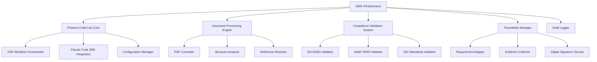

# Intelligent QMS Infrastructure for Medical Device Software Development

## Project Status Overview

### Current Progress Summary

This document presents the comprehensive design and implementation plan developed for transforming our existing development infrastructure into an intelligent QMS platform. The work completed addresses the core challenge of achieving regulatory compliance while maintaining modern AGILE development practices.

**Key Achievement**: A complete architectural solution that integrates regulatory requirements into natural development workflows, with detailed implementation roadmap and technical specifications ready for development kickoff.

---

## Problem Analysis Completed

### Current State Assessment

Through comprehensive analysis of our existing QMS (SSI-SOP-10, SSI-SOP-20) and regulatory requirements, I've identified the core challenges:

- **Traditional QMS**: Document-heavy Word/PDF system disconnected from development workflows
- **AGILE Integration Gap**: Current procedures don't accommodate iterative development practices
- **Manual Overhead**: Significant time spent on documentation and audit preparation
- **Traceability Issues**: Difficulty maintaining requirement-to-implementation links

### Solution Framework Developed  

The proposed system addresses these challenges by:

- **Workflow Integration**: Embedding compliance naturally into development processes
- **Automated Documentation**: Generating regulatory documentation from development artifacts
- **AGILE Compatibility**: Following AAMI TIR45 guidance for AGILE practices in medical device development
- **Modern Tooling**: Using Git, Markdown, and automated tools instead of manual document management

---

## Designed Solution Components

### Core System Capabilities

#### 1. **Intelligent Document Processing Engine**

Converts existing Word and PDF QMS documents into structured, searchable formats with preserved relationships.

**Technical Features**:

- Automated PDF-to-Markdown conversion with structure preservation
- Cross-reference resolution across 50+ SSI-SOP documents
- Form recognition and field extraction
- Version control integration

#### 2. **AGILE-Compliant Workflow Integration**

Implements AAMI TIR45 guidance for AGILE practices within EN 62304 medical device requirements.

**Implementation Details**:

- TDD workflow adaptation for regulatory compliance
- Iterative development with continuous compliance validation
- Integration with existing Phoenix-Code-Lite infrastructure
- Real-time requirement traceability

#### 3. **Automated Audit Trail & Evidence Collection**

Provides comprehensive audit trail with cryptographic verification and digital signatures.

**System Features**:

- Automatic evidence collection from development artifacts
- Complete requirement-to-implementation traceability
- Digital signature infrastructure for evidence packages
- Compliance report generation

#### 4. **Risk-Based Compliance Management**

Focuses compliance efforts based on EN 62304 software safety classification and risk analysis.

**Functionality**:

- Software safety classification integration (Class A/B/C)
- Risk-based documentation requirements
- Gap analysis and remediation recommendations
- Multi-standard compliance validation (EN 62304, AAMI TIR45, ISO 13485)

---

## Stakeholder Benefits Analysis

### For Management & Leadership

| Feature                            | Operational Benefit                                               |
|------------------------------------|-------------------------------------------------------------------|
| **Real-time Compliance Dashboard** | Continuous visibility into compliance status and progress         |
| **Automated Report Generation**    | Streamlined audit preparation and regulatory submission processes |
| **Risk-based Resource Planning**   | Data-driven allocation of quality assurance resources             |
| **Continuous Audit Readiness**     | Reduced audit preparation time and improved audit outcomes        |

### For Development Teams

| Feature                            | Development Benefit                                                     |
|------------------------------------|-------------------------------------------------------------------------|
| **Integrated Compliance Workflow** | Regulatory requirements embedded in normal development processes        |
| **Intelligent Task Management**    | Automatic translation of regulatory requirements into development tasks |
| **Modern Development Tools**       | Git, Markdown, and CLI integration instead of manual document processes |
| **Automated Testing Integration**  | EN 62304 validation integrated with existing test frameworks            |

### For Quality & Regulatory Teams

| Feature                          | QA/Regulatory Benefit                                             |
|----------------------------------|-------------------------------------------------------------------|
| **Complete Traceability System** | End-to-end requirement traceability with evidence collection      |
| **Proactive Gap Analysis**       | Early identification of compliance gaps with remediation guidance |
| **Multi-Standard Compliance**    | Unified system for EN 62304, AAMI TIR45, ISO 13485, and ISO 14971 |
| **Automated Evidence Packages**  | Complete audit documentation generated from development artifacts |

---

## Comparison with Alternatives

### Technical Comparison Matrix

| Solution               | Setup Time  | AGILE Support | Medical Device Focus | Audit Readiness | Customization |
|------------------------|-------------|---------------|----------------------|-----------------|---------------|
| **Our QMS Solution**   | 2-3 months  | ★★★★★       | ★★★★★              | ★★★★★         | ★★★★★       |
| **Obsidian + Plugins** | 6+ months   | ★★★☆☆       | ★★☆☆☆              | ★★★☆☆         | ★★★★☆       |
| **Formwork eQMS**      | 6-12 months | ★★☆☆☆       | ★★★★☆              | ★★★★☆         | ★★☆☆☆       |
| **Jira + Confluence**  | 3-6 months  | ★★★★☆       | ★★☆☆☆              | ★★★☆☆         | ★★★☆☆       |
| **Traditional QMS**    | 12+ months  | ★☆☆☆☆       | ★★★★☆              | ★★★★★         | ★☆☆☆☆       |

### Solution Advantages Analysis

#### **vs. Obsidian**

- **Medical Device Specialization**: Purpose-built for EN 62304 and medical device workflows
- **Regulatory Audit Trail**: Built-in cryptographic audit trails and digital signatures
- **Automated Compliance**: Integrated compliance validation vs. manual workflow management

#### **vs. Formwork eQMS**

- **Development Integration**: Native integration with development tools and workflows
- **AGILE Compatibility**: Built-in AAMI TIR45 support vs. traditional waterfall orientation
- **Customization Control**: Complete system customization vs. vendor-defined limitations

#### **vs. Jira/Confluence**

- **Regulatory Focus**: Pre-configured medical device templates and compliance workflows
- **Development Tool Integration**: Seamless Git, CLI, and testing framework integration
- **Compliance Intelligence**: Automated gap analysis and requirement validation

#### **vs. Traditional QMS Systems**

- **Modern Toolchain**: Git, Markdown, and automated processing vs. Word/PDF workflows
- **AGILE Integration**: Native support for iterative development practices
- **Technical Efficiency**: Automated processes vs. manual documentation maintenance

---

## Implementation Roadmap

### Phase 1: Foundation (Weeks 1-2)

- Establish comprehensive test coverage for existing system
- Create performance baselines
- Set up continuous validation pipeline

### Phase 2: Architecture (Weeks 3-4)  

- Analyze existing system architecture
- Design QMS integration strategy
- Plan component preservation approach

### Phase 3: Core Implementation (Weeks 5-7)

- Build document processing engine
- Implement compliance validation system
- Create requirement traceability infrastructure

### Phase 4: Security & Audit (Weeks 8-10)

- Implement cryptographic audit trails
- Build digital signature system
- Create role-based access controls

### Phase 5: User Experience (Weeks 11-13)

- Enhance CLI with QMS capabilities
- Build interactive workflow system
- Create compliance dashboard

### Phase 6: Validation & Deployment (Weeks 14-16)

- Comprehensive system testing
- Regulatory compliance validation
- Production deployment preparation

**Total Timeline**: 16 weeks | **Resource Requirements**: Lead architect + 2-3 developers + QA specialist

---

## Expected Impact Assessment

### Operational Improvements

The designed solution addresses key operational challenges identified in the current QMS analysis:

**Process Efficiency Gains**:

- **Developer Workflow**: Seamless integration with existing development processes
- **Audit Preparation**: Automated evidence collection and report generation
- **Compliance Monitoring**: Real-time visibility into regulatory status
- **Documentation Quality**: Automated consistency and cross-reference maintenance

**Technical Improvements**:

- **Traceability**: Complete requirement-to-implementation linking
- **Version Control**: Git-based document management with change tracking
- **Automation**: Reduced manual documentation maintenance overhead
- **Integration**: Unified system for development and compliance processes

---

## Implementation Risk Analysis

### Technical Risk Assessment

| Risk                      | Mitigation Strategy                                                         | Confidence Level |
|---------------------------|-----------------------------------------------------------------------------|------------------|
| **Performance Impact**    | Test-driven development with performance baseline monitoring                | High             |
| **Regulatory Compliance** | Built-in validation against EN 62304, AAMI TIR45, ISO 13485 standards       | High             |
| **System Integration**    | Plugin architecture preserving all existing Phoenix-Code-Lite functionality | High             |
| **User Adoption**         | Gradual rollout with training and seamless workflow integration             | Medium-High      |

### Regulatory Risk Mitigation

| Regulatory Risk               | Designed Solution                                                     |
|-------------------------------|-----------------------------------------------------------------------|
| **Audit Preparation**         | Continuous evidence collection and automated audit package generation |
| **Compliance Gaps**           | Proactive gap analysis with specific remediation guidance             |
| **Traceability Requirements** | Complete requirement-to-implementation traceability with audit trails |
| **Documentation Quality**     | Automated consistency checking and cross-reference validation         |

---

## Recommended Next Steps

### Implementation Readiness Status

The design and planning phase has produced:

- ✅ Complete technical architecture and implementation roadmap
- ✅ Detailed 8-phase development plan with timelines and deliverables
- ✅ Risk assessment and mitigation strategies
- ✅ Stakeholder benefit analysis and comparison with alternatives

### Immediate Decision Points

**For Management Review**:

1. **Resource Allocation**: Confirm development team availability for 16-week timeline
2. **Regulatory Consultation**: Validate approach with external regulatory experts
3. **Priority Assessment**: Evaluate project priority against other development initiatives
4. **Implementation Timeline**: Confirm preferred start date and milestone expectations

### Phase 1 Implementation Prerequisites

**Technical Preparation**:

1. **Development Environment**: Set up dedicated QMS development workspace
2. **Team Assignment**: Identify lead architect and development team members
3. **Baseline Documentation**: Document current Phoenix-Code-Lite performance metrics
4. **Regulatory Access**: Ensure team access to EN 62304, AAMI TIR45, and related standards

### Project Success Criteria

- **Technical Quality**: >90% test coverage, <10% performance impact, 100% backward compatibility
- **Regulatory Compliance**: >95% requirement coverage with automated validation
- **System Integration**: Seamless integration with existing development workflows

---

## Technical Details

*This section provides detailed technical information for team members interested in implementation specifics.*

### System Architecture

### Core Components

The QMS Infrastructure is built as an extension to the existing Phoenix-Code-Lite TDD workflow orchestrator, preserving all existing functionality while adding specialized QMS capabilities.

#### **Document Processing Engine**

```typescript
interface DocumentProcessor {
  convertPDF(input: string, options: ProcessingOptions): Promise<ConversionResult>;
  analyzeStructure(document: string): Promise<StructureAnalysis>;
  resolveReferences(document: string): Promise<ReferenceMap>;
}
```

**Capabilities**:

- PDF to Markdown conversion with structure preservation
- Automatic form recognition and field extraction
- Cross-reference resolution across 50+ QMS documents
- Batch processing with parallel execution

#### **Compliance Validation System**

```typescript
interface ComplianceValidator {
  loadStandard(standard: RegulatoryStandard): Promise<void>;
  validateCompliance(project: Project, standard: string): Promise<ComplianceResult>;
  generateGapAnalysis(project: Project): Promise<GapAnalysisReport>;
}
```

**Standards Supported**:

- EN 62304:2006+A1:2015 Medical Device Software
- AAMI TIR45:2023 AGILE Practices in Medical Device Software
- ISO 13485:2016 Quality Management Systems
- ISO 14971:2019 Risk Management for Medical Devices

#### **Requirement Traceability Matrix**

```typescript
interface TraceabilityManager {
  generateMatrix(project: Project, standards: string[]): Promise<TraceabilityMatrix>;
  validateTraceability(matrix: TraceabilityMatrix): Promise<ValidationResult>;
  collectEvidence(requirementId: string): Promise<EvidencePackage>;
}
```

**Features**:

- Automatic requirement mapping from user needs to implementation
- Evidence collection from code, tests, and documentation
- Digital signature support for evidence packages
- Audit trail generation with cryptographic verification

### Integration Architecture



### Development Standards

#### Code Quality Requirements

- **Test Coverage**: >90% for all QMS components
- **Type Safety**: 100% TypeScript strict mode compliance
- **Performance**: <10% degradation from baseline measurements
- **Security**: Role-based access control and audit trail integrity

#### Regulatory Compliance Integration

- **EN 62304 Lifecycle Processes**: Embedded in TDD workflow phases
- **AAMI TIR45 AGILE Practices**: Native support for iterative development
- **Traceability Requirements**: Automatic requirement-to-implementation mapping
- **Risk Management**: Integrated risk assessment and mitigation tracking

#### Technology Stack

- **Core**: TypeScript/Node.js with existing Phoenix-Code-Lite foundation
- **PDF Processing**: pdftotext with custom parsing scripts
- **Validation**: Zod schemas for runtime type safety
- **Testing**: Jest with comprehensive integration test coverage
- **Security**: Cryptographic audit trails and digital signatures

### Command Line Interface

#### Core QMS Commands

```bash
# Document Processing
npm run dev process-document --input "SSI-SOP-20.pdf" --output "structured/"
npm run dev batch-process --source "VDL2/QMS/Docs/" --output "processed/"

# Compliance Management
npm run dev validate-compliance --standard EN62304 --safety-class B
npm run dev generate-traceability --standards "EN62304,AAMI-TIR45"

# Reporting and Analytics
npm run dev generate-report --type compliance-summary --format pdf
npm run dev generate-audit-package --output "audit-2025/"
```

#### Workflow Integration

The QMS capabilities integrate seamlessly with existing Phoenix-Code-Lite commands:

```bash
# Enhanced TDD workflow with regulatory compliance
npm run dev plan-task --regulatory-context --standards "EN62304"
npm run dev implement-feature --compliance-tracking --safety-class B
npm run dev validate-implementation --regulatory-tests --audit-evidence
```

### Configuration Management

#### QMS Configuration Schema

```typescript
interface QMSConfiguration {
  regulatory: {
    primaryStandards: string[];
    safetyClassification: 'A' | 'B' | 'C';
    complianceLevel: 'basic' | 'comprehensive';
  };
  documents: {
    repositoryPath: string;
    processingOptions: ProcessingOptions;
    outputFormats: string[];
  };
  audit: {
    enableCryptographicTrail: boolean;
    digitalSignatureRequired: boolean;
    retentionPeriod: string;
  };
}
```

#### Template System

Pre-configured templates for different regulatory contexts:

- **Starter Template**: Basic EN 62304 Class A compliance
- **Enterprise Template**: Comprehensive Class B/C with full audit trail
- **AGILE Template**: AAMI TIR45 optimized workflow integration

### Security & Audit Framework

#### Cryptographic Audit Trail

```typescript
interface AuditEvent {
  timestamp: string;
  userId: string;
  action: string;
  resourceId: string;
  cryptographicHash: string;
  digitalSignature?: string;
}
```

#### Role-Based Access Control

- **Developer**: Read/write code and tests, read-only compliance status
- **Quality Engineer**: Full QMS document access, compliance validation
- **Regulatory Affairs**: Audit trail access, report generation, evidence packages
- **Administrator**: Full system access, configuration management

#### Compliance Data Protection

- Sensitive regulatory documents encrypted at rest
- Access logging for all compliance-related operations
- Backup and disaster recovery for audit trail integrity
- GDPR/HIPAA compliance for patient data handling (if applicable)

---

**Document Information**:

- **Version**: 1.0
- **Date**: 04.08.2025  
- **Author**: Gabriel Dubin
- **Status**: Design Complete - Ready for Implementation Decision
- **Next Review**: Upon management approval for implementation
