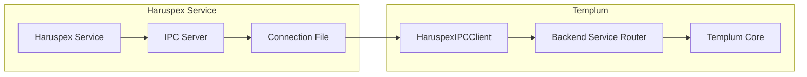

# Haruspex Integration with Templum

**Status**: ✅ Ready for Activation  
**Created**: 2025-08-29  
**Integration Type**: IPC (Inter-Process Communication)  
**Port**: Dynamic (connection file-based)  

## Overview

Templum includes full integration infrastructure for Haruspex analysis and prediction services. The integration is ready and waiting for Haruspex to be running - no additional development required.

## Integration Architecture



## Activation Requirements

### 1. Haruspex Service Must Be Running

Haruspex must be active and providing its IPC server. When Haruspex starts, it should:

1. **Start IPC Server**: Create and bind to an available port
2. **Create Connection File**: Write connection details to `.haruspex/haruspex-debug-connection.json`
3. **Accept Connections**: Listen for client connections from Templum

### 2. Connection File Format

Haruspex must create this file in the workspace root:

**Location**: `.haruspex/haruspex-debug-connection.json`

**Format**:

```json
{
  "host": "localhost",
  "port": 3001,
  "socketPath": "/tmp/haruspex-socket",
  "timestamp": 1693401234567,
  "serverVersion": "2.0.0"
}
```

### 3. IPC Protocol Support

Haruspex must implement these message types:

| Message Type | Purpose | Request | Response |
|--------------|---------|---------|----------|
| `ping` | Connection health check | `{ type: 'ping', timestamp: number }` | `{ type: 'pong', success: true }` |
| `getSkinDefinition` | UI skin definitions | `{ type: 'getSkinDefinition', payload: { backendId: string } }` | `{ success: true, data: SkinDefinition }` |
| `executeCommand` | Analysis commands | `{ type: 'executeCommand', payload: { command: string, args: any[] } }` | `{ success: true, data: CommandResult }` |
| `getCapabilities` | Service capabilities | `{ type: 'getCapabilities' }` | `{ success: true, data: { capabilities: string[] } }` |
| `getVersion` | Service version info | `{ type: 'getVersion' }` | `{ success: true, data: { version: string } }` |

## Templum Integration Implementation

### Backend Service Router Configuration

Templum's `BackendServiceRouter` is pre-configured for Haruspex:

```typescript
// Automatic Haruspex endpoint configuration
this.backendEndpoints.set('haruspex', 'ipc://localhost:3001');

// Pre-defined capabilities
this.serviceHealth.set('haruspex', {
  connected: false,
  health: 'unhealthy',
  lastCheck: 0,
  capabilities: ['analysis', 'prediction', 'mermaid-generation', 'skin-provider']
});
```

### Connection Process

1. **Service Discovery**: Templum scans for `.haruspex/haruspex-debug-connection.json`
2. **Connection Establishment**: Uses file parameters to connect via TCP socket
3. **Handshake**: Sends `ping` message to verify communication
4. **Capability Detection**: Queries service capabilities
5. **Integration Ready**: Routes commands through unified interface

### Message Protocol Implementation

```typescript
// Example: Templum calling Haruspex for analysis
const analysisRequest = {
  id: 'request_12345',
  type: 'executeCommand',
  method: 'analyze-codebase',
  timestamp: Date.now(),
  payload: {
    command: 'analyze-codebase',
    args: [{ targetPath: './src', analysisType: 'comprehensive' }],
    backendId: 'haruspex'
  }
};

// Haruspex response format
const analysisResponse = {
  id: 'request_12345',
  type: 'command_response', 
  success: true,
  data: {
    analysis: { /* analysis results */ },
    predictions: { /* prediction data */ },
    recommendations: [ /* improvement suggestions */ ]
  },
  timestamp: Date.now()
};
```

## Testing Integration

### Manual Testing Steps

1. **Start Haruspex**: Ensure Haruspex service is running and creates connection file
2. **Verify Connection File**: Check `.haruspex/haruspex-debug-connection.json` exists
3. **Start Templum**: Load VSCode extension or run Templum CLI
4. **Check Discovery**: Look for backend discovery logs mentioning Haruspex
5. **Test Commands**: Use VSCode commands to interact with Haruspex through Templum

### Connection Verification

```typescript
// Check if Haruspex is connected through Templum
const status = await templumCore.getSystemStatus();
const haruspexStatus = status.coreEngine.backendConnections.backends.haruspex;

console.log('Haruspex Status:', {
  connected: haruspexStatus?.connected,
  health: haruspexStatus?.health,
  capabilities: haruspexStatus?.capabilities,
  version: haruspexStatus?.version
});
```

## Troubleshooting

### Common Issues

1. **Connection File Not Found**
   - **Cause**: Haruspex not running or file not created
   - **Solution**: Start Haruspex service, verify it creates the connection file
   - **Check**: `ls -la .haruspex/haruspex-debug-connection.json`

2. **Connection Timeout**
   - **Cause**: IPC server not listening, firewall blocking, wrong port
   - **Solution**: Verify Haruspex IPC server is active on specified port
   - **Check**: `netstat -an | grep [PORT]`

3. **Protocol Mismatch**
   - **Cause**: Haruspex using different message format than expected
   - **Solution**: Verify Haruspex implements expected IPC protocol
   - **Check**: Send manual `ping` message to verify response format

4. **Permission Issues**
   - **Cause**: File system permissions preventing connection file access
   - **Solution**: Ensure both Haruspex and Templum can read/write `.haruspex/` directory
   - **Check**: `ls -la .haruspex/`

### Debug Commands

```bash
# Check connection file
cat .haruspex/haruspex-debug-connection.json

# Test IPC connection manually
telnet localhost [PORT_FROM_CONNECTION_FILE]

# View Templum backend discovery logs
# (Check VSCode Developer Console or terminal output)
```

### Templum Debug API

```typescript
// Force backend service refresh
await templumCore.refreshBackendServices();

// Check specific backend availability  
const isAvailable = await templumCore.getBackendRouter()?.isServiceAvailable('haruspex');

// Get detailed backend status
const connectionStatus = templumCore.getBackendRouter()?.getConnectionStatus();
```

## Benefits of Integration

### For Agents (Claude Code, AI Assistants)

- **Unified Interface**: Access Haruspex through single Templum API
- **Automatic Discovery**: No manual connection management needed
- **Graceful Degradation**: Fallback behavior when Haruspex unavailable  
- **Health Monitoring**: Real-time status updates and error handling

### For Haruspex

- **Protocol Abstraction**: Don't need to handle multiple client types
- **Service Registration**: Automatic discovery and capability advertising
- **State Management**: Integrated with Templum's universal state system
- **Error Recovery**: Automatic reconnection and error handling

### For Users

- **Seamless Experience**: Haruspex features available through any Templum interface
- **Consistent UI**: Haruspex skin definitions rendered consistently
- **Command Routing**: Natural command flow regardless of interface choice
- **Status Visibility**: Clear indicators of Haruspex availability and health

## Next Steps

1. **Start Haruspex**: Launch Haruspex service with IPC server
2. **Verify Files**: Confirm connection file creation
3. **Test Integration**: Use Templum commands to verify communication
4. **Monitor Logs**: Check for successful backend discovery
5. **Use Features**: Access Haruspex analysis through Templum interfaces

The integration infrastructure is complete and ready for immediate use once Haruspex is running.
