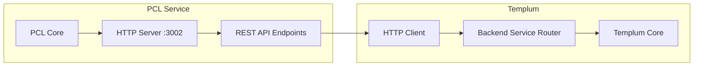

# Phoenix Code Lite (PCL) Integration with Templum

**Status**: ✅ Ready for Activation  
**Created**: 2025-08-29  
**Integration Type**: HTTP REST API  
**Port**: `localhost:3002`  

## Overview

Templum includes full integration infrastructure for Phoenix Code Lite (PCL) TDD workflow and testing services. The integration is ready and waiting for PCL to provide an HTTP server - no additional development required.

## Integration Architecture



## Activation Requirements

### 1. PCL HTTP Server Must Be Running

PCL must provide an HTTP server on `localhost:3002` that implements the required REST API endpoints.

**Expected Server Configuration**:
- **Host**: `localhost`
- **Port**: `3002`
- **Protocol**: HTTP (will auto-upgrade to HTTPS if available)
- **Content-Type**: `application/json`

### 2. Required API Endpoints

PCL must implement these HTTP endpoints:

#### Health Check Endpoints
Templum tests multiple health endpoints for robust service discovery:

| Endpoint | Method | Purpose | Response |
|----------|--------|---------|----------|
| `/api/health` | GET | Primary health check | `{ "status": "healthy", "service": "pcl" }` |
| `/api/status` | GET | Service status check | `{ "status": "operational", "uptime": 3600 }` |
| `/health` | GET | Simplified health check | `"OK"` or `{ "healthy": true }` |
| `/ping` | GET | Basic connectivity test | `"pong"` or `{ "response": "pong" }` |

#### Core API Endpoints

| Endpoint | Method | Purpose | Request Format | Response Format |
|----------|--------|---------|----------------|-----------------|
| `/api/skins/{skinId}` | GET | Get TDD workflow skin definitions | Path param: `skinId` | `{ skinDefinition: SkinDefinition }` |
| `/api/commands/execute` | POST | Execute TDD commands | `{ command: string, args: any[], backendId: string }` | `{ success: true, data: CommandResult }` |
| `/api/capabilities` | GET | Get service capabilities | None | `{ capabilities: string[] }` |
| `/api/version` | GET | Get service version | None | `{ version: string }` |

### 3. API Response Formats

#### Skin Definition Response
```json
{
  "skinDefinition": {
    "id": "pcl-tdd-workflow",
    "name": "PCL TDD Workflow",
    "version": "1.0.0",
    "metadata": {
      "backend": "pcl",
      "compatibleInterfaces": ["cli", "vscode", "command"]
    },
    "views": {
      "treeViews": [
        {
          "id": "tdd-workflow",
          "title": "TDD Workflow",
          "items": [
            { "id": "red", "label": "Red - Write Failing Test" },
            { "id": "green", "label": "Green - Make Test Pass" },
            { "id": "refactor", "label": "Refactor - Improve Code" }
          ]
        }
      ]
    },
    "commands": {
      "primary": [
        {
          "id": "run-tests",
          "label": "Run Tests",
          "description": "Execute test suite"
        }
      ]
    }
  }
}
```

#### Command Execution Response
```json
{
  "success": true,
  "data": {
    "command": "run-tests",
    "result": {
      "testResults": {
        "passed": 15,
        "failed": 2,
        "total": 17
      },
      "coverage": {
        "percentage": 87.5,
        "files": 45
      },
      "duration": "2.3s"
    }
  }
}
```

#### Capabilities Response
```json
{
  "capabilities": [
    "tdd-workflow",
    "testing", 
    "code-generation",
    "cli-interface",
    "skin-provider",
    "test-execution",
    "coverage-analysis"
  ]
}
```

## Templum Integration Implementation

### Backend Service Router Configuration

Templum's `BackendServiceRouter` is pre-configured for PCL:

```typescript
// Automatic PCL endpoint configuration
this.backendEndpoints.set('pcl', 'http://localhost:3002');

// Pre-defined capabilities
this.serviceHealth.set('pcl', {
  connected: false, 
  health: 'unhealthy',
  lastCheck: 0,
  capabilities: ['tdd-workflow', 'testing', 'code-generation', 'cli-interface']
});
```

### Connection Process

1. **Service Discovery**: Templum tests multiple health endpoints on `localhost:3002`
2. **Health Validation**: Tries `/api/health`, `/api/status`, `/health`, `/ping` in sequence
3. **Capability Detection**: Calls `/api/capabilities` to discover available features
4. **Version Check**: Calls `/api/version` for service version information
5. **Integration Ready**: Routes commands through unified HTTP client

### HTTP Client Implementation

```typescript
// Example: Templum calling PCL for TDD workflow
const tddRequest = {
  method: 'POST',
  url: 'http://localhost:3002/api/commands/execute',
  headers: {
    'Content-Type': 'application/json',
    'Accept': 'application/json'
  },
  body: JSON.stringify({
    command: 'run-tdd-cycle',
    args: [{ 
      testFile: './tests/unit/calculator.test.ts',
      sourceFile: './src/calculator.ts' 
    }],
    backendId: 'pcl'
  })
};
```

## Testing Integration

### Manual Testing Steps

1. **Start PCL HTTP Server**: Ensure PCL serves HTTP API on port 3002
2. **Test Health Endpoints**: Verify at least one health endpoint responds
3. **Start Templum**: Load VSCode extension or run Templum CLI
4. **Check Discovery**: Look for backend discovery logs mentioning PCL
5. **Test Commands**: Use VSCode commands to interact with PCL through Templum

### Connection Verification

```typescript
// Check if PCL is connected through Templum
const status = await templumCore.getSystemStatus();
const pclStatus = status.coreEngine.backendConnections.backends.pcl;

console.log('PCL Status:', {
  connected: pclStatus?.connected,
  health: pclStatus?.health,
  capabilities: pclStatus?.capabilities,
  version: pclStatus?.version
});
```

### Manual API Testing

```bash
# Test PCL health endpoints
curl http://localhost:3002/api/health
curl http://localhost:3002/api/status  
curl http://localhost:3002/health
curl http://localhost:3002/ping

# Test PCL capabilities
curl http://localhost:3002/api/capabilities

# Test PCL version
curl http://localhost:3002/api/version

# Test skin definition endpoint
curl http://localhost:3002/api/skins/default

# Test command execution
curl -X POST http://localhost:3002/api/commands/execute \
  -H "Content-Type: application/json" \
  -d '{
    "command": "run-tests",
    "args": [{"target": "./tests"}],
    "backendId": "pcl"
  }'
```

## Troubleshooting

### Common Issues

1. **Connection Refused**
   - **Cause**: PCL HTTP server not running on port 3002
   - **Solution**: Start PCL with HTTP server enabled
   - **Check**: `curl http://localhost:3002/health`

2. **404 Not Found**
   - **Cause**: PCL server running but missing required endpoints
   - **Solution**: Implement missing API endpoints in PCL
   - **Check**: Test each endpoint individually

3. **Timeout Errors**
   - **Cause**: PCL server responding too slowly (>30s timeout)
   - **Solution**: Optimize PCL response times or increase timeout
   - **Check**: Monitor response times with `curl -w "%{time_total}"`

4. **JSON Parse Errors**
   - **Cause**: PCL returning invalid JSON or wrong Content-Type
   - **Solution**: Ensure responses are valid JSON with proper headers
   - **Check**: Validate JSON with `jq` or online validator

5. **Port Already In Use**
   - **Cause**: Another service using port 3002
   - **Solution**: Stop conflicting service or change PCL port
   - **Check**: `lsof -i :3002` (Unix) or `netstat -an | findstr :3002` (Windows)

### Debug Commands

```bash
# Check if port is in use
netstat -an | findstr :3002

# Test health endpoints
curl -v http://localhost:3002/api/health

# Check response headers
curl -I http://localhost:3002/api/status
```

### Templum Debug API

```typescript
// Force backend service refresh
await templumCore.refreshBackendServices();

// Check specific backend availability
const isAvailable = await templumCore.getBackendRouter()?.isServiceAvailable('pcl');

// Get detailed connection status
const connectionStatus = templumCore.getBackendRouter()?.getConnectionStatus();
const pclStatus = connectionStatus?.backends.pcl;
```

## Benefits of Integration

### For Agents (Claude Code, AI Assistants)

- **TDD Workflow Access**: Direct access to PCL's TDD capabilities
- **Unified Command Interface**: Execute PCL commands through Templum API
- **Test Result Integration**: Get test results in standardized format
- **Real-time Status**: Monitor PCL service health and capabilities

### For PCL

- **Protocol Standardization**: Single HTTP API serves multiple clients
- **Service Discovery**: Automatic registration with Templum
- **Error Handling**: Integrated error recovery and retry logic
- **State Coordination**: Participate in Templum's universal state system

### For Users

- **Seamless TDD Workflow**: Access PCL features from any interface
- **Visual Integration**: PCL skin definitions rendered consistently
- **Command Consistency**: Same PCL commands work across interfaces
- **Progress Tracking**: Real-time test execution and coverage feedback

## Sample PCL HTTP Server Implementation

### Basic Express.js Server

```javascript
const express = require('express');
const app = express();
app.use(express.json());

// Health check endpoints
app.get('/api/health', (req, res) => {
  res.json({ status: 'healthy', service: 'pcl' });
});

app.get('/api/status', (req, res) => {
  res.json({ status: 'operational', uptime: process.uptime() });
});

app.get('/health', (req, res) => {
  res.send('OK');
});

app.get('/ping', (req, res) => {
  res.send('pong');
});

// Core API endpoints
app.get('/api/capabilities', (req, res) => {
  res.json({
    capabilities: ['tdd-workflow', 'testing', 'code-generation', 'cli-interface']
  });
});

app.get('/api/version', (req, res) => {
  res.json({ version: '1.0.0' });
});

app.get('/api/skins/:skinId', (req, res) => {
  // Return PCL skin definition
  res.json({ skinDefinition: getPCLSkinDefinition(req.params.skinId) });
});

app.post('/api/commands/execute', (req, res) => {
  const { command, args } = req.body;
  // Execute PCL command
  const result = executePCLCommand(command, args);
  res.json({ success: true, data: result });
});

app.listen(3002, () => {
  console.log('PCL HTTP server running on http://localhost:3002');
});
```

## Next Steps

1. **Implement HTTP Server**: Add HTTP API server to PCL
2. **Add Required Endpoints**: Implement all necessary API endpoints
3. **Test Integration**: Verify communication with Templum
4. **Monitor Performance**: Ensure response times meet requirements
5. **Use TDD Features**: Access PCL workflows through Templum interfaces

The integration infrastructure is complete and ready for immediate use once PCL provides the HTTP API server.