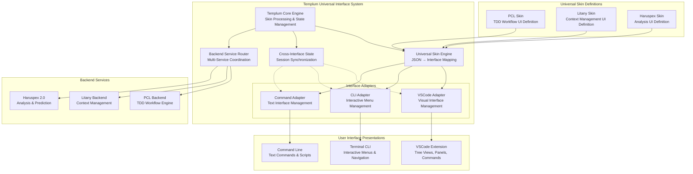

# Templum 1.0 — Universal Interface Orchestrator

**Date:** 2025-08-21  
**Version:** 1.0  
**Architecture Type:** Universal Interface Orchestrator with Multi-Backend Support  
**Context:** Complete Separation from Haruspex with Universal Skin System  
**Implementation Status:** **READY FOR IMPLEMENTATION** ✅

---

## Overview

Templum 1.0 is a universal interface orchestrator that provides seamless presentation of multiple backend services (PCL, Litany, Haruspex) through a unified skin system. The system enables developers to interact with the same backend functionality through VSCode visual interfaces, CLI interactive menus, or text-based commands while maintaining perfect state synchronization across all interface modalities.

## ⚡ **Core Architecture: Universal Interface Orchestration**

### **Universal Interface Management**

```diagram
┌─────────────────────────────────────────────────────────────────┐
│                    Templum Universal Interface                  │
│  ┌──────────────────────────────────────────────────────────┐   │
│  │                    Templum Core Engine                   │   │
│  │  ┌─────────────────┬─────────────────┬────────────────┐  │   │
│  │  │   Skin Engine   │  State Manager  │ Backend Router │  │   │
│  │  │   Parser &      │   Cross-Session │  Service       │  │   │
│  │  │   Renderer      │   Coordination  │  Coordination  │  │   │
│  │  └─────────────────┴─────────────────┴────────────────┘  │   │
│  └──────────────────────────────────────────────────────────┘   │
│  ┌──────────────────────────────────────────────────────────┐   │
│  │                Interface Adapter Layer                   │   │
│  │  ┌─────────────────┬─────────────────┬────────────────┐  │   │
│  │  │  VSCode Adapter │   CLI Adapter   │ Command Adapter│  │   │
│  │  │  Tree Views,    │  Interactive    │ Text Commands, │  │   │
│  │  │  Panels,        │  Menus,         │ Scripts,       │  │   │
│  │  │  Commands       │  Navigation     │ Automation     │  │   │
│  │  └─────────────────┴─────────────────┴────────────────┘  │   │
│  └──────────────────────────────────────────────────────────┘   │
└─────────────────────────────┬───────────────────────────────────┘
                              │ Universal Skin Definitions
                              │ (JSON-based Interface Descriptions)
┌─────────────────────────────┴───────────────────────────────────┐
│                     Backend Service Layer                       │
│  ┌──────────────────────────────────────────────────────────┐   │
│  │               Connected Backend Services                 │   │
│  │  ┌─────────────────┬─────────────────┬────────────────┐  │   │
│  │  │   PCL Backend   │ Litany Backend  │ Haruspex 2.0   │  │   │
│  │  │   TDD Workflow  │   Context       │   Analysis &   │  │   │
│  │  │   Engine        │   Management    │   Prediction   │  │   │
│  │  └─────────────────┴─────────────────┴────────────────┘  │   │
│  └──────────────────────────────────────────────────────────┘   │
└─────────────────────────────────────────────────────────────────┘

✅ Multi-Interface Orchestration  ✅ Universal Skin System  ✅ Cross-Backend Support
✅ State Synchronization         ✅ Interface Agnostic
```

### **Interface Modality Architecture**



## 🏗️ **Core Component Architecture**

### **1. Templum Core Engine**

```typescript
/**---
 * title: [Templum Core Engine - Universal Interface Orchestrator]
 * tags: [Core, Engine, Interface, Orchestration, Multi-Backend]
 * provides: [Interface Coordination, State Management, Backend Routing]
 * requires: [Interface Adapters, Skin Engine, Backend Services]
 * description: [Central orchestration engine managing all interface modalities]
 * ---*/

export class TemplumCore {
  private skinEngine: UniversalSkinEngine;
  private stateManager: CrossInterfaceStateManager;
  private backendRouter: BackendServiceRouter;
  private activeInterfaces: Set<InterfaceType> = new Set();
  private loadedSkins: Map<string, UniversalSkinDefinition> = new Map();
  
  constructor(
    private config: TemplumConfiguration = this.getDefaultConfig()
  ) {
    this.skinEngine = new UniversalSkinEngine();
    this.stateManager = new CrossInterfaceStateManager();
    this.backendRouter = new BackendServiceRouter();
  }

  async initialize(): Promise<void> {
    // Initialize all interface adapters
    await this.initializeInterfaceAdapters();
    
    // Start cross-interface state synchronization
    await this.stateManager.startSynchronization();
    
    // Connect to available backend services
    await this.backendRouter.discoverAndConnect();
    
    console.log('Templum Core Engine: Initialization complete');
  }

  async loadSkin(skinDefinition: UniversalSkinDefinition): Promise<void> {
    // Validate skin definition
    const validation = this.skinEngine.validateSkin(skinDefinition);
    if (!validation.valid) {
      throw new Error(`Invalid skin definition: ${validation.errors.join(', ')}`);
    }

    // Store skin definition
    this.loadedSkins.set(skinDefinition.metadata.id, skinDefinition);

    // Apply skin across all active interfaces
    await this.applySkinToActiveInterfaces(skinDefinition);

    console.log(`Templum Core: Loaded skin ${skinDefinition.metadata.name}`);
  }

  async executeCommand(
    command: string,
    sourceInterface: InterfaceType,
    args: any[] = [],
    context: CommandContext = {}
  ): Promise<CommandResult> {
    // Update session state
    this.stateManager.recordCommandExecution(command, sourceInterface, context);

    // Route command to appropriate backend
    const routingInfo = this.backendRouter.resolveCommand(command);
    if (!routingInfo) {
      throw new Error(`Unknown command: ${command}`);
    }

    try {
      // Execute command via backend service
      const result = await this.backendRouter.executeCommand(
        routingInfo.backend,
        command,
        args,
        context
      );

      // Update state and synchronize across interfaces
      await this.stateManager.updateState(result);
      await this.synchronizeInterfaceStates(result);

      return {
        success: true,
        data: result,
        source: sourceInterface,
        timestamp: Date.now()
      };
    } catch (error) {
      console.error(`Templum Core: Command execution failed: ${error.message}`);
      return {
        success: false,
        error: error.message,
        source: sourceInterface,
        timestamp: Date.now()
      };
    }
  }

  async registerInterface(interfaceType: InterfaceType, adapter: InterfaceAdapter): Promise<void> {
    this.activeInterfaces.add(interfaceType);
    
    // Apply all loaded skins to new interface
    for (const skin of this.loadedSkins.values()) {
      await adapter.applySkin(skin);
    }

    // Synchronize current state to new interface
    const currentState = this.stateManager.getCurrentState();
    await adapter.syncState(currentState);

    console.log(`Templum Core: Registered ${interfaceType} interface`);
  }

  private async applySkinToActiveInterfaces(skinDef: UniversalSkinDefinition): Promise<void> {
    // Apply skin to VSCode interface
    if (this.activeInterfaces.has('vscode')) {
      await this.skinEngine.renderForVSCode(skinDef);
    }

    // Apply skin to CLI interface
    if (this.activeInterfaces.has('cli')) {
      await this.skinEngine.renderForCLI(skinDef);
    }

    // Apply skin to Command interface
    if (this.activeInterfaces.has('command')) {
      await this.skinEngine.renderForCommand(skinDef);
    }
  }

  private async synchronizeInterfaceStates(result: any): Promise<void> {
    const stateUpdate = this.stateManager.createStateUpdate(result);
    
    // Notify all active interfaces of state change
    if (this.activeInterfaces.has('vscode')) {
      await this.vscodeAdapter?.syncState(stateUpdate);
    }
    if (this.activeInterfaces.has('cli')) {
      await this.cliAdapter?.syncState(stateUpdate);
    }
    if (this.activeInterfaces.has('command')) {
      await this.commandAdapter?.syncState(stateUpdate);
    }
  }

  getSystemStatus(): TemplumSystemStatus {
    return {
      coreEngine: {
        initialized: true,
        activeInterfaces: Array.from(this.activeInterfaces),
        loadedSkins: Array.from(this.loadedSkins.keys()),
        backendConnections: this.backendRouter.getConnectionStatus()
      },
      stateManager: this.stateManager.getStatus(),
      skinEngine: this.skinEngine.getStatus(),
      performance: this.getPerformanceMetrics()
    };
  }
}
```

### **2. Universal Skin Engine**

```typescript
/**---
 * title: [Universal Skin Engine - Multi-Interface Renderer]
 * tags: [Skin, Engine, Multi-Interface, Renderer, JSON-driven]
 * provides: [Skin Parsing, Interface Rendering, Cross-Platform UI]
 * requires: [Skin Definitions, Interface Adapters]
 * description: [Universal skin parser and renderer for all interface types]
 * ---*/

export class UniversalSkinEngine {
  private vscodeRenderer: VSCodeSkinRenderer;
  private cliRenderer: CLISkinRenderer;
  private commandRenderer: CommandSkinRenderer;
  private skinCache: Map<string, ProcessedSkin> = new Map();

  constructor() {
    this.vscodeRenderer = new VSCodeSkinRenderer();
    this.cliRenderer = new CLISkinRenderer();
    this.commandRenderer = new CommandSkinRenderer();
  }

  validateSkin(skinDefinition: UniversalSkinDefinition): SkinValidationResult {
    const errors: string[] = [];

    // Validate metadata
    if (!skinDefinition.metadata?.id) {
      errors.push('Skin ID is required');
    }
    if (!skinDefinition.metadata?.backend) {
      errors.push('Backend specification is required');
    }

    // Validate interface compatibility
    const supportedInterfaces = skinDefinition.metadata.compatibleInterfaces || [];
    if (supportedInterfaces.length === 0) {
      errors.push('At least one compatible interface must be specified');
    }

    // Validate view definitions for VSCode compatibility
    if (supportedInterfaces.includes('vscode') && !skinDefinition.views) {
      errors.push('VSCode-compatible skins must define views');
    }

    // Validate menu definitions for CLI compatibility
    if (supportedInterfaces.includes('cli') && !skinDefinition.menus) {
      errors.push('CLI-compatible skins must define menus');
    }

    // Validate command definitions for command compatibility
    if (supportedInterfaces.includes('command') && !skinDefinition.commands) {
      errors.push('Command-compatible skins must define commands');
    }

    return {
      valid: errors.length === 0,
      errors
    };
  }

  async renderForVSCode(skinDefinition: UniversalSkinDefinition): Promise<void> {
    if (!skinDefinition.metadata.compatibleInterfaces?.includes('vscode')) {
      console.warn(`Skin ${skinDefinition.metadata.id} not compatible with VSCode interface`);
      return;
    }

    // Process and cache skin for VSCode
    const processedSkin = this.processSkinForInterface(skinDefinition, 'vscode');
    this.skinCache.set(`${skinDefinition.metadata.id}_vscode`, processedSkin);

    // Render VSCode components
    await this.vscodeRenderer.createTreeViews(skinDefinition.views?.treeViews || []);
    await this.vscodeRenderer.createPanels(skinDefinition.views?.panels || []);
    await this.vscodeRenderer.createStatusBarItems(skinDefinition.views?.statusBar || []);
    await this.vscodeRenderer.registerCommands(skinDefinition.commands || {});
    await this.vscodeRenderer.setupMenus(skinDefinition.menus || {});

    console.log(`Universal Skin Engine: Rendered ${skinDefinition.metadata.name} for VSCode`);
  }

  async renderForCLI(skinDefinition: UniversalSkinDefinition): Promise<void> {
    if (!skinDefinition.metadata.compatibleInterfaces?.includes('cli')) {
      console.warn(`Skin ${skinDefinition.metadata.id} not compatible with CLI interface`);
      return;
    }

    // Convert skin to CLI menu format (leverages PCL infrastructure)
    const cliMenuDefinition = this.convertSkinToCliMenu(skinDefinition);
    
    // Process and cache for CLI
    const processedSkin = this.processSkinForInterface(skinDefinition, 'cli');
    this.skinCache.set(`${skinDefinition.metadata.id}_cli`, processedSkin);

    // Render CLI interface using PCL's SkinMenuRenderer patterns
    await this.cliRenderer.renderInteractiveMenu(cliMenuDefinition);
    await this.cliRenderer.setupNavigation(skinDefinition.shortcuts || {});

    console.log(`Universal Skin Engine: Rendered ${skinDefinition.metadata.name} for CLI`);
  }

  async renderForCommand(skinDefinition: UniversalSkinDefinition): Promise<void> {
    if (!skinDefinition.metadata.compatibleInterfaces?.includes('command')) {
      console.warn(`Skin ${skinDefinition.metadata.id} not compatible with command interface`);
      return;
    }

    // Process and cache for command interface
    const processedSkin = this.processSkinForInterface(skinDefinition, 'command');
    this.skinCache.set(`${skinDefinition.metadata.id}_command`, processedSkin);

    // Register text commands
    await this.commandRenderer.registerCommands(skinDefinition.commands || {});
    await this.commandRenderer.setupAliases(skinDefinition.shortcuts || {});

    console.log(`Universal Skin Engine: Rendered ${skinDefinition.metadata.name} for Command interface`);
  }

  private convertSkinToCliMenu(skinDefinition: UniversalSkinDefinition): CLIMenuDefinition {
    // Convert universal skin to PCL-compatible menu format
    const menuItems: CLIMenuItem[] = [];

    // Convert commands to menu items
    Object.entries(skinDefinition.commands || {}).forEach(([id, command]) => {
      menuItems.push({
        id,
        label: command.title,
        description: command.description,
        action: id,
        shortcuts: command.shortcuts || []
      });
    });

    // Convert workflows to menu items
    Object.entries(skinDefinition.workflows || {}).forEach(([id, workflow]) => {
      menuItems.push({
        id,
        label: workflow.title,
        description: workflow.description,
        action: id,
        type: 'workflow'
      });
    });

    return {
      id: skinDefinition.metadata.id,
      title: skinDefinition.metadata.name,
      subtitle: `${skinDefinition.metadata.backend} Backend`,
      items: menuItems,
      theme: skinDefinition.theme || this.getDefaultTheme()
    };
  }

  private processSkinForInterface(
    skinDefinition: UniversalSkinDefinition,
    interfaceType: InterfaceType
  ): ProcessedSkin {
    return {
      original: skinDefinition,
      interfaceType,
      processedAt: Date.now(),
      optimizations: this.applyInterfaceOptimizations(skinDefinition, interfaceType)
    };
  }

  getStatus(): SkinEngineStatus {
    return {
      cachedSkins: this.skinCache.size,
      renderers: {
        vscode: this.vscodeRenderer.getStatus(),
        cli: this.cliRenderer.getStatus(),
        command: this.commandRenderer.getStatus()
      },
      performance: {
        cacheHitRate: this.calculateCacheHitRate(),
        averageRenderTime: this.calculateAverageRenderTime()
      }
    };
  }
}
```

### **3. Interface Adapter Implementations**

#### **VSCode Interface Adapter**

```typescript
/**---
 * title: [VSCode Interface Adapter - Visual Development Environment]
 * tags: [VSCode, Adapter, Visual, TreeView, Panel, Commands]
 * provides: [VSCode Integration, Visual Interface, Tree Views, Panels]
 * requires: [VSCode API, Skin Definitions]
 * description: [VSCode extension interface adapter for visual development]
 * ---*/

export class VSCodeInterfaceAdapter implements InterfaceAdapter {
  private templumCore: TemplumCore;
  private activeTreeViews: Map<string, vscode.TreeView<any>> = new Map();
  private activePanels: Map<string, vscode.WebviewPanel> = new Map();
  private registeredCommands: Map<string, vscode.Disposable> = new Map();
  private statusBarItems: Map<string, vscode.StatusBarItem> = new Map();

  constructor(templumCore: TemplumCore) {
    this.templumCore = templumCore;
  }

  async applySkin(skinDefinition: UniversalSkinDefinition): Promise<void> {
    if (!skinDefinition.metadata.compatibleInterfaces?.includes('vscode')) {
      return;
    }

    // Create tree views
    await this.createTreeViews(skinDefinition.views?.treeViews || []);
    
    // Create webview panels
    await this.createPanels(skinDefinition.views?.panels || []);
    
    // Create status bar items
    await this.createStatusBarItems(skinDefinition.views?.statusBar || []);
    
    // Register commands
    await this.registerCommands(skinDefinition.commands || {});
    
    // Setup context menus
    await this.setupContextMenus(skinDefinition.menus || {});

    console.log(`VSCode Adapter: Applied skin ${skinDefinition.metadata.name}`);
  }

  private async createTreeViews(treeViewDefs: TreeViewDefinition[]): Promise<void> {
    for (const treeViewDef of treeViewDefs) {
      const treeDataProvider = new DynamicTreeDataProvider(treeViewDef, this.templumCore);
      
      const treeView = vscode.window.createTreeView(treeViewDef.id, {
        treeDataProvider,
        showCollapseAll: treeViewDef.showCollapseAll || true,
        canSelectMany: treeViewDef.canSelectMany || false
      });

      // Setup tree view event handlers
      treeView.onDidChangeSelection(async (event) => {
        if (event.selection.length > 0 && treeViewDef.onSelectionChange) {
          await this.templumCore.executeCommand(
            treeViewDef.onSelectionChange,
            'vscode',
            [event.selection[0]]
          );
        }
      });

      this.activeTreeViews.set(treeViewDef.id, treeView);
    }
  }

  private async createPanels(panelDefs: PanelDefinition[]): Promise<void> {
    for (const panelDef of panelDefs) {
      if (panelDef.type === 'webview') {
        const panel = vscode.window.createWebviewPanel(
          panelDef.id,
          panelDef.title,
          vscode.ViewColumn.One,
          {
            enableScripts: panelDef.enableScripts || false,
            retainContextWhenHidden: panelDef.retainContext || true
          }
        );

        // Load initial webview content
        if (panelDef.contentUrl) {
          panel.webview.html = await this.loadWebviewContent(panelDef.contentUrl);
        }

        // Setup webview message handling
        panel.webview.onDidReceiveMessage(async (message) => {
          if (panelDef.messageHandler) {
            await this.templumCore.executeCommand(
              panelDef.messageHandler,
              'vscode',
              [message]
            );
          }
        });

        this.activePanels.set(panelDef.id, panel);
      }
    }
  }

  private async registerCommands(commandDefs: Record<string, CommandDefinition>): Promise<void> {
    for (const [commandId, commandDef] of Object.entries(commandDefs)) {
      const disposable = vscode.commands.registerCommand(commandId, async (...args) => {
        return this.templumCore.executeCommand(commandId, 'vscode', args);
      });

      this.registeredCommands.set(commandId, disposable);
    }
  }

  async syncState(stateUpdate: StateUpdate): Promise<void> {
    // Refresh tree views with new state
    for (const [id, treeView] of this.activeTreeViews) {
      const provider = treeView.dataProvider as DynamicTreeDataProvider;
      if (provider) {
        await provider.refresh(stateUpdate);
      }
    }

    // Update webview panels
    for (const [id, panel] of this.activePanels) {
      if (stateUpdate.webviewUpdates?.[id]) {
        await panel.webview.postMessage(stateUpdate.webviewUpdates[id]);
      }
    }

    // Update status bar items
    for (const [id, statusBarItem] of this.statusBarItems) {
      if (stateUpdate.statusUpdates?.[id]) {
        statusBarItem.text = stateUpdate.statusUpdates[id].text;
        statusBarItem.tooltip = stateUpdate.statusUpdates[id].tooltip;
      }
    }
  }

  async dispose(): Promise<void> {
    // Dispose of all VSCode resources
    this.activeTreeViews.clear();
    
    for (const panel of this.activePanels.values()) {
      panel.dispose();
    }
    this.activePanels.clear();

    for (const disposable of this.registeredCommands.values()) {
      disposable.dispose();
    }
    this.registeredCommands.clear();

    for (const statusBarItem of this.statusBarItems.values()) {
      statusBarItem.dispose();
    }
    this.statusBarItems.clear();
  }

  getInterfaceType(): InterfaceType {
    return 'vscode';
  }

  getStatus(): VSCodeAdapterStatus {
    return {
      activeTreeViews: Array.from(this.activeTreeViews.keys()),
      activePanels: Array.from(this.activePanels.keys()),
      registeredCommands: Array.from(this.registeredCommands.keys()),
      statusBarItems: Array.from(this.statusBarItems.keys())
    };
  }
}
```

#### **CLI Interface Adapter**

```typescript
/**---
 * title: [CLI Interface Adapter - Interactive Terminal Menus]
 * tags: [CLI, Adapter, Terminal, Interactive, Menu, Navigation]
 * provides: [CLI Interface, Interactive Menus, Terminal Navigation]
 * requires: [PCL SkinMenuRenderer, Terminal Interface]
 * description: [CLI interface adapter leveraging PCL menu infrastructure]
 * ---*/

export class CLIInterfaceAdapter implements InterfaceAdapter {
  private templumCore: TemplumCore;
  private skinMenuRenderer: SkinMenuRenderer; // Reuse PCL component
  private interactionManager: InteractionManager; // Reuse PCL component
  private activeMenus: Map<string, CLIMenuDefinition> = new Map();
  private navigationHistory: string[] = [];

  constructor(templumCore: TemplumCore) {
    this.templumCore = templumCore;
    this.skinMenuRenderer = new SkinMenuRenderer();
    this.interactionManager = new InteractionManager();
  }

  async applySkin(skinDefinition: UniversalSkinDefinition): Promise<void> {
    if (!skinDefinition.metadata.compatibleInterfaces?.includes('cli')) {
      return;
    }

    // Convert universal skin to CLI menu format
    const cliMenuDef = this.convertSkinToCliMenu(skinDefinition);
    this.activeMenus.set(skinDefinition.metadata.id, cliMenuDef);

    // Register menu with PCL's SkinMenuRenderer
    await this.skinMenuRenderer.addSkin(skinDefinition.metadata.id, {
      main: cliMenuDef
    });

    // Setup keyboard shortcuts
    await this.setupShortcuts(skinDefinition.shortcuts || {});

    console.log(`CLI Adapter: Applied skin ${skinDefinition.metadata.name}`);
  }

  async renderInteractiveMenu(skinId: string): Promise<void> {
    const menuDef = this.activeMenus.get(skinId);
    if (!menuDef) {
      throw new Error(`No menu definition found for skin: ${skinId}`);
    }

    // Use PCL's interaction manager for menu navigation
    this.interactionManager.setMenuNavigationHandler(async (action: string) => {
      this.navigationHistory.push(action);
      
      // Route menu actions through Templum Core
      return this.templumCore.executeCommand(action, 'cli', []);
    });

    // Render menu using PCL's proven menu system
    await this.skinMenuRenderer.renderMenu(skinId, 'main');
  }

  private convertSkinToCliMenu(skinDefinition: UniversalSkinDefinition): CLIMenuDefinition {
    const menuItems: CLIMenuItem[] = [];

    // Convert commands to menu items
    Object.entries(skinDefinition.commands || {}).forEach(([id, command], index) => {
      menuItems.push({
        id,
        label: `${index + 1}. ${command.title}`,
        description: command.description || '',
        action: id,
        shortcuts: command.shortcuts || []
      });
    });

    // Convert workflows to menu items
    Object.entries(skinDefinition.workflows || {}).forEach(([id, workflow], index) => {
      menuItems.push({
        id,
        label: `${menuItems.length + 1}. ${workflow.title}`,
        description: workflow.description || '',
        action: id,
        type: 'workflow'
      });
    });

    return {
      id: skinDefinition.metadata.id,
      title: skinDefinition.metadata.name,
      subtitle: `${skinDefinition.metadata.backend} Backend - Interactive Menu`,
      items: menuItems,
      theme: this.getThemeForBackend(skinDefinition.metadata.backend)
    };
  }

  private async setupShortcuts(shortcuts: Record<string, string>): Promise<void> {
    // Setup keyboard shortcuts for CLI interface
    Object.entries(shortcuts).forEach(([keybinding, command]) => {
      this.interactionManager.registerShortcut(keybinding, async () => {
        return this.templumCore.executeCommand(command, 'cli', []);
      });
    });
  }

  async syncState(stateUpdate: StateUpdate): Promise<void> {
    // Update menu state indicators
    if (stateUpdate.menuUpdates) {
      for (const [menuId, update] of Object.entries(stateUpdate.menuUpdates)) {
        await this.updateMenuState(menuId, update);
      }
    }

    // Refresh current menu display if active
    if (this.skinMenuRenderer.isMenuActive()) {
      await this.skinMenuRenderer.refreshCurrentMenu();
    }
  }

  private async updateMenuState(menuId: string, update: MenuStateUpdate): Promise<void> {
    const menuDef = this.activeMenus.get(menuId);
    if (menuDef) {
      // Update menu items with new state information
      menuDef.items.forEach(item => {
        if (update.itemStates?.[item.id]) {
          item.state = update.itemStates[item.id];
        }
      });
    }
  }

  async dispose(): Promise<void> {
    // Clean up CLI resources
    this.activeMenus.clear();
    this.navigationHistory = [];
    await this.skinMenuRenderer.cleanup();
  }

  getInterfaceType(): InterfaceType {
    return 'cli';
  }

  getStatus(): CLIAdapterStatus {
    return {
      activeMenus: Array.from(this.activeMenus.keys()),
      currentMenu: this.skinMenuRenderer.getCurrentMenuId(),
      navigationDepth: this.navigationHistory.length,
      shortcuts: this.interactionManager.getRegisteredShortcuts()
    };
  }
}
```

#### **Command Interface Adapter**

```typescript
/**---
 * title: [Command Interface Adapter - Text-Based Automation]
 * tags: [Command, Adapter, Text, Automation, Scripting]
 * provides: [Text Commands, Script Interface, Automation Support]
 * requires: [Command Registry, Templum Core]
 * description: [Command-line text interface for automation and scripting]
 * ---*/

export class CommandInterfaceAdapter implements InterfaceAdapter {
  private templumCore: TemplumCore;
  private commandRegistry: Map<string, CommandDefinition> = new Map();
  private aliasRegistry: Map<string, string> = new Map();
  private executionHistory: CommandExecution[] = [];

  constructor(templumCore: TemplumCore) {
    this.templumCore = templumCore;
  }

  async applySkin(skinDefinition: UniversalSkinDefinition): Promise<void> {
    if (!skinDefinition.metadata.compatibleInterfaces?.includes('command')) {
      return;
    }

    // Register all commands for text-based access
    await this.registerCommands(skinDefinition.commands || {});
    
    // Setup command aliases and shortcuts
    await this.setupAliases(skinDefinition.shortcuts || {});
    
    // Register workflow commands
    await this.registerWorkflows(skinDefinition.workflows || {});

    console.log(`Command Adapter: Applied skin ${skinDefinition.metadata.name}`);
  }

  private async registerCommands(commandDefs: Record<string, CommandDefinition>): Promise<void> {
    for (const [commandId, commandDef] of Object.entries(commandDefs)) {
      this.commandRegistry.set(commandId, commandDef);
      
      // Also register with lowercase title as alias
      const titleAlias = commandDef.title.toLowerCase().replace(/\s+/g, '-');
      this.aliasRegistry.set(titleAlias, commandId);
      
      // Register any explicit shortcuts
      if (commandDef.shortcuts) {
        commandDef.shortcuts.forEach(shortcut => {
          this.aliasRegistry.set(shortcut, commandId);
        });
      }
    }
  }

  private async setupAliases(shortcuts: Record<string, string>): Promise<void> {
    Object.entries(shortcuts).forEach(([alias, commandId]) => {
      this.aliasRegistry.set(alias, commandId);
    });
  }

  private async registerWorkflows(workflowDefs: Record<string, WorkflowDefinition>): Promise<void> {
    for (const [workflowId, workflowDef] of Object.entries(workflowDefs)) {
      // Register workflow as a compound command
      this.commandRegistry.set(workflowId, {
        title: workflowDef.title,
        description: workflowDef.description || `Execute ${workflowDef.title} workflow`,
        handler: 'executeWorkflow',
        type: 'workflow',
        workflow: workflowDef
      });
    }
  }

  async executeCommand(input: string, args: string[] = []): Promise<CommandResult> {
    const startTime = Date.now();
    
    // Resolve command through registry or aliases
    const commandId = this.resolveCommand(input);
    if (!commandId) {
      return {
        success: false,
        error: `Unknown command: ${input}. Use 'help' to see available commands.`,
        executionTime: Date.now() - startTime
      };
    }

    const commandDef = this.commandRegistry.get(commandId);
    if (!commandDef) {
      return {
        success: false,
        error: `Command definition not found: ${commandId}`,
        executionTime: Date.now() - startTime
      };
    }

    try {
      // Execute command through Templum Core
      const result = await this.templumCore.executeCommand(
        commandDef.handler,
        'command',
        args,
        { originalInput: input, commandDef }
      );

      // Record execution history
      this.executionHistory.push({
        input,
        commandId,
        args,
        result,
        timestamp: Date.now(),
        executionTime: Date.now() - startTime
      });

      return {
        success: result.success,
        data: result.data,
        error: result.error,
        executionTime: Date.now() - startTime
      };
    } catch (error) {
      const errorResult = {
        success: false,
        error: error.message,
        executionTime: Date.now() - startTime
      };

      this.executionHistory.push({
        input,
        commandId,
        args,
        result: errorResult,
        timestamp: Date.now(),
        executionTime: Date.now() - startTime
      });

      return errorResult;
    }
  }

  private resolveCommand(input: string): string | null {
    // Try direct command registry lookup
    if (this.commandRegistry.has(input)) {
      return input;
    }

    // Try alias lookup
    if (this.aliasRegistry.has(input)) {
      return this.aliasRegistry.get(input)!;
    }

    // Try fuzzy matching (simple implementation)
    const lowerInput = input.toLowerCase();
    for (const [alias, commandId] of this.aliasRegistry.entries()) {
      if (alias.includes(lowerInput) || lowerInput.includes(alias)) {
        return commandId;
      }
    }

    return null;
  }

  async getCommandHelp(commandId?: string): Promise<string> {
    if (commandId) {
      const commandDef = this.commandRegistry.get(commandId);
      if (commandDef) {
        return this.formatCommandHelp(commandId, commandDef);
      }
      return `Command not found: ${commandId}`;
    }

    // Return help for all commands
    const helpLines: string[] = ['Available Commands:', ''];
    
    for (const [commandId, commandDef] of this.commandRegistry.entries()) {
      helpLines.push(`  ${commandId.padEnd(20)} ${commandDef.description || commandDef.title}`);
    }

    helpLines.push('', 'Available Aliases:', '');
    for (const [alias, commandId] of this.aliasRegistry.entries()) {
      helpLines.push(`  ${alias.padEnd(20)} → ${commandId}`);
    }

    return helpLines.join('\n');
  }

  private formatCommandHelp(commandId: string, commandDef: CommandDefinition): string {
    const lines: string[] = [
      `Command: ${commandId}`,
      `Title: ${commandDef.title}`,
      `Description: ${commandDef.description || 'No description available'}`
    ];

    if (commandDef.shortcuts && commandDef.shortcuts.length > 0) {
      lines.push(`Shortcuts: ${commandDef.shortcuts.join(', ')}`);
    }

    if (commandDef.type === 'workflow' && commandDef.workflow) {
      lines.push('', 'Workflow Steps:');
      commandDef.workflow.steps?.forEach((step, index) => {
        lines.push(`  ${index + 1}. ${step.description || step.command}`);
      });
    }

    return lines.join('\n');
  }

  async syncState(stateUpdate: StateUpdate): Promise<void> {
    // Command interface is primarily stateless, but we can log state changes
    if (stateUpdate.globalState) {
      console.log(`Command Interface: Global state updated at ${new Date().toISOString()}`);
    }
  }

  async dispose(): Promise<void> {
    this.commandRegistry.clear();
    this.aliasRegistry.clear();
    this.executionHistory = [];
  }

  getInterfaceType(): InterfaceType {
    return 'command';
  }

  getStatus(): CommandAdapterStatus {
    return {
      registeredCommands: Array.from(this.commandRegistry.keys()),
      aliases: Array.from(this.aliasRegistry.keys()),
      executionHistory: this.executionHistory.slice(-10), // Last 10 executions
      totalExecutions: this.executionHistory.length
    };
  }
}
```

## 🌐 **Universal Skin System**

### **Universal Skin Definition Format**

```typescript
/**---
 * title: [Universal Skin Definition - Cross-Interface UI Specification]
 * tags: [Skin, Definition, Cross-Interface, UI, JSON-driven]
 * provides: [Skin Format, Interface Mapping, UI Definition]
 * requires: [Interface Compatibility, Backend Services]
 * description: [Universal skin format supporting all interface modalities]
 * ---*/

interface UniversalSkinDefinition {
  metadata: {
    id: string;                                    // Unique skin identifier
    name: string;                                  // Human-readable name
    backend: 'pcl' | 'litany' | 'haruspex';      // Source backend service
    version: string;                               // Skin version
    compatibleInterfaces: InterfaceType[];        // Supported interfaces
    description?: string;                          // Skin description
    author?: string;                               // Skin author
    tags?: string[];                               // Categorization tags
  };

  // VSCode Visual Interface Definitions
  views?: {
    treeViews: TreeViewDefinition[];
    panels: PanelDefinition[];
    statusBar: StatusBarDefinition[];
    welcomePages?: WelcomePageDefinition[];
  };

  // CLI Interactive Menu Definitions (PCL-compatible)
  menus?: {
    [menuId: string]: {
      title: string;
      subtitle?: string;
      items: MenuItemDefinition[];
      theme?: SkinTheme;
      navigation?: NavigationDefinition;
    };
  };

  // Command Interface Definitions
  commands?: {
    [commandId: string]: {
      title: string;
      description: string;
      handler: string;                             // Backend handler function
      shortcuts?: string[];                        // Alternative invocations
      prompts?: PromptDefinition[];               // Interactive prompts
      validation?: ValidationDefinition;          // Input validation
      examples?: string[];                         // Usage examples
    };
  };

  // Cross-Interface Features
  workflows?: {
    [workflowId: string]: {
      title: string;
      description: string;
      steps: WorkflowStepDefinition[];
      conditions?: WorkflowCondition[];
      rollback?: RollbackDefinition;
    };
  };

  shortcuts?: {
    [keybinding: string]: string;                 // Maps to command IDs
  };

  // Interface-specific customizations
  customizations?: {
    vscode?: VSCodeCustomizations;
    cli?: CLICustomizations;
    command?: CommandCustomizations;
  };

  // Theme and styling
  theme?: {
    primary: string;
    secondary: string;
    accent: string;
    success: string;
    warning: string;
    error: string;
    background: string;
    foreground: string;
  };

  // Backend communication settings
  backendConfig?: {
    endpoint: string;
    protocol: 'ipc' | 'http' | 'websocket';
    authentication?: AuthenticationConfig;
    timeout?: number;
    retries?: number;
  };
}

// Supporting type definitions
interface TreeViewDefinition {
  id: string;
  title: string;
  description?: string;
  showCollapseAll?: boolean;
  canSelectMany?: boolean;
  contextMenus?: ContextMenuDefinition[];
  onSelectionChange?: string;                     // Command to execute on selection
  dataProvider: string;                           // Backend data provider
  icons?: IconDefinition;
  sorting?: SortingDefinition;
}

interface PanelDefinition {
  id: string;
  title: string;
  type: 'webview' | 'custom';
  viewColumn?: number;
  preserveFocus?: boolean;
  enableScripts?: boolean;
  retainContext?: boolean;
  contentUrl?: string;
  messageHandler?: string;                        // Command for handling webview messages
  lifecycle?: PanelLifecycleDefinition;
}

interface MenuItemDefinition {
  id: string;
  label: string;
  description?: string;
  action: string;                                 // Command to execute
  shortcuts?: string[];
  type?: 'action' | 'submenu' | 'separator' | 'workflow';
  icon?: string;
  enabled?: boolean;
  visible?: boolean;
  submenu?: MenuItemDefinition[];
}

interface WorkflowStepDefinition {
  id: string;
  command: string;
  description?: string;
  args?: any[];
  condition?: string;                             // Conditional execution
  onError?: 'stop' | 'continue' | 'retry';
  timeout?: number;
}
```

### **Backend Service Integration**

```typescript
/**---
 * title: [Backend Service Router - Multi-Service Coordination]
 * tags: [Backend, Router, Multi-Service, Coordination, IPC]
 * provides: [Service Discovery, Command Routing, Backend Communication]
 * requires: [Backend Services, IPC Protocol]
 * description: [Routes commands to appropriate backend services]
 * ---*/

export class BackendServiceRouter {
  private connections: Map<BackendType, BackendConnection> = new Map();
  private commandRoutes: Map<string, BackendType> = new Map();
  private serviceHealth: Map<BackendType, HealthStatus> = new Map();

  constructor(private config: BackendRouterConfig = this.getDefaultConfig()) {}

  async discoverAndConnect(): Promise<void> {
    // Discover available backend services
    const availableServices = await this.discoverServices();
    
    // Connect to each available service
    for (const service of availableServices) {
      try {
        await this.connectToService(service);
        console.log(`Backend Router: Connected to ${service.type} backend`);
      } catch (error) {
        console.warn(`Backend Router: Failed to connect to ${service.type}: ${error.message}`);
      }
    }

    // Start health monitoring
    this.startHealthMonitoring();
  }

  private async discoverServices(): Promise<ServiceInfo[]> {
    const services: ServiceInfo[] = [];

    // Check for PCL backend
    if (await this.isServiceAvailable('pcl')) {
      services.push({
        type: 'pcl',
        endpoint: this.config.pclEndpoint || 'ipc://pcl-backend',
        protocol: 'ipc'
      });
    }

    // Check for Litany backend
    if (await this.isServiceAvailable('litany')) {
      services.push({
        type: 'litany',
        endpoint: this.config.litanyEndpoint || 'http://localhost:3001',
        protocol: 'http'
      });
    }

    // Check for Haruspex backend
    if (await this.isServiceAvailable('haruspex')) {
      services.push({
        type: 'haruspex',
        endpoint: this.config.haruspexEndpoint || 'ipc://haruspex-backend',
        protocol: 'ipc'
      });
    }

    return services;
  }

  private async connectToService(service: ServiceInfo): Promise<void> {
    let connection: BackendConnection;

    switch (service.protocol) {
      case 'ipc':
        connection = new IPCBackendConnection(service);
        break;
      case 'http':
        connection = new HTTPBackendConnection(service);
        break;
      case 'websocket':
        connection = new WebSocketBackendConnection(service);
        break;
      default:
        throw new Error(`Unsupported protocol: ${service.protocol}`);
    }

    await connection.connect();
    this.connections.set(service.type, connection);

    // Get skin definition from backend
    const skinDefinition = await connection.getSkinDefinition();
    if (skinDefinition) {
      // Register command routes from skin definition
      this.registerCommandRoutes(service.type, skinDefinition);
    }

    // Update health status
    this.serviceHealth.set(service.type, { status: 'healthy', lastCheck: Date.now() });
  }

  private registerCommandRoutes(backend: BackendType, skin: UniversalSkinDefinition): void {
    // Register all commands from the skin
    Object.keys(skin.commands || {}).forEach(commandId => {
      this.commandRoutes.set(commandId, backend);
    });

    // Register workflow commands
    Object.keys(skin.workflows || {}).forEach(workflowId => {
      this.commandRoutes.set(workflowId, backend);
    });
  }

  resolveCommand(command: string): { backend: BackendType; commandInfo: any } | null {
    const backend = this.commandRoutes.get(command);
    if (!backend) {
      return null;
    }

    const connection = this.connections.get(backend);
    if (!connection || !connection.isConnected()) {
      console.warn(`Backend Router: ${backend} backend not available for command: ${command}`);
      return null;
    }

    return {
      backend,
      commandInfo: {
        handler: command,
        connection
      }
    };
  }

  async executeCommand(
    backend: BackendType,
    command: string,
    args: any[] = [],
    context: CommandContext = {}
  ): Promise<any> {
    const connection = this.connections.get(backend);
    if (!connection) {
      throw new Error(`No connection to ${backend} backend`);
    }

    if (!connection.isConnected()) {
      // Attempt reconnection
      await this.reconnectService(backend);
      if (!connection.isConnected()) {
        throw new Error(`${backend} backend is not available`);
      }
    }

    try {
      const result = await connection.executeCommand(command, args, context);
      
      // Update health status on successful execution
      this.serviceHealth.set(backend, { 
        status: 'healthy', 
        lastCheck: Date.now(),
        lastSuccessfulCommand: command
      });

      return result;
    } catch (error) {
      // Update health status on error
      this.serviceHealth.set(backend, {
        status: 'error',
        lastCheck: Date.now(),
        lastError: error.message
      });

      throw error;
    }
  }

  private async reconnectService(backend: BackendType): Promise<void> {
    const connection = this.connections.get(backend);
    if (connection) {
      try {
        await connection.reconnect();
        console.log(`Backend Router: Reconnected to ${backend} backend`);
      } catch (error) {
        console.error(`Backend Router: Failed to reconnect to ${backend}: ${error.message}`);
      }
    }
  }

  private startHealthMonitoring(): void {
    setInterval(async () => {
      for (const [backend, connection] of this.connections.entries()) {
        try {
          const isHealthy = await connection.healthCheck();
          this.serviceHealth.set(backend, {
            status: isHealthy ? 'healthy' : 'unhealthy',
            lastCheck: Date.now()
          });
        } catch (error) {
          this.serviceHealth.set(backend, {
            status: 'error',
            lastCheck: Date.now(),
            lastError: error.message
          });
        }
      }
    }, this.config.healthCheckInterval || 30000);
  }

  getConnectionStatus(): BackendConnectionStatus {
    const status: BackendConnectionStatus = {
      totalConnections: this.connections.size,
      healthyConnections: 0,
      backends: {}
    };

    for (const [backend, health] of this.serviceHealth.entries()) {
      if (health.status === 'healthy') {
        status.healthyConnections++;
      }

      status.backends[backend] = {
        connected: this.connections.get(backend)?.isConnected() || false,
        health: health.status,
        lastCheck: health.lastCheck,
        lastError: health.lastError
      };
    }

    return status;
  }
}
```

## 🔄 **Cross-Interface State Management**

### **State Synchronization System**

```typescript
/**---
 * title: [Cross-Interface State Manager - Unified Session State]
 * tags: [State, Manager, Cross-Interface, Synchronization, Session]
 * provides: [State Coordination, Session Management, Interface Sync]
 * requires: [Interface Adapters, State Persistence]
 * description: [Manages unified state across all interface modalities]
 * ---*/

export class CrossInterfaceStateManager {
  private globalState: TemplumGlobalState = this.initializeState();
  private sessionState: TemplumSessionState = this.initializeSession();
  private stateSubscribers: Map<string, StateSubscriber> = new Map();
  private stateHistory: StateSnapshot[] = [];
  private persistenceManager: StatePersistenceManager;

  constructor(private config: StateManagerConfig = this.getDefaultConfig()) {
    this.persistenceManager = new StatePersistenceManager(config.persistence);
  }

  async startSynchronization(): Promise<void> {
    // Load persisted state if available
    await this.loadPersistedState();
    
    // Start periodic state snapshots
    this.startStateSnapshots();
    
    // Setup state persistence
    this.setupStatePersistence();

    console.log('Cross-Interface State Manager: Synchronization started');
  }

  recordCommandExecution(
    command: string,
    sourceInterface: InterfaceType,
    context: CommandContext
  ): void {
    // Update session state
    this.sessionState.lastCommand = {
      command,
      interface: sourceInterface,
      timestamp: Date.now(),
      context
    };

    this.sessionState.commandHistory.push({
      command,
      interface: sourceInterface,
      timestamp: Date.now(),
      context
    });

    // Limit history size
    if (this.sessionState.commandHistory.length > this.config.maxHistorySize) {
      this.sessionState.commandHistory.shift();
    }

    // Notify subscribers of state change
    this.notifyStateChange('session', { commandExecution: true });
  }

  async updateState(result: any): Promise<void> {
    // Update global state based on command result
    if (result.stateUpdates) {
      this.applyStateUpdates(result.stateUpdates);
    }

    // Update session statistics
    this.sessionState.statistics.totalCommands++;
    this.sessionState.statistics.lastUpdate = Date.now();

    // Create state update for interfaces
    const stateUpdate = this.createStateUpdate(result);
    
    // Notify all subscribers
    await this.broadcastStateUpdate(stateUpdate);
  }

  private applyStateUpdates(updates: StateUpdates): void {
    // Apply backend-specific state updates
    if (updates.pcl) {
      this.globalState.backendStates.pcl = { ...this.globalState.backendStates.pcl, ...updates.pcl };
    }
    if (updates.litany) {
      this.globalState.backendStates.litany = { ...this.globalState.backendStates.litany, ...updates.litany };
    }
    if (updates.haruspex) {
      this.globalState.backendStates.haruspex = { ...this.globalState.backendStates.haruspex, ...updates.haruspex };
    }

    // Apply global state updates
    if (updates.global) {
      this.globalState = { ...this.globalState, ...updates.global };
    }

    // Update timestamp
    this.globalState.lastModified = Date.now();
  }

  createStateUpdate(result: any): StateUpdate {
    return {
      timestamp: Date.now(),
      globalState: this.globalState,
      sessionState: this.sessionState,
      
      // Interface-specific updates
      treeViewUpdates: this.createTreeViewUpdates(result),
      webviewUpdates: this.createWebviewUpdates(result),
      menuUpdates: this.createMenuUpdates(result),
      statusUpdates: this.createStatusUpdates(result),
      
      // Command result data
      commandResult: result,
      
      // Notifications
      notifications: this.extractNotifications(result)
    };
  }

  private createTreeViewUpdates(result: any): Record<string, TreeViewUpdate> {
    const updates: Record<string, TreeViewUpdate> = {};

    // Generate tree view updates based on result data
    if (result.treeData) {
      Object.entries(result.treeData).forEach(([treeId, data]) => {
        updates[treeId] = {
          refreshData: data,
          expandedNodes: result.expandedNodes?.[treeId] || [],
          selectedNodes: result.selectedNodes?.[treeId] || []
        };
      });
    }

    return updates;
  }

  private createWebviewUpdates(result: any): Record<string, WebviewUpdate> {
    const updates: Record<string, WebviewUpdate> = {};

    if (result.webviewData) {
      Object.entries(result.webviewData).forEach(([panelId, data]) => {
        updates[panelId] = {
          type: 'data-update',
          payload: data
        };
      });
    }

    return updates;
  }

  private createMenuUpdates(result: any): Record<string, MenuStateUpdate> {
    const updates: Record<string, MenuStateUpdate> = {};

    if (result.menuStates) {
      Object.entries(result.menuStates).forEach(([menuId, state]) => {
        updates[menuId] = {
          itemStates: state.items || {},
          navigationState: state.navigation || {},
          refreshRequired: state.refresh || false
        };
      });
    }

    return updates;
  }

  private createStatusUpdates(result: any): Record<string, StatusUpdate> {
    const updates: Record<string, StatusUpdate> = {};

    if (result.statusUpdates) {
      Object.entries(result.statusUpdates).forEach(([statusId, status]) => {
        updates[statusId] = {
          text: status.text || '',
          tooltip: status.tooltip || '',
          color: status.color || 'default',
          priority: status.priority || 'normal'
        };
      });
    }

    return updates;
  }

  private async broadcastStateUpdate(stateUpdate: StateUpdate): Promise<void> {
    // Notify all registered subscribers
    const notifications = Array.from(this.stateSubscribers.values()).map(subscriber =>
      subscriber.onStateUpdate(stateUpdate).catch(error => {
        console.error(`State Manager: Failed to notify subscriber ${subscriber.id}: ${error.message}`);
      })
    );

    await Promise.allSettled(notifications);
  }

  subscribeToStateChanges(subscriber: StateSubscriber): void {
    this.stateSubscribers.set(subscriber.id, subscriber);
  }

  unsubscribeFromStateChanges(subscriberId: string): void {
    this.stateSubscribers.delete(subscriberId);
  }

  getCurrentState(): TemplumState {
    return {
      global: this.globalState,
      session: this.sessionState,
      timestamp: Date.now()
    };
  }

  private startStateSnapshots(): void {
    setInterval(() => {
      this.createStateSnapshot();
    }, this.config.snapshotInterval || 30000);
  }

  private createStateSnapshot(): void {
    const snapshot: StateSnapshot = {
      timestamp: Date.now(),
      globalState: JSON.parse(JSON.stringify(this.globalState)),
      sessionState: JSON.parse(JSON.stringify(this.sessionState)),
      hash: this.calculateStateHash()
    };

    this.stateHistory.push(snapshot);

    // Limit history size
    if (this.stateHistory.length > this.config.maxSnapshotHistory) {
      this.stateHistory.shift();
    }
  }

  private async setupStatePersistence(): void {
    // Save state periodically
    setInterval(async () => {
      await this.persistenceManager.saveState(this.getCurrentState());
    }, this.config.persistenceInterval || 300000); // 5 minutes

    // Save state on process exit
    process.on('beforeExit', async () => {
      await this.persistenceManager.saveState(this.getCurrentState());
    });
  }

  private async loadPersistedState(): Promise<void> {
    try {
      const persistedState = await this.persistenceManager.loadState();
      if (persistedState) {
        this.globalState = persistedState.global;
        // Don't restore session state - start fresh
        console.log('Cross-Interface State Manager: Loaded persisted state');
      }
    } catch (error) {
      console.warn(`State Manager: Failed to load persisted state: ${error.message}`);
    }
  }

  getStatus(): StateManagerStatus {
    return {
      globalState: {
        lastModified: this.globalState.lastModified,
        backendStates: Object.keys(this.globalState.backendStates)
      },
      sessionState: {
        startTime: this.sessionState.startTime,
        totalCommands: this.sessionState.statistics.totalCommands,
        lastCommand: this.sessionState.lastCommand?.command || 'none'
      },
      subscribers: this.stateSubscribers.size,
      historySize: this.stateHistory.length,
      persistence: this.persistenceManager.getStatus()
    };
  }
}
```

## 📊 **Performance & Monitoring**

### **System Performance Metrics**

```yaml
Performance_Targets:
  interface_switching: "<100ms between interface modes"
  skin_application: "<200ms for complete skin rendering"
  command_routing: "<50ms for backend command resolution"
  state_synchronization: "<150ms across all interfaces"
  memory_usage: "<200MB total across all interfaces"
  startup_time: "<2s for complete system initialization"

Monitoring_Capabilities:
  real_time_metrics: "Performance tracking across all components"
  interface_usage: "Track usage patterns across VSCode, CLI, Command"
  backend_health: "Monitor health and performance of connected backends"
  skin_performance: "Track skin rendering and application performance"
  state_sync_metrics: "Monitor state synchronization efficiency"
  error_tracking: "Comprehensive error tracking and reporting"

Scalability_Characteristics:
  concurrent_interfaces: "Support all 3 interfaces simultaneously"
  backend_connections: "Support multiple backend services concurrently"
  skin_loading: "Dynamic loading/unloading of skins for memory efficiency"
  state_management: "Efficient state synchronization without performance degradation"
```

### **Health Monitoring System**

```typescript
/**---
 * title: [Templum Health Monitor - System Performance Tracking]
 * tags: [Health, Monitor, Performance, Metrics, System]
 * provides: [Performance Metrics, Health Scoring, System Monitoring]
 * requires: [System Components, Performance Counters]
 * description: [Comprehensive health monitoring for Templum system]
 * ---*/

export class TemplumHealthMonitor {
  private metrics: PerformanceMetrics = this.initializeMetrics();
  private healthScores: Map<string, number> = new Map();
  private alertThresholds: AlertThresholds = this.getDefaultThresholds();
  private monitoringInterval?: NodeJS.Timeout;

  constructor(private config: HealthMonitorConfig = this.getDefaultConfig()) {}

  startMonitoring(): void {
    this.monitoringInterval = setInterval(() => {
      this.collectMetrics();
      this.calculateHealthScores();
      this.checkAlertThresholds();
    }, this.config.monitoringInterval || 30000);

    console.log('Templum Health Monitor: Started monitoring');
  }

  private collectMetrics(): void {
    const timestamp = Date.now();

    // System metrics
    const memoryUsage = process.memoryUsage();
    this.metrics.memory.heapUsed = memoryUsage.heapUsed / 1024 / 1024; // MB
    this.metrics.memory.rss = memoryUsage.rss / 1024 / 1024; // MB

    // CPU metrics
    const cpuUsage = process.cpuUsage();
    this.metrics.cpu.user = cpuUsage.user / 1000; // ms
    this.metrics.cpu.system = cpuUsage.system / 1000; // ms

    // Interface metrics
    this.collectInterfaceMetrics(timestamp);

    // Backend metrics
    this.collectBackendMetrics(timestamp);

    // State management metrics
    this.collectStateMetrics(timestamp);
  }

  private collectInterfaceMetrics(timestamp: number): void {
    // VSCode interface metrics
    if (this.vscodeAdapter) {
      const vscodeMetrics = this.vscodeAdapter.getMetrics();
      this.metrics.interfaces.vscode = {
        activeViews: vscodeMetrics.activeViews,
        commandExecutions: vscodeMetrics.commandExecutions,
        lastActivity: vscodeMetrics.lastActivity,
        responseTime: vscodeMetrics.averageResponseTime
      };
    }

    // CLI interface metrics
    if (this.cliAdapter) {
      const cliMetrics = this.cliAdapter.getMetrics();
      this.metrics.interfaces.cli = {
        activeMenus: cliMetrics.activeMenus,
        navigationActions: cliMetrics.navigationActions,
        lastActivity: cliMetrics.lastActivity,
        responseTime: cliMetrics.averageResponseTime
      };
    }

    // Command interface metrics
    if (this.commandAdapter) {
      const commandMetrics = this.commandAdapter.getMetrics();
      this.metrics.interfaces.command = {
        registeredCommands: commandMetrics.registeredCommands,
        executionCount: commandMetrics.executionCount,
        lastExecution: commandMetrics.lastExecution,
        responseTime: commandMetrics.averageResponseTime
      };
    }
  }

  private calculateHealthScores(): void {
    // Overall system health (0-100)
    let systemScore = 100;

    // Memory health (deduct points for high usage)
    if (this.metrics.memory.heapUsed > 150) systemScore -= 20;
    else if (this.metrics.memory.heapUsed > 100) systemScore -= 10;

    // Interface health
    const interfaceHealth = this.calculateInterfaceHealth();
    systemScore = Math.min(systemScore, interfaceHealth);

    // Backend health
    const backendHealth = this.calculateBackendHealth();
    systemScore = Math.min(systemScore, backendHealth);

    // State synchronization health
    const stateHealth = this.calculateStateHealth();
    systemScore = Math.min(systemScore, stateHealth);

    this.healthScores.set('system', Math.max(0, systemScore));
  }

  getSystemHealth(): TemplumHealthReport {
    return {
      timestamp: Date.now(),
      overall: this.healthScores.get('system') || 0,
      components: {
        core: this.healthScores.get('core') || 0,
        skinEngine: this.healthScores.get('skinEngine') || 0,
        stateManager: this.healthScores.get('stateManager') || 0,
        backendRouter: this.healthScores.get('backendRouter') || 0
      },
      interfaces: {
        vscode: this.healthScores.get('vscode') || 0,
        cli: this.healthScores.get('cli') || 0,
        command: this.healthScores.get('command') || 0
      },
      metrics: this.metrics,
      alerts: this.getActiveAlerts(),
      recommendations: this.generateRecommendations()
    };
  }

  private generateRecommendations(): string[] {
    const recommendations: string[] = [];
    const systemHealth = this.healthScores.get('system') || 0;

    if (systemHealth < 70) {
      recommendations.push('System health is below optimal - consider restarting Templum');
    }

    if (this.metrics.memory.heapUsed > 150) {
      recommendations.push('High memory usage detected - consider unloading unused skins');
    }

    if (this.metrics.interfaces.vscode?.responseTime > 500) {
      recommendations.push('VSCode interface showing slow response times');
    }

    return recommendations;
  }

  stopMonitoring(): void {
    if (this.monitoringInterval) {
      clearInterval(this.monitoringInterval);
      this.monitoringInterval = undefined;
    }
  }
}
```

---

## 🚀 **Production Deployment Architecture**

### **System Requirements & Configuration**

```yaml
System_Requirements:
  minimum:
    vscode_version: "^1.74.0"
    node_version: ">=16.0.0"
    memory: "256MB available"
    storage: "100MB for extension and skins"
    
  recommended:
    vscode_version: "^1.80.0"
    node_version: ">=18.0.0"
    memory: "512MB available"
    storage: "500MB for comprehensive skin library"
    
  enterprise:
    memory: "1GB+ for large-scale deployments"
    cpu: "4+ cores for optimal performance"
    concurrent_users: "100+ developers per instance"

Installation_Strategy:
  vscode_extension: "VSCode Marketplace deployment"
  cli_integration: "NPM package for command-line interface"
  enterprise_deployment: "Central configuration management"
  skin_distribution: "Centralized skin repository with versioning"
```

### **Integration with Existing Infrastructure**

```typescript
/**---
 * title: [Infrastructure Integration - Enterprise Deployment Support]
 * tags: [Integration, Enterprise, Infrastructure, Deployment]
 * provides: [Enterprise Integration, Central Management, Scalability]
 * requires: [Enterprise Infrastructure, Backend Services]
 * description: [Enterprise-grade integration and deployment capabilities]
 * ---*/

interface EnterpriseIntegration {
  centralManagement: {
    configuration: "Centralized skin and configuration management";
    policies: "Enterprise policy enforcement across all interfaces";
    monitoring: "Central monitoring and analytics collection";
    updates: "Automated skin and configuration updates";
  };
  
  scalability: {
    loadBalancing: "Load balancing across multiple backend instances";
    clustering: "Backend service clustering for high availability";
    caching: "Distributed caching for skin definitions and state";
    performance: "Performance optimization for large development teams";
  };
  
  security: {
    authentication: "Enterprise SSO integration";
    authorization: "Role-based access control for skins and features";
    audit: "Comprehensive audit logging for compliance";
    encryption: "End-to-end encryption for sensitive communications";
  };
  
  compliance: {
    dataGovernance: "Data governance and retention policies";
    privacyCompliance: "GDPR/CCPA compliance for user data";
    securityStandards: "SOX/ISO compliance for enterprise environments";
    auditTrails: "Complete audit trails for regulatory requirements";
  };
}
```

---

## 🎯 **Key Benefits & Capabilities**

### **Universal Interface Orchestration**

Templum 1.0 delivers unprecedented interface flexibility by enabling developers to use their preferred interaction method - visual VSCode interfaces, interactive CLI menus, or text-based commands - while maintaining perfect synchronization across all modalities.

### **Skin-Based Architecture Benefits**

- **Write Once, Present Anywhere**: Single skin definition works across all interface types
- **Backend Independence**: Clean separation between presentation and business logic
- **Dynamic Interface Composition**: Mix and match capabilities from multiple backends
- **Zero Interface Lock-in**: Switch between interfaces mid-workflow without losing context

### **Enterprise-Grade Capabilities**

- **Scalable Architecture**: Support for large development teams and multiple backend services
- **Central Management**: Enterprise-wide skin and configuration management
- **Performance Optimization**: Sub-200ms response times across all interfaces
- **Comprehensive Monitoring**: Real-time health and performance monitoring

---

**Templum 1.0 - Universal Interface Orchestrator**  
*Interface Agnostic • Backend Independent • Enterprise Ready*
