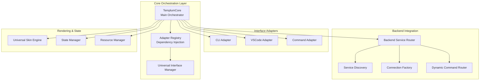
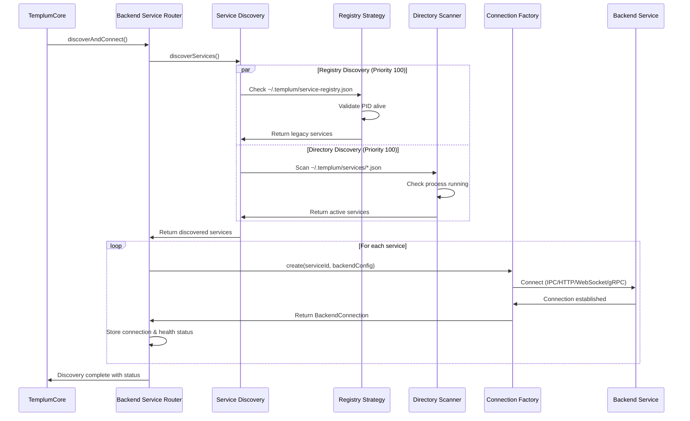
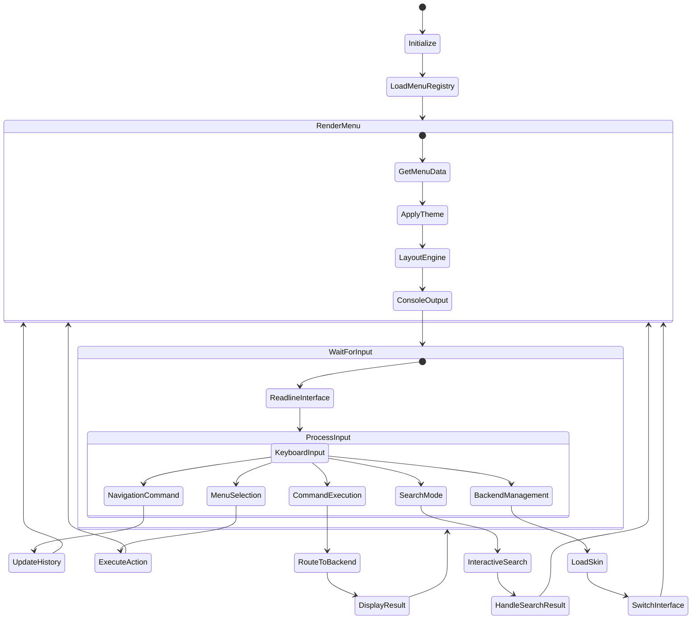
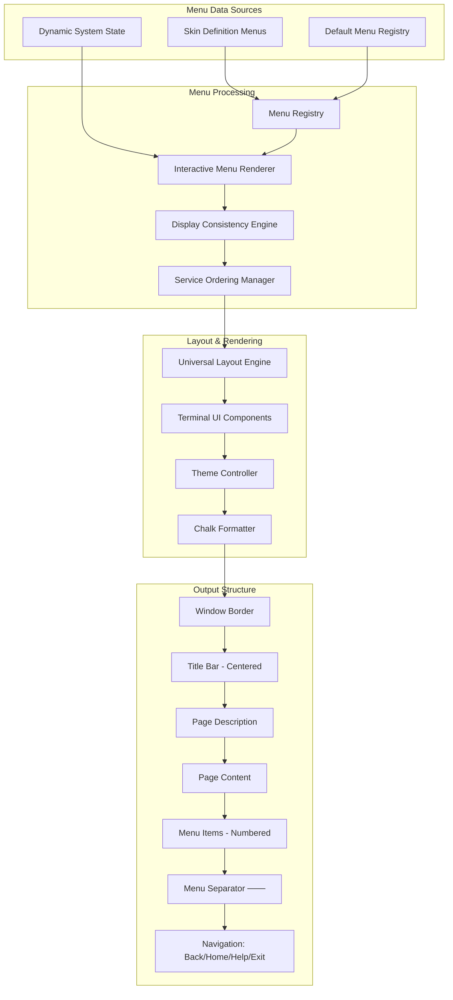
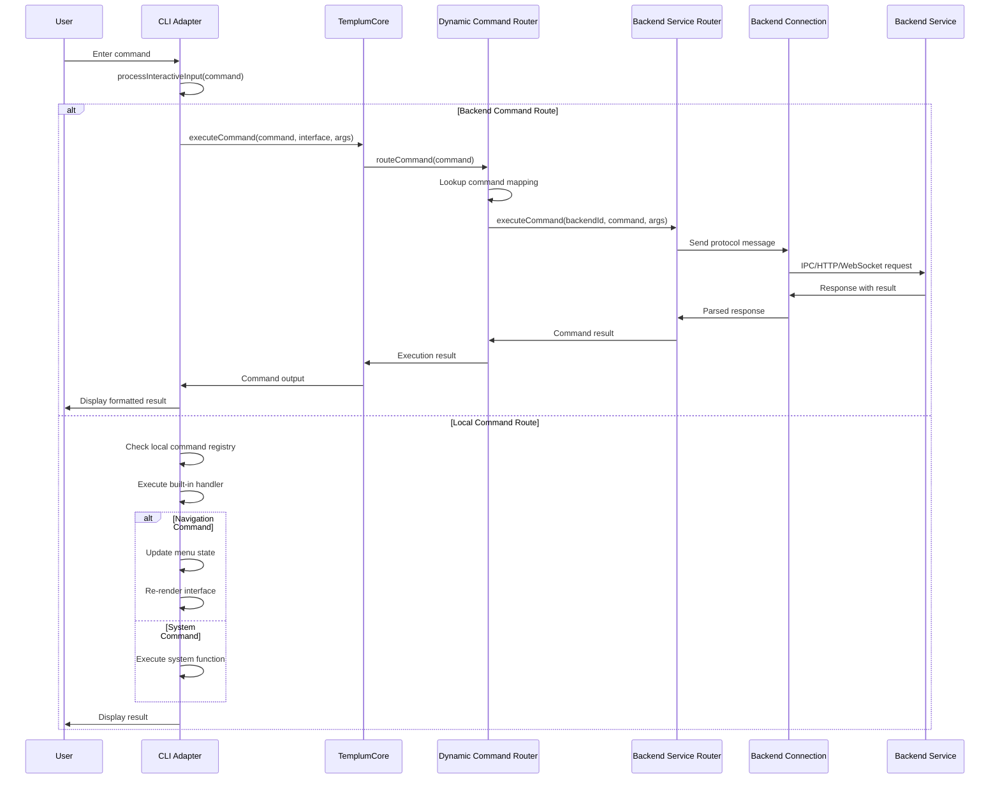
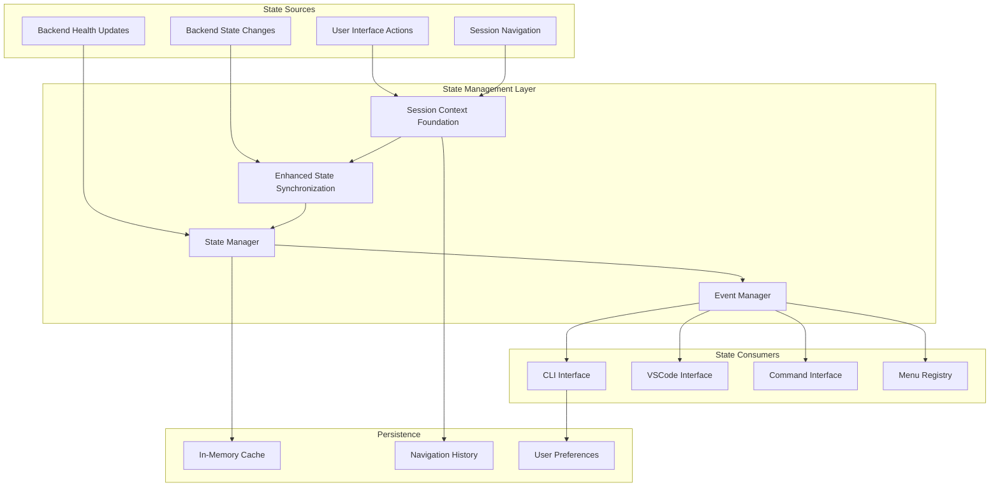

# Templum Current Architecture - Data Flow Analysis

This document provides a comprehensive analysis of the current Templum data architecture and flow, showing how data moves through the system from backend discovery to user interface rendering. This analysis enables understanding where changes need to be made for the CLI 2.1 design implementation.

## 1. System Overview & Core Orchestration

### System Architecture Diagram



### Data Flow Description

The **TemplumCore** serves as the central orchestrator, initialized with dependency injection through the **Adapter Registry**. It coordinates all interface adapters (CLI, VSCode, Command), manages backend connections through the **Backend Service Router**, and maintains global state.

**Key Components:**

- **TemplumCore**: Main event-driven orchestrator managing system lifecycle
- **Adapter Registry**: Provides dependency injection for loose coupling between components
- **Universal Interface Manager**: Handles switching between interface modalities while maintaining state
- **Interface Adapters**: Provide interface-specific rendering and interaction handling
- **Backend Service Router**: Manages all backend service connections and health monitoring
- **Universal Skin Engine**: Processes and renders skin definitions from backends

**Data Flow Pattern:** The core uses an event-driven architecture where components communicate through EventEmitter patterns, ensuring loose coupling and reactive state management.

## 2. Backend Service Discovery & Connection Flow

### Discovery Sequence Diagram



### Discovery Flow Description

Service discovery uses a **multi-strategy approach** with priority-based execution:

1. **Registry-based discovery** (priority 100):
   - Checks legacy single registry file `~/.templum/service-registry.json`
   - Scans services directory `~/.templum/services/*.json` for auto-registration
   - Validates process IDs are still running
   - Auto-cleans stale service entries

2. **Configuration-based discovery** (priority 75):
   - Reads from user-defined configuration files
   - Supports manual backend definitions with authentication

3. **Endpoint scanning** (priority 50):
   - Scans configured ports for `/api/skin` endpoints
   - Tests multiple protocols (HTTP, WebSocket, IPC)
   - Lower confidence but enables discovery of undocumented services

**File System Watching:** The system includes real-time backend detection using **chokidar**. When a backend starts, it creates a JSON file in `~/.templum/services/` with connection details, triggering immediate discovery.

**Connection Factory:** Creates protocol-specific connections (IPC, HTTP, WebSocket, gRPC) based on each backend's `BackendConfig` specification.

## 3. Skin Definition Processing Flow

### Skin Processing Pipeline

```mermaid
graph LR
    subgraph "Backend Service"
        BSD[Backend Skin Definition]
        API[/api/skin endpoint]
        HEALTH[/api/health endpoint]
    end
    
    subgraph "Skin Loading Process"
        BSR[Backend Service Router]
        SL[Skin Loader]
        USE[Universal Skin Engine]
        VM[Version Manager]
    end
    
    subgraph "Skin Components"
        USD[UniversalSkinDefinition]
        BC[BackendConfig]
        TD[ThemeDefinitions]
        MD[Menu Definitions]
        CD[Command Definitions]
        VD[View Definitions]
        WF[Workflows]
    end
    
    subgraph "Registration & Storage"
        SR[Skin Registry]
        VC[Version Control]
        CI[Conflict Resolution]
    end
    
    BSD --> API
    API --> BSR
    BSR --> SL
    SL --> USD
    USD --> BC
    USD --> TD
    USD --> MD
    USD --> CD
    USD --> VD
    USD --> WF
    SL --> USE
    USE --> VM
    VM --> SR
    SR --> VC
    VC --> CI
    HEALTH --> BSR
```

### Skin Definition Data Structure

**UniversalSkinDefinition** contains self-describing backend interface specifications:

- **BackendConfig**: Protocol (IPC/HTTP/WebSocket/gRPC), endpoint, authentication, health endpoints
- **Themes**: Color palettes, typography systems, spacing, borders, shadows, animations
- **Menus**: CLI menu structures, navigation paths, dynamic content
- **Commands**: Available commands, argument specifications, help text
- **Views**: VSCode tree views, panels, webview configurations
- **Workflows**: Multi-step automation sequences

**Processing Flow:**

1. Backend provides skin definition via API endpoint
2. **Skin Loader** fetches and validates the definition
3. **Universal Skin Engine** registers with version management
4. **Version Manager** handles conflicts using resolution strategies
5. **Skin Registry** stores processed skins for cross-interface use

**PCL Integration:** The **PCL Rendering Adapter** enables 70% code reuse from Phoenix Code Lite patterns for consistent UX across interfaces.

## 4. CLI Interface Data Flow

### CLI State Machine



### CLI Interface Components

**Key CLI Components:**

- **CLI Adapter**: Main interface coordinator (`CLIInterfaceAdapter`)
- **Menu Registry**: Manages skin-defined and fallback menus (`UniversalMenuRegistry`)
- **Interactive Menu Renderer**: Handles display and navigation (`InteractiveMenuRenderer`)
- **Universal Layout Engine**: Consistent formatting across interfaces (`UniversalLayoutEngine`)
- **Terminal UI Components**: Reusable UI elements with theming support
- **Session Context Foundation**: Maintains navigation history and session state

**Data Flow Stages:**

1. **Initialization**: Setup readline interface, load menu registry, initialize themes
2. **Menu Loading**: Get current menu data from registry or skin definitions
3. **Rendering**: Apply theme, calculate layout, output to console
4. **Input Processing**: Handle keyboard input through readline interface
5. **Command Routing**: Route commands to backends or local handlers
6. **State Management**: Update navigation history, session context

**Interactive Features:**

- **Arrow key navigation** with visual selection indicators
- **Interactive search** with fuzzy matching across menus and commands
- **Backend management** commands (load, unload, status, refresh)
- **Session persistence** with navigation history

## 5. Menu Navigation & Rendering Pipeline

### Menu Rendering Pipeline



### Menu Data Processing Description

**Menu Data Sources:**

- **Skin Definition Menus**: Backend-provided menu structures
- **Default Menu Registry**: Fallback menus for core Templum functionality  
- **Dynamic System State**: Real-time backend status, connection info

**Processing Pipeline:**

1. **Menu Registry** manages loaded skins and their menu definitions
2. **Interactive Menu Renderer** updates dynamic content (backend status, capabilities)
3. **Display Consistency Engine** enforces width standards, padding rules
4. **Service Ordering Manager** orders backends (connected first, then alphabetical)
5. **Universal Layout Engine** calculates window dimensions, content positioning
6. **Terminal UI Components** provide reusable elements (borders, separators, themes)
7. **Theme Controller** applies color schemes, typography
8. **Chalk Formatter** handles terminal color output

**Current Menu Structure (CLI 1.0):**

- Simple list with emoji icons
- Basic navigation with numbered selections
- Inline status display
- Mixed connected/disconnected service listing

## 6. Command Execution Flow

### Command Routing Sequence



### Command Types & Routing

**Command Categories:**

1. **Backend Commands**: Routed to specific backend services via Dynamic Command Router
2. **Navigation Commands**: Local handling for menu navigation (back, home, help)
3. **System Commands**: Local CLI management (status, refresh, search, backends)
4. **Backend Management**: Special commands for loading/unloading backend skins

**Dynamic Command Router:**

- Maintains mapping of command IDs to backend connections
- Automatically populated from skin definitions during backend registration
- Enables zero-hardcoded command routing
- Supports command aliases and help text extraction

**Protocol Support:**

- **IPC**: JSON message passing over named pipes/sockets
- **HTTP**: REST API calls with JSON payloads  
- **WebSocket**: Real-time bidirectional messaging
- **gRPC**: High-performance binary protocol (planned)

**Error Handling:**

- Circuit breaker patterns for unhealthy backends
- Graceful fallback to local command registry
- Timeout management per protocol
- Connection retry with exponential backoff

## 7. State Synchronization Architecture

### State Management Flow



### State Synchronization Description

**State Management Components:**

- **Session Context Foundation**: Per-session state management with unique session IDs
- **Enhanced State Synchronization**: Cross-interface state propagation
- **State Manager**: Central state store with event emission
- **Event Manager**: Coordinates state change notifications

**State Categories:**

1. **Navigation State**: Current menu, history stack, breadcrumbs
2. **Backend State**: Connection status, health, capabilities, loaded skins
3. **Interface State**: Theme selection, window dimensions, user preferences  
4. **Session State**: Active sessions, timeout management, user context

**Synchronization Patterns:**

- **Event-driven updates**: State changes emit events to all registered listeners
- **Cross-interface consistency**: UI updates propagate between CLI/VSCode/Command modes
- **Lazy loading**: State fetched on-demand to minimize memory usage
- **Debounced updates**: Rapid state changes batched to prevent UI flicker

**Persistence Strategy:**

- **In-memory cache** for active session data
- **Navigation history** stored per session with size limits
- **User preferences** persisted to configuration files
- **Backend state** cached with TTL for performance

## 8. Current Issues & Data Flow Problems

### Issues Affecting CLI 2.1 Implementation

Based on the architecture analysis, here are the key data flow issues that need resolution for CLI 2.1:

#### 8.1 Window/Page Structure Issues

**Problem**: The current system doesn't have clear separation between Window, Page, and Menu components. Everything renders as a single output block.

**Current Flow**:

```
MenuData → LayoutEngine → ConsoleOutput
```

**Required Flow**:

```  
MenuData → WindowManager → PageRenderer → ContentLayout → ConsoleOutput
```

**Impact**: Cannot implement the nested window structure required by CLI 2.1 design (Window > Page > Content).

#### 8.2 Menu Data Routing Problems

**Problem**: Menu navigation is partially hardcoded rather than fully skin-driven. The path from menu item to page isn't dynamically determined.

**Current Issues**:

- Hardcoded menu IDs and navigation paths
- Backend services listed separately from menu structure
- No dynamic page generation from skin definitions

**Required Changes**:

- Full skin-driven menu routing
- Dynamic page generation based on backend capabilities
- Integrated service listing within menu hierarchy

#### 8.3 Backend Skin Interface Switching

**Problem**: The "load" command loads backend skins but doesn't fully switch interface context - commands are available but menu structure doesn't change.

**Current Behavior**:

```
load pcl → LoadSkin → RegisterCommands → (Menu unchanged)
```

**Required Behavior**:

```
load pcl → LoadSkin → SwitchInterface → UpdateMenus → ReRender
```

**Missing Components**:

- Interface context switching
- Menu structure replacement from skin
- Dynamic interface generation

#### 8.4 Service Display & Ordering

**Problem**: Backend services aren't consistently ordered (connected first, alphabetical) in displays.

**Current Issues**:

- Mixed ordering in different contexts
- Inconsistent status display (Connected/Disconnected vs Health)
- Service info scattered across different commands

**Required Implementation**:

- Consistent service ordering: Connected → Alphabetical, Disconnected → Alphabetical
- Unified status display: Connected services show health, Disconnected services show "Disconnected"
- Centralized service information management

#### 8.5 Navigation Consistency

**Problem**: The Back/Home/Help/Exit menu isn't consistently shown on all pages.

**Current Implementation**:

- Some pages show "Press Enter to continue"
- Navigation options vary by page type
- Inconsistent menu separators

**Required Changes**:

- All pages must have consistent navigation footer
- Standardized menu separator: `───────────`
- Home page Back/Home options greyed out

#### 8.6 Input Handling Architecture

**Problem**: Input is handled inline rather than in a positioned TextBox component.

**Current Flow**:

```
ReadlineInterface → ProcessInput → DisplayResult
```

**Required Flow**:

```
WindowRenderer → TextBoxPositioning → ReadlineInterface → ProcessInput
```

**Missing Components**:

- TextBox positioning system
- Input area coordinate management
- Dynamic input field rendering

#### 8.7 Status Display Integration

**Problem**: Connection/Health status shown separately rather than unified display.

**Current Issues**:

- Separate "status" command for backend health
- Service list doesn't integrate with status display
- Health information scattered across different views

**Required Integration**:

- Unified status in service listings
- Consistent health/connection terminology
- Integrated capability information

### Priority Fixes for CLI 2.1

1. **High Priority**: Window/Page structure separation
2. **High Priority**: Menu routing from skin definitions
3. **Medium Priority**: Backend interface switching
4. **Medium Priority**: Service ordering and status display
5. **Low Priority**: TextBox positioning
6. **Low Priority**: Navigation consistency

This architecture analysis provides the foundation for implementing CLI 2.1 by identifying exactly where the current data flow needs modification to support the new windowed interface design.
