# Templum CLI 2.1 Architecture - Data Flow Analysis

This document provides a comprehensive analysis of the Templum CLI 2.1 architecture and data flow, showing the significant changes from CLI 2.0 and how data moves through the enhanced system from backend discovery to the new windowed user interface rendering. This analysis enables understanding of the major architectural improvements and migration requirements.

## Visual Notation Guide

### Diagram Conventions for Change Visualization

The mermaid diagrams in this document use the following conventions to highlight changes from CLI 2.0 to 2.1:

- **Gray Components**: Deprecated 2.0 features marked for removal
- **Green Components**: New 2.1 features and components
- **Blue Components**: Modified 2.0 features enhanced for 2.1
- **Dotted Lines**: Deprecated data flow paths
- **Thick Lines**: New or enhanced data flow paths
- **Labels**: [2.0 DEPRECATED], [2.1 NEW], [MODIFIED]

## Executive Summary: CLI 2.0 → 2.1 Changes

### Major Architectural Changes

1. **Window Management System (NEW)**: Complete windowed interface with Window→Page→Content hierarchy
2. **Dynamic Routing System (MAJOR CHANGE)**: Skin-definition driven navigation replacing hardcoded menu paths
3. **MCP Agent Integration (NEW)**: Comprehensive MCP server for AI agent interaction via 5 specialized tools
4. **Enhanced Service Management**: Unified status display and consistent service ordering
5. **Cross-Separator Navigation**: Enhanced menu navigation across separator boundaries
6. **Emoji Elimination**: Systematic replacement with text-based indicators
7. **TextBox Positioning**: In-window TextBox positioning instead of below-window input

### Performance and Quality Improvements

- **Response Time**: <200ms target for CLI operations maintained
- **Window Rendering**: <50ms target for window layout calculations
- **MCP Performance**: <100ms target for agent interaction tools
- **Service Discovery**: Enhanced real-time backend detection and health monitoring

## 1. System Overview & Architectural Comparison

### System Architecture: 2.0 vs 2.1 Comparison

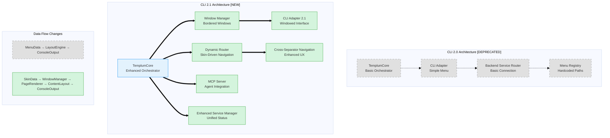

### Core Orchestration Changes

**CLI 2.0 [DEPRECATED]**:

- Simple event-driven orchestrator
- Direct CLI adapter communication
- Basic menu registry with hardcoded navigation
- Limited state management

**CLI 2.1 [NEW]**:

- **Enhanced Orchestrator** with window management coordination
- **Window Manager** for bordered window rendering with proper visual hierarchy
- **Dynamic Router** enabling skin-definition driven navigation
- **MCP Server** for comprehensive AI agent interaction
- **Enhanced Service Manager** with unified status display and ordering
- **Cross-Separator Navigation** for improved user experience

## 2. Window Management Architecture [2.1 NEW]

### Window System Hierarchy

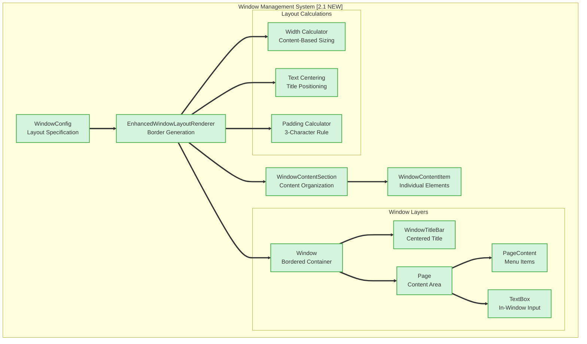

### Window Rendering Data Flow

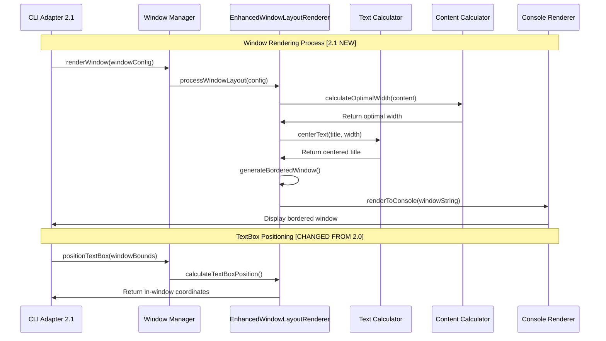

### Window Layout Components [2.1 NEW]

**WindowLayoutConfig Interface**:

```typescript
interface WindowLayoutConfig {
  title: string;
  subtitle?: string;
  content: WindowContentSection[];
  width?: number; // Auto-calculated if not provided
  theme: TerminalColorTheme;
}
```

**Key Features**:

- **Procedural Width Calculation**: Windows automatically size based on content with 3-character padding
- **Centered Title Rendering**: All titles centered within window borders
- **Unicode Box Drawing**: Proper ┌─┐ │ │ └─┘ border characters
- **Theme Integration**: Full color theme support throughout window components
- **In-Window TextBox**: Input positioned within window boundaries, not below

## 3. Dynamic Routing System [MAJOR CHANGE FROM 2.0]

### Routing Architecture Transformation

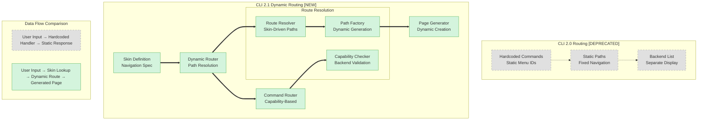

### Skin-Definition Driven Navigation

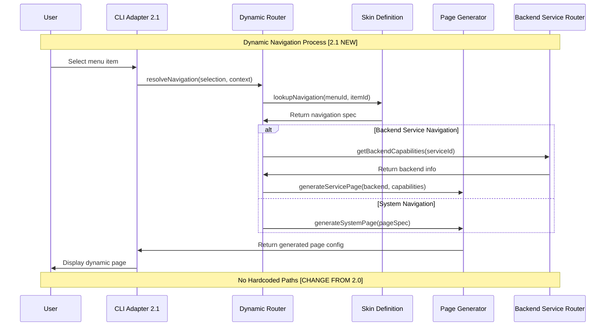

### Route Resolution Algorithm [2.1 NEW]

**Dynamic Routing Process**:

1. **Menu Selection** → Extract selection context (current page, selected item)
2. **Skin Lookup** → Query skin definition for navigation specification
3. **Capability Check** → Validate backend availability and capabilities
4. **Page Generation** → Create page configuration from skin template
5. **Window Rendering** → Apply window management system for display

**Key Improvements from 2.0**:

- **Zero Hardcoded Paths**: All navigation determined from skin definitions
- **Backend Integration**: Service listings integrated into menu hierarchy
- **Dynamic Generation**: Pages created based on actual backend capabilities
- **Unified Interface**: Same navigation system for Templum and backend services

## 4. MCP Agent Integration Architecture [2.1 NEW]

### MCP Server Architecture

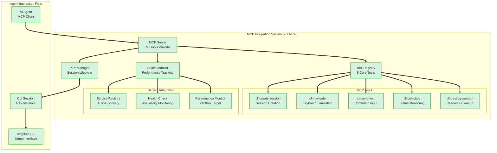

### MCP Tool Interaction Flow

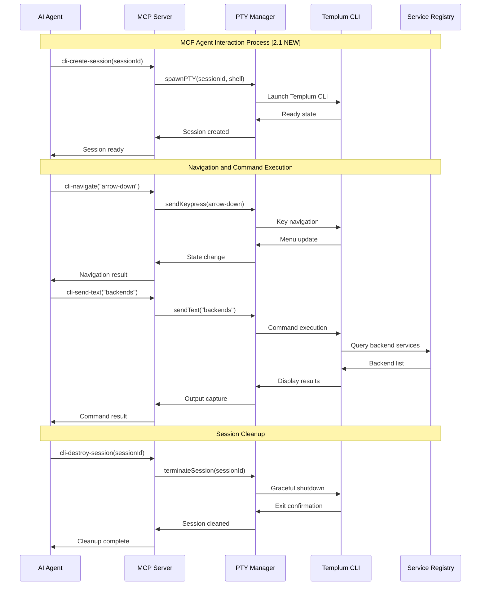

### Why MCP Integration Is Complex

**Technical Complexity Factors**:

1. **PTY Management**:
   - Pseudoterminal creation and lifecycle management
   - Session isolation and resource tracking
   - Process cleanup and orphan prevention

2. **Performance Requirements**:
   - <100ms response time target for all MCP tools
   - Intelligent caching for frequently accessed operations
   - Connection pooling and resource optimization

3. **Session State Management**:
   - Real-time state parsing and interpretation
   - Command completion detection
   - Error state recognition and recovery

4. **Service Integration**:
   - Automatic service registry registration
   - Health monitoring and availability tracking
   - Tool versioning and compatibility management

**Current Challenges** (from validation report):

- **Build Failures**: MCP channel compilation issues affecting tool availability
- **Tool Registration**: Verification processes timing out during service discovery
- **Session Lifecycle**: PTY spawn and cleanup processes experiencing timeout issues

### MCP Performance Architecture

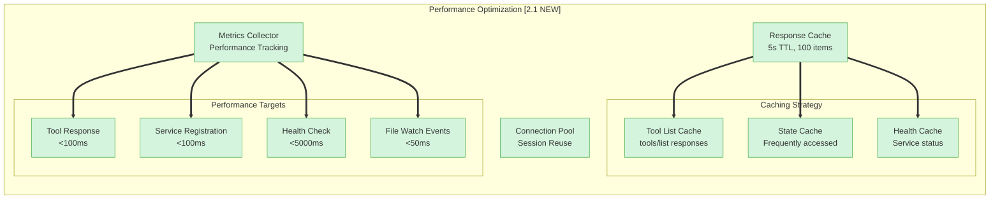

## 5. Enhanced Backend Service Discovery & Connection Flow

### Service Discovery Enhancement [MODIFIED FROM 2.0]

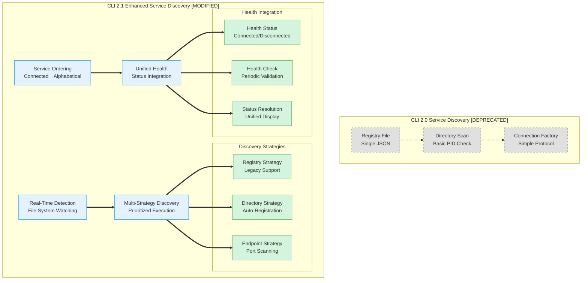

### Service Status and Ordering [MAJOR CHANGE]

**CLI 2.0 Service Display [DEPRECATED]**:

- Mixed ordering of connected/disconnected services
- Separate Status/Connection and Health displays
- Inconsistent service information presentation

**CLI 2.1 Service Display [NEW]**:

- **Consistent Ordering**: Connected services first (alphabetical), then disconnected services (alphabetical)
- **Unified Status Display**: Connected services show health status, disconnected services show "Disconnected"
- **Integrated Information**: Service capabilities and descriptions consistently available

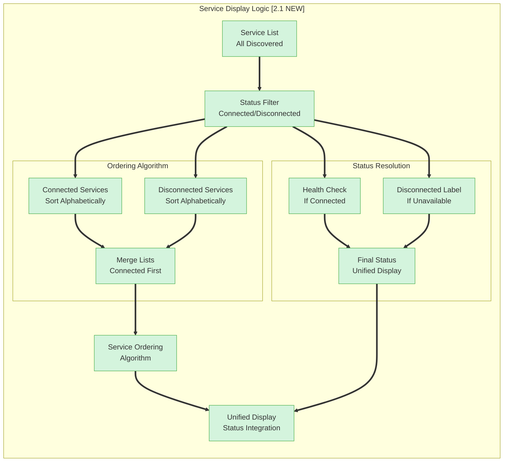

## 6. CLI Interface Data Flow [REDESIGNED FOR 2.1]

### CLI State Machine Evolution

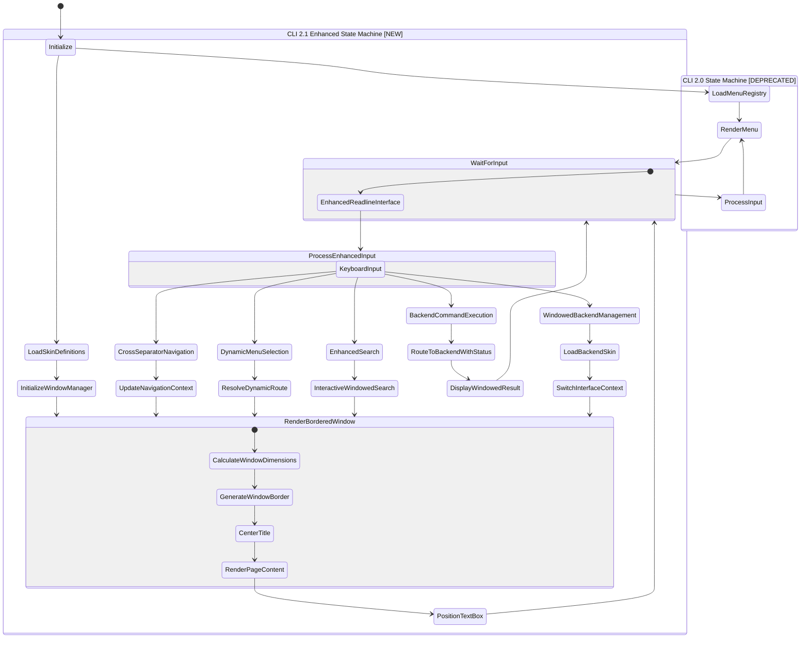

### Enhanced CLI Components [2.1 NEW]

**New CLI Architecture Components**:

- **Window Manager**: Coordinates bordered window rendering with theme support
- **Dynamic Route Resolver**: Resolves navigation from skin definitions
- **Cross-Separator Navigator**: Handles navigation across menu separator boundaries
- **Enhanced Service Manager**: Manages backend services with unified status display
- **MCP Integration Handler**: Coordinates with MCP server for agent interactions
- **Emoji Elimination Engine**: Systematically replaces emoji with text indicators

**Data Flow Stages Enhanced**:

1. **Initialization**: Setup window manager, load skin definitions, initialize MCP server
2. **Window Rendering**: Calculate dimensions, generate borders, center titles, position content
3. **Dynamic Routing**: Resolve navigation from skin definitions, generate pages dynamically
4. **Enhanced Input Processing**: Handle cross-separator navigation, dynamic menu resolution
5. **Backend Integration**: Route commands with unified status display and service ordering
6. **Context Management**: Maintain window state, navigation history, and session persistence

## 7. Navigation & Menu System [REDESIGNED]

### Cross-Separator Navigation [2.1 NEW]

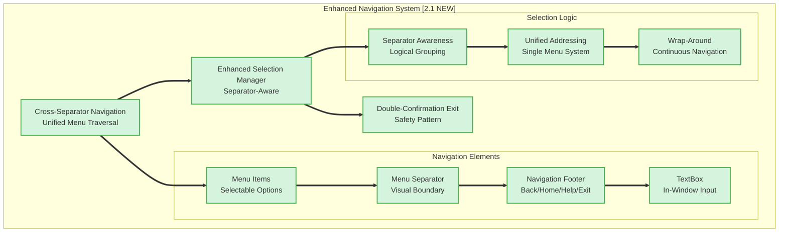

### Navigation Consistency Rules [2.1 NEW]

**Universal Navigation Footer**:

- All pages display: `Back | Home | Help | Exit`
- Home page: `Back` and `Home` options greyed out
- Consistent separator: `───────────` (matches window width)
- Navigation works across menu separator boundaries

**Exit Handling Enhancement**:

- **Menu Selection**: "Exit" changes to "Press Enter again to shut down Templum CLI"
- **Ctrl+C**: First press shows "Press Ctrl+C again to shut down Templum CLI"
- **Double Confirmation**: Prevents accidental exits, improves user safety

### Menu Structure Integration [CHANGED FROM 2.0]

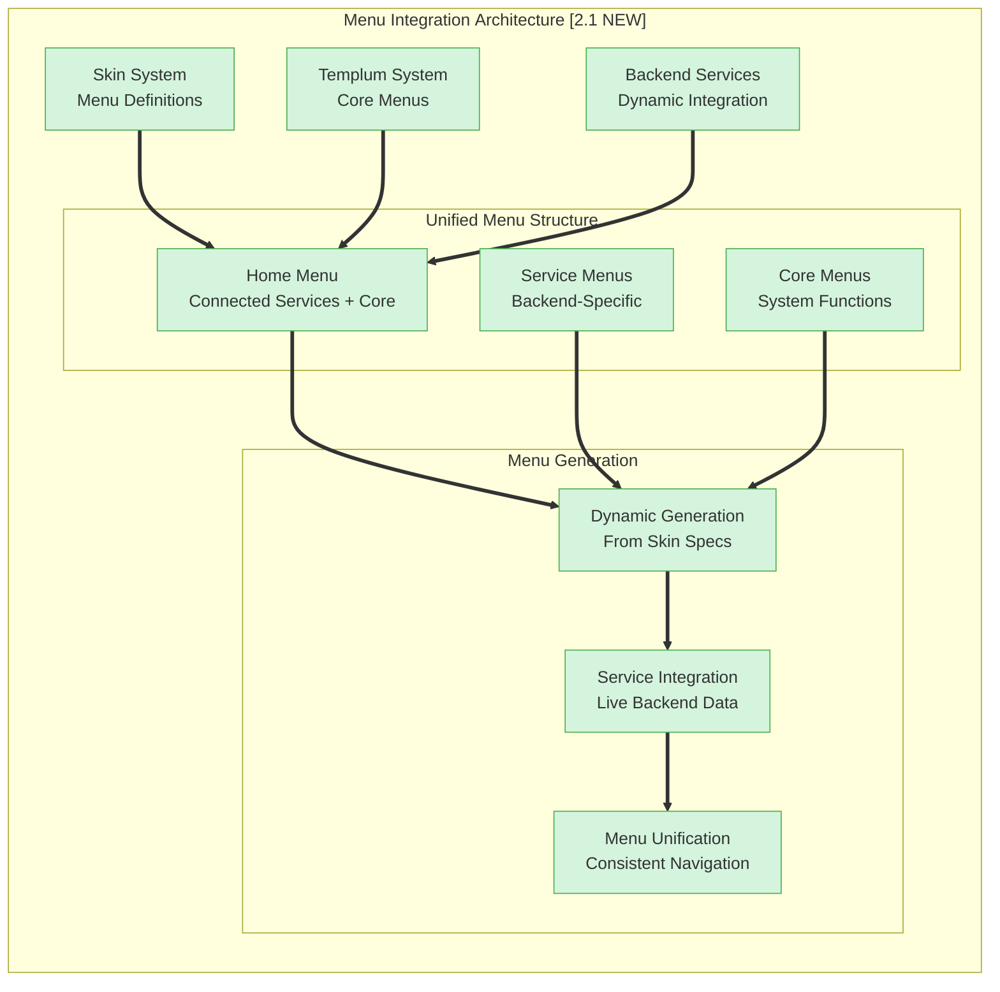

**Key Changes from 2.0**:

- **Home Menu Enhancement**: Connected backend services appear as shortcuts in main menu
- **Service Integration**: Backend services integrated into menu hierarchy, not listed separately
- **Dynamic Generation**: All menus generated from skin definitions, no hardcoded structures
- **Consistent Navigation**: Same navigation patterns for Templum and backend service menus

## 8. Enhanced State Synchronization Architecture

### State Management Evolution [MODIFIED FROM 2.0]

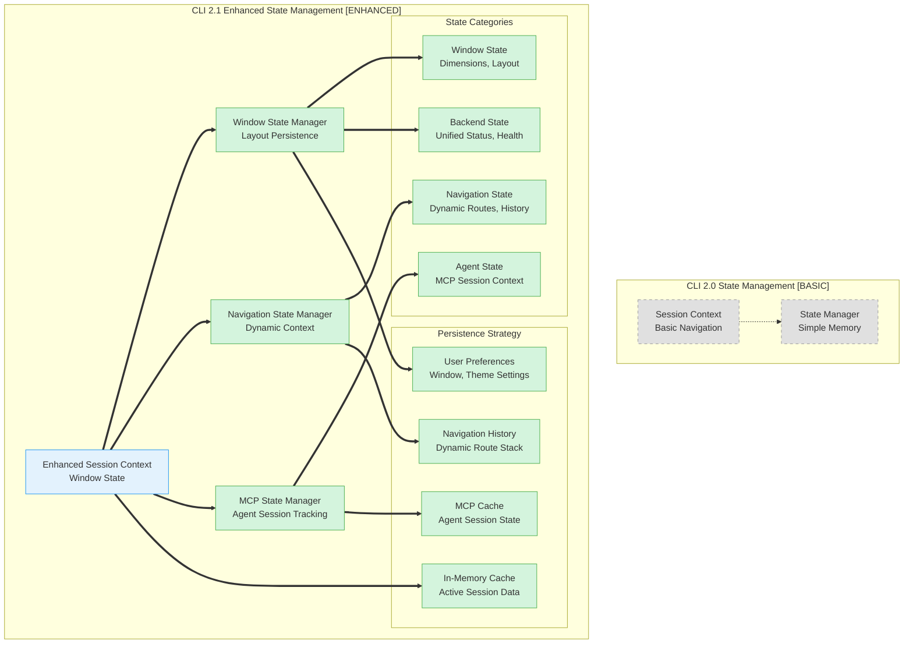

### State Synchronization Enhancements

**Enhanced State Categories**:

1. **Window State**: Border configurations, title positioning, TextBox coordinates
2. **Dynamic Navigation State**: Current route resolved from skin, navigation history stack
3. **Unified Backend State**: Service ordering, health status integration, capability tracking
4. **MCP Agent State**: Active sessions, agent interactions, performance metrics

**Synchronization Improvements**:

- **Window Consistency**: State changes trigger window re-rendering with maintained layout
- **Navigation Context**: Dynamic routes preserved across interface switches
- **Agent Coordination**: MCP sessions synchronized with CLI state for consistent experience
- **Performance Caching**: Intelligent caching reduces state lookup overhead

## 9. Command Execution Flow [ENHANCED]

### Enhanced Command Routing

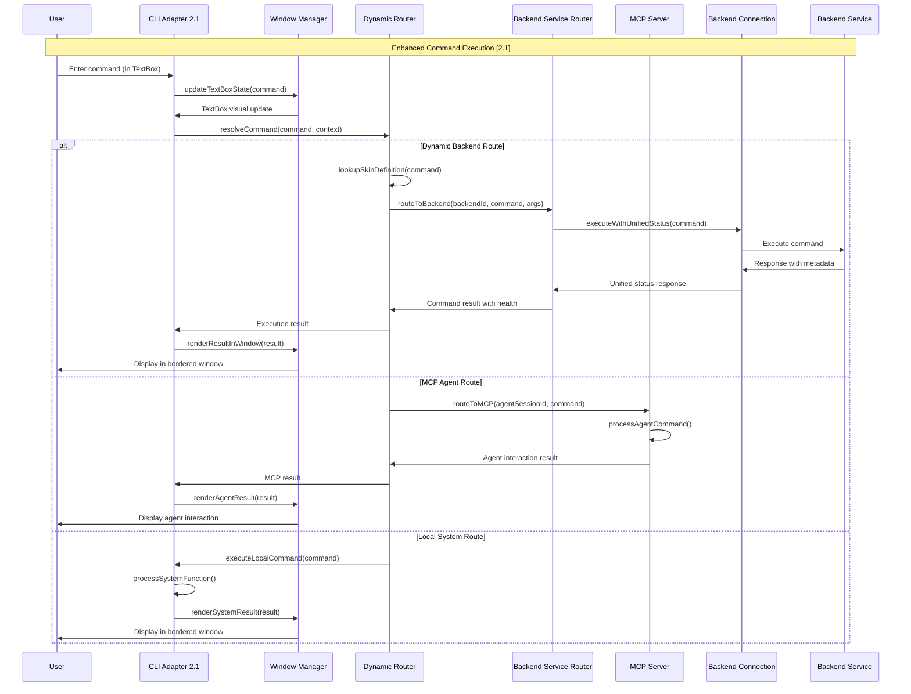

### Command Categories Enhanced [2.1]

**Enhanced Command Routing**:

1. **Dynamic Backend Commands**: Resolved from skin definitions with unified status display
2. **MCP Agent Commands**: Routed to MCP server for agent interaction processing
3. **Window Management Commands**: Controls window layout, theme, and display preferences
4. **Cross-Separator Navigation**: Enhanced navigation commands working across menu boundaries
5. **Enhanced System Commands**: Window-aware system functions with bordered output display

## 10. Migration Guide: CLI 2.0 → 2.1

### Migration Checklist

**Architecture Changes Required**:

- [ ] Replace hardcoded menu paths with skin-definition routing
- [ ] Implement window management system with bordered rendering
- [ ] Integrate MCP server for agent interactions
- [ ] Update service display with unified status and ordering
- [ ] Enhance navigation with cross-separator support
- [ ] Eliminate emoji usage throughout interface
- [ ] Reposition TextBox within windows instead of below

### Component Migration Map

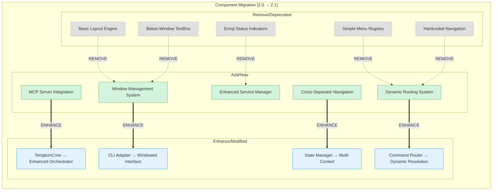

### Performance Validation Requirements

**CLI 2.1 Performance Targets**:

- **Window Rendering**: <50ms for typical window layouts
- **Dynamic Route Resolution**: <10ms average lookup time
- **MCP Tool Response**: <100ms for all agent interactions
- **Service Discovery**: <100ms for backend detection
- **Navigation Response**: <200ms for menu transitions
- **Cross-Separator Navigation**: <100ms for enhanced navigation

### Breaking Changes from 2.0

1. **Menu Structure**: All hardcoded menu IDs and paths removed
2. **Navigation API**: Cross-separator navigation requires new event handling
3. **Display System**: Emoji-based indicators replaced with text alternatives
4. **Input Handling**: TextBox positioning changed from below-window to in-window
5. **State Management**: Enhanced context tracking requires migration of session data
6. **Backend Integration**: Unified status display changes service information format

### Implementation Priority Order

1. **Phase 1**: Window Management System implementation
2. **Phase 2**: Dynamic Routing System with skin integration  
3. **Phase 3**: MCP Server setup and agent tools
4. **Phase 4**: Enhanced navigation and cross-separator support
5. **Phase 5**: Service management unification and emoji elimination
6. **Phase 6**: Performance optimization and validation
7. **Phase 7**: Migration testing and rollout

## Summary

The Templum CLI 2.1 architecture represents a significant evolution from CLI 2.0, introducing comprehensive window management, dynamic routing, MCP agent integration, and enhanced user experience patterns. The key architectural improvements enable:

- **Professional Interface**: Bordered windows with consistent visual hierarchy
- **Dynamic Flexibility**: Skin-definition driven navigation eliminating hardcoded paths  
- **Agent Integration**: Comprehensive MCP server enabling AI agent CLI interactions
- **Enhanced UX**: Cross-separator navigation, unified status display, and safety patterns
- **Performance Optimization**: <100ms response targets with intelligent caching
- **Maintainability**: Clear separation of concerns and pattern-based development

This architecture analysis provides the foundation for implementing CLI 2.1 while maintaining backwards compatibility and ensuring smooth migration from the existing CLI 2.0 system.
