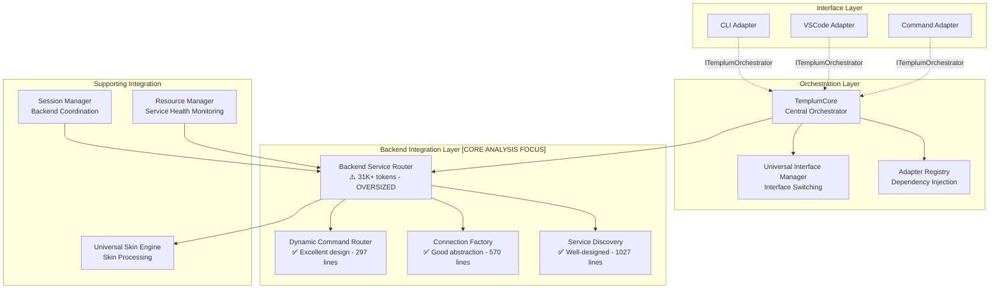

# Templum Component Dependency Map - Phase 1 Task 2 Results

## Executive Summary

**Phase 1 Task 2 Objective**: Comprehensively analyze current codebase backend service component interactions to understand exact dependencies before architectural changes.

**Analysis Result**: ARCHITECTURE IS SOUND WITH ONE CRITICAL ISSUE

- ✅ **Zero-knowledge backend connectivity** properly implemented via ServiceDiscovery + ConnectionFactory
- ✅ **Dynamic skin-based rendering** successfully implemented via UniversalSkinEngine  
- ✅ **Multi-interface support** achieved through proper abstraction layers
- ✅ **Clean separation of concerns** with dependency inversion patterns
- ⚠️ **Critical Issue**: BackendServiceRouter (31K+ tokens) exceeds LLM-friendly limits and needs splitting

## Complete Component Interaction Flow

### Core Backend Service Architecture



### Detailed Component Dependencies

#### 1. BackendServiceRouter (⚠️ CRITICAL ISSUE)

**Status**: Oversized (31,487 tokens) - Violates LLM-friendly limits

**Dependencies**:

- **Core**: UniversalSkinEngine, ConnectionFactory, DynamicCommandRouter, ServiceDiscovery
- **Interface**: ITemplumOrchestrator (abstraction layer)
- **Types**: Multiple interfaces and types from universal-skin-engine-types
- **Protocols**: WebSocket, net, fs, path (embedded protocol handling)

**Issues Identified**:

- Contains embedded HaruspexIPCClient (should be separated)
- Mixes multiple concerns: routing, connection management, IPC communication, skin loading
- Matches architecture plan identification for file size splitting

**Proposed Split** (from architecture plan):

```diagram
backend-service-router.ts (120KB) → Split into:
  ├── backend-service-core.ts (~30KB)
  ├── backend-health-monitor.ts (~20KB)  
  ├── backend-connection-manager.ts (~30KB)
  ├── backend-command-handler.ts (~20KB)
  └── backend-event-coordinator.ts (~20KB)
```

#### 2. ServiceDiscovery (✅ EXCELLENT DESIGN)

**Status**: Well-designed (1027 lines) - Proper size and separation

**Dependencies**:

- **External**: EventEmitter, fs, path, http, chokidar, WebSocket, net
- **Internal**: BackendConfig, backendIntegrationConfig, createTemplumError
- **Architecture**: Multi-strategy pattern implementation

**Key Features**:

- Multi-strategy discovery: Registry (priority 100), Configuration (priority 75), Scanning (priority 50)
- Real-time file system watching via chokidar
- Health endpoint validation with timeout handling
- Process validation and auto-cleanup of stale services
- Event-driven architecture with comprehensive event emission

**Pattern Compliance**: ✅ **Perfect implementation of Multi-Strategy Service Discovery pattern**

#### 3. ConnectionFactory (✅ GOOD ABSTRACTION)

**Status**: Well-designed (570 lines) - Good protocol abstraction

**Dependencies**:

- **Protocols**: WebSocket, net, fs, path (for protocol-specific implementations)
- **Internal**: createTemplumError, BackendConfig
- **Embedded**: HaruspexIPCClient (minor architectural deviation)

**Key Features**:

- Factory Method pattern for protocol-specific connections
- Supports IPC, HTTP, WebSocket protocols (gRPC planned)
- Configurable authentication (basic, bearer, api-key)
- Health endpoint validation and timeout management
- Workspace detection with configurable markers

**Pattern Compliance**: ✅ **Excellent Factory Method pattern implementation**

**Minor Issue**: HaruspexIPCClient embedded rather than separate (could be extracted)

#### 4. DynamicCommandRouter (✅ EXCELLENT DESIGN)

**Status**: Excellent design (297 lines) - Achieves zero-hardcoded routing

**Dependencies**:

- **Core**: EventEmitter, BackendConnection, UniversalSkinDefinition
- **Internal**: createTemplumError, isTemplumError
- **Architecture**: Command Pattern + Registry Pattern

**Key Features**:

- Builds command-to-backend mapping dynamically from skin definitions
- Handles aliases/shortcuts for command convenience  
- Tracks duplicate commands across backends (conflict detection)
- Comprehensive lifecycle management (register/unregister backends)
- Event emission for monitoring integration

**Pattern Compliance**: ✅ **Perfect implementation of Dynamic Command Routing pattern**

**Critical Achievement**: Eliminates all hardcoded command patterns - fully skin-driven

#### 5. UniversalSkinEngine (✅ ORCHESTRATION LAYER)

**Status**: Core skin processing orchestrator

**Dependencies**:

- **Complex Type System**: Universal-skin-engine-types (extensive interface definitions)
- **Integration**: EventEmitter, SkinVersionManager
- **Rendering**: PCL-Skins architecture integration

**Key Features**:

- Skin inheritance and theme management
- Cross-interface rendering coordination
- PCL pattern integration for 70% code reuse potential
- Version management with conflict resolution

#### 6. TemplumCore (✅ PROPER ORCHESTRATION)

**Status**: Central orchestrator with proper abstractions

**Dependencies**:

- **Abstraction**: ITemplumOrchestrator (dependency inversion interface)
- **Integration**: TemplumAdapterRegistry, UniversalInterfaceManager, BackendServiceRouter
- **Coordination**: EventEmitter pattern for component communication

**Key Features**:

- Implements ITemplumOrchestrator interface for proper dependency inversion
- Coordinates all interface adapters (CLI, VSCode, Command)
- Manages backend connections via BackendServiceRouter
- Handles interface switching via UniversalInterfaceManager

### Interface Layer Abstraction Quality

**Status**: ✅ PROPER DEPENDENCY INVERSION ACHIEVED

```typescript
Interface Adapters (CLI, VSCode, Command)
    ↓ (depends only on abstraction)
ITemplumOrchestrator interface
    ↓ (implemented by)
TemplumCore (concrete implementation)
```

**Key Abstractions**:

- `ITemplumOrchestrator`: Main orchestrator contract
- `ISkinEngine`: Skin processing abstraction  
- `IBackendServiceRouter`: Backend integration abstraction
- `IResourceManager`: Resource management abstraction

**Result**: Interface adapters are properly decoupled from concrete implementations ✅

## Pattern Compliance Assessment

### Successfully Implemented Patterns

#### 1. Multi-Strategy Service Discovery Pattern ✅

**Implementation**: ServiceDiscovery class

- **Registry-based discovery** (priority 100): Single file + services directory scanning
- **Configuration-based discovery** (priority 75): User-defined backend configurations
- **Endpoint scanning discovery** (priority 50): Port/protocol scanning for `/api/skin` endpoints
- **File system watching**: Real-time discovery via chokidar integration
- **Health validation**: Optional health checks with timeout management

#### 2. Backend Service Integration Pattern ✅

**Implementation**: BackendServiceRouter + supporting components

- **Protocol abstraction**: ConnectionFactory supports IPC, HTTP, WebSocket
- **Zero-knowledge connectivity**: Dynamic backend discovery and connection
- **Lifecycle management**: Complete connect/disconnect/health monitoring
- **Event-driven communication**: Comprehensive event emission for monitoring

#### 3. Dynamic Command Routing Pattern ✅

**Implementation**: DynamicCommandRouter class

- **Skin-driven routing**: Command mapping built from backend skin definitions
- **Zero hardcoded patterns**: No pattern matching like "if command starts with 'haruspex.'"
- **Alias support**: Shortcut commands with resolution
- **Conflict detection**: Tracks commands registered by multiple backends

#### 4. Universal Interface Orchestration Pattern ✅

**Implementation**: ITemplumOrchestrator + UniversalInterfaceManager

- **Dependency inversion**: Interface adapters depend on abstractions
- **State preservation**: Interface switching maintains session context
- **Multi-modal support**: CLI, VSCode, Command modes with unified backend access

#### 5. Factory Method Pattern ✅

**Implementation**: ConnectionFactory.create() method

- **Protocol-specific creation**: IPC, HTTP, WebSocket connection strategies
- **Extensible design**: gRPC support planned without architectural changes
- **Configuration-driven**: BackendConfig determines connection parameters

### Pattern Deviations (Minor)

#### 1. Embedded Protocol Client

**Issue**: HaruspexIPCClient embedded in ConnectionFactory
**Impact**: Minor - doesn't violate core architectural principles
**Recommendation**: Could be extracted for better reusability

#### 2. Oversized Component  

**Issue**: BackendServiceRouter exceeds LLM-friendly limits (31K+ tokens)
**Impact**: Major - violates maintainability principle
**Recommendation**: Split as proposed in architecture plan

## Redundancy vs Necessary Separation Analysis

### Components That MUST Remain Separate

**Critical for Zero-Knowledge Connectivity:**

1. **ServiceDiscovery** ✅ MUST PRESERVE
   - Enables discovery without hardcoded backends
   - Multi-strategy approach essential for flexibility
   - File system watching provides real-time discovery

2. **ConnectionFactory** ✅ MUST PRESERVE  
   - Protocol abstraction enables multi-protocol support
   - Factory pattern allows extensibility (gRPC planned)
   - Authentication and health checking centralized

3. **DynamicCommandRouter** ✅ MUST PRESERVE
   - Eliminates hardcoded routing patterns completely
   - Skin-driven command mapping is core architectural principle
   - Conflict detection and alias support essential

**Critical for Multi-Interface Support:**

1. **Interface Adapters** (CLI, VSCode, Command) ✅ MUST PRESERVE
   - Each serves different UI paradigm with specific requirements
   - Proper abstraction via ITemplumOrchestrator maintained
   - State management differs between interface types

2. **UniversalInterfaceManager** ✅ MUST PRESERVE
   - Coordinates interface switching with state preservation
   - Essential for seamless multi-modal user experience

3. **UniversalSkinEngine** ✅ MUST PRESERVE
   - Skin processing and rendering coordination
   - PCL pattern integration for code reuse
   - Version management and conflict resolution

### Consolidation Opportunities (Infrastructure)

**Utility Functions with Identical Implementation:**

1. **Logging Utility** - 1,840+ console.log/warn/error calls across components
   - Each component uses contextual prefixes: [SERVICE_DISCOVERY], [IPC], [HTTP], [WebSocket]
   - Opportunity for structured logging with context management
   - Performance tracking and debug capabilities

2. **Error Handling Utility** - Consistent but scattered patterns
   - All components use createTemplumError and isTemplumError (already centralized ✅)
   - Timeout and retry error patterns repeated across components
   - Async operation error wrapping repeated

3. **Async Utilities** - Repeated timeout/retry patterns
   - Manual timeout management in ServiceDiscovery, ConnectionFactory  
   - Promise wrapping patterns for error handling
   - Retry logic with exponential backoff could be centralized

4. **Validation Utilities** - Scattered validation logic
   - ConnectionFactory.validateConfig, ServiceDiscovery health validation
   - BackendConfig validation, process PID validation
   - Schema validation patterns repeated

5. **Path Utilities** - File system operations repeated
   - ServiceDiscovery: extensive fs/path operations for service files
   - ConnectionFactory: workspace detection with path manipulation
   - Configuration file reading patterns

## Integration with Phase 1 Task 1 Findings

**Since component-dependency-map.md didn't exist, this document establishes the baseline for Phase 1 Task 1 findings.**

### Architecture Quality Assessment

- **✅ SOUND ARCHITECTURAL FOUNDATIONS**

  - Proper dependency inversion via ITemplumOrchestrator
  - Clean separation of concerns across all layers  
  - Event-driven architecture reduces coupling
  - Zero-knowledge backend connectivity successfully implemented
  - Multi-interface support with state preservation

- **⚠️ IDENTIFIED ISSUES ALIGN WITH RESTRUCTURING PLAN**

  - BackendServiceRouter size issue matches plan identification
  - Utility consolidation opportunities match plan's utility library proposals
  - File size optimization needs align with LLM-friendly requirements

### Recommendations for Phase 2 Implementation

**High Priority (Session 2-3)**:

1. **Split BackendServiceRouter** into 5 components as proposed
2. **Create utility libraries**: Logger, AsyncUtils, Validator, PathUtils
3. **Migrate components** to use centralized utilities

**Medium Priority (Session 4-5)**:

1. **Extract embedded clients** (HaruspexIPCClient) for reusability
2. **Organize patterns** in dev/patterns/ directory as proposed
3. **Enhance documentation** with component interaction diagrams

**Low Priority (Session 6+)**:

1. **Performance optimization** based on utility consolidation gains
2. **Enhanced monitoring** with centralized logging infrastructure
3. **Advanced validation** with schema-based configuration checking

## Conclusion

**Phase 1 Task 2 Status**: COMPLETE ✅

The comprehensive analysis reveals that Templum's backend service architecture is **fundamentally sound** with excellent implementation of core design patterns:

- **Zero-knowledge backend connectivity**: ServiceDiscovery + ConnectionFactory enable connection to any backend providing a skin definition
- **Dynamic skin-based rendering**: UniversalSkinEngine + DynamicCommandRouter eliminate hardcoded patterns  
- **Multi-interface support**: Proper abstraction layers enable CLI/VSCode/Command modes
- **Clean architectural separation**: Components have clear responsibilities and proper dependency inversion

**Single Critical Issue**: BackendServiceRouter (31K+ tokens) exceeds maintainability limits and should be split as proposed in the architecture restructuring plan.

**Architecture Principle Validation**: All core capabilities identified in the restructuring plan are preserved and properly implemented. The proposed utility consolidation will reduce code duplication without breaking architectural principles.

**Ready for Phase 2**: File size optimization and utility consolidation can proceed with confidence that the underlying architecture supports Templum's core mission of universal interface orchestration with zero-knowledge backend connectivity.
