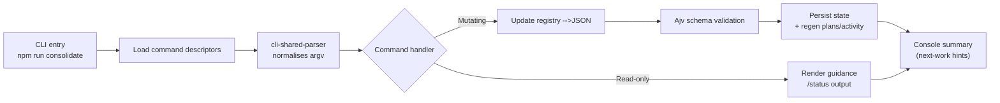
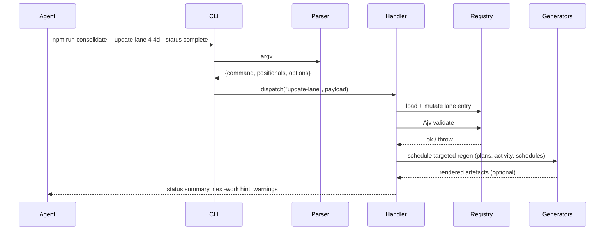
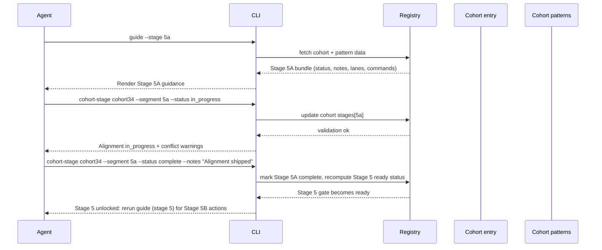

# Consolidation CLI — Interaction Design

## Goals

- Prevent agents from skipping required gates or forgetting evidence.
- Provide a single entrypoint to read the current registry state, update lanes/stages, and regenerate Markdown artefacts.
- Emit clear terminal cues that surface outstanding prerequisites before allowing progress.

## Architecture Overview

The consolidate CLI is a thin wrapper around three core modules:

1. **Command registry (`cli-command-registry.mjs`)** — declarative descriptors that describe usage, flags, and examples.
2. **Shared parser (`cli-shared-parser.mjs`)** — normalises argv, applies coercions/aliases, and enforces required arguments.
3. **Command driver (`consolidation-scripts/cli-command-stub.mjs`)** — executes the command, mutates `consolidation-state.json`, emits guidance, and triggers targeted regenerations.

### Command Dispatch Flow

### State Mutation Sequence

### Data Sources & Outputs

- **Primary datastore:** `dev/architecture/consolidation-scripts/config/consolidation-state.json` (schema: `consolidation-state.schema.json`).
- **Derived artefacts:** utility plans, activity log, cohort and global schedules, hand-off manifests.
- **Console guidance:** assembled on demand (no cached Markdown), incorporating live registry, lane dependencies, and cohort signals.

## Command Surface

| Command                                                   | Purpose                                                                                    |
| --------------------------------------------------------- | ------------------------------------------------------------------------------------------ |
| `npm run consolidate -- guide <patternId> [--stage N] [--lane 6b] [--lanes] [--recent] [--next\|-n]` | Surface focused guidance for a pattern, optionally narrowed to a stage or lane, surface planned-file conflicts, and highlight the next actionable work item. |
| `npm run consolidate -- status <patternId>`               | Show registry snapshot (stage pointer, cohort membership, pending lanes, blockers, and latest evidence). |
| `npm run consolidate -- claim <patternId> --stage <id>\|--lane 6b [--summary text] [--note text] [--plan-files a,b]` | Claim a stage or lane, stamp the start timestamp, register planned files, and log the deterministic agent id for collision prevention. |
| `npm run consolidate -- pattern-cohort <patternId> [--add cohort] [--remove cohort] [--clear] [--list] [--name text] [--description text]` | Assign or inspect cohort alignment for a pattern; each pattern may belong to at most one cohort, and attempts to add a second cohort now fail with `Pattern already assigned to a cohort`. |
| `npm run consolidate -- cohort-stage <cohortId> --segment 5a --status <value> [--plan-files …] [--notes text]` | Manage cohort-level segments (e.g., Stage 5A alignment), capture planned files, and emit elapsed timings for shared readiness. |
| `npm run consolidate -- stage-note <patternId> <stageId> --body "<text>"` | Append a stage-scoped note (auto-tagged in the guide output) to capture discoveries and guardrails. |
| `npm run consolidate -- update-stage <patternId> <stageId> [--status <value>] [--plan-files …] [--search-terms …] [--clear-search-terms] [--clear-plan-files] [--add-dependency patternId:gate] [--remove-dependency patternId:gate] [--clear-dependencies] [--force]` | Update stage gate status, manage dependencies, keep search terms/planned files aligned, and enforce the planned-file cleanup guard (use \`--force\` only after documenting intentional leftovers). |
| `npm run consolidate -- update-handoff <patternId> [options]` | Maintain shared guardrails, files, and acknowledgements recorded during Stage 5 hand-off. |
| `npm run consolidate -- update-lane <patternId> <laneId> [--status <value>] [--plan-files …] [--search-terms …] [--clear-search-terms] [--clear-plan-files] [--add-dependency patternId:gate] [--remove-dependency patternId:gate] [--clear-dependencies] [--force]` | Update lane status (`pending`/`in_progress`/`blocked`/`complete`), manage planned files/search terms, emit guard results, and keep dependency propagation accurate. |
| `npm run consolidate -- remove-lane <patternId> <laneId> [--summary text] [--agent name] [--drop-notes] [--force]` | Remove an existing Stage 4/6 lane, optionally delete lane-scoped notes, clear dependency references, and recompute stage readiness (use `--force` only after detaching dependants). |
| `npm run consolidate -- sweep <patternId> (--stage <id> \| --lane <laneId>) [--list]` | Re-run the planned-file search for recorded terms, list counts per file when matches remain, and exit non-zero so agents can resolve or document the residue; skips CLI artefacts, surfaces `.gitignore`/excluded-only plans, and preserves stationarity if the CLI moves. |
| `npm run consolidate -- append-activity <patternId> --scope stage-6\|lane-6b --summary "<text>"` | Append collaborative evidence to the activity log without changing the underlying stage/lane status (combine with `--stage`/`--lane` shortcuts for clarity). |
| `npm run consolidate -- reopen <patternId> <laneId>`      | Roll back a lane to `pending`/`blocked` (forces plan/hand-off review). |
| `npm run consolidate -- schedule [--patterns "[1,2]"] [--cohort id] [--format json\|markdown] [--output path] [--no-save]` | Generate a deterministic, cohort-aware schedule; markdown and JSON outputs default to `Templum/dev/architecture/schedules/`. |
| `npm run consolidate -- regen [--check] [--pattern id] [--cohort id] [--no-global] [--force-all]` | Regenerate plan previews, the activity log, and targeted schedules; defaults to only the artefacts named by the provided filters (or the scopes touched during the session). |

All subcommands operate on `consolidation-state.json`, validate via the schema, and ensure projections are refreshed when the state changes. Stage 5 hand-off metadata remains the single home for approvals—there are no additional per-lane approval prompts.

Command parsing is now metadata-driven: descriptor files capture positionals, flags, aliases, and help text for every subcommand. The shared parser merges repeated flags (including comma-separated lists), emits consistent usage errors, and powers per-command `--help`/`-h` output generated from the metadata.

#### Metadata & Parser Architecture

- **Descriptors:** `dev/architecture/cli-command-registry.mjs` defines each command’s usage, summary, positionals, and flag metadata. Adding a new CLI surface area now means adding a descriptor entry plus handler logic—no repetitive parsing boilerplate.
- **Shared parser:** `dev/architecture/cli-shared-parser.mjs` normalises input (aliases, repeated flags, CSV values), applies inline coercions, and throws usage errors that embed the generated help block (required args/flags, examples, etc.).
- **Handler contract:** `cli-command-stub.mjs` receives `{ positionals, options, helpRequested }` from `parseCommandInvocation`, keeping business logic small and consistent. Help requests short-circuit before handler execution.
- **Generated help:** `--help`/`-h` renders the descriptor-driven usage text for every command; `help <command>` prints the same metadata so documentation and runtime behaviour stay aligned.
- **Regression coverage:** `tests/scripts/cli-shared-parser.test.ts` calls a lightweight Node probe (`tests/scripts/helpers/cli-parser-probe.mjs`) to assert plan-file merging, acknowledgement sequencing, and alias resolution. Extend this suite whenever descriptors or parsing rules evolve.

### Planned File Tracking

- Every stage gate and lane now supports `plannedFiles`, captured via `claim`, `update-stage`, `update-lane`, and `create-lane`.
- Agents can repeat `--plan-files` (or provide comma-separated lists) in any order; the CLI normalises duplicates before validation and conflict checks.
- Auto-assignment skips scopes whose planned files overlap with other `in_progress` scopes; manual claims emit a warning instead of failing.
- Guides, status views, generated plans, and activity exports surface the planned file list so collaborators can reason about potential collisions.
- The same commands accept `--search-terms` and `--clear-search-terms`, keeping the cleanup guard aligned with the lane/stage scope without editing auxiliary JSON.

### Time-to-Completion Telemetry

- Claiming a stage or lane records `startedAt`; moving an `in_progress` scope to any other status logs the elapsed wall-clock time.
- `update-stage`/`update-lane` output the elapsed duration when work leaves `in_progress` and persist `elapsedMs` for schedule parity. They also accept `--add-dependency` / `--remove-dependency` / `--clear-dependencies` so external blockers stay encoded in the registry and downstream waves remain accurate. Omitting `--status` keeps the current state but another mutation flag (plan files, dependencies, search terms, notes, summary, evidence, agent, etc.) is required to avoid a no-op.
- Activity entries inherit `durationMs`, and generated Markdown renders the duration inline for both stages and lanes.

### Regeneration & Artefact Refresh

- After each write, the CLI tracks which patterns, scopes, and cohorts were touched (including dependency-driven status flips) and silently regenerates only the affected plan previews, cohort schedules, and the activity log—no background console noise.
- Dependent artefacts are pulled in automatically: if a scope completes and other stages/lanes list it as a blocker, those downstream patterns and their cohorts are queued for regeneration.
- Manual `regen` runs accept selective flags—`--pattern`, `--cohort`, `--no-global`, `--force-all`, and `--check`—so agents can preview or refresh exactly the documents they care about; `--silent` quietly suppresses the summary output when chaining CLI commands.
- Generated schedules now match the cohort example layout: status glyphs in the `St` column, HH:MM durations, filtered dependency lists (only cross-pattern or non-default blockers), a `Focus` column sourced from lane scopes or stage summaries, and a notes section that mirrors the latest pattern annotations.

### Cohort Coordination

- `pattern-cohort` keeps registry rosters authoritative; each update refreshes Stage 5 gating hints surfaced by `guide`, `status`, regenerated plans, and the schedule outputs. Use `--list` before changing assignments so you see the active cohorts and Stage 5A timestamps.
- Cohort Stage 5A readiness is tracked via `cohort-stage --segment 5a`. Alongside status, you can capture planned files, timing (`startedAt`, `completedAt`, `elapsedMs`), and notes so the shared alignment session is preserved in the registry.
- Stage 5 claims enforce that every cohort member has Stage 4 complete and the shared Stage 5A segment marked `complete`. If the guard fails, the CLI surfaces a precise blocker list and keeps the Stage 5 gate in `blocked`/`pending`.
- When a cohort is still aligning, `guide --stage 5` hides the Stage 5B checklist and replaces it with the blockers and remediation commands (`pattern-cohort --list`, `cohort-stage <id> --segment 5a --status …`). Once the cohort segment advances, Stage 5B guidance reappears automatically.
- After Stage 5A completes, the CLI leaves every Stage 6 lane `pending` so auto-assignment can spread the work; agents only add `blocked` statuses and `--add-dependency` links when they hit a concrete blocker during execution.
- Each cohort edit appends a Stage 5 activity entry and triggers markdown regeneration so downstream teammates inherit the latest roster and evidence without re-running commands manually.

### Schedule Automation

- `runRegen` regenerates global and per-cohort schedules (Markdown + JSON) alongside plan previews, the tracker, and the activity log. Files land under `Templum/dev/architecture/schedules/` only when content changes, keeping diffs clean.
- `schedule --cohort <id>` (and `node dev/architecture/consolidation-scripts/generate-schedule.mjs --cohort <id>`) focus the wave planner on a cohort while preserving cross-pattern prerequisites (including the synthetic `cohort:<id>|cohort-5a` task).
- Planned-file conflicts are normalized (trimmed, case-insensitive). Scopes with no declared plan files are treated as collision-free so they join the earliest wave that satisfies their dependencies (e.g., pending Stage 7 gates without plan files land in the current wave instead of slipping to a trailing "cleanup" wave).
- The generator produces the fewest waves possible by packing any dependency-ready tasks (even across different stages) into the same wave while still staggering overlapping planned files. Stage 6 lanes that collide across cohort members remain `[?] blocked` until the shared files clear, and lanes such as `4:6l`, `4:6i`, and `4:6j` now surface that blocked state explicitly instead of appearing runnable. Lanes that still list placeholder plan files (e.g., a literal `"0"`) are auto-blocked until owners supply a real file list, preventing the scheduler from assuming the lane is safe to run.
- Scopes that share plan files across different patterns now block symmetrically—the act of one lane being blocked on a collision propagates the `[?]` glyph back to its peers, so cross-pattern sweeps (Pattern 3 Stage 7 vs. Pattern 4 lane 6i) stay serialized without manual dependency edits.
- Stage dependencies honour completed registry state: once upstream gates are marked `complete`/`ready`, the scheduler treats those dependencies as satisfied and schedules the downstream scope immediately, even if the predecessor is no longer listed in the current wave output.
- Waves are now split so the current wave contains scopes that are either runnable (`[ ]`/`[>]`) or already owned (`[~]`), while `[?] blocked` items still shift to later waves. This keeps active work visible in the lead wave without letting collision-blocked scopes masquerade as ready.
- Stage 4 and Stage 6 gates no longer surface as standalone rows—their lanes are the tracked work, Stage 5A acts as the Stage 4 close-out for the cohort, and Stage 7 captures the Stage 6 completion.
- Generated schedules annotate cohorts, planned files, elapsed timing, and dependency chains for every scope; all tasks appear in a wave (no unscheduled table), Stage 5A always renders as a cohort-only wave, and later waves combine higher stages when dependencies allow parallel execution.

### Schedule Generator

- `npm run consolidate -- schedule` (or `node dev/architecture/consolidation-scripts/generate-schedule.mjs`) defaults to markdown output and saves it under `Templum/dev/architecture/schedules/schedule-<patterns>.md`; pass `--no-save` to emit to stdout only.
- Override the default target with `--output path` (relative paths resolve from the repo root), switch to JSON rendering via `--format json`, or keep everything ephemeral with `--no-save`.
- Markdown output is formatted with Prettier using the same config as generated pattern plans before writing to disk.
- Schedule waves honor declared dependencies, isolate Stage 5A as its own wave, and otherwise pack any ready tasks (lanes, pattern stages, or cohort segments) so long as their planned files do not collide; higher stage numbers may share a wave when safe.
- Explicit `--patterns` or `--cohort` selections stay authoritative even when the resulting pattern list is empty; the generator no longer falls back to the global roster, preventing unrelated cohorts or test patterns from appearing in filtered schedules.

### Guide Output & Gating Mechanics

- `guide --stage <id>` renders the requested gate alongside the live pointer. Locked stages print the upstream summary (latest Stage N – 1 note plus exit metadata) before showing reminders and actions.
- Stage 5 is now split into two explicit guidance paths:
- `guide --stage 5` (and `--next` once Stage 5A is complete) shows the cohort prerequisite banner, Stage 5B reminders, and, when unlocked, the Stage 6 gating battery checklist plus hand-off summary.
- `guide --stage 5a` (as well as `--next` while Stage 5A remains pending) renders the full cohort alignment bundle inline—cohort roster, status glyphs, Stage 4 evidence per pattern (lanes, commands, notes, planned files), and the exact `cohort-stage` / `pattern-cohort` commands to execute.
- Agents can append colon-delimited shorthands to the pattern argument—e.g., `npm run consolidate -- guide 4:lane-6p:recent` or `guide 210:stage-5a:lanes`—to focus a lane, stage, or toggle `--recent`/`--lanes`/`--next`; the parser normalises these segments, merges them with explicit flags, and rejects conflicts so targeted views never fall back to the auto `--next` flow.
- Cohort rows collapse supporting artefacts so alignment agents no longer need to open generated plans; everything necessary to run Stage 5A is streamed directly into the guide output.
- `guide --lane <id>` prints the same expanded lane card that `--next` would auto-select, keeping the shorthand and explicit forms in sync.
- Plan-file conflicts and unsatisfied dependencies cause `--next` to skip a scope automatically. Manual guide views call out the conflicts so agents can coordinate before claiming, and the auto-blocker now also inspects Stage 6 cohort peers—any lane with overlapping planned files stays `[?] blocked` until the earlier cohort member closes.
- The glyph legend now includes the `ready` state (`[>]`) alongside `[ ]`, `[~]`, `[?]`, `[x]`, matching the registry metadata and schedule output.
- `--recent` appends the last three activity entries for the focused stage or lane, providing context without opening the Markdown artefacts.

Agents always start with `guide`: it surfaces readiness, blockers, and guardrails for the target stage or lane. Once the guidance confirms availability, invoke `claim` to move the chosen scope into `in_progress`; the Stage actions block now prints the exact command (with the concrete pattern id and lane id when applicable) instead of asking agents to re-run `guide`. The CLI still issues deterministic agent ids (pattern + stage/lane) when claiming so the registry records a single active owner; a future enhancement will swap this for non-repeating codenames.

After a stage is set to `complete` or a lane is marked `complete`, the CLI suggests the next assignable stage or lane—complete with the `guide`/`claim` commands to run next—so agents do not bypass the guardrail flow when dependencies unlock new work. If coordination asks you to pause instead of claiming, the CLI reminder also nudges you to commit touched files before exiting. Stage claims and lane creation now emit explicit auto-blocking reminders so agents know downstream scopes will remain blocked until prerequisites finish; no manual status flip is required to unlock the next wave.

`guide` defaults to the first auto-assignable lane. When earlier stages (especially Stage 1) are still open, the CLI surfaces the seeded orientation block (pattern summary, problem/API snapshot, starter files) **and** an actionable checklist (Stage actions) so agents can proceed without hopping to `status`. Use `--next`/`-n` to highlight the first actionable stage starting from the current pointer (including that pointer stage when it still needs work); when the next task is a lane, `--next` now renders the same lane detail that `--lane <id>` would show. Use `--stage` to focus elsewhere, `--lane` for a detailed view, `--lanes` to list every lane in the chosen stage, and `--recent` to include the latest activity entries. If a stage or lane has no assignable work (e.g., every lane is blocked), the guide explicitly says so and nudges the agent to coordinate before attempting another claim. Stage notes recorded with `stage-note` appear automatically in the guide; run `status` only when you need the full structured snapshot. Stage 1 scaffolding is sourced from the registry via `scripts/seed-registry-from-candidates.mjs`, removing the need to keep `safe-consolidation-candidates.md` open during onboarding. For Stage 5 and 6, the guide also prints the handoff guardrails/shared files/acknowledgements so lane owners see the contract inline. Every stage view now includes the immediately preceding stage’s exit summary and latest stage note (if present) so follow-on owners inherit the synthesized context; Stage 6 lane views reuse the Stage 5 handoff block automatically when it appears upstream.

### Stage 5A Cohort Alignment Workflow

When Stage 5 is blocked, the CLI expects the alignment squad to run the following loop:

1. `npm run consolidate -- pattern-cohort <patternId> --list` to confirm cohort membership, Stage 5A status, and note which patterns still need alignment.
2. Review the Stage 5A bundle in `guide --stage 5a` to ingest Stage 4 evidence (lanes, commands, notes) for every cohort pattern before touching code.
3. Start the shared session with `cohort-stage <cohortId> --segment 5a --status in_progress --notes "<alignment summary>" [--plan-files …]`. The CLI immediately records `startedAt`, planned files, and any conflicts.
4. Capture per-pattern mitigations (e.g., reopening Stage 4 lanes) using `update-lane` / `update-stage` and log coordination context with `append-activity`.
5. Once evidence and documentation are archived, flip the cohort segment via `cohort-stage <cohortId> --segment 5a --status complete --notes "<outcome>"`. The associated patterns are re-evaluated, flipping Stage 5 to `[>] ready` when every cohort clears the gate.
6. Re-run `guide --stage 5` to unlock Stage 5B actions and surface the Stage 6 gating battery.

*Stage 5A owners should also sanity-check each cohort lane's `plannedFiles` and newly recorded `searchTerms` so Stage 6 guards reflect the agreed migration surface.*

### Stage 3 Orchestration Checklist (2025-11-07 Refresh)

- Run the migration search (`rg --files-with-matches` or equivalent) for every documented term and map every hit inside the active project root (e.g., `Templum/`) to a Stage 4 lane; use directories in `--plan-files` when it keeps the roster readable.
- Mirror each Stage 4 lane’s plan-files onto its paired Stage 6 lane and keep those lane scopes disjoint—no two Stage 4 or Stage 6 lanes may share the same plan-file entry.
- Apply the full search-term set to every Stage 4 lane, Stage 6 lane, and the Stage 7 gate so sweeps cover the entire contract; propagate updates via `update-lane --search-terms` and `update-stage 7 --search-terms`.
- Add the project root itself (`Templum/` for this migration) to the Stage 7 gate’s plan-files so the final sweep enforces repo-wide cleanliness before release.
- Capture sequencing, dependencies, and reminder text in the Stage 3 note so downstream owners inherit the migration choreography and can spot plan-file overlaps early.

*Reminder: patterns can belong to only one cohort at a time—use `--remove` or `--clear` on `pattern-cohort` before reassigning.*

### Stage 5B execution guidance

- Stage 6 lanes are designed for *parallel* migrations: once Stage 5 is complete, every lane starts in `pending`. Agents claim whichever lane they can unblock, apply their surgical edits, and run the mandated command battery.
- When a lane finishes cleanly, mark it `complete`. If a genuine upstream dependency prevents completion, flip the lane to `blocked`, add the specific `patternId:gate` reference with `--add-dependency`, and document the blocker so scheduling stays accurate. Remove the block when the dependency clears.
- This “migrate first, block when proven” flow keeps velocity high (no speculative blockers) while preserving the audit trail the moment a real dependency surfaces. Use `append-activity` to call out shared files or hotspots so parallel lane owners stay in sync.
- Before marking a lane complete, ensure its `plannedFiles` and `searchTerms` match the work you performed; the guard output will block mismatches unless you intentionally force the update and document the residue.

### Cleanup guard enforcement

- Stages and lanes now store `searchTerms` alongside their `plannedFiles`. When both are present the CLI expands every planned entry (directories recurse; `.md` files are ignored) and performs fixed-string searches for each term.
- `update-stage` / `update-lane` print `No instances of […terms…] found in […planned files…]` when the sweep passes. If matches remain, the update is rejected with a per-file/per-term count unless `--force` is supplied; the failure summary reminds agents to migrate or document leftovers.
- `--force` applies the update while still printing the outstanding matches so owners can add a stage note that justifies any intentional residuals.
- `npm run consolidate -- sweep <patternId> --stage <id>|--lane <laneId>` reuses the same search plan, honouring recorded `searchTerms` and refusing to fall back to repo-wide scans. It reports missing configuration (no terms or no planned files) instead of guessing paths.
- Stage 6 lane closures and Stage 7 completion invoke the guard automatically, preventing those scopes from flipping to `complete` until their planned files are clean; earlier stages may record plan-files without triggering the guard so orchestration can continue.
- Planned-file expansion now drops anything ignored by `.gitignore`, ensures paths resolve from the detected repo root (walking up from the CLI location or honoring `CONSOLIDATION_REPO_ROOT`), and automatically skips files in the consolidation CLI directory so relocations don’t require config churn.
- When planned files resolve only to `.gitignore` exclusions or the skipped consolidation directory, the sweep prints that outcome (with sample paths) instead of claiming “nothing to sweep,” prompting agents to fix the registry before rerunning the guard.
- Stage 4 lanes, Stage 5A cohort updates, Stage 5B lane prep, and every Stage 6 lane owner must keep both `plannedFiles` and `searchTerms` accurate so the guard reflects real ownership of the migration surface.

### Stage 1 expectations

- Run `guide`/`claim` first, then build the consumer inventory with repeatable `rg` (or equivalent) commands that can be shared in the activity log.
- Bucket the results into priority clusters (interfaces/adapters, orchestrators/session utilities, observability/telemetry, tests, and long tail) and record ownership or risk callouts inline with the counts.
- Capture the discovery note with `stage-note … 1` containing the commands, cluster summary, and guardrails so downstream stages inherit repeatable evidence rather than loose scratch notes.
- Only mark Stage 1 complete after writing an exit summary (via `update-stage … --status complete`) that distils the cluster priorities, immediate risks/blockers, and any documentation/progress trackers to touch before Stage 2 opens.

### Guide rendering flow

- `printGuide` sources stage status, timestamps, elapsed timings, and `plannedFiles` directly from `pattern.stageGates[stageId]`.
- Stage-scoped notes (`pattern.notes` entries with `scope: ["stage-<id>"]`) are collated through `filterNotes` and now surfaced twice: inside the focused stage’s “Notes” block and via the upstream-summary helper that injects the previous stage’s latest entry.
- Lane guidance uses the same helpers (`collectAllNotesForLane`, `printLaneDetail`) plus `laneIdToStage` to map lane notes back into stage context.
- When `--stage` is omitted, the guide infers the pointer stage (highest incomplete stage) and, if that stage is `in_progress`, automatically focuses it; `--next` skips completed gates from the pointer forward.
- For Stage 5/6 views the guide also renders `pattern.handoff` through `printHandoffSummary`, so handoff guardrails/shared files/acks stay inline with lane instructions.

### Stage handoff data map

| Stage | What it records | Where it lives | Who consumes it |
| ----- | --------------- | -------------- | ---------------- |
| 1     | Inventory commands, cluster buckets, guardrails, exit summary | `stage-note … 1`, `update-stage … --notes` | Stage 2 guide’s upstream summary (auto-printed) |
| 2     | Test batteries, guardrails, coverage gaps, exit summary | `stage-note … 2`, Stage 2 gate notes | Stage 3 guide’s upstream summary; Stage 6 lanes via dependencies |
| 3     | Lane sequencing, dependencies, owner roster | `stage-note … 3`, Stage 3 gate notes | Stage 4 guide (upstream summary) and Stage 5 gating (lane creation) |
| 4     | Prereq evidence per lane | Lane notes (`scope: ["4a"]`, etc.), Stage 4 gate notes | Stage 5 guide upstream summary and Stage 5A cohort readiness checks |
| 5     | Cohort guardrails + Stage 5B approvals | `pattern.handoff` via `update-handoff`, Stage 5 gate notes | Stage 6 guide (auto prints upstream summary + handoff) |
| 6     | Lane execution evidence | Lane notes (`scope: ["6a"]`), `append-activity` | Stage 7 validation planning, reopened Stage 5 prerequisites |

Each stage’s exit summary should call out required doc/task syncs so the printed upstream summary gives Stage N+1 owners their starting checklist. When extra notes exist, the guide tells agents how many remain, and they can drill further via `guide --stage <id> --recent` or the generated plan without touching implementation internals.

### Lane Status Glyphs

| Status       | Glyph | Auto-Assignable? | Usage                                                                                         |
| ------------ | ----- | ---------------- | --------------------------------------------------------------------------------------------- |
| `pending`    | `[ ]` | Yes              | Dependency cleared; scope is the next candidate once the coordinator confirms availability.  |
| `in_progress`| `[~]` | No               | Claimed and actively underway.                                                               |
| `blocked`    | `[?]` | No               | Blocked by upstream work; CLI captures blocker notes and propagates dependencies downstream. |
| `ready`      | `[>]` | No               | Shared prerequisite satisfied (e.g., cohort Stage 5A). Signals downstream gates to re-check. |
| `complete`   | `[x]` | No               | Fully complete; no further action required.                                                  |

Stage gates mirror these signals with `[ ] pending`, `[?] blocked`, `[~] in-progress`, `[>] ready`, and `[x] complete`.

`status` highlights lanes that remain assignable and expands blocker/testing notes inline so agents can see impediments without opening the generated Markdown.

## Update Flow (Lane Example)

- Use `npm run consolidate -- update-lane <patternId> <laneId>` when you are ready to move the lane forward or capture a blocker. Provide `--status` for state changes or pair metadata updates (planned files, evidence via `--files`/`--summary`/`--note`, dependency links via `--add-dependency` / `--remove-dependency` / `--clear-dependencies`, search terms, agent attribution) to record progress without altering the state.
- Use `npm run consolidate -- remove-lane <patternId> <laneId>` to retire Stage 4/6 lanes once experiments or temporary sweeps conclude; the command refuses to remove in-progress lanes or active dependants unless `--force` is supplied, optionally drops lane-scoped notes, and recalculates stage readiness after pruning dependencies.
- After applying the update, the CLI recomputes elapsed timing, writes an activity entry, and (if the status changed) prints default suggestions for blocking or queueing downstream lanes. You can accept the defaults or bypass the prompt with `--no-prompt`.
- When a lane is blocked, include a short reason in `--note` and log detailed remediation steps with `append-activity` so the next owner knows exactly which suites/logs to revisit.
- Lane statuses now auto-block on two fronts: within the pattern (earlier Stage 4/6 lanes sharing planned files) and across the active cohort (earlier Stage 6 cohort peers with overlapping planned files). Downstream owners no longer need to add manual dependencies just to honor wave sequencing—unblock by completing or re-blocking the upstream lane instead.
- Command executions are not auto-detected; agents must run the listed commands themselves and supply log paths/notes in the update.
- Dependency changes are echoed to the terminal (added/removed references and the new dependency list) so agents can confirm the registry mirrors reality.

### Stage Gate Updates

- Use `npm run consolidate -- update-stage <patternId> <stageId> [--status <value>]` to advance or reopen a stage gate; include `--add-dependency` / `--remove-dependency` / `--clear-dependencies` when external blockers must be recorded. The CLI updates timestamps/notes, logs dependency changes, and adds an activity entry automatically; when `--status` is omitted the gate status is preserved while the supplied metadata changes are applied.
- Log discovery or coordination details for a stage with `npm run consolidate -- stage-note <patternId> <stageId> --body "..."` so the guidance surface stays current.
- Maintain Stage 5 hand-off guardrails/shared files/acknowledgements with `npm run consolidate -- update-handoff <patternId> [options]` (add/remove entries with `--add-*`, `--remove-*`, or `--remove-ack-agent <name>`; inspect without changes using `--list`) so downstream agents see the contract without opening other docs.

### Claim Guardrails

- `claim` refuses to move a stage into `in_progress` unless its current status is `pending`. Stages already `in_progress`, `blocked`, or closed must be coordinated manually before another agent can pick them up.
- Lane claims require an explicit lane id; the CLI checks that dependencies are satisfied and that the status is assignable (`pending`). Attempts to skip the guardrails are rejected so parallel agents cannot collide.
- Claiming a stage optionally records a note (scoped to that stage), while lane claims can append lane notes just like before.
- Deterministic agent ids are derived from the pattern and scope (e.g., `24-stage3`, `24-6a`) so coordination logs stay clear even without manually supplying `--agent`.
- When a lane is flipped from `in_progress` to `blocked`, the CLI appends a reminder to log blockers with `append-activity`, attach the dependency to the follow-up scope (creating a new lane when necessary), and to rerun `guide` before reclaiming the work.

## Safety Nets

- All writes are validated against the registry schema via Ajv; validation errors abort the operation with a detailed pointer so agents can correct the input.
- After every successful write the CLI quietly regenerates only the plans, schedules, and activity log entries whose patterns or cohorts changed (plus their dependants), keeping artefacts current without spamming the terminal.
- Dependency-aware status propagation keeps downstream lanes/stages blocked when prerequisites fail and reopens them once dependencies complete, reducing the chance of progressing while an upstream fix is still pending.

## Implementation Outline

- CLI implemented in plain Node.js (ESM) with the descriptor registry + shared parser handling all argument coercion; no external CLI framework is required.
- Registry persistence goes through `fs/promises` with Ajv-backed validation and Prettier formatting for generated Markdown.
- After each successful write the driver invokes the existing generator modules (`runRegen`) so plans, schedules, and activity logs stay current.
- Regression tests for the parser live in `tests/scripts/cli-shared-parser.test.ts` (run via `npm run test -- --runTestsByPath tests/scripts/cli-shared-parser.test.ts`) and should be updated whenever descriptors or shared rules change.
- Environment flags:
  - `CONSOLIDATION_STATE_PATH` can override the default registry location during tests or experiments.

## Open Questions

None currently. Revisit as additional cohorts surface new workflow needs.
