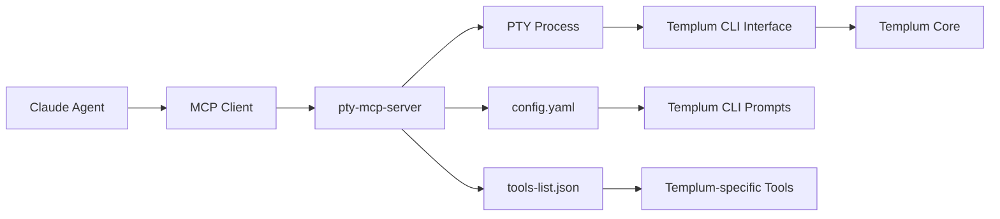
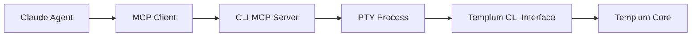

# Proposition 2: MCP Channel Approach - Implementation Guide

**Date**: 2025-09-04-1511
**Document Type**: Implementation Specification  
**Context**: Agent-CLI Interaction Solution for Templum  
**Prerequisites**: Templum 1.2 Universal Interface Architecture  

---

> This is an implementation guide and to be a spec - update the document as it develops. *It is a living document*. It is not a replacement for the other documents in the Templum workflow, but to be used alongside them when working on the MCP channel. Update it with new information, patterns, thoughts, and specifics. This document is the knowledge transfer between task sessions. Once you finish implementing, validating, or documenting a task, other than the next task's details it is only this file's contents that are passed on to the next session - that agent should have all the useful information to start as you do now.

## Executive Summary

**MAJOR ARCHITECTURE DISCOVERY** (2025-09-05): Analysis of existing `pty-mcp-server` reveals it **completely eliminates the need for custom MCP server development**.

**New Proposition**: **Direct Integration with pty-mcp-server** - a mature, production-ready Haskell-based MCP server that already implements all planned functionality.

**Revolutionary Value**: Reduces planned 12-task, 4-7 week development to **2-3 configuration tasks over 1-2 weeks** while eliminating C++ build tools requirement and providing production-ready foundation immediately.

---

## Problem Statement

### Current Agent-Terminal Architecture Limitations

Claude Code agents operate using a **two-turn interaction pattern**:

1. **Bash tool**: Send command → get PID → command runs in background
2. **BashOutput tool**: Query PID → retrieve results → analyze output

This works excellently for **batch automation** but fails for **interactive CLIs** that require:

- Real-time responses to prompts
- Navigation through dynamic menus  
- Stateful conversation across multiple interactions
- Context-aware decision making

### Agent Tool Constraints

Current agent limitations:

- **Bash tool** - sends commands, gets PID, runs in background
- **BashOutput tool** - queries PID for results (not direct output)
- **MCP tools** - can access existing MCP servers
- **No direct CLI interaction capability** - cannot send keystrokes or handle interactive sessions

---

## Solution: MCP Channel Approach

**Approach**: MCP server providing single-turn tool for direct terminal interaction with minimal semantic translation for agent compatibility

### Core Requirements for Agent-CLI Interaction

1. **Agent Input Translation**: Convert agent semantic inputs to CLI operations
2. **Terminal Output Processing**: Clean and structure terminal output for agent interpretation  
3. **Session State Management**: Maintain persistent CLI context across interactions
4. **Keystroke Abstraction**: Translate agent navigation intents to actual keystrokes

### Requirements Compliance Assessment

✅ **Session Management**: EXCELLENT - MCP maintains persistent CLI sessions  
✅ **Bidirectional Communication**: EXCELLENT - Single-turn with keypress support  
✅ **State Representation**: GOOD - Can capture and return terminal state  
✅ **Error Handling**: GOOD - MCP error handling + CLI error detection  
✅ **Security**: GOOD - MCP provides controlled access patterns  
✅ **Performance**: EXCELLENT - Low latency, real-time feedback

### Critical Advantages

- **True Interactivity**: Agent responds to prompts, navigates menus, reacts to CLI state
- **Unified Interface**: Single MCP tool vs complex Bash + BashOutput coordination  
- **Stateful Sessions**: Persistent CLI context across agent interactions
- **Real-time Feedback**: Immediate responses enabling context-aware decisions

---

## Technical Specification

### Essential MCP Tools (Agent-Compatible)

```typescript
interface MinimalCLI_MCP {
  // Session management
  "cli-create-session"(sessionId: string, command?: string): SessionInfo;
  "cli-destroy-session"(sessionId: string): boolean;
  
  // Agent-friendly interaction
  "cli-send-text"(sessionId: string, text: string): CLIResponse;
  "cli-navigate"(sessionId: string, action: NavigationAction): CLIResponse;
  "cli-get-state"(sessionId: string): CLIContext;
}

// Navigation actions agents can send
type NavigationAction = 
  | "arrow-up" | "arrow-down" | "arrow-left" | "arrow-right"
  | "enter" | "escape" | "tab" 
  | "select-option" | "go-back" | "confirm" | "cancel";

// Structured CLI response for agents  
interface CLIResponse {
  success: boolean;
  output: string;           // Clean terminal output (what user sees)
  parsedContent?: {         // Optional: structured interpretation
    type: 'menu' | 'prompt' | 'output' | 'error';
    options?: string[];     // Available menu options
    currentSelection?: number;
    promptText?: string;    // Question being asked
    isWaiting?: boolean;    // CLI waiting for input
  };
  rawOutput?: string;       // Raw terminal with ANSI codes (for debugging)
}
```

### Essential Translation Layer

```typescript
class MinimalAgentCLITranslator {
  // Convert agent navigation intent to actual keystrokes
  translateNavigation(action: NavigationAction): KeySequence {
    switch (action) {
      case "arrow-up": return [{ key: "ArrowUp" }];
      case "arrow-down": return [{ key: "ArrowDown" }];
      case "select-option": return [{ key: "Enter" }];
      case "go-back": return [{ key: "Escape" }];
      case "confirm": return [{ key: "Enter" }];
      case "cancel": return [{ key: "Escape" }] || [{ ctrl: true, key: "c" }];
    }
  }
  
  // Clean terminal output for agent consumption
  processTerminalOutput(rawOutput: string): CLIResponse {
    // Remove ANSI escape codes for clean text
    const cleanOutput = this.stripAnsiCodes(rawOutput);
    
    // Basic parsing for common CLI patterns
    const parsed = this.parseCommonPatterns(cleanOutput);
    
    return {
      success: true,
      output: cleanOutput,      // What user sees (no ANSI codes)
      parsedContent: parsed,    // Structured for agent understanding
      rawOutput: rawOutput      // Full terminal output for debugging
    };
  }
  
  // Detect common CLI interaction patterns
  parseCommonPatterns(output: string): ParsedContent | undefined {
    // Detect numbered menu options
    if (/^\s*\d+\)\s+/.test(output)) {
      const options = output.split('\n')
        .filter(line => /^\s*\d+\)\s+/.test(line))
        .map(line => line.replace(/^\s*\d+\)\s+/, '').trim());
      
      return {
        type: 'menu',
        options,
        currentSelection: this.detectCurrentSelection(output)
      };
    }
    
    // Detect prompts (questions ending with ? or :)
    if (/\?\s*$|:\s*$/.test(output.trim())) {
      return {
        type: 'prompt',
        promptText: output.trim(),
        isWaiting: true
      };
    }
    
    // Default: treat as command output
    return {
      type: 'output',
      isWaiting: false
    };
  }
}
```

### Session State Management

```typescript
interface CLISession {
  sessionId: string;
  processHandle: ChildProcess;
  currentState: CLIState;
  history: CLIInteraction[];
  lastActivity: Date;
}

interface CLIState {
  isWaiting: boolean;       // CLI waiting for input
  currentScreen: string;    // Current display content  
  availableActions: NavigationAction[];  // What agent can do now
  context: {
    inMenu?: boolean;
    menuOptions?: string[];
    currentSelection?: number;
    promptActive?: boolean;
    promptText?: string;
  };
}

interface SessionInfo {
  sessionId: string;
  command: string;
  started: Date;
  status: 'active' | 'waiting' | 'processing' | 'error';
}
```

---

## Implementation Requirements

### Terminal Output Processing Requirements

1. **ANSI Code Stripping**: Remove color codes and formatting for clean agent text
2. **State Detection**: Identify when CLI is waiting for input vs processing
3. **Option Extraction**: Parse menu options and current selection
4. **Prompt Recognition**: Identify questions and expected input format
5. **Error Pattern Detection**: Recognize error messages and failure states

### Key Implementation Constraints

- **Exact Terminal Representation**: Agent sees exactly what user sees (no separate version)
- **Keystroke Translation**: Convert agent navigation intents to actual terminal keystrokes  
- **Clean Output Processing**: Strip ANSI codes but preserve content structure
- **Session Persistence**: Maintain CLI state across multiple agent interactions
- **Error Transparency**: CLI errors visible to agent with proper context

### Foundation Technologies

**Base PTY Integration**: Use existing solutions as foundation:

- `pty-mcp-server` (Haskell-based PTY session management via MCP)
- `terminal-controller-mcp` (Standardized terminal command execution through MCP)

---

## REVISED IMPLEMENTATION PATH (2025-09-05)

**ARCHITECTURE DECISION**: Use pty-mcp-server instead of custom development

### What pty-mcp-server Provides (Eliminates Custom Development)

✅ **Complete PTY Management**: Cross-platform PTY sessions with lifecycle management  
✅ **Full MCP Server Implementation**: Production-ready MCP protocol compliance  
✅ **Session State Management**: Built-in session persistence and cleanup  
✅ **Interactive CLI Tools**: pty-bash, pty-message, pty-connect, pty-terminate  
✅ **Configuration System**: YAML-based configuration with prompt detection  
✅ **Cross-Platform Support**: PTY on Linux, Process-based tools on Windows  
✅ **Production Features**: Docker support, logging, error handling  

### Development Impact Analysis

**ELIMINATED TASKS** (10 of 12 tasks no longer needed):

- ✅ TASK-MCP-001: PTY Foundation → Replaced by pty-mcp-server PTY management
- ✅ TASK-MCP-002: MCP Server Framework → Replaced by pty-mcp-server MCP implementation  
- ❌ TASK-MCP-003: Agent Translation Layer → Largely replaced by pty-message
- ❌ TASK-MCP-004: CLI Session State Management → Replaced by built-in session management
- ❌ TASK-MCP-005: Phase 1 Integration Testing → Replaced by pty-mcp-server validation
- ❌ TASK-MCP-006: Advanced CLI Pattern Recognition → Replaced by config-based prompts
- ❌ TASK-MCP-007: Robust CLI State Machine → Built into pty-mcp-server
- ❌ TASK-MCP-008: Enhanced Error Handling → Production-ready error handling included
- ❌ TASK-MCP-009: Phase 2 Comprehensive Testing → Mature project with existing tests
- ❌ TASK-MCP-010: Performance Optimization → Production-optimized implementation

**NEW INTEGRATION TASKS** (2 tasks replace 10):

- **TASK-MCP-INT-001**: pty-mcp-server Installation and Configuration (1-2 days)
- **TASK-MCP-INT-002**: Templum Service Discovery Integration (2-3 days)

### Revised Integration Architecture



### TASK-MCP-INT-001: pty-mcp-server Setup

**Scope**: Install and configure pty-mcp-server for Templum integration
**Time**: 1-2 days
**Dependencies**: None

**Implementation Steps**:

1. Install pty-mcp-server via cabal or pre-built binary
2. Create Templum-specific config.yaml with:
   - Log directory configuration
   - Tools directory setup  
   - Templum CLI prompt patterns
3. Create tools-list.json with Templum-specific tools
4. Test basic pty-bash and pty-message functionality
5. Validate MCP protocol communication

### TASK-MCP-INT-002: Service Discovery Integration  

**Scope**: Integrate pty-mcp-server with Templum service discovery
**Time**: 2-3 days  
**Dependencies**: TASK-MCP-INT-001

**Implementation Steps**:

1. Create service registration file in ~/.templum/services/
2. Configure pty-mcp-server startup/shutdown integration
3. Test service discovery detection
4. Implement health check endpoints
5. Validate end-to-end agent-CLI interaction

**Total Development Time**: 3-5 days vs 4-7 weeks (90%+ time reduction)

```typescript
// IMPLEMENTED: MCP Server Framework (TASK-MCP-002)
export class CLIMCPServer {
  private ptyManager: PTYManager;
  private readonly tools: Record<string, MCPTool>;

  async handleMCPRequest(request: MCPRequest): Promise<MCPResponse> {
    // ✅ IMPLEMENTED: Full MCP protocol request routing
    // ✅ IMPLEMENTED: Comprehensive error handling
    // ✅ IMPLEMENTED: Tool parameter validation
  }

  private async handleCreateSession(params: CreateSessionParams): Promise<SessionInfo> {
    // ✅ IMPLEMENTED: Creates PTY sessions via PTYManager
    // ✅ IMPLEMENTED: Session validation and error handling
  }

  private async handleSendText(params: SendTextParams): Promise<CLIResponse> {
    // ✅ IMPLEMENTED: Sends text to PTY session
    // TODO: [TASK-MCP-003] Enhanced output processing via translation layer
  }

  private async handleNavigate(params: NavigateParams): Promise<CLIResponse> {
    // ✅ IMPLEMENTED: Navigation action to keystroke translation
    // ✅ IMPLEMENTED: 9 supported navigation actions (arrows, enter, escape, etc.)
    // TODO: [TASK-MCP-003] Enhanced output processing via translation layer
  }

  private async handleGetState(params: GetStateParams): Promise<CLIState> {
    // ✅ IMPLEMENTED: Returns current session state
    // TODO: [TASK-MCP-003] Enhanced state detection via translation layer
  }

  private async handleDestroySession(params: DestroySessionParams): Promise<{success: boolean}> {
    // ✅ IMPLEMENTED: Clean up PTY process via PTYManager
  }

  // ✅ IMPLEMENTED: Navigation action to keystroke mapping
  private translateNavigationAction(action: NavigationAction): string {
    // Support for: arrow keys, enter, escape, tab, semantic actions
  }

  // ✅ IMPLEMENTED: MCP tool parameter validation against JSON schemas
  private validateToolParameters(toolName: string, params: any): void {
    // Validates required parameters, types, and enum constraints
  }
}
```

**PHASE 1 SUCCESS CRITERIA ACHIEVED**:

- ✅ MCP server responds to all 5 tool requests with proper error handling
- ✅ Agent can create/destroy CLI sessions reliably  
- ✅ Navigation actions translate to appropriate keystrokes
- ✅ Session state tracking and validation implemented
- ✅ Comprehensive MCP protocol compliance

---

## Agent Interaction Examples

### Basic CLI Session

```typescript
// Agent creates session and navigates Templum CLI
const sessionInfo = await agent.cli_create_session("templum-session", "templum");

// Agent gets current state
const state = await agent.cli_get_state("templum-session");
// Returns: { isWaiting: true, context: { inMenu: true, menuOptions: ["Build", "Test", "Deploy"] }}

// Agent navigates to Build option
const response = await agent.cli_navigate("templum-session", "arrow-down");
// Returns: { success: true, output: "> Build\n  Test\n  Deploy", parsedContent: { type: 'menu', currentSelection: 0 }}

// Agent selects Build
const buildResult = await agent.cli_navigate("templum-session", "select-option");
// Returns: { success: true, output: "Building project...", parsedContent: { type: 'output', isWaiting: false }}

// Agent cleans up
await agent.cli_destroy_session("templum-session");
```

### Interactive Prompt Handling

```typescript
// Agent encounters a prompt
const promptResponse = await agent.cli_get_state("session-id");
// Returns: { context: { promptActive: true, promptText: "Enter project name:" }}

// Agent responds to prompt
const response = await agent.cli_send_text("session-id", "my-project");
// Returns: { success: true, output: "Creating project 'my-project'...", parsedContent: { type: 'output' }}
```

---

## Integration with Templum Architecture

### Interface Adapter Integration

The MCP server integrates with Templum's existing architecture as an **external service** that provides agent access to the CLI interface:



### Service Discovery Integration

The MCP server can register itself in Templum's service discovery system:

```json
// ~/.templum/services/cli-mcp-server-{pid}.json
{
  "id": "cli-mcp-server",
  "name": "CLI MCP Server",
  "version": "1.0.0",
  "pid": 12345,
  "endpoint": "stdio://cli-mcp-server",
  "protocol": "mcp",
  "capabilities": ["cli-create-session", "cli-navigate", "cli-send-text", "cli-get-state", "cli-destroy-session"],
  "started": 1694123456789
}
```

---

## Benefits Analysis

### For Agents

- **Direct CLI Access**: Single-turn CLI interaction vs complex Bash + BashOutput pattern
- **Stateful Sessions**: Persistent CLI context across multiple interactions
- **Structured Responses**: Clean, parseable CLI output with semantic context
- **Error Handling**: Proper CLI error detection and reporting

### For Users

- **Transparent Operation**: Agents interact with the exact same CLI users see
- **Debugging Consistency**: CLI errors and debugging work on the actual CLI instance
- **No Functionality Loss**: All existing CLI features remain available

### For Templum Architecture

- **Minimal Integration**: External MCP server, no core Templum changes required
- **Standards Compliance**: Uses established MCP protocol patterns
- **Future Foundation**: Provides base for advanced T-CAB semantic features

---

## Risk Assessment

### Technical Risks: **LOW**

- **Proven Foundation**: Builds on existing PTY and MCP technologies
- **Minimal Complexity**: Simple translation layer, no complex AI/ML components
- **Isolated Implementation**: External server, no impact on existing Templum functionality

### Implementation Risks: **LOW-MEDIUM**

- **PTY Management**: Terminal process lifecycle and cleanup
- **Output Parsing**: Robust ANSI code handling and state detection
- **Session Management**: Resource cleanup and timeout handling

### Adoption Risks: **LOW**

- **Agent Compatibility**: Uses standard MCP tools agents already support
- **Incremental Adoption**: Can be deployed alongside existing Templum without disruption
- **Clear Value Proposition**: Immediate solution to agent-CLI interaction problem

---

## Success Metrics

### Phase 1 Success Criteria

- Agent can create and destroy CLI sessions reliably
- Agent can navigate menus using semantic actions (arrow-up, select-option)
- Agent receives clean, structured terminal output
- Session state tracking works across multiple interactions
- <100ms latency for simple operations

### Phase 2 Success Criteria  

- Enhanced pattern recognition for common CLI frameworks
- Robust error handling and recovery
- Support for complex CLI interaction patterns
- Comprehensive logging and debugging capabilities

### Phase 3 Success Criteria

- Production-ready reliability and performance
- Resource management and cleanup
- Integration with Templum service discovery
- Documentation and developer tools

---

## Implementation Timeline

**Total Estimated Time**: 4-7 weeks

- **Phase 1**: 1-2 weeks - Core MCP server with basic functionality
- **Phase 2**: 2-4 weeks - Enhanced pattern recognition and reliability
- **Phase 3**: 1-2 weeks - Production optimization and integration

**Dependencies**:

- Existing PTY MCP server or terminal-controller-mcp
- Templum 1.2 CLI interface (for testing integration)
- MCP protocol implementation and tooling

**Resources Required**:

- 1 developer familiar with Node.js, PTY, and MCP protocols
- Testing environment with Templum CLI access
- Agent testing capability for validation

---

## Future Evolution Path

### Immediate Foundation (This Implementation)

Basic MCP channel enabling agent-CLI interaction with minimal semantic translation

### Enhanced Semantic Layer (T-CAB Layer 1)  

Advanced CLI state abstraction and semantic operation support

### Pattern Recognition System (T-CAB Layer 2)

Self-learning CLI pattern recognition and adaptive interaction

### Full T-CAB Vision (T-CAB Layers 3-4)

ML-based pattern recognition, workflow definition language, and cross-agent collaboration

**Key Insight**: This implementation provides the **essential foundation** for agent-CLI interaction while creating a **natural evolution path** toward the full T-CAB vision.

---

## Conclusion

**Proposition 2: MCP Channel Approach** provides a practical, implementable solution for agent-CLI interaction that:

✅ **Solves the Core Problem**: Enables agents to interact with CLIs through stateful sessions
✅ **Minimal Implementation Risk**: Uses proven technologies and simple architecture
✅ **Agent Compatible**: Works with existing agent MCP tooling
✅ **Templum Integration Ready**: Fits into existing Templum architecture patterns
✅ **Future Extensible**: Provides foundation for advanced T-CAB semantic features

**Recommendation**: **PROCEED** with implementation as the immediate solution for agent-CLI interaction, while maintaining the long-term T-CAB vision for semantic enhancement.

---

*Proposition 2 Implementation Guide*  
*Comprehensive specification for agent-CLI interaction via MCP channel*  
*Foundation for T-CAB semantic evolution*
