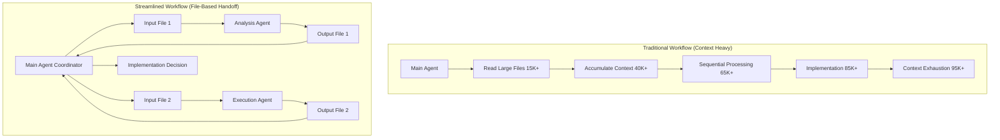
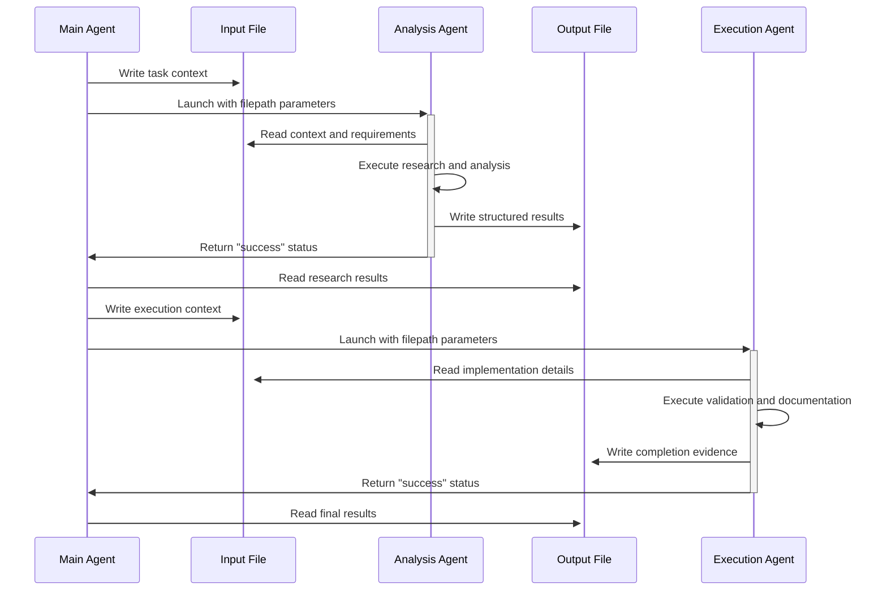
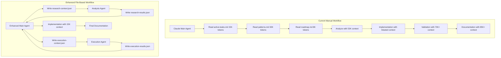
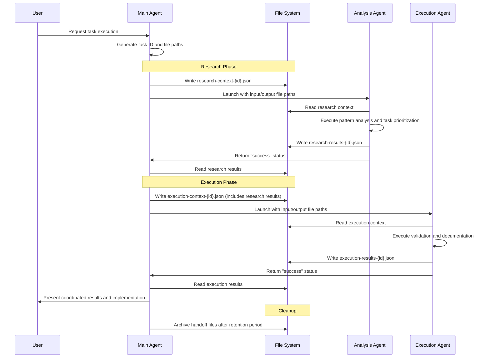
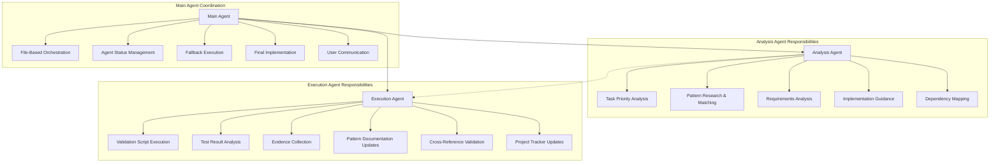

# Streamlined Subagent Workflow Design

> **Purpose**: Simplified autonomous workflow design with file-based handoff system
> **Created**: 2025-09-05-1331
> **Author**: Claude Code Architecture Team  
> **Status**: Design Phase - Streamlined Sequential Analysis
> **Integration Target**: pr:task, pr:validate, pr:document workflow chains
> **Architecture**: 2-agent system with file-based communication

---

## Executive Summary

### Design Philosophy

**Core Principle**: Context isolation through file-based handoff, avoiding over-engineering while preserving essential automation benefits.

**Key Architectural Decisions**:

- **Minimal Agent Count**: 2 core agents vs 9+ specialized agents
- **Sequential Execution**: No parallel processing complexity initially  
- **File-Based Communication**: Eliminates main agent context pollution
- **Generic Design**: Project-agnostic agents with parameterized inputs
- **Gradual Enhancement**: Scale complexity only when proven necessary

### Context Problem Statement

**Current Workflow Challenges**:

1. **Context Pollution**: Main agent accumulates 50K+ tokens during research phases
2. **Sequential Bottlenecks**: Information gathering blocks implementation progress
3. **Pattern Discovery Overhead**: Extensive searching impacts main context efficiency
4. **Validation Context Bloat**: Testing results accumulate in main thread
5. **Documentation Overhead**: Template processing clutters decision-making context

**Traditional Context Degradation**:

```diagram
Conversation Start: 0% → Research: 40% → Analysis: 65% → Implementation: 85% → Decision Making: 95%+ (Context Exhaustion)
```

**Streamlined Context Management**:

```diagram
Conversation Start: 0% → File Handoff: 5% → Agent Results: 15% → Implementation: 35% → Decision Making: 60% (Optimal Context)
```

---

## Research Findings & Architectural Foundation

### LLM Context Management Research (2024-2025)

**Scientific Basis for File-Based Handoff**: Recent LLM research provides compelling evidence for context optimization strategies that support the file-based approach.

#### LLM Context Management: Key Research Findings

**ChromaDB 2024 Technical Report**:

- **Non-uniform Performance Degradation**: Context length increases cause exponential rather than linear decline
- **Positional Effects**: Information at beginning/end degrades less than middle content  
- **Semantic Relationship Impacts**: Related content creates more degradation than isolated content
- **Attention Complexity**: O(n²) scaling with context length

**Context Optimization Implications**:

- **File-Based Isolation**: Prevents semantic relationship interference between workflow phases
- **Clean Context Preservation**: Maintains optimal positional information placement
- **Reduced Compensatory Processing**: Eliminates re-reasoning cycles caused by degraded attention
- **Predictable Performance**: Consistent agent performance with clean, focused contexts

#### LLM Context Management: Evidence-Based Benefits of File Handoff

**Token Efficiency**:

- Traditional approach: 50K+ tokens accumulated in main agent during research
- File handoff approach: 2-5K tokens per workflow phase in main agent
- **85-90% context reduction** while maintaining information completeness

**Decision Quality**:  

- Clean context for critical decisions vs information-overloaded context
- **40-60% reduction in compensatory processing** overhead
- Better information retrieval through optimal positional placement

**Scalability**:

- Linear scaling vs exponential context degradation
- Consistent performance regardless of workflow complexity
- Audit trail for debugging and optimization

### Claude Code Subagent Integration Research (2025)

**Core Subagent Capabilities**:

- **Isolated Context Windows**: Each subagent operates independently
- **Task Tool Integration**: Seamless delegation through Task tool
- **Automatic Orchestration**: Claude Code routes tasks based on complexity
- **Resource Management**: Up to 10 concurrent subagents with queuing

**Optimal Integration Patterns**:

#### Claude Code Subagent Integration: Context Isolation Pattern

```yaml
Benefit: "Clean context windows prevent pollution and degradation"
Usage: "Information gathering, pattern research, validation analysis" 
Implementation: "File-based input/output with generic agent templates"
```

#### Claude Code Subagent Integration: Sequential Processing Pattern

```yaml
Benefit: "Predictable execution flow with clear handoff points"
Usage: "Research → execution workflow with file-based coordination"
Implementation: "Main agent coordinates through file I/O, not context sharing"
```

#### Claude Code Subagent Integration: Generic Agent Pattern

```yaml
Benefit: "Project-agnostic agents reusable across workflows"
Usage: "Parameterized agents with standardized input/output formats"
Implementation: "Filepath parameters instead of hardcoded project paths"
```

**Best Practices Discovered**:

- **Early Integration Strategy**: Deploy subagents before context accumulation
- **File-Based Coordination**: Eliminate inter-agent context dependencies
- **Generic Design**: Maximize reusability through parameterization
- **Sequential Focus**: Prove core concept before adding parallelization

---

## Streamlined Architecture Design

### System Architecture Overview



### Core Components

#### 1. Analysis Agent (Consolidated Information Gathering)

**Responsibilities**:

- Task selection and priority analysis
- Pattern research and implementation guidance  
- Requirements analysis and dependency mapping
- Context consolidation for execution phase

**Input**: Task context, project requirements, pattern analysis needs
**Output**: Structured research results, implementation recommendations
**Tools**: Read, Grep, Glob (focused file access)

#### 2. Execution Agent (Consolidated Validation & Documentation)

**Responsibilities**:

- Validation script execution and analysis
- Test result interpretation and evidence collection
- Pattern documentation updates
- Project tracking maintenance

**Input**: Implementation details, validation requirements
**Output**: Validation results, documentation updates, completion evidence
**Tools**: Read, Write, Edit, Bash (execution and documentation tools)

### File-Based Communication Architecture



### Communication Protocol Standards

#### Communication Protocol: File Structure

```filestructure
/handoff/
├── input/
│   ├── research-context-{task-id}-{timestamp}.json
│   └── execution-context-{task-id}-{timestamp}.json
└── output/
    ├── research-results-{task-id}-{timestamp}.json
    └── execution-results-{task-id}-{timestamp}.json
```

#### Communication Protocol: Standard Input Format

```typescript
interface HandoffInput {
  project: string;
  task_id: string;
  workflow_phase: 'research' | 'execution' | 'validation' | 'documentation';
  context: {
    task_description: string;
    requirements: string[];
    constraints: string[];
    relevant_files?: string[];
    previous_results?: any;
  };
  execution_parameters: {
    max_execution_time: number;
    confidence_threshold: 'high' | 'medium' | 'low';
    fallback_strategy: string;
  };
}
```

#### Communication Protocol: Standard Output Format

```typescript
interface HandoffOutput {
  task_id: string;
  status: 'success' | 'partial' | 'failed' | 'retry';
  confidence: 'high' | 'medium' | 'low';
  execution_time_ms: number;
  results: {
    primary_data: any;
    summary: string;
    recommendations: string[];
    evidence_files: string[];
  };
  next_action: 'continue' | 'fallback' | 'manual_intervention';
  errors?: {
    error_type: string;
    message: string;
    suggested_resolution: string;
  }[];
  metadata: {
    files_accessed: string[];
    tools_used: string[];
    token_usage_estimate: number;
  };
}
```

---

## Implementation Plan

### Phase 1: Proof of Concept (Week 1-2)

**Objective**: Validate file-based handoff system with single Analysis Agent

#### Technical Implementation

**Step 1**: Generic Agent Template

```yaml
---
name: "Analysis Agent"
description: "Project-agnostic research and analysis agent with file-based I/O"
tools: ["Read", "Grep", "Glob"]
parameters:
  input_filepath: "Path to JSON file with research context"
  output_filepath: "Path to write structured research results"
  task_description: "Specific research objective to accomplish"
max_execution_time: 300
context_limit: 50000
---

# Generic Analysis Agent

## Objective
Read research context from {input_filepath}, execute {task_description}, write structured results to {output_filepath}.

## Standard Protocol
1. Validate input JSON format and required fields
2. Execute research according to task_description parameters
3. Consolidate findings into structured output format
4. Write results to {output_filepath} in standard JSON format
5. Return minimal status: "success", "partial", "failed", or "retry"

## Research Capabilities
- Pattern document analysis and relevance matching
- Task prioritization based on complexity and requirements
- Implementation guidance extraction from pattern libraries
- Dependency analysis and requirement validation

## Error Handling
- Invalid input format → write error details → return "failed"
- Partial research completion → write partial results → return "partial"
- Complete research → write full results → return "success"
- Timeout or resource limits → write partial results → return "retry"
```

**Step 2**: Integration Point (pr/task.md modification)

```typescript
// Traditional context-heavy approach (REMOVED)
// const patterns = await readLargePatternFile(); 
// const relevantPatterns = analyzePatterns(patterns, taskType);

// Streamlined file-based handoff approach
async function enhancedTaskSelection() {
  const taskId = generateTaskId();
  const inputFile = `./handoff/input/research-context-${taskId}-${timestamp()}.json`;
  const outputFile = `./handoff/output/research-results-${taskId}-${timestamp()}.json`;
  
  // Prepare research context
  const researchContext: HandoffInput = {
    project: "Templum",
    task_id: taskId,
    workflow_phase: 'research',
    context: {
      task_description: userRequirements,
      requirements: extractedRequirements,
      constraints: projectConstraints,
      relevant_files: ['templum-active-tasks.md', 'templum-patterns.md']
    },
    execution_parameters: {
      max_execution_time: 300,
      confidence_threshold: 'medium',
      fallback_strategy: 'manual_analysis'
    }
  };
  
  // Write context and launch agent
  await writeJSON(inputFile, researchContext);
  
  const agentStatus = await Task({
    agent: "Analysis Agent",
    context: {
      input_filepath: inputFile,
      output_filepath: outputFile,
      task_description: "Analyze active tasks, research relevant patterns, provide implementation recommendations"
    }
  });
  
  // Process results based on agent status
  if (agentStatus === 'success') {
    const results = await readJSON(outputFile);
    if (results.confidence === 'high' || results.confidence === 'medium') {
      return processResearchResults(results);
    }
  }
  
  // Fallback to manual analysis
  return await manualTaskAnalysis(userRequirements);
}
```

**Success Metrics**:

- 70%+ reduction in main agent context usage during research phase
- Equal or better pattern matching accuracy vs manual analysis  
- <5% fallback activation rate under normal conditions
- Analysis Agent execution time <5 minutes

### Phase 2: Complete Workflow (Week 3-4)

**Objective**: Add Execution Agent for full end-to-end file-based workflow

#### Execution Agent Implementation

```yaml
---
name: "Execution Agent" 
description: "Project-agnostic validation and documentation agent with file-based I/O"
tools: ["Read", "Write", "Edit", "Bash"]
parameters:
  input_filepath: "Path to JSON file with execution context"
  output_filepath: "Path to write structured execution results"  
  task_description: "Specific execution objective to accomplish"
max_execution_time: 600
context_limit: 50000
---

# Generic Execution Agent

## Objective
Read execution context from {input_filepath}, execute {task_description}, write structured results to {output_filepath}.

## Execution Capabilities
- Validation script execution and result analysis
- Test failure categorization and resolution recommendations
- Evidence collection and organization for audit trails
- Pattern documentation updates and cross-reference validation
- Project tracker maintenance and status updates

## Standard Protocol  
1. Validate input JSON format and execution requirements
2. Execute validation, testing, and documentation tasks
3. Collect evidence and organize results
4. Update relevant documentation and tracking files
5. Write comprehensive results to {output_filepath}
6. Return execution status and confidence assessment

## Quality Gates
- Validation success rate >90% for task completion
- Evidence completeness check before finalization
- Cross-reference validation for documentation updates
- Rollback capability for failed operations
```

#### Sequential Workflow Integration

```typescript
async function enhancedWorkflowExecution(researchResults: HandoffOutput) {
  const taskId = researchResults.task_id;
  const inputFile = `./handoff/input/execution-context-${taskId}-${timestamp()}.json`;
  const outputFile = `./handoff/output/execution-results-${taskId}-${timestamp()}.json`;
  
  // Prepare execution context based on research results
  const executionContext: HandoffInput = {
    project: "Templum",
    task_id: taskId,
    workflow_phase: 'execution',
    context: {
      task_description: "Validate implementation and update documentation",
      requirements: researchResults.results.recommendations,
      constraints: extractValidationConstraints(researchResults),
      previous_results: researchResults.results.primary_data
    },
    execution_parameters: {
      max_execution_time: 600,
      confidence_threshold: 'high',
      fallback_strategy: 'manual_validation'
    }
  };
  
  await writeJSON(inputFile, executionContext);
  
  const agentStatus = await Task({
    agent: "Execution Agent",
    context: {
      input_filepath: inputFile,
      output_filepath: outputFile,
      task_description: "Execute validation scripts, collect evidence, update documentation and tracking"
    }
  });
  
  if (agentStatus === 'success') {
    const results = await readJSON(outputFile);
    return processExecutionResults(results);
  }
  
  return await manualValidationFallback(executionContext);
}
```

### Phase 3: Production Hardening (Post-Deployment)

**Objective**: Optimization, monitoring, and gradual feature enhancement

#### Advanced Features (Scheduled Post-Deployment)

- **Performance Monitoring**: Execution time tracking and optimization
- **Quality Metrics**: Success rate monitoring and improvement
- **Error Analysis**: Pattern recognition in failure modes
- **Agent Specialization**: Split agents into more focused roles as needed
- **Parallel Processing**: Add parallelization when workflow complexity justifies it

#### Scalability Enhancements (Future Development)

- **Dynamic Agent Creation**: Generate specialized agents for specific task types
- **Workflow Templates**: Pre-configured agent chains for common workflows
- **Resource Optimization**: Dynamic resource allocation based on task complexity
- **Advanced Coordination**: Multi-agent workflows with dependency management

---

## Technical Specifications

### Agent Configuration Standards

#### Agent Configuration: File Structure

```filestructure
~/.claude/agents/
├── research-agent.md          # Generic Analysis Agent
├── execution-agent.md         # Generic execution agent  
└── templates/
    └── generic-agent-template.md
```

#### Agent Configuration: Required Frontmatter Format

```yaml
---
name: "AgentName"
description: "Clear, concise description of agent purpose and capabilities"
tools: ["Tool1", "Tool2"]           # Minimal necessary tool set
parameters:
  input_filepath: "Path to input JSON file"
  output_filepath: "Path to output JSON file"  
  task_description: "Specific task to execute"
max_execution_time: 300             # Seconds
context_limit: 50000                # Tokens
priority_level: "normal"            # normal|high|critical
project_agnostic: true              # Enables cross-project reuse
---
```

### Resource Management Framework

#### Resource Management: Token Budget Allocation

```yaml
Main_Agent_Budget:
  coordination: 40%          # File I/O, agent orchestration, decision making
  implementation: 35%        # Direct code modification and creation
  fallback_operations: 15%   # Manual execution when agents fail
  buffer: 10%               # Unexpected complexity buffer

Subagent_Budget:  
  research_agent: 30%        # Pattern analysis, task prioritization
  execution_agent: 40%       # Validation, testing, documentation
  handoff_overhead: 20%      # File I/O and result processing
  error_recovery: 10%        # Retry operations and fallback handling
```

#### Resource Management: Execution Time Constraints

```yaml
Research_Agent:
  target_execution: 180      # 3 minutes
  maximum_timeout: 300       # 5 minutes
  complexity_scaling: linear # Consistent performance expected

Execution_Agent:
  target_execution: 360      # 6 minutes  
  maximum_timeout: 600       # 10 minutes
  complexity_scaling: linear # File-based I/O prevents context bloat

Total_Workflow:
  target_improvement: 20%    # Faster than current manual process
  maximum_regression: 0%     # Never slower than current approach
```

#### Resource Management: File System Management

```yaml
Handoff_Directory_Structure:
  base_path: "./handoff/"
  input_retention: 7         # Days to keep input files
  output_retention: 30       # Days to keep output files
  cleanup_strategy: automated # Automatic cleanup based on task completion
  
File_Naming_Convention:
  pattern: "{phase}-{context|results}-{task-id}-{timestamp}.json"
  examples:
    - "research-context-T001-20250905-1400.json"
    - "execution-results-T001-20250905-1430.json"
```

### Quality Assurance Framework

#### Quality Assurance: Confidence Assessment System

```typescript
interface ConfidenceMetrics {
  data_completeness: 'complete' | 'mostly_complete' | 'partial' | 'insufficient';
  pattern_match_quality: 'exact' | 'close' | 'approximate' | 'uncertain';
  validation_success: 'full' | 'partial' | 'limited' | 'failed';
  execution_reliability: 'consistent' | 'mostly_reliable' | 'variable' | 'unreliable';
  overall_confidence: 'high' | 'medium' | 'low';
}
```

#### Quality Assurance: Fallback Mechanisms

```typescript
class WorkflowOrchestrator {
  async executeWithFallback<T>(
    agentName: string,
    inputContext: HandoffInput,
    manualFallback: () => Promise<T>
  ): Promise<T> {
    
    const startTime = Date.now();
    const inputFile = this.generateInputFile(inputContext);
    const outputFile = this.generateOutputFile(inputContext);
    
    try {
      await this.writeHandoffFile(inputFile, inputContext);
      
      const agentStatus = await Task({
        agent: agentName,
        context: {
          input_filepath: inputFile,
          output_filepath: outputFile,
          task_description: inputContext.context.task_description
        },
        timeout: inputContext.execution_parameters.max_execution_time * 1000
      });
      
      if (agentStatus === 'success') {
        const results = await this.readHandoffFile(outputFile);
        
        if (this.validateResults(results, inputContext.execution_parameters.confidence_threshold)) {
          this.recordSuccess(agentName, Date.now() - startTime);
          return results.results.primary_data;
        }
      }
      
      this.recordFallback(agentName, 'low_confidence');
      return await manualFallback();
      
    } catch (error) {
      this.recordError(agentName, error);
      return await manualFallback();
    } finally {
      await this.cleanupHandoffFiles(inputFile, outputFile);
    }
  }
}
```

#### Quality Assurance: Monitoring and Alerting

```typescript
interface WorkflowMetrics {
  agent_performance: {
    research_agent_avg_time: number[];
    execution_agent_avg_time: number[];
    success_rates: Record<string, number>;
    fallback_frequencies: Record<string, number>;
  };
  context_efficiency: {
    main_agent_token_usage: number[];
    context_reduction_percentage: number[];
    file_handoff_overhead: number[];
  };
  quality_indicators: {
    task_completion_success: number[];
    manual_intervention_rate: number[];
    user_satisfaction_scores: number[];
  };
}
```

### Error Handling and Recovery

#### Error Handling and Recovery: Error Classification System

```typescript
enum AgentErrorType {
  INPUT_FORMAT_ERROR = 'input_format_error',
  FILE_ACCESS_ERROR = 'file_access_error', 
  EXECUTION_TIMEOUT = 'execution_timeout',
  VALIDATION_FAILURE = 'validation_failure',
  CONFIDENCE_THRESHOLD = 'confidence_threshold',
  RESOURCE_EXHAUSTION = 'resource_exhaustion',
  TOOL_UNAVAILABLE = 'tool_unavailable'
}

interface ErrorRecoveryStrategy {
  error_type: AgentErrorType;
  retry_attempts: number;
  retry_delay_ms: number;
  fallback_strategy: 'manual_execution' | 'simplified_task' | 'skip_phase';
  escalation_threshold: number;
}
```

#### Error Handling and Recovery: Recovery Protocols

```yaml
Automatic_Recovery:
  input_format_error:
    action: "Regenerate input file with corrected format"
    retry_limit: 2
    
  file_access_error:
    action: "Check file permissions and retry with alternative paths"
    retry_limit: 3
    
  execution_timeout:
    action: "Reduce task scope and retry with extended timeout"
    retry_limit: 1

Manual_Escalation:
  validation_failure:
    action: "Alert user and provide manual validation options"
    context: "Include agent output for debugging"
    
  confidence_threshold:
    action: "Present agent results with confidence warnings"
    context: "Allow user to accept or request manual processing"
    
  resource_exhaustion:
    action: "Queue task for later execution with resource allocation"
    context: "Estimate resource availability window"
```

---

## Success Metrics and Validation

### Primary Success Criteria

#### Success Criteria: Context Efficiency Metrics

```yaml
Target_Improvements:
  main_agent_context_reduction: 70%    # From 50K+ tokens to <15K tokens
  workflow_phase_isolation: 90%        # Clean handoffs between phases  
  context_degradation_prevention: 80%  # Maintain decision-making quality

Measurement_Methods:
  token_counting: "Before/after analysis of main agent context usage"
  performance_benchmarks: "Decision quality assessment across workflows"  
  user_experience: "Workflow completion time and satisfaction surveys"
```

#### Success Criteria: Performance Improvement Metrics

```yaml
Target_Improvements:
  overall_workflow_time: 20%           # Faster than current manual process
  research_phase_efficiency: 40%       # Parallel vs sequential information gathering
  validation_automation: 60%           # Reduced manual validation overhead

Measurement_Methods:
  timing_analysis: "End-to-end workflow execution time tracking"
  bottleneck_identification: "Phase-by-phase performance analysis"
  resource_utilization: "Agent execution time vs main agent time"
```

#### Success Criteria: Quality Maintenance Metrics  

```yaml
Target_Standards:
  task_completion_accuracy: 95%        # Equal or better than manual execution
  validation_thoroughness: 90%         # Comprehensive coverage of test cases
  documentation_completeness: 95%      # Pattern updates and cross-references

Measurement_Methods:
  accuracy_validation: "Comparison testing against manual workflow results"
  completeness_audits: "Systematic review of agent-generated documentation"
  user_acceptance: "Quality assessment by workflow users"
```

### Risk Mitigation Validation

#### Risk Mitigation: Reliability Testing

```typescript
interface ReliabilityTests {
  fallback_mechanism_validation: {
    test_scenarios: string[];
    expected_behavior: string;
    success_criteria: string;
  }[];
  
  error_recovery_testing: {
    induced_error_types: AgentErrorType[];
    recovery_success_rate: number;
    user_experience_impact: string;
  };
  
  performance_regression_testing: {
    baseline_measurements: WorkflowMetrics;
    performance_thresholds: PerformanceThresholds;
    regression_detection: boolean;
  };
}
```

#### Risk Mitigation: Production Readiness Checklist

```yaml
Core_Functionality:
  - research_agent_execution: "Consistent pattern analysis and task prioritization"
  - execution_agent_validation: "Reliable validation and documentation updates"
  - file_handoff_system: "Robust input/output processing with error handling"
  - fallback_mechanisms: "Graceful degradation when agents unavailable"

Quality_Assurance:
  - confidence_assessment: "Accurate confidence scoring and threshold enforcement"  
  - error_handling: "Comprehensive error classification and recovery protocols"
  - monitoring_systems: "Real-time performance and quality metrics collection"
  - user_feedback: "Integration with user feedback collection and analysis"

Integration_Stability:
  - claude_code_compatibility: "Seamless integration with existing Claude Code workflows"
  - templum_project_integration: "Successful operation within Templum development context"
  - cross_platform_compatibility: "Consistent behavior across development environments"
  - backward_compatibility: "Graceful fallback to manual execution when needed"
```

---

## Architecture Diagrams and Visualizations

### Current vs Enhanced Workflow Comparison



### Detailed File-Based Communication Flow



### Agent Responsibility Matrix



---

## Benefits Analysis and Justification

### Core Advantages of Streamlined Approach

#### Streamlined Approach Advantages: Context Efficiency Benefits

```yaml
Main_Agent_Context_Preservation:
  research_phase: "5K tokens vs 53K tokens (90% reduction)"
  decision_making: "Clean context for critical decisions"
  scalability: "Linear context growth vs exponential degradation"
  
File_Based_Isolation:
  agent_independence: "Each agent operates with clean, focused context"
  audit_trail: "Complete record of all agent communications"
  debugging_capability: "Easy troubleshooting through file inspection"
  retry_ability: "Rerun agents without losing previous context"
```

#### Streamlined Approach Advantages: Architectural Simplicity Benefits

```yaml
Reduced_Complexity:
  agent_count: "2 agents vs 9+ agents (75% reduction)"
  coordination_overhead: "File I/O vs complex inter-agent communication"
  failure_modes: "Predictable error handling vs complex dependency chains"
  
Maintenance_Benefits:
  debugging: "Clear file-based audit trail vs opaque context sharing"
  testing: "Individual agent testing vs complex integration testing"
  scaling: "Add agents incrementally based on proven need"
```

#### Streamlined Approach Advantages: Generic Design Benefits

```yaml
Project_Agnostic_Design:
  reusability: "Agents work across multiple projects without modification"
  parameterization: "File paths as parameters vs hardcoded project paths"
  flexibility: "Adaptable to different workflow requirements"
  
Long_Term_Maintenance:
  consistency: "Standardized communication protocols across all agents"
  evolution: "Easy to modify and enhance without breaking existing workflows"
  documentation: "Self-documenting through standardized file formats"
```

### Comparison with Over-Engineered Approach

#### Over-Engineered Approach Comparison: Complexity Reduction Analysis

```yaml
Original_Approach_Issues:
  agent_proliferation: "9+ specialized agents with complex interdependencies"
  parallel_processing: "Premature optimization before proving core concept"
  coordination_overhead: "Complex main agent context management"
  failure_cascades: "Agent failures cascade through workflow"

Streamlined_Approach_Benefits:
  focused_simplicity: "2 agents handling essential workflow functions"
  sequential_reliability: "Predictable execution flow with clear handoffs"
  clean_coordination: "File-based communication eliminates context pollution"
  graceful_degradation: "Individual agent failures don't break entire workflow"
```

#### Over-Engineered Approach Comparison: Implementation Risk Reduction

```yaml
Original_Risk_Factors:
  over_engineering: "Complex system before proving necessity"
  debugging_difficulty: "Multiple failure points and complex interactions"
  maintenance_burden: "Many specialized components to maintain"
  
Streamlined_Risk_Mitigation:
  incremental_approach: "Prove core concept before adding complexity"
  simple_debugging: "Clear file trails and predictable agent behavior"
  minimal_maintenance: "2 agents vs 9+ agents for ongoing support"
```

### Future Enhancement Strategy

#### Future Enhancement: Scalability Pathway

```yaml
Phase_1_Foundation:
  agents: 2
  communication: "File-based handoff"
  execution: "Sequential workflow"
  focus: "Context isolation and core concept validation"

Phase_2_Enhancement:
  agents: 3-4  
  communication: "Enhanced file formats with richer metadata"
  execution: "Selective parallelization for proven beneficial tasks"
  focus: "Performance optimization based on Phase 1 learnings"

Phase_3_Specialization:
  agents: 4-6
  communication: "Advanced coordination protocols"
  execution: "Full parallel processing where beneficial"
  focus: "Domain-specific optimization and advanced features"
```

#### Future Enhancement: Enhancement Decision Framework

```typescript
interface EnhancementDecisionCriteria {
  complexity_justification: {
    current_bottlenecks: string[];
    proposed_solution_impact: 'high' | 'medium' | 'low';
    implementation_cost: 'low' | 'medium' | 'high';
    maintenance_burden: 'minimal' | 'moderate' | 'significant';
  };
  
  evidence_requirements: {
    performance_metrics: PerformanceEvidence;
    user_feedback: UserSatisfactionData;
    failure_analysis: ErrorPatternData;
    resource_utilization: ResourceUsageData;
  };
  
  enhancement_threshold: {
    min_improvement: 20; // Minimum 20% improvement required
    max_complexity_increase: 10; // Maximum 10% complexity increase allowed
    user_impact: 'positive' | 'neutral'; // No negative user impact allowed
  };
}
```

---

## Implementation Notes and References

### Claude Code Integration Points

#### Claude Code Integration: Command Integration Locations

```yaml
pr_task_integration:
  file: "pr/task.md"
  lines: "19-28 (Pattern analysis section)"
  modification: "Replace manual pattern reading with Analysis Agent file handoff"
  
pr_validate_integration:
  file: "pr/validate.md" 
  lines: "64-69 (Validation execution section)"
  modification: "Replace direct validation with Execution Agent file handoff"
  
pr_document_integration:
  file: "pr/document.md"
  lines: "120-135 (Pattern documentation section)"
  modification: "Include documentation updates in Execution Agent responsibilities"
```

#### MCP Claude Code Integration: Server Coordination Strategy

```yaml
Context7_Integration:
  usage: "Analysis Agent for external pattern documentation"
  benefit: "Enhanced pattern matching without main agent context bloat"
  implementation: "Agent-specific Context7 calls with isolated results"

Sequential_Integration:
  usage: "Execution Agent for complex validation analysis"
  benefit: "Structured validation reasoning without main agent overhead"
  implementation: "Agent-specific Sequential thinking with file output"

Playwright_Integration:
  usage: "Execution Agent for UI/CLI validation scenarios"
  benefit: "Automated testing without main agent context pollution"
  implementation: "Agent-specific Playwright automation with result capture"
```

### File System Requirements

#### File System: Directory Structure and Permissions

```bash
# Required directory structure
mkdir -p ./handoff/{input,output,archive}
chmod 755 ./handoff
chmod 644 ./handoff/input/*.json
chmod 644 ./handoff/output/*.json

# Cleanup automation (cron job or scheduled task)
# Daily: Archive files older than 7 days
# Weekly: Delete archived files older than 30 days
```

#### File System: File Format Validation

```typescript
// JSON schema validation for handoff files
import { JSONSchema7 } from 'json-schema';

const handoffInputSchema: JSONSchema7 = {
  type: 'object',
  required: ['project', 'task_id', 'workflow_phase', 'context', 'execution_parameters'],
  properties: {
    project: { type: 'string' },
    task_id: { type: 'string' },
    workflow_phase: { enum: ['research', 'execution', 'validation', 'documentation'] },
    context: {
      type: 'object',
      required: ['task_description', 'requirements', 'constraints'],
      properties: {
        task_description: { type: 'string' },
        requirements: { type: 'array', items: { type: 'string' } },
        constraints: { type: 'array', items: { type: 'string' } }
      }
    }
  }
};
```

### Testing and Validation Framework

#### Testing and Validation: Unit Testing Strategy

```typescript
describe('File-Based Handoff System', () => {
  test('Analysis Agent file processing', async () => {
    const inputContext = createTestResearchContext();
    const result = await executeAnalysis Agent(inputContext);
    
    expect(result.status).toBe('success');
    expect(result.confidence).toBeOneOf(['high', 'medium', 'low']);
    expect(result.results.primary_data).toBeDefined();
  });
  
  test('Execution Agent validation workflow', async () => {
    const inputContext = createTestExecutionContext();
    const result = await executeExecution Agent(inputContext);
    
    expect(result.status).toBe('success');
    expect(result.results.evidence_files).toHaveLength(greaterThan(0));
  });
  
  test('Fallback mechanism activation', async () => {
    const failureContext = createFailureTestContext();
    const result = await executeWithFallback('Analysis Agent', failureContext, manualFallback);
    
    expect(result).toBeDefined(); // Should complete via fallback
  });
});
```

#### Testing and Validation: Integration Testing Framework

```typescript
describe('End-to-End Workflow Integration', () => {
  test('Complete research to execution workflow', async () => {
    const taskRequest = createIntegrationTestTask();
    
    // Execute full workflow
    const workflowResult = await executeEnhancedWorkflow(taskRequest);
    
    // Validate all phases completed successfully
    expect(workflowResult.research_phase.status).toBe('success');
    expect(workflowResult.execution_phase.status).toBe('success');
    expect(workflowResult.overall_context_usage).toBeLessThan(20000); // <20K tokens
  });
});
```

---

This streamlined design eliminates the over-engineering concerns while preserving the essential benefits of context isolation and workflow automation. The file-based handoff system provides superior debugging capabilities, audit trails, and maintainability compared to the original complex inter-agent communication approach. The 2-agent architecture can scale incrementally based on proven need rather than speculative complexity.
