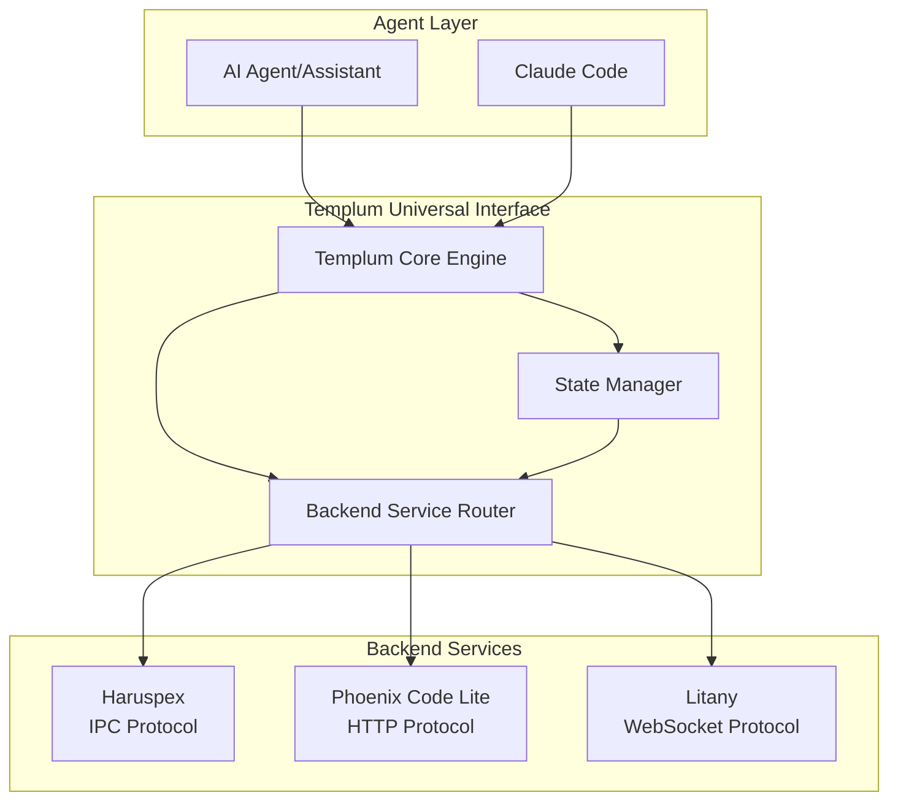

# 1.1 Agent Integration

## Agent Integration Guide

### Agent Integration Overview

Templum provides a unified interface for agent integration with backend components (PCL, Haruspex, Litany). The architecture ensures agents can access all backend services through a single API while backend components remain independent and protocol-agnostic.

### Agent Integration Architecture



### Agent Integration Patterns

#### 1. Unified Command Interface

Agents execute commands through Templum's universal interface:

```typescript
// Agent code - protocol-agnostic
const result = await templumCore.executeCommand(
  'analyze-codebase',
  'vscode', // interface type
  [{ targetPath: './src' }], // args
  { priority: 'high' } // context
);

// Templum routes to appropriate backend automatically
// - Routes to Haruspex via IPC for analysis
// - Routes to PCL via HTTP for TDD workflows  
// - Routes to Litany via WebSocket for context management
```

#### 2. Service-Agnostic Backend Access

```typescript
// Agent requests capabilities without knowing protocols
const backends = await templumCore.getSystemStatus();
const availableServices = backends.coreEngine.backendConnections.backends;

// Access any backend through unified interface
for (const [serviceId, status] of Object.entries(availableServices)) {
  if (status.connected && status.capabilities?.includes('analysis')) {
    const analysisResult = await templumCore.executeCommand(
      'deep-analysis',
      'vscode',
      [analysisParams],
      { preferredBackend: serviceId }
    );
  }
}
```

### Backend Component Integration

#### Haruspex Integration (IPC)

**Requirements:**

- Haruspex service running with IPC server
- Creates `.haruspex/haruspex-debug-connection.json` connection file
- Implements Haruspex IPC Protocol messages

**Connection Process:**

1. Haruspex starts and creates connection info file
2. Templum detects file and reads connection parameters  
3. Establishes IPC socket connection
4. Performs handshake and capability detection
5. Routes agent requests via IPC protocol

**Protocol Support:**

- `getSkinDefinition` - Skin definitions for UI
- `executeCommand` - Analysis and prediction commands
- `getCapabilities` - Service capability discovery
- `getVersion` - Version information

#### PCL Integration (HTTP)

**Requirements:**

- PCL HTTP server running on `localhost:3002`
- Implements REST API endpoints
- Supports JSON request/response format

**Connection Process:**

1. PCL starts HTTP server on configured port
2. Templum tests health endpoints for discovery
3. Establishes HTTP connection pool
4. Routes agent requests via HTTP API

**Endpoint Support:**

- `GET /api/skins/{skinId}` - TDD workflow skin definitions
- `POST /api/commands/execute` - TDD command execution
- `GET /api/capabilities` - Service capabilities
- `GET /api/version` - Service version info

#### Litany Integration (WebSocket)

**Requirements:**

- Litany WebSocket server running on `localhost:3003`
- Implements WebSocket message protocol
- Supports real-time bidirectional communication

**Connection Process:**

1. Litany starts WebSocket server
2. Templum establishes WebSocket connection
3. Performs handshake with service identification
4. Maintains persistent connection for real-time updates

**Message Support:**

- `getSkinDefinition` - Context-aware skin definitions
- `executeCommand` - Context management commands  
- `updateContext` - Real-time context synchronization
- `syncMemory` - Memory integration operations

### Agent Development Patterns

#### 1. Service Discovery and Health Checking

```typescript
// Check which backend services are available
const systemStatus = await templumCore.getSystemStatus();
const healthyBackends = Object.entries(systemStatus.coreEngine.backendConnections.backends)
  .filter(([_, status]) => status.connected && status.health === 'healthy')
  .map(([id, _]) => id);

console.log('Available backends:', healthyBackends);
```

#### 2. Graceful Degradation Handling

```typescript
// Templum provides fallback when backends unavailable
try {
  const result = await templumCore.executeCommand('analysis-command', 'vscode', args);
  // Will attempt real backend, fall back to local processing if needed
} catch (error) {
  // Handle case where no backends available
  console.warn('Backend services unavailable, using local fallback');
}
```

#### 3. Real-time State Synchronization

```typescript
// Subscribe to state changes across interfaces
templumCore.on('stateUpdate', (update) => {
  console.log('State synchronized across interfaces:', update);
  // Agent can react to state changes from any backend
});
```

### Troubleshooting Agent Integration

#### Common Issues

1. **No Backend Services Discovered**
   - Check if backend services are running on expected ports
   - Verify connection files exist (for Haruspex)
   - Check firewall/network connectivity

2. **Command Execution Failures**  
   - Verify backend service capabilities
   - Check command format and parameters
   - Review service logs for protocol errors

3. **State Synchronization Issues**
   - Ensure state manager is initialized
   - Check interface adapter status
   - Verify cross-interface communication

#### Debug Commands

```typescript
// Check backend connection status
const status = await templumCore.getSystemStatus();
console.log('Backend connections:', status.coreEngine.backendConnections);

// Test specific backend availability
const isAvailable = await templumCore.getBackendRouter().isServiceAvailable('haruspex');
console.log('Haruspex available:', isAvailable);

// Force backend service refresh
await templumCore.refreshBackendServices();
```

### Agent Integration Benefits

1. **Simplified Development**: Single API for all backend services
2. **Protocol Independence**: No need to handle IPC, HTTP, WebSocket directly  
3. **Automatic Service Discovery**: Backends detected and connected automatically
4. **Fault Tolerance**: Graceful degradation when services unavailable
5. **Unified State Management**: Consistent state across all interfaces
6. **Real-time Updates**: Receive notifications from any backend service

---
