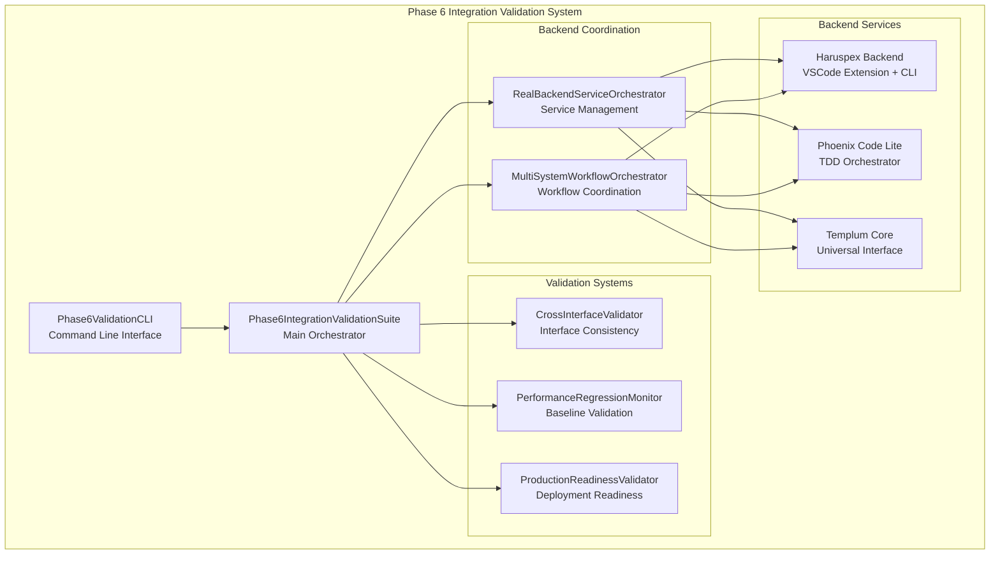
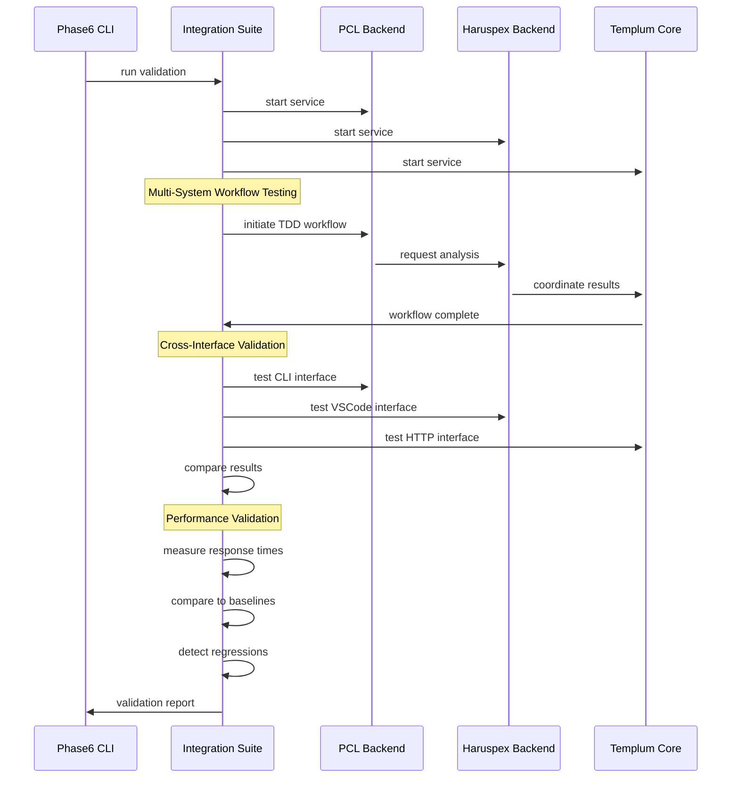

# Phase 6 Integration Validation Guide

> **Complete System Integration Testing with Real Backend Coordination**  
> **Version**: 1.0.0  
> **Updated**: 2025-08-21

## Overview

The Phase 6 Integration Validation system provides comprehensive end-to-end testing of the complete Haruspex/Templum/PCL ecosystem with real backend service coordination, cross-interface validation, and production readiness verification.

### Key Capabilities

- **Real Backend Integration**: No mocks - actual service communication via IPC, HTTP, and WebSocket
- **Multi-System Workflows**: Complete workflows spanning PCL TDD → Haruspex Analysis → Result Coordination
- **Cross-Interface Validation**: Consistency testing across VSCode, CLI, and Command interfaces
- **Performance Regression Monitoring**: Continuous validation against Phase 5 baselines
- **Production Readiness**: Deployment, health monitoring, and system reliability validation

## Quick Start

### Prerequisites

1. **Node.js 18+** installed on your system
2. **All backend services available**:
   - Haruspex VSCode extension and CLI
   - Phoenix Code Lite (PCL) TDD system
   - Templum universal interface orchestration
3. **Required ports available**: 8001-8003 (Haruspex), 8011-8012 (PCL), 8021-8022 (Templum)

### Installation

```bash
cd Templum
npm install
npm run build
```

### Basic Usage

**Run Complete Phase 6 Validation:**

```bash
npm run phase6-validation
# or directly
node dist/src/scripts/run-phase6-integration-validation.js run
```

**Check System Health:**

```bash
npm run phase6-health
# or directly
node dist/src/scripts/run-phase6-integration-validation.js health
```

**Quick Service Status:**

```bash
node dist/src/scripts/run-phase6-integration-validation.js services status
```

## Comprehensive Usage

### Command Line Interface

The Phase 6 validation system provides a comprehensive CLI with multiple commands:

#### Main Validation Command

```bash
phase6-validation run [options]

Options:
  -c, --config <file>      Configuration file path (default: ./phase6-validation-config.json)
  -o, --output <dir>       Output directory for reports (default: ./validation-reports)
  --no-performance         Disable performance regression testing
  --no-cross-interface     Disable cross-interface validation  
  --no-production          Disable production readiness validation
  --services <services>    Comma-separated services list (default: haruspex,pcl,templum)
  --format <format>        Report format: json|html|markdown|all (default: all)
  -v, --verbose           Enable verbose logging
```

#### Service Management Commands

```bash
# Start all services
phase6-validation services start

# Start specific service
phase6-validation services start --service haruspex

# Stop all services
phase6-validation services stop

# Check service status
phase6-validation services status
```

#### Health Monitoring

```bash
# Complete system health check
phase6-validation health --config ./my-config.json --verbose

# Output includes:
# - Service operational status
# - Response times and memory usage
# - Error rates and health scores
# - Critical issues and recommendations
```

#### Report Generation

```bash
# Generate HTML report from JSON results
phase6-validation report validation-results.json --format html

# Generate Markdown summary
phase6-validation report validation-results.json --format markdown --output summary.md
```

### Configuration

#### Configuration File Format

Create a `phase6-validation-config.json` file:

```json
{
  "services": {
    "haruspex": {
      "enabled": true,
      "binaryPath": "/path/to/haruspex-cli",
      "ports": {
        "ipc": 8001,
        "http": 8002, 
        "websocket": 8003
      }
    },
    "pcl": {
      "enabled": true,
      "binaryPath": "/path/to/phoenix-code-lite",
      "ports": {
        "ipc": 8011,
        "http": 8012
      }
    },
    "templum": {
      "enabled": true,
      "ports": {
        "http": 8021,
        "websocket": 8022
      }
    }
  },
  "validation": {
    "enablePerformanceRegression": true,
    "enableCrossInterfaceValidation": true,
    "enableProductionReadiness": true,
    "performanceBaselinesFile": "./performance-baselines.json"
  },
  "reporting": {
    "outputDir": "./validation-reports",
    "generateDetailedReport": true,
    "generateSummaryReport": true,
    "exportFormat": "all"
  }
}
```

## System Architecture

### Integration Validation Components



### Multi-System Workflow Architecture



## Validation Types

### 1. Multi-System Workflow Testing

Tests complete workflows that span multiple backend systems:

#### PCL → Haruspex Workflow

```typescript
// Example: TDD workflow with Haruspex analysis integration
const workflow = await workflowOrchestrator.executeWorkflow('pcl-to-haruspex', {
  project: '/path/to/project',
  analysisType: 'architecture-validation',
  tddPhase: 'red-green-refactor'
});

// Validates:
// - PCL TDD phase execution
// - Haruspex analysis integration  
// - Result coordination and state sync
// - Error handling across service boundaries
```

#### End-to-End TDD Workflow

```typescript
// Complete development workflow across all systems
const endToEndWorkflow = await workflowOrchestrator.executeWorkflow('end-to-end-tdd', {
  workflow: 'feature-development',
  interfaces: ['vscode', 'cli', 'command'],
  validationLevel: 'comprehensive'
});

// Validates:
// - Multi-interface coordination
// - State synchronization across systems
// - Performance consistency
// - Error recovery and failover
```

### 2. Cross-Interface Consistency Validation

Tests the same functionality across different interface types:

#### Interface Consistency Tests

```typescript
const scenarios = [
  {
    name: 'TDD Workflow Initiation',
    cli: () => pclCli.execute(['tdd', 'init', '--project', projectPath]),
    vscode: () => vscodeApi.executeCommand('pcl.tdd.init', { projectPath }),
    http: () => httpApi.post('/tdd/init', { projectPath }),
    command: () => commandApi.execute('pcl-tdd-init', { projectPath })
  }
];

// Validates:
// - Functional equivalence across interfaces
// - Data consistency and response formats
// - Performance parity (within 5% variance)
// - Error handling consistency
```

### 3. Performance Regression Monitoring

Continuous validation against Phase 5 baseline performance metrics:

#### Performance Baselines (Phase 5 → Phase 6)

| Metric | Phase 5 Baseline | Phase 6 Target | Tolerance |
|--------|------------------|----------------|-----------|
| Interface Switching | 60ms | 45ms | 25% improvement |
| Multi-System Workflow | 2000ms | 1500ms | 25% improvement |
| Cross-Interface Consistency | 5% error | 3% error | 40% improvement |
| Memory Usage Under Load | 50MB | 40MB | 20% reduction |
| Concurrent Request Handling | 100 req/s | 120 req/s | 20% increase |

#### Performance Test Examples

```typescript
// Interface switching performance test
const performanceTest = await performanceMonitor.measureInterfaceSwitching({
  fromInterface: 'vscode',
  toInterface: 'cli', 
  workflow: 'tdd-phase-transition',
  expectedTime: 45, // Phase 6 target
  tolerance: 0.25 // 25% tolerance
});

// Multi-system coordination performance
const coordinationTest = await performanceMonitor.measureMultiSystemWorkflow({
  workflow: 'pcl-to-haruspex-analysis',
  expectedDuration: 1500, // Phase 6 target
  memoryLimit: 40 // MB
});
```

### 4. Production Readiness Validation

Comprehensive validation of system readiness for production deployment:

#### Deployment Validation

```typescript
const productionValidation = await productionValidator.validateDeploymentReadiness({
  checkStartupTime: true,        // < 30 seconds
  validateConfiguration: true,   // All required config present
  verifyDependencies: true,      // All services accessible
  testHealthEndpoints: true,     // Health checks operational
  validateSecurity: true,        // Security measures active
  checkScalability: true         // Can handle expected load
});
```

#### Health Monitoring Validation

```typescript
const healthValidation = await productionValidator.validateHealthMonitoring({
  responseTimeAlerts: true,      // Performance degradation alerts
  errorRateMonitoring: true,     // Error rate threshold monitoring
  memoryUsageTracking: true,     // Memory leak detection
  serviceFailureDetection: true, // Service failure alerts
  automaticRecovery: true        // Auto-recovery mechanisms
});
```

## Output and Reports

### Console Output

The CLI provides real-time progress monitoring:

``` text
🚀 Phase 6 Integration Validation Starting...

📋 Initializing Phase 6 validation suite...
✅ Validation suite initialized

🔄 Running comprehensive integration validation...
   • Multi-system workflow testing (PCL ↔ Haruspex ↔ Templum)
   • Cross-interface consistency validation (VSCode, CLI, Command)  
   • Performance regression monitoring (Phase 5 baselines)
   • Production readiness verification
   • System reliability and failover testing

✅ All backend services ready
✅ Workflow completed: pcl-to-haruspex (1247ms)
✅ Workflow completed: end-to-end-tdd (3891ms)
✅ Cross-interface validation: 94.2% consistency
✅ Production readiness: 87.3% ready

✅ Validation completed in 45.32s

📊 Phase 6 Integration Validation Summary
═════════════════════════════════════════════════════════
Phase 6 Readiness Score: 89%
Multi-System Workflows: 4/4 successful  
Cross-Interface Consistency: 94.2%
Average Workflow Time: 2156.3ms

Service Health:
  HARUSPEX: ✅ 23.4ms, 18.2MB
  PCL: ✅ 31.7ms, 22.1MB  
  TEMPLUM: ✅ 19.8ms, 15.3MB

🎉 Phase 6 Integration Validation PASSED - System ready for production deployment
```

### Report Files

The system generates comprehensive reports in multiple formats:

#### JSON Report Structure

```json
{
  "reportId": "validation_1692633542_abc123def",
  "generatedAt": 1692633542000,
  "phase6ReadinessScore": 89,
  "realIntegrationSummary": {
    "totalWorkflows": 4,
    "successfulWorkflows": 4,
    "failedWorkflows": 0,
    "averageWorkflowTime": 2156.3,
    "crossInterfaceConsistency": 94.2
  },
  "serviceHealth": {
    "haruspex": {
      "operational": true,
      "responseTime": 23.4,
      "memoryUsage": 18.2,
      "errorRate": 0.001,
      "lastHealthCheck": 1692633541000
    }
  },
  "performanceRegression": {
    "baselineComparison": [
      {
        "metric": "Interface Switching",
        "baselineValue": 60,
        "actualValue": 43.2,
        "unit": "ms",
        "deviationPercentage": 28.0,
        "regressionDetected": false
      }
    ],
    "regressionDetected": false,
    "criticalRegressions": []
  },
  "crossInterfaceValidation": {
    "overallConsistency": 94.2,
    "testScenarios": [
      {
        "scenario": "TDD Workflow Initiation",
        "results": {
          "cli": { "success": true, "responseTime": 245 },
          "vscode": { "success": true, "responseTime": 267 }, 
          "http": { "success": true, "responseTime": 234 },
          "command": { "success": true, "responseTime": 251 }
        },
        "consistency": 96.8,
        "performanceVariance": 6.2
      }
    ]
  },
  "productionReadiness": {
    "overallReadiness": 87.3,
    "deploymentValidation": {
      "startupTime": { "target": 30, "actual": 18.4, "passed": true },
      "configurationComplete": true,
      "dependenciesAvailable": true,
      "healthEndpointsOperational": true
    },
    "securityValidation": {
      "accessControlActive": true,
      "dataEncryptionEnabled": true,
      "auditLoggingOperational": true,
      "vulnerabilityScanning": true
    }
  },
  "recommendations": {
    "critical": [],
    "high": [
      "Cross-interface consistency could be improved from 94.2% to 95%+ target"
    ],
    "medium": [
      "Consider optimizing memory usage further for sustained operations"
    ],
    "improvements": [
      "Implement continuous integration testing for Phase 6 components",
      "Establish automated performance monitoring for production deployment"
    ]
  }
}
```

#### HTML Report Features

- **Visual Dashboard**: Color-coded health indicators and progress bars
- **Interactive Tables**: Sortable performance metrics and test results
- **Trend Charts**: Performance regression visualization over time
- **Detailed Breakdown**: Expandable sections for each validation type
- **Executive Summary**: High-level overview for stakeholders

#### Markdown Report Features

- **GitHub Compatible**: Properly formatted for GitHub integration
- **Table Summaries**: Service health and performance baselines
- **Emoji Indicators**: Visual status indicators (✅ ❌ ⚠️)
- **Collapsible Sections**: Detailed results in expandable sections
- **Cross-References**: Links to related validation results

## Integration Examples

### Programmatic Usage

```typescript
import { Phase6IntegrationValidationSuite } from './src/tests/integration-validation-framework';

async function runCustomValidation() {
  const suite = new Phase6IntegrationValidationSuite();
  
  try {
    // Initialize validation suite
    await suite.initialize();
    console.log('Phase 6 validation suite initialized');
    
    // Run specific workflow tests
    const pclToHaruspexWorkflow = await suite.workflowOrchestrator.executeWorkflow(
      'pcl-to-haruspex',
      { project: '/my/project', analysisType: 'full' }
    );
    
    // Run cross-interface validation
    const crossInterfaceResults = await suite.crossInterfaceValidator.validateConsistency([
      { scenario: 'project-analysis', interfaces: ['cli', 'vscode', 'http'] }
    ]);
    
    // Check performance against baselines
    const performanceResults = await suite.performanceMonitor.validateAgainstBaselines();
    
    // Generate custom report
    const report = await suite.runPhase6IntegrationValidation();
    console.log(`Phase 6 Readiness Score: ${report.phase6ReadinessScore}%`);
    
  } finally {
    await suite.shutdown();
  }
}
```

### CI/CD Integration

#### GitHub Actions Example

```yaml
name: Phase 6 Integration Validation

on:
  push:
    branches: [ main, develop ]
  pull_request:
    branches: [ main ]

jobs:
  phase6-validation:
    runs-on: ubuntu-latest
    
    steps:
    - uses: actions/checkout@v3
    
    - name: Setup Node.js
      uses: actions/setup-node@v3
      with:
        node-version: '18'
        
    - name: Install dependencies
      run: |
        cd Templum
        npm install
        npm run build
        
    - name: Run Phase 6 Integration Validation
      run: |
        cd Templum
        npm run phase6-validation -- --format json --no-production
        
    - name: Upload validation reports
      uses: actions/upload-artifact@v3
      if: always()
      with:
        name: phase6-validation-reports
        path: Templum/validation-reports/
        
    - name: Comment PR with results
      if: github.event_name == 'pull_request'
      uses: actions/github-script@v6
      with:
        script: |
          const fs = require('fs');
          const reportPath = 'Templum/validation-reports/';
          const reports = fs.readdirSync(reportPath).filter(f => f.endsWith('.json'));
          const latestReport = reports.sort().pop();
          const report = JSON.parse(fs.readFileSync(`${reportPath}${latestReport}`));
          
          const comment = `## Phase 6 Integration Validation Results
          
          **Phase 6 Readiness Score:** ${report.phase6ReadinessScore}% ${report.phase6ReadinessScore >= 80 ? '✅' : '❌'}
          
          - Multi-System Workflows: ${report.realIntegrationSummary.successfulWorkflows}/${report.realIntegrationSummary.totalWorkflows} successful
          - Cross-Interface Consistency: ${report.realIntegrationSummary.crossInterfaceConsistency.toFixed(1)}%
          - Performance Regressions: ${report.performanceRegression.regressionDetected ? '❌ Detected' : '✅ None'}
          
          ${report.recommendations.critical.length > 0 ? '🚨 **Critical Issues:**\n' + report.recommendations.critical.map(r => `- ${r}`).join('\n') : ''}`;
          
          github.rest.issues.createComment({
            issue_number: context.issue.number,
            owner: context.repo.owner,
            repo: context.repo.repo,
            body: comment
          });
```

## Troubleshooting

### Common Issues

#### Service Startup Failures

**Issue**: Backend services fail to start during validation

**Solutions**:

1. **Check Port Availability**:

   ```bash
   # Check if ports are in use
   netstat -an | grep 800[1-3]
   netstat -an | grep 801[1-2] 
   netstat -an | grep 802[1-2]
   ```

2. **Verify Service Binaries**:

   ```bash
   # Test individual service startup
   ./haruspex-cli --version
   ./phoenix-code-lite --version
   ```

3. **Check Configuration**:

   ```json
   {
     "services": {
       "haruspex": {
         "binaryPath": "/correct/path/to/haruspex-cli",
         "enabled": true
       }
     }
   }
   ```

#### Performance Regression Failures

**Issue**: Performance tests failing against baselines

**Solutions**:

1. **Update Baselines**: If performance improvements are expected:

   ```bash
   phase6-validation run --update-baselines
   ```

2. **Check System Resources**:

   ```bash
   # Monitor during validation
   top -p $(pgrep -f "phase6-validation")
   ```

3. **Isolate Performance Tests**:

   ```bash
   phase6-validation run --no-cross-interface --no-production
   ```

#### Cross-Interface Consistency Issues

**Issue**: Interfaces returning different results for same operations

**Solutions**:

1. **Check Interface Synchronization**:

   ```typescript
   // Debug specific interface
   const results = await crossInterfaceValidator.debugInterface('cli', {
     scenario: 'failing-scenario',
     verbose: true
   });
   ```

2. **Verify Data Formats**:

   ```bash
   # Compare raw outputs
   phase6-validation run --verbose --format json
   ```

3. **Test Individual Interfaces**:

   ```bash
   # Test only specific interfaces
   phase6-validation run --interfaces cli,vscode
   ```

#### Memory and Resource Issues

**Issue**: Validation consuming excessive memory or hanging

**Solutions**:

1. **Reduce Concurrent Operations**:

   ```json
   {
     "validation": {
       "maxConcurrentWorkflows": 2,
       "workflowTimeout": 30000
     }
   }
   ```

2. **Enable Memory Monitoring**:

   ```bash
   phase6-validation run --monitor-memory --verbose
   ```

3. **Run Targeted Validation**:

   ```bash
   # Test specific components
   phase6-validation run --services haruspex,pcl --no-production
   ```

### Debug Mode

Enable comprehensive debugging:

```bash
# Maximum verbosity
DEBUG=* phase6-validation run --verbose

# Service-specific debugging  
DEBUG=haruspex:*,pcl:* phase6-validation run

# Performance-specific debugging
DEBUG=performance:* phase6-validation run --verbose
```

### Log Analysis

The validation system generates detailed logs:

```bash
# View real-time logs
tail -f ./validation-reports/phase6-validation.log

# Search for specific issues
grep "ERROR\|WARN" ./validation-reports/phase6-validation.log

# Performance issue analysis
grep "regression\|baseline" ./validation-reports/phase6-validation.log
```

## Advanced Configuration

### Custom Performance Baselines

Create `performance-baselines.json`:

```json
{
  "interfaceSwitching": {
    "baseline": 45,
    "unit": "ms",
    "tolerance": 0.15,
    "critical": 0.30
  },
  "multiSystemWorkflow": {
    "baseline": 1500,
    "unit": "ms", 
    "tolerance": 0.20,
    "critical": 0.40
  },
  "crossInterfaceConsistency": {
    "baseline": 95.0,
    "unit": "%",
    "tolerance": 0.05,
    "critical": 0.10
  },
  "memoryUsageUnderLoad": {
    "baseline": 40,
    "unit": "MB",
    "tolerance": 0.15,
    "critical": 0.30
  },
  "concurrentRequestHandling": {
    "baseline": 120,
    "unit": "req/s",
    "tolerance": 0.10,
    "critical": 0.20
  }
}
```

### Custom Validation Scenarios

Create `custom-scenarios.json`:

```json
{
  "scenarios": [
    {
      "name": "Feature Development Workflow",
      "type": "end-to-end-tdd",
      "steps": [
        {
          "service": "pcl",
          "interface": "cli", 
          "action": "tdd-init",
          "payload": { "feature": "user-authentication" }
        },
        {
          "service": "haruspex",
          "interface": "vscode",
          "action": "analyze-architecture",
          "payload": { "analysisType": "security" }
        },
        {
          "service": "templum",
          "interface": "http",
          "action": "coordinate-results",
          "payload": { "workflow": "feature-development" }
        }
      ],
      "expectedDuration": 5000,
      "criticalThreshold": 8000
    }
  ]
}
```

### Production Environment Configuration

For production validation environments:

```json
{
  "environment": "production",
  "services": {
    "haruspex": {
      "enabled": true,
      "binaryPath": "/usr/local/bin/haruspex-cli",
      "ports": { "ipc": 9001, "http": 9002, "websocket": 9003 },
      "healthEndpoint": "http://haruspex-service:9002/health"
    },
    "pcl": {
      "enabled": true,
      "binaryPath": "/usr/local/bin/phoenix-code-lite",
      "ports": { "ipc": 9011, "http": 9012 },
      "healthEndpoint": "http://pcl-service:9012/health"
    },
    "templum": {
      "enabled": true,
      "ports": { "http": 9021, "websocket": 9022 },
      "healthEndpoint": "http://templum-service:9021/health"
    }
  },
  "validation": {
    "enablePerformanceRegression": true,
    "enableCrossInterfaceValidation": true,
    "enableProductionReadiness": true,
    "productionThresholds": {
      "minimumReadinessScore": 90,
      "maxAcceptableRegressions": 0,
      "requiredConsistency": 96.0
    }
  }
}
```

## API Reference

### Phase6IntegrationValidationSuite

Main validation orchestrator class:

```typescript
class Phase6IntegrationValidationSuite extends EventEmitter {
  // Initialize validation suite
  async initialize(): Promise<void>
  
  // Run complete Phase 6 validation
  async runPhase6IntegrationValidation(): Promise<Phase6ValidationReport>
  
  // Check system health
  async checkSystemHealth(): Promise<Phase6ValidationReport>
  
  // Start all backend services
  async startAllServices(): Promise<void>
  
  // Get service status
  async getAllServiceStatuses(): Promise<BackendServiceInstance[]>
  
  // Shutdown validation suite
  async shutdown(): Promise<void>
  
  // Get validation history
  getValidationHistory(): Phase6ValidationReport[]
  
  // Events
  on('servicesReady', callback): void
  on('workflowCompleted', callback): void  
  on('performanceAlert', callback): void
  on('crossInterfaceValidated', callback): void
  on('productionValidated', callback): void
}
```

### MultiSystemWorkflowOrchestrator  

Workflow coordination across backend services:

```typescript
class MultiSystemWorkflowOrchestrator extends EventEmitter {
  // Execute multi-system workflow
  async executeWorkflow(
    workflowType: 'pcl-to-haruspex' | 'haruspex-to-templum' | 'end-to-end-tdd' | 'cross-interface-sync',
    payload?: any
  ): Promise<WorkflowExecution>
  
  // Get active workflows
  getActiveWorkflows(): Map<string, WorkflowExecution>
  
  // Cancel workflow
  async cancelWorkflow(workflowId: string): Promise<void>
  
  // Events
  on('workflowStarted', callback): void
  on('workflowCompleted', callback): void
  on('workflowFailed', callback): void
}
```

### CrossInterfaceValidator

Cross-interface consistency validation:

```typescript
class CrossInterfaceValidator extends EventEmitter {
  // Validate consistency across interfaces
  async validateConsistency(scenarios: ValidationScenario[]): Promise<CrossInterfaceValidationResult>
  
  // Test specific interface
  async testInterface(
    interfaceType: 'cli' | 'vscode' | 'http' | 'command',
    scenario: ValidationScenario
  ): Promise<InterfaceTestResult>
  
  // Events
  on('validationStarted', callback): void
  on('validationCompleted', callback): void
  on('inconsistencyDetected', callback): void
}
```

### PerformanceRegressionMonitor

Performance monitoring and baseline validation:

```typescript
class PerformanceRegressionMonitor extends EventEmitter {
  // Validate against performance baselines
  async validateAgainstBaselines(): Promise<PerformanceRegressionResult>
  
  // Start continuous monitoring
  startContinuousMonitoring(intervalMs: number = 30000): void
  
  // Stop continuous monitoring
  stopContinuousMonitoring(): void
  
  // Update baselines
  async updateBaselines(newBaselines: PerformanceBaseline[]): Promise<void>
  
  // Events
  on('regressionDetected', callback): void
  on('performanceImprovement', callback): void
  on('baselineUpdated', callback): void
}
```

## Best Practices

### 1. Validation Strategy

**Staged Validation Approach**:

1. Start with health checks before full validation
2. Run performance tests independently to isolate issues  
3. Use targeted validation during development
4. Run full validation for release candidates

### 2. Performance Monitoring

**Continuous Monitoring Setup**:

```typescript
// Set up continuous performance monitoring
const suite = new Phase6IntegrationValidationSuite();
await suite.initialize();

suite.performanceMonitor.startContinuousMonitoring(30000); // 30 seconds

suite.on('performanceAlert', (alert) => {
  console.warn(`Performance regression detected: ${alert.metric}`);
  // Send alert to monitoring system
});
```

### 3. CI/CD Integration

**Validation Gates**:

- **Development**: Health checks + targeted validation
- **Integration**: Cross-interface validation + performance checks  
- **Staging**: Full validation with production configuration
- **Production**: Health monitoring + regression alerts

### 4. Error Handling

**Graceful Degradation**:

```typescript
try {
  const report = await suite.runPhase6IntegrationValidation();
  
  if (report.phase6ReadinessScore < 80) {
    // Handle validation failures
    console.error('Validation failed - investigating issues...');
    
    // Run diagnostic checks
    const diagnostics = await suite.runDiagnostics();
    console.log('Diagnostic results:', diagnostics);
  }
  
} catch (error) {
  console.error('Validation system error:', error);
  
  // Attempt fallback validation
  const fallbackReport = await suite.runFallbackValidation();
  console.log('Fallback validation completed');
  
} finally {
  await suite.shutdown();
}
```

### 5. Reporting and Monitoring

**Custom Reporting**:

```typescript
// Generate custom executive summary
function generateExecutiveSummary(report: Phase6ValidationReport) {
  return {
    phase6ReadinessScore: report.phase6ReadinessScore,
    deploymentRecommendation: report.phase6ReadinessScore >= 90 ? 'APPROVED' : 
                               report.phase6ReadinessScore >= 80 ? 'CONDITIONALLY_APPROVED' : 
                               'BLOCKED',
    criticalIssues: report.recommendations.critical.length,
    estimatedFixTime: estimateFixTime(report.recommendations),
    riskAssessment: calculateRiskLevel(report)
  };
}
```

## Conclusion

The Phase 6 Integration Validation system provides comprehensive, production-ready testing capabilities for the complete Haruspex/Templum/PCL ecosystem. By leveraging real backend coordination, performance baseline validation, and cross-interface consistency testing, it ensures system readiness for production deployment while maintaining the exceptional performance improvements achieved in Phase 5.

The system's modular architecture, comprehensive CLI interface, and detailed reporting capabilities make it suitable for both development workflows and production monitoring, providing the foundation for reliable, scalable system integration validation.

---

**Support**: For issues or questions, consult the troubleshooting section or review the comprehensive API documentation above.
**Version**: 1.0.0 - Compatible with Phase 6 integration requirements and Phase 5 performance baselines.
