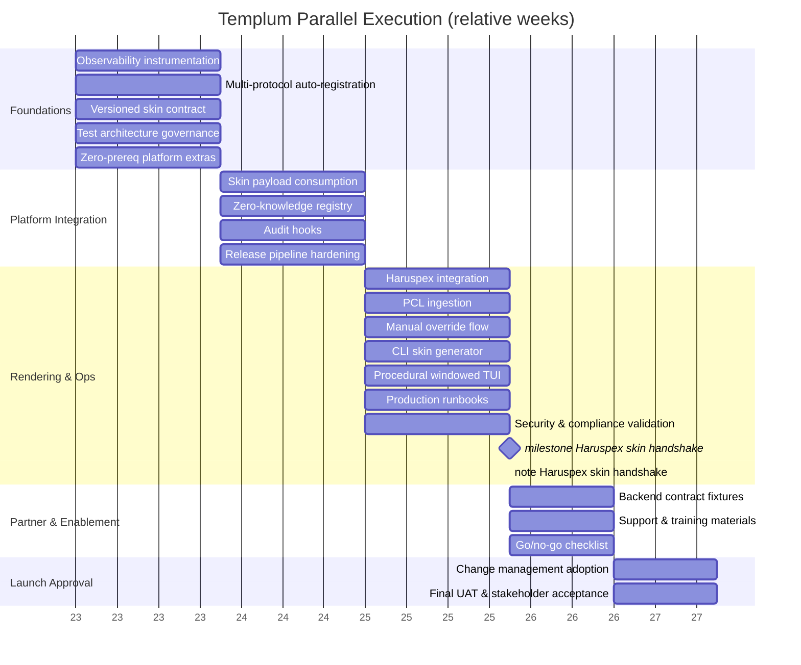

# Templum Progress Tracker

## Pre-Consolidation Advisory

- Utility consolidation and helper extraction work (see `dev/architecture/`) should complete before executing feature milestones.
- Protect public interfaces (`ServiceDiscovery`, `TemplumCore`, `UniversalSkinEngine`, adapters) during refactors so downstream requirements remain valid.
- After each consolidation milestone:
  - Regenerate dependency summaries (`templum_task_prereq_summary.json` or successor map).
  - Update task markdown references (file paths/line numbers) affected by the refactor.
  - Add “update references” items to new/updated task files instructing agents to refresh documentation pointers.
- Run smoke scripts referenced in active playbooks once consolidation lands to confirm no regressions before resuming feature work.

Legend: `[x]` done · `[~]` in progress · `[ ]` not started · `[!]` broken · `[?]` verify · `[P]` pending investigation

## Universal Interface Core

- [~] [Zero-knowledge backend registry with auto-discovery](../../dev/tasks/zero-knowledge-registry.md) (needs verification in latest build)
- [~] [Versioned skin contract enforcement](../../dev/tasks/versioned-skin-contract.md) (schema validation pending integration tests)
- [ ] [Unified session/context layer across adapters](../../dev/tasks/unified-session-layer.md)

## Backend Connectivity

- [?] [Multi-protocol auto-registration with health checks](../../dev/tasks/multi-protocol-auto-registration.md) (documented; requires runtime validation)
- [ ] [Connection lifecycle event broadcasting to interfaces/logs](../../dev/tasks/connection-lifecycle-events.md)
- [ ] [Manual override flow without breaking zero-knowledge behaviour](../../dev/tasks/manual-override-flow.md)

## Skin-Driven Rendering

- [ ] [Skin payload consumption powering full UI without hardcoding](../../dev/tasks/skin-payload-consumption.md)
- [ ] [Procedural windowed TUI layout from skin descriptors](../../dev/tasks/procedural-windowed-tui.md)
- [ ] [Asset validation](../../dev/tasks/skin-asset-validation.md) (media/localisation/command bindings)

## Interface Delivery

- [!] [VSCode extension initialisation stable](../../dev/tasks/vscode-initialisation-stability.md) (known WebView load issues)
- [~] [CLI generator uses skin metadata](../../dev/tasks/cli-skin-generator.md) (partially wired, needs full migration)
- [ ] [Extensible adapter contract exercised beyond CLI/VSCode](../../dev/tasks/extensible-adapter-contract.md)

## Quality & Release Readiness

- [ ] [Test architecture consolidation and coverage governance](../../dev/tasks/test-architecture-governance.md) (unit/integration/e2e thresholds codified)
- [ ] [Release pipeline hardening and packaging verification](../../dev/tasks/release-pipeline-hardening.md) (artifact signing, CI gating, rollback paths)
- [ ] [Unified go/no-go checklist with compliance, security, and partner sign-offs](../../dev/tasks/go-no-go-checklist.md)
- [ ] [Final UAT and stakeholder acceptance recorded](../../dev/tasks/final-uat-stakeholder-acceptance.md)
- [ ] [Developer documentation consolidation for post-migration workflows](../../dev/tasks/developer-doc-consolidation.md) (API surface, adapter guides, onboarding)
- [ ] [Security and compliance validation sign-off](../../dev/tasks/security-compliance-validation.md) (threat model, audit evidence packaged)

## Launch & Support

- [ ] [Production runbooks and on-call handoff prepared](../../dev/tasks/production-runbooks-handoff.md) (incident flows, escalation matrix)
- [ ] [Support/training materials delivered to operations and partner teams](../../dev/tasks/support-training-materials.md)
- [ ] [Change management & post-launch adoption plan executed](../../dev/tasks/change-management-adoption.md) (communications, feedback loop)

## Operations & Observability

- [?] [Structured metrics and logging in place](../../dev/tasks/observability-instrumentation.md) (observability blueprint documented; confirm runtime wiring)
- [ ] [Audit hooks aligned with compliance requirements](../../dev/tasks/audit-hooks.md)
- [ ] [Feature flags for scaling enterprise options](../../dev/tasks/feature-flags-enterprise.md)

## Integration Partners

- [~] [Haruspex integration path defined](../../dev/tasks/haruspex-integration.md) (backend pending skin output)
- [ ] [Phoenix Code Lite skin ingestion validated](../../dev/tasks/pcl-skin-ingestion.md)
- [ ] [Backend contract fixture library for regression coverage](../../dev/tasks/backend-contract-fixtures.md)

## Action Items

- Verify observability instrumentation before enabling dashboards.
- Complete CLI refactor to pure skin-driven flow.
- Coordinate with backend teams to produce compliant skins.
- Action playbook: `meta/workflows/milestone-01-templum-haruspex-skin-handshake.md` (Templum ↔ Haruspex skin handshake).

## Step 0 — Playbook Setup

- Draft milestone playbooks before proceeding with implementation work:
  - `meta/workflows/milestone-01-templum-haruspex-skin-handshake.md` (existing example).
  - Future milestones to create: Phoenix Code Lite skin handshake, skin-driven interface consolidation, observability/audit rollout, enterprise readiness.
- Use template `meta/templates/milestone-playbook.md` and reference cross-project dependencies via `meta/ARCHITECTURE.md`.
- Add milestone markers to the Gantt chart for each playbook and link them from Action Items.
- Share the agent briefing template `dev/agent-briefing-template.md` with assigned agents before kickoff.
- Verify smoke/validation scripts referenced in each playbook exist; stub missing scripts prior to execution.

## Parallel Execution Plan

### Dependency Highlights

- Observability instrumentation gates audit hooks, production runbooks, and later compliance milestones.
- Multi-protocol auto-registration feeds the zero-knowledge registry, unlocking manual overrides and partner ingestion (Haruspex, PCL).
- Versioned skin contract enforcement precedes skin-payload consumption; together they clear CLI/TUI rendering and external skin ingestion.
- Test architecture governance enables release pipeline hardening, which in turn is required before go/no-go, production runbooks, and final UAT advance.
- Haruspex integration and PCL ingestion jointly unblock backend contract fixtures, partner sign-offs in go/no-go, and support/training deliverables.

### Phase Matrix

| Phase | Dependencies cleared | Parallel work packages | Unlocks |
| --- | --- | --- | --- |
| 1 · Foundations | None | Observability instrumentation · Multi-protocol auto-registration · Versioned skin contract · Test architecture governance · plus zero-prereq platform tasks (connection lifecycle events, unified session layer, extensible adapter contract, feature flags groundwork, skin asset validation, VSCode initialisation, developer doc consolidation) | Prepares telemetry, schema, and CI bedrock for downstream streams |
| 2 · Platform Integration | Observability, schema, coverage foundations | Skin payload consumption · Zero-knowledge registry verification · Audit hooks (post-observability) · Release pipeline hardening | Enables partner ingestion, CLI/TUI rewires, and compliance evidence |
| 3 · Rendering & Ops | Phase 2 complete | Haruspex integration · PCL ingestion · Manual override flow · CLI skin generator migration · Procedural windowed TUI · Production runbooks & on-call handoff · Security & compliance validation | Clears regression fixtures, operator runbooks, and partner-ready artefacts |
| 4 · Partner & Enablement | Phase 3 partner artefacts, runbooks | Backend contract fixtures · Support/training materials (co-scheduled with change management) · Go/no-go checklist | Unlocks coordinated change management and final approval gates |
| 5 · Launch Approval | Go/no-go + compliance + pipeline evidence | Change management adoption (final execution wave) · Final UAT & stakeholder acceptance | Drives readiness sign-off and closes launch checklist |

### Workstream Lanes

- **Core Platform**: connection lifecycle events, unified session layer, manual override flow, feature flags; align with multi-protocol and zero-knowledge deliverables to keep interface and backend streams decoupled.
- **Skin & Interface**: versioned skin contract → skin payload consumption → CLI generator and procedural TUI; ensure Haruspex/PCL ingestion test assets reuse the shared schema to avoid duplicate fixes.
- **Operations & Compliance**: observability → audit hooks → security/compliance validation → release pipeline hardening → production runbooks → go/no-go → final UAT; reuse governance tooling to reduce retest time.
- **Partner & Enablement**: Haruspex integration, PCL ingestion, backend contract fixtures, support/training, change management; treat support/training and change management as a joint programme with alternating deliverables to resolve their mutual dependency.

### Risk and Coordination Notes

- The mutual prerequisite between `support-training-materials` and `change-management-adoption` needs a shared cadence: land runbooks and partner artefacts first, draft the change plan while training content solidifies, and close both once feedback loops are proven.
- Feature flag groundwork can start in Phase 1, but the audit-toggle wiring from `audit-hooks` belongs in Phase 3 to keep engineers billable while audit sinks stabilise.
- Maintain a shared evidence tracker so Phase 3 validation outputs feed directly into the go/no-go checklist without rework.

### Gantt Snapshot (relative weeks, adjust durations per sprint)

## Scheduling Worksheet Template

Use this worksheet to replicate the sequencing exercise for other repositories:

| Item | Current status | Prereqs (task IDs) | Blocks produced | Target phase | Owner | Notes / evidence links |
| --- | --- | --- | --- | --- | --- | --- |
|  |  |  |  |  |  |  |
|  |  |  |  |  |  |  |
|  |  |  |  |  |  |  |

Guidelines:

- Audit the task files and progress.md entries to capture dependencies before assigning phases; flag mutual prerequisites early so teams can co-plan.
- Group tasks into four to five execution phases that keep telemetry, schema, and CI foundations ahead of dependent streams.
- Keep workstream lanes (Platform, Interface, Ops, Partner) explicit so multiple agents can run in parallel without clashing.
- Update the worksheet with run/test commands and evidence paths once tasks complete to keep go/no-go and UAT paperwork in sync.
- Mirror the finalized phase and lane summary back into the project’s progress.md after each major reshuffle.
