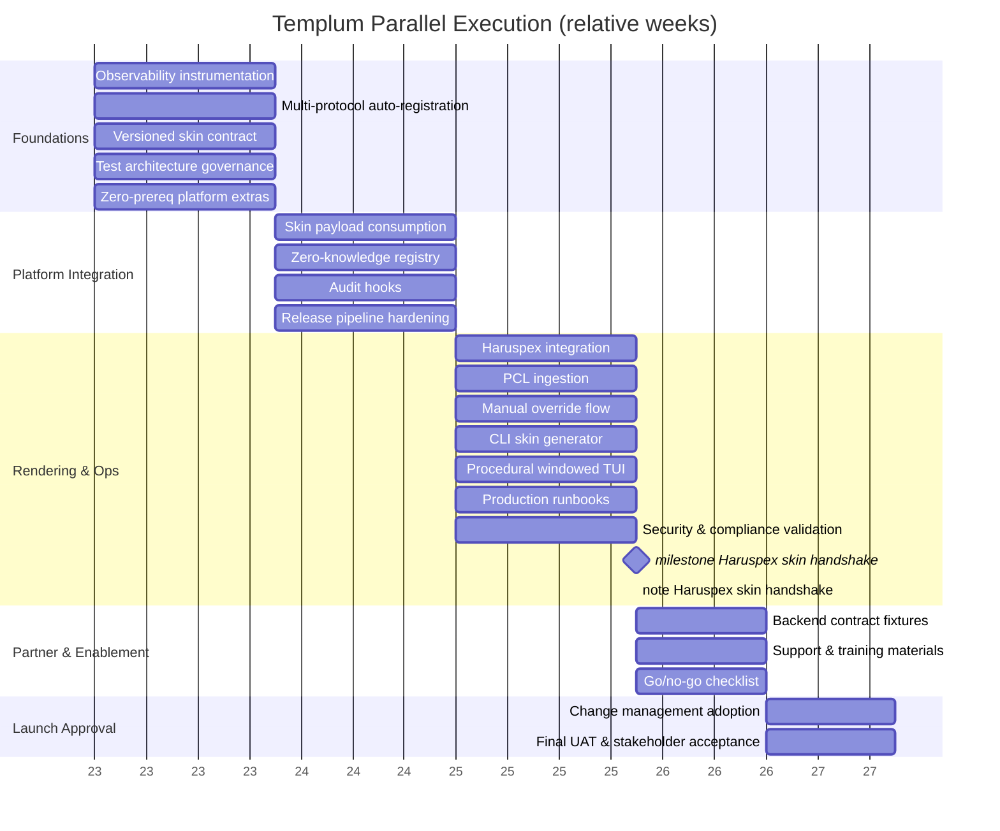

# Templum Progress Tracker

> Overall project status: **25% complete** — core plumbing exists but key flows (multi-protocol discovery, skin-driven rendering, unified sessions, coverage governance) remain partially implemented or failing tests.

MVP priority legend: **Must-have** (required for MVP) · **Post-MVP** (valuable but deferrable)

## Fastest-to-MVP Snapshot *(living draft)*

> Scope lock: anything not listed here stays on ice until the MVP ships.

1. **Stabilise discovery & sessions**
   - Fix multi-protocol auto-registration (`dev/tasks/multi-protocol-auto-registration.md`) so `discoverAndConnect()` survives mocks instead of crashing; add a manifest-driven fixture in `src/tests/backend` to prove the watcher and health ranking work.
   - Verify the zero-knowledge registry flow (`dev/tasks/zero-knowledge-registry.md`) using those fixtures; kill lingering placeholders and TODO mocks during this pass.
   - Inject the shared session/context manager (`dev/tasks/unified-session-layer.md`) so CLI/VSCode share state; keep the consolidated logging/session utilities in scope because they make this refactor tractable.
   - When splitting monoliths (e.g. `backend-service-router.ts`), perform surgical extractions only—just enough helpers to keep cyclomatic complexity sane.

2. **Lock skin enforcement & rendering**
   - Replace the handwritten validator with the Ajv-backed schema (`dev/tasks/versioned-skin-contract.md`) and wire warnings/errors into adapters.
   - Reuse Phoenix Code Lite rendering/menu assets wherever possible to avoid reinventing the CLI/UI pipeline; drop borrowed fixtures into `tests/fixtures/skins`.
   - Implement skin-driven rendering/CLI generator/procedural TUI (`dev/tasks/skin-payload-consumption.md`, `dev/tasks/cli-skin-generator.md`, `dev/tasks/procedural-windowed-tui.md`) using those shared utilities.
   - Build failing tests first (adapter integration, CLI snapshots) so code work is always guided by fixtures.

3. **Harden runtime signals & coverage**
   - Introduce a central process-signal manager (`dev/tasks/process-signal-listener-consolidation.md`) and migrate all `process.on` calls; expose a `reset()` hook so Jest exits cleanly.
   - Repair coverage/CI governance (`dev/tasks/test-architecture-governance.md`) by fixing reporter dependencies and splitting configs; add a lightweight “sanity script” that runs lint + targeted Jest suites until CI catches up.
   - Add lifecycle broadcasting and manual overrides (`dev/tasks/connection-lifecycle-events.md`, `dev/tasks/manual-override-flow.md`) once the router/session code is stable.

4. **Integrate partners & observability**
   - Land Haruspex/PCL ingestion (`dev/tasks/haruspex-integration.md`, `dev/tasks/pcl-skin-ingestion.md`) using real sample manifests/skins checked into fixtures; keep imports lean and concrete rather than generic.
   - Implement baseline observability instrumentation (`dev/tasks/observability-instrumentation.md`): structured logs + one health metric is enough—full dashboards wait until later.
   - Document the minimal command matrix (mock vs real) so everyone runs the same flow while coverage is still stabilising.

5. **Guardrails during the push**
   - No Post-MVP work (engine convergence, extra adapters, feature flags, asset validators, Phase 6 automation polish) unless we explicitly re-scope it.
   - Continue only the utility consolidation that directly empowers the steps above (logging/session/display/validation helpers); everything else stays frozen.
   - When you touch a hotspot, trim any leftover TODO/MOCK placeholders immediately so they can’t trip later steps.

> Items outside this list are treated as Post-MVP unless we explicitly pull them forward.

## Pre-Consolidation Advisory

- Utility consolidation and helper extraction work (see `dev/architecture/`) should complete before executing feature milestones.
- Protect public interfaces (`ServiceDiscovery`, `TemplumCore`, `UniversalSkinEngine`, adapters) during refactors so downstream requirements remain valid.
- After each consolidation milestone:
  - Regenerate dependency summaries (`templum_task_prereq_summary.json` or successor map).
  - Update task markdown references (file paths/line numbers) affected by the refactor.
  - Add “update references” items to new/updated task files instructing agents to refresh documentation pointers.
- Run smoke scripts referenced in active playbooks once consolidation lands to confirm no regressions before resuming feature work.

Legend: `[x]` done · `[~]` in progress · `[ ]` not started · `[!]` broken · `[?]` verify · `[P]` pending investigation

## Universal Interface Core

- [~] [Zero-knowledge backend registry with auto-discovery](../../dev/tasks/zero-knowledge-registry.md) (needs verification in latest build) — **Must-have**
  Progress 45% — `npm run test -- src/tests/backend/service-discovery.test.ts` passes, but `npm test -- src/tests/backend/generic-backend-integration.test.ts` still fails (`discoveredBackends` undefined) and no end-to-end check covers the new `.templum/services` watcher or multi-protocol health flows.
- [~] [Versioned skin contract enforcement](../../dev/tasks/versioned-skin-contract.md) (schema validation pending integration tests) — **Must-have**
  Progress 15% — `src/validation/skin-validator.ts` remains a hand-written checker, Ajv-backed schema enforcement is unused, and no adapter tests exercise rejection/telemetry; coverage runs abort with `babel-plugin-istanbul` wiring errors before reaching new specs.
- [ ] [Unified session/context layer across adapters](../../dev/tasks/unified-session-layer.md) — **Must-have**
  Progress 15% — `TemplumUniversalSessionManager` exists but core wiring still instantiates per-adapter managers (see `src/interfaces/cli-adapter-abstracted.ts:122`); cross-adapter sync paths are untested and Jest suites continue to rely on legacy CLI state.

## Backend Connectivity

- [ ] [Refactor backend service router into modular discovery/connection/health slices](../../dev/tasks/backend-service-router-modularisation.md) (split monolith into manifest sources → connection manager → health monitor wired via an internal event bus to tame complexity and support future protocols)
- [?] [Multi-protocol auto-registration with health checks](../../dev/tasks/multi-protocol-auto-registration.md) (documented; requires runtime validation) — **Must-have**
  Progress 35% — strategy scaffolding covers HTTP/WebSocket/IPC parsing, yet `discoverAndConnect()` collapses under test (TypeError reported by `npm test -- src/tests/backend/generic-backend-integration.test.ts`) and protocol-specific health probes remain HTTP-only.
- [~] [Optional backend mock harness for integration suite](../../dev/tasks/optional-backend-mock-harness.md) (mock run: `npm run phase6-validation`; dual run: `PHASE6_RUN_REAL=1 npm run phase6-validation:full`; contract assertions now guard mock payloads) — **Post-MVP**
  Progress 85% — mock harness APIs and contracts are in place (`npm run test -- tests/validation/mock-backend-contracts.test.ts` passes) but docs/CI wiring steps in the task checklist are still unchecked.
- [ ] [Connection lifecycle event broadcasting to interfaces/logs](../../dev/tasks/connection-lifecycle-events.md) — **Must-have**
  Progress 0% — no `connection:lifecycle` payloads are emitted from `TemplumBackendServiceRouter`, and no tests assert lifecycle broadcasts.
- [ ] [Manual override flow without breaking zero-knowledge behaviour](../../dev/tasks/manual-override-flow.md) — **Must-have**
  Progress 0% — repository lacks a `ManualOverrideManager` and neither router nor discovery paths expose sanitized override controls.

## Skin-Driven Rendering

- [ ] [Modularise universal skin engine into registry + renderer pipeline](../../dev/tasks/skin-engine-modularisation.md) (separate schema/compatibility registry from interface-specific renderers, reuse Phoenix layout components, retire duplicate engine implementations)

- [ ] [Skin payload consumption powering full UI without hardcoding](../../dev/tasks/skin-payload-consumption.md) — **Must-have**
  Progress 25% — renderer/layout scaffolding exists, yet CLI/VSCode adapters still fall back to `generateFallbackCLIOutput` and rely on baked-in menus; no integration tests assert skin-driven rendering.
- [ ] [Procedural windowed TUI layout from skin descriptors](../../dev/tasks/procedural-windowed-tui.md) — **Must-have**
  Progress 20% — `ContentLayoutSystem` provides bordered-window helpers, but CLI flows never request them and no procedural layout specs have been added.
- [ ] [Asset validation](../../dev/tasks/skin-asset-validation.md) (media/localisation/command bindings) — **Post-MVP**
  Progress 0% — schema/types still omit localisation bundles and `SkinAssetValidator`; backend validation tests skip asset/link checks.
- [ ] [Universal Skin Engine convergence roadmap](../../dev/tasks/universal-skin-engine-convergence.md) (modularise current engine, absorb Phase 5 validation/caching, retire duplicate impl) — **Post-MVP**
  Progress 10% — both `universal-skin-engine.ts` and `universal-skin-engine-impl.ts` remain in circulation with overlapping logic; no modular extraction or duplicate retirement steps have landed.

## Interface Delivery

- [!] [VSCode extension initialisation stable](../../dev/tasks/vscode-initialisation-stability.md) (known WebView load issues) — **Must-have**
  Progress 30% — activation still aborts in no-workspace scenarios, WebView providers log "adapter not ready" during tests, and suites hang on open handles until killed via `scripts/run-with-timeout.mjs`.
- [~] [CLI generator uses skin metadata](../../dev/tasks/cli-skin-generator.md) (partially wired, needs full migration) — **Must-have**
  Progress 10% — there is no `cli-generator` module, CLI adapters continue to emit fallback text dumps, and skin metadata is not transformed into procedural menus.
- [ ] [Extensible adapter contract exercised beyond CLI/VSCode](../../dev/tasks/extensible-adapter-contract.md) — **Post-MVP**
  Progress 20% — MCP compatibility bridges exist for CLI preservation, but `TemplumAdapterRegistry` never registers a third adapter and no contract tests cover new interface types.

## Quality & Release Readiness

- [ ] [Shift observability to event-stream architecture](../../dev/tasks/observability-event-stream.md) (replace direct logging calls with typed events consumed by adapters/metrics, add observability event bus once MVP baseline is live)
- [ ] [Test architecture consolidation and coverage governance](../../dev/tasks/test-architecture-governance.md) (unit/integration/e2e thresholds codified) — **Must-have**
  Progress 20% — `scripts/coverage-reality-check.js` still shells to a single Jest config; suite-specific configs fail (`jest.backend.config.js` references missing reporters) and coverage runs abort before producing metrics.
- [!] [Phase 6 validation signal overhaul](../../dev/tasks/phase6-validation-signal.md) (readiness score still driven by mocked baselines/random delays; instrument real metrics, seed baselines, and persist raw outputs.) — **Post-MVP**
- [x] [Serialization Utils consolidation (Pattern 11) Stage 6](../../dev/architecture/utility-consolidation-plans/pattern-11.md) (serialization unit + menu adapter suites and backend Phase 2 subset revalidated 2025-10-02; `npm run phase6-health` 100% readiness; `npm run phase6-validation` 92% readiness with readiness score output disabled until properly implemented; `phase6-services` requires `start|stop|status` subcommand)
- [x] [Chainable String Utils consolidation (Pattern 12) Stage 4](../../dev/architecture/utility-consolidation-plans/pattern-12.md) (final validation via targeted Jest suites + `npm run phase6-health`; snapshot refresh still optional)
- [x] [Type Guards consolidation (Pattern 10) Stage 6](../../dev/architecture/utility-consolidation-plans/pattern-10.md) (Stage 5 post-cleanup validation complete 2025-10-07 — backend/core/interface/session suites and TypeGuards harness green with leak-guard, no listener regressions).
- [x] [Display Utils consolidation (Pattern 5) Stage 7](../../dev/architecture/utility-consolidation-plans/pattern-5.md) (`npm run test -- --runTestsByPath src/tests/utils/display-utils.test.ts src/tests/utils/display-stack.integration.test.ts --runInBand --no-cache --forceExit`, adaptive CLI + navigation integration suites, and `npm run phase6-health`/`npm run phase6-validation` now green post TypeScript fixes; readiness 92% with readiness score output disabled until properly implemented).
- [ ] [Process signal listener consolidation](../../dev/tasks/process-signal-listener-consolidation.md) (deduplicate CLI/navigation signal + stdin handlers to eliminate recurring MaxListeners warnings and enforce teardown discipline) — **Must-have**
  Progress 10% — dozens of direct `process.on` registrations remain (`src/cli-entry.ts`, `src/interfaces/navigation/exit-handler.ts`, `src/tests/integration-validation-framework.ts`), producing lingering handles that forced the timeout kill on interface adapter tests.
- [x] [Utility consolidation execution playbook rollout](../../dev/architecture/utility-consolidation-playbook.md) (playbook published; onboard agents and begin logging activity at ../../dev/architecture/utility-consolidation-activity-log.md)
- [ ] [Release pipeline hardening and packaging verification](../../dev/tasks/release-pipeline-hardening.md) (artifact signing, CI gating, rollback paths) — **Post-MVP**
- [ ] [Unified go/no-go checklist with compliance, security, and partner sign-offs](../../dev/tasks/go-no-go-checklist.md) — **Post-MVP**
- [ ] [Final UAT and stakeholder acceptance recorded](../../dev/tasks/final-uat-stakeholder-acceptance.md) — **Post-MVP**
- [ ] [Developer documentation consolidation for post-migration workflows](../../dev/tasks/developer-doc-consolidation.md) (API surface, adapter guides, onboarding) — **Post-MVP**
- [ ] [Security and compliance validation sign-off](../../dev/tasks/security-compliance-validation.md) (threat model, audit evidence packaged) — **Post-MVP**

## Launch & Support

- [ ] [Production runbooks and on-call handoff prepared](../../dev/tasks/production-runbooks-handoff.md) (incident flows, escalation matrix)
- [ ] [Support/training materials delivered to operations and partner teams](../../dev/tasks/support-training-materials.md)
- [ ] [Change management & post-launch adoption plan executed](../../dev/tasks/change-management-adoption.md) (communications, feedback loop)

## Operations & Observability

- [?] [Structured metrics and logging in place](../../dev/tasks/observability-instrumentation.md) (observability blueprint documented; confirm runtime wiring) — **Must-have**
- [ ] [Audit hooks aligned with compliance requirements](../../dev/tasks/audit-hooks.md) — **Post-MVP**
- [ ] [Feature flags for scaling enterprise options](../../dev/tasks/feature-flags-enterprise.md) — **Post-MVP**

## Integration Partners

- [~] [Haruspex integration path defined](../../dev/tasks/haruspex-integration.md) (backend pending skin output) — **Must-have**
- [ ] [Phoenix Code Lite skin ingestion validated](../../dev/tasks/pcl-skin-ingestion.md) — **Must-have**
- [ ] [Backend contract fixture library for regression coverage](../../dev/tasks/backend-contract-fixtures.md) — **Post-MVP**

## Action Items

- Verify observability instrumentation before enabling dashboards.
- Complete CLI refactor to pure skin-driven flow.
- Coordinate with backend teams to produce compliant skins.
- Action playbook: `meta/workflows/milestone-01-templum-haruspex-skin-handshake.md` (Templum ↔ Haruspex skin handshake).

## Step 0 — Playbook Setup

- Draft milestone playbooks before proceeding with implementation work:
  - `meta/workflows/milestone-01-templum-haruspex-skin-handshake.md` (existing example).
  - Future milestones to create: Phoenix Code Lite skin handshake, skin-driven interface consolidation, observability/audit rollout, enterprise readiness.
- Use template `meta/templates/milestone-playbook.md` and reference cross-project dependencies via `meta/ARCHITECTURE.md`.
- Add milestone markers to the Gantt chart for each playbook and link them from Action Items.
- Share the agent briefing template `dev/agent-briefing-template.md` with assigned agents before kickoff.
- Verify smoke/validation scripts referenced in each playbook exist; stub missing scripts prior to execution.

## Parallel Execution Plan

### Dependency Highlights

- Observability instrumentation gates audit hooks, production runbooks, and later compliance milestones.
- Multi-protocol auto-registration feeds the zero-knowledge registry, unlocking manual overrides and partner ingestion (Haruspex, PCL).
- Versioned skin contract enforcement precedes skin-payload consumption; together they clear CLI/TUI rendering and external skin ingestion.
- Test architecture governance enables release pipeline hardening, which in turn is required before go/no-go, production runbooks, and final UAT advance.
- Haruspex integration and PCL ingestion jointly unblock backend contract fixtures, partner sign-offs in go/no-go, and support/training deliverables.

### Phase Matrix

| Phase | Dependencies cleared | Parallel work packages | Unlocks |
| --- | --- | --- | --- |
| 1 · Foundations | None | Observability instrumentation · Multi-protocol auto-registration · Versioned skin contract · Test architecture governance · plus zero-prereq platform tasks (connection lifecycle events, unified session layer, extensible adapter contract, feature flags groundwork, skin asset validation, VSCode initialisation, developer doc consolidation) | Prepares telemetry, schema, and CI bedrock for downstream streams |
| 2 · Platform Integration | Observability, schema, coverage foundations | Skin payload consumption · Zero-knowledge registry verification · Audit hooks (post-observability) · Release pipeline hardening | Enables partner ingestion, CLI/TUI rewires, and compliance evidence |
| 3 · Rendering & Ops | Phase 2 complete | Haruspex integration · PCL ingestion · Manual override flow · CLI skin generator migration · Procedural windowed TUI · Production runbooks & on-call handoff · Security & compliance validation | Clears regression fixtures, operator runbooks, and partner-ready artefacts |
| 4 · Partner & Enablement | Phase 3 partner artefacts, runbooks | Backend contract fixtures · Support/training materials (co-scheduled with change management) · Go/no-go checklist | Unlocks coordinated change management and final approval gates |
| 5 · Launch Approval | Go/no-go + compliance + pipeline evidence | Change management adoption (final execution wave) · Final UAT & stakeholder acceptance | Drives readiness sign-off and closes launch checklist |

### Workstream Lanes

- **Core Platform**: connection lifecycle events, unified session layer, manual override flow, feature flags; align with multi-protocol and zero-knowledge deliverables to keep interface and backend streams decoupled.
- **Skin & Interface**: versioned skin contract → skin payload consumption → CLI generator and procedural TUI; ensure Haruspex/PCL ingestion test assets reuse the shared schema to avoid duplicate fixes.
- **Operations & Compliance**: observability → audit hooks → security/compliance validation → release pipeline hardening → production runbooks → go/no-go → final UAT; reuse governance tooling to reduce retest time.
- **Partner & Enablement**: Haruspex integration, PCL ingestion, backend contract fixtures, support/training, change management; treat support/training and change management as a joint programme with alternating deliverables to resolve their mutual dependency.

### Risk and Coordination Notes

- The mutual prerequisite between `support-training-materials` and `change-management-adoption` needs a shared cadence: land runbooks and partner artefacts first, draft the change plan while training content solidifies, and close both once feedback loops are proven.
- Feature flag groundwork can start in Phase 1, but the audit-toggle wiring from `audit-hooks` belongs in Phase 3 to keep engineers billable while audit sinks stabilise.
- Maintain a shared evidence tracker so Phase 3 validation outputs feed directly into the go/no-go checklist without rework.

### Gantt Snapshot (relative weeks, adjust durations per sprint)

## Scheduling Worksheet Template

Use this worksheet to replicate the sequencing exercise for other repositories:

| Item | Current status | Prereqs (task IDs) | Blocks produced | Target phase | Owner | Notes / evidence links |
| --- | --- | --- | --- | --- | --- | --- |
|  |  |  |  |  |  |  |
|  |  |  |  |  |  |  |
|  |  |  |  |  |  |  |

Guidelines:

- Audit the task files and progress.md entries to capture dependencies before assigning phases; flag mutual prerequisites early so teams can co-plan.
- Group tasks into four to five execution phases that keep telemetry, schema, and CI foundations ahead of dependent streams.
- Keep workstream lanes (Platform, Interface, Ops, Partner) explicit so multiple agents can run in parallel without clashing.
- Update the worksheet with run/test commands and evidence paths once tasks complete to keep go/no-go and UAT paperwork in sync.
- Mirror the finalized phase and lane summary back into the project’s progress.md after each major reshuffle.
