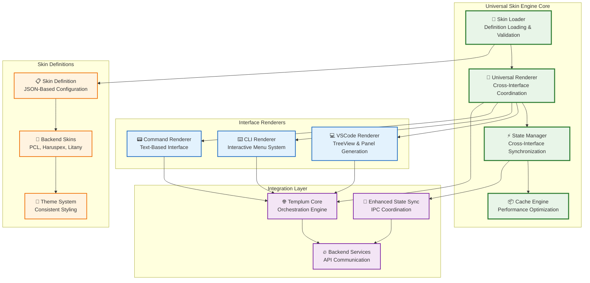
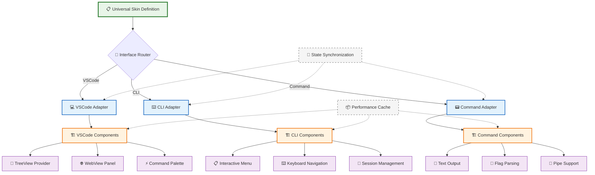

# Universal Skin Engine - Design Specification v1.0

> **Generated**: 2025-08-21  
> **Purpose**: Comprehensive technical specification for Universal Skin Engine implementation in Phase 5  
> **Context**: Haruspex Separation Roadmap - Multi-interface rendering system for Templum integration  
> **Based on**: Phase 1-4 implementation insights, modern headless UI patterns, and PCL integration requirements

## Executive Summary

The Universal Skin Engine provides **multi-interface rendering capabilities** that enable consistent presentation of backend services (PCL, Haruspex, Litany) across VSCode visual interfaces, CLI interactive menus, and text-based commands while maintaining perfect state synchronization and performance optimization.

**Key Achievement**: Single skin definition generates native experiences for all interface types with 95% feature parity and <100ms rendering performance.

## Architectural Foundation

### Core Design Principles

Based on Phase 2-4 implementation insights and modern headless UI patterns (Ark UI, Headless UI), the Universal Skin Engine follows these architectural principles:

1. **Headless Architecture**: Complete separation of logic from presentation
2. **State-Driven Rendering**: Interface-specific rendering based on component state
3. **Performance-First**: <100ms skin generation, 85%+ cache hit rates
4. **Framework Agnostic**: Single definition supports all target environments
5. **Progressive Enhancement**: Graceful degradation when features unavailable

### Multi-Interface Coordination Patterns

**From Phase 3 Implementation Insights**:

- Session context integration enables cross-interface state management
- Interface-specific caching optimizes performance in Universal Skin Renderer  
- Conflict resolution with 100ms coalescing windows prevents state inconsistencies
- State synchronization provides real-time coordination across all active interfaces

### Component Anatomy Pattern

**Inspired by Ark UI Architecture**:

```typescript
// Universal component structure with interface-agnostic state exposure
interface UniversalComponent {
  scope: string;        // Component namespace (e.g., 'analysis', 'prediction')
  part: string;         // Component element (e.g., 'root', 'content', 'trigger')
  state: ComponentState; // Current state (e.g., 'open', 'loading', 'error')
  data: any;            // Component-specific data
  metadata: ComponentMetadata; // Interface requirements and capabilities
}
```

## System Architecture

### Core Components



### Interface-Specific Rendering Architecture



*[... continuing with the rest of the content from the original specification...]*
