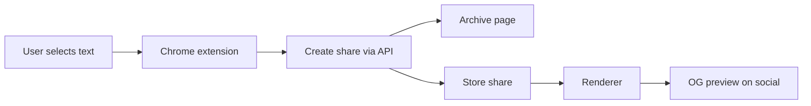

# contextgrabber — lean mvp proposal (quote + context sharing)

**version:** 1.0
**date:** 2025‑09‑18
**status:** ready for build (slim, reliable mvp)

---

## executive summary

quotes get stripped of context; discourse gets muddy. contextgrabber makes quote + surrounding context travel together as a durable, verifiable, and legible card. the mvp is intentionally slim: exact text anchoring, archive at creation, binary drift detection, auto ±2‑sentence context, and a hosted render with strong open‑graph previews. one creator surface (chrome extension) to start.

---

## objectives

* make quoted text precise, durable, verifiable.
* show author snippet and automatic neutral context (toggle + disclosure).
* survive page edits via archive fallback and a clear drift badge.
* work across social platforms via link previews → hosted render.
* keep scope tight: a single creator surface (chrome mv3 extension) for v1.

### non‑goals (v1)

* fuzzy text recovery, complex reputation systems, heavy moderation.
* cms plugins, signing/attestation, detailed analytics dashboards.

---

## product overview

**artifact:** a short url (“context share”) that renders a clean card:

* prominent quote (copyable)
* collapsible context (tabs: *author* | *auto ±2 sentences*)
* source link, timestamp, drift badge (`ok` or `changed`)

**creation:** chrome extension → select text → choose context policy → create share (short link copied to clipboard).

**distribution:** post the link anywhere; platforms show an OG preview; click opens the hosted render.

---

## architecture (high level)

* **creator:** chrome extension (single surface)
* **resolver/store:** append‑only shares (id → json) + simple index
* **renderer:** server‑rendered page with static OG tags + prerendered OG image
* **archiver:** save on create (memento/ia/perma.cc); record `archive_url`
* **metrics (minimal):** view + source‑click counters only



---

## user stories (mvp)

1. as a writer, i create a share from a page selection with an *author* snippet and optional *auto ±2 sentences* context.
2. as a reader, i see the quote, expand the context, and click through to the source.
3. as a reviewer, i’m warned when the live page no longer matches and can view the archived capture.

---

## selector model & drift handling

**selectors (v1):**

* `TextQuoteSelector` (w3c): `{ exact, prefix, suffix }`
* optional hint: simple css path to the nearest container

**resolution algorithm (exact‑first):**

1. fetch live page.
2. find the exact quote; if multiple matches, choose the one best matched by `{prefix,suffix}`.
3. if no exact match, use archive; mark `drift: changed`.
4. expand context per policy.

**drift badge:** `ok` (matched live) | `changed` (using archive/no live match).

---

## context policies

* `author_snippet_only` (explicit bounds)
* `auto_sentences_±2` (default)
* `combined` (tabs: author | auto)

**disclosure chip:** `context: author · auto available` (or vice versa).

---

## data model (v1)

```json
{
  "id": "ks8j3n",
  "url": "https://example.com/article",
  "canonical_url": "https://example.com/article",
  "quote_text": "The exact quoted text…",
  "selectors": {
    "textQuote": {"exact": "…", "prefix": "…", "suffix": "…"},
    "css": "article p:nth-of-type(12)"
  },
  "archive_url": "https://web.archive.org/web/…",
  "created_at": "2025-09-18T12:00:00Z",
  "context_policy": "combined",
  "context_config": {"auto_sentences": 2, "max_chars": 800},
  "display": {"truncate_chars": 320}
}
```

---

## api (v1)

**base:** `https://api.contextgrab.ber/v1`

* `POST /shares` → body: url + selection (exact/prefix/suffix + optional css) + `context_policy`
  returns: share (`id`, short\_url, `archive_url`)
* `GET /shares/{id}` → returns share json
* `GET /render/{id}` → server‑rendered html (og tags + card)

**open graph (renderer):**

* `og:title`: trimmed quote (≈100 chars)
* `og:description`: short auto context + source domain
* `og:image`: prerendered card image (cached by `id`)

---

## ux spec (mvp)

* **quote block:** large type; copy button; source domain; timestamp.
* **context block:** collapsed on mobile; tabs for *author* and *auto*.
* **drift badge:** binary with tooltip; link to archive when `changed`.
* **truncation:** uniform ellipsis + “open full”.
* **a11y:** keyboard navigation; aria labels.

---

## chrome extension (v1)

* context‑menu: “quote with context”.
* capture: exact text + small prefix/suffix window + optional css path.
* composer popup: preview, context policy, create → copy short url.

---

## archiving & durability

* on create: attempt archive capture; store `archive_url`.
* if blocked, continue without; still mark `changed` when the live text no longer matches.

---

## security, privacy, and legal (slim)

* **copyright & robots:** short defaults; always link through; site/page opt‑out:

  ```html
  <meta name="contextgrabber" content="noembed">
  ```

* **abuse limits:** per‑ip rate limiting; simple takedown channel.
* **csp & sandbox:** strict csp; no third‑party scripts beyond essentials.

---

## performance & reliability

* server‑rendered pages; cdn caching (5–15 min ttl).
* precomputed og images; graceful timeouts; archive fallback.

---

## analytics (minimal)

* counters only: `views`, `source_clicks` (domain‑level referrers).

---

## success metrics (first 90 days)

* 5k shares; ≥40% click‑through to source; `changed` ≤10%; 2 newsroom pilots; 100+ installs of the extension.

---

## roadmap

**mvp (2 weeks)** → selector (exact), archive on create, renderer + og, chrome extension, drift badge, minimal counters.
**phase 2 (3–6 weeks)** → wordpress/ghost/substack plugins, oembed, basic branding.
**phase 3 (6–12 weeks)** → language tuning, optional signing/attestation, richer analytics.

---

## appendices

**create payload (extension → api):**

```json
{
  "url": "https://example.com/post",
  "selection": {
    "exact": "We shape our tools and thereafter our tools shape us.",
    "prefix": "famously said, ",
    "suffix": " — in a talk"
  },
  "container": {"css": "article p:nth-of-type(23)"},
  "context_policy": "combined",
  "context_config": {"auto_sentences": 2}
}
```

**response:**

```json
{
  "id": "ks8j3n",
  "short_url": "https://cg.ber/s/ks8j3n",
  "archive_url": "https://web.archive.org/web/…",
  "created_at": "2025-09-18T12:00:00Z"
}
```

**og example:**

```html
<meta property="og:title" content="“We shape our tools and thereafter our tools shape us.”">
<meta property="og:description" content="…two sentences of neutral context… · example.com">
<meta property="og:image" content="https://cg.ber/og/ks8j3n.png">
<meta property="og:url" content="https://cg.ber/s/ks8j3n">
```

**selector resolution (pseudo):**

```pseudo
resolve(share):
  page = fetch(live_url, timeout=2s)
  if !page: return render(archive_url, drift="changed")

  matches = find_exact(page, share.selectors.textQuote.exact)
  match = best_with_prefix_suffix(matches, share.selectors.textQuote)
  if !match: return render(archive_url, drift="changed")

  ctx = expand_context(page, match, policy=share.context_policy)
  return render(page, ctx, drift="ok")
```

**publisher opt‑out:**

```html
<meta name="contextgrabber" content="noembed">
```

**implementation notes:** typescript (node/react); cf workers/pages + cdn; small kv/sql index; jsdom/cheerio; satori/canvas for og image; tests for exact‑match and archive fallback.

---

**goal:** ship a trustworthy quote card with the smallest honest surface area: precision, context, durability.
