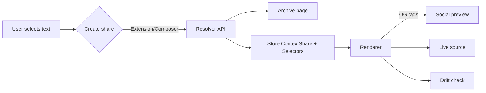

# contextgrabber — proposal v2 (quote + context sharing)

**version:** 2.0  
**date:** 2025‑09‑18  
**status:** ready for build (mvp scope locked; phased roadmap included)

---

## executive summary
people share quotes stripped of context; this muddies discourse. contextgrabber makes **quote + surrounding context** travel together as a durable, verifiable, and legible card that plays nicely with social platforms (via link previews), publishers (via plugins), and readers (via disclosure and drift detection). v2 hardens selectors, guards against link rot, respects copyright/opt‑outs, and adds a realistic go‑to‑market.

---

## objectives
- make quoted text **precise, durable, and easy to verify**.
- show **author‑chosen snippet** *plus* **automatic neutral context** (toggleable).
- survive page edits (selector fuzz + drift badges + archives).
- work across social platforms **without custom js** (link previews → hosted render).
- win adoption via **browser extension** and **publisher plugins** (wordpress/ghost/substack).

### non‑goals (for v1)
- adjudicating truth or running a reputation system.
- complex moderation/community notes.
- heavyweight identity/attestation beyond signed share objects.

---

## product overview
**artifact:** a "context share" (a short url) that renders a clean card:
- prominent **quote** (copyable);
- collapsible **context** (auto + author);
- **source link**, **timestamp**, **drift badge** if the live page changed;
- lightweight analytics (views, click‑through to source).

**creation paths:**
- web composer (paste a url, select text, tweak context)
- **browser extension** (select text on any page → "quote with context")
- **publisher plugin** button in cms editors (wordpress/ghost/substack)

**distribution:**
- social posts share the short url, which yields an **open graph card** (title/description/image) and opens a hosted render page with full interactivity.

---

## architecture (high level)
- **composer**: web app + extension + cms plugins
- **resolver service**: stores shares, resolves selectors on demand, computes drift/confidence
- **renderer**: server‑rendered share page with static OG tags (server‑side image generation for previews)
- **archiver**: memento/ia/perma.cc integration; own micro‑snapshot as fallback
- **signing**: jws (eddsa/ed25519) for tamper‑evidence (service‑signed by default; user‑key optional later)
- **analytics**: minimal events → privacy‑respecting metrics



---

## user stories (mvp)
1. as a journalist, i can create a context share from my article that includes +/- 2 sentences of neutral context and an author note.
2. as a reader on x/discord/slack, i see a quote preview and can expand to verify context; i can click through to the source.
3. as a publisher, i can add a one‑line script to my template and get a "quote with context" toolbar button.
4. as a skeptical reader, i can toggle **auto context** vs **author snippet** and see a disclosure chip explaining which i’m viewing.
5. as a reviewer, i see a **drift badge** if the source changed since capture.

---

## selector model & drift handling
**goals:** precision first; degrade gracefully.

**primary selectors (w3c web annotation):**
- `TextQuoteSelector`: `{ exact, prefix, suffix }`
- `TextPositionSelector`: `{ start, end }` (utf‑16 code unit offsets)

**fallbacks:**
- nearest stable container: css selector/xpath; element id if present
- block hash of nearest container (normalized text)

**resolution algorithm (v1):**
1. fetch **live** page; get **archive** fallback (stored url or on‑demand).
2. attempt exact match of `TextQuoteSelector.exact` within page; if multiple, choose the one whose `{prefix,suffix}` match best.
3. if fail, fuzzy match using damerau‑levenshtein within candidate container(s).
4. compute **confidence score** (0‑1). if < threshold (e.g., 0.85), switch to archived capture; show **drift badge** and offer "view archived".
5. expand context according to `context_policy`.

**drift badge states:**
- `ok`: exact match on live page.
- `minor`: fuzzy match on live page (text updated lightly).
- `changed`: live page no longer matches; using archive.

---

## context policies
- `author_snippet_only` (explicit author‑selected bounds)
- `auto_sentences_±N` (default: ±2)
- `auto_paragraph`
- `combined` (author snippet + toggle for auto)

**disclosure chip:** `context: author provided · auto available` (or vice‑versa)

---

## data model (v1)
```json
{
  "id": "ks8j3n",
  "url": "https://example.com/article",
  "canonical_url": "https://example.com/article",
  "quote_text": "The exact quoted text…",
  "selectors": {
    "textQuote": {"exact": "…", "prefix": "…", "suffix": "…"},
    "textPosition": {"start": 1234, "end": 1302},
    "css": "article p:nth-of-type(12)",
    "xpath": "//article/p[12]"
  },
  "source_block_hash": "sha256:…",
  "archive_url": "https://web.archive.org/web/…",
  "created_at": "2025-09-18T12:00:00Z",
  "context_policy": "combined",
  "context_config": {"auto_sentences": 2, "max_chars": 800},
  "display": {"show_context": true, "truncate_chars": 320},
  "signature": {"alg": "EdDSA", "kid": "svc:default", "jws": "eyJ…"}
}
```

---

## api (v1)
**base:** `https://api.contextgrab.ber/v1`

- `POST /shares`
  - body: `ContextShareCreate` (url, selectors or raw selection with offsets, context_policy)
  - returns: `ContextShare` (`id`, short url, drift status)

- `GET /shares/{id}`
  - returns: `ContextShare`

- `GET /render/{id}`
  - server‑rendered html (seo + og tags) for previews and full view

- `HEAD /shares/{id}/status`
  - returns headers with `x-drift: ok|minor|changed`, `x-confidence: 0.93`

- `GET /.well-known/oembed?url={share_url}`
  - basic oembed for platforms that support it

**open graph tags (renderer):**
- `og:title`: a clean, trimmed quote (e.g., first 100 chars + ellipsis)
- `og:description`: short neutral context + source domain
- `og:image`: server‑generated card (text‑on‑image; cache for 7 days)

---

## ux spec (mvp)
- **quote block:** large type, copy button, source domain, timestamp.
- **context block:** collapsed by default on mobile; toggle to expand (shows auto + author tabs).
- **badges:** `drift: ok/minor/changed` with tooltip explaining state.
- **truncation:** ellipsis + "open full" affordance; consistent between quote/context.
- **keyboard a11y:** tab order, space/enter toggles; aria labels for toggles/badges.

---

## browser extension (v1)
- context menu: "quote with context"
- selection capture: exact text, surrounding text (±500 chars), offsets, container css/xpath
- composer popup: preview, choose context policy, add author note (optional)
- submit → gets short url copied to clipboard

---

## publisher integrations (phase 2)
- **wordpress plugin**: adds editor toolbar button; server‑side call to api; stores short url in post content; optional server‑side render on publisher domain.
- **ghost/substack**: simple embed block; paste share url → resolves to card.
- **one‑line script** (progressive enhancement): adds inline button to selected elements on publisher pages.

---

## archiving & durability
- on create: attempt memento/ia/perma.cc capture; store `archive_url` if successful.
- if robots/copyright blocks capture, store a **lightweight normalized text snapshot** (for drift diff only; never publicly shown if disallowed).
- compute and store `source_block_hash` for diff.

---

## security, privacy, and legal
- **pii guard:** lightweight client‑side scan (regex + heuristics) warns creators before publishing if context likely contains phone/email/address; allow override with reason.
- **copyright & robots:** short context by default; always link to source. respect robots and add **publisher opt‑out**:
  ```html
  <meta name="contextgrabber" content="noembed">
  ```
- **tamper‑evidence:** service‑signed `ContextShare` (jws/ed25519); public jwk at `/.well-known/jwks.json`.
- **abuse limits:** per‑ip rate limiting; hash‑based dedupe; takedown email + simple removal flow.
- **csp & sandbox:** strict csp on renderer; no third‑party scripts beyond required analytics.

---

## performance & reliability
- server‑rendered pages + cdn caching (5–15 min ttl)
- prerender og images (html → image) and cache by `id` + `drift` state
- timeouts for live fetch; graceful fallback to archive
- observability: uptime, render latency p95, selector resolution success rate

---

## analytics (privacy‑light)
- events: `share_created`, `render_view`, `context_toggled`, `source_clicked`
- metrics surfaced to creators/publishers: views, ctr to source, drift rate, referrers (domain‑level)

---

## success metrics (first 90 days)
- 5k shares created; ≥40% render→source ctr; ≤10% `changed` drift rate; 2 newsroom/publisher pilots live; wp plugin ≥100 installs.

---

## roadmap & timeline
**phase 1 — mvp (2 weeks)**
- selector engine (exact + fuzzy; confidence scoring)
- renderer with og tags + drift badge
- web composer + chrome extension (firefox later)
- archive integration + lightweight snapshot fallback
- minimal analytics & signing

**acceptance criteria:** create→share in < 90s; og preview renders on x/discord/slack; drift states visible; archive used when live mismatch.

**phase 2 — publisher tooling (3–6 weeks)**
- wordpress plugin; ghost/substack embed
- server jwk + public verify endpoint
- per‑publisher branding options on og image

**phase 3 — pilots & polish (6–12 weeks)**
- newsroom pilots, case studies
- multi‑language selector tuning
- org‑signed shares (publisher keys)
- pii guard improvements

---

## risks & mitigations
- **platform throttling of external links** → lean on compelling og cards + extension; cultivate publisher embeds.
- **selector fragility** → archive + fuzzy matching + drift badges; iterative tuning.
- **copyright complaints** → short defaults, opt‑out meta, clear links; legal review before v1.
- **low adoption** → prioritize tooling where creators live (extension + wp); produce case studies.

---

## open questions (flag for decision)
- default `context_policy`: `combined` or `auto_sentences_±2`?
- maximum displayed characters for quote/context in renderer and og image?
- do we allow author notes in v1, or defer to v2 to keep the card focused?
- do we store light snapshots always, or only when archive blocked?

---

## appendix a — example payloads
**create (extension → api):**
```json
{
  "url": "https://example.com/post",
  "selection": {
    "exact": "We shape our tools and thereafter our tools shape us.",
    "prefix": "famously said, ",
    "suffix": " — in a talk",
    "start": 5432,
    "end": 5496
  },
  "container": {"css": "article p:nth-of-type(23)", "xpath": "//article/p[23]"},
  "context_policy": "combined",
  "context_config": {"auto_sentences": 2}
}
```

**response:**
```json
{
  "id": "ks8j3n",
  "short_url": "https://cg.ber/s/ks8j3n",
  "drift": "ok",
  "created_at": "2025-09-18T12:00:00Z"
}
```

---

## appendix b — og example
```html
<meta property="og:title" content="“We shape our tools and thereafter our tools shape us.”">
<meta property="og:description" content="…two sentences of neutral context… · example.com">
<meta property="og:image" content="https://cg.ber/og/ks8j3n.png">
<meta property="og:url" content="https://cg.ber/s/ks8j3n">
```

---

## appendix c — selector resolution (pseudocode)
```pseudo
function resolve(share):
  page = fetch(share.url, timeout=2s)
  if !page: return useArchive(share)

  match = exactFind(page, share.selectors.textQuote.exact)
  if multiple: match = bestWithPrefixSuffix(match, share.selectors.textQuote)
  if !match: match = fuzzyWithinContainer(page, share.selectors)

  conf = confidence(match)
  if conf < 0.85:
     archived = fetch(share.archive_url)
     if archived: return {source: archived, drift: "changed", conf}

  ctx = expandContext(page, match, policy=share.context_policy)
  return {source: page, match, context: ctx, drift: conf<1?"minor":"ok", conf}
```

---

## appendix d — publisher opt‑outs
publishers can opt out entirely or by path with a meta tag:
```html
<meta name="contextgrabber" content="noembed"> <!-- page level -->
<meta name="contextgrabber" content="noembed:/private/*,/members/*"> <!-- site level config -->
```

---

## notes for implementation
- languages: typescript (node + react); go or node for resolver; chrome mv3 for extension.
- libraries: jsdom/cheerio for parsing; damerau‑levenshtein; open graph image via satori/canvas.
- infra: small node service + postgres; cloudflare pages/workers for renderer + cdn; s3 (snapshots).
- testing: golden tests for selector resolution; live‑page mutation tests; og snapshot diff tests.

---

**done well, this becomes the “quote card” default: fast to make, hard to misrepresent, easy to verify.**

