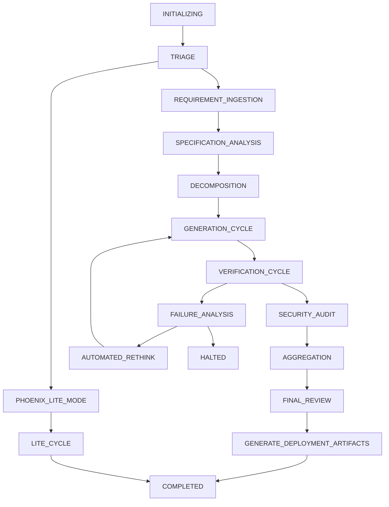
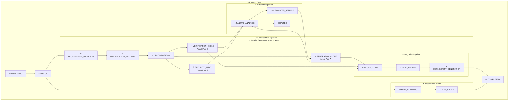

# StateFlow Model: Orchestrating AI-Driven Development

## Overview

The StateFlow model is Phoenix Framework's finite state machine (FSM) approach to orchestrating complex, multi-step software development processes. It provides a robust, interpretable, and highly controllable structure for managing the entire project generation workflow.

## Architectural Foundation

### Why Finite State Machines?

Traditional AI interactions are often stateless, with each request independent and no memory beyond the current context window. This approach is fundamentally inadequate for project management, which requires:

- **Persistent Context**: Memory of decisions made across multiple stages
- **Complex Workflows**: Handling branching logic, error states, and iterative cycles
- **Dynamic Replanning**: Ability to adapt based on intermediate results
- **Audit Trails**: Clear tracking of decisions and state transitions

### StateFlow vs. Alternative Orchestration Models

| Model             | Strengths      | Weaknesses      | Use Case Fit    | Architecture    |
|-------------------|----------------|-----------------|-----------------|-----------------|
| **Linear Chains** | Simple to      | Too rigid for   | Simple,         | Sequential      |
|                   | implement,     | complex logic   | sequential      | execution of    |
|                   | predictable    |                 | tasks           | predefined      |
|                   |                |                 |                 | tasks with no   |
|                   |                |                 |                 | branching.      |
|-------------------|----------------|-----------------|-----------------|-----------------|
| **Conversational**| Natural        | Difficult to    | Research,       | Agent-based     |
| **Agents**        | interaction,   | control &       | exploration,    | model with      |
|                   | flexible       | audit           | chatbots        | dynamic         |
|                   |                |                 |                 | dialogue        |
|                   |                |                 |                 | management and  |
|                   |                |                 |                 | context         |
|                   |                |                 |                 | switching.      |
|-------------------|----------------|-----------------|-----------------|-----------------|
| **Finite State**  | Predictable,   | State explosion | Protocol        | Explicit        |
| **Machine (FSM)** | auditable,     | in complex      | handling,       | states,         |
|                   | simple         | systems         | simple UI logic | transitions,    |
|                   |                |                 |                 | and events      |
|                   |                |                 |                 | based on a      |
|                   |                |                 |                 | formal model.   |
|-------------------|----------------|-----------------|-----------------|-----------------|
| **Statecharts /** | Manages        | Can be overkill | Complex UI,     | FSMs extended   |
| **H-FSMs**        | complexity,    | for simple      | embedded        | with hierarchy  |
| *** RECOMMENDED** | modular,       | flows           | systems, game   | (nested         |
| **FOR PHOENIX**   | visual         |                 | AI, **AI        | states),        |
|                   |                |                 | development     | concurrency,    |
|                   |                |                 | workflows**     | and history.    |
|-------------------|----------------|-----------------|-----------------|-----------------|
| **Behavior Trees**| Hierarchical,  | Less suited for | Game AI,        | Tree of nodes   |
|                   | modular,       | complex data    | robotics,       | (sequence,      |
|                   | reactive       | flows           | autonomous      | selector,       |
|                   |                |                 | agents          | action) that    |
|                   |                |                 |                 | ticks           |
|                   |                |                 |                 | frequently to   |
|                   |                |                 |                 | determine       |
|                   |                |                 |                 | behavior.       |
|-------------------|----------------|-----------------|-----------------|-----------------|
| **Dataflow /**    | High           | Difficult to    | ETL, ML         | Directed        |
| **Pipeline DAGs** | parallelism,   | debug, less     | pipelines,      | Acyclic Graph   |
|                   | scalable,      | interpretable   | data            | where nodes     |
|                   | clear deps     |                 | processing      | are tasks and   |
|                   |                |                 |                 | edges are data  |
|                   |                |                 |                 | dependencies.   |
|-------------------|----------------|-----------------|-----------------|-----------------|
| **Rule Engine**   | Declarative,   | Hard to model   | Business        | A fact base     |
|                   | easy to modify | complex         | logic,          | (working        |
|                   | business logic | sequences       | compliance,     | memory) and an  |
|                   |                |                 | expert systems  | inference       |
|                   |                |                 |                 | engine that     |
|                   |                |                 |                 | evaluates a     |
|                   |                |                 |                 | set of rules.   |
|-------------------|----------------|-----------------|-----------------|-----------------|
| **Event Sourcing**| Full audit     | Eventual        | Financial       | State is        |
| *** COMPLEMENT**  | trail,         | consistency,    | systems,        | stored as a     |
| **TO PHOENIX**    | replayability, | query           | audit-heavy     | sequence of     |
|                   | time travel    | complexity      | domains,        | immutable       |
|                   |                |                 | **AI workflow   | events, not a   |
|                   |                |                 | debugging**     | final state.    |
|-------------------|----------------|-----------------|-----------------|-----------------|
| **Actor Model**   | High           | Debugging can   | Distributed     | Isolated        |
|                   | concurrency,   | be complex (no  | systems,        | actors with     |
|                   | fault          | shared state)   | high-           | private state   |
|                   | isolation      |                 | concurrency     | that            |
|                   |                |                 | apps            | communicate     |
|                   |                |                 |                 | via             |
|                   |                |                 |                 | asynchronous    |
|                   |                |                 |                 | message         |
|                   |                |                 |                 | passing.        |
|-------------------|----------------|-----------------|-----------------|-----------------|
| **Saga Pattern**  | Manages        | Compensation    | Microservices,  | A sequence of   |
|                   | distributed    | logic can be    | long-running    | local           |
|                   | transactions,  | complex         | processes       | transactions    |
|                   | resilient      |                 |                 | where each has  |
|                   |                |                 |                 | a compensating  |
|                   |                |                 |                 | action for      |
|                   |                |                 |                 | rollbacks.      |
|-------------------|----------------|-----------------|-----------------|-----------------|
| **Orchestration** | Centralized    | Single point of | Enterprise      | A central       |
|                   | control, high  | failure,        | automation,     | coordinator     |
|                   | visibility     | potential       | microservice    | (orchestrator)  |
|                   |                | bottleneck      | workflows       | explicitly      |
|                   |                |                 |                 | directs         |
|                   |                |                 |                 | services and    |
|                   |                |                 |                 | manages state.  |
|-------------------|----------------|-----------------|-----------------|-----------------|
| **Choreography**  | Decentralized, | Low visibility  | Event-driven    | Services react  |
|                   | scalable,      | of overall      | systems, highly | to each         |
|                   | resilient      | process, hard   | decoupled       | other's events  |
|                   |                | to debug        | microservices   | without a       |
|                   |                |                 |                 | central         |
|                   |                |                 |                 | coordinator.    |
|-------------------|----------------|-----------------|-----------------|-----------------|
| **Stateful**      | Granular task  | Increased       | Long-running    | Command         |
| **Command**       | control,       | object          | interactive     | objects that    |
| **Pattern**       | observable     | complexity,     | tasks,          | are mini-FSMs,  |
|                   | actions        | novel pattern   | pausable jobs   | encapsulating   |
|                   |                |                 |                 | their own       |
|                   |                |                 |                 | execution       |
|                   |                |                 |                 | state.          |
|-------------------|----------------|-----------------|-----------------|-----------------|
| **Stateful**      | Decentralized &| High            | Resilient       | Choreographed   |
| **Choreography**  | observable,    | implementation  | systems where a | services using  |
|                   | resilient      | complexity,     | central         | CRDTs or        |
|                   |                | novel pattern   | coordinator is  | gossip          |
|                   |                |                 | a liability     | protocols to    |
|                   |                |                 |                 | maintain a      |
|                   |                |                 |                 | shared,         |
|                   |                |                 |                 | auditable       |
|                   |                |                 |                 | state.          |
|-------------------|----------------|-----------------|-----------------|-----------------|
| **Hypermedia-**   | Manages server | Higher learning | Complex         | Server manages  |
| **driven**        | state          | curve, chatty   | multi-step web  | state, but all  |
| **Stateful API**  | gracefully,    |                 | workflows       | valid state     |
|                   | self-          |                 |                 | transitions     |
|                   | documenting    |                 |                 | are exposed     |
|                   |                |                 |                 | via hypermedia  |
|                   |                |                 |                 | links           |
|                   |                |                 |                 | (HATEOAS).      |
|-------------------|----------------|-----------------|-----------------|-----------------|

## Evolutionary Path: StateFlow to Hierarchical State Management

### Why StateFlow Works Well for Phoenix

StateFlow FSM is well-suited for Phoenix's current needs because it provides:

- **Predictable Execution**: Clear state transitions enable reliable orchestration
- **Auditability**: Every transition is traceable and debuggable
- **Error Handling**: Explicit failure states and recovery paths
- **Human Oversight**: HALTED state provides intervention points

### Recommended Evolution: Statecharts/H-FSMs

While StateFlow FSM serves Phoenix well, **Hierarchical Finite State Machines (Statecharts)** would provide significant advantages:

#### Core Benefits of H-FSM for Phoenix

1. **Hierarchy Management**: Natural organization of complex sub-states like GENERATION_CYCLE and VERIFICATION_CYCLE
2. **Concurrency Support**: Multiple agents can operate in parallel within hierarchical boundaries  
3. **Reduced Complexity**: Hierarchical decomposition prevents state explosion as Phoenix grows
4. **Visual Modeling**: Enhanced human comprehension through graphical state representations
5. **Modularity**: Independent sub-FSMs can be developed, tested, and maintained separately

#### Evolutionary Architecture

```text
Phoenix StateFlow Evolution:

Current: Flat FSM
INITIALIZING → TRIAGE → REQUIREMENT_INGESTION → ... → COMPLETED

Future: Hierarchical FSM (Statecharts)
┌─ PHOENIX_CORE ─────────────────────────────────┐
│  ├─ INITIALIZING                               │
│  ├─ TRIAGE                                     │
│  └─ DEVELOPMENT_PIPELINE ──────────────────────┤
│     ├─ REQUIREMENT_INGESTION                   │
│     ├─ SPECIFICATION_ANALYSIS                  │
│     ├─ DECOMPOSITION                           │
│     └─ PARALLEL_GENERATION ────────────────────┤
│        ├─ GENERATION_CYCLE (Agent Pool A)      │
│        ├─ VERIFICATION_CYCLE (Agent Pool B)    │
│        └─ SECURITY_AUDIT (Agent Pool C)        │
│     └─ INTEGRATION_PIPELINE ───────────────────┤
│        ├─ AGGREGATION                          │
│        ├─ FINAL_REVIEW                         │
│        └─ DEPLOYMENT_GENERATION                │
└────────────────────────────────────────────────┘
```

### Complementary: Event Sourcing Integration

Event Sourcing provides excellent complementary capabilities to StateFlow:

#### Phoenix-Specific Event Sourcing Benefits

1. **Complete Audit Trail**: Every AI decision, state transition, and artifact generation is permanently logged
2. **Replay Debugging**: Failed project runs can be replayed step-by-step for analysis
3. **Pattern Learning**: Historical project data enables AI learning and optimization
4. **Time Travel**: Ability to examine project state at any point in development timeline
5. **Compliance**: Full traceability for regulatory or quality assurance requirements

#### Hybrid Architecture: StateFlow + Event Sourcing

```rust
// Conceptual Integration
struct PhoenixOrchestrator {
    state_machine: HierarchicalFSM,
    event_store: EventStore,
    current_context: ProjectContext,
}

impl PhoenixOrchestrator {
    async fn transition_to(&mut self, new_state: State, reason: String) -> Result<()> {
        // Record the state transition as an event
        let event = StateTransitionEvent {
            from_state: self.state_machine.current_state(),
            to_state: new_state,
            timestamp: Utc::now(),
            reason,
            context: self.current_context.clone(),
        };
        
        // Store the event (immutable audit trail)
        self.event_store.append(event).await?;
        
        // Execute the state transition
        self.state_machine.transition_to(new_state).await?;
        
        Ok(())
    }
    
    async fn replay_from_checkpoint(&mut self, checkpoint_id: EventId) -> Result<()> {
        // Reset to initial state
        self.state_machine.reset();
        
        // Replay all events from checkpoint
        let events = self.event_store.events_since(checkpoint_id).await?;
        for event in events {
            self.apply_event(event).await?;
        }
        
        Ok(())
    }
}
```

### Implementation Roadmap

#### Phase 1: Enhanced StateFlow (Current + Improvements)

- Add sub-state management for complex cycles
- Implement basic event logging for audit trails
- Enhance error recovery mechanisms

#### Phase 2: Hierarchical Migration

- Refactor flat FSM into hierarchical structure
- Implement concurrent sub-state execution
- Add visual state modeling capabilities

#### Phase 3: Full Event Sourcing

- Implement comprehensive event store
- Add replay and time-travel debugging
- Enable pattern learning from historical data

#### Benefits of Evolutionary Approach

- **Non-disruptive**: Existing StateFlow logic remains intact
- **Incremental Value**: Each phase delivers immediate benefits
- **Risk Mitigation**: Gradual migration reduces implementation risk
- **Learning Integration**: Lessons from each phase inform subsequent development

## StateFlow Architecture

### Core Components

#### 1. States

Discrete stages in the project lifecycle, each with:

- **Entry Conditions**: Prerequisites for entering the state
- **Primary Actions**: Core work performed in this state
- **Exit Conditions**: Criteria for successful completion
- **Responsible Agent(s)**: Which agents are active in this state

#### 2. Transitions

Rules governing movement between states:

- **Success Transitions**: Path taken when state completes successfully
- **Failure Transitions**: Alternative paths for error conditions
- **Conditional Logic**: Complex branching based on intermediate results
- **Loop Transitions**: Ability to return to previous states for refinement

#### 3. State Context

Persistent information maintained across the entire workflow:

- **Project Artifacts**: SRS, WBS, generated code, test results
- **Decision History**: Audit trail of all state transitions and reasoning
- **Resource Allocation**: Tracking of computational resources and costs
- **Quality Metrics**: Accumulated quality indicators and validation results

## Complete StateFlow Definition

### Primary States

#### Current StateFlow (Flat FSM)



#### Future Hierarchical StateFlow (H-FSM)



### Detailed State Specifications

#### INITIALIZING

**Purpose**: System startup and environment preparation  
**Responsible Agent**: Orchestrator Agent  
**Entry Condition**: System start with user query  
**Primary Actions**:

- Setup project environment and workspace
- Load necessary configurations and templates
- Validate prerequisites and system requirements
- Initialize project memory and context storage

**Exit Conditions**:

- ✓ Environment ready → TRIAGE
- ✗ Setup failure → HALTED

---

#### TRIAGE

**Purpose**: Route request to appropriate processing workflow  
**Responsible Agent**: Triage Agent  
**Entry Condition**: Valid user query received  
**Primary Actions**:

- Analyze request complexity and scope
- Assess resource requirements and constraints
- Determine optimal processing path
- Set initial project parameters

**Decision Matrix**:

- **Simple Request** (CRUD, bug fixes, isolated features) → PHOENIX_LITE_MODE
- **Complex Request** (new projects, integrations) → REQUIREMENT_INGESTION
- **Novel/Unclear Request** → HALTED (human clarification)

---

#### REQUIREMENT_INGESTION

**Purpose**: Generate comprehensive Software Requirements Specification  
**Responsible Agent**: Requirements Analyst Agent  
**Entry Condition**: Complex project routed from TRIAGE  
**Primary Actions**:

- Parse and analyze user request for completeness
- Generate clarifying questions for ambiguous requirements
- Create structured SRS following IEEE 830 standards
- Validate requirement consistency and feasibility

**Quality Gates**:

- All functional requirements clearly defined
- Non-functional requirements specified with measurable criteria
- Interface requirements documented
- Assumptions and dependencies identified

**Exit Conditions**:

- ✓ Complete, valid SRS generated → SPECIFICATION_ANALYSIS
- ✗ Irreconcilable ambiguities → HALTED

---

#### SPECIFICATION_ANALYSIS

**Purpose**: Analyze SRS for architectural patterns and complexity  
**Responsible Agents**: Decomposition Agent + Test Engineer Agent  
**Entry Condition**: Valid SRS available  
**Primary Actions**:

- Identify major system components and interfaces
- Analyze architectural patterns and design constraints
- Assess testability and quality assurance requirements
- Define high-level acceptance criteria

**Exit Conditions**:

- ✓ Analysis complete → DECOMPOSITION
- ✗ SRS requires revision → REQUIREMENT_INGESTION

---

#### DECOMPOSITION

**Purpose**: Create hierarchical Work Breakdown Structure  
**Responsible Agent**: Decomposition Agent  
**Entry Condition**: Specification analysis complete  
**Primary Actions**:

- Break down SRS into Epics, Stories, and Tasks
- Create hierarchical task structure with dependencies
- Assign complexity scores and effort estimates
- Validate coverage of all requirements

**Output Structure**:

```json
{
  "project_name": "string",
  "work_items": [
    {
      "id": "EPIC-001",
      "type": "Epic",
      "title": "User Management System",
      "description": "Complete user lifecycle management",
      "children": ["STORY-001", "STORY-002"],
      "dependencies": [],
      "complexity": "high"
    }
  ]
}
```

**Exit Conditions**:

- ✓ Complete WBS generated → GENERATION_CYCLE
- ✗ Requirements gaps identified → REQUIREMENT_INGESTION

---

#### GENERATION_CYCLE (Sub-FSM)

**Purpose**: Execute Generative Test-Driven Development for individual tasks  
**Responsible Agents**: Test Engineer Agent + Implementation Agent  
**Entry Condition**: WBS available with unprocessed tasks  

**Internal States**:

1. **SELECT_TASK**: Choose next task from WBS based on dependencies
2. **GENERATE_TESTS**: Create comprehensive test suite for selected task
3. **IMPLEMENT_CODE**: Write minimal code to satisfy tests
4. **REFACTOR_CODE**: Improve code quality while maintaining test coverage

**Loop Logic**:

- Continue until all WBS tasks are processed
- Each task must pass through all internal states
- Failed tasks trigger escalation to FAILURE_ANALYSIS

**Exit Conditions**:

- ✓ All tasks implemented and tested → VERIFICATION_CYCLE
- ✗ Persistent implementation failures → FAILURE_ANALYSIS

---

#### VERIFICATION_CYCLE (Sub-FSM)

**Purpose**: Comprehensive quality assurance and validation  
**Responsible Agent**: Verification Agent  
**Entry Condition**: Generated components available  

**Verification Phases**:

1. **UNIT_TESTING**: Execute all unit tests in isolated environment
2. **INTEGRATION_TESTING**: Validate component interactions
3. **CONSISTENCY_ANALYSIS**: Verify code-documentation alignment
4. **PERFORMANCE_VALIDATION**: Basic performance and resource checks

**Quality Metrics**:

- Test coverage percentage
- Code quality scores (complexity, maintainability)
- Performance benchmarks
- Documentation completeness

**Exit Conditions**:

- ✓ All verification phases pass → SECURITY_AUDIT
- ✗ Critical failures identified → FAILURE_ANALYSIS

---

#### SECURITY_AUDIT

**Purpose**: Automated security vulnerability assessment  
**Responsible Agent**: Security Analyst Agent  
**Entry Condition**: Code passes verification cycle  
**Primary Actions**:

- Static Application Security Testing (SAST) scan
- Dependency vulnerability assessment
- Security pattern analysis
- Compliance validation against security standards

**Security Scope**:

- Common vulnerabilities (OWASP Top 10)
- Insecure coding patterns
- Vulnerable dependencies
- Data protection compliance

**Exit Conditions**:

- ✓ No critical security issues → AGGREGATION
- ✗ Critical vulnerabilities found → FAILURE_ANALYSIS

---

#### FAILURE_ANALYSIS

**Purpose**: Root cause analysis and remediation planning  
**Responsible Agent**: Verification Agent  
**Entry Condition**: Failure in GENERATION_CYCLE, VERIFICATION_CYCLE, or SECURITY_AUDIT  
**Primary Actions**:

- Systematic analysis of failure logs and context
- Pattern matching against known failure modes
- Generate specific remediation recommendations
- Assess if issue requires architectural changes

**Remediation Strategies**:

- **Implementation Fix**: Return to GENERATION_CYCLE with specific guidance
- **Architectural Rethink**: Escalate to AUTOMATED_RETHINK
- **Human Intervention**: Transition to HALTED for expert review

---

#### AUTOMATED_RETHINK

**Purpose**: Meta-level problem solving for persistent failures  
**Responsible Agent**: Supervisor Agent  
**Entry Condition**: Repeated failures from FAILURE_ANALYSIS  
**Primary Actions**:

- Analyze complete execution history and patterns
- Identify fundamental architectural or approach issues
- Generate alternative strategies and approaches
- Provide detailed guidance for strategy implementation

**Strategic Options**:

- Alternative architectural patterns
- Different technology choices
- Simplified implementation approaches
- Requirement clarification or reduction

**Exit Conditions**:

- ✓ New strategy generated → GENERATION_CYCLE
- ✗ No viable strategy found → HALTED

---

#### AGGREGATION

**Purpose**: Integrate all verified components into cohesive project  
**Responsible Agent**: Orchestrator Agent  
**Entry Condition**: All WBS tasks completed and verified  
**Primary Actions**:

- Integrate all generated components
- Resolve interface dependencies
- Create unified project structure
- Generate integration documentation

**Integration Validation**:

- All components properly integrated
- Interface contracts satisfied
- No conflicting dependencies
- Unified build and test execution

**Exit Conditions**:

- ✓ Successful integration → FINAL_REVIEW
- ✗ Integration conflicts → FAILURE_ANALYSIS

---

#### FINAL_REVIEW

**Purpose**: Comprehensive project validation against original requirements  
**Responsible Agent**: Orchestrator Agent  
**Entry Condition**: Successful component aggregation  
**Primary Actions**:

- Validate against original SRS requirements
- Execute comprehensive integration tests
- Verify all quality gates satisfied
- Generate final project report

**Validation Checklist**:

- [ ] All functional requirements implemented
- [ ] Non-functional requirements satisfied
- [ ] Security audit passed
- [ ] Documentation complete
- [ ] Deployment readiness verified

**Exit Conditions**:

- ✓ All requirements satisfied → GENERATE_DEPLOYMENT_ARTIFACTS
- ✗ Requirements gaps identified → FAILURE_ANALYSIS

---

#### GENERATE_DEPLOYMENT_ARTIFACTS

**Purpose**: Create production-ready deployment resources  
**Responsible Agent**: Deployment Agent  
**Entry Condition**: Final review passed  
**Primary Actions**:

- Generate Docker containers and configurations
- Create CI/CD pipeline definitions
- Produce deployment documentation
- Setup monitoring and observability configurations

**Deployment Artifacts**:

- Container images and orchestration files
- Infrastructure as Code templates
- CI/CD pipeline configurations
- Monitoring and alerting setup
- Production deployment guides

**Exit Conditions**:

- ✓ All artifacts generated → COMPLETED
- ✗ Deployment issues → FAILURE_ANALYSIS

---

#### COMPLETED

**Purpose**: Successful project completion  
**Responsible Agent**: Orchestrator Agent  
**Entry Condition**: All deployment artifacts generated  
**Final Actions**:

- Package all project deliverables
- Generate comprehensive project report
- Archive project context and lessons learned
- Clean up temporary resources

---

#### HALTED

**Purpose**: Pause for mandatory human intervention  
**Responsible Agent**: Orchestrator Agent  
**Entry Conditions**:

- Irrecoverable errors from any state
- Novel situations requiring human judgment
- Resource constraints or external dependencies

**Human Intervention Types**:

- **Strategic Guidance**: Clarify ambiguous requirements or objectives
- **Technical Resolution**: Solve complex technical issues beyond AI capability
- **Resource Authorization**: Approve additional computational resources or time
- **Quality Judgment**: Make subjective decisions about acceptability

## Phoenix-Lite Mode StateFlow

For simpler requests, Phoenix-Lite uses a streamlined state flow:

> TRIAGE → PHOENIX_LITE_MODE → LITE_CYCLE → COMPLETED

### LITE_CYCLE (Simplified Sub-FSM)

1. **PLAN_AND_TEST**: Single analysis and test generation step
2. **IMPLEMENT_AND_FIX**: Iterative implementation with automated retries
3. **REFACTOR_AND_DOCUMENT**: Final cleanup and documentation

## State Persistence and Recovery

### Context Preservation

All state transitions are logged with complete context, enabling:

- **Resume Capability**: Restart from any previous state
- **Audit Trails**: Complete history of decisions and rationale
- **Learning**: Pattern recognition for future project optimization

### Failure Recovery

- **Checkpoint System**: Regular state snapshots for rollback capability
- **Graceful Degradation**: Fallback to simpler approaches when complex ones fail
- **Human Handoff**: Structured transition to human control when needed

## Monitoring and Observability

### State Metrics

- **Transition Times**: Performance measurement for each state
- **Success Rates**: Quality metrics for state completion
- **Resource Usage**: Computational cost tracking per state
- **Error Patterns**: Analysis of common failure modes

### Quality Indicators

- **Requirements Coverage**: Percentage of original requirements satisfied
- **Test Coverage**: Code coverage metrics across all components
- **Security Score**: Vulnerability assessment results
- **Documentation Completeness**: Coverage of all generated artifacts

---

*The StateFlow model provides the structured, predictable orchestration necessary for reliable autonomous software development at scale.*
