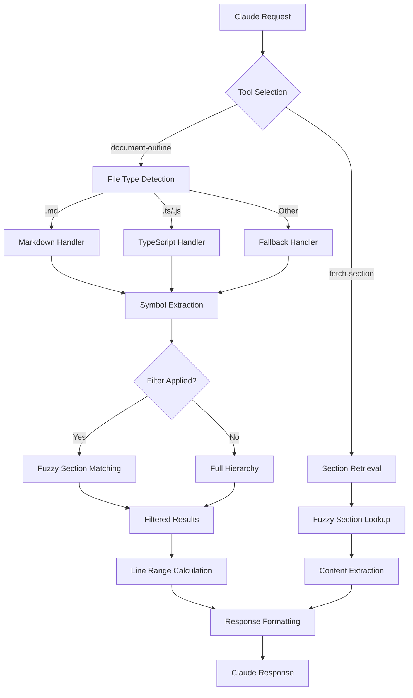

# Document Outline Tool for Claude Code - Architecture & Implementation Guide

## Executive Summary

Think of document parsing as building a GPS for textual navigation. Just as a GPS transforms complex road networks into hierarchical routes (highways → streets → addresses), a document outline tool transforms complex document structures into navigable hierarchies (chapters → sections → subsections). This tool will serve as Claude Code's "document GPS," providing immediate structural awareness for any file.

The optimal solution is a purpose-built MCP server that leverages existing parsing libraries while optimizing specifically for AI assistant navigation and comprehension, rather than human IDE display.

## Problem Impact Analysis

### Current Claude Code Limitations

**Context Window Constraints**: Claude Code consistently struggles with files exceeding ~2000 lines, leading to:

- **Incomplete Document Understanding**: Missing entire sections beyond context limits
- **Inconsistent Analysis**: Different responses to the same query depending on which portions are visible
- **Navigation Inefficiency**: Users resort to manual file segmentation or multiple queries
- **Context Waste**: Loading entire large files when only specific sections are needed

### Real-World Impact Scenarios

**Technical Documentation Navigation**:

- Large API documentation (5000+ lines) requires multiple queries to understand structure
- Installation guides with platform-specific sections get truncated
- Troubleshooting sections buried deep in documents are invisible to Claude

**Codebase Analysis**:

- Large TypeScript files with multiple classes/interfaces partially analyzed
- Configuration files with numerous sections require manual chunking
- README files with comprehensive project information incompletely processed

**Content Creation and Editing**:

- Multi-chapter documents lose coherence across sections
- Cross-referencing between distant sections impossible
- Structural editing hampered by incomplete document view

### Why Existing Approaches Fall Short

**Semantic Chunking Problems**:

- **Context Pollution**: Overlapping chunks consume valuable context window space
- **Boundary Issues**: Semantically related content split across chunks
- **Processing Overhead**: Multiple embedding/similarity calculations required
- **Relevance Uncertainty**: Chunk selection may miss important related content

**Manual File Segmentation**:

- **User Burden**: Requires manual effort to identify relevant sections
- **Knowledge Requirement**: User must already understand document structure
- **Context Loss**: Inter-section relationships lost when viewing in isolation
- **Maintenance Overhead**: File changes require re-segmentation

### Solution Validation

This document outline approach specifically addresses these issues by:

1. **Preserving Context Efficiency**: Only load exactly what's needed
2. **Maintaining Document Coherence**: Understand full structure before accessing content
3. **Enabling Precise Navigation**: Target specific sections with surgical precision
4. **Supporting Natural Language Queries**: "Get installation section" works intuitively

## Problem Definition & Requirements

### Core Functionality

- **Document Structure Extraction**: Parse files to identify structural elements (headings, classes, functions, interfaces)
- **Line Number Precision**: Provide exact line numbers for navigation
- **Hierarchical Representation**: Maintain parent-child relationships between elements
- **Format Extensibility**: Start with markdown, expand to code files
- **Performance Optimization**: Handle large files without blocking Claude Code

### Integration Requirements

- **MCP Protocol Compliance**: Seamless integration with Claude Code's existing MCP ecosystem
- **Intelligent Activation**: Claude should know when to use this tool automatically
- **Response Format**: Structured data optimized for AI processing and decision-making
- **Error Handling**: Graceful degradation when parsing fails

## Existing Solutions Analysis

### Pre-existing Solutions

#### 1. VSCode Document Symbol API

**Strengths**:

- Mature, battle-tested approach using Language Server Protocol
- Hierarchical DocumentSymbol structure with range/selectionRange separation
- Multi-language support through language servers

**Limitations**:

- Requires full LSP implementation overhead
- Designed for IDE display, not AI consumption
- Complex initialization and protocol handshaking

**Integration Potential**: Concepts applicable, but implementation too heavy for MCP use case.

#### 2. Markdown Parsing Libraries

**@kayvan/markdown-tree-parser** (Recommended)

- Purpose-built for document analysis and TOC generation
- Built on remark/unified ecosystem (robust, extensible)
- 2 months since last update, actively maintained
- TypeScript support included

**marked** (Battle-tested Alternative)

- 16.2.1 (updated 2 days ago), 9,357 dependents
- Fast, lightweight, extensible
- Requires custom heading extraction logic

**markdown-it** (Enterprise Option)

- CommonMark compliant, 4,958 dependents
- Plugin architecture for custom extensions
- Higher complexity, more configuration options

#### 3. Code File Parsers

**TypeScript Compiler API**:

- Native AST parsing for TypeScript/JavaScript
- Complete symbol information (classes, interfaces, functions)
- Direct integration with Node.js projects

**Tree-sitter** (Universal Parser):

- Multi-language support (50+ languages)
- Fast, incremental parsing
- Node.js bindings available
- Higher complexity for simple outline extraction

### Solution Recommendation

**Phase 1**: @kayvan/markdown-tree-parser for markdown files
**Phase 2**: TypeScript Compiler API for .ts/.js files  
**Phase 3**: Tree-sitter for additional language support

This approach balances implementation speed, accuracy, and maintenance overhead.

## Architecture Overview

### High-Level Design

``` diagram
┌─────────────────┐    ┌──────────────────┐    ┌─────────────────┐
│   Claude Code   │───▶│    MCP Server    │───▶│  Parser Engine  │
│                 │    │     (Stdio)      │    │                 │
└─────────────────┘    └──────────────────┘    └─────────────────┘
                                │                        │
                                ▼                        ▼
                       ┌──────────────────┐    ┌─────────────────┐
                       │  Tool Registry   │    │ Format Handlers │
                       │- document-outline│    │- Markdown       │
                       │- get-symbols     │    │- TypeScript     │
                       └──────────────────┘    │- Python         │
                                               └─────────────────┘
```

### Component Breakdown

#### 1. MCP Server Layer

**Responsibility**: Protocol handling, tool registration, request/response transformation
**Technology**: @modelcontextprotocol/sdk, Node.js, TypeScript
**Interface**:

```typescript
registerTool("document-outline", {
  filePath: z.string(),
  fileContent: z.string().optional(),
  filter: z.string().optional(),           // Filter sections by name/regex
  maxDepth: z.number().optional(),
  symbolTypes: z.array(z.string()).optional(),
  includeLineRanges: z.boolean().default(true),
  excludeSubsections: z.boolean().default(false)  // --stub mode
}, handler)

registerTool("fetch-section", {
  filePath: z.string(),
  sectionName: z.string(),                 // Supports fuzzy matching
  includeSubsections: z.boolean().default(true),
  includeContext: z.number().optional()    // Lines before/after section
}, handler)
```

#### 2. Parser Engine

**Responsibility**: Document analysis, symbol extraction, hierarchy construction
**Technology**: Format-specific libraries (marked, TypeScript API, tree-sitter)
**Output**: Standardized symbol tree with consistent schema

#### 3. Format Handlers

**Responsibility**: Format-specific parsing logic
**Design Pattern**: Strategy pattern with pluggable handlers
**Extension Point**: Easy addition of new file format support

### Data Flow Architecture



## Technical Specifications

### MCP Tool Definition

```typescript
interface DocumentOutlineRequest {
  filePath: string;              // Absolute file path
  fileContent?: string;          // Optional: file content if not accessible
  filter?: string;               // Filter sections by name/regex pattern
  maxDepth?: number;            // Limit outline depth (default: unlimited)
  symbolTypes?: SymbolType[];   // Filter by symbol types
  includeLineRanges?: boolean;  // Include start/end line numbers (default: true)
  excludeSubsections?: boolean; // Stub mode - exclude subsection content (default: false)
}

interface FetchSectionRequest {
  filePath: string;              // Absolute file path
  sectionName: string;           // Section to retrieve (supports fuzzy matching)
  includeSubsections?: boolean;  // Include nested sections (default: true)
  includeContext?: number;       // Lines of context before/after section
}

interface DocumentSymbol {
  name: string;                 // Symbol name/title
  type: SymbolType;            // heading, function, class, etc.
  kind: string;                // Detailed kind (h1, method, interface)
  line: number;                // 1-based line number
  column: number;              // 1-based column number
  endLine?: number;            // End position for ranges (calculated dynamically)
  level: number;               // Depth in hierarchy (relative, not absolute)
  children: DocumentSymbol[];  // Nested symbols
  context?: string;            // Optional: surrounding lines
  matchScore?: number;         // Relevance score when filtering (0-1)
}

type SymbolType = 'heading' | 'function' | 'class' | 'interface' | 'variable' | 'constant';
```

### Parser Implementation Strategy

#### Markdown Parser with Robust Hierarchy

```typescript
async function parseMarkdown(content: string, filter?: string): Promise<DocumentSymbol[]> {
  const parser = new MarkdownTreeParser();
  const ast = parser.parse(content);
  
  // Build hierarchy by relative depth, not absolute heading levels
  const symbols = ast.headings.map(heading => ({
    name: heading.text,
    type: 'heading' as SymbolType,
    kind: `h${heading.level}`,
    line: heading.position.start.line,
    column: heading.position.start.column,
    level: 0, // Will be calculated relatively
    children: [] as DocumentSymbol[],
    matchScore: filter ? calculateMatchScore(heading.text, filter) : undefined
  }));
  
  // Calculate relative hierarchy and line ranges
  return buildHierarchy(symbols).filter(symbol => 
    !filter || (symbol.matchScore && symbol.matchScore > 0.3)
  );
}

function calculateMatchScore(text: string, filter: string): number {
  // Fuzzy string matching - simple Levenshtein-based approach
  const normalizedText = text.toLowerCase();
  const normalizedFilter = filter.toLowerCase();
  
  if (normalizedText.includes(normalizedFilter)) return 1.0;
  if (normalizedText.startsWith(normalizedFilter)) return 0.9;
  
  // Calculate edit distance for fuzzy matching
  const distance = levenshteinDistance(normalizedText, normalizedFilter);
  const maxLength = Math.max(text.length, filter.length);
  return Math.max(0, 1 - (distance / maxLength));
}
```

#### TypeScript Parser

```typescript
async function parseTypeScript(content: string): Promise<DocumentSymbol[]> {
  const sourceFile = ts.createSourceFile('temp.ts', content, ts.ScriptTarget.Latest);
  const symbols: DocumentSymbol[] = [];
  
  function visit(node: ts.Node, depth = 0) {
    if (ts.isFunctionDeclaration(node) || ts.isClassDeclaration(node)) {
      symbols.push({
        name: node.name?.getText() || 'anonymous',
        type: ts.isClassDeclaration(node) ? 'class' : 'function',
        kind: ts.SyntaxKind[node.kind],
        line: ts.getLineAndCharacterOfPosition(sourceFile, node.pos).line + 1,
        column: ts.getLineAndCharacterOfPosition(sourceFile, node.pos).character + 1,
        level: depth,
        children: []
      });
    }
    ts.forEachChild(node, child => visit(child, depth + 1));
  }
  
  visit(sourceFile);
  return symbols;
}
```

### Performance Optimizations

#### 1. Streaming for Large Files

```typescript
async function parseStreamingMarkdown(filePath: string): Promise<DocumentSymbol[]> {
  const stream = fs.createReadStream(filePath, { encoding: 'utf8' });
  const symbols: DocumentSymbol[] = [];
  let lineNumber = 1;
  
  for await (const chunk of stream) {
    const lines = chunk.split('\n');
    for (const line of lines) {
      const heading = parseMarkdownLine(line, lineNumber);
      if (heading) symbols.push(heading);
      lineNumber++;
    }
  }
  
  return buildHierarchy(symbols);
}

function buildHierarchy(symbols: DocumentSymbol[]): DocumentSymbol[] {
  // Handle inconsistent heading styles by building relative hierarchy
  const stack: DocumentSymbol[] = [];
  const result: DocumentSymbol[] = [];
  
  for (const symbol of symbols) {
    // Find the correct parent level
    while (stack.length > 0 && getCurrentLevel(stack) >= symbol.level) {
      stack.pop();
    }
    
    // Calculate end line for previous symbol
    if (stack.length > 0) {
      const parent = stack[stack.length - 1];
      if (parent.children.length > 0) {
        const lastChild = parent.children[parent.children.length - 1];
        lastChild.endLine = symbol.line - 1;
      }
    }
    
    // Set relative level and add to hierarchy
    symbol.level = stack.length;
    
    if (stack.length === 0) {
      result.push(symbol);
    } else {
      stack[stack.length - 1].children.push(symbol);
    }
    
    stack.push(symbol);
  }
  
  return result;
}

function getCurrentLevel(stack: DocumentSymbol[]): number {
  return stack.length > 0 ? stack[stack.length - 1].level : -1;
}

#### Fetch Section Implementation

```typescript
async function fetchSection(filePath: string, sectionName: string, 
                          includeSubsections = true, includeContext = 0): Promise<string> {
  const content = await fs.readFile(filePath, 'utf8');
  const outline = await parseMarkdown(content, sectionName);
  
  if (outline.length === 0) {
    throw new Error(`Section "${sectionName}" not found`);
  }
  
  // Find best matching section
  const bestMatch = outline.reduce((best, current) => 
    (current.matchScore || 0) > (best.matchScore || 0) ? current : best
  );
  
  const lines = content.split('\n');
  const startLine = Math.max(0, bestMatch.line - 1 - includeContext);
  const endLine = bestMatch.endLine 
    ? Math.min(lines.length, bestMatch.endLine + includeContext)
    : findSectionEnd(lines, bestMatch.line - 1, includeSubsections);
  
  return lines.slice(startLine, endLine).join('\n');
}

function findSectionEnd(lines: string[], startLine: number, includeSubsections: boolean): number {
  const startLevel = getHeadingLevel(lines[startLine]);
  if (startLevel === 0) return lines.length; // Not a heading
  
  for (let i = startLine + 1; i < lines.length; i++) {
    const currentLevel = getHeadingLevel(lines[i]);
    if (currentLevel > 0 && currentLevel <= startLevel) {
      return includeSubsections ? i : findFirstSubheading(lines, startLine + 1, startLevel) || i;
    }
  }
  return lines.length;
}

function getHeadingLevel(line: string): number {
  const match = line.match(/^#+/);
  return match ? match[0].length : 0;
}
```

#### 2. Intelligent Caching

```typescript
interface CacheEntry {
  symbols: DocumentSymbol[];
  mtime: Date;
  fileSize: number;
}

class OutlineCache {
  private cache = new Map<string, CacheEntry>();
  
  async get(filePath: string): Promise<DocumentSymbol[] | null> {
    const stats = await fs.stat(filePath);
    const entry = this.cache.get(filePath);
    
    if (entry && entry.mtime >= stats.mtime && entry.fileSize === stats.size) {
      return entry.symbols;
    }
    return null;
  }
}
```

## Implementation Roadmap

### Phase 1: Foundation (Week 1-2)

**Goal**: Core markdown parsing with robust hierarchy handling
**Deliverables**:

- Node.js service with REST API
- Markdown parsing with @kayvan/markdown-tree-parser
- Relative hierarchy construction (handles inconsistent heading styles)
- Fuzzy string matching for section filtering
- Line range calculation with boundary detection
- Unit tests for core functionality

### Phase 2: MCP Integration (Week 3)

**Goal**: Dual-tool Claude Code integration
**Deliverables**:

- MCP server implementation using @modelcontextprotocol/sdk
- `document-outline` tool with filtering capabilities
- `fetch-section` tool with fuzzy matching
- Stdio transport configuration
- Integration testing with Claude Code

### Phase 3: Code File Support (Week 4-5)

**Goal**: TypeScript/JavaScript support with same filtering capabilities
**Deliverables**:

- TypeScript Compiler API integration
- Function, class, interface extraction
- Same filtering and fuzzy matching for code symbols
- Hierarchical symbol relationships with line ranges
- Performance benchmarking across file types

### Phase 4: Enhancement & Polish (Week 6)

**Goal**: Production readiness with advanced features
**Deliverables**:

- Intelligent caching with file modification detection
- Advanced filtering options (regex, multiple patterns)
- Context inclusion for section fetching
- Stub mode (exclude subsection content)
- Error recovery and graceful degradation
- Comprehensive documentation and usage examples

## Trade-off Analysis

### Architecture Decisions

#### MCP Server vs Direct Integration

**Chosen**: MCP Server
**Rationale**:

- ✅ Consistent with Claude Code's extensibility model
- ✅ Isolated process prevents crashes affecting main Claude process
- ✅ Reusable across different AI tools supporting MCP
- ❌ Additional protocol overhead
- ❌ More complex setup and configuration

#### Format-Specific vs Universal Parser

**Chosen**: Format-Specific Parsers
**Rationale**:

- ✅ Higher accuracy for each format
- ✅ Simpler implementation and maintenance
- ✅ Better error handling per format
- ✅ Faster development iteration
- ❌ More code to maintain
- ❌ Manual addition of new formats

#### Streaming vs Full File Loading

**Chosen**: Hybrid Approach
**Rationale**:

- ✅ Full loading for files <1MB (faster, simpler)
- ✅ Streaming for large files (memory efficient)
- ✅ Automatic detection based on file size
- ❌ More complex implementation
- ❌ Two code paths to test and maintain

### Performance vs Accuracy Trade-offs

| Approach | Parse Speed | Memory Usage | Accuracy | Complexity |
|----------|-------------|--------------|----------|------------|
| Regex-based | Very Fast | Low | Medium | Low |
| AST-based | Medium | Medium | High | Medium |
| LSP-based | Slow | High | Very High | High |

**Selected**: AST-based for optimal balance of accuracy and performance.

## Risk Assessment & Mitigation

### High-Risk Areas

#### 1. Parser Reliability

**Risk**: Malformed documents crash the parser
**Mitigation**:

- Comprehensive error handling with try-catch blocks
- Input validation and sanitization
- Fallback to simple regex-based parsing
- Extensive test suite with edge cases

#### 2. Performance Degradation

**Risk**: Large files block Claude Code
**Mitigation**:

- File size limits with user warnings
- Streaming parser implementation
- Configurable timeout mechanisms
- Background processing with progress updates

#### 3. Memory Leaks

**Risk**: Long-running MCP server accumulates memory
**Mitigation**:

- Proper resource cleanup in finally blocks
- Cache size limits with LRU eviction
- Regular memory usage monitoring
- Process restart mechanisms

#### 4. Workflow Adoption Failure

**Risk**: Claude Code inconsistently uses the two-step outline → Read pattern
**Likelihood**: Medium-High
**Impact**: High (tool becomes underutilized)
**Indicators**:

- Claude defaults to reading entire files instead of using outline first
- Users don't discover the filtering capabilities  
- Cognitive overhead of choosing between `document-outline` and `fetch-section`
- Tool selection becomes inconsistent across similar queries

**Mitigation Strategies**:

- **Smart Default Behavior**: MCP server suggests outline for files >1000 lines
- **Integration Hints**: Tool descriptions guide Claude toward appropriate usage patterns
- **Workflow Templates**: Pre-defined usage patterns for common scenarios
- **Usage Analytics**: Monitor tool adoption patterns and optimize based on data
- **Progressive Enhancement**: Start with simple outline → Read, add fetch-section after adoption
- **Context Awareness**: Claude learns file types/sizes where outline provides value

### Medium-Risk Areas

#### 1. Format Support Gaps

**Risk**: Users request unsupported file formats
**Mitigation**:

- Clear documentation of supported formats
- Graceful fallback to simple text-based parsing
- Plugin architecture for community extensions
- Regular user feedback collection

#### 2. Integration Complexity

**Risk**: MCP protocol changes break compatibility
**Mitigation**:

- Pin to stable MCP SDK versions
- Comprehensive integration tests
- Version compatibility matrix
- Automated CI/CD pipeline

## Performance Characteristics

### Benchmarking Targets

| File Type | Size | Target Parse Time | Memory Usage |
|-----------|------|-------------------|--------------|
| Markdown | <100KB | <50ms | <10MB |
| Markdown | 1MB | <200ms | <20MB |
| TypeScript | <500KB | <100ms | <15MB |
| TypeScript | 2MB | <500ms | <30MB |

### Optimization Strategies

1. **Lazy Parsing**: Parse only requested sections for very large files
2. **Parallel Processing**: Use worker threads for CPU-intensive parsing
3. **Smart Caching**: Cache at multiple levels (AST, symbols, formatted output)
4. **Incremental Updates**: Re-parse only changed sections when possible

## Scalable Design Considerations

### Future-Proof Architecture

The architecture is designed to accommodate enhancements without requiring refactoring:

#### 1. **Extensible Parser Framework**

- **Strategy Pattern**: Each file type has its own parser implementation
- **Plugin Architecture**: New formats can be added without modifying core logic
- **Consistent Interface**: All parsers return the same `DocumentSymbol[]` structure

#### 2. **Enhanced Filtering System**

- **Regex Support**: `filter` parameter supports both string matching and regex patterns
- **Multiple Filters**: Architecture supports comma-separated filters: `--filter="install,setup,config"`
- **Filter Composition**: Can combine type filters with name filters: `--symbolTypes=function --filter="parse"`

#### 3. **Intelligent Boundary Detection**

- **Dynamic End Calculation**: Line ranges calculated at runtime, not cached
- **Inconsistent Heading Handling**: Relative hierarchy building handles documents with mixed heading styles
- **Subsection Control**: Fine-grained control over what content is included/excluded

#### 4. **Performance Optimization Points**

- **Lazy Loading**: Parse only requested sections for very large files
- **Smart Caching**: Cache at multiple levels (file content, parsed symbols, filtered results)
- **Streaming Support**: Handle files too large to load into memory

#### 5. **Error Recovery Mechanisms**

- **Graceful Degradation**: Fall back to simple regex parsing when AST parsing fails
- **Partial Results**: Return what was successfully parsed rather than failing entirely  
- **Validation Layers**: Multiple validation points to catch issues early

### Implementation Flexibility & Integration Patterns

The dual-tool approach provides multiple integration patterns optimized for different scenarios:

#### Pattern 1: Precision Control (Two-Step)

**When**: Large documents with known structure, context budget concerns
**Workflow**: `document-outline` → analyze → `Read` specific lines
**Benefits**: Maximum context efficiency, precise boundaries
**Example**:

```typescript
// User: "I need the API authentication section from this 8000-line spec"
1. document-outline(api-spec.md, filter="auth")
2. Read(api-spec.md, lines=1200-1450)  // Based on outline results
```

#### Pattern 2: Immediate Retrieval (Single-Step)  

**When**: Unknown document structure, convenience prioritized
**Workflow**: `fetch-section` with fuzzy matching
**Benefits**: Reduced cognitive load, natural language queries
**Example**:

```typescript  
// User: "Get the troubleshooting information"
1. fetch-section(guide.md, sectionName="troubleshoot", includeContext=5)
```

#### Pattern 3: Exploratory Discovery

**When**: First-time document analysis, structural understanding needed
**Workflow**: `document-outline --filter` → `fetch-section` → additional `fetch-section` calls
**Benefits**: Progressive understanding, guided exploration
**Example**:

```typescript
// User: "What installation options are available?"
1. document-outline(README.md, filter="install", maxDepth=3)
2. fetch-section(README.md, sectionName="docker install")  
3. fetch-section(README.md, sectionName="manual install")
```

#### Pattern 4: Context-Aware Hybrid

**When**: Mixed document types, varying user familiarity
**Workflow**: Tool selection based on file characteristics and query type
**Benefits**: Optimal efficiency across diverse scenarios
**Decision Matrix**:

- File size <1000 lines + structural query → `document-outline` only
- File size >5000 lines + specific content query → `fetch-section` directly  
- Unknown document + exploration → `document-outline --filter` first
- Code files + symbol search → `document-outline --symbolTypes`

This pattern flexibility ensures optimal performance across Claude Code's evolution and diverse user preferences.

## Alternative Approaches Considered

### 1. Tree-sitter Universal Parser

**Pros**: Single parser for all languages, mature ecosystem
**Cons**: Complex setup, overkill for outline extraction, larger dependency
**Decision**: Deferred to Phase 3+ for specialized language support

### 2. Language Server Protocol Integration

**Pros**: Highest accuracy, rich semantic information
**Cons**: Complex setup, heavy resource usage, slow initialization
**Decision**: Too complex for initial implementation, consider for v2.0

### 3. Simple Regex-based Parsing

**Pros**: Fast, lightweight, simple to implement
**Cons**: Fragile, limited accuracy, no hierarchy support
**Decision**: Use only as fallback mechanism

### 4. Browser-based Parsing

**Pros**: Rich ecosystem of parsing libraries, familiar environment
**Cons**: Security concerns, complex setup, Node.js preferred for MCP
**Decision**: Rejected in favor of Node.js implementation

## Security Considerations

### File System Access

- **Path Traversal Protection**: Validate and sanitize file paths
- **Permission Checks**: Verify read permissions before attempting access
- **Sandbox Boundaries**: Restrict access to project directories only

### Content Processing

- **Input Validation**: Sanitize file content before parsing
- **Resource Limits**: Prevent DoS through extremely large files
- **Error Information**: Avoid leaking system information in error messages

### MCP Security

- **Transport Security**: Use secure stdio transport configuration
- **Request Validation**: Validate all incoming MCP requests
- **Rate Limiting**: Prevent abuse through request throttling

## Real-World Usage Scenarios & Integration Examples

### Scenario 1: Large API Documentation Navigation

**Context**: 5000+ line OpenAPI specification with multiple service endpoints
**User Goal**: Understand authentication requirements across different services

```typescript
// Initial exploration
User: "What authentication methods are supported in this API spec?"
Claude: document-outline(api-spec.yaml, filter="auth|security|token", maxDepth=3)

// Focused analysis  
User: "Get the OAuth implementation details"
Claude: fetch-section(api-spec.yaml, sectionName="OAuth 2.0", includeContext=3)

// Cross-reference
User: "How does this relate to the user management endpoints?"
Claude: fetch-section(api-spec.yaml, sectionName="user management", includeSubsections=true)
```

### Scenario 2: Multi-Section Configuration File Management

**Context**: Complex application configuration with environment-specific overrides
**User Goal**: Update production database settings without affecting other environments

```typescript
// Structure understanding
User: "Show me how this config file is organized"  
Claude: document-outline(app.config.json, symbolTypes=["object", "array"])

// Precise targeting
User: "I need to update the production database connection"
Claude: fetch-section(app.config.json, sectionName="production.database")

// Verification
User: "Make sure I haven't affected the staging environment"
Claude: fetch-section(app.config.json, sectionName="staging.database", includeContext=2)
```

### Scenario 3: Technical Specification Section Navigation

**Context**: Software architecture document with multiple implementation approaches  
**User Goal**: Compare different caching strategies discussed in the document

```typescript
// Discovery phase
User: "What caching approaches are discussed in this architecture doc?"
Claude: document-outline(architecture.md, filter="cach|memor|redis|session", excludeSubsections=false)

// Comparative analysis
User: "Get the Redis implementation approach"
Claude: fetch-section(architecture.md, sectionName="Redis Caching Strategy")

User: "Now show me the in-memory caching alternative"  
Claude: fetch-section(architecture.md, sectionName="In-Memory Cache", includeSubsections=true)

// Decision support
User: "What are the trade-offs mentioned between these approaches?"
Claude: fetch-section(architecture.md, sectionName="Caching Trade-offs", includeContext=5)
```

### Scenario 4: Codebase Analysis and Refactoring

**Context**: Large TypeScript service class with multiple responsibilities
**User Goal**: Extract specific functionality into separate modules

```typescript
// Code structure analysis
User: "What are the main responsibilities of this service class?"
Claude: document-outline(user-service.ts, symbolTypes=["class", "method", "interface"])

// Focus on specific functionality  
User: "Show me all the email-related methods"
Claude: document-outline(user-service.ts, filter="email|mail|notify", symbolTypes=["method"])

// Extract implementation details
User: "Get the email notification implementation"
Claude: fetch-section(user-service.ts, sectionName="sendEmailNotification", includeContext=3)
```

### Claude Code Usage Patterns

#### Automatic Activation Intelligence

```typescript
// Context-aware tool selection based on query patterns
- File size >2000 lines + "What's in this file?" → document-outline first
- Specific section name + "get/show/find" → fetch-section with fuzzy matching  
- "Structure/organization/overview" queries → document-outline with depth limits
- Code files + "functions/classes/methods" → document-outline with symbolTypes
- "Compare sections A and B" → multiple fetch-section calls
```

#### Smart Workflow Recommendations

```typescript
// Claude suggests optimal patterns based on context
- Unknown document → "Let me outline this first: document-outline(file.md)"
- Large file + specific query → "I'll find that section: fetch-section(file, 'query')"  
- Multiple sections needed → "I'll get the outline then fetch each section"
- Code analysis → "Let me analyze the structure: document-outline(--symbolTypes)"
```

### Response Format Examples

#### Markdown Document Response

```json
{
  "symbols": [
    {
      "name": "Introduction",
      "type": "heading",
      "kind": "h1",
      "line": 1,
      "column": 1,
      "level": 0,
      "children": [
        {
          "name": "Getting Started",
          "type": "heading", 
          "kind": "h2",
          "line": 5,
          "column": 1,
          "level": 1,
          "children": []
        }
      ]
    }
  ],
  "totalSymbols": 15,
  "parseTimeMs": 23,
  "fileType": "markdown"
}
```

#### TypeScript File Response

```json
{
  "symbols": [
    {
      "name": "DocumentOutlineService",
      "type": "class",
      "kind": "ClassDeclaration",
      "line": 10,
      "column": 1,
      "level": 0,
      "children": [
        {
          "name": "parseMarkdown",
          "type": "function",
          "kind": "MethodDeclaration", 
          "line": 15,
          "column": 3,
          "level": 1,
          "children": []
        }
      ]
    }
  ]
}
```

## Testing Strategy

### Unit Tests

- **Parser Functions**: Test each format parser independently
- **Hierarchy Building**: Verify correct parent-child relationships
- **Error Handling**: Test malformed input handling
- **Performance**: Benchmark parsing speed and memory usage

### Integration Tests

- **MCP Protocol**: Test tool registration and request handling
- **File System**: Test file reading and path resolution
- **End-to-end**: Test complete Claude Code → MCP → Parser flow

### Test Data Requirements

- **Sample Files**: Representative documents of each supported format
- **Edge Cases**: Empty files, deeply nested structures, malformed content
- **Performance Tests**: Large files (1MB+) for scalability validation

## Blockers & Follow-ups

### Immediate Blockers

1. **MCP SDK Learning Curve**: Team needs familiarity with @modelcontextprotocol/sdk
   - **Resolution**: Complete MCP tutorial and examples review
   - **Timeline**: 2-3 days

2. **Parser Library Evaluation**: Need hands-on testing of @kayvan/markdown-tree-parser
   - **Resolution**: Create proof-of-concept with real documents
   - **Timeline**: 1-2 days

### Implementation Dependencies

1. **Development Environment**: Node.js 18+, TypeScript 5+, testing framework
2. **Test Data**: Collection of representative files for each supported format
3. **Performance Baseline**: Current Claude Code file reading performance metrics

### Long-term Considerations

1. **Multi-language Support**: Expansion to Python, Go, Rust, etc.
2. **Real-time Updates**: File watching and incremental parsing
3. **Collaborative Features**: Shared outline caching across team members
4. **IDE Integration**: VSCode extension for outline synchronization

### Success Metrics

#### Technical Performance

1. **Parse Performance**: <100ms parsing for typical files (<500KB), <500ms for large files (2MB+)
2. **Symbol Accuracy**: >95% correct symbol identification across supported formats
3. **Fuzzy Match Quality**: >90% user satisfaction with section name matching
4. **Memory Efficiency**: <50MB peak memory usage for files up to 10MB
5. **Cache Hit Rate**: >80% cache utilization for frequently accessed documents

#### Workflow Adoption

1. **Tool Selection Intelligence**: Claude chooses optimal tool (outline vs fetch-section) >90% of time without user guidance
2. **Context Efficiency**: Average context usage per document query reduced by >60% compared to full-file reading
3. **Multi-Step Workflow Success**: >85% of outline → Read workflows complete successfully without user intervention
4. **Query Resolution Rate**: >75% of section-finding queries resolve on first attempt

#### User Experience

1. **Adoption Rate**: Used in >50% of Claude Code large document interactions (>2000 lines)
2. **User Preference**: >80% of users prefer targeted section access over full document reading
3. **Error Recovery**: <5% of malformed documents cause complete parsing failure
4. **Discovery Success**: Users find previously unknown document sections >40% more often

#### System Integration  

1. **MCP Reliability**: <0.1% error rate in production MCP server operations
2. **Claude Code Integration**: Tool suggestions appear within 100ms of query analysis
3. **Cross-Format Consistency**: Consistent experience across markdown, TypeScript, and other supported formats
4. **Scalability**: Linear performance scaling with document size (no exponential degradation)

### Next Steps

1. **Week 1**: Complete proof-of-concept with markdown parsing
2. **Week 2**: Implement basic MCP server integration
3. **Week 3**: Add TypeScript support and comprehensive testing
4. **Week 4**: Performance optimization and production deployment

This architecture provides a solid foundation for document navigation in Claude Code while maintaining extensibility for future enhancements. The phased approach ensures rapid initial value delivery while building toward a comprehensive solution.
