```mermaid
graph TD
    %% =================================================================
    %%  Legend - Defines the shapes and conventions used in this diagram
    %% =================================================================
    subgraph Legend
        direction LR
        L_IDConv(NodeID Convention: TYPE_Name)
        L_Proc([Process/Backend Logic])
        L_UI[/UI Component/]
        L_Decision{Decision Point}
        L_DB[(Database/Data Store)]
        L_ExtAPI{{External API}}
    end

    %% =================================================================
    %%  Phoenix Code Lite - Complete System Architecture
    %% =================================================================
    
    %% User Entry Points
    User((User)) --> CLI_Entry{CLI Entry Point}
    
    %% CLI Mode Selection
    CLI_Entry --> CLI_Args[CLI_Args: Command Line Arguments]
    CLI_Entry --> CLI_Session[CLI_Session: Interactive Session]
    
    %% Command Line Mode Flow
    CLI_Args --> CMD_Parser[CMD_Parser: Command Parsing]
    CMD_Parser --> CMD_Execution[CMD_Execution: Command Execution]
    CMD_Execution --> TDD_Orchestrator
    
    %% Interactive Session Mode Flow
    CLI_Session --> INT_Manager[INT_Manager: Interaction Manager]
    INT_Manager --> MENU_System[MENU_System: Menu System]
    MENU_System --> MENU_Navigation[MENU_Navigation: Menu Navigation]
    MENU_Navigation --> TDD_Orchestrator
    
    %% Core Foundation System
    subgraph "Core Foundation"
        direction TB
        CORE_Foundation[CORE_Foundation: Core Foundation]
        CORE_ConfigManager[CORE_ConfigManager: Configuration Manager]
        CORE_ErrorHandler[CORE_ErrorHandler: Error Handler]
        CORE_SessionManager[CORE_SessionManager: Session Manager]
        CORE_CommandRegistry[CORE_CommandRegistry: Command Registry]
        CORE_MenuRegistry[CORE_MenuRegistry: Menu Registry]
        CORE_ModeManager[CORE_ModeManager: Mode Manager]
        
        CORE_Foundation --> CORE_ConfigManager
        CORE_Foundation --> CORE_ErrorHandler
        CORE_Foundation --> CORE_SessionManager
        CORE_Foundation --> CORE_CommandRegistry
        CORE_Foundation --> CORE_MenuRegistry
        CORE_Foundation --> CORE_ModeManager
    end
    
    %% TDD Workflow Orchestration
    TDD_Orchestrator[TDD_Orchestrator: TDD Workflow Orchestrator]
    
    %% TDD Phases
    subgraph "TDD Workflow Phases"
        direction TB
        TDD_Phase1[TDD_Phase1: Plan & Test Phase]
        TDD_Phase2[TDD_Phase2: Implement & Fix Phase]
        TDD_Phase3[TDD_Phase3: Refactor & Document Phase]
        
        TDD_Orchestrator --> TDD_Phase1
        TDD_Phase1 --> TDD_Phase2
        TDD_Phase2 --> TDD_Phase3
    end
    
    %% Claude Code Integration
    subgraph "Claude Code Integration"
        direction TB
        CLAUDE_Client[CLAUDE_Client: Claude Code Client]
        CLAUDE_Prompts[CLAUDE_Prompts: Claude Prompts]
        
        TDD_Phase1 --> CLAUDE_Client
        TDD_Phase2 --> CLAUDE_Client
        TDD_Phase3 --> CLAUDE_Client
        CLAUDE_Client --> CLAUDE_Prompts
    end
    
    %% Quality Assurance System
    subgraph "Quality Assurance"
        direction TB
        TDD_QualityGates[TDD_QualityGates: Quality Gates]
        TDD_CodebaseScanner[TDD_CodebaseScanner: Codebase Scanner]
        
        TDD_Phase1 --> TDD_QualityGates
        TDD_Phase2 --> TDD_QualityGates
        TDD_Phase3 --> TDD_QualityGates
        TDD_Orchestrator --> TDD_CodebaseScanner
    end
    
    %% Configuration Management
    subgraph "Configuration System"
        direction TB
        CONFIG_Settings[CONFIG_Settings: Settings Management]
        CONFIG_TemplateManager[CONFIG_TemplateManager: Template Manager]
        CONFIG_DocumentManager[CONFIG_DocumentManager: Document Manager]
        CONFIG_Templates[CONFIG_Templates: Template Definitions]
        
        CONFIG_Settings --> CONFIG_TemplateManager
        CONFIG_TemplateManager --> CONFIG_Templates
        CONFIG_TemplateManager --> CONFIG_DocumentManager
    end
    
    %% CLI Commands
    subgraph "CLI Commands"
        direction TB
        CMD_Generate[CMD_Generate: Generate Command]
        CMD_Config[CMD_Config: Config Command]
        CMD_Help[CMD_Help: Help Command]
        CMD_Init[CMD_Init: Init Command]
        CMD_Version[CMD_Version: Version Command]
        
        CMD_Execution --> CMD_Generate
        CMD_Execution --> CMD_Config
        CMD_Execution --> CMD_Help
        CMD_Execution --> CMD_Init
        CMD_Execution --> CMD_Version
    end
    
    %% Menu System Components
    subgraph "Menu System"
        direction TB
        MENU_Composer[MENU_Composer: Menu Composer]
        MENU_ContentConverter[MENU_ContentConverter: Content Converter]
        MENU_LayoutManager[MENU_LayoutManager: Layout Manager]
        MENU_SkinRenderer[MENU_SkinRenderer: Skin Menu Renderer]
        MENU_UnifiedLayout[MENU_UnifiedLayout: Unified Layout Engine]
        
        MENU_System --> MENU_Composer
        MENU_Composer --> MENU_ContentConverter
        MENU_ContentConverter --> MENU_LayoutManager
        MENU_LayoutManager --> MENU_SkinRenderer
        MENU_LayoutManager --> MENU_UnifiedLayout
    end
    
    %% Session Management
    subgraph "Session Management"
        direction TB
        CLI_InteractiveSession[CLI_InteractiveSession: Interactive Session]
        CLI_ProgressTracker[CLI_ProgressTracker: Progress Tracker]
        CLI_ProjectDiscovery[CLI_ProjectDiscovery: Project Discovery]
        
        CLI_Session --> CLI_InteractiveSession
        CLI_InteractiveSession --> CLI_ProgressTracker
        CLI_InteractiveSession --> CLI_ProjectDiscovery
    end
    
    %% Testing Framework
    subgraph "Testing System"
        direction TB
        TEST_E2ERunner[TEST_E2ERunner: E2E Test Runner]
        TEST_MockClaude[TEST_MockClaude: Claude Mocking]
        TEST_Performance[TEST_Performance: Performance Testing]
        TEST_Utils[TEST_Utils: Testing Utilities]
        
        TDD_Phase1 --> TEST_Utils
        TDD_Phase2 --> TEST_Utils
        TDD_Phase3 --> TEST_Utils
    end
    
    %% Utility Components
    subgraph "Utility System"
        direction TB
        UTIL_AuditLogger[UTIL_AuditLogger: Audit Logger]
        UTIL_Display[UTIL_Display: Display Utilities]
        UTIL_FileSystem[UTIL_FileSystem: File System Utilities]
        UTIL_Metrics[UTIL_Metrics: Metrics Collection]
        UTIL_LogueWrapper[UTIL_LogueWrapper: Logue Wrapper]
        
        TDD_Orchestrator --> UTIL_AuditLogger
        TDD_Orchestrator --> UTIL_Metrics
        CLI_Session --> UTIL_Display
        CORE_Foundation --> UTIL_FileSystem
    end
    
    %% Security Components
    subgraph "Security System"
        direction TB
        SEC_Guardrails[SEC_Guardrails: Security Guardrails]
        
        TDD_Orchestrator --> SEC_Guardrails
        CLI_Session --> SEC_Guardrails
    end
    
    %% Preparation Components
    subgraph "Preparation System"
        direction TB
        PREP_AAMI_TIR45[PREP_AAMI_TIR45: AAMI TIR45 Requirement Analyzer]
        PREP_ArchitectureIntegration[PREP_ArchitectureIntegration: Architecture Integration Validator]
        PREP_AuditCryptography[PREP_AuditCryptography: Audit Cryptography Validator]
        PREP_ComplianceCriteria[PREP_ComplianceCriteria: Compliance Criteria Validator]
        PREP_CryptoLibrary[PREP_CryptoLibrary: Crypto Library Validator]
        PREP_EN62304[PREP_EN62304: EN62304 Requirement Analyzer]
        PREP_PDFTool[PREP_PDFTool: PDF Tool Validator]
        PREP_PerformanceBaseline[PREP_PerformanceBaseline: Performance Baseline Validator]
        PREP_QMSPerformanceTarget[PREP_QMSPerformanceTarget: QMS Performance Target Validator]
        PREP_RegulatoryDocument[PREP_RegulatoryDocument: Regulatory Document Processor]
        
        TDD_Orchestrator --> PREP_AAMI_TIR45
        TDD_Orchestrator --> PREP_ArchitectureIntegration
        TDD_Orchestrator --> PREP_AuditCryptography
        TDD_Orchestrator --> PREP_ComplianceCriteria
        TDD_Orchestrator --> PREP_CryptoLibrary
        TDD_Orchestrator --> PREP_EN62304
        TDD_Orchestrator --> PREP_PDFTool
        TDD_Orchestrator --> PREP_PerformanceBaseline
        TDD_Orchestrator --> PREP_QMSPerformanceTarget
        TDD_Orchestrator --> PREP_RegulatoryDocument
    end
    
    %% Adapter Components
    subgraph "Adapter System"
        direction TB
        ADAPTER_AuditLogger[ADAPTER_AuditLogger: Audit Logger Adapter]
        ADAPTER_ClaudeClient[ADAPTER_ClaudeClient: Claude Client Adapter]
        ADAPTER_ConfigManager[ADAPTER_ConfigManager: Config Manager Adapter]
        
        TDD_Orchestrator --> ADAPTER_ClaudeClient
        CORE_ConfigManager --> ADAPTER_ConfigManager
        UTIL_AuditLogger --> ADAPTER_AuditLogger
    end
    
    %% Type System
    subgraph "Type System"
        direction TB
        TYPE_Agents[TYPE_Agents: Agent Type Definitions]
        TYPE_CommandExecution[TYPE_CommandExecution: Command Execution Types]
        TYPE_DocumentManagement[TYPE_DocumentManagement: Document Management Types]
        TYPE_InteractionAbstraction[TYPE_InteractionAbstraction: Interaction Abstraction Types]
        TYPE_InteractionModes[TYPE_InteractionModes: Interaction Mode Types]
        TYPE_MenuDefinitions[TYPE_MenuDefinitions: Menu Definition Types]
        TYPE_Workflow[TYPE_Workflow: Workflow Types]
        
        TDD_Orchestrator --> TYPE_Workflow
        CLI_Session --> TYPE_InteractionModes
        MENU_System --> TYPE_MenuDefinitions
        CMD_Execution --> TYPE_CommandExecution
    end
    
    %% Interaction Components
    subgraph "Interaction System"
        direction TB
        INT_CommandRenderer[INT_CommandRenderer: Command Renderer]
        INT_DebugRenderer[INT_DebugRenderer: Debug Renderer]
        INT_InteractiveRenderer[INT_InteractiveRenderer: Interactive Renderer]
        
        CLI_Session --> INT_InteractiveRenderer
        CMD_Execution --> INT_CommandRenderer
        CORE_Foundation --> INT_DebugRenderer
    end
    
    %% Menu Registration
    subgraph "Menu Registration"
        direction TB
        MENU_CoreMenus[MENU_CoreMenus: Core Menu Definitions]
        MENU_MenuRegistration[MENU_MenuRegistration: Menu Registration]
        
        MENU_System --> MENU_CoreMenus
        MENU_System --> MENU_MenuRegistration
    end
    
    %% Core Foundation Integration
    TDD_Orchestrator --> CORE_Foundation
    CLI_Session --> CORE_Foundation
    CMD_Execution --> CORE_Foundation
    
    %% Configuration Integration
    CORE_ConfigManager --> CONFIG_Settings
    TDD_Orchestrator --> CONFIG_Settings
    
    %% Error Handling Integration
    CORE_ErrorHandler --> TDD_Orchestrator
    CORE_ErrorHandler --> CLI_Session
    CORE_ErrorHandler --> CMD_Execution
    
    %% Session Management Integration
    CORE_SessionManager --> CLI_Session
    CORE_SessionManager --> TDD_Orchestrator
    
    %% Command Registry Integration
    CORE_CommandRegistry --> CMD_Execution
    CORE_CommandRegistry --> CLI_Session
    
    %% Menu Registry Integration
    CORE_MenuRegistry --> MENU_System
    CORE_MenuRegistry --> CLI_Session
    
    %% Mode Manager Integration
    CORE_ModeManager --> CLI_Session
    CORE_ModeManager --> MENU_System
    
    %% External API Integration
    CLAUDE_Client --> CLAUDE_ExtAPI{{Claude Code API}}
    
    %% Data Flow Indicators
    TDD_Phase1 -.->|Test Generation| TDD_Phase2
    TDD_Phase2 -.->|Code Implementation| TDD_Phase3
    TDD_Phase3 -.->|Quality Validation| TDD_QualityGates
    
    %% Quality Gate Flow
    TDD_QualityGates -.->|Quality Report| TDD_Orchestrator
    TDD_CodebaseScanner -.->|Scan Results| TDD_Orchestrator
    
    %% Session Data Flow
    CLI_Session -.->|Session Context| CORE_SessionManager
    CORE_SessionManager -.->|Session State| CLI_Session
    
    %% Configuration Data Flow
    CONFIG_Settings -.->|Config Data| CORE_ConfigManager
    CORE_ConfigManager -.->|Config Updates| TDD_Orchestrator
    
    %% Error Flow
    TDD_Orchestrator -.->|Errors| CORE_ErrorHandler
    CLI_Session -.->|Errors| CORE_ErrorHandler
    CMD_Execution -.->|Errors| CORE_ErrorHandler
```

# Noderr - Architectural Flowchart

**Purpose:** This document contains the Mermaid flowchart defining the architecture, components (NodeIDs), and their primary interactions for this project. This visual map is the source of truth for all implementable components tracked in `noderr_tracker.md`.

---

---

**Architecture Summary:**

This diagram represents the complete Phoenix Code Lite system architecture with the following key components:

1. **Dual-Mode CLI Architecture**: Supports both interactive sessions and command-line operations
2. **Core Foundation System**: Centralized management of configuration, errors, sessions, and commands
3. **TDD Workflow Orchestration**: 3-phase workflow (Plan & Test, Implement & Fix, Refactor & Document)
4. **Claude Code Integration**: AI-assisted development through Claude Code SDK
5. **Quality Assurance System**: Quality gates and codebase scanning for anti-reimplementation
6. **Configuration Management**: Template-based configuration with document management
7. **Menu System**: Comprehensive interactive menu system with skin-based rendering
8. **Testing Framework**: Jest-based testing with mocking and performance testing
9. **Utility System**: Audit logging, metrics collection, and file system operations
10. **Security System**: Security guardrails for safe operation
11. **Preparation System**: Specialized validators and analyzers for compliance and quality
12. **Adapter System**: Integration adapters for external systems
13. **Type System**: Comprehensive TypeScript type definitions
14. **Interaction System**: Multiple rendering modes for different interaction types

**Key Interactions:**
- All components integrate through the Core Foundation system
- TDD Orchestrator coordinates the complete development workflow
- Claude Code integration provides AI assistance across all phases
- Quality gates ensure code quality at each phase
- Session management maintains state across interactive operations
- Configuration system provides template-based customization
- Error handling is centralized and comprehensive
- Testing framework supports all development phases

**Component Status**: All components are implemented and functional in the current Phoenix Code Lite codebase.
