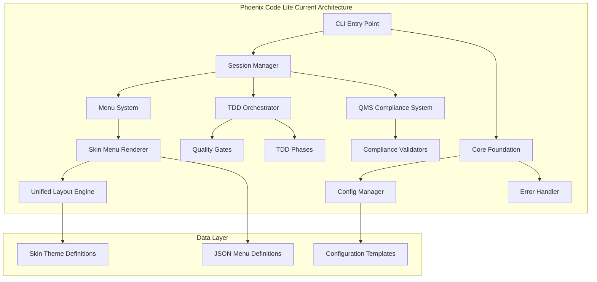
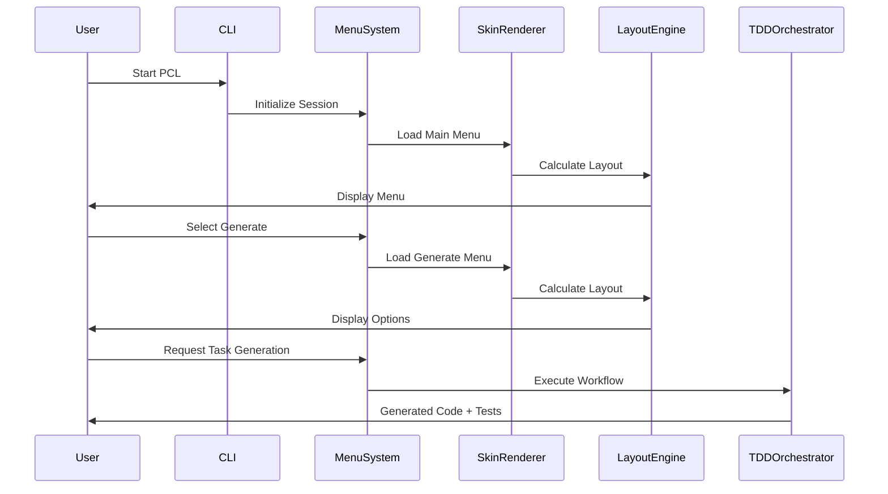
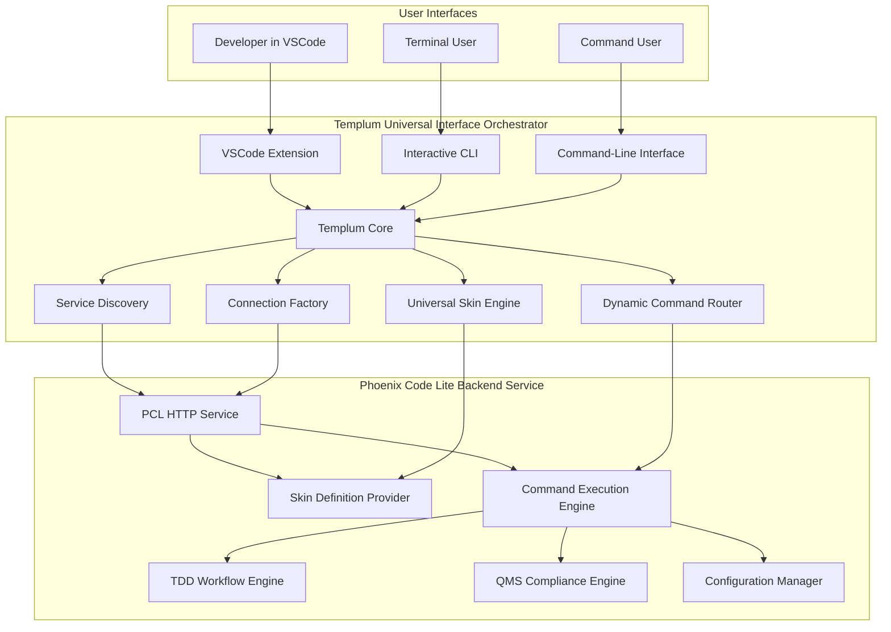

# Phoenix Code Lite - Complete System Specification

**Date:** 2025-08-29  
**Version:** 1.2.0  
**Status:** Current Implementation with Templum Integration Roadmap  
**Author:** Phoenix Code Lite Development Team  

---

## Executive Summary

Phoenix Code Lite is a TDD (Test-Driven Development) Workflow Orchestrator that transforms natural language requirements into production-ready code through systematic development processes. This specification documents the complete current implementation, focusing on the skin-based interface system and proposing integration with Templum as a universal interface provider.

### Key System Components

- **CLI Interface System**: Interactive menu-driven interface with JSON-defined skins
- **TDD Workflow Engine**: Automated code generation and testing workflows
- **QMS Compliance Framework**: Medical device software development standards (EN 62304, AAMI TIR45)
- **Configuration Management**: Template-based project configuration system
- **Skin-Based UI Architecture**: JSON-driven, theme-aware interface definitions

---

## Table of Contents

1. [System Architecture](#system-architecture)
2. [Current Skin System Implementation](#current-skin-system-implementation)
3. [Core Components](#core-components)
4. [Interface System](#interface-system)
5. [Templum Integration Proposal](#templum-integration-proposal)
6. [Migration Strategy](#migration-strategy)
7. [Implementation Examples](#implementation-examples)
8. [API Reference](#api-reference)

---

## System Architecture

### High-Level Architecture



### Component Interaction Flow



---

## Current Skin System Implementation

### Skin Architecture Overview

Phoenix Code Lite implements a sophisticated skin-based interface system that separates presentation from logic. The system consists of three primary layers:

1. **Skin Definition Layer**: JSON-based menu and theme definitions
2. **Layout Calculation Layer**: Intelligent width/height calculation engine
3. **Rendering Layer**: Theme-aware terminal output system

### Skin Menu Renderer

The core of the skin system is the `SkinMenuRenderer` class located at `src/cli/skin-menu-renderer.ts`:

```typescript
interface SkinContext {
  skinId: string;
  level: string;
  parentMenu?: string;
  breadcrumb?: string[];
  terminalWidth?: number;
}

interface SkinLoader {
  getSkinMenuDefinition(skinId: string, menuId: string): SkinMenuDefinition | null;
  getLayoutPreferences(skinId: string): Partial<LayoutConstraints>;
  getThemeDefinition(skinId: string): SkinTheme;
  listAvailableSkins(): string[];
  validateSkinDefinition(skinId: string): boolean;
}

class SkinMenuRenderer {
  // Manages skin loading, layout calculation, and rendering
  renderMenu(skinId: string, menuId: string, context?: Partial<SkinContext>): MenuRenderResult
  renderLegacyMenu(content: MenuContent, context: MenuDisplayContext): MenuRenderResult
  renderMultipleMenus(requests: Array<{skinId: string; menuId: string; context?: Partial<SkinContext>}>): MenuRenderResult[]
}
```

### Unified Layout Engine

The layout engine (`src/cli/unified-layout-engine.ts`) provides intelligent menu sizing and rendering:

```typescript
interface SkinMenuDefinition {
  title: string;
  subtitle?: string;
  items: SkinMenuItem[];
  theme?: SkinTheme;
}

interface SkinTheme {
  primaryColor: 'red' | 'green' | 'blue' | 'yellow' | 'magenta' | 'cyan';
  accentColor: 'red' | 'green' | 'blue' | 'yellow' | 'magenta' | 'cyan';
  separatorChar: string;
  useIcons: boolean;
}

interface LayoutConstraints {
  minHeight: number;
  minWidth: number;
  maxWidth: number;
  textboxLines: number;
  paddingLines: number;
  enforceConsistentHeight: boolean;
}
```

### Built-in Skin Definitions

The system includes two built-in skin definitions:

#### 1. Phoenix Code Lite Main Skin

```typescript
'phoenix-code-lite': {
  main: {
    title: '* Phoenix Code Lite',
    subtitle: 'Advanced development workflow automation',
    items: [
      {
        id: 'config',
        label: 'Configuration',
        description: 'Manage settings and preferences',
        type: 'submenu',
        command: 'config'
      },
      {
        id: 'templates',
        label: 'Templates',
        description: 'Browse and apply project templates',
        type: 'submenu',
        command: 'templates'
      },
      {
        id: 'workflow',
        label: 'Workflow',
        description: 'TDD workflow automation',
        type: 'submenu',
        command: 'workflow'
      },
      {
        id: 'help',
        label: 'Help',
        description: 'Documentation and command reference',
        type: 'command',
        command: 'help'
      }
    ],
    theme: {
      primaryColor: 'red',
      accentColor: 'cyan',
      separatorChar: '═',
      useIcons: true
    }
  }
}
```

#### 2. QMS Medical Device Skin

```typescript
'qms-medical-device': {
  main: {
    title: '🏥 QMS Medical Device Compliance',
    subtitle: 'EN 62304 & AAMI TIR45 compliant workflows',
    items: [
      {
        id: 'doc-processing',
        label: 'Document Processing',
        description: 'Convert regulatory PDFs to structured format',
        type: 'submenu',
        command: 'qms:process-document'
      },
      {
        id: 'compliance-check',
        label: 'Compliance Validation',
        description: 'Validate against regulatory standards',
        type: 'command',
        command: 'qms:validate-compliance'
      },
      {
        id: 'traceability',
        label: 'Traceability Matrix',
        description: 'Generate requirement traceability documentation',
        type: 'command',
        command: 'qms:generate-traceability'
      },
      {
        id: 'audit-trail',
        label: 'Audit Trail',
        description: 'Review compliance audit logs and evidence',
        type: 'submenu',
        command: 'qms:audit-trail'
      }
    ],
    theme: {
      primaryColor: 'blue',
      accentColor: 'cyan',
      separatorChar: '═',
      useIcons: true
    }
  }
}
```

---

## Core Components

### Foundation Layer

#### Core Foundation (`src/core/foundation.ts`)

- System initialization and health monitoring
- Cross-component dependency management
- Graceful shutdown handling

#### Configuration Manager (`src/core/config-manager.ts`)

- Hot-reloadable configuration system
- Template-based configuration management
- Validation and error handling

#### Session Manager (`src/core/session-manager.ts`)

- Interactive session lifecycle management
- Context preservation across menu navigation
- Performance metrics and audit logging

### CLI System

#### Interactive Session (`src/cli/session.ts`)

- Main CLI interaction loop
- Command parsing and routing
- State management between menu levels

#### Menu System (`src/cli/menu-system.ts`)

- Contextual menu rendering and navigation
- Command processing for different menu levels
- Help system integration

#### Interaction Manager (`src/cli/interaction-manager.ts`)

- Mode switching logic (interactive vs command-line)
- Input validation and sanitization
- Command execution coordination

### TDD Workflow Engine

#### Orchestrator (`src/tdd/orchestrator.ts`)

- Main workflow controller
- Phase management and coordination
- Quality gate enforcement

#### Quality Gates (`src/tdd/quality-gates.ts`)

- Automated quality validation system
- Code quality metrics and thresholds
- Testing requirement enforcement

#### Workflow Phases (`src/tdd/phases/`)

- **Plan & Test** (`plan-test.ts`): Test planning and creation
- **Implement & Fix** (`implement-fix.ts`): Code implementation
- **Refactor & Document** (`refactor-document.ts`): Code cleanup and documentation

### QMS Compliance System

The QMS system provides comprehensive compliance validation for medical device software development:

#### Compliance Validators (`src/preparation/`)

- **EN 62304 Requirement Analyzer** (`en62304-requirement-analyzer.ts`)
- **AAMI TIR45 Requirement Analyzer** (`aami-tir45-requirement-analyzer.ts`)
- **Architecture Integration Validator** (`architecture-integration-validator.ts`)
- **Performance Baseline Validator** (`performance-baseline-validator.ts`)
- **Cryptography Library Validator** (`crypto-library-validator.ts`)

---

## Interface System

### Current Menu Architecture

The current interface system uses a hierarchical menu structure:

``` diagram
Phoenix Code Lite (Main)
├── Configuration
│   ├── Show Current Settings
│   ├── Interactive Editor  
│   ├── Template Management
│   ├── Framework Settings
│   ├── Quality Gates
│   └── Security Policies
├── Templates
│   ├── List Available
│   ├── Apply Template
│   ├── Preview Template
│   ├── Create Custom
│   ├── Edit Existing
│   └── Reset to Defaults
├── Generate (AI-Powered)
│   ├── General Task
│   ├── UI Component
│   ├── API Endpoint
│   └── Test Suite
└── Advanced Settings
    ├── Language Preferences
    ├── AI Agent Configuration
    ├── Comprehensive Logging
    ├── Performance Metrics
    └── Debug Mode
```

### Menu Content Types

The system uses a structured approach to menu content definition:

```typescript
interface MenuContent {
  title: string;
  subtitle?: string;
  sections: MenuSection[];
  footerHints?: string[];
  breadcrumb?: string[];
  metadata?: MenuMetadata;
}

interface MenuSection {
  heading: string;
  items: MenuItem[];
  description?: string;
  theme?: SectionTheme;
}

interface MenuItem {
  label: string;
  description: string;
  commands: string[];
  icon?: string;
  type?: 'command' | 'navigation' | 'action' | 'setting';
}
```

### Legacy Menu Conversion System

Phoenix Code Lite includes a robust system for converting legacy menu content to skin definitions:

```typescript
// Convert legacy MenuContent to SkinMenuDefinition
const skinDefinition = convertMenuContentToSkinDefinition(content, context);

// Validate conversion
const validation = validateConversion(content, skinDefinition);
if (!validation.isValid) {
  console.warn('Menu conversion issues:', validation.issues);
}

// Render with unified system
const layout = calculateMenuLayout(skinDefinition, layoutConstraints);
renderMenuWithLayout(skinDefinition, layout, context);
```

---

## Templum Integration Proposal

### Integration Architecture Overview

The proposed integration transforms Phoenix Code Lite from a standalone CLI application into a **Templum Backend Service** that provides its functionality through Templum's universal interface orchestrator.



### Benefits of Templum Integration

1. **Universal Interface Access**: Phoenix Code Lite functionality available in VSCode, CLI, and command-line modes
2. **Zero UI Development**: Templum handles all interface rendering and interaction
3. **Consistent User Experience**: Same functionality with consistent behavior across all interfaces
4. **Automatic Discovery**: Templum automatically finds and connects to Phoenix Code Lite
5. **Scalable Architecture**: Multiple backend services can be integrated simultaneously

### Integration Requirements

Phoenix Code Lite would need to implement the Templum Backend Integration specification:

#### Required HTTP Endpoints

1. **`GET /getSkinDefinition`** - Returns Phoenix Code Lite skin definition
2. **`POST /executeCommand`** - Executes PCL commands with arguments
3. **`GET /health`** - Health check for service monitoring
4. **`GET /getCapabilities`** - Returns available commands and features

#### Skin Definition Transformation

The current PCL skin definitions would be enhanced to match Templum's UniversalSkinDefinition format:

```typescript
interface TemplumCompatibleSkinDefinition {
  // Core identification
  id: "phoenix-code-lite";
  name: "Phoenix Code Lite";
  version: "1.2.0";
  description: "TDD Workflow Orchestrator for AI-Powered Development";
  
  // Backend connection configuration
  backendConfig: {
    service: "phoenix-code-lite";
    protocol: "http";
    endpoint: "http://localhost:3001";
    authentication: { type: "none" };
    healthEndpoint: "/health";
  };
  
  // Command definitions (mapped from current CLI commands)
  commands: {
    "pcl.config.show": {
      id: "pcl.config.show";
      label: "Show Configuration";
      description: "Display current Phoenix Code Lite configuration";
      category: "Configuration";
    };
    "pcl.config.edit": {
      id: "pcl.config.edit";
      label: "Edit Configuration";
      description: "Open interactive configuration editor";
      category: "Configuration";
    };
    "pcl.templates.list": {
      id: "pcl.templates.list";
      label: "List Templates";
      description: "Show all available configuration templates";
      category: "Templates";
    };
    "pcl.generate.task": {
      id: "pcl.generate.task";
      label: "Generate from Task";
      description: "AI-powered code generation from natural language";
      category: "Generation";
      parameters: [{
        name: "description";
        type: "string";
        required: true;
        description: "Natural language description of what to build";
      }];
    };
    "pcl.qms.validate": {
      id: "pcl.qms.validate";
      label: "QMS Compliance Validation";
      description: "Validate project against EN 62304 and AAMI TIR45";
      category: "QMS";
    };
  };
  
  // VSCode interface definitions
  views: {
    treeViews: [{
      id: "pclProjectTree";
      name: "Phoenix Code Lite";
      contextValue: "pcl";
    }];
  };
  
  // CLI interface definitions
  menus: {
    main: {
      title: "Phoenix Code Lite";
      items: [
        { label: "Configuration", command: "pcl.config.show" };
        { label: "Templates", command: "pcl.templates.list" };
        { label: "Generate Code", command: "pcl.generate.task" };
        { label: "QMS Validation", command: "pcl.qms.validate" };
      ];
    };
  };
  
  // Theme definitions (converted from current SkinTheme)
  themes: {
    default: {
      name: "Phoenix Code Lite Default";
      type: "light";
      colors: {
        primary: { 500: "#dc2626" }; // red
        secondary: { 500: "#0891b2" }; // cyan
      };
    };
  };
}
```

---

## Migration Strategy

### Phase 1: Backend Service Implementation

**Objective**: Transform Phoenix Code Lite into a Templum-compatible backend service

**Steps**:

1. **Create HTTP Service Layer**

   ```typescript
   // src/backend/templum-service.ts
   import express from 'express';
   import { getCurrentSkinDefinition } from './skin-definition-provider';
   import { executePhoenixCommand } from './command-executor';
   
   const app = express();
   app.use(express.json());
   
   // Required Templum endpoints
   app.get('/getSkinDefinition', (req, res) => {
     res.json(getCurrentSkinDefinition());
   });
   
   app.post('/executeCommand', async (req, res) => {
     const { command, args } = req.body;
     const result = await executePhoenixCommand(command, args);
     res.json(result);
   });
   
   app.get('/health', (req, res) => {
     res.json({
       status: 'healthy',
       timestamp: new Date().toISOString(),
       version: '1.2.0'
     });
   });
   ```

2. **Implement Skin Definition Provider**

   ```typescript
   // src/backend/skin-definition-provider.ts
   export function getCurrentSkinDefinition(): UniversalSkinDefinition {
     return {
       id: 'phoenix-code-lite',
       name: 'Phoenix Code Lite',
       version: '1.2.0',
       backendConfig: {
         service: 'phoenix-code-lite',
         protocol: 'http',
         endpoint: 'http://localhost:3001',
         authentication: { type: 'none' }
       },
       commands: generateCommandDefinitions(),
       views: generateViewDefinitions(),
       menus: generateMenuDefinitions(),
       themes: generateThemeDefinitions()
     };
   }
   ```

3. **Create Command Executor**

   ```typescript
   // src/backend/command-executor.ts
   export async function executePhoenixCommand(
     command: string, 
     args: Record<string, any>
   ): Promise<{success: boolean; result?: any; error?: string}> {
     
     try {
       switch (command) {
         case 'pcl.config.show':
           return await executeConfigShow();
         case 'pcl.config.edit':
           return await executeConfigEdit(args);
         case 'pcl.templates.list':
           return await executeTemplatesList();
         case 'pcl.generate.task':
           return await executeGenerateTask(args.description);
         case 'pcl.qms.validate':
           return await executeQMSValidation();
         default:
           return {
             success: false,
             error: `Unknown command: ${command}`
           };
       }
     } catch (error) {
       return {
         success: false,
         error: error instanceof Error ? error.message : 'Command execution failed'
       };
     }
   }
   ```

### Phase 2: Service Discovery Integration

**Objective**: Enable automatic discovery by Templum

**Steps**:

1. **Create Service Registry Entry**

   ```json
   // .templum/service-registry.json
   {
     "services": {
       "phoenix-code-lite": {
         "id": "phoenix-code-lite",
         "endpoint": "http://localhost:3001",
         "protocol": "http",
         "health": "/health",
         "capabilities": ["getSkinDefinition", "executeCommand"],
         "version": "1.2.0",
         "registrationTime": 1693276800000,
         "lastSeen": 1693276800000
       }
     },
     "version": 1,
     "lastUpdated": 1693276800000
   }
   ```

2. **Add Backend Configuration**

   ```json
   // .templum/backend-config.json
   {
     "backends": [
       {
         "id": "phoenix-code-lite",
         "enabled": true,
         "config": {
           "service": "phoenix-code-lite",
           "protocol": "http",
           "endpoint": "http://localhost:3001"
         }
       }
     ]
   }
   ```

### Phase 3: Legacy CLI Preservation

**Objective**: Maintain backward compatibility with existing CLI

**Steps**:

1. **Create CLI Mode Selector**

   ```typescript
   // src/cli-mode-selector.ts
   export async function selectCLIMode(): Promise<'standalone' | 'templum'> {
     // Check if Templum is available
     const templumAvailable = await checkTemplumAvailability();
     
     if (templumAvailable) {
       // Ask user preference or use configuration
       return getUserModePreference();
     }
     
     return 'standalone';
   }
   ```

2. **Hybrid Entry Point**

   ```typescript
   // src/index.ts
   import { selectCLIMode } from './cli-mode-selector';
   import { startStandaloneCLI } from './cli/session';
   import { startTemplumBackend } from './backend/templum-service';
   
   async function main() {
     const mode = await selectCLIMode();
     
     if (mode === 'templum') {
       console.log('Starting Phoenix Code Lite as Templum Backend Service...');
       await startTemplumBackend();
     } else {
       console.log('Starting Phoenix Code Lite in Standalone CLI Mode...');
       await startStandaloneCLI();
     }
   }
   
   main().catch(console.error);
   ```

### Phase 4: Enhanced Integration

**Objective**: Leverage Templum's advanced features

**Steps**:

1. **WebSocket Support** for real-time TDD workflow updates
2. **IPC Support** for high-performance local development
3. **VSCode Extension Integration** for seamless IDE experience
4. **Advanced Authentication** for enterprise deployments

---

## Implementation Examples

### Backend Service Implementation

#### Complete HTTP Backend Service

```typescript
// src/backend/phoenix-templum-backend.ts
import express from 'express';
import cors from 'cors';
import { TDDOrchestrator } from '../tdd/orchestrator';
import { ConfigManager } from '../core/config-manager';
import { QMSValidationEngine } from '../preparation/qms-validation-engine';

class PhoenixCodeLiteBackend {
  private app: express.Application;
  private tddOrchestrator: TDDOrchestrator;
  private configManager: ConfigManager;
  private qmsEngine: QMSValidationEngine;

  constructor() {
    this.app = express();
    this.app.use(cors());
    this.app.use(express.json());
    
    this.tddOrchestrator = new TDDOrchestrator();
    this.configManager = new ConfigManager();
    this.qmsEngine = new QMSValidationEngine();
    
    this.setupRoutes();
  }

  private setupRoutes() {
    // Required Templum endpoints
    this.app.get('/getSkinDefinition', this.getSkinDefinition.bind(this));
    this.app.post('/executeCommand', this.executeCommand.bind(this));
    this.app.get('/health', this.healthCheck.bind(this));
    this.app.get('/getCapabilities', this.getCapabilities.bind(this));
  }

  private getSkinDefinition(req: express.Request, res: express.Response) {
    const skinDefinition = {
      id: 'phoenix-code-lite',
      name: 'Phoenix Code Lite',
      version: '1.2.0',
      description: 'TDD Workflow Orchestrator for AI-Powered Development',
      backendConfig: {
        service: 'phoenix-code-lite',
        protocol: 'http',
        endpoint: 'http://localhost:3001',
        authentication: { type: 'none' },
        healthEndpoint: '/health'
      },
      commands: {
        'pcl.config.show': {
          id: 'pcl.config.show',
          label: 'Show Configuration',
          description: 'Display current configuration with validation status',
          category: 'Configuration'
        },
        'pcl.config.edit': {
          id: 'pcl.config.edit',
          label: 'Edit Configuration',
          description: 'Open interactive configuration editor',
          category: 'Configuration'
        },
        'pcl.templates.list': {
          id: 'pcl.templates.list',
          label: 'List Templates',
          description: 'Show all available configuration templates',
          category: 'Templates'
        },
        'pcl.templates.apply': {
          id: 'pcl.templates.apply',
          label: 'Apply Template',
          description: 'Apply configuration template to project',
          category: 'Templates',
          parameters: [{
            name: 'template',
            type: 'string',
            required: true,
            choices: ['starter', 'enterprise', 'performance', 'medical-device'],
            description: 'Template name to apply'
          }]
        },
        'pcl.generate.task': {
          id: 'pcl.generate.task',
          label: 'Generate Code',
          description: 'AI-powered code generation from natural language',
          category: 'Generation',
          parameters: [{
            name: 'description',
            type: 'string',
            required: true,
            description: 'Natural language description of what to build'
          }, {
            name: 'framework',
            type: 'string',
            choices: ['react', 'vue', 'angular', 'nodejs', 'python', 'auto-detect'],
            default: 'auto-detect',
            description: 'Target framework for generation'
          }]
        },
        'pcl.generate.component': {
          id: 'pcl.generate.component',
          label: 'Generate UI Component',
          description: 'Generate React/Vue components with tests and styling',
          category: 'Generation',
          parameters: [{
            name: 'description',
            type: 'string',
            required: true,
            description: 'Component description'
          }, {
            name: 'framework',
            type: 'string',
            choices: ['react', 'vue', 'angular'],
            required: true,
            description: 'UI framework'
          }]
        },
        'pcl.generate.api': {
          id: 'pcl.generate.api',
          label: 'Generate API Endpoint',
          description: 'Generate REST API endpoints with validation and docs',
          category: 'Generation',
          parameters: [{
            name: 'description',
            type: 'string',
            required: true,
            description: 'API endpoint description'
          }, {
            name: 'method',
            type: 'string',
            choices: ['GET', 'POST', 'PUT', 'DELETE'],
            required: true,
            description: 'HTTP method'
          }]
        },
        'pcl.qms.validate': {
          id: 'pcl.qms.validate',
          label: 'QMS Compliance Validation',
          description: 'Validate project against EN 62304 and AAMI TIR45',
          category: 'QMS Compliance'
        },
        'pcl.qms.document': {
          id: 'pcl.qms.document',
          label: 'Generate QMS Documentation',
          description: 'Generate regulatory compliance documentation',
          category: 'QMS Compliance',
          parameters: [{
            name: 'standard',
            type: 'string',
            choices: ['EN62304', 'AAMI-TIR45', 'both'],
            default: 'both',
            description: 'Regulatory standard'
          }]
        },
        'pcl.tdd.start': {
          id: 'pcl.tdd.start',
          label: 'Start TDD Workflow',
          description: 'Begin test-driven development workflow',
          category: 'TDD Workflow',
          parameters: [{
            name: 'task',
            type: 'string',
            required: true,
            description: 'Development task description'
          }]
        }
      },
      views: {
        treeViews: [{
          id: 'pclProjectTree',
          name: 'Phoenix Code Lite',
          contextValue: 'pcl',
          canSelectMany: false,
          showCollapseAll: true
        }],
        panels: [{
          id: 'pclWorkflowPanel',
          title: 'TDD Workflow',
          viewColumn: 'two'
        }]
      },
      menus: {
        main: {
          title: 'Phoenix Code Lite',
          description: 'TDD Workflow Orchestrator',
          items: [
            { label: 'Configuration', command: 'pcl.config.show', description: 'Manage settings' },
            { label: 'Templates', command: 'pcl.templates.list', description: 'Project templates' },
            { label: 'Generate Code', command: 'pcl.generate.task', description: 'AI code generation' },
            { label: 'QMS Validation', command: 'pcl.qms.validate', description: 'Compliance check' },
            { label: 'TDD Workflow', command: 'pcl.tdd.start', description: 'Start TDD process' }
          ]
        },
        configuration: {
          title: 'Configuration Management',
          items: [
            { label: 'Show Current', command: 'pcl.config.show' },
            { label: 'Interactive Editor', command: 'pcl.config.edit' },
            { label: 'Template Manager', command: 'pcl.templates.list' }
          ]
        }
      },
      themes: {
        default: {
          name: 'Phoenix Code Lite Default',
          type: 'light',
          colors: {
            primary: { 500: '#dc2626' },
            secondary: { 500: '#0891b2' },
            accent: { 500: '#7c3aed' },
            neutral: { 500: '#6b7280' },
            semantic: {
              success: { 500: '#059669' },
              warning: { 500: '#d97706' },
              error: { 500: '#dc2626' },
              info: { 500: '#0891b2' }
            }
          }
        }
      }
    };

    res.json(skinDefinition);
  }

  private async executeCommand(req: express.Request, res: express.Response) {
    try {
      const { command, args = {} } = req.body;
      
      let result;
      
      switch (command) {
        case 'pcl.config.show':
          result = await this.configManager.getCurrentConfiguration();
          break;
          
        case 'pcl.config.edit':
          result = await this.configManager.openInteractiveEditor();
          break;
          
        case 'pcl.templates.list':
          result = await this.configManager.listAvailableTemplates();
          break;
          
        case 'pcl.templates.apply':
          result = await this.configManager.applyTemplate(args.template);
          break;
          
        case 'pcl.generate.task':
          result = await this.tddOrchestrator.generateFromTask(
            args.description, 
            args.framework
          );
          break;
          
        case 'pcl.generate.component':
          result = await this.tddOrchestrator.generateComponent(
            args.description,
            args.framework
          );
          break;
          
        case 'pcl.generate.api':
          result = await this.tddOrchestrator.generateAPIEndpoint(
            args.description,
            args.method
          );
          break;
          
        case 'pcl.qms.validate':
          result = await this.qmsEngine.validateCompliance();
          break;
          
        case 'pcl.qms.document':
          result = await this.qmsEngine.generateDocumentation(args.standard);
          break;
          
        case 'pcl.tdd.start':
          result = await this.tddOrchestrator.startWorkflow(args.task);
          break;
          
        default:
          res.json({
            success: false,
            error: `Unknown command: ${command}`
          });
          return;
      }
      
      res.json({
        success: true,
        result: result
      });
      
    } catch (error) {
      res.json({
        success: false,
        error: error instanceof Error ? error.message : 'Command execution failed'
      });
    }
  }

  private healthCheck(req: express.Request, res: express.Response) {
    res.json({
      status: 'healthy',
      timestamp: new Date().toISOString(),
      version: '1.2.0',
      uptime: process.uptime(),
      memory: process.memoryUsage()
    });
  }

  private getCapabilities(req: express.Request, res: express.Response) {
    res.json({
      commands: [
        'pcl.config.show', 'pcl.config.edit',
        'pcl.templates.list', 'pcl.templates.apply',
        'pcl.generate.task', 'pcl.generate.component', 'pcl.generate.api',
        'pcl.qms.validate', 'pcl.qms.document',
        'pcl.tdd.start'
      ],
      protocols: ['http'],
      version: '1.2.0',
      features: ['TDD', 'QMS', 'AI-Generation', 'Templates', 'Configuration']
    });
  }

  public start(port: number = 3001): void {
    this.app.listen(port, () => {
      console.log(`Phoenix Code Lite Backend Service running on port ${port}`);
      console.log(`Skin Definition: http://localhost:${port}/getSkinDefinition`);
      console.log(`Health Check: http://localhost:${port}/health`);
    });
  }
}

// Export for use
export { PhoenixCodeLiteBackend };

// Start server if run directly
if (require.main === module) {
  const backend = new PhoenixCodeLiteBackend();
  backend.start();
}
```

### Service Discovery Configuration

#### Service Registry Entry

```json
{
  "services": {
    "phoenix-code-lite": {
      "id": "phoenix-code-lite",
      "name": "Phoenix Code Lite",
      "endpoint": "http://localhost:3001",
      "protocol": "http",
      "health": "/health",
      "capabilities": ["getSkinDefinition", "executeCommand"],
      "version": "1.2.0",
      "description": "TDD Workflow Orchestrator for AI-Powered Development",
      "categories": ["development", "tdd", "ai", "qms"],
      "registrationTime": 1693276800000,
      "lastSeen": 1693276800000,
      "metadata": {
        "features": ["TDD", "QMS", "AI-Generation", "Templates"],
        "frameworks": ["react", "vue", "angular", "nodejs", "python"],
        "standards": ["EN62304", "AAMI-TIR45"]
      }
    }
  },
  "version": 1,
  "lastUpdated": 1693276800000
}
```

#### Backend Configuration

```json
{
  "backends": [
    {
      "id": "phoenix-code-lite",
      "enabled": true,
      "priority": 1,
      "config": {
        "service": "phoenix-code-lite",
        "protocol": "http",
        "endpoint": "http://localhost:3001",
        "authentication": {
          "type": "none"
        },
        "timeout": 30000,
        "retries": 3,
        "healthCheckInterval": 60000
      },
      "features": {
        "autoStart": true,
        "autoReconnect": true,
        "loadBalancing": false
      }
    }
  ],
  "discovery": {
    "enableAutoDiscovery": true,
    "scanPorts": [3001, 3002, 3003],
    "scanInterval": 30000
  }
}
```

---

## API Reference

### Current Phoenix Code Lite APIs

#### Core Foundation API

```typescript
// src/core/foundation.ts
export interface FoundationConfig {
  enableHealthMonitoring: boolean;
  healthCheckIntervalMs: number;
  gracefulShutdownTimeoutMs: number;
  componentDependencies: ComponentDependency[];
}

export class Foundation {
  initialize(config: FoundationConfig): Promise<void>;
  shutdown(): Promise<void>;
  getHealthStatus(): HealthStatus;
  registerComponent(component: SystemComponent): void;
}
```

#### Configuration Management API

```typescript
// src/core/config-manager.ts
export interface ConfigurationTemplate {
  name: string;
  description: string;
  category: 'starter' | 'enterprise' | 'performance' | 'medical-device';
  settings: ConfigurationSettings;
  validation: ValidationRules;
}

export class ConfigManager {
  getCurrentConfiguration(): Promise<ConfigurationSettings>;
  applyTemplate(templateName: string): Promise<boolean>;
  validateConfiguration(): Promise<ValidationResult>;
  saveConfiguration(settings: ConfigurationSettings): Promise<void>;
  listAvailableTemplates(): Promise<ConfigurationTemplate[]>;
}
```

#### TDD Orchestrator API

```typescript
// src/tdd/orchestrator.ts
export interface TDDWorkflowRequest {
  description: string;
  framework?: string;
  complexity?: 'simple' | 'moderate' | 'complex';
  includeTests?: boolean;
  includeDocumentation?: boolean;
}

export interface TDDWorkflowResult {
  success: boolean;
  generatedFiles: GeneratedFile[];
  testResults: TestResults;
  qualityMetrics: QualityMetrics;
  documentation: string;
}

export class TDDOrchestrator {
  generateFromTask(request: TDDWorkflowRequest): Promise<TDDWorkflowResult>;
  generateComponent(description: string, framework: string): Promise<TDDWorkflowResult>;
  generateAPIEndpoint(description: string, method: string): Promise<TDDWorkflowResult>;
  startWorkflow(taskDescription: string): Promise<WorkflowSession>;
}
```

#### QMS Validation API

```typescript
// src/preparation/qms-validation-engine.ts
export interface ComplianceValidationResult {
  standard: 'EN62304' | 'AAMI-TIR45';
  overallCompliance: number; // 0-100%
  requirements: RequirementValidation[];
  gaps: ComplianceGap[];
  recommendations: string[];
  evidence: EvidenceFile[];
}

export class QMSValidationEngine {
  validateCompliance(standard?: string): Promise<ComplianceValidationResult>;
  generateDocumentation(standard: string): Promise<DocumentationPackage>;
  validateArchitecture(): Promise<ArchitectureValidationResult>;
  generateTraceabilityMatrix(): Promise<TraceabilityMatrix>;
}
```

### Templum Integration APIs

#### Backend Service Interface

```typescript
// Templum-compatible backend service interface
export interface TemplumBackendService {
  // Required endpoints
  getSkinDefinition(): Promise<UniversalSkinDefinition>;
  executeCommand(command: string, args: Record<string, any>): Promise<CommandResult>;
  healthCheck(): Promise<HealthStatus>;
  getCapabilities(): Promise<ServiceCapabilities>;
  
  // Optional endpoints
  getConfiguration?(): Promise<BackendConfiguration>;
  updateConfiguration?(config: Partial<BackendConfiguration>): Promise<boolean>;
  getMetrics?(): Promise<ServiceMetrics>;
}

export interface CommandResult {
  success: boolean;
  result?: any;
  error?: string;
  metadata?: {
    executionTime: number;
    memoryUsage: number;
    warnings?: string[];
  };
}

export interface ServiceCapabilities {
  commands: string[];
  protocols: string[];
  version: string;
  features: string[];
  supportedFrameworks?: string[];
  supportedStandards?: string[];
}
```

#### Universal Skin Definition

```typescript
// Complete Templum skin definition structure
export interface UniversalSkinDefinition {
  // Core identification
  id: string;
  name: string;
  version: string;
  description?: string;
  
  // Backend connection configuration  
  backendConfig: BackendConfig;
  
  // Interface definitions
  commands?: Record<string, CommandDefinition>;
  views?: ViewDefinitions;
  menus?: MenuDefinitions;
  
  // Theming and appearance
  themes: Record<string, ThemeDefinition>;
  components?: Record<string, ComponentDefinition>;
  
  // Metadata and capabilities
  metadata?: SkinMetadata;
  features?: FeatureMatrix;
}

export interface BackendConfig {
  service: string;
  version: string;
  protocol: 'http' | 'websocket' | 'ipc' | 'grpc';
  endpoint: string;
  authentication?: AuthenticationConfig;
  timeout?: number;
  retries?: number;
  keepAlive?: boolean;
  healthEndpoint?: string;
  capabilitiesEndpoint?: string;
  options?: Record<string, any>;
}

export interface CommandDefinition {
  id: string;
  label: string;
  description?: string;
  category?: string;
  parameters?: CommandParameter[];
  returns?: string;
  examples?: CommandExample[];
}
```

---

## Conclusion

Phoenix Code Lite represents a sophisticated TDD workflow orchestration system with a well-designed skin-based interface architecture. The current implementation provides:

- **Comprehensive CLI Interface**: JSON-driven, theme-aware menu system
- **Robust TDD Engine**: Complete workflow automation for test-driven development
- **QMS Compliance Framework**: Full regulatory compliance for medical device software
- **Flexible Configuration System**: Template-based project configuration
- **Extensible Architecture**: Plugin-ready design with clear separation of concerns

The proposed Templum integration would transform Phoenix Code Lite from a standalone CLI tool into a universal backend service accessible through VSCode, CLI, and command-line interfaces. This integration would provide:

- **Universal Interface Access**: Same functionality across all interface modalities
- **Zero UI Development Overhead**: Templum handles all interface rendering
- **Automatic Service Discovery**: Seamless integration with Templum ecosystem
- **Backward Compatibility**: Existing CLI functionality preserved
- **Enhanced User Experience**: Consistent behavior across all interfaces

The migration strategy provides a clear, phased approach to implementing Templum integration while maintaining full backward compatibility with existing Phoenix Code Lite functionality.

This specification serves as both comprehensive documentation of the current system and a complete implementation guide for Templum integration, enabling Phoenix Code Lite to leverage Templum's universal interface orchestration capabilities while preserving all existing functionality and user workflows.

---

**Document Status**: Complete  
**Last Updated**: 2025-08-29  
**Next Review**: Upon Templum integration implementation  
