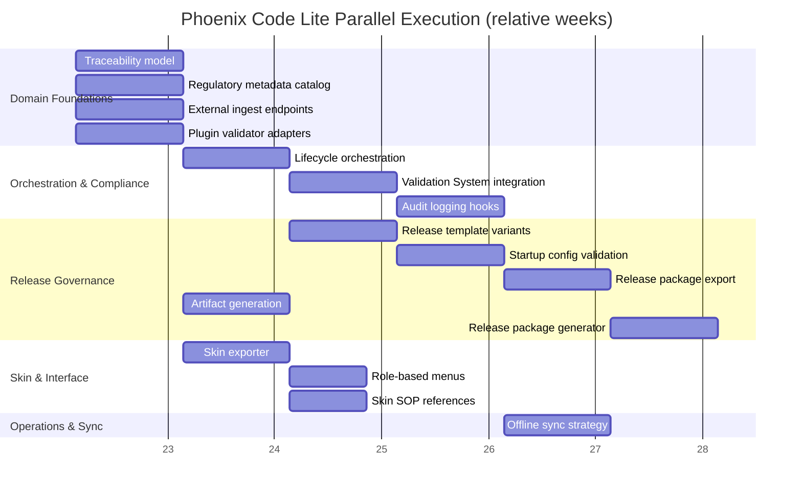

# Phoenix Code Lite (QMS) Progress Tracker

Legend: `[x]` done · `[~]` in progress · `[ ]` not started · `[!]` broken · `[?]` verify · `[P]` pending investigation

> Overall readiness toward the ideal architecture (`meta/ARCHITECTURE.md`): **~5%** — only the traceability groundwork has partial code/tests; all other pillars (lifecycle orchestration, skin exporter, release governance, ingest/sync) remain unimplemented.

## QMS Domain Model

- [~] [Design inputs, requirements, and risk traceability](../../dev/tasks/design-traceability-model.md) (data structures drafted; confirm implementation coverage)
  - Status 20% — legacy analyzers and environment prep suite (`npm test -- tests/preparation/environment-setup.test.ts`, 10/10 pass, ~66% stmts on `regulatory-document-processor.ts`) exist, but no canonical traceability types, matrix builder, or CLI export yet.
- [ ] [Release package export with immutable audit history](../../dev/tasks/release-package-export.md)
  - Status 0% — exporter/ledger modules, CLI command, and tests have not been started; awaiting traceability dataset and compliance audit hooks.
- [ ] [Regulatory metadata catalog live in system](../../dev/tasks/regulatory-metadata-catalog.md) (standards clauses, owners, timestamps)
  - Status 0% — no catalog modules or clause data are present; no tests cover ownership metadata or persistence.

## Workflow Automation

- [ ] [Lifecycle orchestration with gated transitions and signatures](../../dev/tasks/lifecycle-orchestration.md)
  - Status 0% — lifecycle stage schemas, signature ledger, and gating tests are absent; orchestration still untouched.
- [ ] [Automated artifact generation from the data model](../../dev/tasks/artifact-generation.md)
  - Status 0% — no generator modules, contracts, or CLI handlers exist; no tests assert Markdown/report outputs.
- [ ] [Validation System integration blocking promotions on failed checks](../../dev/tasks/validation-system-integration.md)
  - Status 0% — promotion service, Validation System gateway, and gating suites not yet scaffolded.
- [ ] [Template variants for different release types](../../dev/tasks/release-template-variants.md)
  - Status 0% — configuration schema lacks release section; registry/tests/CLI toggles unresolved.

## Interface & Skin Output

- [ ] [Skin exporter generating dashboards, boards, and report views for Templum](../../dev/tasks/skin-exporter.md)
  - Status 0% — exporter module, schema validation tests, and `dist/skins/` outputs are still missing.
- [ ] [Contextual SOP references wired into skin definitions](../../dev/tasks/skin-sop-references.md)
  - Status 0% — no SOP index/decorator code or test coverage; skins remain static with no contextual references.
- [ ] [Role-based menu sets derived from skin metadata](../../dev/tasks/role-based-menus.md)
  - Status 0% — menus ignore roles; assembler, session role state, and CLI previews not implemented.

## Integration & Extensibility

- [ ] [API and CLI endpoints for ingesting external repo data](../../dev/tasks/external-ingest-endpoints.md)
  - Status 0% — no ingest service/API/CLI; tests and fixture repos still outstanding.
- [ ] [Plug-in validator and adapter configuration](../../dev/tasks/plugin-validator-adapters.md)
  - Status 0% — validator plugin registry, adapters, config schema, and test suites not yet started.
- [ ] [Audit logging hooks for compliance](../../dev/tasks/audit-logging-hooks.md)
  - Status 10% — base `AuditLogger` exists but no compliance event schemas or hook wiring; zero targeted tests so audit coverage remains 0%.

## Operational Guarantees

- [ ] [Startup configuration validation](../../dev/tasks/startup-config-validation.md) (validators, templates, storage paths)
  - Status 10% — existing `ConfigManager` performs schema validation, but no startup validator, CLI diagnostics, or directory checks have been built.
- [ ] [Offline and online sync strategy implemented](../../dev/tasks/offline-sync-strategy.md)
  - Status 0% — sync contracts, offline store, coordinator, and CLI surfaces not created; no tests run.
- [ ] [Release package generator verified](../../dev/tasks/release-package-generator.md) (zip/pdf)
  - Status 0% — verification modules, tests, and CLI/API entry points pending (exporter itself still outstanding).

## Fastest Route (gets us to ≈35%)

- Finish traceability foundation: ship qms-traceability types, matrix builder, CLI export, and tight tests so every downstream task can plug into canonical data (unblocks ≈40% of open work).
- Stand up the regulatory metadata catalog next: clause fixtures + query service + status CLI; this is the other Phase‑1 dependency feeding skins, lifecycle, and release governance simultaneously.
- Layer in compliance telemetry: implement audit logging hooks and immutable ledger plumbing once the catalog exists—this unlocks release export/ generator, offline sync, and startup validation workstreams.
- Cut over orchestration core: build lifecycle stage definitions, signature ledger, and validator gateway in tandem; use traceability + catalog outputs to keep criteria authoritative, then wire Validation System gating so promotions finally block on real checks.
- Deliver interface outputs last: with orchestration and audit signals in place, build the skin exporter, then bolt on SOP references and role-based menus; now the same data powers Templum dashboards and CLI access control.

## Action Items

- Strip legacy Claude workflow modules and confirm tests.
- Prioritise skin exporter prototype feeding Templum.
- Map Validation System categories to QMS lifecycle stages.

## Step 0 — Playbook Setup
- Draft milestone playbooks ahead of implementation:
  - Planned playbooks: Phoenix skin exporter handshake, QMS workflow orchestration, release governance bundle, policy/validator integration.
- Leverage `meta/templates/milestone-playbook.md`, `meta/ARCHITECTURE.md`, and the dependency map (to generate) mirroring `Templum`/`Haruspex` patterns.
- Once playbooks exist, add corresponding milestone markers to the Gantt chart and reference them in the Action Items.
- Circulate `dev/agent-briefing-template.md` to assigned agents before work begins.
- Confirm referenced smoke/validation scripts exist (generate stubs if missing) prior to executing playbooks.

## Parallel Execution Plan

### Dependency Highlights
- Design traceability model is the shared source for artifact generation, audit logging, release packages, and skin exporter—finish schema and fixtures before branching feature teams.
- Regulatory metadata catalog feeds lifecycle orchestration and skin exporter so approver roles, clauses, and timestamps stay consistent across signatures and dashboards.
- Lifecycle orchestration and Validation System integration form a handshake that gates audit logging, release template variants, and startup configuration checks; treat them as a coordinated stream.
- Audit logging hooks underpin release package export/generator and offline sync evidence; complete them before packaging or sync work starts.
- Skin exporter unlocks role-based menus and SOP references; avoid UI duplication by consuming its canonical `UniversalSkinDefinition`.
- Startup configuration validation must land before offline sync so replicated nodes share validated paths, credentials, and feature flags.

### Phase Matrix
| Phase | Dependencies cleared | Parallel work packages | Unlocks |
| --- | --- | --- | --- |
| 1 · Domain Foundations | None | Design traceability model · Regulatory metadata catalog · External ingest endpoints · Plugin validator adapters | Establishes canonical data + extension hooks for downstream automation |
| 2 · Orchestration & Compliance Core | Phase 1 data model | Lifecycle orchestration (backend state machine) · Validation System integration (gating APIs) · Audit logging hooks | Enables gated promotions, compliance evidence, and validator-driven workflows |
| 3 · Release Governance | Phase 2 handshake + audit stream | Release template variants · Startup configuration validation · Release package export · Artifact generation harness · Release package generator | Produces auditable release bundles and enforces environment readiness |
| 4 · Skin & Interface Delivery | Phase 1 data, Phase 2 catalog stability | Skin exporter · Role-based menus · Skin SOP references | Provides Templum skins and role-aware UI outputs |
| 5 · Operations & Sync | Phase 3 release tooling | Offline/online sync strategy (with audit + config inputs) · Compliance reporting polish (leveraging audit manifold) | Finalises distributed operations and regulator-facing evidence |

### Workstream Lanes
- **Domain & Data**: traceability model, regulatory catalog, external ingestion; maintain shared schema docs to unblock other lanes early.
- **Orchestration & Compliance**: lifecycle state machine, validation integration, audit logging, release templates/startup checks; coordinate closely with the Validation System team for contract changes.
- **Skin & Interface**: skin exporter, role-based menus, SOP references; consume shared data fixtures to keep CLI/Templum parity.
- **Operations & Sync**: release packaging, offline sync, validator adapters, startup validation; focus on deployment-readiness and evidence capture.

### Risk and Coordination Notes
- Lifecycle orchestration and Validation System integration have mutual expectations—plan a joint milestone delivering minimal transition hooks from lifecycle and the validator API shim simultaneously to break the dependency cycle.
- Release template variants should reuse Validation System taxonomy directly; deviations will increase maintenance across both repos.
- Offline sync requires tested audit persistence; schedule sync simulations only after audit hooks stream data into long-term storage.
- Keep skin exporter artefacts under version control so Templum regression tests can reference the same payloads.
- Align packaging/report formats with Validation System’s policy engine plan to avoid rework when release policies become mandatory.

### Gantt Snapshot (relative weeks, adjust durations per sprint)

## Scheduling Worksheet Template
Use this worksheet to capture Phoenix Code Lite task sequencing and artefacts:

| Item | Current status | Prereqs (task IDs) | Blocks produced | Target phase | Owner | Notes / evidence links |
| --- | --- | --- | --- | --- | --- | --- |
|  |  |  |  |  |  |  |
|  |  |  |  |  |  |  |
|  |  |  |  |  |  |  |

Guidelines:
- Log traceability schema updates and validator taxonomy changes so downstream packaging and skin teams stay in sync.
- When the lifecycle/validation handshake shifts, update both this worksheet and the Validation System tracker to keep release gates aligned.
- Record generated skin payloads, release bundles, and audit evidence paths to streamline go-live readiness checks with Templum.
- Revisit the phase matrix after each release rehearsal to confirm offline sync and packaging remain compatible with compliance expectations.
