# Phoenix Code Lite - System Architecture Diagram

> **Generated**: 2025-01-06  
> **Purpose**: Visual representation of Phoenix Code Lite system architecture and data flow  
> **Companion**: See [CODEBASE-INDEX.md](./CODEBASE-INDEX.md) for detailed file documentation  
> **Format**: Mermaid diagrams following industry standards for software architecture visualization

## Overview

This document provides comprehensive visual documentation of the Phoenix Code Lite architecture using Mermaid diagrams. The diagrams follow the **C4 Model** approach with **Diagrams-as-Code** best practices for maintainable architecture documentation.

## System Context Diagram

```mermaid
graph TD
    %% External Actors
    User[👤 Developer/User]
    Claude[🤖 Claude Code SDK]
    FileSystem[📁 File System]
    
    %% Main System
    Phoenix[🔥 Phoenix Code Lite<br/>TDD Workflow Orchestrator]
    
    %% Relationships
    User --> Phoenix
    Phoenix --> Claude
    Phoenix --> FileSystem
    
    %% Styling
    classDef actor fill:#e1f5fe,stroke:#01579b,stroke-width:2px
    classDef system fill:#fff3e0,stroke:#ef6c00,stroke-width:3px
    classDef external fill:#f3e5f5,stroke:#4a148c,stroke-width:2px
    
    class User actor
    class Phoenix system
    class Claude,FileSystem external
```

## Container Diagram - High Level Architecture

```mermaid
graph TB
    subgraph "Phoenix Code Lite System"
        direction TB
        
        subgraph "Entry Points"
            IndexMain[📄 index.ts<br/>Main Entry Point]
            IndexDI[📄 index-di.ts<br/>DI Entry Point]
        end
        
        subgraph "Core Infrastructure"
            Foundation[🏗️ Core Foundation<br/>System Management]
            ConfigMgr[⚙️ Config Manager<br/>Configuration System]
            SessionMgr[📋 Session Manager<br/>Session Lifecycle]
            ErrorHandler[🚨 Error Handler<br/>Error Management]
            ModeManager[🔄 Mode Manager<br/>Standalone/Integrated]
        end
        
        subgraph "CLI System"
            CLISession[💻 CLI Session<br/>Interactive Interface]
            MenuSystem[📋 Menu System<br/>Navigation & Menus]
            Commands[⚡ Commands<br/>Command Processing]
            InteractionMgr[🎯 Interaction Manager<br/>Mode Switching]
        end
        
        subgraph "TDD Workflow Engine"
            Orchestrator[🎭 TDD Orchestrator<br/>Workflow Management]
            QualityGates[✅ Quality Gates<br/>Validation System]
            CodebaseScanner[🔍 Codebase Scanner<br/>Project Analysis]
            Phases[📊 Workflow Phases<br/>Plan→Implement→Refactor]
        end
        
        subgraph "QMS Preparation"
            QMSValidators[🏥 QMS Validators<br/>Compliance Checking]
            RegulatoryProcessor[📋 Regulatory Processor<br/>Document Processing]
            ComplianceAnalyzers[🔬 Compliance Analyzers<br/>Standards Validation]
        end
        
        subgraph "Utilities & Services"
            AuditLogger[📝 Audit Logger<br/>Security & Compliance]
            FileSystemUtil[📁 File System<br/>Safe File Operations]
            Metrics[📊 Metrics<br/>Performance Monitoring]
            TestUtils[🧪 Test Utils<br/>Testing Support]
        end
    end
    
    %% External Systems
    ClaudeSDK[🤖 Claude Code SDK<br/>AI Integration]
    LocalFS[💾 Local File System<br/>Project Files & Config]
    
    %% Entry Point Relationships
    IndexMain --> Foundation
    IndexDI --> Foundation
    IndexMain --> CLISession
    IndexDI --> CLISession
    
    %% Core Infrastructure Relationships
    Foundation --> ConfigMgr
    Foundation --> SessionMgr
    Foundation --> ErrorHandler
    Foundation --> ModeManager
    
    %% CLI System Relationships
    CLISession --> MenuSystem
    CLISession --> Commands
    CLISession --> InteractionMgr
    Commands --> Orchestrator
    
    %% TDD Workflow Relationships
    Orchestrator --> QualityGates
    Orchestrator --> CodebaseScanner
    Orchestrator --> Phases
    Orchestrator --> ClaudeSDK
    
    %% Utilities Integration
    Foundation --> AuditLogger
    ConfigMgr --> FileSystemUtil
    SessionMgr --> AuditLogger
    Orchestrator --> Metrics
    
    %% QMS Integration
    QMSValidators --> ComplianceAnalyzers
    RegulatoryProcessor --> FileSystemUtil
    ComplianceAnalyzers --> AuditLogger
    
    %% External Integrations
    CLISession --> LocalFS
    ConfigMgr --> LocalFS
    FileSystemUtil --> LocalFS
    
    %% Styling
    classDef entry fill:#e8f5e8,stroke:#2e7d32,stroke-width:2px
    classDef core fill:#fff3e0,stroke:#ef6c00,stroke-width:2px
    classDef cli fill:#e3f2fd,stroke:#1565c0,stroke-width:2px
    classDef tdd fill:#f3e5f5,stroke:#7b1fa2,stroke-width:2px
    classDef qms fill:#fff8e1,stroke:#f57f17,stroke-width:2px
    classDef utils fill:#fce4ec,stroke:#c2185b,stroke-width:2px
    classDef external fill:#f5f5f5,stroke:#424242,stroke-width:2px
    
    class IndexMain,IndexDI entry
    class Foundation,ConfigMgr,SessionMgr,ErrorHandler,ModeManager core
    class CLISession,MenuSystem,Commands,InteractionMgr cli
    class Orchestrator,QualityGates,CodebaseScanner,Phases tdd
    class QMSValidators,RegulatoryProcessor,ComplianceAnalyzers qms
    class AuditLogger,FileSystemUtil,Metrics,TestUtils utils
    class ClaudeSDK,LocalFS external
```

## Component Diagram - Detailed System Components

## Data Flow Diagram - Primary System Flows

```mermaid
flowchart TD
    %% Entry Flow
    Start([🚀 Application Start]) --> CheckArgs{Arguments Provided?}
    CheckArgs -->|Yes| CommandMode[⚡ Command Mode]
    CheckArgs -->|No| InteractiveMode[💻 Interactive Mode]
    
    %% Command Mode Flow
    CommandMode --> ParseArgs[📋 Parse Arguments<br/>cli/args.ts]
    ParseArgs --> RouteCommand[🎯 Route Command<br/>cli/commands.ts]
    RouteCommand --> ExecuteCommand[⚡ Execute Command]
    ExecuteCommand --> CommandResult[✅ Command Result]
    
    %% Interactive Mode Flow  
    InteractiveMode --> InitSession[🔄 Initialize Session<br/>cli/session.ts]
    InitSession --> ShowMenu[📋 Display Menu<br/>cli/menu-system.ts]
    ShowMenu --> UserInput[⌨️ User Input]
    UserInput --> ValidateInput[✅ Validate Input<br/>Input Validation]
    ValidateInput -->|Valid| ProcessInput[🔄 Process Input]
    ValidateInput -->|Invalid| ShowError[❌ Show Error] --> UserInput
    ProcessInput --> UpdateSession[📊 Update Session State]
    UpdateSession --> ShowMenu
    
    %% Configuration Flow
    subgraph "Configuration Management Flow"
        ConfigRequest[⚙️ Config Request] --> LoadConfig[📂 Load Configuration<br/>config/settings.ts]
        LoadConfig --> ValidateConfig[✅ Validate Config<br/>Zod Schema Validation]
        ValidateConfig -->|Valid| ApplyConfig[✅ Apply Configuration]
        ValidateConfig -->|Invalid| ConfigError[❌ Configuration Error]
        ApplyConfig --> SaveConfig[💾 Save Configuration<br/>config-manager.ts]
        SaveConfig --> ConfigAudit[📝 Audit Log<br/>audit-logger.ts]
    end
    
    %% TDD Workflow Flow
    subgraph "TDD Workflow Execution"
        TDDStart[🎭 TDD Workflow Start] --> InitOrchestrator[🎭 Initialize Orchestrator<br/>tdd/orchestrator.ts]
        InitOrchestrator --> ScanCodebase[🔍 Scan Codebase<br/>codebase-scanner.ts]
        ScanCodebase --> PlanPhase[📋 Plan Phase<br/>phases/plan-test.ts]
        PlanPhase --> ImplementPhase[🔨 Implement Phase<br/>phases/implement-fix.ts]
        ImplementPhase --> RefactorPhase[🔄 Refactor Phase<br/>phases/refactor-document.ts]
        RefactorPhase --> QualityCheck[✅ Quality Gates<br/>quality-gates.ts]
        QualityCheck -->|Pass| TDDSuccess[✅ TDD Success]
        QualityCheck -->|Fail| TDDRetry[🔄 Retry Phase]
        TDDRetry --> ImplementPhase
    end
    
    %% Session Management Flow
    subgraph "Session Lifecycle Management"
        SessionCreate[➕ Create Session<br/>session-manager.ts] --> SessionValidate[✅ Validate Session State<br/>Zod Schema]
        SessionValidate --> SessionTrack[📊 Track Metrics<br/>Performance & Usage]
        SessionTrack --> SessionUpdate[🔄 Update Session]
        SessionUpdate --> SessionAudit[📝 Audit Session Events]
        SessionAudit --> SessionCleanup[🧹 Cleanup Expired Sessions]
    end
    
    %% Error Handling Flow
    subgraph "Error Processing Flow"
        ErrorOccur[❌ Error Occurs] --> CategorizeError[🏷️ Categorize Error<br/>error-handler.ts]
        CategorizeError --> LogError[📝 Log Error<br/>audit-logger.ts]
        LogError --> RecoveryStrategy[🔧 Recovery Strategy]
        RecoveryStrategy --> RecoveryAction[⚡ Recovery Action]
        RecoveryAction --> RecoveryResult{Recovery Success?}
        RecoveryResult -->|Yes| Continue[✅ Continue Operation]
        RecoveryResult -->|No| GracefulFail[❌ Graceful Failure]
    end
    
    %% AI Integration Flow
    subgraph "Claude Code Integration"
        AIRequest[🤖 AI Request] --> PreparePrompt[📝 Prepare Prompt<br/>claude/prompts.ts]
        PreparePrompt --> SendToClaude[📤 Send to Claude<br/>claude/client.ts]
        SendToClaude --> ProcessResponse[📥 Process Response]
        ProcessResponse --> ValidateResult[✅ Validate AI Result]
        ValidateResult --> AISuccess[✅ AI Operation Complete]
    end
    
    %% QMS Compliance Flow
    subgraph "QMS Compliance Validation"
        QMSRequest[🏥 QMS Validation Request] --> SelectStandard[📋 Select Standard<br/>EN62304, AAMI-TIR45]
        SelectStandard --> RunAnalysis[🔬 Run Analysis<br/>compliance analyzers]
        RunAnalysis --> ValidateCompliance[✅ Validate Compliance]
        ValidateCompliance --> GenerateReport[📊 Generate Report]
        GenerateReport --> QMSComplete[✅ QMS Validation Complete]
    end
    
    %% Cross-cutting Integrations
    ExecuteCommand --> TDDStart
    ProcessInput --> ConfigRequest
    TDDStart --> AIRequest
    InitOrchestrator --> SessionCreate
    
    %% Error Integration (flows to error handling from any component)
    ParseArgs -.-> ErrorOccur
    LoadConfig -.-> ErrorOccur
    ScanCodebase -.-> ErrorOccur
    SendToClaude -.-> ErrorOccur
    
    %% Audit Integration (flows to audit logger from key operations)
    ExecuteCommand -.-> SessionAudit
    ApplyConfig -.-> ConfigAudit
    SessionUpdate -.-> SessionAudit
    TDDSuccess -.-> SessionAudit
    
    %% Styling
    classDef start fill:#e8f5e8,stroke:#2e7d32,stroke-width:3px
    classDef process fill:#e3f2fd,stroke:#1565c0,stroke-width:2px
    classDef decision fill:#fff3e0,stroke:#ef6c00,stroke-width:2px
    classDef success fill:#e8f5e8,stroke:#2e7d32,stroke-width:2px
    classDef error fill:#ffebee,stroke:#d32f2f,stroke-width:2px
    classDef ai fill:#e0f2f1,stroke:#00695c,stroke-width:2px
    classDef qms fill:#e8eaf6,stroke:#3f51b5,stroke-width:2px
    
    class Start start
    class CheckArgs,RecoveryResult decision
    class CommandResult,TDDSuccess,Continue,AISuccess,QMSComplete success
    class ShowError,ConfigError,GracefulFail,ErrorOccur error
    class AIRequest,PreparePrompt,SendToClaude,ProcessResponse,ValidateResult ai
    class QMSRequest,SelectStandard,RunAnalysis,ValidateCompliance,GenerateReport qms
```

## Deployment Diagram - Runtime Architecture

```mermaid
graph TB
    subgraph "Development Environment"
        direction TB
        
        subgraph "Node.js Runtime Environment"
            NodeProcess[🟢 Node.js Process<br/>Phoenix Code Lite Application]
            
            subgraph "Main Thread"
                EventLoop[⚡ Event Loop<br/>Async Operations]
                MemoryHeap[💾 Memory Heap<br/>Session & Config Data]
                CallStack[📚 Call Stack<br/>Execution Context]
            end
            
            subgraph "Background Tasks"
                SessionCleanup[🧹 Session Cleanup<br/>Interval: 60s]
                ConfigWatcher[👀 Config File Watcher<br/>Interval: 5s]
                MetricsCollection[📊 Metrics Collection<br/>Interval: 30s]
                GCMonitoring[🔄 GC Monitoring<br/>Interval: 300s]
            end
        end
        
        subgraph "File System"
            ProjectDir[📁 Project Directory<br/>User's Codebase]
            ConfigFiles[⚙️ Configuration Files<br/>.phoenix-code-lite/]
            TempFiles[🗂️ Temporary Files<br/>Session Data]
            LogFiles[📝 Log Files<br/>Audit Trail]
        end
        
        subgraph "External Integrations"
            ClaudeAPI[🤖 Claude Code API<br/>Anthropic Service]
            NetworkFS[🌐 Network File System<br/>Remote Resources]
        end
        
        subgraph "System Resources"
            CPU[⚡ CPU<br/>Script Execution]
            Memory[💾 RAM<br/>Session Management]
            Disk[💾 Disk I/O<br/>Config & Logs]
            Network[🌐 Network<br/>API Calls]
        end
    end
    
    %% Runtime Relationships
    NodeProcess --> EventLoop
    NodeProcess --> MemoryHeap  
    NodeProcess --> CallStack
    
    NodeProcess --> SessionCleanup
    NodeProcess --> ConfigWatcher
    NodeProcess --> MetricsCollection
    NodeProcess --> GCMonitoring
    
    NodeProcess --> ProjectDir
    NodeProcess --> ConfigFiles
    NodeProcess --> TempFiles
    NodeProcess --> LogFiles
    
    NodeProcess --> ClaudeAPI
    NodeProcess --> NetworkFS
    
    EventLoop --> CPU
    MemoryHeap --> Memory
    ConfigWatcher --> Disk
    ClaudeAPI --> Network
    
    %% Resource Usage Monitoring
    MetricsCollection -.-> CPU
    MetricsCollection -.-> Memory
    MetricsCollection -.-> Disk
    MetricsCollection -.-> Network
    
    %% Styling
    classDef runtime fill:#e8f5e8,stroke:#2e7d32,stroke-width:2px
    classDef thread fill:#e3f2fd,stroke:#1565c0,stroke-width:2px
    classDef background fill:#fff3e0,stroke:#ef6c00,stroke-width:2px
    classDef filesystem fill:#f3e5f5,stroke:#7b1fa2,stroke-width:2px
    classDef external fill:#f5f5f5,stroke:#424242,stroke-width:2px
    classDef resources fill:#fff8e1,stroke:#f57f17,stroke-width:2px
    
    class NodeProcess runtime
    class EventLoop,MemoryHeap,CallStack thread
    class SessionCleanup,ConfigWatcher,MetricsCollection,GCMonitoring background
    class ProjectDir,ConfigFiles,TempFiles,LogFiles filesystem
    class ClaudeAPI,NetworkFS external
    class CPU,Memory,Disk,Network resources
```

## Quality Gates & Validation Flow

```mermaid
flowchart TD
    subgraph "Quality Gate System"
        QGStart([🚦 Quality Gate Entry]) --> ValidateInput[✅ Input Validation<br/>Schema & Type Checking]
        
        ValidateInput -->|Pass| SyntaxCheck[📝 Syntax Validation<br/>Language Parsers]
        ValidateInput -->|Fail| InputError[❌ Input Error<br/>Return to User]
        
        SyntaxCheck -->|Pass| SecurityScan[🔒 Security Validation<br/>Security Guardrails]
        SyntaxCheck -->|Fail| SyntaxError[❌ Syntax Error<br/>Show Corrections]
        
        SecurityScan -->|Pass| QualityMetrics[📊 Quality Metrics<br/>Coverage & Complexity]
        SecurityScan -->|Fail| SecurityError[❌ Security Error<br/>Threat Detected]
        
        QualityMetrics -->|Pass| PerformanceCheck[⚡ Performance Check<br/>Resource Usage]
        QualityMetrics -->|Fail| QualityError[❌ Quality Below Threshold]
        
        PerformanceCheck -->|Pass| ComplianceCheck[🏥 Compliance Validation<br/>QMS Standards]
        PerformanceCheck -->|Fail| PerformanceError[❌ Performance Issue]
        
        ComplianceCheck -->|Pass| FinalValidation[✅ Final Validation<br/>All Gates Passed]
        ComplianceCheck -->|Fail| ComplianceError[❌ Compliance Failure]
        
        FinalValidation --> QGSuccess[✅ Quality Gate Success]
        
        %% Error Handling Paths
        InputError --> ErrorLogger[📝 Log Error<br/>Audit Trail]
        SyntaxError --> ErrorLogger
        SecurityError --> ErrorLogger  
        QualityError --> ErrorLogger
        PerformanceError --> ErrorLogger
        ComplianceError --> ErrorLogger
        
        ErrorLogger --> RecoveryOptions[🔧 Recovery Options<br/>Suggestions & Fixes]
        RecoveryOptions --> RetryDecision{🔄 Retry?}
        
        RetryDecision -->|Yes| ValidateInput
        RetryDecision -->|No| QGFailure[❌ Quality Gate Failure]
    end
    
    subgraph "Quality Standards Integration"
        TDDStandards[🧪 TDD Standards<br/>Test Coverage ≥80%<br/>Cycle Time <5min]
        SecurityStandards[🔒 Security Standards<br/>OWASP Guidelines<br/>Input Validation]
        PerformanceStandards[⚡ Performance Standards<br/>Response Time <200ms<br/>Memory Usage <500MB]
        QMSStandards[🏥 QMS Standards<br/>EN 62304<br/>AAMI TIR45]
        ComplianceStandards[📋 Compliance Standards<br/>Audit Trail<br/>Documentation]
    end
    
    %% Standards Integration
    QualityMetrics --> TDDStandards
    SecurityScan --> SecurityStandards
    PerformanceCheck --> PerformanceStandards
    ComplianceCheck --> QMSStandards
    FinalValidation --> ComplianceStandards
    
    %% Styling
    classDef entry fill:#e8f5e8,stroke:#2e7d32,stroke-width:3px
    classDef validation fill:#e3f2fd,stroke:#1565c0,stroke-width:2px
    classDef error fill:#ffebee,stroke:#d32f2f,stroke-width:2px
    classDef success fill:#e8f5e8,stroke:#2e7d32,stroke-width:2px
    classDef standards fill:#fff3e0,stroke:#ef6c00,stroke-width:2px
    classDef decision fill:#fff8e1,stroke:#f57f17,stroke-width:2px
    
    class QGStart entry
    class ValidateInput,SyntaxCheck,SecurityScan,QualityMetrics,PerformanceCheck,ComplianceCheck,FinalValidation validation
    class InputError,SyntaxError,SecurityError,QualityError,PerformanceError,ComplianceError,QGFailure error
    class QGSuccess success
    class TDDStandards,SecurityStandards,PerformanceStandards,QMSStandards,ComplianceStandards standards
    class RetryDecision decision
```

## Technology Stack Integration

```mermaid
graph LR
    subgraph "Frontend Layer"
        CLI[💻 Interactive CLI<br/>Chalk, Inquirer, Commander]
        Menu[📋 Menu System<br/>Custom Navigation]
        Progress[📊 Progress Indicators<br/>Ora, CLI-Table3]
    end
    
    subgraph "Application Layer"
        TypeScript[📘 TypeScript<br/>Type Safety & Compilation]
        NodeJS[🟢 Node.js 18+<br/>Runtime Environment]
        EventSystem[⚡ Event System<br/>EventEmitter]
    end
    
    subgraph "Integration Layer"
        ClaudeSDK[🤖 Claude Code SDK<br/>@anthropic-ai/claude-code]
        FileSystem[📁 File System<br/>fs/promises, path]
        Crypto[🔐 Cryptography<br/>crypto-js, node-forge]
    end
    
    subgraph "Validation Layer" 
        Zod[✅ Zod Schemas<br/>Runtime Validation]
        Jest[🧪 Jest Testing<br/>Unit & Integration Tests]
        ESLint[📝 ESLint<br/>Code Quality]
    end
    
    subgraph "Data Layer"
        JSON[📄 JSON Configuration<br/>Settings & Templates]
        Memory[💾 In-Memory Storage<br/>Sessions & State]
        Audit[📝 Audit Logs<br/>Security & Compliance]
    end
    
    subgraph "Infrastructure Layer"
        NPM[📦 NPM Ecosystem<br/>Package Management]
        Scripts[⚡ Build Scripts<br/>TypeScript Compilation]
        Git[🌿 Version Control<br/>Source Management]
    end
    
    %% Integration Relationships
    CLI --> TypeScript
    TypeScript --> NodeJS
    NodeJS --> EventSystem
    
    TypeScript --> ClaudeSDK
    NodeJS --> FileSystem
    NodeJS --> Crypto
    
    TypeScript --> Zod
    NodeJS --> Jest
    TypeScript --> ESLint
    
    FileSystem --> JSON
    EventSystem --> Memory
    Crypto --> Audit
    
    TypeScript --> NPM
    NPM --> Scripts
    Scripts --> Git
    
    %% Styling
    classDef frontend fill:#e3f2fd,stroke:#1565c0,stroke-width:2px
    classDef application fill:#fff3e0,stroke:#ef6c00,stroke-width:2px
    classDef integration fill:#e0f2f1,stroke:#00695c,stroke-width:2px
    classDef validation fill:#f3e5f5,stroke:#7b1fa2,stroke-width:2px
    classDef data fill:#fff8e1,stroke:#f57f17,stroke-width:2px
    classDef infrastructure fill:#f5f5f5,stroke:#424242,stroke-width:2px
    
    class CLI,Menu,Progress frontend
    class TypeScript,NodeJS,EventSystem application
    class ClaudeSDK,FileSystem,Crypto integration
    class Zod,Jest,ESLint validation
    class JSON,Memory,Audit data
    class NPM,Scripts,Git infrastructure
```

## Summary

This comprehensive architecture documentation provides:

1. **System Context**: High-level view of Phoenix Code Lite's position in the development ecosystem
2. **Container Architecture**: Detailed breakdown of major system components and their relationships  
3. **Component Details**: Granular view of individual files and their responsibilities
4. **Data Flow**: Complete workflow visualization from user input to system output
5. **Deployment View**: Runtime architecture and resource management
6. **Quality Gates**: Validation and compliance workflow
7. **Technology Integration**: Complete technology stack and dependencies

The diagrams follow industry standards:

- **C4 Model** hierarchical approach for different abstraction levels
- **Mermaid syntax** for maintainable diagrams-as-code
- **Clean architecture principles** with clear separation of concerns
- **Visual clarity** with consistent styling and intuitive layout

These diagrams serve as living documentation that should be maintained alongside code changes to ensure architecture documentation remains current and valuable for development teams.

---

*Generated as part of the comprehensive Phoenix Code Lite documentation package. See [CODEBASE-INDEX.md](./CODEBASE-INDEX.md) for detailed file descriptions and reference information.*
