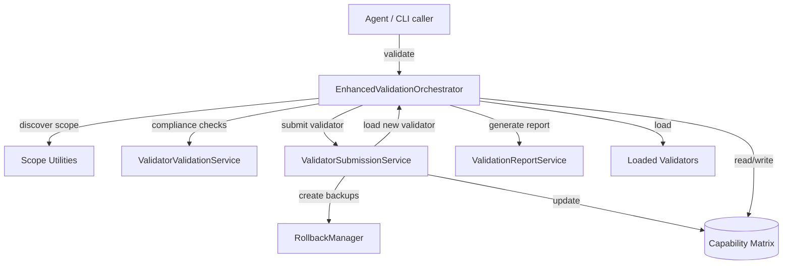

# Enhanced Validation System Architecture

## Executive Summary

The validation platform now follows a modular service architecture that keeps the `EnhancedValidationOrchestrator` focused on coordinating validators. Supporting responsibilities validator compliance, secure submission, reporting, and scope management are handled by dedicated services. This decomposition improves maintainability, encourages testability, and aligns with the platform goal of allowing agents to extend the validator catalog safely.

**What changed recently**:

- Validator compliance checks and sandbox tests live in `ValidatorValidationService`.
- The agent submission workflow (risk scoring, sandbox execution, integration, rollback hooks) moved to `ValidatorSubmissionService`.
- Markdown report generation and report-directory validation are centralised in `ValidationReportService`.
- Scope discovery, normalisation, and evidence helpers reside in `scope-utils.js` and are reused by validators during execution.
- The orchestrator now composes these services, tracks validator state, and owns the validation lifecycle.

---

## Architecture Overview

The orchestrator coordinates validator execution. When a new validator arrives it defers to `ValidatorSubmissionService`, which in turn relies on `ValidatorValidationService` to perform risk and compliance checks and on `RollbackManager` for backups. Reporting is delegated to `ValidationReportService`, so the orchestrator only passes the final validation result. Validators themselves use `scope-utils.js` for consistent file discovery and evidence formatting.

---

## Runtime Flow

1. **Initialisation**
   - Load enhanced configuration and the capability matrix.
   - Instantiate `ValidatorValidationService`, `ValidatorSubmissionService`, `ValidationReportService`, and `RollbackManager`.
   - Dynamically import validators listed in the capability matrix and verify their interfaces via the validation service.

2. **Validation Run**
   - Normalise project commands and compute scope patterns.
   - Use `scope-utils.js` helpers to expand scope, capture evidence, and respect size limits.
   - Fetch the correct validator instance and execute it under timeout monitoring.
   - Delegate Markdown generation to `ValidationReportService`.

3. **Agent Submission Workflow**
   - `ValidatorSubmissionService` handles new validator files. The service performs risk scoring, runs sandbox checks, calls back into `ValidatorValidationService` for interface compliance, copies the validator into the registry, updates the capability matrix, and reloads the validator through the orchestrator.
   - Rollback support is leveraged when an existing validator is replaced.

4. **Health Monitoring**
   - The orchestrator exposes health checks that confirm the presence and readiness of dependent services (`ValidatorValidationService`, `ValidatorSubmissionService`, `RollbackManager`) and the number of active validators.

---

## Core Modules

| Module | Location | Responsibilities |
|--------|----------|------------------|
| `EnhancedValidationOrchestrator` | `src/core/enhanced-orchestrator.js` | Lifecycle orchestration, validator loading, error handling, timeout management, report delegation |
| `ValidatorValidationService` | `src/core/validator-validation-service.js` | Risk assessment heuristics, sandbox execution, interface compliance verification |
| `ValidatorSubmissionService` | `src/core/validator-submission-service.js` | Secure submission pipeline, capability-matrix updates, integration hooks, rollback coordination |
| `ValidationReportService` | `src/core/validation-report-service.js` | Report directory validation, Markdown report rendering, helper formatting APIs |
| `scope-utils.js` | `src/core/scope-utils.js` | Scope discovery, minimatch-based filtering, evidence summarisation, scope warning collection |
| `RollbackManager` | `src/safety/rollback-manager.js` | Snapshot creation, rollback execution, backup retention |
| `InterfaceComplianceChecker` | `src/safety/interface-compliance-checker.js` | Defines the canonical validator contract and performs structural validation |

---

## Scope Management

The scope utilities expose a consistent API for validators and the orchestrator:

- **Pattern Normalisation** converts absolute or project-relative patterns to portable glob expressions.
- **Directory Walking** respects configurable depth, file-count, and size limits while skipping generated artefacts (e.g. `node_modules`, `dist`).
- **Evidence Helpers** summarise matched files, total size, and warnings for inclusion in validator results and final reports.
- **Filtering APIs** (`filterScopedFiles`) enable validators to refine scope to specific file sets without duplicating glob logic.

Validators should call `analyzeScope(projectPath, patterns, options)` to build their working set and then use `appendScopeEvidence` to report coverage back to the orchestrator.

---

## Safety & Compliance Layers

1. **Risk Assessment** lightweight static checks for dangerous APIs (`execSync`, `eval`, file mutations) and category multipliers.
2. **Sandbox Execution** dynamic import and smoke tests verifying the presence of mandatory validator methods.
3. **Interface Compliance** deep structural validation through `ValidatorValidationService.ensureInterfaceCompliance`.
4. **Rollback Workflow** backup existing validator assets before overwriting and allow recovery.
5. **Report Validation** ensure report directories exist and are writable before generating Markdown outputs.

---

## Extensibility Guidelines

- **Adding Validators**: Register the validator in `config/capability-matrix.json`, implement `getCapabilities`, `validate`, `runSelfDiagnostics`, and leverage `scope-utils` for file discovery.
- **Extending the Submission Pipeline**: Extend `ValidatorSubmissionService` (e.g. add static analysis) without modifying the orchestrator. Keep new checks pure so they can be unit tested.
- **Extending Reports**: `ValidationReportService` exposes a central location for new sections; orchestrator consumers automatically benefit once report formatting updates are in place.
- **Testing**: Prefer calling services directly in unit tests. Integration tests can instantiate the orchestrator with fixture capability matrices and override paths for isolation.

---

## Validation & Monitoring

- Run `node -e "import('./scripts/validation/tests/integration/test-enhanced-system.js').then(m => new m.default().runAllTests())"` for the core integration coverage. Additional fixtures may be required for the submission pipeline tests (capability matrix fixture, validator templates).
- Health checks surfaced by the orchestrator summarise validator counts, capability-matrix state, and availability of submission and safety services.

---

## Glossary

- **Capability Matrix** JSON registry that maps categories to validator modules and metadata.
- **Scope Result** Data structure returned by `scope-utils` containing the files matched and diagnostics about the discovery process.
- **Agent Submission** Workflow initiated when the CLI receives `--submit-validator`; handled entirely by `ValidatorSubmissionService`.
- **Validation Report** Markdown output generated per run via `ValidationReportService`, stored in the project's configured report directory.
