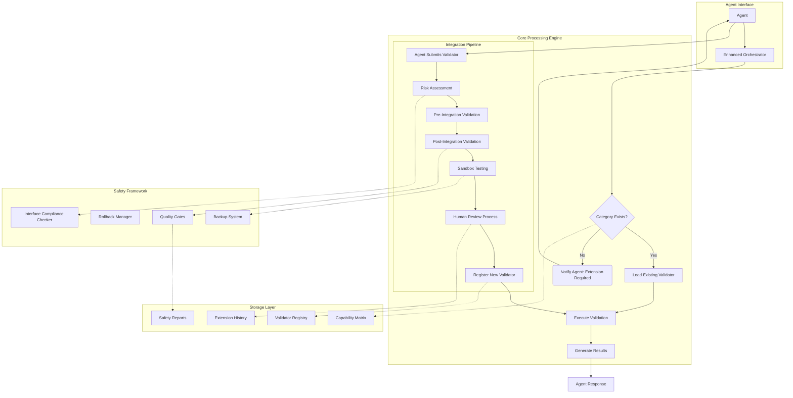
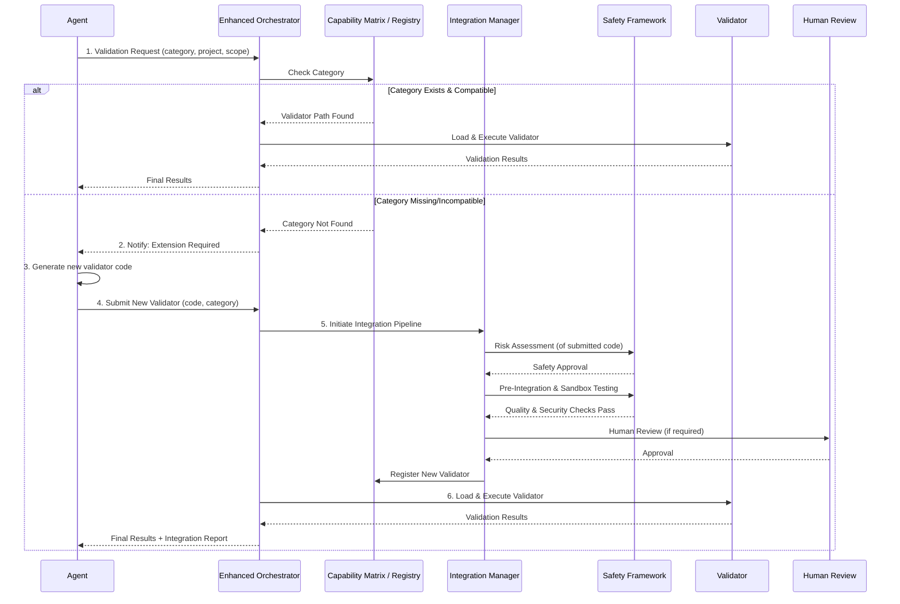
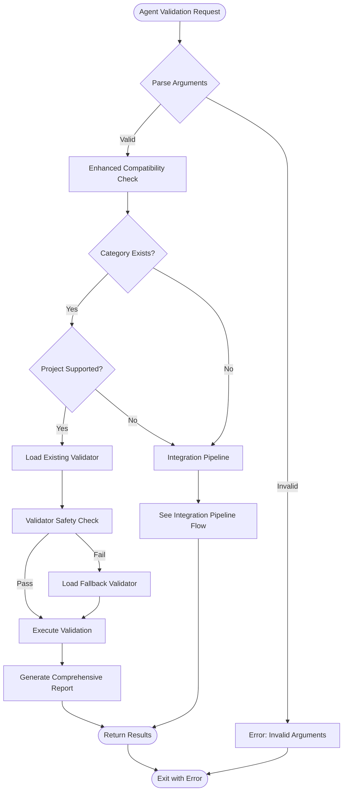
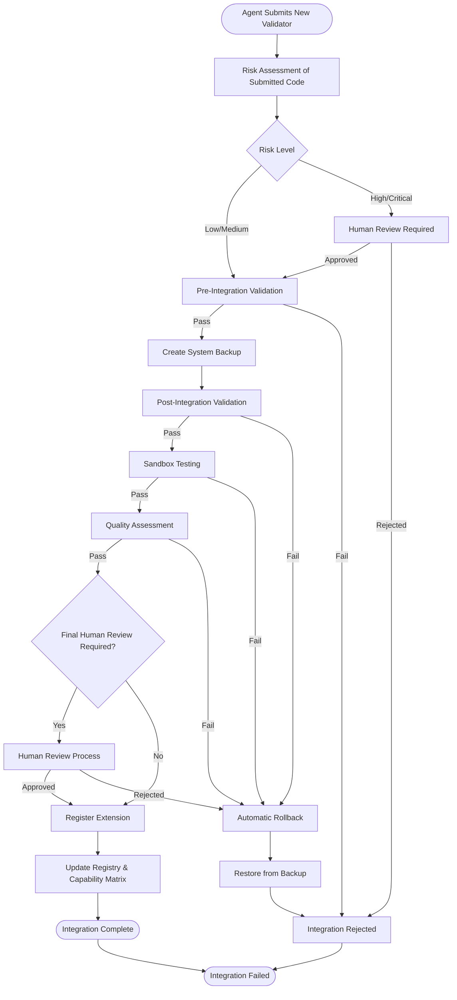
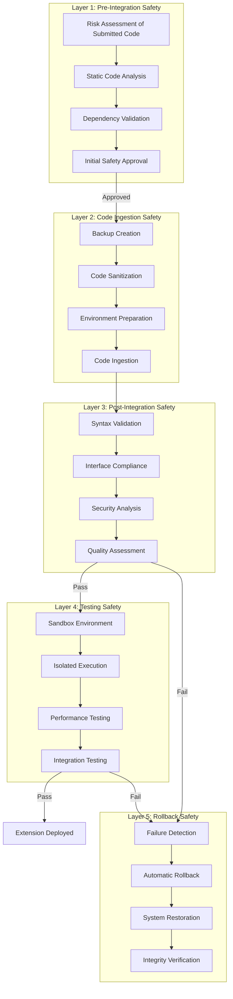

# Enhanced Validation System Architecture

## Executive Summary

The Enhanced Validation System is a secure validation framework that empowers an external agent to extend its capabilities. It combines a solid validation foundation with a robust integration pipeline for agent-generated code. The system's primary role is to act as a safe execution and validation environment, ensuring that any new, agent-written validator meets strict quality and safety standards before being integrated.

**Key Capabilities**:

- Secure integration of agent-generated validator extensions
- Multi-layered safety framework with automatic rollback
- Comprehensive monitoring and audit trail
- Interface compliance checking and quality assurance
- Human review process for critical extensions

---

## System Architecture

### Full System Diagram (Gemini Chat Assist)

```mermaid
sequenceDiagram
    participant Agent
    participant ValidationSystem as Enhanced Validation System
    participant NewCategoryTests as Agent's Self-Test Framework
    participant SecureIntegration as Secure Integration Pipeline (extension-manager.js)

    Agent->>ValidationSystem: 1. Validate project for new 'mobile' category
    ValidationSystem-->>Agent: 2. Respond: "Extension Required. Please submit a validator for 'mobile'."

    Agent->>Agent: 3. Generate 'mobile-validator.js' code
    
    Note over Agent, NewCategoryTests: Agent uses the provided framework to check its own work.
    Agent->>NewCategoryTests: 4. (Recommended) Run self-validation tests on 'mobile-validator.js'
    NewCategoryTests-->>Agent: 5. Self-validation passed (syntax, interface compliance, etc.)

    Agent->>ValidationSystem: 6. Submit new validator via --submit-validator flag
    ValidationSystem->>SecureIntegration: 7. Hand off submitted code for secure integration
    
    subgraph Secure Integration
        SecureIntegration->>SecureIntegration: 8a. Risk Assessment
        SecureIntegration->>SecureIntegration: 8b. Interface Compliance Check
        SecureIntegration->>SecureIntegration: 8c. Sandbox Execution Test
    end

    SecureIntegration-->>ValidationSystem: 9. Integration successful. Validator registered.
    
    Note over ValidationSystem: System now re-attempts the original request with the new validator.
    ValidationSystem->>ValidationSystem: 10. Execute validation for 'mobile' category
    ValidationSystem-->>Agent: 11. Return final validation results.
```

### High-Level Architecture Diagram



### Component Interaction Flow



---

## File Structure Architecture

### Current File Structure

```filesystem
validation/                                          [ROOT]
├── README.md                                        [Agent usage guide]
│
├── config/                                          [System configuration]
│   ├── capability-matrix.json                       - Enhanced with schema validation
│   ├── capability-schema.json                       - JSON schema for validation
│   ├── enhanced-config.json                         - System configuration
│   └── subagent-validation-config.json              - Subagent configuration
│
├── src/                                             [Core Enhanced Validation System]
│   ├── core/                                        [Main system components]
│   │   ├── enhanced-orchestrator.js                 - Main system orchestrator, handles requests
│   │   └── extension-manager.js                     - Manages integration of agent-submitted validators
│   │
│   ├── validators/                                  [Validator implementations]
│   │   ├── backend-validator.js                     - Backend/Service validation
│   │   ├── build-validator.js                       - Compilation/Build validation
│   │   └── enhanced-subagent-validator.js           - Subagent workflow validation
│   │
│   ├── safety/                                      [Safety framework components]
│   │   ├── interface-compliance-checker.js          - Contract validation
│   │   └── rollback-manager.js                      - Extension rollback capability
│   │
│   └── interfaces/                                  [TypeScript interface definitions]
│       ├── validator-interface.ts                   - Core validator contract
│       ├── extension-interface.ts                   - Extension metadata contract
│       └── safety-interface.ts                      - Safety check contracts
│
├── tests/                                           [Test framework]
│   ├── integration/                                 [Integration tests]
│   │   ├── test-enhanced-system.js                  - System integration tests
│   │   ├── test-complete-workflow.js                - Workflow tests
│   │   └── test-new-system.js                       - System tests
│   │
│   ├── unit/                                        [Unit tests]
│   │   ├── test-enhanced-validator.js               - Validator unit tests
│   │   └── test-framework.js                        - Test framework
│   │
│   ├── coverage/                                    [Coverage analysis]
│   │   ├── comprehensive-test-coverage.js           - Coverage measurement and reporting
│   │   ├── comprehensive-test-results.json          - Coverage analysis results
│   │   └── test-comprehensive-coverage-structure.js - Coverage structure validation
│   │
│   ├── data/                                        [Test data]
│   │   ├── backend-fail-scenario.js                 - Backend validation failure scenarios
│   │   ├── backend-pass-scenario.js                 - Backend validation success scenarios
│   │   └── edge-case-scenarios.js                   - Edge case test data
│   │
│   └── configs/                                     [Test configurations]
│       ├── failing-config.json                      - Configuration designed to fail validation
│       └── passing-config.json                      - Configuration designed to pass validation
│
├── docs/                                            [Documentation]
│   ├── architecture/                                [System architecture]
│   ├── agent-templates/                             [Templates for agent developers]
│   ├── implementation/                              [Implementation guides]
│   ├── guides/                                      [User guides]
│   └── reports/                                     [Project reports]
│
├── data/                                            [System data - auto-managed]
│   ├── extensions/                                  [Extension management]
│   │   ├── extension-history.json                   - Structured history log
│   │   └── generated/                               - Integrated validators
│   │       └── [category]-validator.js              - Runtime integrated
│   │
│   └── backups/                                     [Automatic backup system]
│       └── [timestamped-backups]                    - Safety backups
│
└── archive/                                         [Legacy files preserved]
    ├── deprecated-scripts/                          [5 deprecated scripts]
    ├── legacy-validators/                           [2 consolidated legacy validators]
    ├── test-artifacts/                              [3 test artifacts]
    ├── legacy-project-tools/                        [6 legacy project tracking tools]
    └── legacy-tests/                                [5 legacy unit tests]
```

---

## System Workflow Architecture

### Standard Validation Workflow (Gemini Chat Assist)



### Integration Pipeline Workflow



---

## Safety Framework Architecture

### Multi-Layer Safety System



### Safety Mechanisms Detail

| Safety Layer         | Components                                  | Purpose                                      | Automatic Actions            |
|----------------------|---------------------------------------------|----------------------------------------------|------------------------------|
| **Risk Assessment**  | Risk scoring, threat analysis               | Evaluate safety of agent-submitted code      | Block high-risk integrations |
| **Pre-Integration**  | Static analysis, dependency validation      | Ensure submitted code is plausible           | Reject unsafe code           |
| **Code Ingestion**   | Backup creation, code sanitization          | Safely prepare code for testing              | Sanitize malicious patterns  |
| **Post-Integration** | Syntax, compliance, security checks         | Validate ingested code against standards     | Auto-fix minor issues        |
| **Sandbox Testing**  | Isolated execution, performance testing     | Verify functionality without system impact   | Prevent system contamination |
| **Rollback System**  | Backup creation, automatic restoration      | Recovery from integration failures           | Restore previous state       |
| **Human Review**     | Manual oversight, quality approval          | Final quality gate for agent-submitted code  | Require explicit approval    |

---

## Component Architecture

### Core Components

#### 1. Enhanced Orchestrator (`core/enhanced-orchestrator.js`)

- **Purpose**: Main system coordination and workflow management
- **Responsibilities**:
  - Request routing and processing
  - Component coordination and integration
  - System health monitoring
  - Error handling and recovery
  - Metrics collection and reporting

#### 2. Extension Manager (`core/extension-generator.js`)

- **Purpose**: Manages the safe integration pipeline for agent-submitted validators
- **Responsibilities**:
  - Risk assessment of submitted code
  - Orchestration of pre/post integration validation
  - Sandbox testing coordination
  - Quality assessment and reporting on agent-submitted code

#### 3. Capability Matrix (`capability-matrix.json`)

- **Purpose**: System configuration and validator registry
- **Contents**:
  - Validator definitions and scopes
  - Project support mappings
  - Safety metadata and compliance status
  - Extension framework configuration

### Safety Components

#### 1. Interface Compliance Checker (`safety/interface-compliance-checker.js`)

- **Purpose**: Validate IValidator interface implementation
- **Features**:
  - Method signature validation
  - Property compliance checking
  - Batch validator validation
  - Detailed compliance reporting

#### 2. Rollback Manager (`safety/rollback-manager.js`)

- **Purpose**: Backup and recovery system management
- **Features**:
  - Automatic backup creation
  - Category-specific and full-system rollbacks
  - Backup verification and cleanup
  - Recovery process coordination

### Validator Components

#### 1. Backend Validator (`validators/backend-validator.js`)

- **Category**: Backend/Service Tasks
- **Scope**: `src/backend/**/*.ts`, `src/session/**/*.ts`, `src/transfer/**/*.ts`
- **Features**: Service discovery validation, API testing, integration checks

#### 2. Build Validator (`validators/build-validator.js`)

- **Category**: Compilation/Build Tasks
- **Scope**: Full project compilation
- **Features**: TypeScript compilation, dependency resolution, build process validation

### TypeScript Interfaces (`interfaces/`)

```typescript
// interfaces/validator-interface.ts
export interface IValidator {
  category: string;
  version: string;
  scopes: string[];

  validate(projectInfo: ProjectInfo, scopeConfig: ScopeConfig, options: ValidationOptions): Promise<ValidationResult>;
  getCapabilities(): ValidatorCapabilities;
  checkInterfaceCompliance(): boolean;
  runSelfDiagnostics(): DiagnosticResult;
  getMetadata(): ValidatorMetadata;
}

// interfaces/extension-interface.ts
export interface IExtensionManager {
  integrateValidator(validatorCode: string, requirements: ExtensionRequirements): Promise<IntegrationResult>;
  validateSubmittedCode(filePath: string): Promise<ValidationResult>;
}

// interfaces/safety-interface.ts
export interface ISafetyFramework {
  assessRisk(requirements: ExtensionRequirements): RiskAssessment;
  validateCompliance(validator: IValidator): ComplianceResult;
  rollback(backupId: string): Promise<RollbackResult>;
}

// interfaces/types.ts
export type ProjectInfo = { /* ... */ };
export type ValidationResult = { /* ... */ };
// ... other common types
