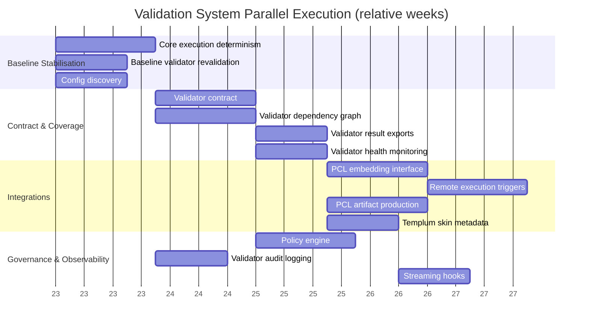

# Validation System Progress Tracker

Legend: `[x]` done · `[~]` in progress · `[ ]` not started · `[!]` broken · `[?]` verify · `[P]` pending investigation

## Orchestrator Core

- [?] [Core execution loop deterministic across projects](../../dev/tasks/core-execution-determinism.md) (requires recent smoke tests)
- [ ] [Validator dependency graph support](../../dev/tasks/validator-dependency-graph.md) (pre/post checks, shared resources)
- [ ] [Configuration discovery with schema validation](../../dev/tasks/config-discovery.md) (ensure configs align with new structure)

## Validator Modules

- [~] [Baseline categories maintained](../../dev/tasks/baseline-validator-revalidation.md) (backend/ui/core/build/quality; re-run to confirm outputs)
- [ ] [New validator contract documentation and enforcement](../../dev/tasks/validator-contract.md)
- [ ] [Machine-readable result exports standardised](../../dev/tasks/validator-result-exports.md) (JSON/JUnit)

## Integration Points

- [ ] [API and CLI interface for embedding in PCL workflows](../../dev/tasks/pcl-embedding-interface.md) (roadmap item)
- [ ] [Artifact production for PCL traceability](../../dev/tasks/pcl-artifact-production.md) (align with QMS design)
- [ ] [Remote execution triggers with idempotent reruns](../../dev/tasks/remote-execution-triggers.md) (CI/agent workflows)

## Observability & Governance

- [ ] [Audit logging of executions with environment metadata](../../dev/tasks/validator-audit-logging.md)
- [ ] [Validator health and performance monitoring](../../dev/tasks/validator-health-monitoring.md)
- [ ] [Policy engine for required validators per release type](../../dev/tasks/policy-engine.md)

## Interface Enablement

- [ ] [Skin metadata for Templum visualisation](../../dev/tasks/templum-skin-metadata.md) (future goal)
- [ ] [Streaming and subscription hooks for progress updates](../../dev/tasks/streaming-hooks.md)

## Action Items

- Re-run key categories across Templum, PCL, Haruspex to refresh assurance.
- Align outputs with QMS reporting to prepare for integration into Phoenix Code Lite.

## Step 0 — Playbook Setup

- Prepare milestone playbooks before executing streams:
  - Candidate playbooks: baseline stabilization, validator contract enforcement, policy engine rollout, streaming/progress visibility.
- Use `meta/templates/milestone-playbook.md`, cross-reference `meta/ARCHITECTURE.md`, and consult `scripts/validation/dev/tasks/validation_task_dependencies.json` for dependency planning.
- Add milestone markers to the Gantt chart and list each playbook under Action Items once created.
- Share `dev/agent-briefing-template.md` with assigned agents at kickoff.
- Verify smoke/validation scripts referenced in playbooks exist; create stubs when necessary before starting the milestone.

## Parallel Execution Plan

### Dependency Highlights

- Core execution determinism and baseline validator revalidation must land first; remote triggers and automation rely on deterministic ordering.
- Validator result exports provide the canonical JSON feed that PCL artifact production and downstream integrations consume—finalise exports before building traceability packs.
- PCL embedding interface is a prerequisite for remote execution triggers; finish the CLI/API contract before automation.
- Policy engine depends on accurate configs, result exports, and (eventually) the dependency graph—schedule it after baseline contract work.
- Templum skin metadata can proceed once result exports exist but should coordinate with streaming hooks so both surfaces emit consistent payloads.

### Phase Matrix

| Phase | Dependencies cleared | Parallel work packages | Unlocks |
| --- | --- | --- | --- |
| 1 · Baseline Stabilisation | None | Core execution determinism · Baseline validator revalidation · Config discovery | Confirms orchestrator determinism and schema validity |
| 2 · Contract & Coverage | Phase 1 stable | Validator contract enforcement · Validator dependency graph · Validator result exports · Validator health monitoring | Provides authoritative validator model, ordering, and telemetry |
| 3 · Integrations | Phases 1–2 outputs | PCL embedding interface · Remote execution triggers · PCL artifact production · Templum skin metadata | Enables external clients (PCL, Templum) to consume results |
| 4 · Governance & Observability | Phases 2–3 artefacts | Policy engine · Validator audit logging · Streaming hooks | Delivers compliance gating and live progress visibility |

### Workstream Lanes

- **Orchestrator Core:** core execution determinism, config discovery, dependency graph.
- **Validator Contract & Telemetry:** validator contract, health monitoring, audit logging, result exports.
- **Integrations:** PCL embedding interface, artifact production, remote execution triggers.
- **Visualization & UX:** templum skin metadata, streaming hooks.
- **Governance:** policy engine (ties together configuration, dependency, and audit data).

### Risk and Coordination Notes

- Re-run smoke suites after each baseline change to ensure deterministic execution before layering integrations.
- Coordinate schema changes (config, capability matrix, policy) with Phoenix Code Lite to prevent mismatch in release gating.
- Artifact production depends on finalized export format—publish export schema revisions early.
- Streaming hooks and skin metadata should emit identical event structures so Templum and CLI consumers share adapters.
- Keep audit logs and policy outputs in sync; policy decisions should reference audit evidence for compliance packages.

### Gantt Snapshot (relative weeks, adjust durations per sprint)

### Scheduling Worksheet Template

Use `meta/templates/milestone-playbook.md` to capture Validation System milestones (e.g., policy engine rollout). File completed playbooks under `meta/workflows/` and mirror their artifact paths in `reports/validation/`. Update this tracker after each milestone review with status notes and outstanding follow-ups.
